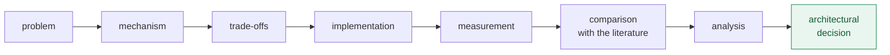

# Overview — what this material is, and how to read it

*Leia em [português](README.md).*

This section answers the questions that come before the technical content: **what
is studied here, what is assumed of the reader, by what method, and on which
machine the numbers were obtained.**

## Contents

1. [What this material is](#1-what-this-material-is)
2. [What is assumed of the reader](#2-what-is-assumed-of-the-reader)
3. [The method](#3-the-method)
4. [How to read the numbers](#4-how-to-read-the-numbers)
5. [The measurement environment](#5-the-measurement-environment)
6. [In this section](#6-in-this-section)

---

## 1. What this material is

The short description would be "a DPDK study guide". It is true and incomplete,
because DPDK appears here less as a subject and more as an **instrument**:

> An experimental study of data-plane software, using DPDK as a platform to
> investigate mechanisms, cost, predictability and architectural decisions in
> high-performance systems.

The difference is not rhetorical. It decides what goes in and what stays out:

| A DPDK course would | This material does |
|---|---|
| walk the API, library by library | start from a problem and arrive at the API that solves it |
| show that DPDK is fast | **measure** how much, under what conditions, and when it does not pay off |
| teach the recommended configuration | show what each option costs, and what it turns off |
| treat DPDK as the answer | treat it as an answer, alongside others |

That is why the repository carries a [pure C++23 alternative](../../trilha/01-fundamentos/02-mempool-ring/alternativas/cpp23/)
for the same problem — and concludes, with numbers, that **in memory and on a
single core, it wins**. A DPDK course would have no interest in publishing that.

DPDK is the protagonist of the material; it is not the automatic winner of every
comparison.

---

## 2. What is assumed of the reader

The track goes from beginner to advanced **in DPDK**, not in systems programming.
Saying so openly is more honest — and more useful — than promising that anyone
starts from zero.

Familiarity is recommended with:

| Area | Expected level |
|---|---|
| C | reading and writing; pointers, `struct`, allocation |
| C++ | optional — only the comparative alternatives use it (C++23) |
| Linux | command line, processes, permissions |
| Concurrency | what a thread is, and why two of them contend |
| Memory | stack, heap, and the notion that virtual memory exists |
| Networking | packet, header, what a network card does |
| Build | compiling, linking, reading a compiler error message |

**What is not assumed**, and the material teaches from zero: address translation
and the TLB, hugepages, NUMA, cache coherence, false sharing, CPU affinity, IOMMU
and DMA, per-packet budget, and naturally all of DPDK.

> **A missing piece of knowledge does not prevent starting.** The
> [fundamentals](../01-fundamentos/README.en.md) build the memory, execution and
> networking base before DPDK appears. But the material **does not re-explain** C
> or Linux at an introductory level: anyone who needs that will want a parallel
> source, and will not find it here.

---

## 3. The method

Every topic follows the same path, and it is worth knowing beforehand what to
expect from each section:



In words:

1. **Problem** — what real constraint exists, before any API.
2. **Mechanism** — how the thing works inside, and why it behaves that way.
3. **Trade-offs** — what it costs, what it turns off, when it does not fit.
4. **Implementation** — runnable code, with tests.
5. **Measurement** — a number obtained on this machine, with a declared method.
6. **Comparison** — does the number match the literature? If not, why?
7. **Analysis and decision** — what this would change in a real project.

Two editorial rules hold the path up, and both were born from a mistake made:

**A numeric claim needs a program that produces it.** Numbers that circulate as
folklore are verified, and when they do not hold up, the material corrects itself —
that was the case with the cost of `malloc()`, which we
[measured at 2.18 ns](../03-mempool-ring-mbuf/README.en.md#1-why-not-use-malloc--the-measured-answer)
against the "tens of nanoseconds" the track itself kept repeating.

**A normative claim needs to name who defines it.** When the text says a limit
exists, it says whose limit it is — ITU-T, IEEE, an RFC, the DPDK documentation.
Wikipedia is not an accepted source in this material.

---

## 4. How to read the numbers

This material mixes, in the same paragraph, things of different status: what was
measured, what was read in the documentation, and what is interpretation.
Confusing them leads to generalising one machine's result as a property of the
architecture.

The convention, applied in the language rather than in labels:

| When the text says | It means |
|---|---|
| "on this machine", "we measured", with a table | **measurement** — reproducible by the cited program |
| "the documentation says", with a citation and link | **documented fact** — verifiable at the source |
| "that is", "the reading is", "the consequence" | **inference** — interpretation, and it may be wrong |
| "we did not investigate", "left open" | **pending** — observed, with no confirmed mechanism |

Every document has a **Limitations** section recording what the numbers do *not*
authorise you to conclude. It is not a formality: it is where the material says
what it does not yet know.

And there are two things this project's measurement separates on purpose, because
they are not the same:

**Performance is not predictability.** A low mean does not imply stable behaviour.
That is why latency is published by percentiles — median, p75, p99 — and never by
the mean alone; and that is why the tables carry dispersion alongside the typical
value. A system with a 10 µs mean and a 5 ms p99.9 has good performance and bad
predictability, and the mean hides exactly that. The vocabulary is in
[§7 of the fundamentals](../01-fundamentos/README.en.md#7-metrics-the-vocabulary-for-not-fooling-yourself).

---

## 5. The measurement environment

**An experimental result without hardware context is not a universal result.**
Every number published here comes from a specific machine, and the same measurement
on another machine may give a different value — not through error, but because the
hardware is part of the experiment.

So as not to describe the machine in prose (which diverges between files and ages
silently), the record is **generated**:

```bash
./scripts/ambiente.sh              # human-readable
./scripts/ambiente.sh --markdown   # table to paste into a document
```

It reports what actually changes a result: CPU model and topology, **L3 cache
domains**, TSC flags, *governor* and turbo, hugepages, the kernel and its command
line, CPU mitigations, NIC and driver, and the DPDK, compiler and build versions.

Three of those fields have already changed a conclusion in this project:

- **`meltdown: Not affected`** explained why the syscall is cheaper here than in
  the literature — with no KPTI, there is no page-table switch.
- **the absence of `tsc_known_freq`** explained the
  [100 ms of calibration](../02-runtime-dpdk/README.en.md#22-why-that-wait-exists-and-when-it-does-not-happen)
  inside `rte_eal_init()`.
- **the L3 domains** (`0-5,12-17` and `6-11,18-23`) are what separates "same CCD"
  from "different CCDs" in the core-to-core communication measurements.

> Run the script before comparing any number of yours with the ones here. If the
> *governor* is on `powersave` with turbo enabled — which is the default on most
> distributions, and this machine's — the frequency varies during the measurement,
> and that is why the documents publish median and dispersion instead of a single
> value.

---

## 6. In this section

- **[Project tooling](ferramental.en.md)** — build, compilation and L1/L2 tests: which
  tools the project uses, why each was chosen, what was discarded (Conan, vcpkg,
  CMake) and the concrete mistakes those decisions avoid.

## Navigation

| | |
|---|---|
| **Next** | [01 — Fundamentals](../01-fundamentos/README.en.md) |
| **Index** | [Documentation](../README.en.md) · [Study plan](../plano-estudo-dpdk.en.md) · [Project README](../../README.en.md) |
