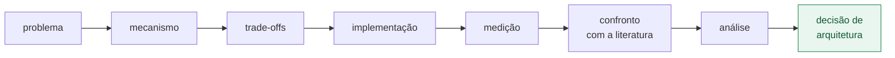

# Visão geral — o que este material é, e como lê-lo

Esta seção responde às perguntas que vêm antes do conteúdo técnico: **o que se
estuda aqui, o que se pressupõe do leitor, com que método, e em que máquina os
números foram obtidos.**

## Índice

1. [O que este material é](#1-o-que-este-material-é)
2. [O que se pressupõe do leitor](#2-o-que-se-pressupõe-do-leitor)
3. [O método](#3-o-método)
4. [Como ler os números](#4-como-ler-os-números)
5. [O ambiente de medição](#5-o-ambiente-de-medição)
6. [Nesta seção](#6-nesta-seção)

---

## 1. O que este material é

A descrição curta seria "um guia de estudo de DPDK". Ela é verdadeira e
incompleta, porque o DPDK aparece aqui menos como assunto e mais como
**instrumento**:

> Um estudo experimental de software de plano de dados, que usa o DPDK como
> plataforma para investigar mecanismos, custo, previsibilidade e decisões de
> arquitetura em sistemas de alto desempenho.

A diferença não é retórica. Ela decide o que entra e o que fica de fora:

| Um curso de DPDK faria | Este material faz |
|---|---|
| percorrer a API, biblioteca por biblioteca | partir de um problema e chegar à API que o resolve |
| mostrar que o DPDK é rápido | **medir** quanto, em que condições, e quando não compensa |
| ensinar a configuração recomendada | mostrar o que cada opção custa, e o que ela desliga |
| tratar o DPDK como resposta | tratá-lo como uma resposta, ao lado de outras |

É por isso que o repositório carrega uma [alternativa em C++23 puro](../../trilha/01-fundamentos/02-mempool-ring/alternativas/cpp23/)
para o mesmo problema — e conclui, com números, que **em memória e num núcleo só,
ela ganha**. Um curso de DPDK não teria interesse em publicar isso.

O DPDK é o protagonista do material; não é o vencedor automático de toda
comparação.

---

## 2. O que se pressupõe do leitor

A trilha vai de iniciante a avançado **em DPDK**, não em programação de sistemas.
Dizer isso abertamente é mais honesto — e mais útil — do que prometer que
qualquer pessoa começa do zero.

Recomenda-se familiaridade com:

| Área | Nível esperado |
|---|---|
| C | ler e escrever; ponteiros, `struct`, alocação |
| C++ | opcional — só as alternativas comparativas o usam (C++23) |
| Linux | linha de comando, processos, permissões |
| Concorrência | o que é uma thread, e por que duas delas disputam |
| Memória | pilha, heap, e a noção de que existe memória virtual |
| Redes | pacote, cabeçalho, o que faz uma placa de rede |
| Build | compilar, ligar, ler uma mensagem de erro do compilador |

**O que não se pressupõe**, e o material ensina do zero: tradução de endereço e
TLB, hugepages, NUMA, coerência de cache, falso compartilhamento, afinidade de
CPU, IOMMU e DMA, orçamento por pacote, e naturalmente todo o DPDK.

> **Um conhecimento em falta não impede começar.** Os
> [fundamentos](../01-fundamentos/README.md) constroem a base de memória,
> execução e rede antes de o DPDK aparecer. Mas o material **não reexplica** C
> nem Linux em nível introdutório: quem precisar disso vai querer uma fonte
> paralela, e não vai encontrá-la aqui.

---

## 3. O método

Todo tópico segue o mesmo percurso, e vale conhecê-lo antes para saber o que
esperar de cada seção:



Em palavras:

1. **Problema** — que restrição real existe, antes de qualquer API.
2. **Mecanismo** — como a coisa funciona por dentro, e por que se comporta assim.
3. **Trade-offs** — o que ela custa, o que ela desliga, quando não serve.
4. **Implementação** — código executável, com testes.
5. **Medição** — número obtido nesta máquina, com método declarado.
6. **Confronto** — o número bate com a literatura? Se não, por quê?
7. **Análise e decisão** — o que isso mudaria num projeto real.

Duas regras editoriais sustentam o percurso, e as duas nasceram de erro cometido:

**Afirmação numérica precisa de programa que a produza.** Números que circulam
como folclore são verificados, e quando não se sustentam, o material corrige a si
mesmo — foi o caso do custo do `malloc()`, que
[medimos em 2,18 ns](../03-mempool-ring-mbuf/README.md#1-por-que-não-usar-malloc--a-resposta-medida)
contra as "dezenas de nanossegundos" que a própria trilha repetia.

**Afirmação normativa precisa nomear quem a define.** Quando o texto diz que um
limite existe, ele diz de quem é o limite — ITU-T, IEEE, RFC, a documentação do
DPDK. Wikipédia não é fonte aceita neste material.

---

## 4. Como ler os números

Este material mistura, no mesmo parágrafo, coisas de estatutos diferentes: o que
foi medido, o que foi lido na documentação, e o que é interpretação. Confundi-las
leva a generalizar um resultado de uma máquina como propriedade da arquitetura.

A convenção, aplicada na linguagem em vez de em etiquetas:

| Quando o texto diz | Significa |
|---|---|
| "nesta máquina", "medimos", com tabela | **medição** — reproduzível pelo programa citado |
| "a documentação diz", com citação e link | **fato documentado** — verificável na fonte |
| "ou seja", "a leitura é", "a consequência" | **inferência** — interpretação, e pode estar errada |
| "não investigamos", "fica em aberto" | **pendente** — observado, sem mecanismo confirmado |

Todo documento tem uma seção **Limitações** que registra o que os números *não*
autorizam a concluir. Ela não é formalidade: é onde o material diz o que ainda
não sabe.

E há duas coisas que a medição deste projeto separa de propósito, porque não são
a mesma:

**Desempenho não é previsibilidade.** Uma média baixa não implica comportamento
estável. Por isso latência é publicada por percentis — mediana, p75, p99 — e
nunca só por média; e por isso as tabelas trazem dispersão junto do valor típico.
Um sistema com média de 10 µs e p99,9 de 5 ms tem desempenho bom e
previsibilidade ruim, e a média esconde exatamente isso. O vocabulário está na
[§7 dos fundamentos](../01-fundamentos/README.md#7-métricas-o-vocabulário-para-não-se-enganar).

---

## 5. O ambiente de medição

**Resultado experimental sem contexto de hardware não é resultado universal.**
Todos os números publicados aqui vêm de uma máquina específica, e a mesma medição
em outra máquina pode dar outro valor — não por erro, mas porque o hardware é
parte do experimento.

Para não descrever a máquina em prosa (o que diverge entre arquivos e envelhece
em silêncio), o registro é **gerado**:

```bash
./scripts/ambiente.sh              # legível
./scripts/ambiente.sh --markdown   # tabela para colar num documento
```

Ele reporta o que efetivamente muda um resultado: modelo e topologia da CPU,
**domínios de cache L3**, sinalizadores de TSC, *governor* e turbo, hugepages,
kernel e sua linha de comando, mitigações de CPU, NIC e driver, e as versões de
DPDK, compilador e build.

Três desses campos já mudaram uma conclusão neste projeto:

- **`meltdown: Not affected`** explicou por que a syscall aqui é mais barata que
  na literatura — sem KPTI, não há troca de tabela de páginas.
- **ausência de `tsc_known_freq`** explicou os
  [100 ms de calibração](../02-runtime-dpdk/README.md#22-por-que-essa-espera-existe-e-quando-ela-não-acontece)
  dentro de `rte_eal_init()`.
- **os domínios de L3** (`0-5,12-17` e `6-11,18-23`) são o que separa "mesmo CCD"
  de "CCDs diferentes" nas medições de comunicação entre núcleos.

> Rode o script antes de comparar qualquer número seu com os daqui. Se o
> *governor* estiver em `powersave` e o turbo ligado — que é o padrão da maioria
> das distribuições, e o desta máquina — a frequência varia durante a medição, e
> é por isso que os documentos publicam mediana e dispersão em vez de um valor
> só.

---

## 6. Nesta seção

- **[Ferramental do projeto](ferramental.md)** — build, compilação e testes
  L1/L2: quais ferramentas o projeto usa, por que cada uma foi escolhida, o que
  foi descartado (Conan, vcpkg, CMake) e os erros concretos que essas decisões
  evitam.

## Navegação

| | |
|---|---|
| **Próximo** | [01 — Fundamentos](../01-fundamentos/README.md) |
| **Índice** | [Documentação](../README.md) · [Plano de estudo](../plano-estudo-dpdk.md) · [README do projeto](../../README.md) |
