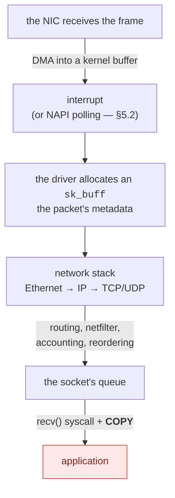
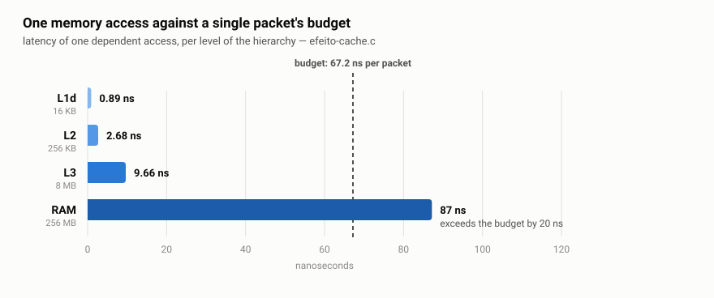
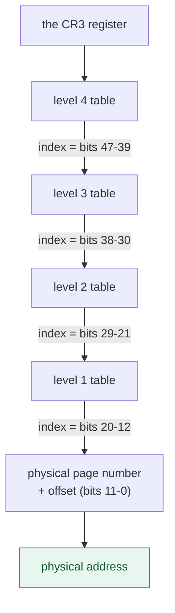
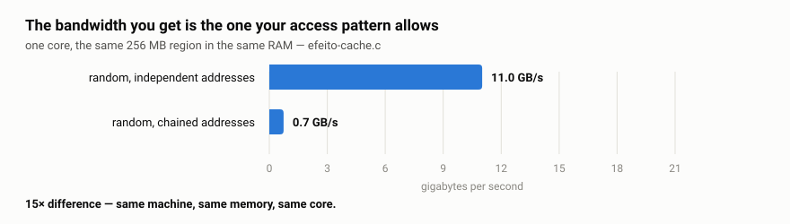
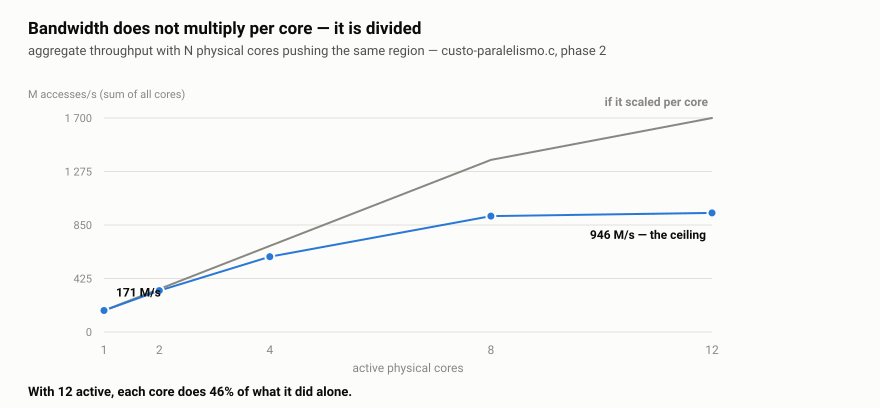
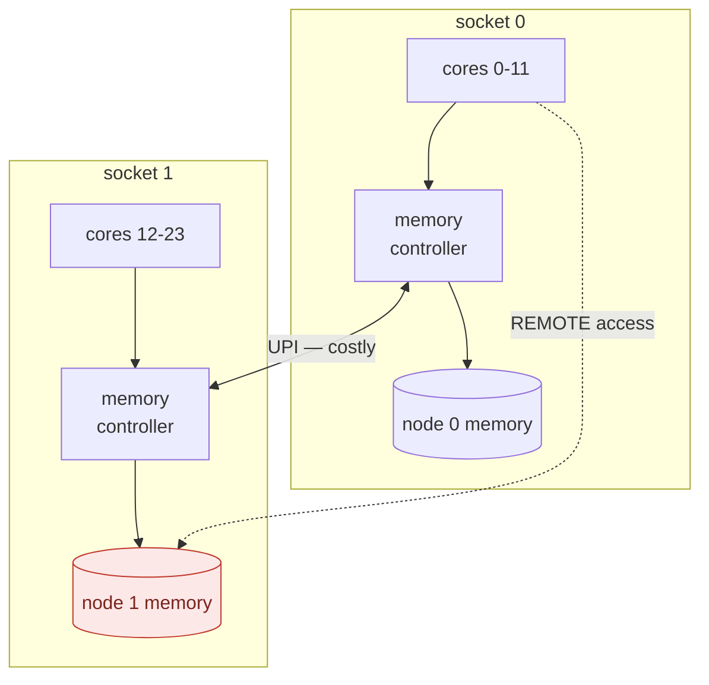
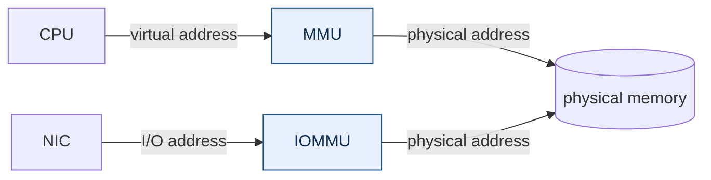

# Fundamentals — the problem, before the tool

<!-- cita-retratado: 0,227 0.227 14,2 14.2 0,437 0.437 -->
<!-- These values were retracted elsewhere in the material and reappear
     here as a NEW measurement from the text-mode collection. The
     coincidence is numeric, not of quantity: `0.227` is the range
     minimum of `atomic relaxed`, `14.2` is the instrument resolution of
     custo-anel and `0.437` is the mempool bulk at batch 128. -->

*Leia em [português](README.md).*

> **Levels 1 and 2** of the [study plan](../plano-estudo-dpdk.en.md) ·
> No prerequisites · Next: [The DPDK runtime](../02-runtime-dpdk/)

This document does not talk about DPDK. It establishes **why DPDK needs to exist** —
and it does so with numbers you can reproduce on your machine in under a minute
(section 9).

The thesis is simple: on high-rate networks, the time available per packet is so short
that the operating system's comfortable abstractions stop fitting inside it.
Understanding *how much* they cost is what separates engineering from folklore.

> **One term, before we start.** This document speaks throughout of the **data
> plane**. It is worth clearing up an ambiguity the Portuguese original has to handle:
> "plane" here is not a plan, it is a **layer** — as in a geometric plane. You also
> find "forwarding plane", which is a synonym.
>
> The distinction the term carries is between two parts of a network system:
>
> | | What it does | How often it runs |
> |---|---|---|
> | **Control plane** | decides routes, configuration, policy | rarely — when the topology changes |
> | **Data plane** | handles **every packet**: receives, classifies, forwards | millions of times per second |
>
> Everything in this document refers to the second. That is why a cost of three
> hundred nanoseconds, irrelevant in the control plane, decides the entire design in
> the data plane: there it is paid once; here, per packet.
>
> The sibling term is **hot path**: the stretch of code executed once per packet,
> where every cycle and every allocation costs throughput.

---

## By the end of this module you will be able to

1. **compute the per-packet time budget** for a rate and a frame size, and say what
   fits inside it;
2. **explain why crossing the user/kernel boundary** costs what it costs, and measure
   that cost on your machine;
3. **identify false sharing** in your own code, and fix it;
4. **predict the effect of locality** — sequential versus random, 4 KB pages versus
   2 MB — before measuring;
5. **decide where to pin a thread** from the machine's cache topology, and justify the
   choice with a number;
6. **choose between one synchronisation primitive and another** knowing the price of
   each without contention and under contention;
7. **read a latency metric** without fooling yourself: median versus mean,
   percentile, dispersion, and why the mean lies;
8. **tell latency from throughput** when reading any memory measurement, and
   choose between the tuning levers knowing which one improves the first without
   improving the second — and what each of them costs.

---

## 1. The budget: how much time exists per packet

Everything starts here, and it is the **IEEE** that defines the numbers, in the
[802.3][ieee8023] standard — the Ethernet specification. It establishes that each
frame carries 20 bytes of overhead beyond the data: **7 of preamble, 1 of
start-of-frame delimiter and 12 of interframe gap**, and that the minimum frame is
**64 bytes**. Adding up, a minimum frame occupies **84 bytes on the wire**.

At 10 Gbit/s:

```
10 000 000 000 bits/s ÷ (84 bytes × 8 bits) = 14 880 952 packets/s
1 s ÷ 14 880 952 = 67.2 nanoseconds per packet
```

| Speed | Frame | Maximum rate | Time per packet |
|---|---|---:|---:|
| 10 GbE | 64 B | 14.88 Mpps | **67.2 ns** |
| 10 GbE | 1500 B | 0.82 Mpps | 1216 ns |
| 25 GbE | 64 B | 37.2 Mpps | 26.9 ns |
| 100 GbE | 64 B | 148.8 Mpps | **6.7 ns** |

Two important readings:

**The frame size changes everything.** The same 10 GbE link demands 18 times more
decisions per second with small frames. That is why serious *benchmarks* always
declare the frame size — "10 Gbps" without that information says nothing about CPU
load.

**67 ns is very little time.** On a 3 GHz CPU, that is about 200 cycles. It is the total budget
to receive, examine, decide and transmit. Keep that number: it is the criterion for
judging everything that follows.

---

## 2. The user-space / kernel-space boundary

The operating system separates two execution modes: the application's code
(*user space*) and the kernel's. Every time the application needs a service from the
kernel — reading a socket, for instance — it crosses that boundary through a
[system call][syscall].

The crossing is not free. It switches the processor's mode, saves and restores
registers, and pollutes the cache and the branch predictor. Measured on this reference
machine ([`custo-syscall.c`](medicoes/custo-syscall.c)):

```
  measurement                           median  p25-p75 (IQR)   range min-max      disp    CV
  ---------------------------------- ---------  --------------- ----------------- ----- -----
  function call (user-space)             0.726  0.719-0.727     0.718-0.828         1.1%   2.9%
  clock_gettime (vDSO, no trap)          15.52  15.51-15.52     15.51-15.67         0.1%   0.3%
  real syscall (SYS_getpid)              33.32  33.31-33.33     33.27-33.39         0.1%   0.1%

  a syscall costs 46x a function call

10 GbE budget with 64 B frames: 67.2 ns per packet
  syscalls that fit in that budget: 2.02

  The traditional kernel path spends at least one syscall per
  packet batch, plus interrupt, sk_buff allocation and a copy.
```

> **Two corrections led to these numbers**, and both are told in the
> [methodology](metodologia.en.md#1-2--the-two-corrections-to-custo-syscall): an
> earlier version published 0.115 ns because the compiler eliminated the
> reference call, and the syscall/call ratio came out 22% low for not declaring
> it had been measured cold. The current benchmark checks the assembly; the
> chapter's conclusion never depended on the ratio.

> **And a third one, of method.** This table used to publish 0.924 ns for the
> function call, with a `disp` of 0.4% — a clean seal, and correct for that
> collection. Running the same binary twenty times, nineteen runs give between
> 0.713 and 0.750: the published value was the rare mode. The syscall does not
> move (33.2 ns in every run), so the chapter's argument does not depend on
> this; what changes is the ratio, from 36× to 44–46×.
>
> **Clean dispersion within a collection says nothing about the variation
> between collections**, and for that there is no seal — there is running the
> program again, with
> [`variacao-entre-execucoes.py`](../../ferramental/qualidade/variacao-entre-execucoes.py).
> <!-- retratado: 0.924 0,924 -->

The table's columns are explained in [§7](#percentile-what-p99-means) and in
[§9](#9-validation-reproduce-it-on-your-machine); for now the median is enough.

The central result: **about two system calls fit in one packet's budget.** And
`getpid()` is the cheapest syscall there is — it does no I/O, touches no user memory,
does not sleep. A real `recvmsg()` costs far more.

Note that this result **did not depend** on the wrong number: it comes from 33.3 ns
against a 67.2 ns budget, and the function call does not enter the account. What the
correction changed was the syscall/call ratio — from "294×" to the 36× to 46× range
depending on the measurement regime, handled in the warning above — which is a
soundbite, not the argument. The argument is the budget.

The [vDSO][vdso] case deserves attention because it anticipates the whole idea: the
kernel maps some functions directly into the process's space, so that
`clock_gettime()` executes **without a trap** — and therefore costs 16 ns instead of
33. It is the same strategy DPDK will take to the extreme: taking the boundary out of
the hot path.

---

## 3. A packet's traditional path

It is worth knowing the standard path before contesting it, because it is excellent at
what it was designed for: generality, isolation and correctness.



Each stage charges:

| Stage | Cost |
|---|---|
| Interrupt | a context switch; mitigated by [NAPI][napi], which switches to *polling* under load (§5.2) |
| `sk_buff` allocation | a ~200-byte structure per packet, allocated and freed |
| Traversing the stack | generality: it handles all protocols and all options |
| `recv()` | a syscall (~33 ns minimum) plus a **copy** of the data |

None of that is waste in the general case — it is the price of a stack that works for
any application, with isolation between processes. The problem appears only when the
budget falls to 67 ns.

> **What DPDK does:** it removes all those stages from the data path. The NIC is
> detached from the kernel driver and bound to [`vfio-pci`][drivers]; a driver in
> *poll mode* — which asks in a loop whether a packet arrived, instead of waiting to be
> told, and is defined in
> [§5.2](#52-polling-the-question-the-data-plane-answers-differently) — inside the
> process reads the NIC's descriptors directly. No interrupt, no `sk_buff`, no generic
> stack, no syscall, no copy. The cost of that choice is the subject of section 8.

---

## 4. Memory: where performance is really decided

This is the chapter where the document stops describing the machine and starts
**arming decisions**. Each section ends with what it lets you tune and what that
tuning costs; [§4.4](#44-decision-map-what-to-tune-and-what-it-costs) gathers it
all into one map. Before the mechanisms, though, three quantities — because
confusing them is the costliest mistake in a data plane, and this document has
already made it (see the retraction in [§4.2](#42-cache-and-locality)).

> **Latency** — how long **one** access takes, from request to the data arriving.
> Two things the same word covers are worth separating: the **physical latency**
> of an access that reaches DRAM is a property of the machine and you do not
> reduce it by writing better code; the **latency your program observes** is
> another thing, and it does change — because you decide whether the access
> reaches DRAM at all.
>
> **Throughput** — how many accesses per second the machine completes. It is
> **not** the inverse of latency, and that is the central idea of this chapter.
>
> **Bandwidth** — how many bytes per second move. It is the physical ceiling
> where throughput stops growing.

The relation between them fits on one line, and is known as **Little's Law**
([Little, 1961][little61]):

```
throughput = concurrency ÷ latency
```

> **Why a queueing-theory law applies to memory accesses.** The question is fair:
> a DRAM access is not a bank queue. The retrospective
> [Little wrote fifty years later][little11] is precisely about the law's
> generality: it does not depend on the distribution of interarrival times, of
> service times, on the number of servers, or on the queue discipline. That
> generality is what licenses the use here: this is not an analogy, it is the law
> inside its own domain.
>
> **What it does require, and this material has to declare:** steady state and
> conservation of items — nothing enters without leaving, and the averages exist.
> In a memory-access loop in steady state both conditions hold; in a transient, or
> with the queue growing without bound, they do not, and the law does not apply.
>
> *(Paraphrased. An earlier version of this note carried the generality in
> quotation marks as though it were a single sentence from the paper; it is a
> synthesis of distinct passages, and presenting it as a literal quotation
> attributed to the author a wording that is not his.)*

With latency fixed, the only way to raise throughput is to raise
**concurrency** — how many accesses are in flight at the same time. And
concurrency is a choice made by whoever writes the program.

**Fixed** is the word that matters, and it is a premise, not a general fact. The
denominator's latency is only constant while the access keeps reaching the same
place. Changing locality changes the denominator — that is what
[§4.2](#42-cache-and-locality) measures, 0.89 ns in L1d against 103 ns in RAM.
What no line of code changes is DRAM's physical latency, for the access that
does get there. Both statements hold at once, and confusing them is the error
this box exists to prevent.

<picture>
  <source media="(prefers-color-scheme: dark)" srcset="imagens/4-escada-escuro.en.svg">
  
</picture>

The RAM bar is this whole module's problem in one image: **a single access to
main memory costs more than the entire packet**. There is no budget left to
receive the frame, decide what to do with it and transmit it — the access alone
has already blown it.

And there is no way to make that access faster. DRAM latency is dictated by the
device, the bus and physical distance; no choice of language, compiler or data
structure reduces it. What is left is **not paying it**, and there are four
levers for that, spread across the three sections that follow:

It helps to decompose what an access charges, even though the parts can
overlap:

```
T_access  ≈  T_translation  +  T_memory hierarchy  +  T_queueing and contention
```

Each lever attacks a different part, and naming which one avoids the reading
that they all do the same thing:

| If you want… | The lever is… | The mechanism | And it is in… |
|---|---|---|---|
| the access never to reach RAM at all | locality: fitting in cache | lowers the chance of reaching the slow levels | [§4.2](#42-cache-and-locality) |
| the access not to pay translation on top | hugepages | lower the **frequency** of page walks, by raising TLB reach | [§4.1](#41-virtual-memory-what-translating-an-address-means) |
| many accesses to pay the price **together** | concurrency: batching and prefetch | **overlaps** waits; shortens none | [§4.2](#42-cache-and-locality) |
| the access not to cross into the wrong node | memory affinity | avoids the distance and contention of remote access | [§4.3](#43-numa-when-memory-stops-being-one-thing) |

Notice the third row: **it is the only one that makes no access cheaper**. The
other three reduce some part of `T_access`; batching leaves `T_access` intact
and makes several happen at once. That is why it is the one that confuses most,
and the one that decides most.

And none of them touches DRAM's physical latency. **A hugepage does not make
memory faster** — it stops the access from paying translation on top. That is a
distinction the rest of this chapter measures: the ~80 ns common to both rows of
[§4.1](#41-virtual-memory-what-translating-an-address-means) are the RAM, and
they do not move.

### 4.1 Virtual memory: what "translating an address" means

**The problem, in one sentence:** translating an address is not a computation — it
is a **lookup in a data structure in memory**, and the hardware performs it **on
every access**. In a data plane with 67.2 ns per packet, a cost charged per access
decides the design. This section measures what it costs on this machine and what
makes it smaller — in that order: the mechanism, what it charges, how the program
measures, what was predicted and what was measured.

No address your program manipulates is the real address of a byte in physical memory.
When you print a pointer, you see a **virtual address** — a number that only makes
sense inside your process. The corresponding physical address is chosen by the
operating system and may change.

That indirection is what allows two processes to use the same address `0x7fff...`
without colliding, memory to be allocated in non-contiguous pieces without the program
noticing, and one process to be unable to read another's memory. It is one of
computing's most valuable ideas — and it charges per access.

**Translating** a virtual address means discovering which physical address it
corresponds to. That is not a calculation; it is a **lookup in a data structure in
memory**, performed by the hardware on every access.

#### The anatomy of an address

Memory is managed in fixed-size blocks called **pages** — 4 KB by default on Linux.
Translation operates on whole pages, never on individual bytes. That is why the virtual
address splits into two parts:

> **This is architecture, not a Linux choice.** The translation structure and the entry
> formats are defined by the x86-64 specification. For the reference machine the authority is
> the [AMD64 Architecture Programmer's Manual, Vol. 2][amdapm]; the [Intel SDM, Vol.
> 3A][intelsdm] documents the same mechanism — it is **§5, *Paging***, and it states the split
> the diagram below draws: *"from a 48-bit linear address. Bits 47:39 identify the first
> paging-structure entry, bits 38:30 identify a second, bits 29:21 a third, and bits 20:12
> identify a fourth."* The diagram is a **didactic representation derived from the
> specification**, not an experimental finding.

```
 48-bit virtual address, 4 KB page

  47      39 38      30 29      21 20      12 11          0
 ┌──────────┬──────────┬──────────┬──────────┬─────────────┐
 │  level 4 │  level 3 │  level 2 │  level 1 │   offset    │
 │  9 bits  │  9 bits  │  9 bits  │  9 bits  │   12 bits   │
 └──────────┴──────────┴──────────┴──────────┴─────────────┘
  └───────────── which page (36 bits) ───────┘ └ where in it ┘
```

The final 12 bits are the offset within the page (2¹² = 4096 bytes, exactly a page's
size) and **need no translation at all**: they pass straight through to the physical
address. Only the upper 36 bits — the page number — need translating.

#### The walk through the page tables

Translating 36 bits through a single table would require 2³⁶ entries, that is, 512 GB
of table per process. Unfeasible. The solution is a **four-level tree**, and the 36
bits are sliced into four groups of 9.

Nine bits address 512 entries. Each entry is 8 bytes. So each table occupies
512 × 8 = **4096 bytes — exactly one page**. The design closes on itself elegantly.

Translation, then, works like this (this is what is called a *page walk*):



That is **four memory accesses** before the access you asked for — and that is why the
TLB exists.

The point that matters: **each arrow is a memory access**. Translating a single address
walks up to four levels before the data you actually wanted is read. On this machine,
`address sizes: 48 bits virtual` confirms the four levels; newer CPUs with `la57` use five.

> **Four levels are not four DRAM accesses**, and it is worth saying so here so the diagram is
> not read as "4 × memory latency". Intermediate-level entries can be served by the
> *paging-structure caches* — which the [Intel SDM][intelsdm] describes in **§5.10, *Caching
> Translation Information***, alongside the TLB — and by the ordinary cache hierarchy. The
> effective cost is measured further down, in
> [why the difference is ~10 ns](#why-the-difference-is-10-ns-and-not-three-trips-to-ram), and
> it is **one** extra access, not four.

#### The TLB: the cache that makes this viable

If every access paid four extra reads, nothing would work. That is why the processor
keeps a cache specific to already-resolved translations: the **TLB** (*Translation
Lookaside Buffer*).

- **TLB hit:** the processor reuses an already stored translation, and the *page walk* does not
  happen.
- **TLB miss:** the hardware has to obtain the translation from the paging structures — and
  the observed cost also depends on the *paging-structure caches* and the cache hierarchy,
  not only on DRAM.

The TLB is small, and **how** small is a number your machine knows — but one the
operating system may not report correctly. On this one, `/proc/cpuinfo` publishes
`TLB size: 192 4K pages`.

<!-- retratado: 21× 21x -->
> **The under-report is 32×, not the 21× this section published.** The 192 in
> `/proc/cpuinfo` is the **sum** of the 4 KB dTLB (128) and iTLB (64), both raw.
> The real figure is `128 × 32 = 4,096` for data plus `64 × 32 = 2,048` for
> instruction, or 6,144 — and `6,144 / 192 = 32`, exactly the multiplier. The
> 21× came from dividing only the real dTLB by the raw sum: numerator from one
> structure, denominator from two.

The cause is documented: from Zen 5 on, AMD encodes
the last-level TLB size in **multiples of 32**, with a bit (`L2TlbSizeX32`)
telling software to multiply; Linux [never learned to check that bit][zen5tlb],
and the fix only lands in kernel 7.4.

Ask the processor, not the kernel ([`tlb-real.c`](medicoes/tlb-real.c)):

```c
/* CPUID 0x80000021 EAX bit 14 = L2TlbSizeX32; if 1, multiply by 32 */
__get_cpuid(0x80000006, &a, &b, &c, &d);   /* L2 TLB: EBX 4 KB, EAX 2 MB */
__get_cpuid(0x80000021, &e, &f, &g, &h);   /* the bit the kernel ignores  */
```

On this machine the bit is set, the raw value is 128, and the real one is 128 × 32:

```
                    L1 DTLB   L2 DTLB   reach at this level
  4 KB pages             96     4 096                 16 MB
  2 MB hugepages         96     4 096                  8 GB
  1 GB pages             96     1 024              1 024 GB
```

What matters is not the number of entries, but the **reach** (*TLB reach*): how
much memory they cover together.

```
reach = entries × page size
```

What decides the outcome is not the absolute size of the TLB, but the **ratio
between reach and working set**. In a scattered walk — with no pattern the
processor can predict — the chance that a translation is already in the TLB is
roughly that ratio:

```
P(hit) ≈ reach / working set
```

> **This is a model, and its premises matter.** The approximation holds for
> **this** pattern: references spread with roughly uniform probability over the
> whole region, with no reuse and no order. It assumes, without saying so, that
> the TLB is fully associative, that the replacement policy neither favours nor
> penalises any entry, and that the two levels behave as a single one of 4,096
> entries. None of those three premises is exactly true in hardware.
>
> What makes it useful is not its precision but the fact that it **predicts
> before measuring** — and it is
> [the prediction against the measurement](#the-prediction-and-what-the-measurement-did-to-it)
> further down that tests it. If your pattern
> has reuse, or partial locality, the model overestimates the misses, and its
> prediction fails on the high side.

**And asking for a bigger TLB does not help.** It is consulted on *every* memory
access and has to answer on the hottest path in the processor — which forces it to
stay small and highly associative. Growing it costs latency and power on the
hottest path in the processor, and the return is linear: doubling the entries
takes coverage from 3.1% to 6.2%. That solves nothing.

**In other words:** the TLB does not fail for being small — it fails because, with
4 KB pages, **each entry covers far too little**. Reach is the product of two
factors, and software controls only one of them. Increasing the number of entries is
the vendor's problem; increasing the page size is your decision — and it is the only
one of the two factors that multiplies.

#### Why hugepages, then

2 MB [hugepages][hugetlb] attack the formula from both sides.

**They increase the reach 512×.** The same 4,096 entries come to cover 8 GB instead
of 16 MB.

> **The formula carries a premise it does not declare**: that the number of
> entries **does not change** with the page size. For 4 KB → 2 MB that holds on
> this machine — 4,096 entries in both cases, and the 512× is real. For 1 GB the
> premise breaks, but less than it seems: the second level has a **separate**
> 1,024-entry, 4-way structure just for 1 GB pages. Reach rises from 8 GB to
> **1,024 GB**, a factor of 128 rather than 512. Check yours before
> generalising; it is a microarchitecture decision, not arithmetic.
>
> **The 1,024 depends on a multiplier, and that has already produced an error.**
> CPUID reports 32 in the size field; the `L2TlbSizeX32` bit says to multiply by
> 32. The pair closes with the vendor on **both** fields — the
> [Zen 5 *Software Optimization Guide*][sogzen5] describes *"an additional
> 4-way set-associative 1G page L2 DTLB with 1024 entries"*, and CPUID reports
> associativity 4. Without the multiplier the size would read 32 and the
> associativity would still read 4: only the pair closes, and it only closes
> with the ×32.

**They shorten the walk.** With a 2 MB page, the offset becomes 21 bits (2²¹ = 2 MB),
consuming the 9 bits that would have been level 1. The level 2 entry points directly at
the physical frame: **three accesses instead of four**.

```
 48-bit virtual address, 2 MB hugepage

  47      39 38      30 29      21 20                     0
 ┌──────────┬──────────┬──────────┬───────────────────────┐
 │  level 4 │  level 3 │  level 2 │        offset         │
 │  9 bits  │  9 bits  │  9 bits  │       21 bits         │
 └──────────┴──────────┴──────────┴───────────────────────┘
                            └── points straight at the 2 MB frame
```

> **And why 2 MB, and not 1 GB?** Both costs of choosing a page size depend on
> the same quantity: **how many pages the region consumes**, `n = S/P`. Too few
> pages and the rounding weighs — with `n` pages, the waste reaches `1/n` of the
> region. Too many pages and the TLB stops covering, which is the effect measured
> further down. The band where neither hurts runs from ~100 to ~4,000 pages.
>
> Hence the answer, **for this machine and for these region sizes**: 4 KB serves
> regions from 400 KB to 16 MB; 2 MB, from 200 MB to 8 GB. A 512 MB mempool
> gives 256 pages of 2 MB — mid-band. For 1 GB **one** of the two problems is
> left, not both: the region would have to exceed 100 GB for the rounding waste
> to vanish. **TLB coverage is not an argument against 1 GB on this machine** —
> 1,024 entries cover 1 TB, thirty times the installed memory.
>
> And the remaining argument has a counterpart: the DPDK
> [*Getting Started Guide*][dpdkreq] recommends 1 GB for 64-bit applications
> where the platform supports it. The choice of 2 MB here comes from the region
> sizes in this material, not from a translation limit.
>
> The heuristic is derived here, and the two numbers feeding it — 4,096 TLB
> entries and a typical mempool size — belong to **this microarchitecture and
> this use case**. That 2 MB is the usual choice in a data plane is consistent
> with the arithmetic; this section does **not** demonstrate why the rest of the
> world settled on 2 MB, and a database with a 200 GB region would get a
> different answer.
>
> Note that the bands **do not touch**: the useful one is ~40× wide and the page
> sizes jump 512×. Between 16 MB and 200 MB no size is good, and you pick the
> lesser evil — in a data plane, almost always time.

> **And when a hugepage hurts.** So far this document has shown only the gain, and
> that is half the truth. The clear case is *transparent hugepages*, which the
> kernel promotes on its own: the [official documentation][thp] records
> applications losing 30% or more with them enabled, for three reasons —
> **latency spikes during compaction** (poison for a data plane), **memory bloat**
> from the 2 MB granularity, and promotion in regions that do not benefit. That is
> why the `madvise` mode exists, off by default, letting the application ask.
>
> DPDK does not use THP: it asks for `MAP_HUGETLB` over a pre-reserved pool, and
> background promotion does not happen. But the price of the reservation remains —
> see [the reserved area](metodologia.en.md#23-the-reserved-area-256-hugepages-and-why-the-recipe-asks-for-512),
> further down. **A hugepage is not free; it is cheap for this use case.**

#### What the program actually computes

The measurement publishes a single number — nanoseconds per access — and it comes
out of deliberately simple arithmetic. It is worth opening up the calculation,
because every constant in it was chosen to isolate the *page walk* from everything
else.

**The region and the chain.** 512 MB divided into 64 B cache lines gives
**8 388 608 lines**. The program draws a permutation (Fisher-Yates) and writes, in
each line, the index of the **next** one — building a **single cycle** that visits
every line exactly once. A single cycle, not several short ones: that is what
guarantees the walk covers the whole region instead of spinning inside a piece
small enough to fit in cache.

```c
idx = p[idx];     /* the address of the next access only exists AFTER this one */
```

That line is the entire experiment. Because each access depends on the previous
one, the processor cannot issue several in parallel, and the prefetcher has no
pattern to recognise. It is precisely the difference between what
[§4.2](#42-cache-and-locality) measures (**amortized** time, with several accesses
in flight) and what this section measures (the **latency** of one dependent
access).

**The calculation.** The loop runs `n × 4 = 33 554 432` accesses — four complete
laps around the cycle — and the clock is read **once before and once after**:

```
ns per access = (t_end − t_start) / 33 554 432
```

Timing access by access would be impossible: `clock_gettime` costs tens of
nanoseconds, that is, **more than the thing being measured**. Amortizing over 33
million accesses makes the cost of the two timestamps irrelevant against ~3.5 s of
loop. The price of that choice is losing the distribution *within* a sample —
which is exactly what the seven samples per measurement recover.

> **The experiment's design is in the
> [methodology](metodologia.en.md#2-41--the-design-of-custo-traducao)**: what
> stays outside the stopwatch and why, why the region is exactly 512 MB, and the
> hugepage reservation recipe — including why `sysctl` can fail without saying
> so.

#### The prediction, and what the measurement did to it

Applying it with the 4,096 entries measured above and 4 KB pages:

| Working set | Entries needed | Fraction covered | Prediction |
|---|---|---|---|
| 4 MB | 1,024 | 100% | hugepages buy nothing |
| 16 MB | 4,096 | 100% | still at the limit |
| 64 MB | 16,384 | 25% | the gain should appear here |
| 512 MB | 131,072 | 3.1% | practically everything misses |

**And the table is a prediction, not a description.** It says the hugepage gain
should be irrelevant up to ~16 MB and be born between 16 and 64 MB. Measuring the
the same walk with both page sizes **and both access patterns**
(`custo-traducao <MB> <disperso|sequencial>`), median of five repetitions each:

```
             scattered walk            sequential walk        
    region      4 KB    2 MB    gain      4 KB    2 MB    gain
      8 MB     11.78   10.16    1.54      0.94    0.94    0.01
     16 MB     10.78    8.62    1.98      0.96    0.90    0.06
     32 MB     46.57   25.43   18.62      1.36    1.26    0.11
     64 MB     72.16   65.01    6.92      1.66    1.57    0.08
    512 MB     89.56   78.55   10.94      1.65    1.66   -0.00
```

**The prediction holds, but only in the left-hand column.** In the scattered
walk, 8 and 16 MB with almost no gain, 64 MB with the gain being born, 512 MB
with the full gain — the model does not merely describe the result, it
**anticipated** it. In the sequential walk the entire gain vanishes: 0.01 to
0.11 ns, one or two orders of magnitude lower.

**And the disappearance is stronger than the number suggests.** The paired
design publishes how many of the 21 pairs had the same sign, and that is where
the difference shows: in the scattered walk it is 19 to 21 out of 21 in every
region; in the sequential walk the count falls to 14/21 at 64 MB and **12/21 at
512 MB** — a coin flip. This is not a small effect, it is the absence of one.

> **Hugepages do not make translation cheaper; they reduce how many
> translations miss.** Whether those misses matter depends on their landing on
> the critical path, and it is the access pattern that decides that. In a
> sequential walk, one 4 KB PTE serves 64 consecutive cache lines — the cost is
> diluted by 64 — and the prefetcher still runs ahead. In a scattered walk over
> a region far larger than TLB coverage, nearly every access falls on a
> different page: one PTE per access, undiluted, and serialised by the
> dependency.
>
> The hugepage gain is not a property of the page size. It is a property of the
> pair **page size × access pattern**, and it exists only when the walk defeats
> the prefetcher and the TLB at the same time.

**The sweep also found a point the model does not predict.** In the scattered
walk, 32 MB gives a gain of 18.62 ns — higher than at 512 MB — and then *falls*
to 6.92 ns at 64 MB. The TLB-coverage model is monotonic by construction and
cannot produce a peak in the middle. Five of five repetitions reproduce it,
from 17.24 to 20.11 ns.

32 MB is exactly the L3 size of this machine ([§4.2](#42-cache-and-locality)),
and it is also where TLB coverage crosses 50%: the L2 DTLB has 4,096 entries and
32 MB in 4 KB pages needs 8,192. A reading compatible with the data is that at
the capacity boundary a small perturbation decides between hitting and missing
L3 — with hugepages the walk still reaps L3 (25.43 ns, between the 9.7 of L3 and
the 88.6 of RAM), with 4 KB it no longer does (46.57 ns) — and past the boundary
both miss, so the difference collapses to the pure page-walk cost.

**This is a reading, not a result.** Separating capacity from TLB coverage would
require performance counters, which this material does not use. What is measured
is the peak, its reproducibility, and the fact that it **does not exist in the
sequential walk** (0.11 ns at 32 MB) — which is already enough to say it is not
a page-size phenomenon.

The methodological lesson is the same as the rest of the module: publishing only
the column that confirms would have hidden the two most interesting things in
the table.

Fixing the region at 512 MB, the same program publishes the difference with the
paired design ([`custo-traducao.c`](medicoes/custo-traducao.c)):

```
  measurement                           median  p25-p75 (IQR)   range min-max      disp    CV
  ---------------------------------- ---------  --------------- ----------------- ----- -----
  4 KB pages                             89.26  89.12-90.09     88.98-90.88         1.1%   0.7%
  2 MB hugepages                         79.08  79.02-80.04     78.37-80.47         1.3%   0.8%

  DIFFERENCE attributable to translation     10.24  IQR 10.02 to 10.47   range 9.80 to 10.86   21/21 pairs
```

The ~80 ns common to both measurements are RAM latency, which no hugepage eliminates.
**The difference — 10.01 ns — is the extra cost of translation** that 4 KB pages charge on
this walk, that is **14.9% of the budget** of a 64 B packet on 10 GbE, spent before any
useful work.

> **Why the label does not say "the page walk".** `t_4KB − t_2MB` is not a direct
> measurement of a page walk: it is the paired difference between **two translation
> regimes**, in a design built so that the extra cost of translation dominates the
> difference. The 2 MB page is translated too and uses the TLB too — what it does not have
> is the same **pressure** on it. The table's label used to say "the page walk" and promised
> more than the experiment delivers; today it says what it measures.

> **Why this row is different from the others.** The difference does not come
> from subtracting two medians: the two conditions are **interleaved in the
> same loop iteration**, `delta_i = t_4k,i − t_2m,i`, and the difference has a
> distribution of its own. Collecting them in separate blocks would absorb the
> machine's drift between the blocks, and would say nothing about the stability
> of the difference itself — which is the conclusion.
>
> Hence it carrying **IQR in nanoseconds** and not `disp`: IQR over median
> explodes when the median is small, and a difference can change sign. The
> column that supports the conclusion is the last one — **21 of 21 pairs** with
> the 4 KB page slower. No subtraction of medians says that.
>
> The paired design is recent: this table once published 18.2 ns, from seven
> samples in separate blocks. Six independent measurements since then fall
> between 10.1 and 11.7 ns.
<!-- retratado: 18.2 18,2 15.2 15,2 -->

#### Why the difference is ~10 ns, and not three trips to RAM

The *page walk* diagram shows four memory accesses, and RAM on this machine
answers in ~80 ns. If every TLB miss really cost four trips to RAM, the difference
between the two rows of the table would be **hundreds** of nanoseconds — and it is
12 to 18. The diagram describes the **worst case**; the table measures the **real
case**. The distance between the two is what tells you when the worst case comes
back.

**Page tables are data, and they fit in cache.** They occupy memory like any other
structure, and the kernel reports how much:

```bash
grep VmPTE /proc/self/status     # this process's page tables
```

Mapping the same 512 MB both ways, on the reference machine:

| Mapping | Page tables | Where it comes from |
|---|---|---|
| 512 MB in 4 KB pages | **1 028 kB** | 131 072 PTEs × 8 B = 1 MB, across 256 tables (+1 level-2) |
| 512 MB in 2 MB hugepages | **4 kB** | 256 level-2 entries in a single table |

From that comes a rule that scales: **with 4 KB pages, the table costs 1/512 of the
mapped region** (8 bytes of PTE for every 4 096 bytes of data). With 2 MB
hugepages, 1/262 144.

**Only one level varies.** For a 512 MB region, levels 4, 3 and 2 add up to very
few tables — in the mapping measured above, a single level-2 one, the extra 4 kB —
and they stay resident in the processor's *page-walk caches*. What changes from
access to access is only the **level-1** read, inside that 1 MB of PTEs. The real
cost, therefore, is **one extra access, not four**.

**And that access is served by L3.** One megabyte of PTEs does not fit in L2 (1 MB
per core on this machine — right at the boundary), but fits comfortably in L3
(32 MB per block). Measuring the latency of a dependent access as a function of
region size — the same chain the program uses, always on hugepages so the TLB is
out of the picture:

```
  region       ns/access (dependent chain, 2 MB hugepages)
    8 MB        10.16     <- L3
   16 MB         8.62     <- L3
   32 MB        25.43     <- L3 boundary
   64 MB        65.01     <- RAM
  512 MB        78.55     <- RAM
```

An L3 hit costs 9 to 10 ns on this machine. The measured difference between
4 KB and 2 MB was **10.24 ns**:

```
  4 KB pages                             89.26  89.12-90.09     88.98-90.88         1.1%   0.7%
  2 MB hugepages                         79.08  79.02-80.04     78.37-80.47         1.3%   0.8%

  page walk cost: 10.24 ns  (11.5% of the 4 KB access)
```

The numbers are **consistent** with the explanation: in this working set the
dominant differential cost would be the terminal PTE read, served by the cache
hierarchy, in the range this machine's L3 answers in.

> **Consistent is not demonstrated, and the difference is worth saying.** This
> experiment observes no page walk at all: it measures total time and compares
> two regimes. That ~10 ns coincides with the L3 latency measured alongside, and
> that the megabyte of PTEs fits in L3 and not in L2, makes the explanation
> plausible and arithmetically coherent — not proven. **Proving it would need
> hardware counters** (`dtlb_load_misses.walk_*` and the page walk's data-source
> events), and that instrument is not in use here. It stands as a declared
> experiment, not a conclusion.

And note that the seals are gone here (`disp` of 1.0% and 0.7%, against 10.2% and 9.4% in
the published table) — confirming the diagnosis of the instability: it comes from
competing with the rest of the machine, not from the method.

> **When the worst case comes back — a prediction, not a measurement.** When the
> tables stop fitting in cache. A data plane mapping **16 GB** in 4 KB pages
> needs 32 MB of PTEs alone, and the arithmetic is exact:
> 16 GB ÷ 4 KB = 4,194,304 PTEs × 8 B = **32 MiB**, against this machine's 32 MB
> of L3.
>
> What is **not** exact is the next step. A PTE footprint larger than the LLC
> does not imply that every PTE read goes to DRAM: reuse, associativity, the
> paging-structure caches, and the LLC contention with the rest of the program —
> which in a data plane is the traffic itself — all enter. The defensible
> statement is that **the probability of the terminal PTE having to be fetched
> beyond the LLC grows substantially**, and with it the page walk's average cost
> walks from ~10 ns towards RAM latency.
>
> The shape of the argument survives intact, and it is what decides design:
> **the problem with 4 KB pages is not that they are slow, it is that they get
> worse as the working set grows.** That is why it shows up in production, with
> real buffers, and not in the lab. Measuring the turning point means building
> the large regions — an experiment this machine can host and that has not been
> run yet.

Hence DPDK's requirement: packet buffers live in hugepages not out of whim, but because
a data plane walks large regions of memory in a poorly predictable way — the worst
possible case for the TLB.

```bash
getconf PAGE_SIZE                        # 4096
grep -E "Hugepagesize|HugePages_" /proc/meminfo
cat /proc/self/maps                      # this process's virtual mappings
```

### 4.2 Cache and locality

Memory is not flat. Each level is faster and smaller than the next, and transfers
between them happen in blocks of **64 bytes** — the *cache line*.

Measuring the effect ([`efeito-cache.c`](medicoes/efeito-cache.c)):

```
  fits in       size   sequential     random      dependent    accesses   disp of
                       (amortised)   (amortised)  (LATENCY)    in flight  dependent
  L1d          16 KB     0.180 ns      0.180 ns      0.894 ns     ~5        0.2%
  L2          256 KB     0.179 ns      0.216 ns       2.68 ns    ~12        0.4%
  L3         8192 KB     0.180 ns      0.462 ns       9.66 ns    ~21        0.2%
  RAM      262144 KB     0.181 ns      3.07 ns       87.18 ns    ~28        0.6%
```

> **Amortized is not latency, and telling them apart takes an instrument.** The
> `dependente` column walks a pointer chain: each access can only start once the
> previous one finished, and that is what exposes latency. The `aleatorio` column
> reads its indices from a sequential vector, so the processor fires a dozen
> accesses at once — what it measures is throughput. **While the program had only
> the second one, no amount of text review could catch the two names being
> swapped.** The chain construction lives in [`cadeia.h`](medicoes/cadeia.h), with
> its combinatorial property verified in
> [`tests/test_l1_cadeia.cpp`](medicoes/tests/test_l1_cadeia.cpp).
<!-- retratado: 0.193 0,193 0.244 0,244 0.297 0.202 0,202 7.68 38.1 24.5 24,5 0.227 0,227 0.248 0,248 0.260 0,260 0.331 0,331 0.741 0,741 5.81 5,81 86.59 86,59 -->

> **These numbers replace those of 24/09, and the cause is an instrument defect
> — but not the defect that was expected.** The accumulator in
> [`efeito-cache.c`](medicoes/efeito-cache.c) was `volatile`, which forces a
> store and a load on the stack for every element. `objdump` showed the measured
> loop as `mov (%rsp),… ; mov (%rdx),… ; add ; mov …,(%rsp)`.
>
> The prediction was that this would inflate the **sequential** column, turning
> it into a loop ceiling rather than a measure of memory. That is not what
> happened: the sequential column fell by 4 % and no more. In that column the
> prefetcher already delivers more than the loop consumes, so adding a link to
> the chain does not move the bottleneck.
>
> **The one paying was the random column, and by a different mechanism.** There
> the accesses are independent and the processor can keep several in flight —
> provided nothing serialises the iterations. The `store → load` chain through
> the stack was exactly that serialiser. Removing it frees the overlap, and the
> gain grows with the depth of the level, because the further away the data is
> the more there is to overlap:
>
> | level | random before | after | change |
> |---|---:|---:|---:|
> | L1d | 0.260 ns | 0.180 ns | −31 % |
> | L2 | 0.331 ns | 0.216 ns | −35 % |
> | L3 | 0.741 ns | 0.462 ns | −38 % |
> | RAM | 5.81 ns | 3.07 ns | **−47 %** |
>
> The `dependent` column does not move at any level (86.59 → 87.18 ns in RAM),
> and that confirms the mechanism: it measures a chain that was already serial
> by construction, so there was no parallelism for the `volatile` to suppress.
>
> The consequence reaches the derived number: **accesses in flight in RAM go
> from ~15 to ~28**. What the earlier version measured was not how many the
> machine can keep in flight, but how many it managed to keep *in spite of* a
> dependency the instrument introduced.
> <!-- cita-retratado: 0,260 0.260 0,331 0.331 0,741 0.741 5,81 5.81 86,59 86.59 -->

> **Loop alignment moves the sub-nanosecond cells.** They depend on the address
> the compiler puts the loop at, and `meson.build` pins `-falign-loops=64` so
> that two builds of the same source agree.
>
> **The `dependente` column does not move at any level** — and it is the one
> that supports this section's argument, because an access waiting on memory is
> not front-end bound. The flag buys **agreement between builds**, not
> stability: the sub-nanosecond cells stay sensitive to changes that never touch
> the measured loop, and §9 covers that class of fragility.


The table now has three readings, and the third one is new.

**The sequential column is flat, and the flatness is the result.** Walking
256 MB costs the same per access as walking 16 KB. The processor's
*prefetcher* recognises the pattern and fetches the next line before it is
asked for: it keeps the loop at full speed even with the whole working set in
DRAM. RAM latency still exists — it is merely hidden.

> **What this column does NOT measure, and the distinction decides what can be
> concluded from it.** The loop in [`efeito-cache.c`](medicoes/efeito-cache.c)
> accumulates into a loop-carried chain, with a ceiling of about **one element
> per cycle**. That ceiling belongs to the loop, not to memory — which is why
> the value does not change between L1d and DRAM: in both cases memory delivers
> more than the loop consumes.
>
> Converting the 0.187 ns per element into "GB/s of bandwidth" attributes to
> the memory subsystem a number that belongs to the instrument. The flatness
> says **the prefetcher keeps up**; it does not say how much bandwidth exists.
>
> Fixing that would require vectorising the loop, and vectorising requires
> `-march=native`. The project compiles with portable `-O2` deliberately, so
> that the same source produces a comparable number on another machine — §9
> covers that choice. Its cost is declared here, and the
> [L2 test](medicoes/tests/l2_efeito_cache.sh) fails if the column stops being
> flat, because then it measures something else and this text stops holding.
>
> The `dependent` column does not have this problem at any level: it sits
> orders of magnitude below the loop's ceiling, and therefore measures memory.
> The `random` one measures memory from L2 down, and **in L1d it hits the same
> ceiling** — see the caveat further on, in the reading of that column.

**The dependent column is the real latency**, and it is the one that grows 97×
between L1d and RAM. It is the only one of the three that measures *one* access:
each step of the chain discovers the next address only after the data arrives,
and nothing overlaps.

**The random column sits in between, and the in-between is the subject.** With
no predictable pattern the prefetcher does not help — but the addresses come
from an array read in order, so the processor still keeps nearly thirty accesses
in flight. The 3.07 ns are 87.18 ns divided by ~28.

> **In L1d the reading above stops holding, and the table shows where.** There
> `random` (0.180 ns) ties with `sequential` (0.180 ns): both hit the loop's
> issue ceiling of roughly one element per cycle. When memory delivers faster
> than the loop consumes, the column stops measuring memory — and the "~5
> accesses in flight" on that row is the ratio between latency and **the
> ceiling**, not a measure of concurrency.
>
> The boundary is visible in the table itself: from L2 down, `random` separates
> from `sequential` (0.216 against 0.179) and goes back to measuring what it
> promises.

#### Concurrency is the lever, and it has a price

If dividing by 15 is already worth 81 ns, is dividing by more worth more? Up to
a point — and the point is measurable.
[`custo-paralelismo.c`](medicoes/custo-paralelismo.c) walks **K independent
chains** over the same region, with K growing:

> **Memory-level parallelism** — how many memory accesses the processor keeps in
> flight at the same time. It is the only term in Little's Law that software
> controls.

<picture>
  <source media="(prefers-color-scheme: dark)" srcset="imagens/4-conflito-escuro.en.svg">
  
</picture>

The two panels are the same table, and together they are the decision:

```
   K   ns/access   M accesses/s   batch of K ready in   throughput gain
  ---  ---------   -----------   ---------------------   --------------
    1      77.37        12.9                77 ns            1.0x
    2      38.18        26.2                76 ns            2.0x
    4      20.67        48.4                83 ns            3.7x
    8      10.83        92.4                87 ns            7.1x
   12       7.42       134.8                89 ns           10.4x
   16       5.67       176.3                91 ns           13.6x
   32       3.21       311.7               103 ns           24.1x
   64       2.44       409.3               156 ns           31.7x
```

**Latency does not change on any row.** It stays between 76 and 91 ns up to
K = 16 — what changes is how many accesses happen at once. The `ns/access`
column falls **31.7×** without a single access having become faster.

**At K = 1 this machine does not reach 10 GbE.** That is 12.9 million accesses per
second against the 14.9 million packets per second of
[§1](#1-the-budget-how-much-time-exists-per-packet). A single dependent access
per packet — chasing a pointer, consulting a chained flow table — **already
loses the rate before any processing**.

**And that has a precise scope, which is worth not stretching.** What the table
licenses is: *on a path with at least one dependent DRAM access per packet, some
concurrency is necessary to reach 14.88 Mpps, and batching is the practical way
to produce it in a data plane.* It does not license saying that every DPDK
pipeline needs batching for the same reason — one whose working set fits in
cache, or that chases no pointer per packet, faces a different calculation. The
premise is in the first half of the sentence, and it is what decides whether the
conclusion applies to your case.

**And the price is in the second panel**, which puts both quantities on the same
nanosecond axis. At K = 1 they **coincide**: with no batch, the access and the set
are the same thing. From there the blue collapses and the orange does not — and it
is that separation which shows 3.19 ns was never memory's response time. It is
86 ns divided by 27 overlapping accesses.

**Both axes of that panel are logarithmic, and that is not a drawing
preference.** Since `batch = K × ns per access`, if concurrency were free the cost
would fall exactly with 1/K and the **orange would be a horizontal line**. It is,
up to K = 16 — 77 to 90 ns, +17%, while throughput grows 13.6×. Where it stops
being horizontal is, point by point, where concurrency starts to cost: from 16 to
64 throughput grows 2× and the wait, 1.9×. **The knee is the design decision**, and this
is where it shows up on this machine.

> **And DPDK's `MAX_PKT_BURST` of 32?** It is tempting to read the coincidence
> as a cause, and this document used to. There is no evidence for it: the
> experiment shows a knee around 32 **on this machine, with this access
> pattern**, and says nothing about why DPDK's constant is what it is. What
> survives is more useful than the coincidence — **the knee is measurable, and
> yours may not be 32**. Exercise 6b has you find your machine's.

> **The orange is derived from the blue**, multiplied by K — that is how the
> program computes it. It brings no new measurement; it brings the same one in the
> unit the decision is made in. Publishing it next to its source is what keeps it
> from looking like a second, independent result.

> **This collection's dispersion is low across the whole range, and it was not
> always so.** No row comes out marked: the largest `disp` is 0.4%, at K = 32.
> In an earlier configuration the last two rows came with `~` (5.9% and 8.7%),
> because the smaller the measured value the larger the relative dispersion, and
> at 3 ns the measurement competed with the machine's noise. The rule still
> holds — **read the seals before quoting the numbers** —; what changed was the
> machine, not the criterion.

#### What this means in bytes

The same region, the same core, the same memory — only the access pattern
changes:

<picture>
  <source media="(prefers-color-scheme: dark)" srcset="imagens/4-banda-escuro.en.svg">
  
</picture>

Fifteen times, without swapping a single part. **The bandwidth the vendor
sells is not the one your program uses; the one it uses is the one its access
pattern allows.** It is the reason why "buying faster memory" almost never fixes
a data plane that chases pointers: the bottleneck is not bandwidth, it is the
lack of concurrency to occupy it.

> **Sequential access was left out of this chart**, for a reason of method: its
> number is the loop's ceiling, not memory's, per the caveat in the table.
> Publishing it beside two values memory actually limits would invite exactly
> the comparison that does not hold.

Note the waste built into it, too. Every random access moves a **64-byte** line
and uses 4 — the other 60 crossed the bus for nothing. It is the same locality
argument, stated in bytes instead of nanoseconds.

#### And when several cores want the same memory

Everything so far measured **one** core against an idle memory controller. That
is not what a data plane finds: there, several lcores push the same memory at the
same time. The second phase of
[`custo-paralelismo.c`](medicoes/custo-paralelismo.c) measures it — N physical
cores, each with its own 16 chains over the same region, without sharing a single
line between threads:

```
     cores   ns/access   M accesses/s     aggregate   ideal scaling
  --------   ---------   -----------   -----------   ------------
         1        5.83       171.6         171.6          100%
         2        6.07       164.8         329.6           96%
         4        6.68       149.8         599.1           87%
         8        8.67       115.3         922.5           67%
        12       12.66        79.0         947.7           46%
```

<picture>
  <source media="(prefers-color-scheme: dark)" srcset="imagens/4-escala-escuro.en.svg">
  
</picture>

**With twelve cores active, each one does 46% of what it did alone.** Aggregate
throughput grows 5.5×, not 12× — and the curve flattens: from eight to twelve
cores, **50% more cores buy 2.8% of throughput**.

#### The ceiling is bandwidth, and that was measured twice

Nine hundred and forty-six million accesses per second, at 64 bytes per line,
are **60.6 GB/s** with twelve cores. A single core, in the same program and
with the same access pattern, does **10.9 GB/s**. The question is what limits
each one.

The prediction that separates the hypotheses is direct: **if the aggregate is
limited by memory bandwidth and the lone core is not, then touching bandwidth
moves one and not the other.** Two single-variable interventions tested this,
with the same instrument on both sides of the comparison:

| Intervention | 1 core | 12 cores | ratio |
|---|---:|---:|---:|
| 4800 → 6000 MT/s, with 1 stick | −11.6% | −28.6% | 2.5× |
| 4800 → 6000 MT/s, with 2 sticks | −11.0% | −26.3% | 2.4× |
| 1 → 2 sticks, at 4800 MT/s | **−8.4%** | **−44.6%** | **5.3×** |
| 1 → 2 sticks, at 6000 MT/s | **−7.7%** | **−42.8%** | **5.6×** |

**Each factor was measured at both levels of the other**, and that is what
supports the reading: the frequency effect is the same with one stick or two,
and the channel effect is the same at 4800 or at 6000. The two factors are
additive, and none of the four contrasts depends on where the other one stood.

**Doubling the channels adds bandwidth without touching latency.** Changing the
frequency touches both at once. If the lone core were bandwidth-limited it
would respond equally to both; if it were latency-limited it would respond more
to frequency. That is what is observed, though by a narrow margin: **11.0 to
11.6% for frequency against 7.7 to 8.4% for the channel**. The aggregate does
the opposite, and there the margin is wide — it responds far more to the
channel (42.8 to 44.6%) than to frequency (26.3 to 28.6%), which is the
signature of something competing for bandwidth.

> **These numbers replace those of 23/09, and the reason is one of design.** The
> previous version published −14.5% and −31.2% for frequency and −5.6% and
> −40.5% for the channel. It was not badly measured; it was **badly paired**.
> The channel contrast compared a collection that ran with a cold CPU, starting
> at 4.33 GHz, against one that ran warm and steady at 5.58 GHz — frequency
> regime as a third variable, inside a contrast meant to isolate channels. The
> single-core effect, the one most sensitive to the clock, was the most
> contaminated, and that is why it moves the most: from −5.6% to −8.4%.
>
> The four cells of 24/09 were measured under a single condition — text mode,
> no graphical session, all starting from 4.33 GHz — with the BIOS
> configuration checked by program against the collection's name before each
> measurement. The qualitative conclusion did not change; the margin of the
> single-core contrast halved, and it is honest to say it is narrower than the
> earlier text suggested.

<!-- retratado: 14.5 14,5 31.2 31,2 5.6 5,6 40.5 40,5 7.2 7,2 -->

> **The comparison uses `custo-paralelismo` on both sides deliberately.** The
> `efeito-cache` `sequential` column would be the more intuitive contrast, and
> it **does not serve**: its number is the loop's own ceiling, per the caveat in
> §4.2, and a number that cannot move tests no prediction. Here both rows come
> from the same program, with the same access pattern; only the number of
> competing cores changes.

> **What this still does not establish.** That the aggregate is bandwidth-limited
> is measured. **What** the absolute ceiling is, is not: 60.6 GB/s is 63% of the
> theoretical maximum of DDR5-6000 in dual channel (96 GB/s), and the gap may
> belong to the controller, to the access pattern or to the program itself.
> Measuring the ceiling would require a dedicated memory traffic generator,
> which is another instrument.

> The full collection is in
> [`medicoes/historico/`](medicoes/historico/), and the comparison comes out of
> `comparar-hardware.py` from the raw outputs. The four contrasts in this
> section come from the `2026-09-24-*-texto-*` cells, which cover the factorial
> of 4800 and 6000 MT/s by one and two sticks. The module's other values come
> from `2026-09-23-expo6000-canal-duplo`. The machine passed through all four
> configurations on 24/09 and returned to the reference one: two 16 GB DDR5-6000
> sticks, dual channel, one NUMA node.

> **A seal near the threshold: doubt the sample count before the phenomenon.**
> With seven samples the seal errs in both directions — measured over ten disjoint
> groups drawn from a set of 70, a point whose true dispersion is 4.4% came out
> blank five times, `~` three and `!` twice, and one at 10.4%, which **deserves**
> `!`, marked none. The p25 falls between the 2nd and 3rd sample and the p75
> between the 5th and 6th; the distance between them jumps from collection to
> collection. That is why phase 2 collects 21 samples, and phase 1, with low
> dispersion, keeps seven. The full reasoning is in
> [`statistics.h`](medicoes/statistics.h).
<!-- retratado: 8.63 10.93 15.32 24.99 38.50 115.9 65.3 26.0 183.0 261.0 320.1 17.1 14.2 91.5 -->
<!-- `311.7` left this list on 25/09/2026, and not because the retraction
     stopped holding: the text-mode collection now produces 311.7 as
     M accesses/s at K=32 in the `custo-paralelismo` table, which is a
     different quantity. The marker matches a BARE NUMBER, with no context,
     so a value dead in one section comes back when it legitimately appears
     in another. Keeping it here would make the gate flag a valid
     measurement -- and a gate that flags the right thing teaches people to
     ignore it when it flags the wrong one. -->

> **Design consequence, and this is the most expensive one to find out late:**
> sizing a data plane from the measurement of **one** lcore overestimates the
> whole system by a factor of four on this machine. The number that holds up a
> design is the bottom row of that table, not the top one — and it only appears
> when you measure with every core the product will actually use.

> **Design consequence:** "use contiguous structures" is not an aesthetic
> preference. An array walked in order and a linked list holding the same data
> differ by **two** orders of magnitude — and the difference comes out of your
> 67 ns budget.

### 4.2.1 False sharing: the most common mistake of data-plane programmers

The cache line is 64 bytes, and the coherence protocol operates on **whole lines**,
never on variables. From that combination is born the most frequent performance defect
in concurrent code — and the hardest to see, because the code looks correct.

> **False sharing** — two threads write to **different variables** that happen to fall
> in the **same cache line**. From the program's point of view there is no sharing at
> all; from the hardware's, there is. Each write by one invalidates the line in the
> other, and the line starts migrating between the cores on every access.

The name misleads on purpose: there is no sharing of data. There is sharing of an
**address rounded to 64 bytes**, which is what the hardware sees.

#### How much it costs

The order of magnitude is that of the crossing measured in
[§4.3](#43-numa-when-memory-stops-being-one-thing) — **18 ns** within the domain,
**81 ns** between domains — only paid **on every access**, and with nothing in the
code suggesting that anything is being shared.

> **An order of magnitude, not an equality.** That measurement is a *ping-pong*
> between two threads taking turns on purpose; false sharing is the same line
> migrating between cores, but with its own read and write pattern and with the
> line going through coherence states the ping-pong never visits. The 18 and
> 81 ns say **what range** the problem charges in, not what each invalidation
> costs.

This document has an involuntary demonstration. While building this directory's
measurements, false sharing appeared three times. In one of the cases, an auxiliary
thread's stop flag ended up 32 bytes before the mutex being measured:

```
  0x5200  parar_ruido     <- helper thread only READS this variable, in a loop
  0x5220  mtx             <- measuring thread WRITES here on every lock/unlock
          └─ same 64-byte line ─┘
```

The measured cost of the mutex jumped from **8 ns to 53 ns** — more than six times. No
variable was shared; no line of code suggested contention. Only the address.

Note that the auxiliary thread only **read** its flag. Reading is enough: while one core
reads the line, it keeps it in a shared state, and the core that writes must invalidate
it before every write.

#### How to avoid it

**Align what is written by different threads.** In C11 and C++, `_Alignas(64)` or
`alignas(64)`; in DPDK, the macro `__rte_cache_aligned` does the same using the
platform's line size.

> **lcore** (*logical core*) — DPDK's unit of execution. The
> [official glossary][glossario] defines it as *"a logical execution unit of the
> processor, sometimes called a hardware thread or EAL thread"*. In practice it is a
> **thread created by the EAL and pinned to a logical CPU**, chosen by the `-l`
> argument. Do not confuse it with a physical core: on a CPU with **SMT**
> (*Simultaneous Multithreading*, two logical CPUs per physical core), two lcores may
> land on the same core and contend for the same execution units — an effect measured in
> [§5.1.1](#511-smt-two-logical-cpus-are-not-two-cores).

```c
struct statisticss_por_lcore {
    uint64_t packets;
    uint64_t bytes;
} __rte_cache_aligned;                 /* one line per lcore, no overlap */

static struct statisticss_por_lcore stats[RTE_MAX_LCORE];
```

Without the alignment, that array is the canonical example of the problem: neighbouring
lcores' counters fall in the same line, and every increment invalidates the neighbour's.

**Check in the binary when you suspect it.** The compiler and the linker decide the
placement, so the inspection is objective:

```bash
objdump -t ./your_binary | grep -E 'variable_a|variable_b'
# if the distance between the addresses is under 64, they share a line
```

**Beware of what looks harmless.** A boolean flag read in a loop, a debug counter, a
state pointer — any of them next to hot data is enough to create the problem.

> **Why this is the most common mistake in DPDK specifically:** DPDK's model is one
> lcore per core, each with its own state. Structures indexed by lcore are ubiquitous —
> counters, queues, mempool caches. If the array is not cache-line aligned, all the gain
> from dedicating a core to each thread is given back in invalidations.

---

### 4.3 NUMA: when "memory" stops being one thing

So far we have treated memory as a uniform resource: an address is an address, and the
cost of reaching it depends only on which cache level holds it. On multi-socket machines
that stops being true, and the reason is architectural.

> A **socket** is the motherboard's physical slot where a processor is installed. A
> two-socket machine has two distinct processors — not two cores, but two separate
> chips, each with its own cores, its own cache and, what matters here, its own memory
> sticks wired directly to it. Servers usually have two or four; laptops and desktops,
> only one. Check yours with `"LC_ALL=C lscpu | grep -i socket"` — the `"LC_ALL=C"`
> avoids depending on the system's language, since in Portuguese the line appears as
> "Soquete(s)".

It is that physical separation that makes an access's cost depend on *where* the data is,
and not only on *how recently* it was used.

#### Why NUMA exists

In the old model (SMP), all processors shared a single bus to memory. It works well with
few cores, but the bus becomes a bottleneck: the bandwidth is fixed and divided among
everyone, and contention grows with the number of cores.

The way out was to **give each socket its own memory controller**. Each processor comes
to have memory physically wired to it, and the sockets communicate over a dedicated
interconnect (UPI on Intel, Infinity Fabric on AMD). Total bandwidth now grows with the
number of sockets — at the price of memory ceasing to be uniform. Hence the name:
*Non-Uniform Memory Access*.



For socket 0's cores, node 0's memory is **local** and node 1's is **remote** — same
instruction, different latency.

A core on socket 0 reading node 1's memory crosses the interconnect: it pays more latency
and shares less bandwidth than the local one. On typical two-socket machines a remote
access costs something between 1.5 and 2.2 times the local one — but that number varies
so much by generation and configuration that it is **only worth anything measured on your
machine**.

#### The distance matrix, and what it is not

The firmware reports a matrix of relative distances to the operating system:

```bash
numactl --hardware
```

```
node distances:
node     0    1
   0:   10   21
   1:   21   10
```

These numbers are **relative, not nanoseconds**. By convention, 10 represents the local
access, and the others are approximate proportions relative to it: 21 means "about 2.1
times the local cost". They come from a firmware table (the SLIT, from the ACPI standard)
and are a **manufacturer's declaration**, not a measurement. Treat them as an indication
of topology, and measure if the number matters.

#### One socket no longer means one node

Modern processors can be configured to expose **several NUMA nodes within the same
socket** — Sub-NUMA Clustering on Intel, NPS on AMD. The motivation is the same at a
smaller scale: dividing the L3 cache and the memory channels into smaller domains reduces
internal contention.

The practical consequence is that the "one socket, one node" intuition is wrong, and the
topology needs to be consulted rather than presumed.

#### Where memory is really allocated: the first-touch policy

This is the point that causes the most surprise, and it is worth stating clearly:

> **`malloc()` does not decide which node the memory will live on.** It only reserves
> virtual addresses. The physical page is only allocated on the first access, and it goes
> to the node of the thread **that touched the page first** — not the one that allocated
> it.

It is the [first touch][mempolicy] policy, the default on Linux. Hence the practical
consequence: **if you care about the node, say which.** The kernel offers `MPOL_BIND`
(*"memory must come from the set of nodes specified by the policy"*), `MPOL_PREFERRED`
and `MPOL_INTERLEAVE`, and [`numactl(8)`][numactlman] exposes them on the command line.
Relying on touch order is accepting the default without saying you accepted it.

You can inspect where a process's pages really are:

```bash
cat /proc/self/numa_maps     # N0=242 means 242 pages on node 0
numastat -p <pid>            # summary per node
```

On this machine, a line of `numa_maps` is:

```
5ed775136000 default file=/usr/bin/head mapped=242 ... N0=242 kernelpagesize_kB=4
```

`default` is the policy, `N0=242` says the 242 pages are on node 0, and
`kernelpagesize_kB=4` confirms normal pages — the same file would show 2048 for regions
in hugepages.

#### What the literature measures, and this machine cannot

First-touch policy turns initialisation into an architectural decision rather
than a start-up detail. The reason is not the cost of putting memory on the
wrong node — it is the cost of **fixing it afterwards**.

[Lepers, Quéma and Fedorova][atc15], in the paper awarded best of USENIX ATC
2015, measured it on 48 and 64-core machines with eight nodes:

> We measured that migrating 10GB of data using the standard `migrate_pages`
> system call takes **51 seconds** on average, making migration of large
> applications impractical.
>
> — *[Thread and Memory Placement on NUMA Systems: Asymmetry Matters][atc15]*,
> USENIX ATC '15, under *Fast memory migration*

Fifty-one seconds, in a system whose budget is 67.2 ns per packet. A data plane
does not migrate memory in production — it is born in the right place or lives
with the mistake until it restarts. **That is why `rte_mempool_create` and
`rte_ring_create` take a `socket_id`**: so the choice is declared at construction
time, while it is still cheap.

The same work shows the account is not simply "local against remote":

> performance can vary by more than **2×** under the same distribution of thread
> and data across the nodes but different inter-node connectivity
>
> — *[ibid.][atc15]*, abstract

Two configurations with the same distribution across nodes can differ twofold,
depending on **how** the nodes are wired. "Place it close" is coarser than the
problem.

**And what does a remote access cost today?** Less than the folklore says. A 2025
measurement, on a two-socket Skylake machine:

> Cross-NUMA node (remote) memory accesses can incur up to **1.4x** the latency
> of local memory accesses, significantly impacting the performance of
> applications with high TLB miss rates and large memory footprints.
>
> — Siavashi, Sanaee & Sharifi, *[Phoenix][phoenix]*, arXiv:2502.10923v2 (2025),
> abstract

Older material cites seven times. Modern interconnects narrowed the gap, and
repeating the old number would mean publishing a measurement that has expired.
The effect is still real — the same paper measures, on an Apache server:

> The 99% percentile tail latency increased by **19.9%**.
>
> — *[ibid.][phoenix]*, Figure 3

Note the condition the paper attaches: the remote cost weighs on applications
with **high TLB miss rates**. The two effects compound, and
[§4.1](#41-virtual-memory-what-translating-an-address-means) explains why — on a
TLB miss the *page walk* itself goes to fetch the table, and if the page is
remote, so is the walk. *(That last link is an inference from the mechanism
described in §4.1, not a claim by the authors.)*

> **Declared limitation: none of this is reproducible here.** The reference
> machine has **one NUMA node** (`numactl --hardware` answers `available: 1
> nodes`), and with one node first touch has no choice to make — the page is born
> on node 0 whoever touches it. The figures above come from the literature, not
> from this machine, and are marked as such. Measuring them needs two-socket
> hardware, and it is the first experiment this section gains when that exists.

#### What changes in the data plane

A NIC does not float in the system: it is connected to a PCIe bus belonging to a specific
socket. When it writes a packet by DMA, it writes into **some** node's memory. If that is
not the node of the core that will process the packet, every access to the header crosses
the interconnect — and that happens millions of times per second.

The practical rule decomposes into three alignments, all necessary:

| Element | Must sit on the node | How it is controlled |
|---|---|---|
| Buffer pool | the NIC's | `socket_id` in [`rte_pktmbuf_pool_create()`][apipoolcreate] |
| RX/TX queues | the NIC's | `socket_id` in the *queue setup* |
| Processing cores | the NIC's | the [EAL][cEAL]'s `-l` / `--lcores` |
| Reserved hugepages | distributed per node | `--socket-mem 1024,1024` |

DPDK exposes the topology directly: [`rte_eth_dev_socket_id(port)`][apidevsocket] returns
the NIC's node, and [`rte_lcore_to_socket_id(lcore)`][lcore] the core's. Comparing them
before allocating is routine in a serious application.

#### A real trap on this machine

Querying the NIC's node through sysfs, this machine answers:

```bash
cat /sys/bus/pci/devices/0000:08:00.0/numa_node
-1
```

**`-1` is not node minus one: it means "no declared affinity".** It is what firmware
usually reports on single-socket machines, where the question makes no sense. DPDK treats
that case as `SOCKET_ID_ANY`.

Chaining [`rte_eth_dev_socket_id()`][apidevsocket] straight into
[`rte_pktmbuf_pool_create()`][apipoolcreate] **is not a mistake**, and it is what DPDK's
own examples do — `packet_ordering`, `ipv4_multicast` and `server_node_efd`, among
others:

```c
mp = rte_pktmbuf_pool_create(nome, n, cache, priv, tam,
                             rte_eth_dev_socket_id(port));
```

The source accepts the `-1` deliberately. In `eal_common_memzone.c` the guard rejects
negatives **except** `SOCKET_ID_ANY`:

```c
if ((socket_id != SOCKET_ID_ANY) && socket_id < 0) {
    rte_errno = EINVAL;
    return NULL;
}
```

**The trap is a different one, and it is ambiguity.** `rte_eth_dev_socket_id()` returns
`-1` in three distinct situations, and two of them are errors:

| situation | return | `rte_errno` |
|---|---:|---|
| device declares no affinity | `-1` | **cleared deliberately** |
| `port_id` out of range | `-1` | `EINVAL` |
| port not allocated | `-1` | `EINVAL` |

The source clears `rte_errno` in the first case precisely to separate it from the other
two:

```c
socket_id = rte_eth_devices[port_id].data->numa_node;
if (socket_id == SOCKET_ID_ANY)
        rte_errno = 0;
```

Whoever treats the `-1` as "any node will do" without looking at `rte_errno` silently
accepts a non-existent port. What **decides** between the two is not the sign of the
return, it is `rte_errno`:

```c
rte_errno = 0;
int no = rte_eth_dev_socket_id(port);
if (no == SOCKET_ID_ANY && rte_errno != 0)
    return -1;                          /* invalid port, not "no affinity" */
mp = rte_pktmbuf_pool_create(nome, n, cache, priv, tam, no);
```

**On a multi-socket machine there is also a performance choice**, which is different from
correctness: with `-1` the EAL allocates wherever it fits, and what you want is the NIC's
node. When the device does not declare one, [`rte_socket_id()`][apisocketid] — the current
lcore's node — is the reasonable approximation. On this machine, single-socket, the
distinction changes nothing.

#### Inspecting your machine

```bash
numactl --hardware                              # nodes, memory and distances
LC_ALL=C lscpu | grep -i numa                   # which CPUs on each node
cat /sys/bus/pci/devices/<BDF>/numa_node        # the NIC's node (-1 = undeclared)
numastat                                        # allocation hits and misses per node
cat /proc/self/numa_maps                        # where the process's pages are
```

#### And on a single-socket machine, can you see any topology effect?

Yes — but not NUMA's, and it is important not to confuse the two.

**What does not work.** The kernel offers NUMA emulation through a boot parameter
([`numa=fake=N`][kparams]), and some AMD BIOSes offer exposing each CCD as a NUMA node
("ACPI SRAT L3 Cache as NUMA Domain"). Both create nodes on paper, but on a single-socket
processor **all the cores share the same memory controller**. Memory latency remains
identical between the invented nodes. Measuring "remote access" there would give no
difference, and the conclusion would be false. The rule holds: *a NUMA node without its
own memory controller is not a NUMA node.*

**What does work.** There is a real asymmetry on those machines, only of another nature:
**the cores are not equidistant from one another**. Modern AMD processors group cores into
blocks (CCDs), each with its slice of L3; Intel does something analogous with clusters.
Two cores of the same block talk through the shared L3. Cores in different blocks have to
cross the chip's internal interconnect.

The kernel already exposes that, with no BIOS and no reboot:

```bash
cat /sys/devices/system/cpu/cpu0/cache/index3/shared_cpu_list
```

On the reference machine (Ryzen 9 9900X, 12 cores) there are two blocks:

```
    domain 0: CPUs 0-5,12-17
    domain 1: CPUs 6-11,18-23
```

And the difference is enormous ([`custo-comunicacao.c`](medicoes/custo-comunicacao.c)),
measuring the time for a cache line to travel from one core to another:

```
  measurement                           median  p25-p75 (IQR)   range min-max      disp    CV
  ---------------------------------- ---------  --------------- ----------------- ----- -----
  within domain 0 (cpu 0 <-> 2)          21.82  21.72-22.52     18.45-24.10         3.7%   5.0% ~
  BETWEEN domains (cpu 0 <-> 6)          81.39  81.39-81.41     81.37-81.52         0.0%   0.0%
  RATIO between/within (paired)           3.73  3.61-3.75       3.38-4.41           3.6%   5.4% ~
```

**Crossing the interconnect costs about 3.7 times more — and that is 121% of the budget
of a 64 B packet on 10 GbE.** A single hand-off between badly placed cores already blows
the entire budget, before any useful work.

<!-- retratado: 6.3 6,3 14.4 14,4 82.99 82,99 17.50 17,50 -->

The local crossing is the one with moderate dispersion (`disp` of 3.7%), and that is
information too: a hand-off between two cores in the same L3 block varies more, in relative
terms, than one crossing the interconnect — because the value is four times smaller and the
same absolute noise weighs four times as much.

That result has a direct and immediate consequence in the project: the
[topic 02](../../trilha/01-fundamentos/02-mempool-ring/) passes objects between producer
and consumer through an [`rte_ring`][guiaring], and each hand-off makes exactly that trip.
Choosing `-l 0,2` or `-l 0,6` in the EAL is not a configuration detail — it is the
difference between 22 ns and 81 ns per crossing.

> **Answering the question directly:** it is not worth enabling the BIOS option. It would
> announce a *memory* asymmetry that does not exist on this machine, while the
> *communication* asymmetry, which does exist and is large, is already visible and
> measurable without it. For DPDK the argument is even stronger: since lcores are pinned
> explicitly with `-l`, the help the option would give the system's scheduler is
> irrelevant — the placement is done by you.

> **An honest limitation:** the reference machine has a **single NUMA node**
> (`available: 1 nodes (0)`, distance `10`). The cost of remote memory access — this
> section's central claim — was therefore **not measured here**, and the 1.5 to 2.2 times
> range comes from the literature, not from this machine. What was measured is another
> thing: the asymmetry between cores, real and large on this CPU. Do not confuse the two.
> To measure NUMA for real you need hardware with two or more sockets, physical or a cloud
> instance large enough.

### 4.4 Decision map: what to tune, and what it costs

The previous sections measured mechanisms. This one puts them side by side as
**options**, with the column that performance material usually leaves out: the
cost.

| Technique | What it attacks | Gain measured here | What it costs | When **not** to use it |
|---|---|---|---|---|
| **hugepages** | the extra cost of translation | **10.01 ns** in the current collection, and the gain **tracks the working set without being monotonic**: 1.21 ns at 8 MB, 18.03 at 32 MB, 8.13 at 64 MB, 10.01 at 512 MB — the peak at 32 MB is discussed in [§4.1](#41-virtual-memory-what-translating-an-address-means) | reserved memory that vanishes from the system; boot configuration; no swap | a working set small enough to fit in the TLB |
| **contiguous layout** | lost locality | up to 33× of bandwidth ([§4.2](#42-cache-and-locality)) | refactoring; structures that are less natural to write | genuinely scattered access, with no order to exploit |
| **batching and prefetch** | lack of concurrency | 77 → 5.6 ns amortized, 13.6× throughput ([§4.2](#42-cache-and-locality)) | **latency**: waiting for the batch to fill (+17% up to K = 16, +103% at K = 64) | when the latency tail is the contract, not throughput |
| **`__rte_cache_aligned`** | false sharing | 53 → 8 ns ([§4.2.1](#421-false-sharing-the-most-common-mistake-of-data-plane-programmers)) | up to 63 bytes wasted per object | a read-only structure, or one touched by a single lcore |
| **memory affinity** | crossing between nodes | see [§4.3](#43-numa-when-memory-stops-being-one-thing) | operational complexity: pin the lcore, allocate on the right node, and prove it landed there | a single-node machine |

Three readings the whole table supports, and which are worth more than any row
on its own.

**1. Only one of the five buys throughput without improving latency.**
Hugepages, locality and affinity make the access **cheaper**. Batching does not:
it leaves the access exactly as it was and makes more of them happen together.
That is why it is the only row whose cost lands in the right column — and the
only one that can make the system worse while improving the number you happen to
be looking at.

**2. The budget decides how much batching you can afford.** The 67.2 ns per
packet from [§1](#1-the-budget-how-much-time-exists-per-packet) are not the time
for one packet to cross the system; they are the interval between two packets. A
batch of 32 does not spend 32 budgets — it **amortizes** them. What it consumes
is end-to-end latency, and the limit on that is not the interface rate: it is
your service's contract.

**3. None of this scales forever.** Every lever has a physical ceiling, and this
chapter has already measured all three:

| Lever | Ceiling | Where it was measured |
|---|---|---|
| locality | the size of the cache | [§4.2](#42-cache-and-locality): above 8 MB the random column takes off |
| hugepages | TLB reach | [§4.1](#41-virtual-memory-what-translating-an-address-means): 4,096 entries of 2 MB cover 8 GB, against 16 MB with 4 KB pages |
| concurrency (one core) | memory bandwidth | [§4.2](#42-cache-and-locality): from K = 32 to K = 64 throughput grows only 1.33× |
| concurrency (the system) | the same bandwidth, **divided** | [§4.2](#42-cache-and-locality): with 12 cores, each one does 46% of what it did alone |

> **This chapter does not close the subject, and it is good that it does not.**
> The conflict between throughput and latency comes back at two larger scales,
> with the same mathematics: in [topic 03](../03-mempool-ring-mbuf/README.en.md#13-batching-changes-sign-between-the-two),
> where batching dilutes the fixed cost of a ring rather than that of a memory
> access; and in [§11](#111-the-crossing-measured) of this document, where the
> input queue shows what happens when the throughput asked for approaches what
> the system delivers. Little's Law holds in all three.

#### Before tuning anything

A work order, because the order matters more than the techniques:

1. **Measure latency, not amortized cost.** If your per-access number is much
   smaller than your memory's latency, you are measuring concurrency — and
   concurrency changes when the load changes.
2. **Find out where the working set lands.** Does it fit in L2? In L3? In
   neither? The answer picks the lever, and the other four rows become noise.
3. **Only then tune**, one thing at a time, publishing the dispersion alongside
   the value. The tables in this chapter show why: half of all wrong conclusions
   come from comparing two runs that measured different regimes.

---

## 5. Execution: threads, affinity and the polling dilemma

### 5.1 CPU affinity

By default the scheduler moves threads between cores according to load. For an ordinary
application that is good — it sleeps, wakes, and the cost of restarting elsewhere is
diluted. For a data plane it is bad, and **"loses its warm caches" is too imprecise to
guide the decision**: what is lost depends on *where* the thread went.

On this machine, `/sys/devices/system/cpu/cpu0/cache/` answers:

```
  L1d    48 KB   shared with: 0,12            <- the SMT sibling only
  L2   1 024 KB  shared with: 0,12            <- the SMT sibling only
  L3  32 768 KB  shared with: 0-5,12-17       <- the whole block
```

Hence three migrations with different costs:

| The thread goes to… | It loses | Cost |
|---|---|---|
| the SMT sibling (cpu 0 → 12) | no cache at all | competes for the execution units ([§5.1.1](#511-smt-two-logical-cpus-are-not-two-cores)) |
| another core in the same block (0 → 3) | L1d and L2: **1 MB of warm state** | L3 still serves — a **18 ns** crossing |
| a core in the other block (0 → 6) | L1d, L2 **and** L3 | every line comes back over the interconnect — **81 ns**, 4.5× |

Both figures are the ones [§4.3](#43-numa-when-memory-stops-being-one-thing) already
measured. The expensive migration is not just any migration: it is the one that
**crosses the L3 block**.

And there is an irony in the data-plane case, and it follows from how balancing works. The
[scheduling-domains documentation][schedom] states that *"the load of a group is defined as
the sum of the load of each of its member CPUs, and only when the load of a group becomes
out of balance are tasks moved between groups"*, and that the trigger runs **periodically on
each CPU**, through `sched_tick()`.

That is: the metric of [balancing][schedom] is **load**, and the busy-waiting thread — 100%
CPU, never sleeping — is the largest load there is. The pattern
[§5.2](#52-polling-the-question-the-data-plane-answers-differently) describes as necessary is
exactly what the scheduler sees as an imbalance to correct.

*(On a multi-node machine the loss of NUMA proximity would add to this. This one has a
single node, so here the cost is cache, not node — see §4.3.)*

The solution is to pin each processing thread to a core
([`sched_setaffinity`][affinity]) and, ideally, take that core out of the general
scheduler with [`isolcpus`][kparams]. DPDK calls those dedicated cores **lcores** and does
that pinning for you.

### 5.1.1 SMT: two logical CPUs are not two cores

**SMT** is *Simultaneous Multithreading*: the physical core exposes two logical
CPUs to the operating system. AMD calls its implementation SMT; Intel calls it
Hyper-Threading.

What the two threads divide is not a single list: some resources are **shared**
(the execution units, the L1 and the L2), some are **partitioned** between them
(issue queues), and some are **replicated** (the architectural registers). For
what this section measures the first category is enough — a loop that saturates
the ALUs contends for exactly what is shared.

On this machine: 24 logical CPUs, being **12 physical cores with 2 threads each**. sysfs
says who is whose sibling:

```bash
cat /sys/devices/system/cpu/cpu0/topology/thread_siblings_list
0,12
```

The system's scheduler presents the two threads as independent CPUs, and that is where
the trap lies.

An **ALU-bound** polling loop is a particularly unfavourable case for SMT: it never
blocks, never yields the execution units, and therefore contends for the shared resource
all the time. The qualification matters — a loop that spends most of its time waiting on
memory leaves issue capacity to spare, and there SMT helps rather than hurts. Measuring the cost of that
competition with high-instruction-level-parallelism ALU work
([`custo-comunicacao.c`](medicoes/custo-comunicacao.c)):

```
  measurement                           median  p25-p75 (IQR)   range min-max      disp    CV
  ---------------------------------- ---------  --------------- ----------------- ----- -----
  loop alone on the core                 0.536  0.536-0.536     0.536-0.536         0.0%   0.0%
  neighbour on SMT sibling (cpu 12)       1.23  1.23-1.23       1.23-1.23           0.0%   0.1%
  RATIO with/without SMT sibling (paired)      2.29  2.29-2.29       2.29-2.29           0.1%   0.1%

```

**Sharing the core costs 129% of time per operation** — the loop becomes 2.29 times
slower. Using a distinct physical core costs **3%**.

The quantity has to be named: that is 129% more *time per operation*, which is a
different thing from 129% of *throughput*. And the physical core's 3% does not
demonstrate equivalence — it demonstrates an effect **much smaller than SMT's**, on the
order of the collection's own residual variation. Proving equivalence would require
declaring beforehand which margin counts as "the same", and this experiment declared
none.

> **The ratio is measured, not computed.** The two conditions are
> **interleaved** in the same collection, not divided into two separate blocks.
> The difference is not stylistic: the baseline oscillates between 0.45 and
> 0.54 ns with the CPU's **frequency** at collection time, and separate blocks
> let that oscillation into the ratio. Reading `scaling_cur_freq` on every
> sample, **cycles per operation stay constant** at 2.63 to 2.69 while frequency
> goes from 4.35 to 5.62 GHz — the work is identical, the clock is what changes.
> That is why the program settles the frequency before collecting.
>
> **And it is not scheduling contention — the two senses of the word are worth
> separating.** `nice` arbitrates **scheduler** contention: who occupies the CPU
> when more threads are ready than there are CPUs. SMT's is
> **microarchitectural** — the two threads are already executing at the same
> time, competing for execution units inside the core, and no operating-system
> priority enters that contest. A sibling at `nice -20` still shares the ALUs.
<!-- retratado: 174 0.449 0,449 0.447 0,447 -->

> **This ratio depends on the alignment the program was compiled with.**
> Adding a block at the end of the file, without touching the measured loop,
> dropped the baseline from 0.536 to 0.449 ns. The cause is the **address** the
> compiler puts the loop at, and the proof is in pinning it:
>
> | compile flag | without the new block | with the new block |
> |---|---:|---:|
> | (default) | 0.536 ns | 0.449 ns |
> | `-falign-loops=32` | 0.448 ns | **0.536 ns** |
> | `-falign-loops=64` | 0.536 ns | 0.536 ns |
>
> On the second row the two **swap places**, which rules out any explanation by
> machine state; on the third, they converge. And the `neighbour on SMT sibling`
> row gave 1.23 ns in all six cases: with the sibling competing the bottleneck
> is contention for the execution units, and alignment stops mattering. Only the
> denominator was sensitive, and the ratio inherited the whole sensitivity.
>
> Hence `-falign-loops=64` in [`meson.build`](medicoes/meson.build), which
> records the sweep over the nine programs. **No amount of samples, of
> conditioning or of interleaving reveals this — you have to recompile.**
> <!-- cita-retratado: 0,449 0,447 -->

#### And what the two siblings yield TOGETHER

The table above answers *how much the observed thread suffers with the sibling active*.
That is **not** the question that decides `-l`. The project's question is one of
capacity: **how much a pair of CPUs produces in total**, and answering it means measuring
both at once. Identical threads, a starting barrier, the clock stopping on the last one
to finish:

```
  measurement                           median  p25-p75 (IQR)   range min-max      disp    CV
  ---------------------------------- ---------  --------------- ----------------- ----- -----
  1 thread  on 1 physical core (cpu 0)    1862.3  1861.7-1862.6   1854.9-2021.7       0.0%   1.9%
  2 threads on 2 physical cores (cpu 0,2)    3716.5  3715.1-3718.9   3675.0-3728.9       0.1%   0.3%
  2 threads on 2 SMT siblings (cpu 0,12)    1928.4  1927.8-1928.6   1924.0-1928.7       0.0%   0.1%

  two physical cores yield 1.99x one core
  two SMT siblings    yield 1.03x one core
```

**Two physical cores yield 1.99×. Two SMT siblings yield 1.04×.** The sibling pair
delivers 4% more than **one** CPU, and the core pair delivers double, as you would
expect.

> **"A becomes 2.3 times slower with B present" and "A and B together yield X"
> are different measurements**, and the second does not follow from the first:
> applying the 2.29× symmetrically would give 0.87×, and the measured value is
> 1.04×.

The consequence for DPDK is direct, and now measured: `-l 0,12` looks like it gives two
lcores and delivers 1.04 core. When choosing lcores, take the **physical cores**
first. On this machine, `-l 0-5` uses six whole cores; `-l 0-2,12-14` uses three cores
with both threads of each.

> The honest caveat: SMT is not always bad. It helps when the threads have *low*
> instruction-level parallelism and spend time waiting on memory — one fills the other's
> bubbles. The case measured above is the opposite, and it is precisely the data plane's:
> tight loops that saturate the ALUs.

### 5.2 Polling: the question the data plane answers differently

Every thread that reacts to events faces the same question: **how does it find out that
work has arrived?** There are two answers, and the choice between them defines the whole
program's execution model.

> **Polling (busy waiting)** — the thread **asks, without stopping, whether the work has
> arrived**. It does not sleep, does not yield the CPU and asks nothing of the operating
> system: it merely re-reads an address in a tight loop until the value changes.
>
> ```c
> for (;;) {
>     n = rte_eth_rx_burst(port, queue, pkts, MAX);     /* returns 0 if nothing arrived */
>     if (n == 0)
>         continue;                                     /* ask again */
>     process(pkts, n);
> }
> ```
>
> The opposite is **blocking waiting**: the thread sleeps and asks the system to wake it
> when there is something. It frees the CPU while waiting — but someone has to wake it,
> and waking costs.

The name matters: DPDK's drivers are called **[PMDs][cPMD], *Poll Mode Drivers***. Polling
is not an implementation detail; it is the execution model around which everything in DPDK
is built.

#### How much sleeping costs — and what exactly is expensive

Here it is easy to get the diagnosis wrong. The cost is usually attributed to "the mutex",
but the measurement shows the blame lies elsewhere — and the mechanism's design announced as
much twenty years before this measurement existed. The original futex paper, by Franke,
Russell and Kirkwood ([Ottawa Linux Symposium 2002][futex]), opens by stating that *"kernel
involvement is only necessary when there is contention on a lock, in order to perform queueing
and scheduling functions"* (abstract). If the kernel only shows up for contention, the cost was
never in the primitive: it is in **blocking**. Separating the three things that get
confused ([`custo-espera.c`](medicoes/custo-espera.c)):

The measurements are in two scenarios, and **the difference between them is exactly what
we want to find out**. It is worth fixing both terms before reading the numbers:

> **Uncontended** — **nobody else wants the same primitive** at the moment you use it.
> Since there is no one to wait for and no one to wake, it takes its **fast path**: a few
> atomic instructions in user space, with no system call. It measures the **floor** of the
> cost.
>
> Careful: *uncontended* does **not** mean *single-threaded*. A process with dozens of
> threads has uncontended locks all the time — that is how well-written concurrent code
> behaves. How many threads exist is a **separate axis**, and that is why all the
> measurements below fix that axis at the realistic value: there is always another thread
> in the process.
>
> **In hand-off** — **two threads, on different cores**, alternating: one hands over, the
> other receives and hands back. Here the primitive does what it exists for, which is to
> coordinate. Three costs add up: the primitive's (the floor above), the **cache line
> migrating** from one core to the other, and, if the thread blocks, that of **sleeping
> and being woken**.
>
> The two are **not opposites**. The first isolates the primitive; the second puts it to
> work. It is by comparing the two that you discover **which portion of the cost comes
> from what** — and the answer, to anticipate, is that almost all of it comes from the
> last.

**Where these numbers come from.** Of the two tables below, no value comes from an external
source: both are the output of [`custo-espera.c`](medicoes/custo-espera.c) on this machine.
Each row has a function of its own being timed, and the correspondence is direct:

| Table row | Function timed | Called by |
|---|---|---|
| `relaxed atomic (store+load)` | [`m_atomica_relaxed`](medicoes/custo-espera.c#L178) | [`grupo_primitivo`](medicoes/custo-espera.c#L311) |
| `seq_cst atomic (store+load)` | [`m_atomica_seqcst`](medicoes/custo-espera.c#L273) | same |
| `mutex lock+unlock` | [`m_mutex_simples`](medicoes/custo-espera.c#L189) | same |
| `spinlock lock+unlock` | [`m_spinlock`](medicoes/custo-espera.c#L284) | same |
| `semaphore post+wait` | [`m_semaforo_livre`](medicoes/custo-espera.c#L296) | same |
| `atomic + busy wait` | [`m_repasse_atomica`](medicoes/custo-espera.c#L396) | [`main`](medicoes/custo-espera.c#L486) |
| `mutex + busy wait` | [`m_repasse_mutex_ativo`](medicoes/custo-espera.c#L415) | same |
| `mutex + condvar (SLEEPS)` | [`m_repasse_condvar`](medicoes/custo-espera.c#L443) | same |
| `POSIX semaphore (SLEEPS)` | [`m_repasse_semaforo`](medicoes/custo-espera.c#L465) | same |

The first five go through [`measure_default`](medicoes/custo-espera.c#L267), which runs the
measurement inside [`com_outra_thread`](medicoes/custo-espera.c#L237). That is where the
condition stated above is met — there is always another thread in the process. It is not a
description of intent: it is the function that creates the thread.

**How many samples, and why it is not the same number in both.** The first group uses **25
samples** (`DEFAULT_SAMPLES`); the second uses **15** (`AMOSTRAS_REPASSE`), because a handoff
through a condition variable costs ~1.3 µs per pair, and the program has to finish in time for
someone to reproduce it. Both run after **400 ms** of warm-up (`AQUECIMENTO_MS`) — without it, the
first measurement measures the CPU's start-up (low frequency, cold caches) and not the steady
state. The 400 ms are not arbitrary: the block just below the table shows the measurement
that fixed them. The median, the interquartile range, the full amplitude and the coefficient of
variation are published, so that each number's reliability is visible instead of having to be
assumed.

**1. Uncontended — nobody else wants the same primitive:**

```
  measurement                           median  p25-p75 (IQR)   range min-max      disp    CV
  ---------------------------------- ---------  --------------- ----------------- ----- -----
  atomic relaxed (store+load)            0.255  0.243-0.255     0.227-0.257         4.8%   3.4% ~
  atomic seq_cst (store+load)             3.76  3.72-3.78       3.69-3.81           1.5%   0.9%
  mutex lock+unlock                       8.53  8.51-8.55       8.51-8.61           0.4%   0.3%
  spinlock lock+unlock                    4.50  4.50-4.52       4.43-4.55           0.4%   0.5%
  semaphore post+wait                     8.37  8.35-8.40       8.30-8.43           0.6%   0.4%
  semaphore post+wait                     8.37  8.35-8.40       8.30-8.43           0.6%   0.4%  
```

The last two columns measure the number's trustworthiness: `disp` says whether the typical
value is reproducible, `CV` denounces isolated outlying samples. How to read them together
is in [§9](#9-validation-reproduce-it-on-your-machine).

> **Why this section's warm-up is 400 ms.** The `relaxed atomic` is the
> cheapest measurement in the table — 2 million rounds at ~0.2 ns are 0.4 ms per
> sample, and 25 samples are **10 ms**. With 60 ms of warm-up, the whole
> collection fitted **inside the frequency ramp**, and the row came out 29% more
> expensive than the same operation measured afterwards. The other four rows did
> not see it: the mutex, at 8.5 ns, spends 17 ms per sample and already starts on
> the other side of the ramp.
>
> Measuring the same primitive in two positions of the group, with 60 ms it
> gives 0.26 and 0.20 ns depending on position; from 200 ms on, the two agree.
> It is the same ramp that
> [§5.1.1](#511-smt-two-logical-cpus-are-not-two-cores) isolates, and **the
> shortest measurement in the table is the only one that sees it**.
>
> **And 400 ms is not enough either, measured on 24/09.** A dedicated probe
> ([`sonda-relaxed.c`](medicoes/sonda-relaxed.c)) measures the clock period
> after the warm-up and again at the end: 0.2182 ns right after the 400 ms —
> 4.58 GHz — against 0.1814 ns after a few seconds of load, 5.51 GHz. The
> warm-up takes the collection out of start-up; it does not put it at the top
> of the ramp.
>
> In a campaign this does not show, because the programs run back to back and
> the CPU already arrives warm at the fifth of them. In an isolated run it does
> — and that is why the value published here, 0.255 ns, is larger than the 0.20
> of this note. Both are **1.125 cycles**; the frequency is what changes, and
> [§5.1 of the methodology](metodologia.en.md#51-the-0397-is-1818--f-and-the-0205-is-1125--f)
> shows the arithmetic.
>
> One caveat for whoever reproduces it: this row's `CV` rises in some runs, with
> a clean `disp`. It is one isolated sample out of the 25 — the division of
> labour between the two columns.

**None of these primitives is expensive — and the honest way to show it is through the worst
of them.** By the median, the mutex is the slowest of the five: 8.53 ns, against 8.37 ns for
the semaphore, 4.50 ns for the spinlock and 0.255 ns for the `relaxed` atomic. It is also the
usual suspect, the one the cost of synchronising tends to be blamed on. If **the most expensive
row in the table, and precisely the accused one, costs 8.5 ns**, the other four need no
separate defence — the argument covers them. To give that number scale: it is **8.52 of the
67.2 ns of one packet's budget — 12.7%**, into which the mutex fits almost eight times.

What buys that price is the futex's fast path: an uncontended mutex settles everything in user
space, with no system call. That is not an implementation accident: it is the stated
requirement in [Franke et al.][futex] — *"the
uncontended case should be efficient and should avoid system calls by all means. In the
contended case we are willing to perform a system call to block in the kernel"* (§2,
*Requirements*). The check of that requirement on this machine — zero `futex` calls in 200 000
pairs without blocking — is in
[§10](#why-an-uncontended-mutex-is-so-cheap-the-design-behind-it).
All the measurements run **with another thread present in the process**, which is the regime of
any real concurrent program.

> **A smaller number was measured and discarded.** glibc has a shortcut for
> single-threaded processes in which the same mutex costs ~2 ns, and it does not
> enter the table: the value depended on the **order** in which the measurements
> ran inside the program. The account is in the
> [methodology](metodologia.en.md#3-52--why-the-single-threaded-regime-was-discarded).

> **Why not call the two groups "single-threaded" and "multi-threaded"?** It is tempting,
> and the distinction above shows that the thread count does matter — but it is not this
> section's axis. *Uncontended* is not a synonym for *single-threaded*: a program with
> dozens of threads has uncontended locks all the time, and that is how well-written
> concurrent code behaves. And the "multi-threaded" label would cover indistinguishably
> **8.5 ns** (uncontended), **81 ns** (hand-off between cores) and **1356 ns** (hand-off
> with sleeping) — exactly the three portions this section exists to separate.

Two details of the table deserve a note.

**The mutex costs 2.3 times a `seq_cst` atomic** (8.52 against 3.75 ns), and the reason is
arithmetic: locking executes an atomic read-modify-write, unlocking executes another, plus
the check that nobody is waiting. That is two locked operations against one. The mutex is
not expensive for being a mutex; it is expensive for doing more.

**Memory ordering has its own price.** The `seq_cst` atomic, with a full barrier, costs
**3.76 ns** against **0.255 ns** for the `relaxed` one, without either of them involving
another thread. The weaker barrier is sufficient for many guarantees, and the difference
comes out of the per-packet budget.

> **The ratio between the two is not a stable number, and the seal already said so.** The
> `relaxed` row comes out marked `!` in both archived collections — dispersion of 21.9% in
> one, 27.5% in the other. Its median jumped from **0.410** to **0.205** between
> collections, and with it the ratio jumped from **9×** to **18×**. Each collection's range
> contains both medians: the value is bimodal, not noisy.
>
> Publishing "eighteen times" or "nine times" as if it were a property of the machine would
> be reading a number the program itself marks as untrustworthy. What the table supports is
> the **order of magnitude**: an ordered atomic costs **about ten times** a relaxed one, and
> both stay below a tenth of the per-packet budget. Pinning the factor down would require
> finding what alternates between the two modes — which is new measurement, not editing.

**2. In hand-off — the same primitives coordinating two threads on different cores:**

```
  measurement                           median  p25-p75 (IQR)   range min-max      disp    CV
  ---------------------------------- ---------  --------------- ----------------- ----- -----
  atomic + busy wait (does not sleep)     17.56  17.50-17.86     17.49-18.45         2.1%   1.7%
  mutex + busy wait (does not sleep)     96.43  96.25-97.69     95.11-99.24         1.5%   1.1%
  mutex + condvar (SLEEPS)              1265.6  1256.0-1280.6   1212.7-1314.3       1.9%   2.1%
  POSIX semaphore (SLEEPS)              1216.2  1209.5-1224.1   1171.5-1316.7       1.2%   2.5%
```
<!-- cita-retratado: 17.50 -->
<!-- NOT a citation of the retracted value: the `17.50` above is the lower bound
     of the IQR of `atomic + busy wait`, a measurement unrelated to the
     inter-CCD cost that was retracted. A digit collision -- the checker matches
     the sequence, not the claim. -->

**The decisive comparison is the two middle lines: it is the same mutex.** The only
difference is that in the second the thread really sleeps, waiting to be woken by a
condition variable. That multiplies the cost by **13**.

That is: the problem was never the mutex, nor the semaphore, nor the atomic. **The problem
is sleeping.** When the thread blocks, the system's scheduler comes in — a system call,
marking ready, choosing the next thread, a context switch — and that is what costs more
than a thousand nanoseconds.

**In the data plane's budget:**

```
    busy waiting fits 3.8 times in it
    sleeping spends 18.8 whole budgets
```

Waking a thread consumes the equivalent of **19 packets of 10 GbE**. In the time to be
woken, nineteen packets would have arrived — and been dropped for lack of a buffer. There
is no budget for sleeping, and that, not a taste for micro-optimisation, is why the data
plane polls.

> **And in C++23?** The account is the same — with one exception that only appeared on
> checking. libstdc++'s `std::atomic`, `std::mutex` and `std::condition_variable` rest on
> the same mechanisms measured here, and the times match within the noise (`std::atomic`
> generates instructions identical to `_Atomic`'s; checked in the object code).
> `std::counting_semaphore`, however, does **not** involve `sem_t`: libstdc++ implements it
> over atomics with spinning before blocking, which gives it different behaviour — and cost
> — from the POSIX semaphore in both directions.
>
> Check for yourself with
> [`scripts/validar-cpp-vs-c.sh`](../../scripts/validar-cpp-vs-c.sh), which compares
> generated instructions, the chosen implementation and the times side by side. The
> underlying lesson stands: **the choice of language does not change this account; the
> choice of sleeping or not changes everything** — but it is worth confirming which
> primitive actually sleeps.

#### Which primitive to use, after all

The cost table above answers *how much it costs*, not *when to use it* — and reading only
the numbers leads to the wrong conclusion that the atomic, being the cheapest, serves for
everything. It does not: each primitive protects something different.

It is worth recalling what the recommendation below rests on, because it is not opinion.
Three of this section's measurements support it, and each isolates a different variable:

| Study | What it isolated | Result |
|---|---|---|
| Uncontended × in hand-off | the primitive's cost alone against that of actually coordinating | the primitive is cheap; **sleeping** is what costs 13× |
| [Mirror in C and C++23](medicoes/custo-espera-cpp.cpp) | whether the language changes the account | ratio ~1,00× for atomic, mutex and condvar |
| [Placement between cores](#43-numa-when-memory-stops-being-one-thing) | the same code on different cores | 18 ns in the same domain, 81 ns between domains |

The second matters especially here: since the numbers match in **two languages**, the
guidance below is not a peculiarity of glibc nor of libstdc++ — it is a property of the
mechanisms both use. The third is a reminder that the choice of primitive is only half the
decision; the other half is **where** the threads run.

| Situation | Primitive | Why | Measured in |
|---|---|---|---|
| Each core has its own state | **none** | with no sharing there is nothing to synchronise | — |
| One counter, one flag, one pointer | `relaxed` atomic | the operation is already indivisible; order does not matter | [`m_atomica_relaxed`](medicoes/custo-espera.c#L178) |
| Publish data and then a signal | `acquire`/`release` atomic | guarantees that whoever sees the signal sees the data | [`m_repasse_atomica`](medicoes/custo-espera.c#L396) |
| Pass objects between cores | [`rte_ring`][guiaring] | a lock-free queue, made for it | [`pipeline_ring.c`](../../trilha/01-fundamentos/02-mempool-ring/pipeline_ring.c) |
| An invariant across several variables, short section | spinlock | a real lock, without the cost of sleeping | [`m_spinlock`](medicoes/custo-espera.c#L284) |
| A section of unpredictable duration | mutex | sleeping is acceptable outside the hot path | [`m_mutex_simples`](medicoes/custo-espera.c#L189), [`m_repasse_mutex_ativo`](medicoes/custo-espera.c#L415) |
| Waiting for an event that may take long | condvar / semaphore | frees the CPU; **never** on the hot path | [`m_repasse_condvar`](medicoes/custo-espera.c#L443), [`m_repasse_semaforo`](medicoes/custo-espera.c#L465) |

The last column leads **straight to the line** of the function that produced each number,
in [`medicoes/custo-espera.c`](medicoes/custo-espera.c): recommendation and evidence sit
one click from each other. The `rte_ring` row points elsewhere because it is not measured
here — its cost appears in [topic 02](../../trilha/01-fundamentos/02-mempool-ring/), where
the hand-off between cores is compared with
[`scripts/bench-ccd.sh`](../../scripts/bench-ccd.sh).

> **Line anchors require maintenance.** Line numbers change when the code changes, and an
> outdated link silently points at the wrong passage. That is why
> [`ferramental/qualidade/verificar-ancoras.py`](../../ferramental/qualidade/verificar-ancoras.py)
> checks whether each anchor still lands on the function the text promises, and runs
> alongside the tests.

Three criteria settle almost every case:

**An atomic does not replace a lock.** It makes **one** operation on **one** variable
indivisible. If the invariant involves two variables — an index and a size, a pointer and
a counter — isolated atomics are not enough, however cheap they are.

**Spinlock or mutex depends on who can sleep.** Spinning only pays off if the critical
section is short *and* the holder cannot be descheduled. On a dedicated DPDK lcore, that
holds. On an ordinary thread, the scheduler may take it off the core while holding the
lock, and everyone spinning burns CPU waiting for someone who is not executing — trading
4 ns for milliseconds.

**Strong ordering is rarely necessary.** `seq_cst` costs **about ten times** the `relaxed`
one — the exact factor is not stable between collections, and §5.2 explains why — and is
the language's default, not the right choice by omission. Prefer `acquire`/`release`.

> **`rte_ring` would be the obvious example here, and on this machine it is not.** The
> library has two implementations of the head move, selected by
> `RTE_USE_C11_MEM_MODEL` — and `config/meson.build` only sets that flag for MSVC, arm64
> and riscv. **On x86 with GCC, which is this build, 25.11 compiles
> `rte_ring_generic_pvt.h`**: `rte_smp_rmb()`/`rte_smp_wmb()`, which on x86 are
> `rte_compiler_barrier()`, plus `rte_atomic32_cmpset` on the MP/MC reserve — which
> becomes `lock cmpxchg`, a **full** barrier. This campaign's binary has 24 of them.
>
> 26.07 swaps the generic one for `rte_ring_gcc_pvt.h` and leaves the reason in the
> source: *"The C11 is preferred but on x86 GCC has 10% performance drop"*.
>
> So: preferring `acquire`/`release` still holds as a **principle**, and `rte_ring` on
> x86/GCC chose the opposite as a performance measure. Citing it as the example of the
> principle was citing the case that contradicts it.

> **The best lock is the one that does not exist.** DPDK's model — one lcore per core, each
> with its own state — is not an aesthetic preference: it is the way to make this section's
> question irrelevant in most of the code. When two threads really do need to talk, the
> preferred path is the queue, not the lock. Synchronising is the last resort, not the
> first.

#### The price, spelled out

| | Blocking wait / interrupt | Polling |
|---|---|---|
| Reaction to an event | ~1356 ns (measured) | ~18 ns (measured) |
| CPU with no traffic | free for other tasks | **100% busy, always** |
| Energy consumption | proportional to traffic | constant, at maximum |
| Under high load | risk of interrupt *livelock* | maximum efficiency |
| Cores available to the OS | all | the dedicated ones disappear |

The decisive line is the second, and it deserves to be said without euphemism: **an lcore
in polling consumes 100% of a core even when not a single packet passes.** [`top`][mantop]
will show 100% usage permanently, and that is correct operation, not a defect. DPDK trades
resource efficiency for predictable latency.

If your load is intermittent — a service idle most of the time — that trade is terrible:
you pay for a whole core, and its energy, to do nothing. Recognising that is part of
deciding whether DPDK fits your problem.

#### The kernel's middle ground, and DPDK's own

The kernel does not pick a side: [NAPI][napi] starts with an interrupt and, on receiving
the first packet, disables that queue's interrupts and switches to polling while there is
traffic. Under high load it behaves like polling; idle, it consumes nothing.

DPDK also offers a way out for intermittent loads:
[`rte_eth_dev_rx_intr_enable()`][apirxintr] allows sleeping waiting for an interrupt when
the queue dries up.

That may sound like a contradiction, after establishing that sleeping costs the equivalent
of nineteen packets. It is not, and the reason is worth stating: **the 67 ns budget only
exists while a packet is arriving**. If the queue has dried up, there is no packet whose
deadline can blow — the 1300 ns of waking are paid once, when traffic returns, and diluted
over the whole idle period. What the rule forbids is sleeping *between packets of a
burst*, not sleeping *between bursts*.

#### Where this has already appeared in this project

The consumer's loop in [topic 02](../../trilha/01-fundamentos/02-mempool-ring/) is a
polling loop: it calls [`rte_ring_dequeue_burst()`][apiringdeq] repeatedly and keeps asking
when it returns zero. That is why that topic's cross-core comparison could measure times in
the tens of nanoseconds — with a blocking wait, the cost of waking (~1300 ns) would
dominate everything and hide the topology's effect.

---

## 6. Inside the NIC: DMA, descriptors and queues

A modern NIC does not "hand packets to the operating system". It writes directly into
memory, by **DMA**, coordinated by rings of descriptors:

```
  RX ring (host memory, filled by the driver)
  ┌──────────┬──────────┬──────────┬──────────┐
  │ desc 0   │ desc 1   │ desc 2   │ desc 3   │  each descriptor points
  │ → buf A  │ → buf B  │ → buf C  │ → buf D  │  at an empty buffer
  └──────────┴──────────┴──────────┴──────────┘
       ▲                      ▲
       │                      └── the NIC writes here by DMA and advances
       └── software consumes here and refills empty buffers
```

Three consequences worth memorising:

1. **The buffers must exist before the packet arrives.** If the software does not
   replenish buffers at the right pace, the NIC drops — that is the `imissed` counter, not
   a network failure.
2. **The address the NIC uses is physical** (or what the IOMMU presents). That is why
   memory for DMA cannot be just any `malloc()`.
3. **A NIC has several queues.** [RSS][scaling] distributes packets among them by hashing
   the headers, allowing several cores to work in parallel with no coordination — each
   queue belongs to exactly one core.

A packet's complete life cycle in the data plane is **RX → parse → decision → TX**, and at
every stage the ideal data is not copied: only the pointer to it circulates.

### 6.1 IOMMU: how to hand DMA to a process without opening up the system

There is a security problem hidden in everything said above. A device doing DMA writes
**directly into physical memory**, without going through the processor. If an ordinary
process could program a NIC's registers, it would tell the device to write to any address
— including the kernel's memory or another process's. It would be equivalent to giving
unrestricted access to the machine.

The piece that solves this is the **IOMMU** (AMD-Vi on AMD, VT-d on Intel): an address
translation unit **for devices**, analogous to the MMU that translates addresses for the
CPU.



With the IOMMU active, the NIC does not see physical addresses: it sees **IOVAs** (*I/O
Virtual Addresses*), and only reaches the pages someone explicitly mapped for it. That is
what makes what [`vfio-pci`][drivers] does safe — handing control of a device to a user
process. The process programs the NIC, but the NIC can only touch the memory VFIO
authorised.

On this machine:

```bash
grep -o "amd_iommu=[^ ]*\|iommu=[^ ]*" /proc/cmdline
amd_iommu=on
iommu=pt
ls /sys/kernel/iommu_groups | wc -l      # 28
```

Two practical details that follow:

**IOMMU groups.** Devices the IOMMU cannot isolate from one another end up in the same
group, and VFIO requires the whole group to be assigned together. **Before planning any lab
with a physical NIC, find out which group yours is in — and who else occupies it:**

```bash
# 1. your NIC's group (replace with its PCI address)
basename $(readlink /sys/bus/pci/devices/0000:08:00.0/iommu_group)

# 2. who else is in that group
ls /sys/kernel/iommu_groups/<grupo>/devices/

# 3. how many groups on the machine hold more than one device
for g in /sys/kernel/iommu_groups/*/; do
    [ $(ls "$g/devices" | wc -l) -gt 1 ] && basename "$g"
done | wc -l
```

Why the group and not the device? The [VFIO documentation][vfiodoc] defines that *"a group
is a set of devices which is isolatable from all other devices in the system"* and that,
therefore, *"groups are the unit of ownership used by VFIO"*. Isolation is a property of the
set, not of the part.

If your NIC is alone in its group, you can hand it to VFIO with nothing further. If it
shares the group, **the other devices have to leave the host driver**
([VFIO][vfiodoc]) — and that may be unfeasible, if one of them is used by the system.

> **The requirement is milder than "hand everything to VFIO", and this page used to say
> otherwise.** The same documentation states that *"it's also sufficient to only unbind the
> device from host drivers if a VFIO driver is unavailable; this will make the group
> available, but not that particular device"*. That is: **unbinding is enough, binding to
> VFIO is not required** for the group companions. What the [documentation][vfiodoc] demands
> is that nobody else be driving the device — not that you start driving it.

It is not a rare case. On this document's reference machine, **8 of the 28 groups have more
than one device**, and the NIC is one of those cases: it shares group 17 with the PCIe
bridge above it.

```
0000:03:07.0    # PCI bridge: AMD 600 Series Chipset PCIe Switch Downstream Port
0000:08:00.0    # Ethernet controller: Realtek RTL8125 2.5GbE
```

It is the first thing to check, and a frequent source of frustration for those who find out
too late.

**DPDK's IOVA mode.** That line from
[topic 01](../../trilha/01-fundamentos/01-eal-hello/), `EAL: Selected IOVA mode 'VA'`, is
exactly this decision: with an IOMMU available, the EAL uses virtual addresses as IOVAs and
leaves the translation to the hardware. Without an IOMMU, what is left is `PA` mode, which
uses physical addresses — it works, but requires privilege and gives up the protection.

> `iommu=pt` (*pass-through*) turns translation off for the devices that stay with the
> kernel, avoiding its cost where there is no security gain; devices handed to VFIO remain
> translated.

#### The IOTLB: the page walk exists on the device side too

If the IOMMU translates addresses, it faces the same problem as §4.1's MMU — consulting
tables costs memory accesses. And it solves it the same way: with a cache of translations,
the **IOTLB**.

The symmetry is exact, and the consequence is important:

| | CPU side | Device side |
|---|---|---|
| Translates | MMU | IOMMU |
| Translation cache | TLB | **IOTLB** |
| Cost of a miss | a page walk (§4.1: ~10 ns on this machine, with the tables in cache) | a page walk served by the IOMMU, on the DMA path |
| Reach | entries × page size | entries × page size |

An IOTLB miss is worse than a TLB miss, because the walk happens **on the DMA path**: the
packet waits for the translation to be resolved before reaching memory, and the NIC has no
way of executing anything else meanwhile.

Hence one more argument for hugepages, which §4.1 does not mention: **they increase the
IOTLB's reach exactly as they increase the TLB's**. Packet buffers in 2 MB pages mean one
IOTLB entry covers 512 times more DMA memory. DPDK's hugepages, therefore, do not only
benefit the software that walks the mbufs — they benefit the device that writes them.

### 6.2 The bus has a budget too

The NIC does not talk to memory directly: it talks over **PCIe**, and that path has a limit
of its own, which usually stays out of the account.

Each generation doubles the rate per lane, and the encoding consumes part of it:

| Generation | Rate per lane | Encoding | Useful per lane |
|---|---:|---|---:|
| Gen2 | 5.0 GT/s | 8b/10b | 0.5 GB/s |
| Gen3 | 8.0 GT/s | 128b/130b | ~0.98 GB/s |
| Gen4 | 16 GT/s | 128b/130b | ~1.97 GB/s |
| Gen5 | 32 GT/s | 128b/130b | ~3.94 GB/s |

For 100 GbE, 12.5 GB/s are needed in each direction — that is, **Gen4 x8 or Gen5 x4**, at
minimum, and that before any overhead.

And there is overhead. PCIe traffic is made of **TLPs** (*Transaction Layer Packets*), each
with a 12- to 16-byte header, plus the link-level packets that acknowledge receipt. For
64-byte Ethernet frames, the TLP header alone already represents about 20% of what travels
— the same phenomenon as §1's *interframe gap*, one layer down. That is why NICs group
descriptors and write several packets per transaction.

#### Three parameters that decide whether the link performs

The width and the generation are the ceiling; how much of it you get depends on settings
that rarely appear in tutorials.

**MPS — *Max Payload Size*.** How many bytes of data fit in a TLP. The default is often 128
bytes, and the 12- to 16-byte header then represents ~11% overhead. Raising it to 256 or
512 (when every device on the path supports it), the same overhead falls by half or more.
The effective value is the **smallest** among all the devices on the path — an old bridge
limits the entire tree.

**MRRS — *Max Read Request Size*.** The largest block the device can request in a single
read. It matters for the TX path, where the NIC **reads** the buffers from memory: a small
MRRS fragments the fetching of descriptors and data into many transactions.

**Relaxed Ordering.** By default PCIe preserves strong ordering between transactions, which
serialises what could be concurrent. With *relaxed ordering* enabled, data writes can
overtake one another — preserving order only where it is semantically necessary. On 100 GbE
links that stops being an optimisation and becomes a requirement.

```bash
sudo lspci -vv -s <BDF> | grep -E "MaxPayload|MaxReadReq|RlxdOrd"
# DevCtl:  ... RlxdOrd+ ExtTag+ PhantFunc- AuxPwr- NoSnoop+
#          MaxPayload 256 bytes, MaxReadReq 512 bytes
```

> **The label is `RlxdOrd`, not `RelaxOrd`.** This page published the second one
> for a while, and the matching `grep` matched nothing — empty output, which
> reads as "I do not have that" instead of "I searched for the wrong string".
> The name is in the `lspci` binary, and can be checked without guessing:
> `strings $(command -v lspci) | grep RlxdOrd`.

The `sudo` is necessary: without privilege, `lspci` omits the device's capability block.

It is worth checking your machine's link, which needs no privilege:

```bash
cat /sys/bus/pci/devices/<BDF>/current_link_speed   # ex.: 5.0 GT/s PCIe
cat /sys/bus/pci/devices/<BDF>/current_link_width   # ex.: 1
```

#### A point of comparison: a *market data* server

Loose numbers say little. It is worth contrasting the reference machine with the opposite
end of the spectrum — a server receiving the *feed* of an exchange with a heavily traded
instrument, which is the canonical ultra-low-latency case.

The traffic has a specific profile: **UDP multicast with small packets**, in bursts (the
open, an auction, news). Feeds such as Nasdaq's ITCH use [MoldUDP64][itch] for exactly that
reason — TCP would add acknowledgement and retransmission to a flow in which arriving late
is the same as not arriving.

| Item | Reference machine | *Market data* server |
|---|---|---|
| NIC | integrated Realtek 2.5 GbE | 10/25 GbE with kernel bypass (Xilinx/Solarflare, NVIDIA ConnectX) |
| PCIe link | Gen2 **x1** (0,5 GB/s) | Gen4 **x8** or **x16** |
| *Relaxed Ordering* | **already enabled** (`RlxdOrd+`), inherited — not a decision | enabled **and verified**, together with MaxPayload and MaxReadReq |
| ASPM (link power saving) | default | **off** — saving energy costs latency |
| CPU C-states | active | `intel_idle.max_cstate=0 processor.max_cstate=1` |
| Cores | shared with the system | `isolcpus` + `nohz_full`, dedicated |
| `irqbalance` | active | **off**, IRQ pinned manually |
| Hugepages | 1024 × 2 MB | reserved, often of **1 GB** |
| NUMA | a single node | NIC, memory and cores **on the same node**, mandatorily |

Note that nearly the whole right-hand column is the subject of **this document**:
hugepages are [§4.1](#41-virtual-memory-what-translating-an-address-means), NUMA alignment
is [§4.3](#43-numa-when-memory-stops-being-one-thing), dedicated cores and the cost of
sharing them are [§5.1.1](#511-smt-two-logical-cpus-are-not-two-cores), and relaxed
ordering with link sizing is this section. The production configuration does not use
different concepts; it uses **the same ones**, taken to the limit.

Three items on that list deserve a note, because they run against intuition:

**Turning power saving off costs money and is done anyway.** C-states and ASPM exist to
save energy when the system is idle, and the price is the time to wake. On a server that
must react in microseconds, that time is unacceptable — watts are traded for
predictability, exactly as the polling in
[§5.2](#52-polling-the-question-the-data-plane-answers-differently) trades 100% of a CPU
for deterministic latency.

**Turbo is sometimes disabled.** It seems counter-intuitive to give up frequency, but turbo
is variable: the frequency rises and falls with temperature and load, and that is *jitter*.
Many trading desks prefer a lower fixed frequency to a high and unstable one — which
[§7](#7-metrics-the-vocabulary-for-not-fooling-yourself) explains when treating jitter as a
metric of its own.

**The bottleneck is rarely bandwidth.** A market feed hardly saturates 10 GbE in bytes;
what squeezes is the **packet rate** and the tail latency requirement. It is §1's
distinction: "10 Gbps" says nothing about CPU load without the frame size.

> This table is illustrative and general. Each exchange publishes its own requirements, and
> each broker tunes differently. For a real configuration, the sources are
> [Red Hat's low-latency guide][rhlat], [Rigtorp's guide][rigtorp] and
> [DPDK][dpdkperf]'s own platform recommendations — not this document.

This reference machine's NIC answers `5.0 GT/s PCIe` and width `1` — that is, **Gen2 x1, a
ceiling of 0.5 GB/s**. It is a 2.5 GbE Realtek RTL8125, so the link is sized for it; but it
makes clear that this machine comes nowhere near 10 GbE by bus limit, before any software
consideration. §1's per-packet budget presumes the bus copes; when it does not, it is the
bottleneck, and optimising the code does not move the result.

> **And the path can be shorter than §4.2 suggests.** On Intel Xeon servers there is
> **DDIO** (*Data Direct I/O*): the NIC writes by DMA straight into L3, without going
> through RAM. When it works, the packet reaches the core with cache latency and not memory
> latency, which changes the reception account significantly. Two honest caveats: it is
> technology **specific to server Xeons**, absent on this document's reference machine (a
> desktop Ryzen), and the benefit depends on the working set fitting in the reserved slice
> of L3 — exceeding it returns the traffic to RAM and may degrade the rest.

### 6.3 How many descriptors, and what they do not buy

The previous section says the RX ring exists and that running out of buffers makes the NIC
drop packets. What is missing is the question a project asks before going live: **how many**.
And the answer does not come from the average rate — it comes from how that rate is
distributed in time.

#### The arithmetic that answers it

Three quantities are enough. `ρ = λ/μ` compares arrival with drain; below 1 the
queue empties. During a burst, if `λ_peak > μ`, it grows at `λ_peak − μ` per
unit of time — and over a surge of duration `T` the ring has to absorb:

```
ΔQ = (λ_peak − μ) × T
```

None of this is stable-queue theory: with `ρ > 1` there is no steady state to
compute. It is accumulation arithmetic.

The three numbers, for this experiment:

| Quantity | Value | Where it comes from |
|---|---:|---|
| `λ_peak` | 3,881,988 packets/s | a 10 Gb/s link with a 322 B on-wire datagram |
| `μ` | 1,366,272 packets/s | **measured on this machine**: 732 ns per packet, 25 samples |
| `T` | 1 ms | the order of magnitude of an opening burst |

```
ΔQ = (3,881,988 − 1,366,272) × 1 ms  =  2,516 descriptors
```

> **The prediction, before measuring.** Rings of 256, 512 and 1,024 should be
> clearly insufficient. A few thousand should absorb the **mean** burst. And
> since the sojourn is exponential, **36.8% of bursts exceed the mean**
> (`P(T > μ) = 1/e`; the median is `ln 2 ≈ 0.693` of the mean), in a
> distribution with no upper bound — so even a ring sized for the mean should
> leave a tail. That is the prediction the table below tests.

> **Where the rates come from, and what the source does not say.** The 67 Mb/s
> is a **bandwidth recommendation for the software product** ([bandwidth
> report][nasdaqbw], column *– New*, effective 10/1/2010) — not a measured
> average, and not for the FPGA product, for which Nasdaq states it has **no
> recommendation**. The 10 Gb/s is a **connection requirement**
> ([FAQ][nasdaqfaq]), not an observed rate. The values above therefore define a
> **modelling scenario**, not a reconstruction of real traffic. The three
> caveats in full are in the
> [deep dive](6.3-aprofundamento.en.md#1-what-the-source-says-and-what-it-does-not).

#### The experiment

[`rajada-nasdaq.c`](medicoes/rajada-nasdaq.c) offers **the same number of
packets** two ways: paced, one every fixed interval; and bursty, alternating
periods of low activity with surges of random duration. Same consumer, same
duration, same mean rate — only the **distribution in time** changes. The exact
distribution is in the [code](medicoes/rajada-nasdaq.c).

```bash
./build/docs/01-fundamentos/medicoes/rajada-nasdaq
```

```
  arrival       ring(n)      loss  peak occ.   p99(us)
  -----------   -------  --------  --------  --------
  cadenced          512    0.000%         1       0.7
  burst             512   26.544%       512     375.5
  burst            1024   21.639%      1024     750.2
  burst            4096    6.319%      4096    2998.6
  burst           32768    0.000%     21234    6948.8
```

**The prediction holds.** With 512 descriptors the loss is 26.5%; the 4,096 ring
— above the 2,516 the arithmetic asked for — brings it down to 6.3%, and not to
zero, because long bursts keep happening. And the paced row shows that **the same
traffic, spread evenly, loses nothing and never occupies more than one
descriptor**.

The full table, with every depth and the median and `ca²` columns, is in the
[deep dive](6.3-aprofundamento.en.md#5-the-five-readings-in-full).

> **Average utilisation predicts none of this.** Mean `ρ` is **0.019** — the
> machine is idle 98.1% of the time, and a monitoring dashboard would show plenty
> of headroom while 26.5% of the packets die. It is the same thesis as
> [§11](#112-three-readings), taken to the extreme.

#### What a buffer buys, and what it charges

The table's last row is the lesson that stays: with 32,768 descriptors the loss
reaches zero — and the p99 goes to **6.9 ms**. On a market-data feed that is the
same as a drop, because the order has already been filled by someone else.

> **A buffer does not create capacity. It turns part of the loss into queue.**
> And it charges in direct proportion to depth: with the ring saturated, every
> admitted packet waits for the whole ring ahead of it.

#### And the conventional socket path

The descriptor ring is not the only queue on the receive path — and on the
**conventional** path it is not even the deciding one. After it comes the socket
receive buffer, where drops show up as `UdpRcvbufErrors` in `netstat -su`.

Submitting the same traffic to both, at equivalent depth:

```
  path                             queue     loss       drain
  ------------------------------  ------  -------  ----------
  descriptor ring                   8192   1.083%   1,365,969 packets/s
  UDP socket (recv one at a time)   8738   1.618%     993,287 packets/s
  UDP socket (recvmmsg batches)     8738   1.538%   1,026,172 packets/s
```

**Same queue, same burst, and the socket loses more** — the entire difference is
the drain being **27% lower**, because each datagram pays the kernel crossing and
the copy on top of the application's work. Batching through `recvmmsg` gives part
of that back, by the same amortisation as [§6.2](#62-the-bus-has-a-budget-too).

And this is where the two worlds part: on the socket path the levers are
**indirect** — `SO_RCVBUF` delivers far less queue than it appears to and
saturates at `net.core.rmem_max` without warning, and batching only exists after
the kernel has already copied. In the data-plane model they are **direct
parameters**: ring depth in descriptors, burst size at the receive call, one
queue per lcore by construction. The `SO_RCVBUF` forensics — including the 3.8×
factor between the queue asked for and the one obtained — is in the
[deep dive](6.3-aprofundamento.en.md#2-so_rcvbuf-the-queue-you-ask-for-is-not-the-queue-you-have).

#### The decision, in order

1. **Raise `μ`.** It is the only quantity that moves `ρ`, and therefore the only
   one that changes the result instead of postponing it.
2. **Spread the load** — when the flow allows it. It does not always: a multicast
   feed is *one flow*, and more RSS queues do not divide it
   ([deep dive](6.3-aprofundamento.en.md#3-rss-does-not-divide-what-is-a-single-flow)).
3. **Only then size the ring**, by the transient surge that still has to be
   absorbed, at the smallest value that sustains it — every extra descriptor is
   tail latency someone will pay.

> **And the caveat that closes the section: no finite `K` solves sustained
> `λ > μ`.** The ring absorbs a **surge**, never overload. If the drain does not
> keep up with arrival, `dQ/dt = λ − μ` stays positive and depth only decides how
> long the problem takes to show.
>
> Note that this is a **stability** argument, not Little's Law. Little relates
> concurrency, latency and throughput in a stable system — which is what
> [§4](#4-memory-where-performance-is-really-decided) uses, and there it holds.
> With `λ > μ` there is no steady state for it to describe: what governs is the
> integral of `λ − μ`.

#### Where to continue

The program does more than the chapter publishes, and the rest is in
**[§6.3 — Deep dive](6.3-aprofundamento.en.md)**: the three documentary caveats
about the source, the `SO_RCVBUF` forensics, why RSS does not divide a
single-channel feed, and a second anchor — the guidance about bursts of up to
2,000 **messages** that Nasdaq publishes, and the distinction between messages,
datagrams, descriptors and bits that it forces.

> **What is measured and what is modelled.** It is not a NIC measurement: there is no
> network, driver or DPDK, and reproducing the peak's 3.88 million packets per second requires the NIC and
> the traffic generator planned for level 6. The honesty available today is to say, line by
> line, where each number comes from:
>
> | Quantity | Origin |
> |---|---|
> | mean rate and peak rate | Nasdaq publication, cited above |
> | datagram size | **stated assumption** (256 B), and the peak/mean ratio does not depend on it |
> | consumer's per-packet cost | **measured** on this machine, 25 samples |
> | real `SO_RCVBUF` capacity | **measured** on this machine, by flooding the socket |
> | cost of `recv` and `recvmmsg` | **measured** on this machine |
> | distribution of arrivals in time | **model** — two states, exponential sojourn |
> | the queue and the drops | discrete-event simulation, virtual clock |

---

## 7. Metrics: the vocabulary for not fooling yourself

> **Who defines these numbers.** A network requirement is not a manufacturer's opinion: it
> comes from a standards body, and it is always worth knowing which. The three standards
> that appear in this section are [IEEE 802.3][ieee8023] (the Ethernet frame format and the
> interframe gap), [ITU-T G.114][g114] (acceptable delay in telephony) and
> [RFC 2544][rfc2544], from the IETF (throughput measurement methodology). On finding a
> requirement number without the standard that defines it, be suspicious.

| Metric | Definition | Common trap |
|---|---|---|
| **Throughput** | packets or bits per second sustained | citing bits/s without the frame size |
| **Latency** | time from input to output | reporting the mean, hiding the tail |
| **Jitter** | variation in latency | frequently worse than the latency itself |
| **Loss** | the fraction dropped | may be at the NIC (`imissed`), invisible to the application |

#### Mean and median are not the same thing

Before continuing, it is worth fixing both terms, because the whole document rests on them
— including the measurement programs, which report the median and not the mean.

> **Mean** — add everything up and divide by the count. **Every value enters the account**,
> so an extreme value pulls the result in its direction.
>
> **Median** — sort the values and take the middle one. **Only the position matters**, not
> the magnitude, so an extreme value does not move it: it remains merely one more value on
> one of the sides.

The difference is easy to see with ten latency measurements, in µs:

```
   9   9   10   10   10   11   11   12   13   45
                        ↑                     ↑
                        │                     └ one late packet
                        │                       (interference)
                        └ median = 10.5, between the 5th and 6th value
```

| | With the extreme value (45) | Swapping 45 for 14 |
|---|---:|---:|
| **Mean** | 14.0 µs | 10.9 µs |
| **Median** | 10.5 µs | 10.5 µs |

One bad sample moved the mean by **28%**; the median **did not move**. That has two
opposite consequences, and both matter:

**To describe typical behaviour, use the median.** It answers "how long does an ordinary
packet take?" without being hijacked by sporadic interference — which in systems
measurement is the rule, not the exception.

**To detect that there was interference, the mean serves.** Precisely because it is
sensitive, the distance between mean and median denounces skew. It is the same principle as
[§9](#9-validation-reproduce-it-on-your-machine): `disp` (robust, from the middle) judges
trustworthiness; `CV` (sensitive, derived from the mean) reveals outliers.

#### Percentile: what p99 means

The median is a particular case of a more general idea, and it is that idea latency reports
use.

> **Percentile `pN`** — the value below which **N% of the samples** fall. Sort everything
> and walk to position N%. The median is **p50**: half the values are below it.

In the same ten-measurement example:

```
   9   9   10   10   10   11   11   12   13   45
            │           │          │
            p25=10      p50=10.5   p75=11.75
            └───────────┬──────────┘
              50% of the samples fall here — that is the IQR
```

Read aloud: **a p99 of 800 µs** means *"99% of the packets arrived within 800 µs; 1% took
longer"*. And **a p99.9 of 5 ms** means *"1 in every 1000 waited more than 5 ms"*. It is not
the worst case — it is the limit almost everyone respects.

High percentiles matter because they describe **who suffers**, not the comfortable majority.
A service with a p99 of 800 µs serves 1 request in 100 badly — which, in a system with
millions of requests, is a lot of people.

> **How many samples a percentile requires.** For p99 to mean anything, 1% of the set must
> be at least one sample — that is, **at least 100 measurements**; for p99.9, a thousand.
> This document's programs collect **from 7 to 25 samples** — 25 is the ceiling, not the
> rule: `custo-espera.c`'s handoff uses 15, `efeito-cache.c` uses 9 and `custo-traducao.c`
> uses 7. Even in the most generous case, calculating p99 would be inventing precision: 1% of
> 25 is a quarter of a sample. That is why they report **p25-p75** and the amplitude, and not
> p99 — the range those counts actually support.
>
> Measuring the tail for real is another exercise, with an order of magnitude more samples.
> It belongs to Stage 5 of the [roadmap](../../ROADMAP.en.md), not to these microbenchmarks.

> **Beware of the symmetric trap.** The median is robust, and for that very reason it
> *hides* the tail. Reporting only the median is as incomplete as reporting only the mean:
> the first omits that 1 in 1000 waited 5 ms, the second invents an average packet that does
> not exist. The honest report carries **median and high percentiles** — which is why this
> project's programs publish median, IQR and amplitude together.

#### Why the mean lies

A real system's latency distribution is not symmetric. It has a narrow body and a **long
right tail**: most packets are fast, and a few take very long. The mean falls near the body
and ignores the tail — which is exactly where the user feels pain.

```
  packets
    │
    │   ███
    │   ███
    │  █████
    │  █████
    │ ███████
    │ ████████
    │█████████
    │██████████
    │███████████▄▄▄▄▄▄▄▄▄▄▄▄▄▄▄▄▄▄▄▄▄▄▄▄▄▄▄▄▄▄▄▄▄▄▄▄▄▄▄▄▄▄▄▄▄▄▄▄▄▄▄▄
    └────┬──┬──────────────────────────────┬─────────────────┬──────▶
         │  │                              │                 │  latency
         │  └ mean 14 µs                   └ p99 800 µs      └ p99.9 5 ms
         └ median 10 µs
              ▲                                    ▲
              │                                    │
    "responds in 14 µs"                 1 in every 1000 waits 5 ms —
     describes the body,                357 times what the mean suggests
     not the system
```

The honest report of the same system is: **median 10 µs, p99 800 µs, p99.9 5 ms**. The
dishonest one — and more common — is "average latency of 14 µs", which describes a system
that does not exist.

The tail matters more than it seems because **operations compose**. If a request depends on
ten internal calls, it is enough for each to have a p99 of 800 µs for roughly 1 in every 10
requests to touch that value: the probability of escaping it in all ten is 0.99¹⁰ ≈ 90%.
**One component's tail becomes the system's common case.**

Two rules that avoid most measurement errors:

**Latency is reported by percentiles**, not by the mean. Take telephony as a yardstick:
[ITU-T G.114][g114] states that below **150 ms** of one-way delay interactivity is
*"essentially transparent"* for most applications, and that above **400 ms** the delay is
unacceptable for general network planning. That budget is split among the codec, the
*jitter* buffer, propagation and **each network element** on the path.

<!-- retratado: 40 ms 12% -->
> **G.114 sets no numeric jitter budget, and this section once attributed one to it.**
> The recommendation treats delay variation qualitatively — it must be removed by a
> de-jitter buffer before playback, and the ear is intolerant of short-term variation.
> Jitter figures such as 40 ms come from secondary literature, not from G.114. What the
> recommendation **does** fix is the one-way delay, and it is against that the
> calculation below is made.

Now consider the system in the chart above, described as "a mean of 14 µs". It seems to
consume 0.009% of the budget — negligible. But its p99.9 is 5 ms, which is **357 times the
mean**. Five milliseconds are **3.3% of the 150 ms budget**, consumed by 1 in every 1000
packets — and, arriving as variation, they must be absorbed by the de-jitter buffer, which
in turn **adds to the same budget**. It does not make the call unfeasible on its own; it
compromises the slack every other element also needs. And the mean shows none of that.

**Throughput only means something with the loss declared.** "14 Mpps" with 3% dropped is not
14 Mpps. The industry's honest metric is the no-loss rate ([RFC 2544][rfc2544]).

---

## 8. Synthesis: the two paths side by side

| | Kernel stack | Bypass (DPDK) |
|---|---|---|
| Entry | interrupt / NAPI | polling the descriptor |
| Buffer | an `sk_buff` per packet | a pre-allocated buffer, reused |
| Traversal | the complete generic stack | only what you write |
| user/kernel boundary | one syscall per operation | none on the hot path |
| Copy | yes, into the user's buffer | zero-copy |
| Idle CPU | free | 100% busy |
| TCP/IP stack | included and mature | **not native** (see below) |
| The NIC remains visible to the OS | yes | **no** |
| Isolation between applications | guaranteed by the kernel | gone |

**About the TCP/IP stack:** DPDK delivers the packet at L2 and stops there — there is no
`connect()`, no `send()`, no retransmission. That does **not** mean user-space networking
cannot do TCP: it means the stack has to come from another project, integrated on top. The
usual options are [F-Stack][fstack] (a port of FreeBSD's stack over DPDK), [VPP][vpp] (the
Linux Foundation's data-plane framework, with its own stack) and [mTCP][mtcp] (a user-space
stack aimed at high concurrency). The practical difference is one of project cost: you gain
total control of the data path and take on responsibility for layers the kernel used to
deliver ready-made.

The last four lines are the price, and they are usually omitted in enthusiastic comparisons.
DPDK is not "the kernel stack, but fast": it is **something else**, which gives up
ready-made TCP/IP, sharing the NIC and the operating system's isolation, in exchange for
total control of the data path.

The engineering decision, therefore, is not "which is faster", but: *is my problem's
per-packet budget tight enough to justify losing all of that?* For a web server, almost
never. For a virtual router at 100 GbE, almost always.

---

## 9. Validation: reproduce it on your machine

No number in this document needs to be taken on trust.

The eight MEASUREMENT programs use the **same methodology**, defined in
[`medicoes/statistics.h`](medicoes/statistics.h): warm-up, several samples per measurement,
and publication of the median, the interquartile range, the full amplitude and two quality
indicators. The robust dispersion (IQR over the median) triggers the `~` and `!` seals;
the coefficient of variation, sensitive to an isolated sample, is read relative to it —
much larger denounces sporadic interference.

> **What the seal says, and what it does not.** It describes **the dispersion observed in
> that collection** — not that the value is true, nor that the operation is stable.

### 9.1 The four scales of dispersion, and what each one cannot reach

A performance number can vary on four independent scales, and the commonest
error is using one scale's instrument to answer for another.

This section was born with **three**. The fourth turned up the next day, and how
it turned up is worth as much as the scale itself: none of the three instruments
could see it, because all three measure variation **between things I control** —
the collection, the run, the build. The fourth varies with the **state the
machine is in when the program starts**, and seeing it took a protocol nobody
had run: alternating idleness and measurement.

| Scale | What varies | How you see it | Instrument here |
|---|---|---|---|
| **within one collection** | machine noise during the N samples | the table's own `disp` and `CV` | the `~` and `!` seals |
| **between runs** | the layout the process gets when loaded, thermal state, frequency | repeat the binary | [`variacao-entre-execucoes.py`](../../ferramental/qualidade/variacao-entre-execucoes.py) |
| **between builds** | the **address** the code lands at: loop alignment, link order | change a build input and recompile | the sweep recorded in [`medicoes/meson.build`](medicoes/meson.build) |
| **between machine states** | what the machine was doing before: idle, or already in regime | alternate idleness and measurement | the state test accompanying each collection in [`medicoes/historico/`](medicoes/historico/) |

> **Recompiling on its own changes nothing, and that is half the point.** With
> identical inputs — same source, same compiler, same flags — compilation is
> deterministic and the binary comes out identical. What produces a different
> binary is some input **changing**: a function added elsewhere in the file, a
> different compiler version, a different flag, a different object order at link
> time.
>
> The other half is that the change may look **irrelevant**. You need not touch
> the measured stretch to move it; it is enough to push what comes before it.
>
> **Why the address would change the time, if the computation is the same.**
> Because the processor's *front end* fetches instructions in **aligned
> blocks**. A hot loop that fits entirely inside one block costs one fetch per
> iteration; the same loop straddling the boundary costs two. Add the µop
> cache, whose window is 32 B, and the branch predictor, which indexes its
> tables by address bits — moving the code changes which branches collide.
>
> The compiler makes no promise about where code lands. Adding a function
> anywhere in the file, changing object order at link time, or switching
> compiler version displaces everything after it.
>
> [§5.1.1](#511-smt-two-logical-cpus-are-not-two-cores) measures this on this
> machine: a block added **at the end of the file**, without touching the
> measured loop, dropped the baseline from 0.536 to 0.449 ns. And the control
> that closes the case is the `-falign-loops=32` row, where the two values
> **swap places** — were it machine state, they would not swap.

**No instrument from one scale sees the next**, and that is what makes the
distinction useful rather than academic. Raising `n` characterises the first
better and touches none of the other three. This document learned all four in
the wrong order, and all four cases are published: the `relaxed atomic` (within
the collection, §5.2), `custo-syscall`'s function call (between runs, §2), the
SMT ratio (between builds, §5.1.1) and the core-to-core crossing (between
machine states, below).

> **The first example lost its force, and the reason is itself a lesson.** The
> `relaxed atomic` was chosen as the within-collection dispersion case when it
> published 27.5% and an `!` seal. In the 24/09 collection, in text mode and
> with the governor pinned, the same measurement publishes **4.8% and a `~`
> seal** — still within-collection dispersion, but no longer the most unruly
> row in the table.
>
> What changed was not the measurement; it was the condition.
> [§5.1 of the methodology](metodologia.en.md#51-the-0397-is-1818--f-and-the-0205-is-1125--f)
> shows that the figure is worth 1.125 cycles in any environment, and that the
> 27.5% was the clock moving during the collection — not the primitive moving.
>
> **The scale still exists**; what was lost is its extreme example. Anyone
> wanting one today finds 20.6% in `2 MB hugepages` over the 32 MB region, and
> there the cause is different: contention for the second-level TLB, which §4.1
> describes.

#### The fourth, and why it is the easiest to mistake for the others

`custo-comunicacao` varies from 16.9 to 23.8 ns between collections — the range
measured across the six text-mode collections the project archives. The source
comment blamed the frequency ramp and declared the problem solved by a clock
accommodation — **and the accommodation did not take**. The protocol that found
out why alternates 30 s of idleness with measurement:

```
  after 30 s idle       23.12  25.17  25.42  25.23
  run immediately next  18.95  19.21  18.05  17.69
```

Four cycles, **disjoint** ranges. And in the same collection the in-core ALU
loop — which depends directly on the core clock — does not move (0.2%). Were it
the frequency ramp, it would have moved too.

What varied was **core-to-core** traffic, and the repair had to condition with
the very traffic about to be measured, for seconds — not with ALU work, which is
what was already being done. After it, the ranges overlap, and the cross-domain
crossing sits at 81.45 ns with a 0.03 ns spread regardless of machine state.

**A code comment declaring a problem solved is more dangerous than no comment**,
because it switches off the suspicion of whoever comes next. This one sat in the
file for two months.

#### This is not new, and knowing it changes what you may conclude

The phenomenon has a name and a literature. Mytkowicz, Diwan, Hauswirth and
Sweeney named it for computing at [ASPLOS 2009][bias], borrowing the term from
the natural sciences:

> This paper presents a surprising result: changing a seemingly innocuous aspect
> of an experimental setup can cause a systems researcher to draw wrong
> conclusions from an experiment. (…) This phenomenon is called **measurement
> bias** in the natural and social sciences.
>
> — *[Producing Wrong Data Without Doing Anything Obviously Wrong!][bias]*,
> abstract

The two bias sources they isolate are **UNIX environment size** — which shifts
the stack and therefore the alignment of local variables — and **the order of
the `.o` files handed to the linker**, which changes code layout. Changing the
size of an **unused** environment variable altered run time *"frequently by
about 33% and once by almost 300%"*.

It is the same family as this document's two findings: loop alignment moves
`custo-comunicacao`'s baseline by 19%, and per-process layout makes
`custo-syscall`'s function call bimodal by 28%. The paper even anticipates the
`setarch -R` that [§2](#2-the-user-space--kernel-space-boundary) uses —
*"some Linux kernels (e.g., on our Core 2) randomize the starting address of the
stack (for security purposes). This feature can make experiments hard to repeat
and thus we disabled it for our experiments."*

And there is the part that stings: in a survey of **133 papers** from ASPLOS,
PACT, PLDI and CGO, *"none of the papers with experimental results adequately
consider measurement bias"*.

#### What this repository's fix buys, and what it does not

`meson.build` pins `-falign-loops=64` on every program. It is worth being exact
about what that solves: it makes **two builds of the same source agree**. It does
not remove the bias — it picks one point in the layout space and makes it
reproducible. Curtsinger and Berger say so on the first page of
[STABILIZER][stabilizer]:

> A single binary constitutes just **one sample** from the space of program
> layouts, regardless of the number of runs.
>
> — *[STABILIZER: Statistically Sound Performance Evaluation][stabilizer]*,
> abstract

Their answer is the opposite of pinning: **re-randomising** the layout of code,
stack and heap at run time, to sample the space instead of choosing a point in
it. With that instrument, the conclusion they draw from SPEC CPU2006 is severe —
the gain of `-O3` over `-O2` is *"indistinguishable from random noise"*.

**Consequence for reading this document**, and it is why the section exists:

- Where the conclusion is an **order of magnitude**, layout bias does not
  threaten it. Two syscalls fit in the 67 ns budget — that survives 33 or 46 ns,
  and would survive any layout.
- Where the conclusion is a **large, paired ratio**, it also survives: SMT's
  2.29× and the 4× of the crossing between domains are larger than any layout
  effect measured here.
- Where the conclusion is a **small difference**, it is **not** established by
  this methodology. The 3% of the neighbour on a physical core is of that order,
  and the document says so beside the number.

> **The ruler, stated once.** A number from this repository is *one sample from
> the layout space*, measured on one machine, with dispersion declared on three
> scales where it was measured. That is more than most performance material
> offers, and it is **less** than the statistically sound evaluation the
> literature above describes. The difference between the two is named here on
> purpose.

#### And what to do when the conclusion is "no relevant difference"

Georges, Buytaert and Eeckhout showed at [OOPSLA 2007][rigor] that prevalent
methodologies *"can be misleading, and can even lead to incorrect conclusions"*,
with an example this document reproduced without knowing: reporting **the best
run** instead of the distribution.

> The 'best' method reports the really good run whereas a statistically rigorous
> approach reliably reports that the average scores (…) are very close to each
> other.
>
> — *[Statistically Rigorous Java Performance Evaluation][rigor]*, §1

That is exactly what happened with the 0.924 ns of
[§2](#2-the-user-space--kernel-space-boundary): the published collection was the
good one, and nineteen runs out of twenty disagreed with it.
<!-- cita-retratado: 0,924 -->

The lesson that remains is asymmetric and worth stating: **claiming that two
numbers differ is easier than claiming they are the same.** The first needs only
an effect larger than the dispersion; the second requires declaring **before the
collection** which difference would count as relevant. Where this document says
"3%, of the order of the residual variation", it is being honest about not having
done that.

---

> Hence the rule that holds for the whole document: **collection design decides before sample
> count.** When the conclusion is a difference or a ratio between two measurements, collecting
> them in separate blocks lets frequency, temperature and load get confounded with the effect.
> Raising `n` improves the characterisation of the distribution; it does not fix a design that
> compares conditions at different moments.

In detail, the two columns answer different questions:

| Column | Question | Triggers a seal? |
|---|---|---|
| `disp` = IQR/median | is the typical value reproducible? | yes, `~` and `!` |
| `CV` | was there an isolated outlying sample? | no |

Read together: **a CV similar to `disp`** indicates a well-behaved distribution; **a CV much
larger than `disp`** indicates a firm middle with isolated samples outside — sporadic
interference, not instability of the value.

> **`tlb-real` is the ninth program, and it sits outside that rule on purpose.**
> It does not measure time: it reads a declared hardware property from CPUID.
> There is no sample, no dispersion and no seal — there is a fact. Publishing it
> with the others' statistics would suggest an uncertainty that does not exist.

There is no binary marker for an outlier, and the absence is deliberate. A threshold of the
"maximum above 1.25× the median" kind produces an arbitrary cliff: two rows with practically
equal excursion — 1.246× and 1.264× — would receive opposite seals over a 1.4% difference.
**Showing both numbers and teaching how to read them together is more honest than hiding the
continuity behind a threshold.**

```bash
./scripts/build-all.sh
./build/docs/01-fundamentos/medicoes/tlb-real          # real TLB, via CPUID
./build/docs/01-fundamentos/medicoes/custo-syscall
./build/docs/01-fundamentos/medicoes/efeito-cache
./build/docs/01-fundamentos/medicoes/custo-traducao        # needs hugepages; 512 MB
./build/docs/01-fundamentos/medicoes/custo-traducao 32     # another region, in MB
./build/docs/01-fundamentos/medicoes/custo-traducao 32 sequencial   # another walk
./build/docs/01-fundamentos/medicoes/custo-paralelismo  # needs hugepages
./build/docs/01-fundamentos/medicoes/custo-comunicacao
./build/docs/01-fundamentos/medicoes/custo-espera
./build/docs/01-fundamentos/medicoes/custo-espera-cpp   # C++23 mirror
./build/docs/01-fundamentos/medicoes/custo-mckenney
```

**And there are two programs that are not measurements, which is why they stay out of the
list above.** They simulate a finite queue with a virtual clock, and the only number they take
from this machine is the consumer's per-packet cost — the rest is model. The distinction is
not a formality: the eight above measure the machine, and these two answer "what would happen
if", which is a different question.

```bash
./build/docs/01-fundamentos/medicoes/orcamento-estourado  # §11, paced arrival
./build/docs/01-fundamentos/medicoes/rajada-nasdaq        # §6.3, bursty arrival
```

Inspect your own hardware too:

```bash
LC_ALL=C lscpu | grep -E "Model name|^CPU\(s\)|NUMA|Cache"
getconf PAGE_SIZE ; getconf LEVEL1_DCACHE_LINESIZE
grep -E "HugePages_Total|Hugepagesize" /proc/meminfo
```

### 9.2 Why these estimators, and what they are not

Every table in this module reports the same set: median, minimum, interquartile
range, full range and coefficient of variation. The choice is not the
conventional one — the convention in performance reporting is mean and standard
deviation — and each element answers to a property of the measured phenomenon.

#### Microbenchmark noise is one-sided

The governing property is this: in a deterministic operation, external
interference can only make the measurement **take longer**. An interrupt, a core
migration, a frequency drop, a cache eviction caused by another process — none
of those events makes the operation cost less than it costs. There is no
symmetric mechanism.

Two distinct readings follow, which is why both are published:

| Estimator | What it estimates | Rationale |
|---|---|---|
| minimum | the **real** cost of the operation | the least contaminated sample, contamination being one-sided |
| median | the cost **observed in practice** | robust central tendency, not dragged by one bad sample |

When the two nearly coincide, the collection is clean: interference was rare
enough not to reach the bulk of the distribution. When they diverge, the
difference is the magnitude of the interference, and that is information, not a
defect of the measurement.

The mean appears in neither column because under one-sided noise it estimates
neither: it is dragged by the upper tail, and the upper tail is precisely what
does not belong to the cost of the operation.

#### The full range is published despite being fragile

The min-max pair is sensitive to a single sample, and that is a legitimate
objection. It is published regardless, for a reason that is not statistical:
omitting the extent of what was observed is less honest than showing it. When
the range is much larger than the interquartile range, there was sporadic
interference, and the reader needs to know in order to decide whether to accept
the number.

#### The coefficient of variation is a detector, not a confidence measure

The CV is reported and does **not** decide the seal. It is sensitive to a single
sample: one excursion among twenty-five can take it from 2% to 27% without the
median moving. As a confidence measure that would make it misleading; as an
excursion detector it is exactly the right instrument. The seal comes from
`disp`, which is interquartile and therefore robust against tails. Section 9.1
covers how to read the two together.

#### There is no binary excursion marker, deliberately

A threshold such as *"maximum above 1.25 times the median"* produces an
arbitrary cliff: two rows with practically equal excursions would get opposite
seals over a difference of little more than one per cent. Showing both numbers
and teaching how to read them together preserves the continuity a threshold
would hide.

#### What this is not

This is not rigorous statistical analysis, and the distinction matters for what
can be concluded from the tables. **There is no formal confidence interval and
no hypothesis test**, and the omission is deliberate: microbenchmark samples do
not satisfy the premises that would give those instruments meaning. They are not
independent — there is autocorrelation through cache state and CPU frequency, so
sample `i` informs about `i+1` — nor are they normally distributed, since
one-sided noise produces right skew by construction.

Computing a confidence interval over autocorrelated samples produces an interval
**narrower** than the correct one, because the computation assumes more
independent information than exists. The result would have the appearance of
rigour and the content of optimism.

The stated goal is honesty about dispersion, not inference. Where a comparison
between two conditions needs more than that, what decides is the **design** of
the collection — interleaving rather than collecting in blocks — and not the
instrument applied to the result. Section 9.1 develops that point.

> **What transfers beyond this module.** The choice of estimator follows from
> the structure of the noise, not from the custom of the field. Where noise is
> one-sided — latency under contention, response time with retries, any quantity
> with a physical floor and no ceiling — minimum and median say different things
> and both are useful, and the mean says neither. Where noise is symmetric, the
> reasoning inverts and the mean becomes the natural estimator again.

### Exercises

1. Run `custo-syscall` three times. How much do the results vary? What does that say about
   trusting a single run?
2. In `efeito-cache`, the sequential column is flat on the reference machine. Is it flat on
   yours? If not, what changed?
3. Compute the per-packet budget for 40 GbE with 64 B frames, and say how many syscalls fit
   in it with the number you measured.
4. Does your machine have more than one NUMA node? If so, `numactl --hardware` shows the
   distances between them. What does a distance of 21 against 10 mean?
5. Run `custo-traducao` five times. Is the difference between 4 KB and 2 MB stable? If you
   have no hugepages, reserve some with `sudo sysctl -w vm.nr_hugepages=512` and compare
   before and after.
6a. Run `custo-paralelismo` and compare the `K = 12` row with the `aleatorio`
   column of `efeito-cache` on the RAM row. Why are the two numbers so close, if
   one program shuffles indices and the other walks chains?
6b. In the same program, divide the `ns/access` of `K = 1` by that of `K = 64`.
   That number is how much your machine parallelises memory. Now multiply
   `ns/access` by `K` on every row: from which K on does the wait for the batch
   grow faster than throughput? That is the batch size your machine is asking
   for.
6. Reduce the 512 MB region to 4 MB in `custo-traducao.c` and rebuild. Does the hugepages
   advantage vanish? Why? (Hint: TLB reach.)
7. Run `custo-comunicacao`. How many L3 domains does your CPU have? If more than one, what is
   the penalty for crossing them?
8. In [topic 02](../../trilha/01-fundamentos/02-mempool-ring/), run the pipeline with
   `-l 0,2` and then with two cores from different domains. Before measuring, predict the
   effect with the number you obtained in exercise 7.
9. Run `custo-espera` and, in another terminal, watch [`top`][mantop] during the run. Which of
   the two phases keeps the CPU at 100%? Is that a defect or expected operation?
10. **Provoke false sharing.** In `custo-espera.c`, remove the `_Alignas(64)` from `mtx`'s
    declaration and rebuild. Before running, use `objdump -t` to predict whether the mutex has
    come to share a line with `parar_ruido`. Then measure: how large was the degradation?
    Restore the alignment and confirm the cost comes back down.
11. **Provoke a cache miss.** Write a program that walks an array larger than L3
    (`LC_ALL=C lscpu | grep "L3 cache"` gives the size) jumping exactly 64 bytes per access,
    and compare it with a walk of stride 4. Why is stride 64 so much worse, if it reads less
    data in total?

---

## 10. Comparison with the literature

Numbers measured on one machine carry that machine's biases. The only way to separate **what
is a property of the architecture** from **what is an accident of this hardware** is to
compare with people who measured the same thing on other equipment. This section does that —
and the exercise was productive: it explained two discrepancies and revealed a bias no
internal statistic would detect.

| Measurement | Here | Literature | Verdict |
|---|---:|---:|---|
| Core-to-core latency, same CCD | ~18 ns | < 25 ns ([Tom's Hardware][th]) | **agrees** |
| Core-to-core latency, distinct CCDs | 83–102 ns across runs | 180–200 ns before; 75–95 ns after AGESA 1.2.0.2 ([Tom's][th], [TechSpot][ts]) | **intermediate — see below** |
| TLB miss / *page walk* | 10.01 ns (512 MB, paired) | 8.80 ns on a Core Duo T2600; 18.17 ns on an Athlon 64 ([Gorman][lwntlb]) | **between the two — agrees** |
| Cost of a syscall | ~33 ns | hundreds of ns; < 100 ns in the best cases ([Gregg][gregg], [Stoll][syscalls]) | **below — explained** |
| Memory latency (scattered access) | ~89 ns | ~70 ns on a 9950X ([ChipsAndCheese][cc]); 139,5 ns on an Opteron 844 ([McKenney][perfbook]) | **between the two — explained** |
| Waking a blocked thread | ~1300 ns | on the order of µs; a slow path by design ([futex][futex]) | agrees |

### Synchronisation: comparison with the canonical reference

For the thread and synchronisation numbers, the accepted technical reference in the field is
the book by **Paul E. McKenney**, creator and maintainer of RCU in the Linux kernel —
*[Is Parallel Programming Hard, And, If So, What Can You Do About It?][perfbook]*, published
by kernel.org and on arXiv. His Table 3.1 measures exactly the operations this document
measures, on an **AMD Opteron 844 at 1.8 GHz with four sockets**:

I reproduced his table on this machine, following the same taxonomy — which is organised by
the **state of the cache line**, and not by "with or without contention". That is a better
classification than my original one because it is a property of the hardware: it is
independent of how many threads exist or which primitive is used, and that is why his table
spans twenty years and remains comparable
([`custo-mckenney.c`](medicoes/custo-mckenney.c)).

**In nanoseconds:**

| Operation | McKenney (Opteron 844, 4 sockets, 1,8 GHz) | Here (Zen 5, 1 socket, ~5,6 GHz) |
|---|---:|---:|
| Clock period | 0,6 ns | 0,180 ns |
| Best-case CAS | 37,9 ns | 7,13 ns |
| Best-case lock | 65,6 ns | 2,06 ns |
| Cache miss | 139,5 ns | 20,86 ns (same CCD) · 81,68 ns (other) |
| CAS with a cache miss | 306,0 ns | 20,08 ns (same) · 81,50 ns (other) |

**In clock cycles** — which is where the comparison becomes honest, because it neutralises
the frequency difference between the two machines:

| Operation | McKenney | Here, same CCD | Here, other CCD |
|---|---:|---:|---:|
| Best-case CAS | 63 | 40 | — |
| Best-case lock | 109 | **11** | — |
| Cache miss | 232 | 116 | **454** |
| CAS with a cache miss | 510 | 112 | **453** |

Two readings, and the second is the finding that justifies the whole exercise.

**Synchronisation got much cheaper.** The best-case lock fell from 109 to 11 cycles — ten
times, and not through clock, since the comparison is in cycles. It is the accumulated effect
of the futex's fast path (§ below) and twenty years of microarchitecture.

**Crossing a coherence boundary barely got cheaper.** A CAS on a line held by a core in
another domain costs **453 cycles here, against 510 on the four-socket Opteron from 2004** —
11% in twenty years, against the factor of ten for the local lock. Physical distance and the
coherence protocol did not follow Moore's law.

It is that asymmetry that explains why the bottleneck moved: when local synchronisation
becomes ten times cheaper and crossing a coherence boundary still costs the same five hundred
cycles, **where you place the threads comes to matter more than which primitive you choose** —
exactly what §4.3 measures and what SOSP 2013 concludes.

### The central thesis, and who has already demonstrated it

The conclusion of David, Guerraoui and Trigonakis at [SOSP 2013][sosp] — the leading
operating-systems conference, from the ACM — after what they describe as the most exhaustive
study of synchronisation to date, was:

> *"scalability of synchronization is mainly a property of the hardware"*

It is exactly what [§4.3](#43-numa-when-memory-stops-being-one-thing)'s measurements show on
this machine: **the same code**, changing only which cores the threads run on, costs 18 ns or
81 ns. There is no change of algorithm, of primitive or of language — only of placement.

### Why an uncontended mutex is so cheap: the design behind it

The finding that an uncontended mutex costs 2–8 ns, against 1300 ns when it sleeps, is not an
accident of glibc: it is the mechanism's declared objective. The original futex paper, by
**Franke, Russell and Kirkwood** ([Ottawa Linux Symposium 2002][futex], published by
kernel.org), sets two goals, in this order (§2, *Requirements*):

> *"avoid system calls if possible, as system calls typically consume several hundred
> instructions"*
>
> *"avoid unnecessary context switches: context switches lead to overhead associated with TLB
> invalidations etc."*

My system-call count confirms the design in practice: **zero futexes** in 200 000
`sem_post`/`sem_wait` pairs without blocking. The fast path exists and works as specified for
more than twenty years — and what costs is not the primitive, but leaving it for the kernel.

### Why the syscall is so cheap here

This is the most instructive finding, and it is machine bias — but saying *which*
bias means separating three things with different levels of evidence: the
mechanism, this machine's state, and the size of the effect.

**The mechanism is documented.** [PTI][pti] (*Page Table Isolation*, previously
KAISER) is described by the kernel itself as

> *"a countermeasure against attacks on the shared user/kernel address space such as the
> 'Meltdown' approach"*, which works by creating *"an independent set of page tables for use
> only when running userspace applications"*. And: *"when the kernel is entered via syscalls,
> interrupts or exceptions, the page tables are switched to the full 'kernel' copy. When the
> system switches back to user mode, the user copy is used again."*
> — [kernel PTI documentation][pti], *Overview*

That is: with PTI active, **every kernel entry and exit includes a page-table switch**. It is
a cost added to every syscall.

**This machine's state was verified, not inferred.** Being AMD does not imply PTI is off — the
mitigation is configurable by boot parameter, and "CPU not vulnerable" is not the same as
"impossible to have PTI active". Neither check needs privileges:

```bash
cat /sys/devices/system/cpu/vulnerabilities/meltdown   # Not affected
grep -o '\bpti\b' /proc/cpuinfo                        # (empty: flag absent)
```

On this machine the kernel reports `Not affected` for Meltdown **and** the `pti` flag does not
appear in `/proc/cpuinfo` — PTI is not active. The literal output of both, plus the kernel
command line showing nothing was forced by parameter, is in the
[methodology](metodologia.en.md#4-10--this-machines-pti-state).

**The size of the effect is where generalising is unwise.** Published measurements show PTI's
cost is particularly significant for **minimal syscalls**, precisely those where entering and
leaving the kernel is almost all of the time spent; for syscalls doing real work it is
amortised and the ratio falls. How much exactly depends on CPU, generation, PCID, kernel
version and which mitigations are active — this document measures none of that, and does not
claim what it did not measure.

**The practical consequence, and it is the one that matters:** the **33.3 ns** measured here
are not "the cost of a syscall". They are the cost *on this CPU, this kernel, with the
mitigations actually active on this machine*. A reader on another configuration will measure
something else, and will be equally right. What does **not** change is the argument's
conclusion: even at 33 ns, only two syscalls fit in a 67 ns budget. The thesis survives the
case most favourable to me.

### Why memory latency is higher here

The comparison looks unfavourable until you look at the methodology. ChipsAndCheese's number
isolates memory latency; mine is a scattered walk over 512 MB that **includes the TLB misses**.
And that cost I measured separately in
[§4.1](#41-virtual-memory-what-translating-an-address-means): ~10 ns of *page walk*, which
vanish with hugepages. Subtracting the ~10 ns of page walk, ~79 ns remain, still above the
~70 — a difference compatible with a different memory configuration (DDR5 speed and timings
are not the same).

That is: the two numbers measure different things, and it is the comparison that reveals it.
Without it, I might have presented ~98 ns as "RAM latency".

### The unresolved case: cross-CCD

Here the comparison with external measurements raises a question this experiment **cannot
close**, and it is worth separating carefully who measured what.

Two-CCD Ryzen 9000 parts were initially measured with cross-CCD latencies around **180–200
ns**; after updates containing AGESA 1.2.0.2, independent measurements found somewhere between
**75 and 95 ns** ([Tom's Hardware][th], [TechSpot][ts]). These are benchmark results in
specific configurations — **not values specified by AMD**, and not an official
characterisation of the defect.

On this machine the results fall between those ranges, with high dispersion: the median varied
from **83 to 102 ns** across runs, and within a single collection the samples ranged from 83
to 123 ns. That instability is itself a result — see the note in
[§4.3](#43-numa-when-memory-stops-being-one-thing) — but **the cause was not isolated**.

There are at least four uncontrolled variables:

**1. Methodology.** The ping-pong measures a round trip and divides by two. That number
includes not only the cache line's transfer and coherence, but also the time for the partner
thread to **observe** the change and respond. It is not necessarily the same quantity the
core-to-core latency tools used in the external references measure.

**2. Firmware.** The CPU reports `microcode: 0xb404035`, and that microcode revision
identifier **does not determine** the motherboard firmware's AGESA version. They are different
things, and deriving one from the other is not possible — the path is to consult BIOS/UEFI and
the board vendor. Without identifying this collection's AGESA version, the machine cannot be
placed relative to the pre- and post-1.2.0.2 measurements.

**3. Topology.** "Cross-CCD" is not a single latency. The comparison requires controlling
exactly which physical cores and which CCDs take part in each sample, and excluding thread
migration and SMT siblings as variables.

**4. Frequency.** The measurements ran with dynamic frequency scaling active — and
[§9](#9-validation-reproduce-it-on-your-machine) documents what that does: in the same loop,
constant cycles per operation and time per operation varying 29% with the clock.

> **So 83–102 ns is not presented here as Zen 5's cross-CCD latency.** It is the range
> observed by **this** experiment, on this machine and under these conditions. And a point of
> vocabulary is worth the precision: the ping-pong measures a **communication latency between
> two threads**, of which the cache line transfer is one component. Calling the 83–123 ns "the
> time for the line to travel" makes mysterious a divergence that, stated properly, stops
> being so.

Closing the question would require identifying the BIOS/AGESA version, fixing frequency and
affinity, repeating exactly the same core pairs and comparing against a reference tool. That
degree of characterisation belongs to Stage 5 of the [roadmap](../../ROADMAP.md); for
Fundamentals it is enough to **record the discrepancy without attributing to it a cause the
experiment did not isolate**.

### What that exercise teaches

Three things worth more than any number on this page:

1. **Internal statistics do not detect machine bias.** During the collection, one entire run
   came out 38% above the others — and that run's CV was **0.9%**, that is, internally
   consistent and externally wrong. Only the external comparison catches that.
2. **A discrepancy is not an error; it is information.** Each of the three differences above
   pointed at something real: an absent mitigation, a distinct methodology, a documented
   hardware defect.
3. **A number without provenance is not evidence.** When citing any measurement — including
   this repository's — it is worth demanding: which machine, which methodology, how many
   samples, with what dispersion.

## 11. When it goes wrong

> **This module's question:** what happens when the per-packet budget is exceeded — when the
> work per packet passes the time between packets?

[§1](#1-the-budget-how-much-time-exists-per-packet) established the budget: **67.2 ns** per
64 B packet on 10 GbE. All the rest of the module is about how to fit inside it. This section
is about the other side of the line, and the answer is not the one intuition suggests.

The program is [`medicoes/orcamento-estourado.c`](medicoes/orcamento-estourado.c), without
DPDK like the rest of this module: what is measured is the behaviour of a finite queue on the
machine, not of the framework.

```bash
./build/docs/01-fundamentos/medicoes/orcamento-estourado
```

### 11.1 The crossing, measured

Periodic arrival of one packet every 67.2 ns, a queue of 512 slots, 120 ms per level.
`ρ = service / budget`, with the service measured **in saturation** — that is, including
everything the loop pays per packet, not only the synthetic work:

| Work | Service | ρ | Lost | Median latency | p99 latency |
|---:|---:|---:|---:|---:|---:|
| 8 | 32.3 ns | 0.48 | 0.0 % | 30 ns | 381 ns |
| 16 | 35.3 ns | 0.53 | 0.0 % | 34 ns | 50 ns |
| 24 | 41.0 ns | 0.61 | 0.0 % | 36 ns | 58 ns |
| 32 | 46.9 ns | 0.70 | 0.0 % | 38 ns | 60 ns |
| 40 | 52.5 ns | 0.78 | 0.0 % | 52 ns | 188 ns |
| 64 | 69.7 ns | **1.04** | **1.2 %** | **38 253 ns** | 39 650 ns |
| 96 | 92.6 ns | 1.38 | 19.2 % | 50 648 ns | 52 067 ns |

### 11.2 Three readings

**1. The loss is a cliff, not a ramp.** It stays at 0.0 % up to ρ = 0.78 and only appears
after 1. There is no stable regime of "mildly overloaded": past 1, the excess is cumulative,
and the queue does not recover while arrivals continue.

**2. The median latency changes magnitude at the crossing.** From 52 ns to 38 253 ns — about
736 times — between ρ = 0.78 and ρ = 1.04. It is not the same variable getting larger: before
the crossing the latency **is** the service time; afterwards, it is the queue's depth. A
latency chart that crosses that point is showing two different things on the same axis.

**3. The tail does NOT warn in advance — and that is what bounds the finding.** Below ρ = 1
the p99 stays within a small multiple of the median: 1.4× at ρ = 0.78, 1.6× at ρ = 0.70. At
the crossing the two jump **together** — 38 253 ns median against 39 650 p99, a ratio of
1.0×. Anyone expecting the high percentile as an early alarm would get no warning at all in
this experiment.

And that is no surprise, it is the theory of the next subsection applied to this program:
`orcamento-estourado.c` simulates arrival **on a fixed deadline**, and deterministic arrival
has `ca² ≈ 0`. By Kingman the wait below ρ = 1 is practically zero — there is no queue forming
to show up first in the tail.

> **This reading published the opposite, and the clean collection brought it down.** The text
> claimed that at ρ = 0.78 the p99 was already 7 443 ns, **149 times the median**, and drew an
> "operational finding" from it. That value appears in none of the ten repetitions of the two
> text-mode collections: the p99 on that row sits between 70 and 213 ns. The whole column was
> contaminated — the 8- and 32-step rows published 2 426 and 1 822 ns, and the clean
> collection gives 381 and 60.
>
> What was being measured was **environment noise**, not queue formation, and the claim
> contradicted the theory this very document states four paragraphs below. A high percentile
> in a system with regular arrival measures the machine's interference; it took removing the
> graphical session to see that.
>
> The thesis of [§7](#7-metrics-the-vocabulary-for-not-fooling-yourself) — performance is not
> predictability — still stands, and gains a condition: **the tail warns in advance when
> arrival is irregular**, which is the case in
> [§6.3](#63-how-many-descriptors-and-what-they-do-not-buy), where the same load in bursts
> loses 26.5% while cadenced it loses nothing. With regular arrival it does not warn, and
> monitoring p99 expecting a warning would be asking an instrument for what the distribution
> does not offer.

> **One exception in the table, and it is not a queue.** The 8-step row gives a p99 of
> ~376 ns against a median of 30 — 12.5×, the largest ratio in the table, and stable across
> the five repetitions (373 to 392 ns). It cannot be a queue: ρ = 0.48 is the slackest point.
> It is an occasional fixed cost — an interrupt, a cache miss — that weighs **relatively**
> more precisely where the median is smallest. A ratio between percentiles needs the absolute
> scale looked at before it becomes a conclusion.

#### What theory says, and where it diverges from this measurement

The measured knee is not an accident of this machine. [Kingman's][kingman61]
approximation for a G/G/1 queue decomposes the wait into three factors:

```
wait  ≈   ρ/(1−ρ)   ×   (ca² + cs²)/2   ×   service time
          ↑ utilisation  ↑ variability
```

The first factor is the knee: as ρ→1 the denominator goes to zero and the wait
explodes. The second explains §11.3's remark about irregular traffic — `ca²` is
precisely arrival irregularity, and it **multiplies** the effect of utilisation.
The document's observation was right, and unnamed.

> **And here theory and measurement diverge — by scope, not by contradiction.**
> `orcamento-estourado.c` simulates arrival **on a fixed deadline**, one packet
> every 67.2 ns. Deterministic arrival has `ca² ≈ 0`, and by Kingman that zeroes
> the wait below ρ = 1 — which is the measured cliff.
>
> Classical **finite**-queue theory with random arrival predicts something else.
> For the M/M/1/N, the probability that the queue is full is `πN = ρᴺπ₀`, with
> `π₀ = (1−ρ)/(1−ρ^(N+1))` ([Zukerman][zukerman], §12.3) — a value **greater than
> zero for any ρ > 0**. With Poisson arrival, loss is never exactly zero; it is
> merely small.
>
> Both are right, and the difference delimits what this experiment measures: the
> cliff at ρ = 1 is a property of **regular arrival**. Real traffic is irregular,
> and there loss starts earlier — which is precisely what §11.3 warns about.
>
> **And that is no longer just a warning.**
> [§6.3](#63-how-many-descriptors-and-what-they-do-not-buy) measures the same
> traffic under both distributions: paced, zero loss; bursty, **26.5% loss at a
> mean ρ of 0.019**. `ca²` goes from 0.00 to 2.99.

> **Correction: this section attributed that loss to Kingman's term, and the
> attribution was wrong.** The text called the measured `ca²` "Kingman's term,
> measured rather than assumed", which suggests the approximation explains the
> 26.5%. It does not, and §6.3 always said the opposite — *"with `ρ > 1` there
> is no steady state to compute; it is the arithmetic of accumulation"*. The
> document contradicted itself, and this was the wrong side.
>
> Kingman is a **heavy-traffic approximation for a stable, infinite queue**, and
> it assumes **renewal** arrivals — independent, identically distributed
> intervals. None of the three premises holds here: during the burst `ρ` exceeds
> 1 and there is no steady state; the descriptor ring is finite; and a two-state
> process has **correlated** intervals, because the modulating state persists.
> The arithmetic gives the problem away on its own — an approximation evaluated
> at `ρ = 0.019` predicts negligible waiting, not 26.5% loss.
>
> What governs is accumulation, `dQ/dt = λ_burst − μ`, integrated over the
> duration of the burst. `ca²` remains valid as **evidence** of the difference
> in variability between the two scenarios; not as the **foundation** of the
> loss.
>
> The distinction transfers: `ca²` summarizes interval variability into a scalar
> and discards the order in which the intervals arrive. Two processes with the
> same `ca²` and different temporal concentration fill a finite queue in
> different ways. A number that summarizes a distribution does not carry that
> distribution's temporal dependence.

> **Design consequence.** Sizing for the average load is insufficient. What decides survival is
> the margin over the **peak**, and the indicator that warns in time is the high percentile,
> never the mean.

### 11.3 What this measurement does not authorise

Arrival here is **periodic**, one packet every 67.2 ns exactly. Real traffic arrives in bursts,
and a burst brings the loss forward: with the same average rate, irregular arrival fills the
queue at a **lower** ρ than this table's. The numbers above are therefore the optimistic case —
the floor of the problem, not its portrait.

The processor's frequency is also not pinned (`powersave` *governor*, see
[§5 of the overview](../00-visao-geral/README.en.md#5-the-measurement-environment)), which explains part
of the p99 dispersion on the low-ρ rows.

And there is no network: the queue here is an array, not a ring of descriptors. What it
reproduces is the **arithmetic** of overload, which is the same; what it does not reproduce is
where the loss happens in a real system — the subject of the
[batching and backpressure topic](../../trilha/02-pipeline/02-batching-backpressure/).

## 12. Limitations of this document

- **The numbers come from a single machine**, with variable frequency and no isolated cores.
  They serve for order of magnitude and to show the *shape* of the effects, not as an absolute
  reference.
- **No real packet was processed.** Everything here measures properties of the machine;
  behaviour with traffic enters in the RX/TX topics.
- **NUMA was not exercised**, because the reference machine has a single node.
- **The multi-core saturation was measured on a single memory controller.** The
  second phase of `custo-paralelismo` shows bandwidth being divided across up to
  12 cores, but all of them on the same NUMA node and the same controller. On a
  two-socket machine the picture changes: each node has its own, and the answer
  starts to depend on where the memory was first touched. Measuring that requires
  hardware the reference machine does not have.
- **Phase 2 measures scattered access, not traffic.** Twelve cores chasing
  pointers is the worst case for bandwidth, chosen on purpose. A real data plane
  mixes patterns, and the ceiling it meets sits between this table's 20 GB/s and
  the memory module's nominal bandwidth.
- **Section 8's comparison is qualitative.** The measured comparison between the kernel stack
  and bypass requires a NIC and a traffic generator, and is planned for level 6.

---

## 13. External references

| Subject | Reference |
|---|---|
| System calls | [syscall(2)][syscall] · [vdso(7)][vdso] |
| Reception in the kernel | [NAPI][napi] · [Scaling / RSS][scaling] |
| Hugepages | [HugeTLB in the kernel][hugetlb] · [DPDK's requirements][dpdkreq] · [Transparent Hugepages][thp] |
| **x86-64 paging (architecture)** | AMD, *[AMD64 Architecture Programmer's Manual, Vol. 2: System Programming][amdapm]* — doc. 24593, rev. 2026-07-29 · Intel, *[SDM Vol. 3A: System Programming Guide][intelsdm]* — 325384-092US, §5 *Paging* and §5.10 *Caching Translation Information* |
| **Superpages (canonical paper)** | Navarro, Iyer, Druschel & Cox, *[Practical, Transparent OS Support for Superpages][superpages]* — OSDI 2002 |
| **TLB and page-walk cost** | Gorman, *[Huge pages part 5][lwntlb]* (LWN) — kernel memory maintainer |
| Zen 5 TLB (and what the kernel reports wrong) | [Hardware Busters][zen5tlb] · [Chips and Cheese][zen5cc] · [Hot Chips 2024, AMD][zen5hc] |
| NUMA | [Kernel overview][kernelnuma] · [numa(7)][numa] · [Memory policy][mempolicy] · [numactl(8)][numactlman] · [numa_maps][numamaps] |
| **NUMA placement (best paper)** | Lepers, Quéma & Fedorova, *[Thread and Memory Placement on NUMA Systems][atc15]* — USENIX ATC '15 |
| **Remote access cost (recent measurement)** | Siavashi, Sanaee & Sharifi, *[Phoenix][phoenix]* — arXiv:2502.10923v2, 2025 |
| CPU affinity | [sched_setaffinity(2)][affinity] · [isolcpus][kparams] |
| Topology in DPDK | [rte_ethdev.h][ethdev] · [rte_lcore.h][lcore] |
| User-space drivers | [DPDK's Linux Drivers][drivers] |
| DPDK overview | [Overview][dpdkoverview] |
| Measurement methodology | [RFC 2544][rfc2544] |
| **Queueing theory (fundamental law)** | Little, *[A Proof for the Queuing Formula: L = λW][little61]* — Operations Research 9(3), 1961 · *[50th Anniversary][little11]*, 59(3), 2011 |
| **Queue under high load (the knee)** | Kingman, *[The single server queue in heavy traffic][kingman61]* — Math. Proc. Camb. Phil. Soc. 57(4), 1961 |
| **Finite queue and loss** | Zukerman, *[Introduction to Queueing Theory and Stochastic Teletraffic Models][zukerman]* — City University of Hong Kong |
| **Market-data volumetry** | Nasdaq, *[feed bandwidth report][nasdaqbw]* · *[TotalView-ITCH 5.0][nasdaqitch]* — nasdaqtrader.com |
| **Measurement bias (the paper that named it)** | Mytkowicz, Diwan, Hauswirth & Sweeney, *[Producing Wrong Data Without Doing Anything Obviously Wrong!][bias]* — ASPLOS 2009 |
| **Layout as an experimental variable** | Curtsinger & Berger, *[STABILIZER: Statistically Sound Performance Evaluation][stabilizer]* — ASPLOS 2013 |
| **Statistical rigour in benchmarking** | Georges, Buytaert & Eeckhout, *[Statistically Rigorous Java Performance Evaluation][rigor]* — OOPSLA 2007 |
| **Synchronisation (canonical reference)** | McKenney, *[Is Parallel Programming Hard][perfbook]* — RCU maintainer in the kernel |
| **Synchronisation (academic paper)** | David, Guerraoui & Trigonakis, *[SOSP 2013][sosp]* (ACM) |
| **Futex (original paper)** | Franke, Russell & Kirkwood, *[Fuss, Futexes and Furwocks: Fast Userlevel Locking in Linux][futex]* — Ottawa Linux Symposium 2002, pp. 479–495 |
| Core-to-core latency, Zen 5 | [Tom's Hardware][th] · [TechSpot][ts] — technical press, not a primary source |
| Memory subsystem, Zen 5 | [ChipsAndCheese][cc] |
| Syscall cost and KPTI | [Page Table Isolation, kernel.org][pti] · [Brendan Gregg][gregg] · [Stoll][syscalls] |
| Ethernet (frame format, *interframe gap*) | [IEEE 802.3][ieee8023] |

## 14. Navigation

- Previous: [Overview](../00-visao-geral/) · [Tooling](../00-visao-geral/ferramental.en.md)
- Next: [The DPDK runtime](../02-runtime-dpdk/) — where the EAL materialises these concepts
- Corresponding practice: [Topic 01 — EAL](../../trilha/01-fundamentos/01-eal-hello/)

[bias]: https://dl.acm.org/doi/10.1145/1508244.1508275
[stabilizer]: https://dl.acm.org/doi/10.1145/2451116.2451141
[rigor]: https://dl.acm.org/doi/10.1145/1297027.1297033
[syscall]: https://man7.org/linux/man-pages/man2/syscall.2.html
[vdso]: https://man7.org/linux/man-pages/man7/vdso.7.html
[napi]: https://www.kernel.org/doc/html/latest/networking/napi.html
[scaling]: https://www.kernel.org/doc/html/latest/networking/scaling.html
[hugetlb]: https://www.kernel.org/doc/html/latest/admin-guide/mm/hugetlbpage.html
[sogzen5]: https://www.amd.com/content/dam/amd/en/documents/processor-tech-docs/software-optimization-guides/58455_amd-zen5-software-optimization-guide.pdf
[thp]: https://docs.kernel.org/admin-guide/mm/transhuge.html
[superpages]: https://www.usenix.org/legacy/event/osdi02/tech/full_papers/navarro/navarro.pdf
[lwntlb]: https://lwn.net/Articles/379748/
[zen5tlb]: https://hwbusters.com/news/linux-has-under-reported-zen-5-tlb-sizes-by-32x-since-2024-and-the-fix-misses-kernel-7-3/
[zen5cc]: https://chipsandcheese.com/p/zen-5s-leaked-slides
[zen5hc]: https://hc2024.hotchips.org/assets/program/conference/day2/24_HC2024.AMD.Cohen.Subramony.final.pdf
[kparams]: https://www.kernel.org/doc/html/latest/admin-guide/kernel-parameters.html
[numa]: https://man7.org/linux/man-pages/man7/numa.7.html
[mempolicy]: https://www.kernel.org/doc/html/latest/admin-guide/mm/numa_memory_policy.html
[numactlman]: https://man7.org/linux/man-pages/man8/numactl.8.html
[atc15]: https://www.usenix.org/system/files/conference/atc15/atc15-paper-lepers.pdf
[phoenix]: https://arxiv.org/pdf/2502.10923
[numamaps]: https://man7.org/linux/man-pages/man5/proc_pid_numa_maps.5.html
[kernelnuma]: https://www.kernel.org/doc/html/latest/mm/numa.html
[ethdev]: https://doc.dpdk.org/api/rte__ethdev_8h.html
[lcore]: https://doc.dpdk.org/api/rte__lcore_8h.html
[apiringdeq]: https://doc.dpdk.org/api/rte__ring_8h.html#a9dd35643c4cdc6fa00ece3cafbcd94d2
[apipoolcreate]: https://doc.dpdk.org/api/rte__mbuf_8h.html#a8f4abb0d54753d2fde515f35c1ba402a
[apidevsocket]: https://doc.dpdk.org/api/rte__ethdev_8h.html#ad032e25f712e6ffeb0c19eab1ec1fd2e
[apirxintr]: https://doc.dpdk.org/api/rte__ethdev_8h.html#a88371c8cf4b2ec9e3e2e7c9adae2fe9a
[apisocketid]: https://doc.dpdk.org/api/rte__lcore_8h.html#a7c8da4664df26a64cf05dc508a4f26df
[affinity]: https://man7.org/linux/man-pages/man2/sched_setaffinity.2.html
[schedom]: https://docs.kernel.org/scheduler/sched-domains.html
[drivers]: https://doc.dpdk.org/guides/linux_gsg/linux_drivers.html
[vfiodoc]: https://docs.kernel.org/driver-api/vfio.html
[dpdkreq]: https://doc.dpdk.org/guides/linux_gsg/sys_reqs.html
[dpdkoverview]: https://doc.dpdk.org/guides/prog_guide/overview.html
[rfc2544]: https://www.rfc-editor.org/rfc/rfc2544
[ieee8023]: https://www.ieee802.org/3/

[th]: https://www.tomshardware.com/pc-components/cpus/amd-microcode-improves-cross-ccd-latency-on-ryzen-9000-cpus-ryzen-9-9900x-and-ryzen-9-9950x-cross-ccd-latency-cut-in-half-to-match-previous-gen-models
[ts]: https://www.techspot.com/news/104757-amd-microcode-update-improves-ccd-latency-ryzen-9000.html
[gregg]: https://www.brendangregg.com/blog/2018-02-09/kpti-kaiser-meltdown-performance.html
[syscalls]: https://gms.tf/on-the-costs-of-syscalls.html
[cc]: https://chipsandcheese.com/p/amds-ryzen-9950x-zen-5-on-desktop
[perfbook]: https://arxiv.org/abs/1701.00854
[amdapm]: https://docs.amd.com/v/u/en-US/24593_3.45_APM_Vol2_PUB
[intelsdm]: https://cdrdv2.intel.com/v1/dl/getContent/671447
[pti]: https://www.kernel.org/doc/html/latest/arch/x86/pti.html
[little61]: https://pubsonline.informs.org/doi/10.1287/opre.9.3.383
[nasdaqbw]: https://www.nasdaqtrader.com/content/technicalsupport/specifications/dataproducts/bandwidthreport.pdf
[nasdaqitch]: https://www.nasdaqtrader.com/content/technicalsupport/specifications/dataproducts/NQTVITCHSpecification.pdf
[nasdaqfaq]: https://web.archive.org/web/20210410200043/https://www.nasdaqtrader.com/content/ProductsServices/DataProducts/TotalView/FPGAITCHFAQ.pdf
[little11]: https://pubsonline.informs.org/doi/10.1287/opre.1110.0940
[kingman61]: https://doi.org/10.1017/S0305004100036094
[zukerman]: https://arxiv.org/pdf/1307.2968
[sosp]: https://dblp.org/rec/conf/sosp/DavidGT13.html
[futex]: https://www.kernel.org/doc/ols/2002/ols2002-pages-479-495.pdf
[fstack]: https://www.f-stack.org/
[vpp]: https://fd.io/
[mtcp]: https://github.com/mtcp-stack/mtcp

[guiaring]: https://doc.dpdk.org/guides/prog_guide/ring_lib.html

[cEAL]: https://doc.dpdk.org/guides/prog_guide/env_abstraction_layer.html
[cPMD]: https://doc.dpdk.org/guides/prog_guide/ethdev/ethdev.html
[glossario]: https://doc.dpdk.org/guides/prog_guide/glossary.html
[mantop]: https://man7.org/linux/man-pages/man1/top.1.html
[itch]: https://databento.com/microstructure/itch
[g114]: https://www.itu.int/rec/T-REC-G.114
[rhlat]: https://access.redhat.com/sites/default/files/attachments/201501-perf-brief-low-latency-tuning-rhel7-v1.1.pdf
[rigtorp]: https://rigtorp.se/low-latency-guide/
[dpdkperf]: https://doc.dpdk.org/guides/linux_gsg/nic_perf_intel_platform.html
