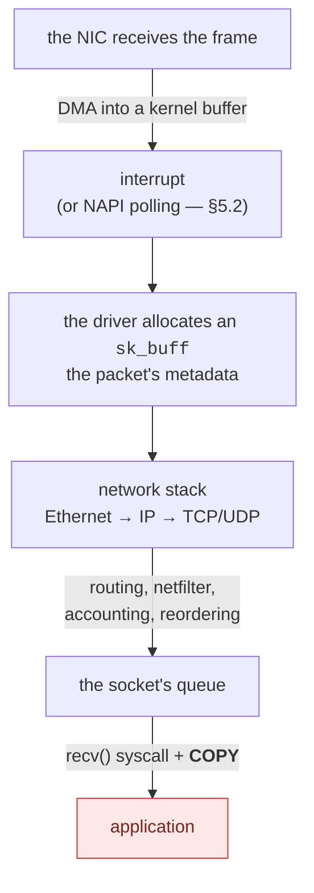
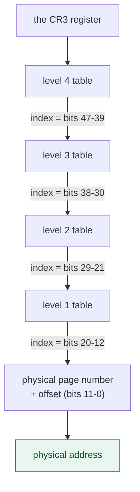
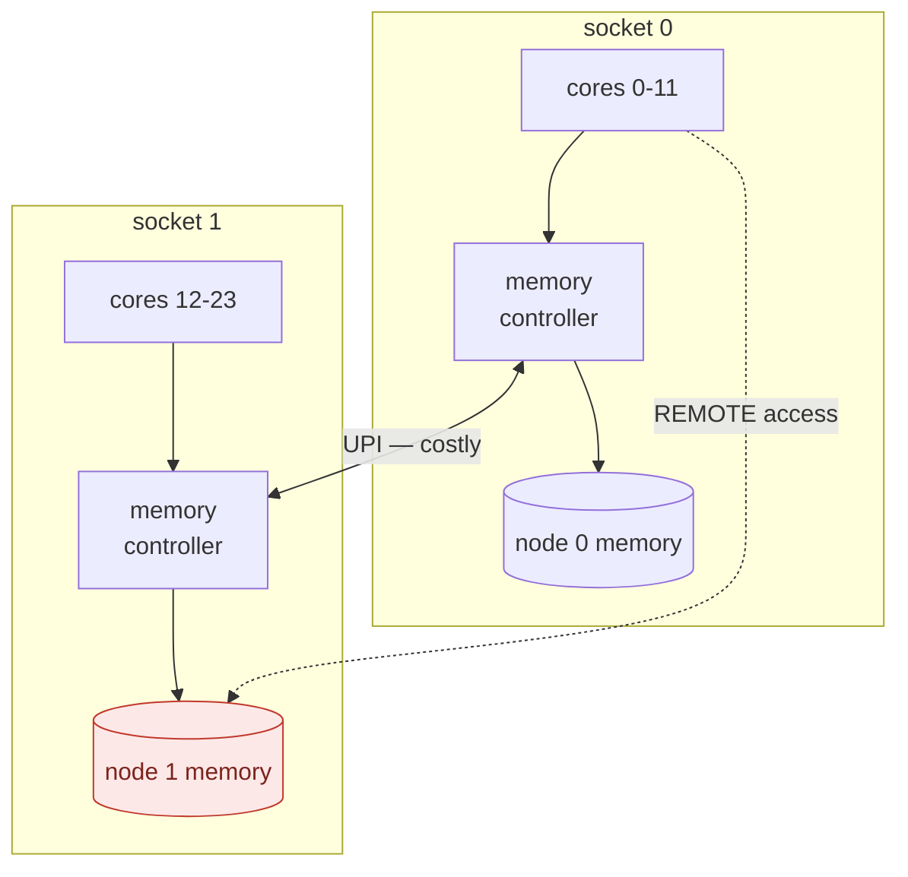
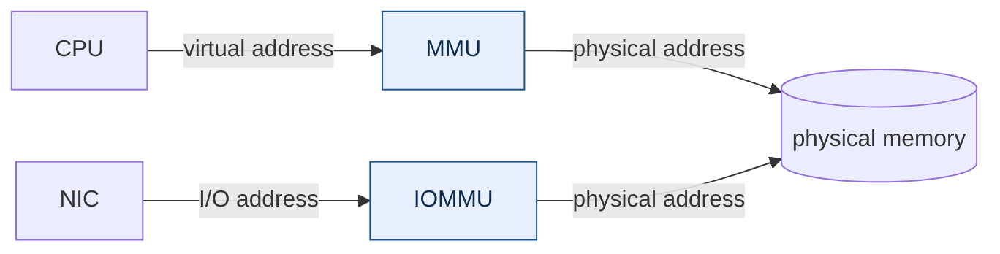

# Fundamentals — the problem, before the tool

*Leia em [português](README.md).*

> **Levels 1 and 2** of the [study plan](../plano-estudo-dpdk.en.md) ·
> No prerequisites · Next: [The DPDK runtime](../02-runtime-dpdk/)

This document does not talk about DPDK. It establishes **why DPDK needs to exist** —
and it does so with numbers you can reproduce on your machine in under a minute
(section 9).

The thesis is simple: on high-rate networks, the time available per packet is so short
that the operating system's comfortable abstractions stop fitting inside it.
Understanding *how much* they cost is what separates engineering from folklore.

> **One term, before we start.** This document speaks throughout of the **data
> plane**. It is worth clearing up an ambiguity the Portuguese original has to handle:
> "plane" here is not a plan, it is a **layer** — as in a geometric plane. You also
> find "forwarding plane", which is a synonym.
>
> The distinction the term carries is between two parts of a network system:
>
> | | What it does | How often it runs |
> |---|---|---|
> | **Control plane** | decides routes, configuration, policy | rarely — when the topology changes |
> | **Data plane** | handles **every packet**: receives, classifies, forwards | millions of times per second |
>
> Everything in this document refers to the second. That is why a cost of three
> hundred nanoseconds, irrelevant in the control plane, decides the entire design in
> the data plane: there it is paid once; here, per packet.
>
> The sibling term is **hot path**: the stretch of code executed once per packet,
> where every cycle and every allocation costs throughput.

---

## By the end of this module you will be able to

1. **compute the per-packet time budget** for a rate and a frame size, and say what
   fits inside it;
2. **explain why crossing the user/kernel boundary** costs what it costs, and measure
   that cost on your machine;
3. **identify false sharing** in your own code, and fix it;
4. **predict the effect of locality** — sequential against random, 4 KB pages against
   2 MB — before measuring;
5. **decide where to pin a thread** from the machine's cache topology, and justify the
   choice with a number;
6. **choose between one synchronisation primitive and another** knowing the price of
   each without contention and under contention;
7. **read a latency metric** without fooling yourself: median against mean,
   percentile, dispersion, and why the mean lies;
8. **tell latency from throughput** when reading any memory measurement, and
   choose between the tuning levers knowing which one improves the first without
   improving the second — and what each of them costs.

---

## 1. The budget: how much time exists per packet

Everything starts here, and it is the **IEEE** that defines the numbers, in the
[802.3][ieee8023] standard — the Ethernet specification. It establishes that each
frame carries 20 bytes of overhead beyond the data: **7 of preamble, 1 of
start-of-frame delimiter and 12 of interframe gap**, and that the minimum frame is
**64 bytes**. Adding up, a minimum frame occupies **84 bytes on the wire**.

At 10 Gbit/s:

```
10 000 000 000 bits/s ÷ (84 bytes × 8 bits) = 14 880 952 packets/s
1 s ÷ 14 880 952 = 67.2 nanoseconds per packet
```

| Speed | Frame | Maximum rate | Time per packet |
|---|---|---:|---:|
| 10 GbE | 64 B | 14.88 Mpps | **67.2 ns** |
| 10 GbE | 1500 B | 0.82 Mpps | 1216 ns |
| 25 GbE | 64 B | 37.2 Mpps | 26.9 ns |
| 100 GbE | 64 B | 148.8 Mpps | **6.7 ns** |

Two important readings:

**The frame size changes everything.** The same 10 GbE link demands 18 times more
decisions per second with small frames. That is why serious *benchmarks* always
declare the frame size — "10 Gbps" without that information says nothing about CPU
load.

**67 ns is little.** On a 3 GHz CPU, that is about 200 cycles. It is the total budget
to receive, examine, decide and transmit. Keep that number: it is the criterion for
judging everything that follows.

---

## 2. The user-space / kernel-space boundary

The operating system separates two execution modes: the application's code
(*user space*) and the kernel's. Every time the application needs a service from the
kernel — reading a socket, for instance — it crosses that boundary through a
[system call][syscall].

The crossing is not free. It switches the processor's mode, saves and restores
registers, and pollutes the cache and the branch predictor. Measured on this reference
machine ([`custo-syscall.c`](medicoes/custo-syscall.c)):

```
  measurement                          median   p25-p75 (IQR)   min-max range      disp    CV
  ---------------------------------- ---------  --------------- ----------------- ----- -----
  function call (user-space)             0.924  0.922-0.926     0.920-0.937         0.4%   0.4%
  clock_gettime (vDSO, no trap)          15.54  15.53-15.58     15.52-20.16         0.3%  10.0%
  real syscall (SYS_getpid)              33.55  33.42-33.76     33.28-34.04         1.0%   0.6%

  a syscall costs 36x a function call

Budget for 10 GbE with 64 B frames: 67.2 ns per packet
  syscalls that fit in that budget: 2.00

  The traditional kernel path spends at least one syscall per
  a batch of packets, plus interrupt, sk_buff allocation and copy.
```

> **This table once published 0,115 ns and "294×", and both were wrong.** The
> reference function took no argument, had no side effect and returned a constant, so
> GCC classified it as `const`, folded the call into the literal and hoisted it out of
> the loop — `__attribute__((noinline))` prevents *inlining*, not interprocedural
> constant propagation. The measured loop was `movq $0x2a, sumidouro` twice, with no
> `call` instruction at all, and the ratio compared a syscall against two *stores*.
>
> The fix was to make the function opaque to the compiler, with `asm volatile` and a
> memory clobber. Check that the call exists before trusting the number:
>
> ```bash
> objdump -d build/docs/01-fundamentos/medicoes/custo-syscall | \
>     awk '/<m_funcao>:/,/^$/' | grep call
> ```
>
> What remains is the method, which is worth more than this case: **in a
> microbenchmark, disassemble before publishing.** A loop that is too fast is a
> hypothesis of measurement error before it is a result.

> **THE 36× RATIO IS FROM THE COLD REGIME, and this was measured on 16/09/2026.** The
> table above is a faithful transcription of one run — but of a **first run after
> idle**, and in that regime the function call measures 0.92 ns. Eight consecutive
> runs, with the machine already in use, give 0.72 to 0.75 ns for the same call, and
> the ratio rises to **45× to 49×** (median 46×).
>
> Both regimes are real and reproducible, each with low internal dispersion — the
> table above shows 0.4% amplitude. What was missing was **declaring which one the
> measurement came from**.
>
> The effect is the same one the
> [benchmarking submodule](../../trilha/03-performance/01-benchmarking/) measures and
> explains: the first run after idle comes out ~30% high on the shortest operation.
> Here it did not inflate a loose number — it inflated the **denominator** of a ratio,
> and so the ratio came out **low**: 33,5/0,92 = 36, against 33,8/0,73 = 46.
>
> **This section's argument does not change**, because it never depended on the ratio:
> it comes from 33.5 ns against a 67.2 ns budget, and the function call does not enter
> the account. But the ratio is the sentence people repeat, and it was 22% low.
>
> Reproduce it: run `custo-syscall` once after a few minutes of an idle machine, and
> then eight times in a row. The difference shows in the first line.

The table's columns are explained in [§7](#percentile-what-p99-means) and in
[§9](#9-validation-reproduce-it-on-your-machine); for now the median is enough.

The central result: **about two system calls fit in one packet's budget.** And
`getpid()` is the cheapest syscall there is — it does no I/O, touches no user memory,
does not sleep. A real `recvmsg()` costs far more.

Note that this result **did not depend** on the wrong number: it comes from 33.55 ns
against a 67.2 ns budget, and the function call does not enter the account. What the
correction changed was the syscall/call ratio — from "294×" to the 36× to 46× range
depending on the measurement regime, handled in the warning above — which is a
soundbite, not the argument. The argument is the budget.

The [vDSO][vdso] case deserves attention because it anticipates the whole idea: the
kernel maps some functions directly into the process's space, so that
`clock_gettime()` executes **without a trap** — and therefore costs 16 ns instead of
33. It is the same strategy DPDK will take to the extreme: taking the boundary out of
the hot path.

---

## 3. A packet's traditional path

It is worth knowing the standard path before contesting it, because it is excellent at
what it was designed for: generality, isolation and correctness.



Each stage charges:

| Stage | Cost |
|---|---|
| Interrupt | a context switch; mitigated by [NAPI][napi], which switches to *polling* under load (§5.2) |
| `sk_buff` allocation | a ~200-byte structure per packet, allocated and freed |
| Traversing the stack | generality: it handles all protocols and all options |
| `recv()` | a syscall (~33 ns minimum) plus a **copy** of the data |

None of that is waste in the general case — it is the price of a stack that works for
any application, with isolation between processes. The problem appears only when the
budget falls to 67 ns.

> **What DPDK does:** it removes all those stages from the data path. The NIC is
> detached from the kernel driver and bound to [`vfio-pci`][drivers]; a driver in
> *poll mode* — which asks in a loop whether a packet arrived, instead of waiting to be
> told, and is defined in
> [§5.2](#52-polling-the-question-the-data-plane-answers-differently) — inside the
> process reads the NIC's descriptors directly. No interrupt, no `sk_buff`, no generic
> stack, no syscall, no copy. The cost of that choice is the subject of section 8.

---

## 4. Memory: where performance is really decided

This is the chapter where the document stops describing the machine and starts
**arming decisions**. Each section ends with what it lets you tune and what that
tuning costs; [§4.4](#44-decision-map-what-to-tune-and-what-it-costs) gathers it
all into one map. Before the mechanisms, though, three quantities — because
confusing them is the costliest mistake in a data plane, and this document has
already made it (see the retraction in [§4.2](#42-cache-and-locality)).

> **Latency** — how long **one** access takes, from request to the data arriving.
> It is a physical property of the machine: you do not reduce it by writing
> better code.
>
> **Throughput** — how many accesses per second the machine completes. It is
> **not** the inverse of latency, and that is the central idea of this chapter.
>
> **Bandwidth** — how many bytes per second move. It is the physical ceiling
> where throughput stops growing.

The relation between them fits on one line, and is known as **Little's Law**:

```
throughput = concurrency ÷ latency
```

Latency sits in the denominator and is fixed. So the only way to raise
throughput is to raise **concurrency** — how many accesses are in flight at the
same time. And concurrency is a choice made by whoever writes the program.

<picture>
  <source media="(prefers-color-scheme: dark)" srcset="imagens/4-escada-escuro.en.svg">
  
</picture>

The RAM bar is this whole module's problem in one image: **a single access to
main memory costs more than the entire packet**. There is no budget left to
receive the frame, decide what to do with it and transmit it — the access alone
has already blown it.

And there is no way to make that access faster. DRAM latency is dictated by the
device, the bus and physical distance; no choice of language, compiler or data
structure reduces it. What is left is **not paying it**, and there are four
levers for that, spread across the three sections that follow:

| If you want… | The lever is… | And it is in… |
|---|---|---|
| the access never to reach RAM at all | locality: fitting in cache | [§4.2](#42-cache-and-locality) |
| the access not to pay translation on top | hugepages | [§4.1](#41-virtual-memory-what-translating-an-address-means) |
| many accesses to pay the price **together** | concurrency: batching and prefetch | [§4.2](#42-cache-and-locality) |
| the access not to cross into the wrong node | memory affinity | [§4.3](#43-numa-when-memory-stops-being-one-thing) |

The first three attack the same number by different paths, and **only the third
improves throughput without improving latency**. That is why it is the one that
confuses most, and the one that decides most.

### 4.1 Virtual memory: what "translating an address" means

No address your program manipulates is the real address of a byte in physical memory.
When you print a pointer, you see a **virtual address** — a number that only makes
sense inside your process. The corresponding physical address is chosen by the
operating system and may change.

That indirection is what allows two processes to use the same address `0x7fff...`
without colliding, memory to be allocated in non-contiguous pieces without the program
noticing, and one process to be unable to read another's memory. It is one of
computing's most valuable ideas — and it charges per access.

**Translating** a virtual address means discovering which physical address it
corresponds to. That is not a calculation; it is a **lookup in a data structure in
memory**, performed by the hardware on every access.

#### The anatomy of an address

Memory is managed in fixed-size blocks called **pages** — 4 KB by default on Linux.
Translation operates on whole pages, never on individual bytes. That is why the virtual
address splits into two parts:

```
 48-bit virtual address, 4 KB page

  47      39 38      30 29      21 20      12 11          0
 ┌──────────┬──────────┬──────────┬──────────┬─────────────┐
 │  level 4 │  level 3 │  level 2 │  level 1 │   offset    │
 │  9 bits  │  9 bits  │  9 bits  │  9 bits  │   12 bits   │
 └──────────┴──────────┴──────────┴──────────┴─────────────┘
  └───────────── which page (36 bits) ───────┘ └ where in it ┘
```

The final 12 bits are the offset within the page (2¹² = 4096 bytes, exactly a page's
size) and **need no translation at all**: they pass straight through to the physical
address. Only the upper 36 bits — the page number — need translating.

#### The walk through the page tables

Translating 36 bits through a single table would require 2³⁶ entries, that is, 512 GB
of table per process. Unfeasible. The solution is a **four-level tree**, and the 36
bits are sliced into four groups of 9.

Nine bits address 512 entries. Each entry is 8 bytes. So each table occupies
512 × 8 = **4096 bytes — exactly one page**. The design closes on itself elegantly.

Translation, then, works like this (this is what is called a *page walk*):



That is **four memory accesses** before the access you asked for — and that is why the
TLB exists.

The point that matters: **each arrow is a memory access**. Translating a single address
costs up to four reads before the data you actually wanted is read — and those reads
can themselves miss in cache. On this machine, `address sizes: 48 bits virtual`
confirms the four levels; newer CPUs with `la57` use five.

#### The TLB: the cache that makes this viable

If every access paid four extra reads, nothing would work. That is why the processor
keeps a cache specific to already-resolved translations: the **TLB** (*Translation
Lookaside Buffer*).

- **TLB hit:** the translation comes out in ~1 cycle, and the *page walk* does not
  happen.
- **TLB miss:** the hardware performs the full walk and stores the result.

The TLB is small — a few hundred to a few thousand entries. What matters is not the
number of entries, but the **reach** (*TLB reach*): how much memory they cover
together.

```
reach = entries × page size
```

With 4 KB pages, a thousand entries cover 4 MB — and "a thousand" here is a round
number, chosen so the arithmetic works in your head; that is the right order of
magnitude. What decides the outcome is not the absolute size of the TLB, but the
**ratio between reach and working set**. In a scattered walk — with no pattern the
processor can predict — the chance that a translation is already in the TLB is
roughly that ratio:

```
P(hit) ≈ reach / working set
```

Applying the formula with 4 KB pages and ~1 000 entries:

| Working set | Entries needed | Fraction covered | In practice |
|---|---|---|---|
| 4 MB | 1 024 | ~100% | almost every access hits |
| 64 MB | 16 384 | 6.1% | most miss |
| 512 MB | 131 072 | 0.8% | practically everything misses |

That last row is the case measured in this document. Covering 512 MB with 4 KB
pages would require **131 072 TLB entries** — one to two orders of magnitude beyond
what current processors offer. Fewer than 1% of accesses hit; the other 99% pay the
full walk described above. And the argument does not depend on the round number:
even a 4 000-entry TLB, the top of what is seen today, would cover 16 MB — still 3%
of the region.

**And asking for a bigger TLB does not help.** It is consulted on *every* memory
access, in parallel with L1, and has to answer in ~1 cycle — which forces it to stay
small and highly associative. Growing it costs latency and power on the hottest path
in the processor, and the return is linear: doubling the entries takes coverage from
0.8% to 1.6%. That solves nothing.

**In other words:** the TLB does not fail for being small — it fails because, with
4 KB pages, **each entry covers far too little**. Reach is the product of two
factors, and software controls only one of them. Increasing the number of entries is
the vendor's problem; increasing the page size is your decision — and it is the only
one of the two factors that multiplies.

#### Why hugepages, then

2 MB [hugepages][hugetlb] attack the formula from both sides.

**They increase the reach 512×.** The same thousand entries come to cover 2 GB instead
of 4 MB.

**They shorten the walk.** With a 2 MB page, the offset becomes 21 bits (2²¹ = 2 MB),
consuming the 9 bits that would have been level 1. The level 2 entry points directly at
the physical frame: **three accesses instead of four**.

```
 48-bit virtual address, 2 MB hugepage

  47      39 38      30 29      21 20                     0
 ┌──────────┬──────────┬──────────┬───────────────────────┐
 │  level 4 │  level 3 │  level 2 │        offset         │
 │  9 bits  │  9 bits  │  9 bits  │       21 bits         │
 └──────────┴──────────┴──────────┴───────────────────────┘
                            └── points straight at the 2 MB frame
```

The effect is measurable ([`custo-traducao.c`](medicoes/custo-traducao.c)), with a
scattered walk over 512 MB:

```
  measurement                          median   p25-p75 (IQR)   min-max range      disp    CV
  ---------------------------------- ---------  --------------- ----------------- ----- -----
  4 KB pages                             119.5  113.5-125.7     112.3-152.2        10.2%  11.4% !
  2 MB hugepages                         101.3  101.0-110.5     98.3-122.0          9.4%   7.9% ~

  difference (page walk cost):      18.2 ns  (15.2%)
```

The ~100 ns common to both measurements are RAM latency, which no hugepage eliminates.
**The difference is the cost of the *page walk*** — and that is exactly what hugepages
remove, somewhere between 10 and 18 ns depending on the run, that is **15% to 27% of
the budget** of a 64 B packet on 10 GbE, spent before any useful work.

Note the seal: this is one of the **least** stable measurements in the document
(`disp` of 10.2%, marked `!`). It makes sense — each sample maps and walks 512 MB,
competing for memory with everything else on the machine. The qualitative conclusion
(hugepages eliminate the page walk) is solid; the exact value is not.

#### What the program actually computes

The measurement publishes a single number — nanoseconds per access — and it comes
out of deliberately simple arithmetic. It is worth opening up the calculation,
because every constant in it was chosen to isolate the *page walk* from everything
else.

**The region and the chain.** 512 MB divided into 64 B cache lines gives
**8 388 608 lines**. The program draws a permutation (Fisher-Yates) and writes, in
each line, the index of the **next** one — building a **single cycle** that visits
every line exactly once. A single cycle, not several short ones: that is what
guarantees the walk covers the whole region instead of spinning inside a piece
small enough to fit in cache.

```c
idx = p[idx];     /* the address of the next access only exists AFTER this one */
```

That line is the entire experiment. Because each access depends on the previous
one, the processor cannot issue several in parallel, and the prefetcher has no
pattern to recognise. It is precisely the difference between what
[§4.2](#42-cache-and-locality) measures (**amortized** time, with several accesses
in flight) and what this section measures (the **latency** of one dependent
access).

**The calculation.** The loop runs `n × 4 = 33 554 432` accesses — four complete
laps around the cycle — and the clock is read **once before and once after**:

```
ns per access = (t_end − t_start) / 33 554 432
```

Timing access by access would be impossible: `clock_gettime` costs tens of
nanoseconds, that is, **more than the thing being measured**. Amortizing over 33
million accesses makes the cost of the two timestamps irrelevant against ~3.5 s of
loop. The price of that choice is losing the distribution *within* a sample —
which is exactly what the seven samples per measurement recover.

**What is left outside the stopwatch, on purpose.** Measured on the reference
machine, for one 512 MB sample:

| Step | Cost | Why it stays out |
|---|---|---|
| `mmap` of 512 MB | ~0 ms | it only creates the mapping; no memory exists yet |
| `memset` of the region | 88 ms (4 KB) / 46 ms (2 MB) | **forces the page faults here**, not in the loop |
| shuffle and chain construction | ~215 ms | writing 8.4 M pointers is not the object of the test |
| `free` of the order array (64 MB) | — | returned before the first timestamp |
| **timed loop** | **~3 500 ms** | ← this alone enters the calculation |

The `memset` is the important item on that list, and the number of page faults it
triggers is the section's own arithmetic showing up in the system counters:

```
  4 KB pages:       131 072 page faults   (512 MB ÷ 4 KB)
  2 MB hugepages:       256 page faults   (512 MB ÷ 2 MB)
```

Without that pre-touch, the first lap around the cycle would pay one page fault
for every new page — microseconds each — and the measurement would publish the
cost of **creating** the mapping, not of **translating** it. Note in passing that
the `memset` itself already costs nearly twice as much with 4 KB pages: 131 072
entries into the kernel against 256.

#### Why the region is exactly 512 MB

The size is not arbitrary. It is the one value that satisfies four constraints at
the same time, and understanding that is understanding the experiment:

| The region must be… | Otherwise… | On this machine |
|---|---|---|
| much larger than L3 | the walk measures cache, not memory | L3 = 32 MB per block |
| much larger than TLB reach with 4 KB | the "bad" side does not miss, and there is nothing to measure | needs 131 072 entries |
| small enough to fit TLB reach with 2 MB | the "good" side misses too, and the difference vanishes | needs 256 entries |
| small enough for the reservation to be practical | the test becomes a privilege of big machines | 256 hugepages = 512 MB |

The two middle rows are the heart of the design. No second-level TLB on current
x86 holds more than a few thousand entries — that is, **131 072 entries do not fit
by any stretch**, and nearly every access on the 4 KB side pays the walk. Whereas
**256 entries fit comfortably in any of them**, and the 2 MB side hits nearly
always. The experiment forces both extremes and publishes the distance between
them.

This is also the answer to [exercise 6](#exercises): shrinking the region to 4 MB
makes the advantage disappear, because then both sides fit — 1 024 entries of
4 KB still fit in the TLB, and the whole 4 MB fits in L3.

#### The reserved area: 256 hugepages, and why the recipe asks for 512

**`MAP_HUGETLB` does not negotiate.** Unlike *transparent hugepages*, which the
kernel promotes in the background when it can, that flag serves itself from a
**pool reserved in advance** and **does not fall back to 4 KB** when the pool is
not enough: the `mmap` fails with `ENOMEM`, and that is that.

It is that absence of silence that lets the program use a real measurement as a
capability test — if `amostra_2m()` returns an error, it is because the
reservation does not exist:

```c
if (amostra_2m() < 0) { /* ... */ return 77; }   /* 77 = SKIPPED in Meson */
```

Exit code 77 is there for a reason documented in
[`meson.build`](medicoes/meson.build): exiting with 0 made the suite report green
**without anything having been measured**, and since `HugePages_Total=0` is the
default on most machines and on the CI runner, the false green was the rule, not
the exception.

**The reservation arithmetic:**

```
measured region        512 MB
hugepage size            2 MB
                      ────────
minimum required        256 hugepages
```

The document's recipe asks for **512** (`sudo sysctl -w vm.nr_hugepages=512`),
twice the minimum. The slack is not waste; it covers three real situations:

- **the pool is global.** Another process — a running DPDK, an earlier test that
  did not shut down — may be holding part of it.
- **on a machine with more than one NUMA node the pool is split across nodes.** An
  `mmap` of 512 MB needs 256 pages **on the node where the memory will be
  touched**; with 512 pages split across two nodes, exactly the minimum is left
  and no margin at all.
- **the reservation can be partially satisfied** — the next point.

**`sysctl` does not fail loudly, and this is the most common operational
mistake.** If memory is fragmented, the kernel reserves *whatever it can* and the
command succeeds anyway. The only way to know is to read it back:

```bash
sudo sysctl -w vm.nr_hugepages=512
grep -E "HugePages_Total|HugePages_Free|HugePages_Rsvd|Hugepagesize" /proc/meminfo
#   Total = what the kernel MANAGED to reserve (may be less than 512)
#   Free  = not yet handed to anyone
#   Rsvd  = promised to an mmap that has not touched them yet
```

If `HugePages_Total` comes back below 256, the measurement will skip. On a machine
that has been up for a long time, reserving early solves it — or at boot, which is
the only reliable way under fragmented memory:

```bash
# persistent, applied at boot
echo "vm.nr_hugepages = 512" | sudo tee /etc/sysctl.d/10-hugepages.conf
# or on the kernel command line: hugepagesz=2M hugepages=512
# per NUMA node, when there is more than one:
echo 256 | sudo tee /sys/devices/system/node/node0/hugepages/hugepages-2048kB/nr_hugepages
```

**The reservation comes out of system memory.** Reserved pages stop being
available for anything else: they do not count towards `MemAvailable`, they are not
reclaimed under pressure, and they never go to swap. 512 pages of 2 MB are **1 GB
taken away from the machine** for as long as the reservation exists.

> **This reservation is not the same one as
> [`preparar-hugepages.sh`](../../scripts/preparar-hugepages.sh).** That script
> mounts a **writable hugetlbfs**, which the primary/secondary model of module 02
> needs, where two processes must map the same *file*. `custo-traducao.c` uses
> **anonymous** memory (`MAP_ANONYMOUS | MAP_HUGETLB`) and needs no mount point at
> all: it only needs the **pool to exist**. Reserving without mounting is enough
> here; mounting without reserving is not.

#### Why the difference is ~12 ns, and not three trips to RAM

The *page walk* diagram shows four memory accesses, and RAM on this machine
answers in ~95 ns. If every TLB miss really cost four trips to RAM, the difference
between the two rows of the table would be **hundreds** of nanoseconds — and it is
12 to 18. The diagram describes the **worst case**; the table measures the **real
case**. The distance between the two is what tells you when the worst case comes
back.

**Page tables are data, and they fit in cache.** They occupy memory like any other
structure, and the kernel reports how much:

```bash
grep VmPTE /proc/self/status     # this process's page tables
```

Mapping the same 512 MB both ways, on the reference machine:

| Mapping | Page tables | Where it comes from |
|---|---|---|
| 512 MB in 4 KB pages | **1 028 kB** | 131 072 PTEs × 8 B = 1 MB, across 256 tables (+1 level-2) |
| 512 MB in 2 MB hugepages | **4 kB** | 256 level-2 entries in a single table |

From that comes a rule that scales: **with 4 KB pages, the table costs 1/512 of the
mapped region** (8 bytes of PTE for every 4 096 bytes of data). With 2 MB
hugepages, 1/262 144.

**Only one level varies.** For a 512 MB region, levels 4, 3 and 2 add up to very
few tables — in the mapping measured above, a single level-2 one, the extra 4 kB —
and they stay resident in the processor's *page-walk caches*. What changes from
access to access is only the **level-1** read, inside that 1 MB of PTEs. The real
cost, therefore, is **one extra access, not four**.

**And that access is served by L3.** One megabyte of PTEs does not fit in L2 (1 MB
per core on this machine — right at the boundary), but fits comfortably in L3
(32 MB per block). Measuring the latency of a dependent access as a function of
region size — the same chain the program uses, always on hugepages so the TLB is
out of the picture:

```
  region      ns/access (dependent chain, 2 MB hugepages)
    8 MB        11.04     <- L3
   16 MB        11.18     <- L3
   32 MB        21.54     <- L3 boundary
   64 MB        79.80     <- RAM
  512 MB        94.95     <- RAM
```

An L3 hit costs ~11 ns on this machine. On a run of `custo-traducao` with the
machine idle, the measured difference between 4 KB and 2 MB was **11.65 ns**:

```
  4 KB pages                             106.1  105.8-106.9     105.6-108.0         1.0%   0.8%
  2 MB hugepages                         94.48  94.20-94.89     93.89-95.47         0.7%   0.6%

  difference (page walk cost):      11.65 ns  (11.0%)
```

The numbers close: **every TLB miss pays for one PTE read served by L3**. And note
that the seals are gone here (`disp` of 1.0% and 0.7%, against 10.2% and 9.4% in
the published table) — confirming the diagnosis of the instability: it comes from
competing with the rest of the machine, not from the method.

> **When the worst case comes back.** When the tables stop fitting in cache. A data
> plane mapping **16 GB** in 4 KB pages needs 32 MB of PTEs alone — more than this
> machine's entire L3. At that point the level-1 read starts going to RAM, and the
> cost of the *page walk* goes from ~11 ns to nearly 90. **The problem with 4 KB
> pages is not that they are slow: it is that they get worse as the working set
> grows** — and that is why it shows up in production, with real buffers, and not
> in the lab.

Hence DPDK's requirement: packet buffers live in hugepages not out of whim, but because
a data plane walks large regions of memory in a poorly predictable way — the worst
possible case for the TLB.

```bash
getconf PAGE_SIZE                        # 4096
grep -E "Hugepagesize|HugePages_" /proc/meminfo
cat /proc/self/maps                      # this process's virtual mappings
```

### 4.2 Cache and locality

Memory is not flat. Each level is faster and smaller than the next, and transfers
between them happen in blocks of **64 bytes** — the *cache line*.

Measuring the effect ([`efeito-cache.c`](medicoes/efeito-cache.c)):

```
  fits in        size  sequential       random     dependent  accesses     disp
                      (amortized)  (amortized)     (LATENCY) in flight  of dep.
  L1d          16 KB     0.190 ns     0.227 ns      0.894 ns     ~4        0.1%
  L2          256 KB     0.186 ns     0.248 ns       2.68 ns    ~11        0.2%
  L3         8192 KB     0.188 ns     0.746 ns       9.75 ns    ~13        0.4%
  RAM      262144 KB     0.198 ns      7.46 ns      103.1 ns    ~14        2.9%
```

> **This table used to publish two columns, and the second one was mislabelled.**
> The text said that a random access to RAM cost "the real latency: 7.7 ns", and
> **7.7 ns is not latency at all** — it is amortized cost. The latency of that
> very same access is **103 ns**, thirteen times larger.
>
> The cause is in [`efeito-cache.c`](medicoes/efeito-cache.c): the index comes
> from `ordem[i]`, an array read **in sequence**. Every address is known ahead of
> time, so the processor fires a dozen accesses at once, and what was being
> measured was the throughput of that set. The box under the table warned
> "amortized, not latency" — and three paragraphs later the text claimed the
> opposite. The two sentences coexisted because **the instrument did not measure
> the quantity the prose named**: with two columns there was no way to notice.
>
> The fix was not editorial. `efeito-cache.c` gained the **third column**, which
> walks a pointer chain and exposes the real latency, and
> [`custo-paralelismo.c`](medicoes/custo-paralelismo.c) was written to measure the
> transition between the two. The table above is a fresh run, with all three.
>
> And the first version of that third column **came out wrong too**: the
> permutation was generated over the array's elements and reduced with `%` to fit
> the lines, which degenerated the chain into cycles of two or three nodes and
> published 0.9 ns as RAM latency — with the suite green, because the program's
> test checks the exit code and a program measuring the wrong thing also exits
> zero. The construction now lives in [`cadeia.h`](medicoes/cadeia.h), used by the
> three programs that build chains, with the combinatorial property verified in
> [`tests/test_l1_cadeia.cpp`](medicoes/tests/test_l1_cadeia.cpp).
>
> Falling with it: the `38.1x` penalty, which compared two amortized columns, and
> the explanation of the L3 row's `24.5%` CV, which blamed the instability on the
> "border between fitting and not fitting in L3". This machine's L3 holds **32 MB
> per block** and the working set was 8 MB: there was no border. With the machine
> idle, that row reproduces with a `disp` of 5.5%.
>
> The method is what stays: **when the prose and the warning box disagree, the
> instrument decides** — and if it does not measure the distinction, the
> distinction will not survive review.
> <!-- retratado: 0.193 0,193 0.244 0,244 0.297 0.194 0.202 0,202 7.68 38.1 24.5 24,5 -->

The table now has three readings, and the third one is new.

**The sequential column is flat.** Walking 256 MB costs the same per access as
walking 16 KB. The processor's *prefetcher* recognises the pattern and fetches
the next line before it is asked for. RAM latency still exists — it is merely
hidden.

**The dependent column is the real latency**, and it is the one that grows 115×
between L1d and RAM. It is the only one of the three that measures *one* access:
each step of the chain discovers the next address only after the data arrives,
and nothing overlaps.

**The random column sits in between, and the in-between is the subject.** With
no predictable pattern the prefetcher does not help — but the addresses come
from an array read in order, so the processor still keeps about a dozen accesses
in flight. The 7.46 ns are 103 ns divided by ~14.

#### Concurrency is the lever, and it has a price

If dividing by 14 is already worth 103 ns, is dividing by more worth more? Up to
a point — and the point is measurable.
[`custo-paralelismo.c`](medicoes/custo-paralelismo.c) walks **K independent
chains** over the same region, with K growing:

> **Memory-level parallelism** — how many memory accesses the processor keeps in
> flight at the same time. It is the only term in Little's Law that software
> controls.

<picture>
  <source media="(prefers-color-scheme: dark)" srcset="imagens/4-conflito-escuro.en.svg">
  
</picture>

The two panels are the same table, and together they are the decision:

```
    K  ns/access       M acc/s        batch of K ready             gain
  ---  ---------   -----------   ---------------------   --------------
    1      94.36        10.6                 94 ns            1.0x
    2      46.48        21.5                 93 ns            2.0x
    4      24.77        40.4                 99 ns            3.8x
    8      13.26        75.4                106 ns            7.1x
   12       9.19       108.9                110 ns           10.3x
   16       7.25       138.0                116 ns           13.0x
   32       4.59       218.1                147 ns           20.6x
   64       3.44       290.8                220 ns           27.4x
```

**Latency does not change on any row.** It is ~94 ns on all of them — what
changes is how many accesses happen at once. The `ns/access` column falls 27×
without a single access having become faster.

**At K = 1 this machine does not reach 10 GbE.** That is 10.6 million accesses per
second against the 14.9 million packets per second of
[§1](#1-the-budget-how-much-time-exists-per-packet). A single dependent access
per packet — chasing a pointer, consulting a chained flow table — **already
loses the rate before any processing**. This is why DPDK's batching is not an
optimization: it is what makes the rate arithmetically possible.

**And the price is in the second panel**, which puts both quantities on the same
nanosecond axis. At K = 1 they **coincide**: with no batch, the access and the set
are the same thing. From there the blue collapses and the orange does not — and it
is that separation which shows 3.44 ns was never memory's response time. It is
94 ns divided by 27 overlapping accesses.

**Both axes of that panel are logarithmic, and that is not a drawing
preference.** Since `batch = K × ns per access`, if concurrency were free the cost
would fall exactly with 1/K and the **orange would be a horizontal line**. It is,
up to K = 16 — 94 to 116 ns, +23%, while throughput grows 13×. Where it stops
being horizontal is, point by point, where concurrency starts to cost: from 16 to
64 throughput grows 2× and the wait, 1.9×. **The knee is the design decision** —
and the coincidence with DPDK's `MAX_PKT_BURST` of 32 is no coincidence.

> **The orange is derived from the blue**, multiplied by K — that is how the
> program computes it. It brings no new measurement; it brings the same one in the
> unit the decision is made in. Publishing it next to its source is what keeps it
> from looking like a second, independent result.

> **Read the seals before quoting the numbers.** The K = 32 and K = 64 rows come
> out marked `~` (`disp` of 5.9% and 8.7%): the smaller the measured value, the
> larger the relative dispersion, and at 3 ns the measurement already competes
> with the machine's noise. The shape of the curve is solid across the range; the
> exact value of the last two points, less so.

#### What this means in bytes

The same region, the same core, the same memory — only the access pattern
changes:

<picture>
  <source media="(prefers-color-scheme: dark)" srcset="imagens/4-banda-escuro.en.svg">
  
</picture>

Thirty-three times, without swapping a single part. **The bandwidth the vendor
sells is not the one your program uses; the one it uses is the one its access
pattern allows.** It is the reason why "buying faster memory" almost never fixes
a data plane that chases pointers: the bottleneck is not bandwidth, it is the
lack of concurrency to occupy it.

Note the waste built into it, too. Every random access moves a **64-byte** line
and uses 4 — the other 60 crossed the bus for nothing. It is the same locality
argument, stated in bytes instead of nanoseconds.

#### And when several cores want the same memory

Everything so far measured **one** core against an idle memory controller. That
is not what a data plane finds: there, several lcores push the same memory at the
same time. The second phase of
[`custo-paralelismo.c`](medicoes/custo-paralelismo.c) measures it — N physical
cores, each with its own 16 chains over the same region, without sharing a single
line between threads:

```
     cores   ns/access       M acc/s     aggregate      vs. ideal
  --------   ---------   -----------   -----------   ------------
         1        8.63       115.9         115.9          100%
         2       10.93        91.5         183.0           79%
         4       15.32        65.3         261.0           56%
         8       24.99        40.0         320.1           35%
        12       38.50        26.0         311.7           22%
```

<picture>
  <source media="(prefers-color-scheme: dark)" srcset="imagens/4-escala-escuro.en.svg">
  
</picture>

**With twelve cores active, each one does 22% of what it did alone.** Aggregate
throughput grows 2.7×, not 12× — and between eight and twelve it **stops
growing**: 320 against 312, within the noise. The system was already at the
ceiling with eight.

And that ceiling has a name that has already appeared in this chapter. Three
hundred and twenty million accesses per second, at 64 bytes per line, are
**20.5 GB/s** — the same number a single core reaches with sequential access in
the previous chart. It is no coincidence: it is memory bandwidth, and both paths
arrive at it. One sequential core saturates it alone; eight scattered cores have
to join forces to do the same.

> **Read the seals.** The 2, 4 and 8-core rows come out marked `!` (`disp` of
> 17.1%, 10.8% and 14.2%). With several cores competing for the same memory path,
> the variation between samples belongs to the phenomenon, not to the instrument —
> the scheduler, the frequency and whatever else is on the machine all enter the
> account. The **shape** of the curve (it saturates before eight) reproduces; the
> intermediate values, with reservations.

> **Design consequence, and this is the most expensive one to find out late:**
> sizing a data plane from the measurement of **one** lcore overestimates the
> whole system by a factor of four on this machine. The number that holds up a
> design is the bottom row of that table, not the top one — and it only appears
> when you measure with every core the product will actually use.

> **Design consequence:** "use contiguous structures" is not an aesthetic
> preference. An array walked in order and a linked list holding the same data
> differ by **two** orders of magnitude — and the difference comes out of your
> 67 ns budget.

### 4.2.1 False sharing: the most common mistake of data-plane programmers

The cache line is 64 bytes, and the coherence protocol operates on **whole lines**,
never on variables. From that combination is born the most frequent performance defect
in concurrent code — and the hardest to see, because the code looks correct.

> **False sharing** — two threads write to **different variables** that happen to fall
> in the **same cache line**. From the program's point of view there is no sharing at
> all; from the hardware's, there is. Each write by one invalidates the line in the
> other, and the line starts migrating between the cores on every access.

The name misleads on purpose: there is no sharing of data. There is sharing of an
**address rounded to 64 bytes**, which is what the hardware sees.

#### How much it costs

The cost is exactly that of the crossing measured in
[§4.3](#43-numa-when-memory-stops-being-one-thing) — 17 ns within the domain, more than
80 between domains — only paid **on every access**, and with nothing in the code
suggesting that anything is being shared.

This document has an involuntary demonstration. While building this directory's
measurements, false sharing appeared three times. In one of the cases, an auxiliary
thread's stop flag ended up 32 bytes before the mutex being measured:

```
  0x5200  parar_ruido     <- helper thread only READS this variable, in a loop
  0x5220  mtx             <- measuring thread WRITES here on every lock/unlock
          └─ same 64-byte line ─┘
```

The measured cost of the mutex jumped from **8 ns to 53 ns** — more than six times. No
variable was shared; no line of code suggested contention. Only the address.

Note that the auxiliary thread only **read** its flag. Reading is enough: while one core
reads the line, it keeps it in a shared state, and the core that writes must invalidate
it before every write.

#### How to avoid it

**Align what is written by different threads.** In C11 and C++, `_Alignas(64)` or
`alignas(64)`; in DPDK, the macro `__rte_cache_aligned` does the same using the
platform's line size.

> **lcore** (*logical core*) — DPDK's unit of execution. The
> [official glossary][glossario] defines it as *"a logical execution unit of the
> processor, sometimes called a hardware thread or EAL thread"*. In practice it is a
> **thread created by the EAL and pinned to a logical CPU**, chosen by the `-l`
> argument. Do not confuse it with a physical core: on a CPU with SMT, two lcores may
> land on the same core and contend for the same execution units — an effect measured in
> [§5.1.1](#511-smt-two-logical-cpus-are-not-two-cores).

```c
struct statisticss_por_lcore {
    uint64_t packets;
    uint64_t bytes;
} __rte_cache_aligned;                 /* one line per lcore, no overlap */

static struct statisticss_por_lcore stats[RTE_MAX_LCORE];
```

Without the alignment, that array is the canonical example of the problem: neighbouring
lcores' counters fall in the same line, and every increment invalidates the neighbour's.

**Check in the binary when you suspect it.** The compiler and the linker decide the
placement, so the inspection is objective:

```bash
objdump -t ./seu_binario | grep -E 'variavel_a|variavel_b'
# if the distance between the addresses is under 64, they share a line
```

**Beware of what looks harmless.** A boolean flag read in a loop, a debug counter, a
state pointer — any of them next to hot data is enough to create the problem.

> **Why this is the most common mistake in DPDK specifically:** DPDK's model is one
> lcore per core, each with its own state. Structures indexed by lcore are ubiquitous —
> counters, queues, mempool caches. If the array is not cache-line aligned, all the gain
> from dedicating a core to each thread is given back in invalidations.

---

### 4.3 NUMA: when "memory" stops being one thing

So far we have treated memory as a uniform resource: an address is an address, and the
cost of reaching it depends only on which cache level holds it. On multi-socket machines
that stops being true, and the reason is architectural.

> A **socket** is the motherboard's physical slot where a processor is installed. A
> two-socket machine has two distinct processors — not two cores, but two separate
> chips, each with its own cores, its own cache and, what matters here, its own memory
> sticks wired directly to it. Servers usually have two or four; laptops and desktops,
> only one. Check yours with `"LC_ALL=C lscpu | grep -i socket"` — the `"LC_ALL=C"`
> avoids depending on the system's language, since in Portuguese the line appears as
> "Soquete(s)".

It is that physical separation that makes an access's cost depend on *where* the data is,
and not only on *how recently* it was used.

#### Why NUMA exists

In the old model (SMP), all processors shared a single bus to memory. It works well with
few cores, but the bus becomes a bottleneck: the bandwidth is fixed and divided among
everyone, and contention grows with the number of cores.

The way out was to **give each socket its own memory controller**. Each processor comes
to have memory physically wired to it, and the sockets communicate over a dedicated
interconnect (UPI on Intel, Infinity Fabric on AMD). Total bandwidth now grows with the
number of sockets — at the price of memory ceasing to be uniform. Hence the name:
*Non-Uniform Memory Access*.



For socket 0's cores, node 0's memory is **local** and node 1's is **remote** — same
instruction, different latency.

A core on socket 0 reading node 1's memory crosses the interconnect: it pays more latency
and shares less bandwidth than the local one. On typical two-socket machines a remote
access costs something between 1.5 and 2.2 times the local one — but that number varies
so much by generation and configuration that it is **only worth anything measured on your
machine**.

#### The distance matrix, and what it is not

The firmware reports a matrix of relative distances to the operating system:

```bash
numactl --hardware
```

```
node distances:
node     0    1
   0:   10   21
   1:   21   10
```

These numbers are **relative, not nanoseconds**. By convention, 10 represents the local
access, and the others are approximate proportions relative to it: 21 means "about 2.1
times the local cost". They come from a firmware table (the SLIT, from the ACPI standard)
and are a **manufacturer's declaration**, not a measurement. Treat them as an indication
of topology, and measure if the number matters.

#### One socket no longer means one node

Modern processors can be configured to expose **several NUMA nodes within the same
socket** — Sub-NUMA Clustering on Intel, NPS on AMD. The motivation is the same at a
smaller scale: dividing the L3 cache and the memory channels into smaller domains reduces
internal contention.

The practical consequence is that the "one socket, one node" intuition is wrong, and the
topology needs to be consulted rather than presumed.

#### Where memory is really allocated: the first-touch policy

This is the point that causes the most surprise, and it is worth stating clearly:

> **`malloc()` does not decide which node the memory will live on.** It only reserves
> virtual addresses. The physical page is only allocated on the first access, and it goes
> to the node of the thread **that touched the page first** — not the one that allocated
> it.

It is the [first touch][mempolicy] policy, the default on Linux. It produces a classic
error in parallel programs:

```c
/* WRONG: the main thread touches everything, so every page lands on its node */
buffer = malloc(size);
memset(buffer, 0, size);              /* <- first touch happens here */
#pragma omp parallel                  /* threads on other nodes read remotely */

/* RIGHT: each thread initialises the slice it will process,
   and each page is born on the node that uses it */
buffer = malloc(size);
#pragma omp parallel
    memset(my_slice, 0, my_size);
```

You can inspect where a process's pages really are:

```bash
cat /proc/self/numa_maps     # N0=242 means 242 pages on node 0
numastat -p <pid>            # summary per node
```

On this machine, a line of `numa_maps` is:

```
5ed775136000 default file=/usr/bin/head mapped=242 ... N0=242 kernelpagesize_kB=4
```

`default` is the policy, `N0=242` says the 242 pages are on node 0, and
`kernelpagesize_kB=4` confirms normal pages — the same file would show 2048 for regions
in hugepages.

#### What changes in the data plane

A NIC does not float in the system: it is connected to a PCIe bus belonging to a specific
socket. When it writes a packet by DMA, it writes into **some** node's memory. If that is
not the node of the core that will process the packet, every access to the header crosses
the interconnect — and that happens millions of times per second.

The practical rule decomposes into three alignments, all necessary:

| Element | Must sit on the node | How it is controlled |
|---|---|---|
| Buffer pool | the NIC's | `socket_id` in [`rte_pktmbuf_pool_create()`][apipoolcreate] |
| RX/TX queues | the NIC's | `socket_id` in the *queue setup* |
| Processing cores | the NIC's | the [EAL][cEAL]'s `-l` / `--lcores` |
| Reserved hugepages | distributed per node | `--socket-mem 1024,1024` |

DPDK exposes the topology directly: [`rte_eth_dev_socket_id(port)`][apidevsocket] returns
the NIC's node, and [`rte_lcore_to_socket_id(lcore)`][lcore] the core's. Comparing them
before allocating is routine in a serious application.

#### A real trap on this machine

Querying the NIC's node through sysfs, this machine answers:

```bash
cat /sys/bus/pci/devices/0000:08:00.0/numa_node
-1
```

**`-1` is not node minus one: it means "no declared affinity".** It is what firmware
usually reports on single-socket machines, where the question makes no sense. DPDK treats
that case as `SOCKET_ID_ANY`.

The mistake to avoid is passing that value directly as the allocation node. Chaining
[`rte_eth_dev_socket_id()`][apidevsocket] inside
[`rte_pktmbuf_pool_create()`][apipoolcreate] without checking the return value may fail or
allocate in the wrong place:

```c
/* WRONG: -1 becomes socket_id and the allocation may land on no node */
mp = rte_pktmbuf_pool_create(nome, n, cache, priv, tam,
                             rte_eth_dev_socket_id(port));

/* RIGHT: a negative value means "any node will do" */
int no = rte_eth_dev_socket_id(port);
if (no < 0)
    no = (int)rte_socket_id();          /* node of the current lcore */
mp = rte_pktmbuf_pool_create(nome, n, cache, priv, tam, no);
```

DPDK's `SOCKET_ID_ANY` is `-1` precisely for that case; what you cannot do is use it as an
index without first recognising it. Note that [`rte_socket_id()`][apisocketid] returns the
node of the lcore currently executing, which is the reasonable choice when the device
declares no affinity.

#### Inspecting your machine

```bash
numactl --hardware                              # nodes, memory and distances
LC_ALL=C lscpu | grep -i numa                   # which CPUs on each node
cat /sys/bus/pci/devices/<BDF>/numa_node        # the NIC's node (-1 = undeclared)
numastat                                        # allocation hits and misses per node
cat /proc/self/numa_maps                        # where the process's pages are
```

#### And on a single-socket machine, can you see any topology effect?

Yes — but not NUMA's, and it is important not to confuse the two.

**What does not work.** The kernel offers NUMA emulation through a boot parameter
([`numa=fake=N`][kparams]), and some AMD BIOSes offer exposing each CCD as a NUMA node
("ACPI SRAT L3 Cache as NUMA Domain"). Both create nodes on paper, but on a single-socket
processor **all the cores share the same memory controller**. Memory latency remains
identical between the invented nodes. Measuring "remote access" there would give no
difference, and the conclusion would be false. The rule holds: *a NUMA node without its
own memory controller is not a NUMA node.*

**What does work.** There is a real asymmetry on those machines, only of another nature:
**the cores are not equidistant from one another**. Modern AMD processors group cores into
blocks (CCDs), each with its slice of L3; Intel does something analogous with clusters.
Two cores of the same block talk through the shared L3. Cores in different blocks have to
cross the chip's internal interconnect.

The kernel already exposes that, with no BIOS and no reboot:

```bash
cat /sys/devices/system/cpu/cpu0/cache/index3/shared_cpu_list
```

On the reference machine (Ryzen 9 9900X, 12 cores) there are two blocks:

```
    domain 0: CPUs 0-5,12-17
    domain 1: CPUs 6-11,18-23
```

And the difference is enormous ([`custo-comunicacao.c`](medicoes/custo-comunicacao.c)),
measuring the time for a cache line to travel from one core to another:

```
  measurement                          median   p25-p75 (IQR)   min-max range      disp    CV
  ---------------------------------- ---------  --------------- ----------------- ----- -----
  within domain 0 (cpu 0 <-> 2)          17.50  17.45-17.96     17.34-19.61         2.9%   4.1%
  ACROSS domains (cpu 0 <-> 6)           82.99  82.71-87.96     82.53-122.96        6.3%  14.4% ~
```

**Crossing the interconnect costs about 4.7 times more — and that is 123% of the budget
of a 64 B packet on 10 GbE.** A single hand-off between badly placed cores already blows
the entire budget, before any useful work.

The second line is information, not a defect: `disp` of 6.3% with a CV of 14.4% — the
middle has moderate dispersion **and** the much larger CV denounces isolated samples well
above, from 83 to 123 ns in the same collection. **The crossing between domains is
intrinsically unstable on this machine.** It only became visible on adopting statistical
sampling — before, single measurements returned 100, 110 or 117 ns and the variation
looked like measurement noise, when it is a property of the path being measured.

That result has a direct and immediate consequence in the project: the
[topic 02](../../trilha/01-fundamentos/02-mempool-ring/) passes objects between producer
and consumer through an [`rte_ring`][guiaring], and each hand-off makes exactly that trip.
Choosing `-l 0,2` or `-l 0,6` in the EAL is not a configuration detail — it is the
difference between 22 ns and 117 ns per crossing.

> **Answering the question directly:** it is not worth enabling the BIOS option. It would
> announce a *memory* asymmetry that does not exist on this machine, while the
> *communication* asymmetry, which does exist and is large, is already visible and
> measurable without it. For DPDK the argument is even stronger: since lcores are pinned
> explicitly with `-l`, the help the option would give the system's scheduler is
> irrelevant — the placement is done by you.

> **An honest limitation:** the reference machine has a **single NUMA node**
> (`available: 1 nodes (0)`, distance `10`). The cost of remote memory access — this
> section's central claim — was therefore **not measured here**, and the 1.5 to 2.2 times
> range comes from the literature, not from this machine. What was measured is another
> thing: the asymmetry between cores, real and large on this CPU. Do not confuse the two.
> To measure NUMA for real you need hardware with two or more sockets, physical or a cloud
> instance large enough.

### 4.4 Decision map: what to tune, and what it costs

The previous sections measured mechanisms. This one puts them side by side as
**options**, with the column that performance material usually leaves out: the
cost.

| Technique | What it attacks | Gain measured here | What it costs | When **not** to use it |
|---|---|---|---|---|
| **hugepages** | the *page walk* | 11 to 18 ns per access ([§4.1](#41-virtual-memory-what-translating-an-address-means)) | reserved memory that vanishes from the system; boot configuration; no swap | a working set small enough to fit in the TLB |
| **contiguous layout** | lost locality | up to 33× of bandwidth ([§4.2](#42-cache-and-locality)) | refactoring; structures that are less natural to write | genuinely scattered access, with no order to exploit |
| **batching and prefetch** | lack of concurrency | 94 → 7.3 ns amortized, 13× throughput ([§4.2](#42-cache-and-locality)) | **latency**: waiting for the batch to fill (+23% up to K = 16, +133% at K = 64) | when the latency tail is the contract, not throughput |
| **`__rte_cache_aligned`** | false sharing | 53 → 8 ns ([§4.2.1](#421-false-sharing-the-most-common-mistake-of-data-plane-programmers)) | up to 63 bytes wasted per object | a read-only structure, or one touched by a single lcore |
| **memory affinity** | crossing between nodes | see [§4.3](#43-numa-when-memory-stops-being-one-thing) | operational complexity: pin the lcore, allocate on the right node, and prove it landed there | a single-node machine |

Three readings the whole table supports, and which are worth more than any row
on its own.

**1. Only one of the five buys throughput without improving latency.**
Hugepages, locality and affinity make the access **cheaper**. Batching does not:
it leaves the access exactly as it was and makes more of them happen together.
That is why it is the only row whose cost lands in the right column — and the
only one that can make the system worse while improving the number you happen to
be looking at.

**2. The budget decides how much batching you can afford.** The 67.2 ns per
packet from [§1](#1-the-budget-how-much-time-exists-per-packet) are not the time
for one packet to cross the system; they are the interval between two packets. A
batch of 32 does not spend 32 budgets — it **amortizes** them. What it consumes
is end-to-end latency, and the limit on that is not the interface rate: it is
your service's contract.

**3. None of this scales forever.** Every lever has a physical ceiling, and this
chapter has already measured all three:

| Lever | Ceiling | Where it was measured |
|---|---|---|
| locality | the size of the cache | [§4.2](#42-cache-and-locality): above 8 MB the random column takes off |
| hugepages | TLB reach | [§4.1](#41-virtual-memory-what-translating-an-address-means): 256 entries cover 512 MB, not 512 GB |
| concurrency (one core) | memory bandwidth | [§4.2](#42-cache-and-locality): from K = 32 to K = 64 throughput grows only 1.33× |
| concurrency (the system) | the same bandwidth, **divided** | [§4.2](#42-cache-and-locality): with 12 cores, each one does 22% of what it did alone |

> **This chapter does not close the subject, and it is good that it does not.**
> The conflict between throughput and latency comes back at two larger scales,
> with the same mathematics: in [topic 03](../03-mempool-ring-mbuf/README.en.md#13-batching-changes-sign-between-the-two),
> where batching dilutes the fixed cost of a ring rather than that of a memory
> access; and in [§11](#111-the-crossing-measured) of this document, where the
> input queue shows what happens when the throughput asked for approaches what
> the system delivers. Little's Law holds in all three.

#### Before tuning anything

A work order, because the order matters more than the techniques:

1. **Measure latency, not amortized cost.** If your per-access number is much
   smaller than your memory's latency, you are measuring concurrency — and
   concurrency changes when the load changes.
2. **Find out where the working set lands.** Does it fit in L2? In L3? In
   neither? The answer picks the lever, and the other four rows become noise.
3. **Only then tune**, one thing at a time, publishing the dispersion alongside
   the value. The tables in this chapter show why: half of all wrong conclusions
   come from comparing two runs that measured different regimes.

---

## 5. Execution: threads, affinity and the polling dilemma

### 5.1 CPU affinity

By default the scheduler moves threads between cores according to load. For an ordinary
application that is good. For a data plane it is bad: on migrating, the thread loses its
warm caches and its NUMA proximity.

The solution is to pin each processing thread to a core
([`sched_setaffinity`][affinity]) and, ideally, take that core out of the general
scheduler with [`isolcpus`][kparams]. DPDK calls those dedicated cores **lcores** and does
that pinning for you.

### 5.1.1 SMT: two logical CPUs are not two cores

On this machine: 24 logical CPUs, being **12 physical cores with 2 threads each**. sysfs
says who is whose sibling:

```bash
cat /sys/devices/system/cpu/cpu0/topology/thread_siblings_list
0,12
```

The two threads of a core share the execution units, the L1 and the branch predictor. The
system's scheduler presents them as independent CPUs, and that is where the trap lies.

A polling loop is the **worst possible case** for SMT: it never blocks, never yields the
execution units, and therefore competes all the time. Measuring the cost of that
competition with high-instruction-level-parallelism ALU work
([`custo-comunicacao.c`](medicoes/custo-comunicacao.c)):

```
  measurement                          median   p25-p75 (IQR)   min-max range      disp    CV
  ---------------------------------- ---------  --------------- ----------------- ----- -----
  loop alone on the core                 0.449  0.448-0.450     0.448-0.453         0.2%   0.4%
  neighbour on SMT sibling (cpu 12)       1.23  1.23-1.23       1.20-1.23           0.1%   0.7%
  neighbour on physical core (cpu 6)     0.447  0.447-0.448     0.447-0.452         0.1%   0.3%
```

**Sharing the core costs 174%** — the loop becomes 2.7 times slower. Using a distinct
physical core costs **zero**, within the noise.

The consequence for DPDK is direct: `-l 0,12` looks like it gives two lcores and in
practice gives little more than one. When choosing lcores, take the **physical cores**
first. On this machine, `-l 0-5` uses six whole cores; `-l 0-2,12-14` uses three cores
with both threads of each.

> The honest caveat: SMT is not always bad. It helps when the threads have *low*
> instruction-level parallelism and spend time waiting on memory — one fills the other's
> bubbles. The case measured above is the opposite, and it is precisely the data plane's:
> tight loops that saturate the ALUs.

### 5.2 Polling: the question the data plane answers differently

Every thread that reacts to events faces the same question: **how does it find out that
work has arrived?** There are two answers, and the choice between them defines the whole
program's execution model.

> **Polling (busy waiting)** — the thread **asks, without stopping, whether the work has
> arrived**. It does not sleep, does not yield the CPU and asks nothing of the operating
> system: it merely re-reads an address in a tight loop until the value changes.
>
> ```c
> for (;;) {
>     n = rte_eth_rx_burst(port, queue, pkts, MAX);     /* returns 0 if nothing arrived */
>     if (n == 0)
>         continue;                                     /* ask again */
>     process(pkts, n);
> }
> ```
>
> The opposite is **blocking waiting**: the thread sleeps and asks the system to wake it
> when there is something. It frees the CPU while waiting — but someone has to wake it,
> and waking costs.

The name matters: DPDK's drivers are called **[PMDs][cPMD], *Poll Mode Drivers***. Polling
is not an implementation detail; it is the execution model around which everything in DPDK
is built.

#### How much sleeping costs — and what exactly is expensive

Here it is easy to get the diagnosis wrong. The cost is usually attributed to "the mutex",
but the measurement shows the blame lies elsewhere. Separating the three things that get
confused ([`custo-espera.c`](medicoes/custo-espera.c)):

The measurements are in two scenarios, and **the difference between them is exactly what
we want to find out**. It is worth fixing both terms before reading the numbers:

> **Uncontended** — **nobody else wants the same primitive** at the moment you use it.
> Since there is no one to wait for and no one to wake, it takes its **fast path**: a few
> atomic instructions in user space, with no system call. It measures the **floor** of the
> cost.
>
> Careful: *uncontended* does **not** mean *single-threaded*. A process with dozens of
> threads has uncontended locks all the time — that is how well-written concurrent code
> behaves. How many threads exist is a **separate axis**, and that is why all the
> measurements below fix that axis at the realistic value: there is always another thread
> in the process.
>
> **In hand-off** — **two threads, on different cores**, alternating: one hands over, the
> other receives and hands back. Here the primitive does what it exists for, which is to
> coordinate. Three costs add up: the primitive's (the floor above), the **cache line
> migrating** from one core to the other, and, if the thread blocks, that of **sleeping
> and being woken**.
>
> The two are **not opposites**. The first isolates the primitive; the second puts it to
> work. It is by comparing the two that you discover **which portion of the cost comes
> from what** — and the answer, to anticipate, is that almost all of it comes from the
> last.

Each measurement uses **25 samples**, after 60 ms of warm-up — without the warm-up, the
first measurement measures the CPU's start-up (low frequency, cold caches) and not the
steady state. The median, the interquartile range, the full amplitude and the coefficient
of variation are published, so that each number's reliability is visible instead of having
to be assumed.

**1. Uncontended — nobody else wants the same primitive:**

```
  measurement                          median   p25-p75 (IQR)   min-max range      disp    CV
  ---------------------------------- ---------  --------------- ----------------- ----- -----
  relaxed atomic (store+load)            0.206  0.206-0.207     0.206-0.213         0.5%   0.7%
  seq_cst atomic (store+load)             3.68  3.68-3.69       3.68-3.93           0.2%   1.8%
  mutex lock+unlock                       8.48  8.47-8.48       8.47-8.49           0.1%   0.1%
  spinlock lock+unlock                    4.43  4.43-4.43       4.42-4.44           0.1%   0.1%
  semaphore post+wait                     8.12  8.12-8.12       8.11-8.37           0.1%   0.8%
```

The last two columns measure the number's trustworthiness: `disp` says whether the typical
value is reproducible, `CV` denounces isolated outlying samples. How to read them together
is in [§9](#9-validation-reproduce-it-on-your-machine).

None of those primitives is expensive. **An uncontended mutex costs 8.5 ns** — it settles
everything in user space, through the futex's fast path, with no system call. All the
measurements run **with another thread present in the process**, which is the regime of
any real concurrent program.

> **Aside: glibc's fast path, and why it was discarded.**
>
> glibc keeps a shortcut for **single-threaded** processes, in which the same mutex costs
> ~2 ns instead of 8.5 — there is no one to compete with, so the atomic instruction is
> skipped. The number is real, and even so invalid as a reference.
>
> The first reason is that no concurrent program enjoys it. The second is worse: the
> shortcut is lost **permanently** on the first thread creation, and does not come back
> even after the thread is joined.
>
> ```
>   before any thread             :  2.40 ns
>   after creating AND JOINING one:  8.99 ns
>   __libc_single_threaded = 0
> ```
>
> The practical consequence is fatal for the measurement: the value depended on the
> **order** in which the measurements ran within the program, varying from 2.4 to 9.0 ns
> according to position in the file. **A measurement that depends on the order in which
> you measure is not a measurement** — so the single-threaded regime was abandoned, and
> the table above reports only the realistic case.

> **Why not call the two groups "single-threaded" and "multi-threaded"?** It is tempting,
> and the distinction above shows that the thread count does matter — but it is not this
> section's axis. *Uncontended* is not a synonym for *single-threaded*: a program with
> dozens of threads has uncontended locks all the time, and that is how well-written
> concurrent code behaves. And the "multi-threaded" label would cover indistinguishably
> **8.5 ns** (uncontended), **102 ns** (hand-off between cores) and **1301 ns** (hand-off
> with sleeping) — exactly the three portions this section exists to separate.

Two details of the table deserve a note.

**The mutex costs 2.3 times a `seq_cst` atomic** (8.48 against 3.68 ns), and the reason is
arithmetic: locking executes an atomic read-modify-write, unlocking executes another, plus
the check that nobody is waiting. That is two locked operations against one. The mutex is
not expensive for being a mutex; it is expensive for doing more.

**Memory ordering has its own price.** The `seq_cst` atomic, with a full barrier, costs
3.68 ns against 0.21 ns for the `relaxed` one — eighteen times more, without either of
them involving another thread. That is why `rte_ring` uses `acquire`/`release` instead of
`seq_cst`: the weaker barrier is sufficient for the guarantee it needs, and the difference
comes out of the per-packet budget.

**2. In hand-off — the same primitives coordinating two threads on different cores:**

```
  measurement                          median   p25-p75 (IQR)   min-max range      disp    CV
  ---------------------------------- ---------  --------------- ----------------- ----- -----
  atomic + busy-wait (never sleeps)      21.02  20.85-21.20     20.41-22.10         1.6%   2.0%
  mutex + busy-wait (never sleeps)       102.3  101.7-107.2     98.0-117.7          5.4%   5.0% ~
  mutex + condvar (SLEEPS)              1301.0  1274.6-1351.1   1230.4-1397.1       5.9%   4.1% ~
  POSIX semaphore (SLEEPS)              1286.6  1258.4-1302.0   1202.3-1499.3       3.4%   5.4% ~
```

**The decisive comparison is the two middle lines: it is the same mutex.** The only
difference is that in the second the thread really sleeps, waiting to be woken by a
condition variable. That multiplies the cost by **13**.

That is: the problem was never the mutex, nor the semaphore, nor the atomic. **The problem
is sleeping.** When the thread blocks, the system's scheduler comes in — a system call,
marking ready, choosing the next thread, a context switch — and that is what costs more
than a thousand nanoseconds.

**In the data plane's budget:**

```
    busy-wait fits 3.2 times into one packet's budget
    sleeping spends 19.4 whole budgets
```

Waking a thread consumes the equivalent of **19 packets of 10 GbE**. In the time to be
woken, nineteen packets would have arrived — and been dropped for lack of a buffer. There
is no budget for sleeping, and that, not a taste for micro-optimisation, is why the data
plane polls.

> **And in C++23?** The account is the same — with one exception that only appeared on
> checking. libstdc++'s `std::atomic`, `std::mutex` and `std::condition_variable` rest on
> the same mechanisms measured here, and the times match within the noise (`std::atomic`
> generates instructions identical to `_Atomic`'s; checked in the object code).
> `std::counting_semaphore`, however, does **not** involve `sem_t`: libstdc++ implements it
> over atomics with spinning before blocking, which gives it different behaviour — and cost
> — from the POSIX semaphore in both directions.
>
> Check for yourself with
> [`scripts/validar-cpp-vs-c.sh`](../../scripts/validar-cpp-vs-c.sh), which compares
> generated instructions, the chosen implementation and the times side by side. The
> underlying lesson stands: **the choice of language does not change this account; the
> choice of sleeping or not changes everything** — but it is worth confirming which
> primitive actually sleeps.

#### Which primitive to use, after all

The cost table above answers *how much it costs*, not *when to use it* — and reading only
the numbers leads to the wrong conclusion that the atomic, being the cheapest, serves for
everything. It does not: each primitive protects something different.

It is worth recalling what the recommendation below rests on, because it is not opinion.
Three of this section's measurements support it, and each isolates a different variable:

| Study | What it isolated | Result |
|---|---|---|
| Uncontended × in hand-off | the primitive's cost alone against that of actually coordinating | the primitive is cheap; **sleeping** is what costs 13× |
| [Mirror in C and C++23](medicoes/custo-espera-cpp.cpp) | whether the language changes the account | ratio ~1,00× for atomic, mutex and condvar |
| [Placement between cores](#43-numa-when-memory-stops-being-one-thing) | the same code on different cores | 17 ns in the same domain, 83 to 123 ns between domains |

The second matters especially here: since the numbers match in **two languages**, the
guidance below is not a peculiarity of glibc nor of libstdc++ — it is a property of the
mechanisms both use. The third is a reminder that the choice of primitive is only half the
decision; the other half is **where** the threads run.

| Situation | Primitive | Why | Measured in |
|---|---|---|---|
| Each core has its own state | **none** | with no sharing there is nothing to synchronise | — |
| One counter, one flag, one pointer | `relaxed` atomic | the operation is already indivisible; order does not matter | [`m_atomica_relaxed`](medicoes/custo-espera.c#L122) |
| Publish data and then a signal | `acquire`/`release` atomic | guarantees that whoever sees the signal sees the data | [`m_repasse_atomica`](medicoes/custo-espera.c#L331) |
| Pass objects between cores | [`rte_ring`][guiaring] | a lock-free queue, made for it | [`pipeline_ring.c`](../../trilha/01-fundamentos/02-mempool-ring/pipeline_ring.c) |
| An invariant across several variables, short section | spinlock | a real lock, without the cost of sleeping | [`m_spinlock`](medicoes/custo-espera.c#L225) |
| A section of unpredictable duration | mutex | sleeping is acceptable outside the hot path | [`m_mutex_simples`](medicoes/custo-espera.c#L132), [`m_repasse_mutex_ativo`](medicoes/custo-espera.c#L349) |
| Waiting for an event that may take long | condvar / semaphore | frees the CPU; **never** on the hot path | [`m_repasse_condvar`](medicoes/custo-espera.c#L376), [`m_repasse_semaforo`](medicoes/custo-espera.c#L397) |

The last column leads **straight to the line** of the function that produced each number,
in [`medicoes/custo-espera.c`](medicoes/custo-espera.c): recommendation and evidence sit
one click from each other. The `rte_ring` row points elsewhere because it is not measured
here — its cost appears in [topic 02](../../trilha/01-fundamentos/02-mempool-ring/), where
the hand-off between cores is compared with
[`scripts/bench-ccd.sh`](../../scripts/bench-ccd.sh).

> **Line anchors require maintenance.** Line numbers change when the code changes, and an
> outdated link silently points at the wrong passage. That is why
> [`ferramental/qualidade/verificar-ancoras.py`](../../ferramental/qualidade/verificar-ancoras.py)
> checks whether each anchor still lands on the function the text promises, and runs
> alongside the tests.

Three criteria settle almost every case:

**An atomic does not replace a lock.** It makes **one** operation on **one** variable
indivisible. If the invariant involves two variables — an index and a size, a pointer and
a counter — isolated atomics are not enough, however cheap they are.

**Spinlock or mutex depends on who can sleep.** Spinning only pays off if the critical
section is short *and* the holder cannot be descheduled. On a dedicated DPDK lcore, that
holds. On an ordinary thread, the scheduler may take it off the core while holding the
lock, and everyone spinning burns CPU waiting for someone who is not executing — trading
4 ns for milliseconds.

**Strong ordering is rarely necessary.** `seq_cst` costs eighteen times the `relaxed` one
and is the language's default, not the right choice by omission. Prefer
`acquire`/`release`, which is what [`rte_ring`][guiaring] uses.

> **The best lock is the one that does not exist.** DPDK's model — one lcore per core, each
> with its own state — is not an aesthetic preference: it is the way to make this section's
> question irrelevant in most of the code. When two threads really do need to talk, the
> preferred path is the queue, not the lock. Synchronising is the last resort, not the
> first.

#### The price, spelled out

| | Blocking wait / interrupt | Polling |
|---|---|---|
| Reaction to an event | ~1300 ns (measured) | ~21 ns (measured) |
| CPU with no traffic | free for other tasks | **100% busy, always** |
| Energy consumption | proportional to traffic | constant, at maximum |
| Under high load | risk of interrupt *livelock* | maximum efficiency |
| Cores available to the OS | all | the dedicated ones disappear |

The decisive line is the second, and it deserves to be said without euphemism: **an lcore
in polling consumes 100% of a core even when not a single packet passes.** [`top`][mantop]
will show 100% usage permanently, and that is correct operation, not a defect. DPDK trades
resource efficiency for predictable latency.

If your load is intermittent — a service idle most of the time — that trade is terrible:
you pay for a whole core, and its energy, to do nothing. Recognising that is part of
deciding whether DPDK fits your problem.

#### The kernel's middle ground, and DPDK's own

The kernel does not pick a side: [NAPI][napi] starts with an interrupt and, on receiving
the first packet, disables that queue's interrupts and switches to polling while there is
traffic. Under high load it behaves like polling; idle, it consumes nothing.

DPDK also offers a way out for intermittent loads:
[`rte_eth_dev_rx_intr_enable()`][apirxintr] allows sleeping waiting for an interrupt when
the queue dries up.

That may sound like a contradiction, after establishing that sleeping costs the equivalent
of nineteen packets. It is not, and the reason is worth stating: **the 67 ns budget only
exists while a packet is arriving**. If the queue has dried up, there is no packet whose
deadline can blow — the 1300 ns of waking are paid once, when traffic returns, and diluted
over the whole idle period. What the rule forbids is sleeping *between packets of a
burst*, not sleeping *between bursts*.

#### Where this has already appeared in this project

The consumer's loop in [topic 02](../../trilha/01-fundamentos/02-mempool-ring/) is a
polling loop: it calls [`rte_ring_dequeue_burst()`][apiringdeq] repeatedly and keeps asking
when it returns zero. That is why that topic's cross-core comparison could measure times in
the tens of nanoseconds — with a blocking wait, the cost of waking (~1300 ns) would
dominate everything and hide the topology's effect.

---

## 6. Inside the NIC: DMA, descriptors and queues

A modern NIC does not "hand packets to the operating system". It writes directly into
memory, by **DMA**, coordinated by rings of descriptors:

```
  RX ring (host memory, filled by the driver)
  ┌──────────┬──────────┬──────────┬──────────┐
  │ desc 0   │ desc 1   │ desc 2   │ desc 3   │  each descriptor points
  │ → buf A  │ → buf B  │ → buf C  │ → buf D  │  at an empty buffer
  └──────────┴──────────┴──────────┴──────────┘
       ▲                      ▲
       │                      └── the NIC writes here by DMA and advances
       └── software consumes here and refills empty buffers
```

Three consequences worth memorising:

1. **The buffers must exist before the packet arrives.** If the software does not
   replenish buffers at the right pace, the NIC drops — that is the `imissed` counter, not
   a network failure.
2. **The address the NIC uses is physical** (or what the IOMMU presents). That is why
   memory for DMA cannot be just any `malloc()`.
3. **A NIC has several queues.** [RSS][scaling] distributes packets among them by hashing
   the headers, allowing several cores to work in parallel with no coordination — each
   queue belongs to exactly one core.

A packet's complete life cycle in the data plane is **RX → parse → decision → TX**, and at
every stage the ideal data is not copied: only the pointer to it circulates.

### 6.1 IOMMU: how to hand DMA to a process without opening up the system

There is a security problem hidden in everything said above. A device doing DMA writes
**directly into physical memory**, without going through the processor. If an ordinary
process could program a NIC's registers, it would tell the device to write to any address
— including the kernel's memory or another process's. It would be equivalent to giving
unrestricted access to the machine.

The piece that solves this is the **IOMMU** (AMD-Vi on AMD, VT-d on Intel): an address
translation unit **for devices**, analogous to the MMU that translates addresses for the
CPU.



With the IOMMU active, the NIC does not see physical addresses: it sees **IOVAs** (*I/O
Virtual Addresses*), and only reaches the pages someone explicitly mapped for it. That is
what makes what [`vfio-pci`][drivers] does safe — handing control of a device to a user
process. The process programs the NIC, but the NIC can only touch the memory VFIO
authorised.

On this machine:

```bash
grep -o "amd_iommu=[^ ]*\|iommu=[^ ]*" /proc/cmdline
amd_iommu=on
iommu=pt
ls /sys/kernel/iommu_groups | wc -l      # 28
```

Two practical details that follow:

**IOMMU groups.** Devices the IOMMU cannot isolate from one another end up in the same
group, and VFIO requires the whole group to be assigned together. **Before planning any lab
with a physical NIC, find out which group yours is in — and who else occupies it:**

```bash
# 1. your NIC's group (replace with its PCI address)
basename $(readlink /sys/bus/pci/devices/0000:08:00.0/iommu_group)

# 2. who else is in that group
ls /sys/kernel/iommu_groups/<grupo>/devices/

# 3. how many groups on the machine hold more than one device
for g in /sys/kernel/iommu_groups/*/; do
    [ $(ls "$g/devices" | wc -l) -gt 1 ] && basename "$g"
done | wc -l
```

If your NIC is alone in its group, you can hand it to VFIO with nothing further. If it
shares the group, you will have to hand over all the devices in it together — and that may
be unfeasible, if one of them is used by the system.

It is not a rare case. On this document's reference machine, **8 of the 28 groups have more
than one device**, and the NIC is one of those cases: it shares group 17 with the PCIe
bridge above it.

```
0000:03:07.0    # PCI bridge: AMD 600 Series Chipset PCIe Switch Downstream Port
0000:08:00.0    # Ethernet controller: Realtek RTL8125 2.5GbE
```

It is the first thing to check, and a frequent source of frustration for those who find out
too late.

**DPDK's IOVA mode.** That line from
[topic 01](../../trilha/01-fundamentos/01-eal-hello/), `EAL: Selected IOVA mode 'VA'`, is
exactly this decision: with an IOMMU available, the EAL uses virtual addresses as IOVAs and
leaves the translation to the hardware. Without an IOMMU, what is left is `PA` mode, which
uses physical addresses — it works, but requires privilege and gives up the protection.

> `iommu=pt` (*pass-through*) turns translation off for the devices that stay with the
> kernel, avoiding its cost where there is no security gain; devices handed to VFIO remain
> translated.

#### The IOTLB: the page walk exists on the device side too

If the IOMMU translates addresses, it faces the same problem as §4.1's MMU — consulting
tables costs memory accesses. And it solves it the same way: with a cache of translations,
the **IOTLB**.

The symmetry is exact, and the consequence is important:

| | CPU side | Device side |
|---|---|---|
| Translates | MMU | IOMMU |
| Translation cache | TLB | **IOTLB** |
| Cost of a miss | a page walk (§4.1: ~11 to 18 ns) | a page walk served by the IOMMU, on the DMA path |
| Reach | entries × page size | entries × page size |

An IOTLB miss is worse than a TLB miss, because the walk happens **on the DMA path**: the
packet waits for the translation to be resolved before reaching memory, and the NIC has no
way of executing anything else meanwhile.

Hence one more argument for hugepages, which §4.1 does not mention: **they increase the
IOTLB's reach exactly as they increase the TLB's**. Packet buffers in 2 MB pages mean one
IOTLB entry covers 512 times more DMA memory. DPDK's hugepages, therefore, do not only
benefit the software that walks the mbufs — they benefit the device that writes them.

### 6.2 The bus has a budget too

The NIC does not talk to memory directly: it talks over **PCIe**, and that path has a limit
of its own, which usually stays out of the account.

Each generation doubles the rate per lane, and the encoding consumes part of it:

| Generation | Rate per lane | Encoding | Useful per lane |
|---|---:|---|---:|
| Gen2 | 5.0 GT/s | 8b/10b | 0.5 GB/s |
| Gen3 | 8.0 GT/s | 128b/130b | ~0.98 GB/s |
| Gen4 | 16 GT/s | 128b/130b | ~1.97 GB/s |
| Gen5 | 32 GT/s | 128b/130b | ~3.94 GB/s |

For 100 GbE, 12.5 GB/s are needed in each direction — that is, **Gen4 x8 or Gen5 x4**, at
minimum, and that before any overhead.

And there is overhead. PCIe traffic is made of **TLPs** (*Transaction Layer Packets*), each
with a 12- to 16-byte header, plus the link-level packets that acknowledge receipt. For
64-byte Ethernet frames, the TLP header alone already represents about 20% of what travels
— the same phenomenon as §1's *interframe gap*, one layer down. That is why NICs group
descriptors and write several packets per transaction.

#### Three parameters that decide whether the link performs

The width and the generation are the ceiling; how much of it you get depends on settings
that rarely appear in tutorials.

**MPS — *Max Payload Size*.** How many bytes of data fit in a TLP. The default is often 128
bytes, and the 12- to 16-byte header then represents ~11% overhead. Raising it to 256 or
512 (when every device on the path supports it), the same overhead falls by half or more.
The effective value is the **smallest** among all the devices on the path — an old bridge
limits the entire tree.

**MRRS — *Max Read Request Size*.** The largest block the device can request in a single
read. It matters for the TX path, where the NIC **reads** the buffers from memory: a small
MRRS fragments the fetching of descriptors and data into many transactions.

**Relaxed Ordering.** By default PCIe preserves strong ordering between transactions, which
serialises what could be concurrent. With *relaxed ordering* enabled, data writes can
overtake one another — preserving order only where it is semantically necessary. On 100 GbE
links that stops being an optimisation and becomes a requirement.

```bash
sudo lspci -vv -s <BDF> | grep -E "MaxPayload|MaxReadReq|RelaxOrd"
# DevCtl:  ... RelaxOrd+ ...
#          MaxPayload 256 bytes, MaxReadReq 512 bytes
```

The `sudo` is necessary: without privilege, `lspci` omits the device's capability block.

It is worth checking your machine's link, which needs no privilege:

```bash
cat /sys/bus/pci/devices/<BDF>/current_link_speed   # ex.: 5.0 GT/s PCIe
cat /sys/bus/pci/devices/<BDF>/current_link_width   # ex.: 1
```

#### A point of comparison: a *market data* server

Loose numbers say little. It is worth contrasting the reference machine with the opposite
end of the spectrum — a server receiving the *feed* of an exchange with a heavily traded
instrument, which is the canonical ultra-low-latency case.

The traffic has a specific profile: **UDP multicast with small packets**, in bursts (the
open, an auction, news). Feeds such as Nasdaq's ITCH use [MoldUDP64][itch] for exactly that
reason — TCP would add acknowledgement and retransmission to a flow in which arriving late
is the same as not arriving.

| Item | Reference machine | *Market data* server |
|---|---|---|
| NIC | integrated Realtek 2.5 GbE | 10/25 GbE with kernel bypass (Xilinx/Solarflare, NVIDIA ConnectX) |
| PCIe link | Gen2 **x1** (0,5 GB/s) | Gen4 **x8** or **x16** |
| *Relaxed Ordering* | not configured | **enabled** in the BIOS |
| ASPM (link power saving) | default | **off** — saving energy costs latency |
| CPU C-states | active | `intel_idle.max_cstate=0 processor.max_cstate=1` |
| Cores | shared with the system | `isolcpus` + `nohz_full`, dedicated |
| `irqbalance` | active | **off**, IRQ pinned manually |
| Hugepages | 1024 × 2 MB | reserved, often of **1 GB** |
| NUMA | a single node | NIC, memory and cores **on the same node**, mandatorily |

Note that nearly the whole right-hand column is the subject of **this document**:
hugepages are [§4.1](#41-virtual-memory-what-translating-an-address-means), NUMA alignment
is [§4.3](#43-numa-when-memory-stops-being-one-thing), dedicated cores and the cost of
sharing them are [§5.1.1](#511-smt-two-logical-cpus-are-not-two-cores), and relaxed
ordering with link sizing is this section. The production configuration does not use
different concepts; it uses **the same ones**, taken to the limit.

Three items on that list deserve a note, because they run against intuition:

**Turning power saving off costs money and is done anyway.** C-states and ASPM exist to
save energy when the system is idle, and the price is the time to wake. On a server that
must react in microseconds, that time is unacceptable — watts are traded for
predictability, exactly as the polling in
[§5.2](#52-polling-the-question-the-data-plane-answers-differently) trades 100% of a CPU
for deterministic latency.

**Turbo is sometimes disabled.** It seems counter-intuitive to give up frequency, but turbo
is variable: the frequency rises and falls with temperature and load, and that is *jitter*.
Many trading desks prefer a lower fixed frequency to a high and unstable one — which
[§7](#7-metrics-the-vocabulary-for-not-fooling-yourself) explains when treating jitter as a
metric of its own.

**The bottleneck is rarely bandwidth.** A market feed hardly saturates 10 GbE in bytes;
what squeezes is the **packet rate** and the tail latency requirement. It is §1's
distinction: "10 Gbps" says nothing about CPU load without the frame size.

> This table is illustrative and general. Each exchange publishes its own requirements, and
> each broker tunes differently. For a real configuration, the sources are
> [Red Hat's low-latency guide][rhlat], [Rigtorp's guide][rigtorp] and
> [DPDK][dpdkperf]'s own platform recommendations — not this document.

This reference machine's NIC answers `5.0 GT/s PCIe` and width `1` — that is, **Gen2 x1, a
ceiling of 0.5 GB/s**. It is a 2.5 GbE Realtek RTL8125, so the link is sized for it; but it
makes clear that this machine comes nowhere near 10 GbE by bus limit, before any software
consideration. §1's per-packet budget presumes the bus copes; when it does not, it is the
bottleneck, and optimising the code does not move the result.

> **And the path can be shorter than §4.2 suggests.** On Intel Xeon servers there is
> **DDIO** (*Data Direct I/O*): the NIC writes by DMA straight into L3, without going
> through RAM. When it works, the packet reaches the core with cache latency and not memory
> latency, which changes the reception account significantly. Two honest caveats: it is
> technology **specific to server Xeons**, absent on this document's reference machine (a
> desktop Ryzen), and the benefit depends on the working set fitting in the reserved slice
> of L3 — exceeding it returns the traffic to RAM and may degrade the rest.

---

## 7. Metrics: the vocabulary for not fooling yourself

> **Who defines these numbers.** A network requirement is not a manufacturer's opinion: it
> comes from a standards body, and it is always worth knowing which. The three standards
> that appear in this section are [IEEE 802.3][ieee8023] (the Ethernet frame format and the
> interframe gap), [ITU-T G.114][g114] (acceptable delay in telephony) and
> [RFC 2544][rfc2544], from the IETF (throughput measurement methodology). On finding a
> requirement number without the standard that defines it, be suspicious.

| Metric | Definition | Common trap |
|---|---|---|
| **Throughput** | packets or bits per second sustained | citing bits/s without the frame size |
| **Latency** | time from input to output | reporting the mean, hiding the tail |
| **Jitter** | variation in latency | frequently worse than the latency itself |
| **Loss** | the fraction dropped | may be at the NIC (`imissed`), invisible to the application |

#### Mean and median are not the same thing

Before continuing, it is worth fixing both terms, because the whole document rests on them
— including the measurement programs, which report the median and not the mean.

> **Mean** — add everything up and divide by the count. **Every value enters the account**,
> so an extreme value pulls the result in its direction.
>
> **Median** — sort the values and take the middle one. **Only the position matters**, not
> the magnitude, so an extreme value does not move it: it remains merely one more value on
> one of the sides.

The difference is easy to see with ten latency measurements, in µs:

```
   9   9   10   10   10   11   11   12   13   45
                        ↑                     ↑
                        │                     └ one late packet
                        │                       (interference)
                        └ median = 10.5, between the 5th and 6th value
```

| | With the extreme value (45) | Swapping 45 for 14 |
|---|---:|---:|
| **Mean** | 14.0 µs | 10.9 µs |
| **Median** | 10.5 µs | 10.5 µs |

One bad sample moved the mean by **28%**; the median **did not move**. That has two
opposite consequences, and both matter:

**To describe typical behaviour, use the median.** It answers "how long does an ordinary
packet take?" without being hijacked by sporadic interference — which in systems
measurement is the rule, not the exception.

**To detect that there was interference, the mean serves.** Precisely because it is
sensitive, the distance between mean and median denounces skew. It is the same principle as
[§9](#9-validation-reproduce-it-on-your-machine): `disp` (robust, from the middle) judges
trustworthiness; `CV` (sensitive, derived from the mean) reveals outliers.

#### Percentile: what p99 means

The median is a particular case of a more general idea, and it is that idea latency reports
use.

> **Percentile `pN`** — the value below which **N% of the samples** fall. Sort everything
> and walk to position N%. The median is **p50**: half the values are below it.

In the same ten-measurement example:

```
   9   9   10   10   10   11   11   12   13   45
            │           │          │
            p25=10      p50=10.5   p75=11.75
            └───────────┬──────────┘
              50% of the samples fall here — that is the IQR
```

Read aloud: **a p99 of 800 µs** means *"99% of the packets arrived within 800 µs; 1% took
longer"*. And **a p99.9 of 5 ms** means *"1 in every 1000 waited more than 5 ms"*. It is not
the worst case — it is the limit almost everyone respects.

High percentiles matter because they describe **who suffers**, not the comfortable majority.
A service with a p99 of 800 µs serves 1 request in 100 badly — which, in a system with
millions of requests, is a lot of people.

> **How many samples a percentile requires.** For p99 to mean anything, 1% of the set must
> be at least one sample — that is, **at least 100 measurements**; for p99.9, a thousand.
> With the 25 samples this document's programs collect, calculating p99 would be inventing
> precision: 1% of 25 is a quarter of a sample. That is why they report **p25-p75** and the
> amplitude, and not p99 — the range 25 samples actually support.
>
> Measuring the tail for real is another exercise, with an order of magnitude more samples.
> It belongs to Stage 5 of the [roadmap](../../ROADMAP.en.md), not to these microbenchmarks.

> **Beware of the symmetric trap.** The median is robust, and for that very reason it
> *hides* the tail. Reporting only the median is as incomplete as reporting only the mean:
> the first omits that 1 in 1000 waited 5 ms, the second invents an average packet that does
> not exist. The honest report carries **median and high percentiles** — which is why this
> project's programs publish median, IQR and amplitude together.

#### Why the mean lies

A real system's latency distribution is not symmetric. It has a narrow body and a **long
right tail**: most packets are fast, and a few take very long. The mean falls near the body
and ignores the tail — which is exactly where the user feels pain.

```
  packets
    │
    │   ███
    │   ███
    │  █████
    │  █████
    │ ███████
    │ ████████
    │█████████
    │██████████
    │███████████▄▄▄▄▄▄▄▄▄▄▄▄▄▄▄▄▄▄▄▄▄▄▄▄▄▄▄▄▄▄▄▄▄▄▄▄▄▄▄▄▄▄▄▄▄▄▄▄▄▄▄▄
    └────┬──┬──────────────────────────────┬─────────────────┬──────▶
         │  │                              │                 │  latency
         │  └ mean 14 µs                   └ p99 800 µs      └ p99.9 5 ms
         └ median 10 µs
              ▲                                    ▲
              │                                    │
    "responds in 14 µs"                 1 in every 1000 waits 5 ms —
     describes the body,                357 times what the mean suggests
     not the system
```

The honest report of the same system is: **median 10 µs, p99 800 µs, p99.9 5 ms**. The
dishonest one — and more common — is "average latency of 14 µs", which describes a system
that does not exist.

The tail matters more than it seems because **operations compose**. If a request depends on
ten internal calls, it is enough for each to have a p99 of 800 µs for roughly 1 in every 10
requests to touch that value: the probability of escaping it in all ten is 0.99¹⁰ ≈ 90%.
**One component's tail becomes the system's common case.**

Two rules that avoid most measurement errors:

**Latency is reported by percentiles**, not by the mean. Take telephony as a yardstick:
[ITU-T G.114][g114] recommends **up to 150 ms** of one-way end-to-end delay, and jitter
**below 40 ms** to be imperceptible. That budget is split among the codec, the *jitter*
buffer, propagation and **each network element** on the path.

Now consider the system in the chart above, described as "a mean of 10 µs". It seems to
consume 0.007% of the budget — negligible. But its p99.9 is 5 ms, which is **500 times the
mean** and alone takes **12% of the jitter budget**, in 1 of every 1000 packets. It does not
make the call unfeasible on its own; it compromises the slack every other element also
needs. And the mean shows none of that.

**Throughput only means something with the loss declared.** "14 Mpps" with 3% dropped is not
14 Mpps. The industry's honest metric is the no-loss rate ([RFC 2544][rfc2544]).

---

## 8. Synthesis: the two paths side by side

| | Kernel stack | Bypass (DPDK) |
|---|---|---|
| Entry | interrupt / NAPI | polling the descriptor |
| Buffer | an `sk_buff` per packet | a pre-allocated buffer, reused |
| Traversal | the complete generic stack | only what you write |
| user/kernel boundary | one syscall per operation | none on the hot path |
| Copy | yes, into the user's buffer | zero-copy |
| Idle CPU | free | 100% busy |
| TCP/IP stack | included and mature | **not native** (see below) |
| The NIC remains visible to the OS | yes | **no** |
| Isolation between applications | guaranteed by the kernel | gone |

**About the TCP/IP stack:** DPDK delivers the packet at L2 and stops there — there is no
`connect()`, no `send()`, no retransmission. That does **not** mean user-space networking
cannot do TCP: it means the stack has to come from another project, integrated on top. The
usual options are [F-Stack][fstack] (a port of FreeBSD's stack over DPDK), [VPP][vpp] (the
Linux Foundation's data-plane framework, with its own stack) and [mTCP][mtcp] (a user-space
stack aimed at high concurrency). The practical difference is one of project cost: you gain
total control of the data path and take on responsibility for layers the kernel used to
deliver ready-made.

The last four lines are the price, and they are usually omitted in enthusiastic comparisons.
DPDK is not "the kernel stack, but fast": it is **something else**, which gives up
ready-made TCP/IP, sharing the NIC and the operating system's isolation, in exchange for
total control of the data path.

The engineering decision, therefore, is not "which is faster", but: *is my problem's
per-packet budget tight enough to justify losing all of that?* For a web server, almost
never. For a virtual router at 100 GbE, almost always.

---

## 9. Validation: reproduce it on your machine

No number in this document needs to be taken on trust.

> **A note on the tables in this English edition.** The measurement programs print
> in Portuguese, and this document translates the **column and row labels** so the
> tables can be read here. Nothing else is touched: every figure, every seal and
> every column position is exactly what the program emitted. Run the programs
> yourself and you will see the same numbers under Portuguese labels — which is the
> point of publishing the programs alongside the tables.

The eight programs use the **same methodology**, defined in
[`medicoes/statistics.h`](medicoes/statistics.h): warm-up, several samples per measurement,
and publication of the median, the interquartile range, the full amplitude and two quality
indicators. The robust dispersion (IQR over the median) triggers the `~` and `!` seals,
saying whether the **typical value** is reproducible; the coefficient of variation,
sensitive to an isolated sample, is read relative to it — much larger denounces sporadic
interference. This way **the result itself says when it does not deserve trust**, and
distinguishes "the number oscillates" from "there was a one-off interference".

In detail, the two columns answer different questions:

| Column | Question | Triggers a seal? |
|---|---|---|
| `disp` = IQR/median | is the typical value reproducible? | yes, `~` and `!` |
| `CV` | was there an isolated outlying sample? | no |

Read together: **a CV similar to `disp`** indicates a well-behaved distribution; **a CV much
larger than `disp`** indicates a firm middle with isolated samples outside — sporadic
interference, not instability of the value.

There is no binary marker for an outlier, and the absence is deliberate. A threshold of the
"maximum above 1.25× the median" kind produces an arbitrary cliff: two rows with practically
equal excursion — 1.246× and 1.264× — would receive opposite seals over a 1.4% difference.
**Showing both numbers and teaching how to read them together is more honest than hiding the
continuity behind a threshold.**

```bash
./scripts/build-all.sh
./build/docs/01-fundamentos/medicoes/custo-syscall
./build/docs/01-fundamentos/medicoes/efeito-cache
./build/docs/01-fundamentos/medicoes/custo-traducao   # needs hugepages
./build/docs/01-fundamentos/medicoes/custo-paralelismo  # needs hugepages
./build/docs/01-fundamentos/medicoes/custo-comunicacao
./build/docs/01-fundamentos/medicoes/custo-espera
./build/docs/01-fundamentos/medicoes/custo-espera-cpp   # C++23 mirror
./build/docs/01-fundamentos/medicoes/custo-mckenney
```

Inspect your own hardware too:

```bash
LC_ALL=C lscpu | grep -E "Model name|^CPU\(s\)|NUMA|Cache"
getconf PAGE_SIZE ; getconf LEVEL1_DCACHE_LINESIZE
grep -E "HugePages_Total|Hugepagesize" /proc/meminfo
```

### Exercises

1. Run `custo-syscall` three times. How much do the results vary? What does that say about
   trusting a single run?
2. In `efeito-cache`, the sequential column is flat on the reference machine. Is it flat on
   yours? If not, what changed?
3. Compute the per-packet budget for 40 GbE with 64 B frames, and say how many syscalls fit
   in it with the number you measured.
4. Does your machine have more than one NUMA node? If so, `numactl --hardware` shows the
   distances between them. What does a distance of 21 against 10 mean?
5. Run `custo-traducao` five times. Is the difference between 4 KB and 2 MB stable? If you
   have no hugepages, reserve some with `sudo sysctl -w vm.nr_hugepages=512` and compare
   before and after.
6a. Run `custo-paralelismo` and compare the `K = 12` row with the `aleatorio`
   column of `efeito-cache` on the RAM row. Why are the two numbers so close, if
   one program shuffles indices and the other walks chains?
6b. In the same program, divide the `ns/access` of `K = 1` by that of `K = 64`.
   That number is how much your machine parallelises memory. Now multiply
   `ns/access` by `K` on every row: from which K on does the wait for the batch
   grow faster than throughput? That is the batch size your machine is asking
   for.
6. Reduce the 512 MB region to 4 MB in `custo-traducao.c` and rebuild. Does the hugepages
   advantage vanish? Why? (Hint: TLB reach.)
7. Run `custo-comunicacao`. How many L3 domains does your CPU have? If more than one, what is
   the penalty for crossing them?
8. In [topic 02](../../trilha/01-fundamentos/02-mempool-ring/), run the pipeline with
   `-l 0,2` and then with two cores from different domains. Before measuring, predict the
   effect with the number you obtained in exercise 7.
9. Run `custo-espera` and, in another terminal, watch [`top`][mantop] during the run. Which of
   the two phases keeps the CPU at 100%? Is that a defect or expected operation?
10. **Provoke false sharing.** In `custo-espera.c`, remove the `_Alignas(64)` from `mtx`'s
    declaration and rebuild. Before running, use `objdump -t` to predict whether the mutex has
    come to share a line with `parar_ruido`. Then measure: how large was the degradation?
    Restore the alignment and confirm the cost comes back down.
11. **Provoke a cache miss.** Write a program that walks an array larger than L3
    (`LC_ALL=C lscpu | grep "L3 cache"` gives the size) jumping exactly 64 bytes per access,
    and compare it with a walk of stride 4. Why is stride 64 so much worse, if it reads less
    data in total?

---

## 10. Comparison with the literature

Numbers measured on one machine carry that machine's biases. The only way to separate **what
is a property of the architecture** from **what is an accident of this hardware** is to
compare with people who measured the same thing on other equipment. This section does that —
and the exercise was productive: it explained two discrepancies and revealed a bias no
internal statistic would detect.

| Measurement | Here | Literature | Verdict |
|---|---:|---:|---|
| Core-to-core latency, same CCD | 17–22 ns | < 25 ns ([Tom's Hardware][th]) | **agrees** |
| Core-to-core latency, distinct CCDs | 83–100 ns, unstable | 180–200 ns with the bug; ~75 ns fixed ([Tom's][th], [TechSpot][ts]) | **intermediate — see below** |
| Cost of a syscall | ~33 ns | hundreds of ns; < 100 ns in the best cases ([Gregg][gregg], [Stoll][syscalls]) | **below — explained** |
| Memory latency (scattered access) | ~100 ns | ~70 ns on a 9950X ([ChipsAndCheese][cc]); 139,5 ns on an Opteron 844 ([McKenney][perfbook]) | **between the two — explained** |
| Waking a blocked thread | ~1300 ns | on the order of µs; a slow path by design ([futex][futex]) | agrees |

### Synchronisation: comparison with the canonical reference

For the thread and synchronisation numbers, the accepted technical reference in the field is
the book by **Paul E. McKenney**, creator and maintainer of RCU in the Linux kernel —
*[Is Parallel Programming Hard, And, If So, What Can You Do About It?][perfbook]*, published
by kernel.org and on arXiv. His Table 3.1 measures exactly the operations this document
measures, on an **AMD Opteron 844 at 1.8 GHz with four sockets**:

I reproduced his table on this machine, following the same taxonomy — which is organised by
the **state of the cache line**, and not by "with or without contention". That is a better
classification than my original one because it is a property of the hardware: it is
independent of how many threads exist or which primitive is used, and that is why his table
spans twenty years and remains comparable
([`custo-mckenney.c`](medicoes/custo-mckenney.c)).

**In nanoseconds:**

| Operation | McKenney (Opteron 844, 4 sockets, 1,8 GHz) | Here (Zen 5, 1 socket, ~5,6 GHz) |
|---|---:|---:|
| Clock period | 0,6 ns | 0,180 ns |
| Best-case CAS | 37,9 ns | 7,14 ns |
| Best-case lock | 65,6 ns | 2,04 ns |
| Cache miss | 139,5 ns | 20,96 ns (same CCD) · 92,33 ns (other) |
| CAS with a cache miss | 306,0 ns | 19,31 ns (same) · 91,55 ns (other) |

**In clock cycles** — which is where the comparison becomes honest, because it neutralises
the frequency difference between the two machines:

| Operation | McKenney | Here, same CCD | Here, other CCD |
|---|---:|---:|---:|
| Best-case CAS | 63 | 40 | — |
| Best-case lock | 109 | **11** | — |
| Cache miss | 232 | 116 | **513** |
| CAS with a cache miss | 510 | 107 | **509** |

Two readings, and the second is the finding that justifies the whole exercise.

**Synchronisation got much cheaper.** The best-case lock fell from 109 to 11 cycles — ten
times, and not through clock, since the comparison is in cycles. It is the accumulated effect
of the futex's fast path (§ below) and twenty years of microarchitecture.

**Crossing a coherence boundary got no cheaper at all.** A CAS on a line held by a core in
another domain costs **509 cycles here, against 510 on the four-socket Opteron from 2004**.
Practically identical. Physical distance and the coherence protocol did not follow Moore's
law.

It is that asymmetry that explains why the bottleneck moved: when local synchronisation
becomes ten times cheaper and crossing a coherence boundary still costs the same five hundred
cycles, **where you place the threads comes to matter more than which primitive you choose** —
exactly what §4.3 measures and what SOSP 2013 concludes.

### The central thesis, and who has already demonstrated it

The conclusion of David, Guerraoui and Trigonakis at [SOSP 2013][sosp] — the leading
operating-systems conference, from the ACM — after what they describe as the most exhaustive
study of synchronisation to date, was:

> *"scalability of synchronization is mainly a property of the hardware"*

It is exactly what [§4.3](#43-numa-when-memory-stops-being-one-thing)'s measurements show on
this machine: **the same code**, changing only which cores the threads run on, costs 22 ns or
100 ns. There is no change of algorithm, of primitive or of language — only of placement.

### Why an uncontended mutex is so cheap: the design behind it

The finding that an uncontended mutex costs 2–8 ns, against 1300 ns when it sleeps, is not an
accident of glibc: it is the mechanism's declared objective. The original futex paper, by
**Franke, Russell and Kirkwood** ([Ottawa Linux Symposium 2002][futex], published by
kernel.org), describes the idea as

> optimising the uncontended mutex case so that it resolves entirely in user space, dispensing
> with the context switch into the kernel.

My system-call count confirms the design in practice: **zero futexes** in 200 000
`sem_post`/`sem_wait` pairs without blocking. The fast path exists and works as specified for
more than twenty years — and what costs is not the primitive, but leaving it for the kernel.

### Why the syscall is so cheap here

This is the most instructive finding, and it is pure machine bias:

```bash
cat /sys/devices/system/cpu/vulnerabilities/meltdown
Not affected
```

The reference CPU is AMD Zen 5, **not affected by Meltdown**, so the kernel does not enable
KPTI — the page-table switch on every syscall. Most published numbers come from Intel machines
with KPTI on, where the same operation costs several times more.

**Practical consequence:** my 33 ns is not "the cost of a syscall". It is the cost *on this
architecture, without that mitigation*. A reader on an Intel machine will measure considerably
more, and will be equally right. What does **not** change is the argument's conclusion: even at
33 ns, only two syscalls fit in the 67 ns budget. The thesis survives the case most favourable
to me.

### Why memory latency is higher here

The comparison looks unfavourable until you look at the methodology. ChipsAndCheese's number
isolates memory latency; mine is a scattered walk over 512 MB that **includes the TLB misses**.
And that cost I measured separately in
[§4.1](#41-virtual-memory-what-translating-an-address-means): ~12 ns of *page walk*, which
vanish with hugepages. Subtracting the ~10 to 18 ns of page walk, 83 to 91 ns remain, still
above the ~70 — a difference compatible with a different memory configuration (DDR5 speed and
timings are not the same).

That is: the two numbers measure different things, and it is the comparison that reveals it.
Without it, I might have presented ~98 ns as "RAM latency".

### The unresolved case: cross-CCD

Here the literature raises a question I cannot close. Zen 5 had a **cross-CCD latency defect**,
at 180–200 ns, fixed to ~75 ns by AGESA 1.2.0.2. My values fall between the two, with high
dispersion: the median varied from 83 to 100 ns between runs, and within a single collection the
samples ranged from 83 to 123 ns. That instability is itself a datum — see §4.3's note.

Hypotheses, in order of plausibility:

1. **A different methodology.** My ping-pong measures a round trip divided by two, which
   includes the *detection* by the partner thread, not only the line's transfer. Published
   benchmarks vary on that detail, and the difference is of the observed order.
2. **Intermediate microcode.** This machine runs `microcode: 0xb404035`; I could not map that
   value to an AGESA version with confidence.
3. **Frequency.** The measurements ran with frequency scaling active.

I record this **as open**, and not as a result. Closing it would require repeating with a
reference tool and a pinned frequency — the kind of work that belongs to Stage 5.

### What that exercise teaches

Three things worth more than any number on this page:

1. **Internal statistics do not detect machine bias.** During the collection, one entire run
   came out 38% above the others — and that run's CV was **0.9%**, that is, internally
   consistent and externally wrong. Only the external comparison catches that.
2. **A discrepancy is not an error; it is information.** Each of the three differences above
   pointed at something real: an absent mitigation, a distinct methodology, a documented
   hardware defect.
3. **A number without provenance is not evidence.** When citing any measurement — including
   this repository's — it is worth demanding: which machine, which methodology, how many
   samples, with what dispersion.

## 11. When it goes wrong

> **This module's question:** what happens when the per-packet budget is exceeded — when the
> work per packet passes the time between packets?

[§1](#1-the-budget-how-much-time-exists-per-packet) established the budget: **67.2 ns** per
64 B packet on 10 GbE. All the rest of the module is about how to fit inside it. This section
is about the other side of the line, and the answer is not the one intuition suggests.

The program is [`medicoes/orcamento-estourado.c`](medicoes/orcamento-estourado.c), without
DPDK like the rest of this module: what is measured is the behaviour of a finite queue on the
machine, not of the framework.

```bash
./build/docs/01-fundamentos/medicoes/orcamento-estourado
```

### 11.1 The crossing, measured

Periodic arrival of one packet every 67.2 ns, a queue of 512 slots, 120 ms per level.
`ρ = service / budget`, with the service measured **in saturation** — that is, including
everything the loop pays per packet, not only the synthetic work:

| Work | Service | ρ | Lost | Median latency | p99 latency |
|---:|---:|---:|---:|---:|---:|
| 8 | 33.5 ns | 0.50 | 0.0 % | 32 ns | 2 426 ns |
| 16 | 35.3 ns | 0.52 | 0.0 % | 33 ns | 55 ns |
| 24 | 41.0 ns | 0.61 | 0.0 % | 39 ns | 60 ns |
| 32 | 46.6 ns | 0.69 | 0.0 % | 47 ns | 1 822 ns |
| 40 | 52.5 ns | 0.78 | 0.0 % | 50 ns | 7 443 ns |
| 64 | 70.7 ns | **1.05** | **1.5 %** | **38 762 ns** | 44 595 ns |
| 96 | 105.9 ns | 1.58 | 22.5 % | 51 830 ns | 56 412 ns |

### 11.2 Three readings

**1. The loss is a cliff, not a ramp.** It stays at 0.0 % up to ρ = 0.78 and only appears
after 1. There is no stable regime of "mildly overloaded": past 1, the excess is cumulative,
and the queue does not recover while arrivals continue.

**2. The median latency changes magnitude at the crossing.** From 50 ns to 38 762 ns — about
775 times — between ρ = 0.78 and ρ = 1.05. It is not the same variable getting larger: before
the crossing the latency **is** the service time; afterwards, it is the queue's depth. A
latency chart that crosses that point is showing two different things on the same axis.

**3. The tail degrades first — and this is the operational finding.** At ρ = 0.78 the loss is
still 0.0 % and the median is still 50 ns, but the p99 is already 7 443 ns: **149 times the
median**. Anyone monitoring the mean and average utilisation sees nothing, because both remain
healthy. The high percentile is the only indicator that warns **before** the damage.

It is the same thesis as [§7](#7-metrics-the-vocabulary-for-not-fooling-yourself) —
performance is not predictability — now with the mechanism in view: the queue begins to form
before it overflows, and forming a queue appears first in the tail.

> **Design consequence.** Sizing for the average load is insufficient. What decides survival is
> the margin over the **peak**, and the indicator that warns in time is the high percentile,
> never the mean.

### 11.3 What this measurement does not authorise

Arrival here is **periodic**, one packet every 67.2 ns exactly. Real traffic arrives in bursts,
and a burst brings the loss forward: with the same average rate, irregular arrival fills the
queue at a **lower** ρ than this table's. The numbers above are therefore the optimistic case —
the floor of the problem, not its portrait.

The processor's frequency is also not pinned (`powersave` *governor*, see
[§5 of the overview](../00-visao-geral/README.en.md#5-the-measurement-environment)), which explains part
of the p99 dispersion on the low-ρ rows.

And there is no network: the queue here is an array, not a ring of descriptors. What it
reproduces is the **arithmetic** of overload, which is the same; what it does not reproduce is
where the loss happens in a real system — the subject of the
[batching and backpressure topic](../../trilha/02-pipeline/02-batching-backpressure/).

## 12. Limitations of this document

- **The numbers come from a single machine**, with variable frequency and no isolated cores.
  They serve for order of magnitude and to show the *shape* of the effects, not as an absolute
  reference.
- **No real packet was processed.** Everything here measures properties of the machine;
  behaviour with traffic enters in the RX/TX topics.
- **NUMA was not exercised**, because the reference machine has a single node.
- **The multi-core saturation was measured on a single memory controller.** The
  second phase of `custo-paralelismo` shows bandwidth being divided across up to
  12 cores, but all of them on the same NUMA node and the same controller. On a
  two-socket machine the picture changes: each node has its own, and the answer
  starts to depend on where the memory was first touched. Measuring that requires
  hardware the reference machine does not have.
- **Phase 2 measures scattered access, not traffic.** Twelve cores chasing
  pointers is the worst case for bandwidth, chosen on purpose. A real data plane
  mixes patterns, and the ceiling it meets sits between this table's 20 GB/s and
  the memory module's nominal bandwidth.
- **Section 8's comparison is qualitative.** The measured comparison between the kernel stack
  and bypass requires a NIC and a traffic generator, and is planned for level 6.

---

## 13. External references

| Subject | Reference |
|---|---|
| System calls | [syscall(2)][syscall] · [vdso(7)][vdso] |
| Reception in the kernel | [NAPI][napi] · [Scaling / RSS][scaling] |
| Hugepages | [HugeTLB in the kernel][hugetlb] · [DPDK's requirements][dpdkreq] |
| NUMA | [Kernel overview][kernelnuma] · [numa(7)][numa] · [Memory policy][mempolicy] · [numactl(8)][numactlman] · [numa_maps][numamaps] |
| CPU affinity | [sched_setaffinity(2)][affinity] · [isolcpus][kparams] |
| Topology in DPDK | [rte_ethdev.h][ethdev] · [rte_lcore.h][lcore] |
| User-space drivers | [DPDK's Linux Drivers][drivers] |
| DPDK overview | [Overview][dpdkoverview] |
| Measurement methodology | [RFC 2544][rfc2544] |
| **Synchronisation (canonical reference)** | McKenney, *[Is Parallel Programming Hard][perfbook]* — RCU maintainer in the kernel |
| **Synchronisation (academic paper)** | David, Guerraoui & Trigonakis, *[SOSP 2013][sosp]* (ACM) |
| **Futex (original paper)** | Franke, Russell & Kirkwood, *[Ottawa Linux Symposium 2002][futex]* |
| Core-to-core latency, Zen 5 | [Tom's Hardware][th] · [TechSpot][ts] — technical press, not a primary source |
| Memory subsystem, Zen 5 | [ChipsAndCheese][cc] |
| Syscall cost and KPTI | [Brendan Gregg][gregg] · [Stoll][syscalls] |
| Ethernet (frame format, *interframe gap*) | [IEEE 802.3][ieee8023] |

## 14. Navigation

- Previous: [Overview](../00-visao-geral/) · [Tooling](../00-visao-geral/ferramental.en.md)
- Next: [The DPDK runtime](../02-runtime-dpdk/) — where the EAL materialises these concepts
- Corresponding practice: [Topic 01 — EAL](../../trilha/01-fundamentos/01-eal-hello/)

[syscall]: https://man7.org/linux/man-pages/man2/syscall.2.html
[vdso]: https://man7.org/linux/man-pages/man7/vdso.7.html
[napi]: https://www.kernel.org/doc/html/latest/networking/napi.html
[scaling]: https://www.kernel.org/doc/html/latest/networking/scaling.html
[hugetlb]: https://www.kernel.org/doc/html/latest/admin-guide/mm/hugetlbpage.html
[kparams]: https://www.kernel.org/doc/html/latest/admin-guide/kernel-parameters.html
[numa]: https://man7.org/linux/man-pages/man7/numa.7.html
[mempolicy]: https://www.kernel.org/doc/html/latest/admin-guide/mm/numa_memory_policy.html
[numactlman]: https://man7.org/linux/man-pages/man8/numactl.8.html
[numamaps]: https://man7.org/linux/man-pages/man5/proc_pid_numa_maps.5.html
[kernelnuma]: https://www.kernel.org/doc/html/latest/mm/numa.html
[ethdev]: https://doc.dpdk.org/api/rte__ethdev_8h.html
[lcore]: https://doc.dpdk.org/api/rte__lcore_8h.html
[apiringdeq]: https://doc.dpdk.org/api/rte__ring_8h.html#a9dd35643c4cdc6fa00ece3cafbcd94d2
[apipoolcreate]: https://doc.dpdk.org/api/rte__mbuf_8h.html#a8f4abb0d54753d2fde515f35c1ba402a
[apidevsocket]: https://doc.dpdk.org/api/rte__ethdev_8h.html#ad032e25f712e6ffeb0c19eab1ec1fd2e
[apirxintr]: https://doc.dpdk.org/api/rte__ethdev_8h.html#a88371c8cf4b2ec9e3e2e7c9adae2fe9a
[apisocketid]: https://doc.dpdk.org/api/rte__lcore_8h.html#a7c8da4664df26a64cf05dc508a4f26df
[affinity]: https://man7.org/linux/man-pages/man2/sched_setaffinity.2.html
[drivers]: https://doc.dpdk.org/guides/linux_gsg/linux_drivers.html
[dpdkreq]: https://doc.dpdk.org/guides/linux_gsg/sys_reqs.html
[dpdkoverview]: https://doc.dpdk.org/guides/prog_guide/overview.html
[rfc2544]: https://www.rfc-editor.org/rfc/rfc2544
[ieee8023]: https://www.ieee802.org/3/

[th]: https://www.tomshardware.com/pc-components/cpus/amd-microcode-improves-cross-ccd-latency-on-ryzen-9000-cpus-ryzen-9-9900x-and-ryzen-9-9950x-cross-ccd-latency-cut-in-half-to-match-previous-gen-models
[ts]: https://www.techspot.com/news/104757-amd-microcode-update-improves-ccd-latency-ryzen-9000.html
[gregg]: https://www.brendangregg.com/blog/2018-02-09/kpti-kaiser-meltdown-performance.html
[syscalls]: https://gms.tf/on-the-costs-of-syscalls.html
[cc]: https://chipsandcheese.com/p/amds-ryzen-9950x-zen-5-on-desktop
[perfbook]: https://arxiv.org/abs/1701.00854
[sosp]: https://dblp.org/rec/conf/sosp/DavidGT13.html
[futex]: https://www.kernel.org/doc/ols/2002/ols2002-pages-479-495.pdf
[fstack]: https://www.f-stack.org/
[vpp]: https://fd.io/
[mtcp]: https://github.com/mtcp-stack/mtcp

[guiaring]: https://doc.dpdk.org/guides/prog_guide/ring_lib.html

[cEAL]: https://doc.dpdk.org/guides/prog_guide/env_abstraction_layer.html
[cPMD]: https://doc.dpdk.org/guides/prog_guide/ethdev/ethdev.html
[glossario]: https://doc.dpdk.org/guides/prog_guide/glossary.html
[mantop]: https://man7.org/linux/man-pages/man1/top.1.html
[itch]: https://databento.com/microstructure/itch
[g114]: https://www.itu.int/rec/T-REC-G.114
[rhlat]: https://access.redhat.com/sites/default/files/attachments/201501-perf-brief-low-latency-tuning-rhel7-v1.1.pdf
[rigtorp]: https://rigtorp.se/low-latency-guide/
[dpdkperf]: https://doc.dpdk.org/guides/linux_gsg/nic_perf_intel_platform.html
