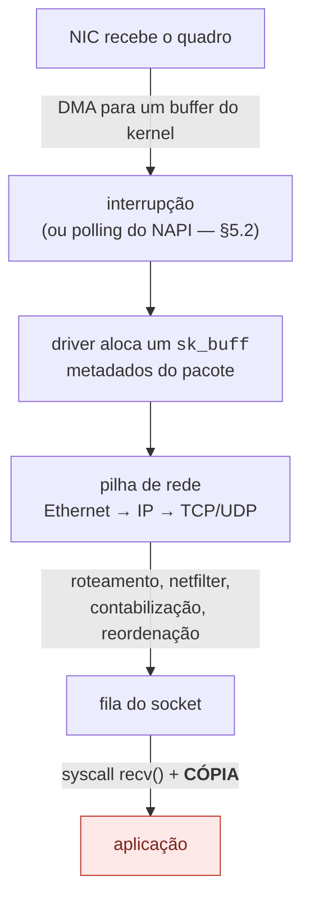
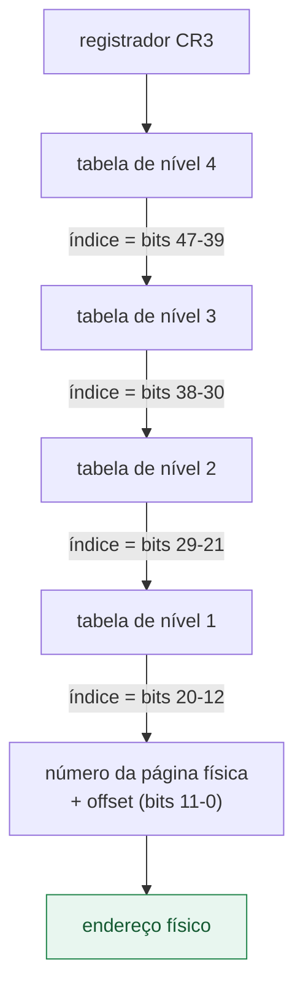
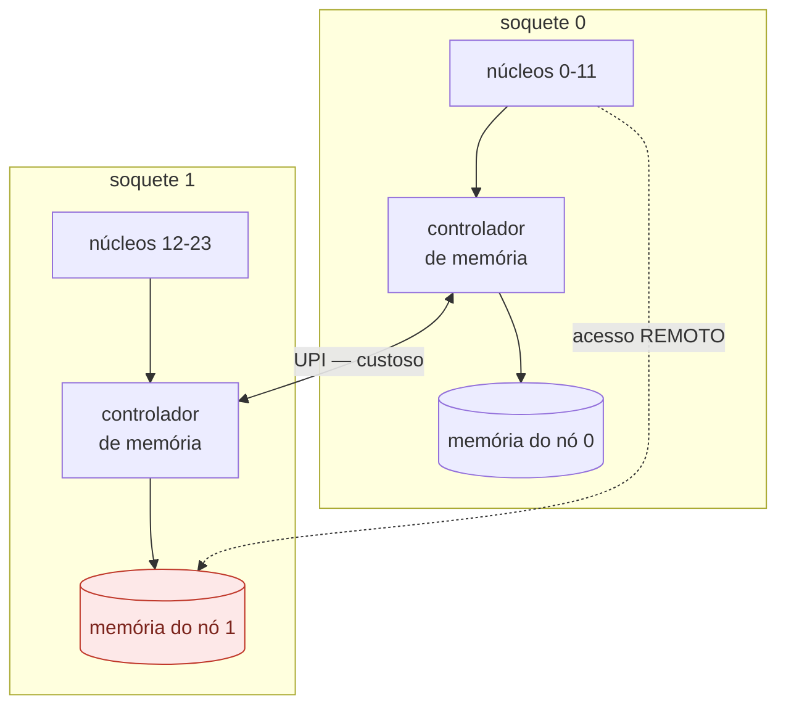
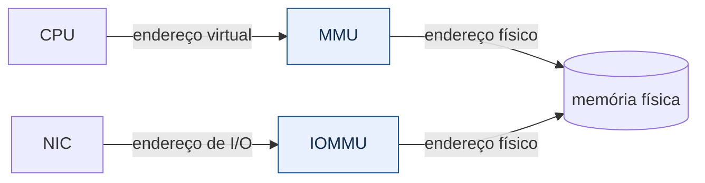

# Fundamentos — o problema, antes da ferramenta

> **Níveis 1 e 2** do [plano de estudo](../plano-estudo-dpdk.md) ·
> Sem pré-requisitos · Próximo: [Runtime do DPDK](../02-runtime-dpdk/)

Este documento não fala de DPDK. Ele estabelece **por que o DPDK precisa
existir** — e faz isso com números que você pode reproduzir na sua máquina em
menos de um minuto (seção 9).

A tese é simples: em redes de alta taxa, o tempo disponível por pacote é tão
curto que as abstrações confortáveis do sistema operacional deixam de caber
dentro dele. Entender *quanto* elas custam é o que separa engenharia de
folclore.

> **Um termo, antes de começar.** Este documento fala o tempo todo em **plano de
> dados**, tradução consagrada de *data plane*. Vale desfazer a ambiguidade: aqui
> "plano" não é *plano* no sentido de planejamento, e sim de **camada** — como em
> plano geométrico. Também se encontra "plano de encaminhamento"
> (*forwarding plane*), que é sinônimo.
>
> A distinção que o termo carrega é entre duas partes de um sistema de rede:
>
> | | O que faz | Com que frequência executa |
> |---|---|---|
> | **Plano de controle** | decide as rotas, a configuração, a política | raramente — ao mudar a topologia |
> | **Plano de dados** | trata **cada pacote**: recebe, classifica, encaminha | milhões de vezes por segundo |
>
> Tudo neste documento se refere ao segundo. É por isso que um custo de trezentos
> nanossegundos, irrelevante no plano de controle, decide o projeto inteiro no
> plano de dados: lá ele é pago uma vez; aqui, a cada pacote.
>
> O termo irmão é **caminho quente** (*hot path*): o trecho de código executado
> uma vez por pacote, onde cada ciclo e cada alocação custam vazão.

---

> **In English.** Why data-plane software needs different foundations. Measures,
> on a named machine: the **67.2 ns** per-packet budget at 10 GbE with 64-byte
> frames; a real syscall at **33.5 ns** — about 2 fit in that budget — against
> **0.92 ns** for a function call; the cost of losing cache locality and of
> crossing NUMA. Ends at the other side of the budget: when service time passes
> arrival time, loss is a **cliff, not a ramp**, and the p99 degrades *before*
> the median does. Programs in [`medicoes/`](medicoes/).

## Ao final deste módulo, você será capaz de

1. **calcular o orçamento de tempo por pacote** para uma taxa e um tamanho de
   quadro, e dizer o que cabe dentro dele;
2. **explicar por que atravessar a fronteira user/kernel** custa o que custa, e
   medir esse custo na sua máquina;
3. **identificar falso compartilhamento** em código próprio, e corrigi-lo;
4. **prever o efeito de localidade** — sequencial contra aleatório, página de
   4 KB contra 2 MB — antes de medir;
5. **decidir onde fixar uma thread** a partir da topologia de cache da máquina, e
   justificar a escolha com número;
6. **escolher entre um primitivo de sincronização e outro** sabendo o preço de
   cada um sem disputa e sob disputa;
7. **ler uma métrica de latência** sem se enganar: mediana contra média,
   percentil, dispersão, e por que a média mente.

---

## 1. O orçamento: quanto tempo existe por pacote

Tudo começa aqui, e quem define os números é o **IEEE**, na norma
[802.3][ieee8023] — a especificação da Ethernet. Ela estabelece que cada quadro
carrega 20 bytes de overhead além dos dados: **7 de preâmbulo, 1 de delimitador
de início de quadro e 12 de intervalo entre quadros** (*interframe gap*), e que o
quadro mínimo tem **64 bytes**. Somando, um quadro mínimo ocupa **84 bytes na
linha**.

Em 10 Gbit/s:

```
10 000 000 000 bits/s ÷ (84 bytes × 8 bits) = 14 880 952 pacotes/s
1 s ÷ 14 880 952 = 67,2 nanossegundos por pacote
```

| Velocidade | Quadro | Taxa máxima | Tempo por pacote |
|---|---|---:|---:|
| 10 GbE | 64 B | 14,88 Mpps | **67,2 ns** |
| 10 GbE | 1500 B | 0,82 Mpps | 1216 ns |
| 25 GbE | 64 B | 37,2 Mpps | 26,9 ns |
| 100 GbE | 64 B | 148,8 Mpps | **6,7 ns** |

Duas leituras importantes:

**O tamanho do quadro muda tudo.** O mesmo enlace de 10 GbE exige 18 vezes mais
decisões por segundo com quadros pequenos. Por isso *benchmarks* sérios sempre
declaram o tamanho do quadro — "10 Gbps" sem essa informação não diz nada sobre
a carga de CPU.

**67 ns é pouco.** Numa CPU a 3 GHz, são cerca de 200 ciclos. É o orçamento
total para receber, examinar, decidir e transmitir. Guarde esse número: ele é o
critério para julgar tudo o que vem a seguir.

---

## 2. A fronteira user-space / kernel-space

O sistema operacional separa dois modos de execução: o código da aplicação
(*user-space*) e o do kernel. Toda vez que a aplicação precisa de um serviço do
kernel — ler um socket, por exemplo — ela atravessa essa fronteira por meio de
uma [chamada de sistema][syscall].

A travessia não é gratuita. Ela troca o modo do processador, salva e restaura
registradores, e polui cache e preditor de saltos. Medindo nesta máquina de
referência ([`custo-syscall.c`](medicoes/custo-syscall.c)):

```
  medicao                              mediana  p25-p75 (IQR)   amplitude min-max  disp    CV
  ---------------------------------- ---------  --------------- ----------------- ----- -----
  chamada de funcao (user-space)         0.924  0.922-0.926     0.920-0.937         0.4%   0.4%
  clock_gettime (vDSO, sem trap)         15.54  15.53-15.58     15.52-20.16         0.3%  10.0%
  syscall real (SYS_getpid)              33.55  33.42-33.76     33.28-34.04         1.0%   0.6%

  syscall custa 36x uma chamada de funcao

Orcamento de 10 GbE com quadros de 64 B: 67.2 ns por pacote
  syscalls que cabem nesse orcamento: 2.00

  O caminho tradicional do kernel gasta pelo menos uma syscall por
  lote de pacotes, mais interrupcao, alocacao de sk_buff e copia.
```

> **Esta tabela já publicou 0,115 ns e "294×", e os dois estavam errados.** A
> função de referência não tinha argumento nem efeito colateral e devolvia
> constante, então o GCC a classificou como `const`, dobrou a chamada no
> literal e a içou para fora do laço — `__attribute__((noinline))` impede
> *inlining*, não propagação interprocedural de constante. O laço medido era
> `movq $0x2a, sumidouro` duas vezes, sem nenhuma instrução `call`, e a razão
> comparava uma syscall com dois *stores*.
>
> A correção foi tornar a função opaca ao compilador, com `asm volatile` e
> clobber de memória. Confira que a chamada existe antes de confiar no número:
>
> ```bash
> objdump -d build/docs/01-fundamentos/medicoes/custo-syscall | \
>     awk '/<m_funcao>:/,/^$/' | grep call
> ```
>
> Fica o método, que vale além deste caso: **em microbenchmark, desmonte antes
> de publicar.** Um laço rápido demais é hipótese de erro de medição antes de
> ser resultado.

As colunas da tabela são explicadas na [§7](#percentil-o-que-quer-dizer-p99) e
na [§9](#9-validação-reproduza-na-sua-máquina); por ora basta a mediana.

O resultado central: **cabem cerca de duas chamadas de sistema no orçamento de
um pacote.** E `getpid()` é a syscall mais barata que existe — não faz I/O, não
toca em memória do usuário, não dorme. Uma `recvmsg()` real custa muito mais.

Repare que esse resultado **não dependia** do número errado: ele sai de 33,55 ns
contra 67,2 ns de orçamento, e a chamada de função não entra na conta. O que a
correção mudou foi a razão syscall/chamada — de "294×" para 36× —, que é uma
frase de efeito, não o argumento. O argumento é o orçamento.

O caso do [vDSO][vdso] merece atenção porque antecipa a ideia toda: o kernel
mapeia algumas funções diretamente no espaço do processo, de modo que
`clock_gettime()` executa **sem trap** — e por isso custa 16 ns em vez de 33. É
a mesma estratégia que o DPDK levará ao extremo: tirar a fronteira do caminho
quente.

---

## 3. O caminho tradicional de um pacote

Vale conhecer o caminho padrão antes de contestá-lo, porque ele é excelente para
aquilo que foi projetado: generalidade, isolamento e correção.



Cada etapa cobra:

| Etapa | Custo |
|---|---|
| Interrupção | troca de contexto; mitigada por [NAPI][napi], que alterna para *polling* sob carga (§5.2) |
| Alocação de `sk_buff` | estrutura de ~200 bytes por pacote, alocada e liberada |
| Travessia da pilha | generalidade: trata todos os protocolos e todas as opções |
| `recv()` | syscall (~33 ns no mínimo) mais **cópia** dos dados |

Nada disso é desperdício no caso geral — é o preço de uma pilha que funciona
para qualquer aplicação, com isolamento entre processos. O problema aparece
apenas quando o orçamento cai para 67 ns.

> **O que o DPDK faz:** remove todas essas etapas do caminho de dados. A NIC é
> desvinculada do driver do kernel e ligada a [`vfio-pci`][drivers]; um driver
> em *poll mode* — que pergunta em laço se chegou pacote, em vez de esperar ser
> avisado, e é definido na [§5.2](#52-polling-a-pergunta-que-o-plano-de-dados-responde-de-outro-jeito) —
> dentro do processo lê os descritores da NIC diretamente. Sem
> interrupção, sem `sk_buff`, sem pilha genérica, sem syscall, sem cópia.
> O custo dessa escolha é o assunto da seção 8.

---

## 4. Memória: onde o desempenho realmente se decide

### 4.1 Memória virtual: o que significa "traduzir um endereço"

Nenhum endereço que seu programa manipula é o endereço real de um byte na
memória física. Quando você imprime um ponteiro, vê um **endereço virtual** — um
número que só faz sentido dentro do seu processo. O endereço físico
correspondente é escolhido pelo sistema operacional e pode mudar.

Essa indireção é o que permite que dois processos usem o mesmo endereço
`0x7fff...` sem colidirem, que a memória seja alocada em pedaços não contíguos
sem o programa perceber, e que um processo não consiga ler a memória de outro.
É uma das ideias mais valiosas da computação — e ela cobra por acesso.

**Traduzir** um endereço virtual significa descobrir a que endereço físico ele
corresponde. Isso não é um cálculo; é uma **consulta a uma estrutura de dados na
memória**, feita pelo hardware a cada acesso.

#### A anatomia do endereço

A memória é gerida em blocos de tamanho fixo chamados **páginas** — 4 KB por
padrão no Linux. A tradução opera sobre páginas inteiras, nunca sobre bytes
individuais. Por isso o endereço virtual se divide em duas partes:

```
 endereço virtual de 48 bits, página de 4 KB

  47      39 38      30 29      21 20      12 11          0
 ┌──────────┬──────────┬──────────┬──────────┬─────────────┐
 │  nível 4 │  nível 3 │  nível 2 │  nível 1 │   offset    │
 │  9 bits  │  9 bits  │  9 bits  │  9 bits  │   12 bits   │
 └──────────┴──────────┴──────────┴──────────┴─────────────┘
  └──────────── qual página (36 bits) ───────┘ └ onde dentro ┘
```

Os 12 bits finais são o deslocamento dentro da página (2¹² = 4096 bytes, o
tamanho exato de uma página) e **não precisam de tradução alguma**: eles passam
direto para o endereço físico. Só os 36 bits superiores — o número da página —
precisam ser traduzidos.

#### A caminhada pelas tabelas de página

Traduzir 36 bits por uma tabela única exigiria 2³⁶ entradas, ou seja, 512 GB de
tabela por processo. Inviável. A solução é uma **árvore de quatro níveis**, e os
36 bits são fatiados em quatro grupos de 9.

Nove bits endereçam 512 entradas. Cada entrada tem 8 bytes. Logo cada tabela
ocupa 512 × 8 = **4096 bytes — exatamente uma página**. O projeto se fecha
sobre si mesmo com elegância.

A tradução, então, funciona assim (é isto que se chama *page walk*):



São **quatro acessos à memória** antes do acesso que você pediu — e é por isso
que a TLB existe.

O ponto que interessa: **cada seta é um acesso à memória**. Traduzir um único
endereço custa até quatro leituras antes que o dado que você realmente queria
seja lido — e essas leituras podem, elas próprias, faltar no cache. Nesta
máquina, `address sizes: 48 bits virtual` confirma os quatro níveis; CPUs mais
recentes com `la57` usam cinco.

#### A TLB: a cache que torna isso viável

Se cada acesso pagasse quatro leituras extras, nada funcionaria. Por isso o
processador mantém uma cache específica para traduções já resolvidas: a
**TLB** (*Translation Lookaside Buffer*).

- **Acerto na TLB:** a tradução sai em ~1 ciclo, e o *page walk* não acontece.
- **Falta na TLB:** o hardware executa a caminhada completa e guarda o resultado.

A TLB é pequena — algumas centenas a poucos milhares de entradas. O que importa
não é o número de entradas, e sim o **alcance** (*TLB reach*): quanta memória
elas cobrem juntas.

```
alcance = entradas × tamanho da página
```

Com páginas de 4 KB, mil entradas cobrem 4 MB. Um programa que percorre um
conjunto de trabalho de 512 MB de forma dispersa vai faltar na TLB quase
sempre — e pagar a caminhada em quase todo acesso.

#### Por que hugepages, então

As [hugepages][hugetlb] de 2 MB atacam a fórmula pelos dois lados.

**Aumentam o alcance em 512×.** As mesmas mil entradas passam a cobrir 2 GB em
vez de 4 MB.

**Encurtam a caminhada.** Com página de 2 MB, o offset passa a ter 21 bits
(2²¹ = 2 MB), consumindo os 9 bits que seriam do nível 1. A entrada do nível 2
aponta diretamente para o quadro físico: **três acessos em vez de quatro**.

```
 endereço virtual de 48 bits, hugepage de 2 MB

  47      39 38      30 29      21 20                     0
 ┌──────────┬──────────┬──────────┬───────────────────────┐
 │  nível 4 │  nível 3 │  nível 2 │        offset         │
 │  9 bits  │  9 bits  │  9 bits  │       21 bits         │
 └──────────┴──────────┴──────────┴───────────────────────┘
                            └── aponta direto para o quadro de 2 MB
```

O efeito é mensurável ([`custo-traducao.c`](medicoes/custo-traducao.c)), com
percurso disperso sobre 512 MB:

```
  medicao                              mediana  p25-p75 (IQR)   amplitude min-max  disp    CV
  ---------------------------------- ---------  --------------- ----------------- ----- -----
  paginas de 4 KB                        119.5  113.5-125.7     112.3-152.2        10.2%  11.4% !
  hugepages de 2 MB                      101.3  101.0-110.5     98.3-122.0          9.4%   7.9% ~

  diferenca (o custo do page walk): 18.2 ns  (15.2%)
```

Os ~100 ns comuns às duas medições são a latência da RAM, que hugepage nenhuma
elimina. **A diferença é o custo do *page walk*** — e é exatamente isso que as
hugepages removem, algo entre 10 e 18 ns conforme a execução, ou seja **15% a
27% do orçamento** de um pacote de 64 B em 10 GbE, gastos antes de qualquer
trabalho útil.

Repare no selo: esta é uma das medições **menos** estáveis do documento
(`disp` de 10,2%, marcada `!`). Faz sentido — cada amostra mapeia e percorre
512 MB, disputando memória com todo o resto da máquina. A conclusão qualitativa
(hugepages eliminam o page walk) é sólida; o valor exato, não.

Daí a exigência do DPDK: os buffers de pacote vivem em hugepages não por
capricho, mas porque um plano de dados percorre grandes regiões de memória de
forma pouco previsível — o pior caso possível para a TLB.

```bash
getconf PAGE_SIZE                        # 4096
grep -E "Hugepagesize|HugePages_" /proc/meminfo
cat /proc/self/maps                      # mapeamentos virtuais deste processo
```

### 4.2 Cache e localidade

A memória não é plana. Cada nível é mais rápido e menor que o seguinte, e a
transferência entre eles acontece em blocos de **64 bytes** — a *linha de cache*.

Medindo o efeito ([`efeito-cache.c`](medicoes/efeito-cache.c)):

```
  cabe em    tamanho    sequencial   aleatorio   penalidade   CV do aleatorio
                        (tempo AMORTIZADO por acesso, nao latencia)
  L1d          16 KB      0.193 ns    0.244 ns        1.3x        2.8%
  L2          256 KB      0.193 ns    0.297 ns        1.5x        2.4%
  L3         8192 KB      0.194 ns     1.06 ns        5.5x       24.5%  !
  RAM      262144 KB      0.202 ns     7.68 ns       38.1x        8.0%  ~
```

Este é o resultado mais instrutivo do documento, e tem duas metades:

> **As duas colunas são tempo amortizado por acesso, não latência.** A distinção
> decide a leitura: 0,193 ns é cerca de **um ciclo** nesta máquina, e nenhum
> acesso à memória custa um ciclo. O que se mede é o custo médio quando o
> processador tem liberdade para buscar várias linhas em paralelo e adiantar as
> seguintes. Latência de um acesso isolado e dependente é outra grandeza, maior,
> e exige perseguir ponteiros para ser medida — o que este programa não faz.

**A coluna sequencial é plana.** Percorrer 256 MB custa o mesmo por acesso que
percorrer 16 KB. O *prefetcher* do processador reconhece o padrão e busca a
linha seguinte antes que ela seja pedida. A latência da RAM continua existindo —
ela é apenas escondida.

**A coluna aleatória degrada 38 vezes.** Sem padrão previsível, o prefetcher não
ajuda, e cada acesso paga a latência real: 7,7 ns. Isso é **11% do orçamento
inteiro de um pacote**, gasto em um único acesso a memória.

Repare no CV da linha do L3: **24,5%, marcado como instável**. Ali o conjunto de
trabalho fica na fronteira entre caber e não caber no L3, e o resultado depende
do que mais estiver ocupando o cache — o próprio número avisa que não deve ser
citado como constante.

> **Consequência de projeto:** "usar estruturas contíguas" não é preferência
> estética. Um vetor percorrido em ordem e uma lista encadeada com os mesmos
> dados diferem por uma ordem de grandeza, e a diferença sai do seu orçamento
> de 67 ns.

### 4.2.1 Falso compartilhamento: o erro mais comum de quem escreve plano de dados

A linha de cache tem 64 bytes, e o protocolo de coerência opera sobre **linhas
inteiras**, nunca sobre variáveis. Dessa combinação nasce o defeito de
desempenho mais frequente em código concorrente — e o mais difícil de enxergar,
porque o código parece correto.

> **Falso compartilhamento** (*false sharing*) — duas threads escrevem em
> **variáveis diferentes** que por acaso caem na **mesma linha de cache**. Do
> ponto de vista do programa não há compartilhamento algum; do ponto de vista do
> hardware, há. Cada escrita de uma invalida a linha na outra, e a linha passa a
> migrar entre os núcleos a cada acesso.

O nome engana de propósito: não há compartilhamento de dado. Há
compartilhamento de **endereço arredondado para 64 bytes**, que é o que o
hardware enxerga.

#### Quanto custa

O custo é exatamente o da travessia medida na [§4.3](#43-numa-quando-a-memória-deixa-de-ser-uma-coisa-só)
— 17 ns dentro do domínio, mais de 80 entre domínios — só que pago **a cada
acesso**, e sem que nada no código sugira que algo está sendo compartilhado.

Este documento tem uma demonstração involuntária. Durante a construção das
medições deste diretório, o falso compartilhamento apareceu três vezes. Num dos
casos, a flag de parada de uma thread auxiliar ficou 32 bytes antes do mutex
medido:

```
  0x5200  parar_ruido     <- thread auxiliar apenas LÊ esta variável, em laço
  0x5220  mtx             <- thread de medição ESCREVE aqui a cada lock/unlock
          └─ mesma linha de 64 bytes ─┘
```

O custo medido do mutex saltou de **8 ns para 53 ns** — mais de seis vezes.
Nenhuma variável era compartilhada; nenhuma linha de código sugeria disputa. Só
o endereço.

Repare que a thread auxiliar apenas **lia** sua flag. Leitura basta: enquanto um
núcleo lê a linha, ele a mantém em estado compartilhado, e o núcleo que escreve
precisa invalidá-la antes de cada escrita.

#### Como evitar

**Alinhe o que é escrito por threads diferentes.** Em C11 e C++, `_Alignas(64)`
ou `alignas(64)`; no DPDK, a macro `__rte_cache_aligned` faz o mesmo usando o
tamanho de linha da plataforma.

> **lcore** (*logical core*, núcleo lógico) — a unidade de execução do DPDK. O
> [glossário oficial][glossario] a define como *"unidade lógica de execução do
> processador, às vezes chamada de thread de hardware ou thread da EAL"*. Na
> prática é uma **thread criada pela EAL e fixada a uma CPU lógica**, escolhida
> pelo argumento `-l`. Não confunda com núcleo físico: numa CPU com SMT, dois
> lcores podem cair no mesmo núcleo e disputar as mesmas unidades de execução —
> efeito medido na [§5.1.1](#511-smt-duas-cpus-lógicas-não-são-dois-núcleos).

```c
struct statisticss_por_lcore {
    uint64_t pacotes;
    uint64_t bytes;
} __rte_cache_aligned;                 /* uma linha por lcore, sem sobreposição */

static struct statisticss_por_lcore stats[RTE_MAX_LCORE];
```

Sem o alinhamento, esse vetor é o exemplo canônico do problema: contadores de
lcores vizinhos caem na mesma linha, e cada incremento invalida o do vizinho.

**Verifique no binário quando desconfiar.** O compilador e o ligador decidem o
posicionamento, então a inspeção é objetiva:

```bash
objdump -t ./seu_binario | grep -E 'variavel_a|variavel_b'
# se a distância entre os endereços for menor que 64, estão na mesma linha
```

**Cuidado com o que parece inofensivo.** Uma flag booleana lida em laço, um
contador de depuração, um ponteiro de estado — qualquer um deles ao lado de um
dado quente basta para criar o problema.

> **Por que isso é o erro mais comum em DPDK especificamente:** o modelo do
> DPDK é um lcore por núcleo, cada um com seu estado. Estruturas indexadas por
> lcore são onipresentes — contadores, filas, caches de mempool. Se o vetor não
> for alinhado por linha de cache, todo o ganho de dedicar um núcleo a cada
> thread é devolvido em invalidações.

---

### 4.3 NUMA: quando "a memória" deixa de ser uma coisa só

Até aqui tratamos a memória como um recurso uniforme: um endereço é um endereço,
e o custo de acessá-lo depende só de qual nível de cache o contém. Em máquinas
de vários soquetes isso deixa de ser verdade, e a razão é arquitetural.

> Um **soquete** é o encaixe físico da placa-mãe onde um processador é
> instalado. Uma máquina de dois soquetes tem dois processadores distintos —
> não dois núcleos, e sim dois chips separados, cada um com seus próprios núcleos,
> seu próprio cache e, o que importa aqui, seus próprios pentes de memória ligados
> diretamente a ele. Servidores costumam ter dois ou quatro; notebooks e desktops,
> apenas um. Confira o seu com `"LC_ALL=C lscpu | grep -i socket"` — o `"LC_ALL=C"`
> evita depender do idioma do sistema, já que em português a linha aparece como
> "Soquete(s)".

É essa separação física que faz o custo de um acesso passar a depender de *onde*
o dado está, e não apenas de *quão recentemente* ele foi usado.

#### Por que NUMA existe

No modelo antigo (SMP), todos os processadores compartilhavam um barramento
único até a memória. Funciona bem com poucos núcleos, mas o barramento vira
gargalo: a banda é fixa e dividida entre todos, e a disputa cresce com o número
de núcleos.

A saída foi **dar a cada soquete seu próprio controlador de memória**. Cada
processador passa a ter memória fisicamente ligada a ele, e os soquetes se
comunicam por uma interconexão dedicada (UPI na Intel, Infinity Fabric na AMD).
A banda total agora cresce com o número de soquetes — mas ao preço de a memória
deixar de ser uniforme. Daí o nome: *Non-Uniform Memory Access*, acesso não
uniforme à memória.



Para os núcleos do soquete 0, a memória do nó 0 é **local** e a do nó 1 é
**remota** — mesma instrução, latência diferente.

Um núcleo do soquete 0 lendo memória do nó 1 atravessa a interconexão: paga mais
latência e divide uma banda menor que a local. Em máquinas típicas de dois
soquetes o acesso remoto custa algo entre 1,5 e 2,2 vezes o local — mas esse
número varia tanto por geração e configuração que **só vale medido na sua
máquina**.

#### A matriz de distâncias, e o que ela não é

O firmware informa ao sistema operacional uma matriz de distâncias relativas:

```bash
numactl --hardware
```

```
node distances:
node     0    1
   0:   10   21
   1:   21   10
```

Estes números são **relativos, não nanossegundos**. Por convenção, 10 representa
o acesso local, e os demais são proporções aproximadas em relação a ele: 21
significa "cerca de 2,1 vezes o custo local". Vêm de uma tabela do firmware (a
SLIT, do padrão ACPI) e são uma **declaração do fabricante**, não uma medição.
Trate-os como indicação de topologia, e meça se o número importar.

#### Um soquete já não significa um nó

Processadores modernos podem ser configurados para expor **vários nós NUMA
dentro do mesmo soquete** — Sub-NUMA Clustering na Intel, NPS na AMD. A
motivação é a mesma em escala menor: dividir o cache L3 e os canais de memória
em domínios menores reduz a disputa interna.

A consequência prática é que a intuição "um soquete, um nó" está errada, e a
topologia precisa ser consultada em vez de presumida.

#### Onde a memória realmente é alocada: a política de primeiro toque

Este é o ponto que mais causa surpresa, e vale enunciá-lo com clareza:

> **`malloc()` não decide em que nó a memória vai ficar.** Ela apenas reserva
> endereços virtuais. A página física só é alocada no primeiro acesso, e vai
> para o nó da thread **que tocou a página primeiro** — não o da que a alocou.

É a política de [primeiro toque][mempolicy] (*first touch*), padrão no Linux.
Ela produz um erro clássico em programas paralelos:

```c
/* ERRADO: a thread principal toca tudo, e todas as páginas vão para o nó dela */
buffer = malloc(tamanho);
memset(buffer, 0, tamanho);          /* <- primeiro toque acontece aqui */
#pragma omp parallel                  /* threads em outros nós leem remoto */

/* CERTO: cada thread inicializa a fatia que vai processar,
   e cada página nasce no nó de quem a usa */
buffer = malloc(tamanho);
#pragma omp parallel
    memset(minha_fatia, 0, meu_tamanho);
```

Dá para inspecionar onde as páginas de um processo realmente estão:

```bash
cat /proc/self/numa_maps     # N0=242 significa 242 páginas no nó 0
numastat -p <pid>            # resumo por nó
```

Nesta máquina, uma linha de `numa_maps` é:

```
5ed775136000 default file=/usr/bin/head mapped=242 ... N0=242 kernelpagesize_kB=4
```

`default` é a política, `N0=242` diz que as 242 páginas estão no nó 0, e
`kernelpagesize_kB=4` confirma páginas normais — o mesmo arquivo mostraria 2048
para regiões em hugepages.

#### O que muda no plano de dados

Uma NIC não flutua no sistema: ela está conectada a um barramento PCIe que
pertence a um soquete específico. Quando ela escreve um pacote por DMA, escreve
na memória de **algum** nó. Se esse não for o nó do núcleo que vai processar o
pacote, cada acesso ao cabeçalho atravessa a interconexão — e isso acontece
milhões de vezes por segundo.

A regra prática se decompõe em três alinhamentos, todos necessários:

| Elemento | Deve ficar no nó | Como se controla |
|---|---|---|
| Pool de buffers | o da NIC | `socket_id` em [`rte_pktmbuf_pool_create()`][apipoolcreate] |
| Filas de RX/TX | o da NIC | `socket_id` no *queue setup* |
| Núcleos de processamento | o da NIC | `-l` / `--lcores` da [EAL][cEAL] |
| Hugepages reservadas | distribuídas por nó | `--socket-mem 1024,1024` |

O DPDK expõe a topologia diretamente: [`rte_eth_dev_socket_id(port)`][apidevsocket]
devolve o nó da NIC, e [`rte_lcore_to_socket_id(lcore)`][lcore] o do núcleo.
Compará-los antes de alocar é rotina em aplicação séria.

#### Uma armadilha real desta máquina

Consultando o nó da NIC pelo sysfs, esta máquina responde:

```bash
cat /sys/bus/pci/devices/0000:08:00.0/numa_node
-1
```

**`-1` não é o nó menos um: significa "sem afinidade declarada".** É o que o
firmware costuma reportar em máquinas de soquete único, onde a pergunta não faz
sentido. O DPDK trata esse caso como `SOCKET_ID_ANY`.

O erro a evitar é passar esse valor diretamente como nó de alocação. Encadear
[`rte_eth_dev_socket_id()`][apidevsocket] dentro de
[`rte_pktmbuf_pool_create()`][apipoolcreate] sem checar o retorno pode falhar ou
alocar no lugar errado:

```c
/* ERRADO: -1 vira socket_id e a alocação pode não ir para nó nenhum */
mp = rte_pktmbuf_pool_create(nome, n, cache, priv, tam,
                             rte_eth_dev_socket_id(porta));

/* CERTO: valor negativo significa "qualquer nó serve" */
int no = rte_eth_dev_socket_id(porta);
if (no < 0)
    no = (int)rte_socket_id();          /* nó do lcore corrente */
mp = rte_pktmbuf_pool_create(nome, n, cache, priv, tam, no);
```

O `SOCKET_ID_ANY` do DPDK vale `-1` justamente para esse caso; o que não se pode
é usá-lo como índice sem antes reconhecê-lo. Note que
[`rte_socket_id()`][apisocketid] devolve o nó do lcore que está executando, que é
a escolha razoável quando o dispositivo não declara afinidade.

#### Inspecionando a sua máquina

```bash
numactl --hardware                              # nós, memória e distâncias
LC_ALL=C lscpu | grep -i numa                   # quais CPUs em cada nó
cat /sys/bus/pci/devices/<BDF>/numa_node        # nó da NIC (-1 = não declarado)
numastat                                        # acertos e erros de alocação por nó
cat /proc/self/numa_maps                        # onde estão as páginas do processo
```

#### E numa máquina de um soquete, dá para ver algum efeito de topologia?

Sim — mas não o de NUMA, e é importante não confundir os dois.

**O que não funciona.** O kernel oferece emulação de NUMA por parâmetro de boot
([`numa=fake=N`][kparams]), e alguns BIOS AMD oferecem expor cada CCD como nó
NUMA ("ACPI SRAT L3 Cache as NUMA Domain"). Ambos criam nós no papel, mas em
processador de soquete único **todos os núcleos compartilham o mesmo controlador
de memória**. A latência de memória continua idêntica entre os nós inventados.
Medir "acesso remoto" ali daria diferença nenhuma, e a conclusão seria falsa.
Vale a regra: *nó NUMA sem controlador de memória próprio não é nó NUMA.*

**O que funciona.** Existe uma assimetria real nessas máquinas, só que de outra
natureza: **os núcleos não são equidistantes entre si**. Processadores AMD
modernos agrupam núcleos em blocos (CCD), cada um com sua fatia de L3; a Intel
faz algo análogo com clusters. Dois núcleos do mesmo bloco conversam pelo L3
compartilhado. Núcleos de blocos diferentes precisam atravessar a interconexão
interna do chip.

Isso o kernel já expõe, sem BIOS e sem reiniciar:

```bash
cat /sys/devices/system/cpu/cpu0/cache/index3/shared_cpu_list
```

Na máquina de referência (Ryzen 9 9900X, 12 núcleos) há dois blocos:

```
    dominio 0: CPUs 0-5,12-17
    dominio 1: CPUs 6-11,18-23
```

E a diferença é enorme ([`custo-comunicacao.c`](medicoes/custo-comunicacao.c)),
medindo o tempo de uma linha de cache viajar de um núcleo para outro:

```
  medicao                              mediana  p25-p75 (IQR)   amplitude min-max  disp    CV
  ---------------------------------- ---------  --------------- ----------------- ----- -----
  dentro do dominio 0 (cpu 0 <-> 2)      17.50  17.45-17.96     17.34-19.61         2.9%   4.1%
  ENTRE dominios (cpu 0 <-> 6)           82.99  82.71-87.96     82.53-122.96        6.3%  14.4% ~
```

**Atravessar a interconexão custa cerca de 4,7 vezes mais — e são 123% do
orçamento de um pacote de 64 B em 10 GbE.** Um único repasse entre núcleos mal
posicionados já estoura o orçamento inteiro, antes de qualquer trabalho útil.

A segunda linha é informação, não defeito: `disp` de 6,3% com CV de 14,4% — o
miolo tem dispersão moderada **e** o CV muito maior denuncia amostras isoladas
bem acima, de 83 a 123 ns na mesma coleta. **A travessia entre domínios é intrinsecamente instável nesta
máquina.** Foi só ao adotar amostragem estatística que isso ficou visível —
antes, medições únicas devolviam 100, 110 ou 117 ns e a variação parecia ruído
de medição, quando é propriedade do caminho medido.

Esse resultado tem consequência direta e imediata no projeto: o
[tópico 02](../../trilha/01-fundamentos/02-mempool-ring/) passa objetos entre
produtor e consumidor por um [`rte_ring`][guiaring], e cada repasse faz exatamente essa
viagem. Escolher `-l 0,2` ou `-l 0,6` na EAL não é detalhe de configuração — é a
diferença entre 22 ns e 117 ns por travessia.

> **Respondendo à pergunta de forma direta:** não vale ativar a opção de BIOS. Ela
> anunciaria uma assimetria de *memória* que não existe nesta máquina, enquanto a
> assimetria de *comunicação*, que existe e é grande, já está visível e mensurável
> sem ela. Para DPDK o argumento é ainda mais forte: como os lcores
> são fixados explicitamente com `-l`, a ajuda que a opção daria ao escalonador do
> sistema é irrelevante — o posicionamento é feito por você.

> **Limitação honesta:** a máquina de referência tem **um único nó NUMA**
> (`available: 1 nodes (0)`, distância `10`). O custo do acesso remoto à
> memória — a afirmação central desta seção — portanto **não foi medido aqui**,
> e a faixa de 1,5 a 2,2 vezes vem da literatura, não desta máquina. O que foi
> medido é outra coisa: a assimetria entre núcleos, real e grande nesta CPU. Não
> confunda as duas. Para medir NUMA de verdade é preciso hardware com dois ou
> mais soquetes, físico ou instância de nuvem grande o bastante.

---

## 5. Execução: threads, afinidade e o dilema do polling

### 5.1 Afinidade de CPU

Por padrão o escalonador move threads entre núcleos conforme a carga. Para uma
aplicação comum isso é bom. Para plano de dados é ruim: ao migrar, a thread
perde as caches quentes e a proximidade de NUMA.

A solução é fixar cada thread de processamento a um núcleo
([`sched_setaffinity`][affinity]) e, idealmente, retirar esse núcleo do
escalonador geral com [`isolcpus`][kparams]. O DPDK chama esses núcleos
dedicados de **lcores** e faz essa fixação por você.

### 5.1.1 SMT: duas CPUs lógicas não são dois núcleos

Nesta máquina: 24 CPUs lógicas, sendo **12 núcleos físicos com 2 fluxos cada**.
O sysfs diz quem é irmão de quem:

```bash
cat /sys/devices/system/cpu/cpu0/topology/thread_siblings_list
0,12
```

Os dois fluxos de um núcleo compartilham as unidades de execução, a L1 e o
preditor de saltos. O escalonador do sistema os apresenta como CPUs
independentes, e é aí que mora a armadilha.

Um laço de polling é o **pior caso possível** para SMT: ele nunca bloqueia,
nunca cede as unidades de execução, e portanto compete o tempo todo. Medindo o
custo dessa competição com trabalho de ALU de alto paralelismo de instruções
([`custo-comunicacao.c`](medicoes/custo-comunicacao.c)):

```
  medicao                              mediana  p25-p75 (IQR)   amplitude min-max  disp    CV
  ---------------------------------- ---------  --------------- ----------------- ----- -----
  laco sozinho no nucleo                 0.449  0.448-0.450     0.448-0.453         0.2%   0.4%
  vizinho no irmao SMT (cpu 12)           1.23  1.23-1.23       1.20-1.23           0.1%   0.7%
  vizinho em nucleo fisico (cpu 6)       0.447  0.447-0.448     0.447-0.452         0.1%   0.3%
```

**Compartilhar o núcleo custa 174%** — o laço fica 2,7 vezes mais lento. Usar um
núcleo físico distinto custa **zero**, dentro do ruído.

A consequência para o DPDK é direta: `-l 0,12` parece dar dois lcores e na
prática dá pouco mais que um. Ao escolher lcores, tome os **núcleos físicos**
primeiro. Nesta máquina, `-l 0-5` usa seis núcleos inteiros; `-l 0-2,12-14` usa
três núcleos com os dois fluxos de cada.

> A ressalva honesta: SMT não é sempre ruim. Ele ajuda quando as threads têm
> paralelismo de instruções *baixo* e ficam esperando memória — uma preenche as
> bolhas da outra. O caso medido acima é o oposto, e é justamente o do plano de
> dados: laços apertados que saturam as ALUs.

### 5.2 Polling: a pergunta que o plano de dados responde de outro jeito

Toda thread que reage a eventos enfrenta a mesma questão: **como ela fica sabendo
que chegou trabalho?** Existem duas respostas, e a escolha entre elas define o
modelo de execução do programa inteiro.

> **Polling (espera ativa)** — a thread **pergunta, sem parar, se o trabalho já
> chegou**. Ela não dorme, não cede a CPU e não pede nada ao sistema operacional:
> apenas relê um endereço em laço fechado até o valor mudar.
>
> ```c
> for (;;) {
>     n = rte_eth_rx_burst(porta, fila, pacotes, MAX);  /* devolve 0 se nada chegou */
>     if (n == 0)
>         continue;                                      /* pergunta de novo */
>     processa(pacotes, n);
> }
> ```
>
> O oposto é a **espera bloqueante**: a thread dorme e pede ao sistema que a
> acorde quando houver algo. Libera a CPU enquanto espera — mas alguém precisa
> acordá-la, e acordar custa.

O nome importa: os drivers do DPDK se chamam **[PMD][cPMD], de *Poll Mode Driver***.
Polling não é um detalhe de implementação; é o modelo de execução em torno do
qual tudo no DPDK é construído.

#### Quanto custa dormir — e o que exatamente é caro

Aqui é fácil errar o diagnóstico. Costuma-se atribuir o custo ao "mutex", mas a
medição mostra que a culpa é de outro fator. Separando as três coisas que se
confundem ([`custo-espera.c`](medicoes/custo-espera.c)):

As medições estão em dois cenários, e **a diferença entre eles é justamente o
que se quer descobrir**. Vale fixar os dois termos antes de ler os números:

> **Sem disputa** (*uncontended*) — **ninguém mais quer o mesmo primitivo** no
> instante em que você o usa. Como não há quem esperar nem quem acordar, ele toma
> seu **caminho rápido**: umas poucas instruções atômicas em espaço de usuário,
> sem chamada de sistema. Mede o **piso** do custo.
>
> Atenção: *sem disputa* **não** quer dizer *uma thread só*. Um processo com
> dezenas de threads tem travas sem disputa o tempo todo — é assim que código
> concorrente bem feito se comporta. Quantas threads existem é um **eixo
> separado**, e por isso todas as medições abaixo fixam esse eixo no valor
> realista: há sempre outra thread no processo.
>
> **No repasse** (*handoff*) — **duas threads, em núcleos diferentes**,
> alternando: uma entrega, a outra recebe e devolve. Aqui o primitivo faz aquilo
> para que existe, que é coordenar. Somam-se três custos: o do primitivo (o piso
> acima), o da **linha de cache migrando** de um núcleo para o outro, e, se a
> thread bloquear, o de **dormir e ser acordada**.
>
> Os dois **não são opostos**. O primeiro isola o primitivo; o segundo o coloca
> para trabalhar. É comparando os dois que se descobre **qual parcela do custo
> vem de quê** — e a resposta, adiantando, é que quase tudo vem da última.

Cada medição usa **25 amostras**, após 60 ms de aquecimento — sem o aquecimento,
a primeira medição mede o arranque da CPU (frequência baixa, caches frias) e não
o regime permanente. São publicadas a mediana, o intervalo interquartil, a
amplitude completa e o coeficiente de variação, para que a confiabilidade de
cada número fique visível em vez de precisar ser suposta.

**1. Sem disputa — ninguém mais quer o mesmo primitivo:**

```
  medicao                              mediana  p25-p75 (IQR)   amplitude min-max  disp    CV
  ---------------------------------- ---------  --------------- ----------------- ----- -----
  atomica relaxed (store+load)           0.206  0.206-0.207     0.206-0.213         0.5%   0.7%
  atomica seq_cst (store+load)            3.68  3.68-3.69       3.68-3.93           0.2%   1.8%
  mutex lock+unlock                       8.48  8.47-8.48       8.47-8.49           0.1%   0.1%
  spinlock lock+unlock                    4.43  4.43-4.43       4.42-4.44           0.1%   0.1%
  semaforo post+wait                      8.12  8.12-8.12       8.11-8.37           0.1%   0.8%
```

As duas últimas colunas medem a confiança do número: `disp` diz se o valor
típico é reprodutível, `CV` denuncia amostras isoladas destoantes. Como lê-las
juntas está na [§9](#9-validação-reproduza-na-sua-máquina).

Nenhum desses primitivos é caro. **Um mutex sem disputa custa 8,5 ns** —
resolve tudo em espaço de usuário, pelo caminho rápido do futex, sem chamada de
sistema. Todas as medições rodam **com outra thread presente no processo**, que
é o regime de qualquer programa concorrente real.

> **Aparte: o caminho rápido da glibc, e por que ele foi descartado.**
>
> A glibc mantém um atalho para processos de **thread única**, no qual o mesmo
> mutex custa ~2 ns em vez de 8,5 — não há com quem competir, então a instrução
> atômica é pulada. O número é real, e mesmo assim inválido como referência.
>
> A primeira razão é que nenhum programa concorrente o desfruta. A segunda é
> pior: o atalho é perdido **permanentemente** na primeira criação de thread, e
> não volta nem depois de a thread ser juntada.
>
> ```
>   antes de qualquer thread      :  2.40 ns
>   apos criar E JUNTAR uma thread:  8.99 ns
>   __libc_single_threaded = 0
> ```
>
> A consequência prática é fatal para a medição: o valor dependia da **ordem** em
> que as medições rodavam dentro do programa, variando de 2,4 a 9,0 ns conforme
> a posição no arquivo. **Medição que depende da ordem em que se mede não é
> medição** — por isso o regime de thread única foi abandonado, e a tabela acima
> reporta só o caso realista.

> **Por que não chamar os dois grupos de "mono-thread" e "multi-thread"?** É
> tentador, e a distinção acima mostra que a contagem de threads de fato importa
> — mas ela não é o eixo desta seção. *Sem disputa* não é sinônimo de
> *mono-thread*: um programa com dezenas de threads tem travas sem disputa o
> tempo todo, e é assim que código concorrente bem feito se comporta. E o rótulo
> "multi-thread" cobriria indistintamente **8,5 ns** (sem disputa), **102 ns**
> (repasse entre núcleos) e **1301 ns** (repasse com sono) — exatamente as três
> parcelas que esta seção existe para separar.

Dois detalhes da tabela merecem nota.

**O mutex custa 2,3 vezes uma atômica `seq_cst`** (8,48 contra 3,68 ns), e a
razão é aritmética: travar executa uma operação atômica de leitura-modificação-
escrita, destravar executa outra, mais a verificação de que ninguém espera. São
duas operações travadas contra uma. O mutex não é caro por ser mutex; é caro por
fazer mais.

**A ordenação de memória tem preço próprio.** A atômica `seq_cst`, com barreira
completa, custa 3,68 ns contra 0,21 ns da `relaxed` — dezoito vezes mais, sem
que nenhuma delas envolva outra thread. É por isso que o `rte_ring` usa
`acquire`/`release` em vez de `seq_cst`: a barreira mais fraca é suficiente para
a garantia que ele precisa, e a diferença sai do orçamento por pacote.

**2. No repasse — os mesmos primitivos coordenando duas threads em núcleos
diferentes:**

```
  medicao                              mediana  p25-p75 (IQR)   amplitude min-max  disp    CV
  ---------------------------------- ---------  --------------- ----------------- ----- -----
  atomica + espera ativa (nao dorme)     21.02  20.85-21.20     20.41-22.10         1.6%   2.0%
  mutex + espera ativa (nao dorme)       102.3  101.7-107.2     98.0-117.7          5.4%   5.0% ~
  mutex + condvar (DORME)               1301.0  1274.6-1351.1   1230.4-1397.1       5.9%   4.1% ~
  semaforo POSIX (DORME)                1286.6  1258.4-1302.0   1202.3-1499.3       3.4%   5.4% ~
```

**A comparação decisiva são as duas linhas do meio: é o mesmo mutex.** A única
diferença é que na segunda a thread realmente dorme, esperando ser acordada por
uma variável de condição. Isso multiplica o custo por **13**.

Ou seja: o problema nunca foi o mutex, nem o semáforo, nem a atômica. **O
problema é dormir.** Quando a thread bloqueia, entra o escalonador do sistema —
chamada de sistema, marcação de pronto, escolha da próxima thread, troca de
contexto — e é isso que custa mais de mil nanossegundos.

**No orçamento do plano de dados:**

```
    espera ativa cabe 3.2 vezes no orcamento de um pacote
    dormir gasta 19.4 orcamentos inteiros
```

Acordar uma thread consome o equivalente a **19 pacotes de 10 GbE**. No tempo de
ser acordado, dezenove pacotes teriam chegado — e sido descartados por falta
de buffer. Não há orçamento para dormir, e é por isso, e não por gosto por
micro-otimização, que o plano de dados faz polling.

> **E em C++23?** A conta é a mesma — com uma exceção que só apareceu ao
> verificar. `std::atomic`, `std::mutex` e `std::condition_variable` do libstdc++
> se apoiam nos mesmos mecanismos medidos aqui, e os tempos batem dentro do ruído
> (`std::atomic` gera instruções idênticas às de `_Atomic`; conferido no código
> objeto). Já `std::counting_semaphore` **não** envolve `sem_t`: o libstdc++ o
> implementa sobre atômicas com espera girando antes de bloquear, o que lhe dá
> comportamento — e custo — diferentes do semáforo POSIX nos dois sentidos.
>
> Confira você mesmo com [`scripts/validar-cpp-vs-c.sh`](../../scripts/validar-cpp-vs-c.sh),
> que compara instruções geradas, implementação escolhida e tempos lado a lado.
> A lição de fundo permanece: **a escolha de linguagem não muda esta conta; a de
> dormir ou não muda tudo** — mas convém confirmar qual primitivo de fato dorme.

#### Qual primitivo usar, afinal

A tabela de custos acima responde *quanto custa*, não *quando usar* — e ler só
os números leva à conclusão errada de que a atômica, por ser a mais barata,
serve para tudo. Não serve: cada primitivo protege uma coisa diferente.

Vale lembrar em que a recomendação a seguir se apoia, porque não é opinião. Três
medições desta seção a sustentam, e cada uma isola uma variável diferente:

| Estudo | O que isolou | Resultado |
|---|---|---|
| Sem disputa × no repasse | o custo do primitivo sozinho contra o de coordenar de fato | o primitivo é barato; **dormir** é que custa 13× |
| [Espelho em C e C++23](medicoes/custo-espera-cpp.cpp) | se a linguagem altera a conta | razão ~1,00× para atômica, mutex e condvar |
| [Posicionamento entre núcleos](#43-numa-quando-a-memória-deixa-de-ser-uma-coisa-só) | o mesmo código em núcleos diferentes | 17 ns no mesmo domínio, 83 a 123 ns entre domínios |

O segundo importa especialmente aqui: como os números batem em **duas
linguagens**, a orientação abaixo não é peculiaridade da glibc nem do libstdc++ —
é propriedade dos mecanismos que ambos usam. O terceiro lembra que a escolha do
primitivo é só metade da decisão; a outra metade é **onde** as threads rodam.

| Situação | Primitivo | Por quê | Medido em |
|---|---|---|---|
| Cada núcleo tem seu próprio estado | **nenhum** | sem compartilhamento não há o que sincronizar | — |
| Um contador, uma flag, um ponteiro | atômica `relaxed` | a operação já é indivisível; a ordem não importa | [`m_atomica_relaxed`](medicoes/custo-espera.c#L124) |
| Publicar dado e depois um sinal | atômica `acquire`/`release` | garante que quem vê o sinal vê o dado | [`m_repasse_atomica`](medicoes/custo-espera.c#L333) |
| Passar objetos entre núcleos | [`rte_ring`][guiaring] | fila sem trava, feita para isso | [`pipeline_ring.c`](../../trilha/01-fundamentos/02-mempool-ring/pipeline_ring.c) |
| Invariante entre várias variáveis, seção curta | spinlock | trava de verdade, sem custo de dormir | [`m_spinlock`](medicoes/custo-espera.c#L227) |
| Seção de duração imprevisível | mutex | dormir é aceitável fora do caminho quente | [`m_mutex_simples`](medicoes/custo-espera.c#L134), [`m_repasse_mutex_ativo`](medicoes/custo-espera.c#L351) |
| Esperar evento que pode demorar | condvar / semáforo | libera a CPU; **nunca** no caminho quente | [`m_repasse_condvar`](medicoes/custo-espera.c#L378), [`m_repasse_semaforo`](medicoes/custo-espera.c#L399) |

A última coluna leva **direto à linha** da função que produziu cada número, em
[`medicoes/custo-espera.c`](medicoes/custo-espera.c): recomendação e evidência
ficam a um clique uma da outra. A linha do `rte_ring` aponta para outro lugar
porque ele não é medido aqui — seu custo aparece no
[tópico 02](../../trilha/01-fundamentos/02-mempool-ring/), onde o repasse entre
núcleos é comparado com [`scripts/bench-ccd.sh`](../../scripts/bench-ccd.sh).

> **Âncoras de linha exigem manutenção.** Números de linha mudam quando o código
> muda, e um link desatualizado aponta em silêncio para o trecho errado. Por
> isso [`scripts/verificar-ancoras.py`](../../scripts/verificar-ancoras.py)
> confere se cada âncora ainda cai sobre a função que o texto promete, e roda
> junto com os testes.

Três critérios resolvem quase todos os casos:

**A atômica não substitui trava.** Ela torna indivisível **uma** operação sobre
**uma** variável. Se o invariante envolve duas variáveis — um índice e um
tamanho, um ponteiro e um contador —, atômicas isoladas não bastam, por mais
baratas que sejam.

**Spinlock ou mutex depende de quem pode dormir.** Girar só compensa se a seção
crítica for curta *e* o detentor não puder ser desagendado. Num lcore dedicado
do DPDK, isso vale. Numa thread comum, o escalonador pode tirá-la do núcleo
segurando a trava, e todos os que giram queimam CPU esperando alguém que não
está executando — trocando 4 ns por milissegundos.

**Ordenação forte raramente é necessária.** `seq_cst` custa dezoito vezes a
`relaxed` e é o padrão da linguagem, não a escolha certa por omissão. Prefira
`acquire`/`release`, que é o que o [`rte_ring`][guiaring] usa.

> **A melhor trava é a que não existe.** O modelo do DPDK — um lcore por núcleo,
> cada um com seu estado — não é preferência estética: é a forma de tornar a
> pergunta desta seção irrelevante na maior parte do código. Quando duas threads
> precisam mesmo se falar, o caminho preferido é a fila, não a trava. Sincronizar
> é o último recurso, não o primeiro.

#### O preço, dito com todas as letras

| | Espera bloqueante / interrupção | Polling |
|---|---|---|
| Reação a um evento | ~1300 ns (medido) | ~21 ns (medido) |
| CPU sem tráfego | livre para outras tarefas | **100% ocupada, sempre** |
| Consumo de energia | proporcional ao tráfego | constante, no máximo |
| Sob carga alta | risco de *livelock* de interrupções | eficiência máxima |
| Núcleos disponíveis ao SO | todos | os dedicados somem |

A linha decisiva é a segunda, e ela merece ser dita sem eufemismo: **um lcore em
polling consome 100% de um núcleo mesmo quando não passa um único pacote.** O
comando [`top`][mantop] vai mostrar 100% de uso permanente, e isso é o
funcionamento correto, não
um defeito. O DPDK troca eficiência de recursos por latência previsível.

Se a sua carga é intermitente — um serviço que fica ocioso a maior parte do
tempo —, essa troca é péssima: você paga um núcleo inteiro, e a energia dele,
para não fazer nada. Reconhecer isso é parte de decidir se o DPDK serve ao seu
problema.

#### O meio-termo do kernel, e o do próprio DPDK

O kernel não escolhe um lado: o [NAPI][napi] começa por interrupção e, ao receber
o primeiro pacote, desliga as interrupções daquela fila e passa a fazer polling
enquanto houver tráfego. Sob carga alta comporta-se como polling; ocioso,
consome nada.

O DPDK também oferece saída para cargas intermitentes:
[`rte_eth_dev_rx_intr_enable()`][apirxintr] permite dormir esperando interrupção
quando a fila seca.

Isso pode soar como contradição, depois de estabelecido que dormir custa o
equivalente a dezenove pacotes. Não é, e a razão vale enunciar: **o orçamento de
67 ns só existe quando há pacote chegando**. Se a fila secou, não há pacote cujo
prazo estourar — os 1300 ns de acordar são pagos uma vez, na volta do tráfego,
e diluídos por todo o período ocioso. O que a regra proíbe é dormir *entre
pacotes de uma rajada*, não dormir *entre rajadas*.

#### Onde isso já apareceu neste projeto

O laço do consumidor no [tópico 02](../../trilha/01-fundamentos/02-mempool-ring/)
é um laço de polling: ele chama [`rte_ring_dequeue_burst()`][apiringdeq] repetidamente e segue
perguntando quando ela devolve zero. Foi por isso que o comparativo entre núcleos
daquele tópico pôde medir tempos de dezenas de nanossegundos — com espera
bloqueante, o custo de acordar (~1300 ns) dominaria tudo e esconderia o efeito da
topologia.

---

## 6. A NIC por dentro: DMA, descritores e filas

Uma NIC moderna não "entrega pacotes ao sistema operacional". Ela escreve
diretamente na memória, por **DMA**, coordenada por anéis de descritores:

```
  anel de RX (memória da máquina, preenchido pelo driver)
  ┌──────────┬──────────┬──────────┬──────────┐
  │ desc 0   │ desc 1   │ desc 2   │ desc 3   │  cada descritor aponta
  │ → buf A  │ → buf B  │ → buf C  │ → buf D  │  para um buffer vazio
  └──────────┴──────────┴──────────┴──────────┘
       ▲                      ▲
       │                      └── a NIC escreve aqui por DMA e avança
       └── o software consome aqui e repõe buffers vazios
```

Três consequências valem memorizar:

1. **Os buffers precisam existir antes do pacote chegar.** Se o software não
   repõe buffers no ritmo, a NIC descarta — é o contador `imissed`, e não uma
   falha de rede.
2. **O endereço usado pela NIC é físico** (ou o que a IOMMU apresenta). Por isso
   memória para DMA não pode ser qualquer `malloc()`.
3. **Uma NIC tem várias filas.** O [RSS][scaling] distribui os pacotes entre
   elas por hash dos cabeçalhos, permitindo que vários núcleos trabalhem em
   paralelo sem coordenação — cada fila pertence a exatamente um núcleo.

O ciclo de vida completo de um pacote no plano de dados é
**RX → parse → decisão → TX**, e em todas as etapas o dado ideal não é copiado:
apenas o ponteiro para ele circula.

### 6.1 IOMMU: como entregar DMA a um processo sem abrir o sistema

Há um problema de segurança escondido em tudo o que foi dito acima. Um
dispositivo que faz DMA escreve **diretamente na memória física**, sem passar
pelo processador. Se um processo comum pudesse programar os registradores de uma
NIC, ele mandaria o dispositivo escrever em qualquer endereço — inclusive na
memória do kernel ou de outro processo. Seria equivalente a dar acesso irrestrito
à máquina.

A peça que resolve isso é a **IOMMU** (AMD-Vi na AMD, VT-d na Intel): uma unidade
de tradução de endereços **para dispositivos**, análoga à MMU que traduz
endereços para a CPU.



Com a IOMMU ativa, a NIC não enxerga endereços físicos: enxerga **IOVA** (*I/O
Virtual Addresses*), e só alcança as páginas que alguém explicitamente mapeou
para ela. É isso que torna seguro o que o [`vfio-pci`][drivers] faz — entregar o
controle de um dispositivo a um processo de usuário. O processo programa a NIC,
mas a NIC só consegue tocar a memória que o VFIO autorizou.

Nesta máquina:

```bash
grep -o "amd_iommu=[^ ]*\|iommu=[^ ]*" /proc/cmdline
amd_iommu=on
iommu=pt
ls /sys/kernel/iommu_groups | wc -l      # 28
```

Dois detalhes práticos que decorrem disso:

**Grupos IOMMU.** Dispositivos que a IOMMU não consegue isolar entre si ficam no
mesmo grupo, e o VFIO exige que o grupo inteiro seja atribuído junto. **Antes de
planejar qualquer laboratório com NIC física, descubra em que grupo a sua está —
e quem mais o ocupa:**

```bash
# 1. o grupo da sua NIC (troque pelo endereço PCI dela)
basename $(readlink /sys/bus/pci/devices/0000:08:00.0/iommu_group)

# 2. quem mais está nesse grupo
ls /sys/kernel/iommu_groups/<grupo>/devices/

# 3. quantos grupos da máquina têm mais de um dispositivo
for g in /sys/kernel/iommu_groups/*/; do
    [ $(ls "$g/devices" | wc -l) -gt 1 ] && basename "$g"
done | wc -l
```

Se a sua NIC estiver sozinha no grupo, pode entregá-la ao VFIO sem mais nada. Se
dividir o grupo, precisará entregar todos os dispositivos dele junto — e isso
pode ser inviável, se algum deles for usado pelo sistema.

Não é caso raro. Na máquina de referência deste documento, **8 dos 28 grupos têm
mais de um dispositivo**, e a NIC é um desses casos: ela divide o grupo 17 com a
ponte PCIe acima dela.

```
0000:03:07.0    # PCI bridge: AMD 600 Series Chipset PCIe Switch Downstream Port
0000:08:00.0    # Ethernet controller: Realtek RTL8125 2.5GbE
```

É a primeira coisa a verificar, e motivo frequente de frustração para quem
descobre tarde demais.

**Modo IOVA do DPDK.** Aquela linha do [tópico 01](../../trilha/01-fundamentos/01-eal-hello/),
`EAL: Selected IOVA mode 'VA'`, é exatamente esta decisão: com IOMMU disponível, a
EAL usa endereços virtuais como IOVA e deixa a tradução por conta do hardware.
Sem IOMMU, resta o modo `PA`, que usa endereços físicos — funciona, mas exige
privilégio e abre mão da proteção.

> `iommu=pt` (*pass-through*) desliga a tradução para os dispositivos que
> permanecem com o kernel, evitando o custo dela onde não há ganho de segurança;
> os dispositivos entregues ao VFIO continuam traduzidos.

#### O IOTLB: o page walk existe do lado do dispositivo também

Se a IOMMU traduz endereços, ela enfrenta o mesmo problema da MMU da §4.1 —
consultar tabelas custa acessos à memória. E resolve do mesmo jeito: com uma
cache de traduções, o **IOTLB**.

A simetria é exata, e a consequência é importante:

| | Lado da CPU | Lado do dispositivo |
|---|---|---|
| Traduz | MMU | IOMMU |
| Cache de traduções | TLB | **IOTLB** |
| Custo da falta | page walk (§4.1: ~11 a 18 ns) | page walk servido pela IOMMU, no caminho do DMA |
| Alcance | entradas × tamanho de página | entradas × tamanho de página |

Uma falta de IOTLB é pior que uma falta de TLB, porque a caminhada acontece
**no caminho do DMA**: o pacote fica esperando a tradução ser resolvida antes de
chegar à memória, e a NIC não tem como executar outra coisa enquanto isso.

Daí um argumento a mais para hugepages, que a §4.1 não menciona: **elas
aumentam o alcance do IOTLB exatamente como aumentam o da TLB**. Buffers de
pacote em páginas de 2 MB significam que uma entrada de IOTLB cobre 512 vezes
mais memória de DMA. As hugepages do DPDK, portanto, não beneficiam apenas o
software que percorre os mbufs — beneficiam o dispositivo que os escreve.

### 6.2 O barramento também tem orçamento

A NIC não fala diretamente com a memória: fala pelo **PCIe**, e esse caminho tem
limite próprio, que costuma ficar fora da conta.

Cada geração dobra a taxa por pista, e a codificação consome parte dela:

| Geração | Taxa por pista | Codificação | Útil por pista |
|---|---:|---|---:|
| Gen2 | 5,0 GT/s | 8b/10b | 0,5 GB/s |
| Gen3 | 8,0 GT/s | 128b/130b | ~0,98 GB/s |
| Gen4 | 16 GT/s | 128b/130b | ~1,97 GB/s |
| Gen5 | 32 GT/s | 128b/130b | ~3,94 GB/s |

Para 100 GbE são necessários 12,5 GB/s em cada sentido — ou seja, **Gen4 x8 ou
Gen5 x4**, no mínimo, e isso antes de qualquer sobrecarga.

E há sobrecarga. O tráfego PCIe é feito de **TLPs** (*Transaction Layer
Packets*), cada um com cabeçalho de 12 a 16 bytes, além dos pacotes de nível de
enlace que confirmam recebimento. Para quadros Ethernet de 64 bytes, o cabeçalho
do TLP sozinho já representa cerca de 20% do que trafega — o mesmo fenômeno do
*interframe gap* da §1, uma camada abaixo. Por isso NICs agrupam descritores e
escrevem vários pacotes por transação.

#### Três parâmetros que decidem se o enlace rende

A largura e a geração são o teto; o que se aproveita dele depende de ajustes que
raramente aparecem em tutoriais.

**MPS — *Max Payload Size*.** Quantos bytes de dados cabem num TLP. O padrão é
frequentemente 128 bytes, e o cabeçalho de 12 a 16 bytes representa então ~11%
de sobrecarga. Elevando para 256 ou 512 (quando todos os dispositivos do caminho
suportam), a mesma sobrecarga cai pela metade ou mais. O valor efetivo é o
**menor** entre todos os dispositivos do caminho — uma ponte antiga limita a
árvore inteira.

**MRRS — *Max Read Request Size*.** O maior bloco que o dispositivo pode pedir
numa única leitura. Importa para o caminho de TX, em que a NIC **lê** os buffers
da memória: um MRRS pequeno fragmenta a busca dos descritores e dos dados em
muitas transações.

**Relaxed Ordering.** Por padrão o PCIe preserva ordem forte entre transações,
o que serializa o que poderia ser concorrente. Com *relaxed ordering* habilitado,
escritas de dados podem ultrapassar umas às outras — mantendo a ordem apenas
onde ela é semanticamente necessária. Em enlaces de 100 GbE isso deixa de ser
otimização e vira requisito.

```bash
sudo lspci -vv -s <BDF> | grep -E "MaxPayload|MaxReadReq|RelaxOrd"
# DevCtl:  ... RelaxOrd+ ...
#          MaxPayload 256 bytes, MaxReadReq 512 bytes
```

O `sudo` é necessário: sem privilégio, o `lspci` omite o bloco de capacidades
do dispositivo.

Vale conferir o enlace da sua máquina, que não precisa de privilégio:

```bash
cat /sys/bus/pci/devices/<BDF>/current_link_speed   # ex.: 5.0 GT/s PCIe
cat /sys/bus/pci/devices/<BDF>/current_link_width   # ex.: 1
```

#### Um ponto de comparação: servidor de *market data*

Números soltos dizem pouco. Vale contrastar a máquina de referência com o
extremo oposto do espectro — um servidor que recebe o *feed* de uma bolsa com
ativo de alta movimentação, que é o caso canônico de latência ultrabaixa.

O tráfego tem um perfil específico: **multicast UDP com pacotes pequenos**, em
rajadas (abertura, leilão, notícia). Feeds como o ITCH da Nasdaq usam
[MoldUDP64][itch] justamente por isso — TCP acrescentaria confirmação e
retransmissão a um fluxo em que chegar tarde é o mesmo que não chegar.

| Item | Máquina de referência | Servidor de *market data* |
|---|---|---|
| NIC | Realtek 2,5 GbE integrada | 10/25 GbE com bypass de kernel (Xilinx/Solarflare, NVIDIA ConnectX) |
| Enlace PCIe | Gen2 **x1** (0,5 GB/s) | Gen4 **x8** ou **x16** |
| *Relaxed Ordering* | não configurado | **habilitado** na BIOS |
| ASPM (economia no enlace) | padrão | **desligado** — economia de energia custa latência |
| Estados C da CPU | ativos | `intel_idle.max_cstate=0 processor.max_cstate=1` |
| Núcleos | compartilhados com o sistema | `isolcpus` + `nohz_full`, dedicados |
| `irqbalance` | ativo | **desligado**, IRQ fixada manualmente |
| Hugepages | 1024 × 2 MB | reservadas, muitas vezes de **1 GB** |
| NUMA | um nó só | NIC, memória e núcleos **no mesmo nó**, obrigatoriamente |

Repare que quase toda a coluna da direita é assunto **deste documento**:
hugepages são a [§4.1](#41-memória-virtual-o-que-significa-traduzir-um-endereço),
o alinhamento NUMA é a [§4.3](#43-numa-quando-a-memória-deixa-de-ser-uma-coisa-só),
núcleos dedicados e o custo de compartilhá-los são a
[§5.1.1](#511-smt-duas-cpus-lógicas-não-são-dois-núcleos), e *relaxed ordering*
com o dimensionamento do enlace é esta seção. A configuração de produção não usa
conceitos diferentes; usa **os mesmos**, levados ao limite.

Três itens dessa lista merecem nota, porque contrariam a intuição:

**Desligar economia de energia custa dinheiro e é feito assim mesmo.** Estados C
e ASPM existem para poupar energia quando o sistema está ocioso, e o preço é o
tempo de acordar. Num servidor que precisa reagir em microssegundos, esse tempo
é inaceitável — trocam-se watts por previsibilidade, exatamente como o polling
da [§5.2](#52-polling-a-pergunta-que-o-plano-de-dados-responde-de-outro-jeito)
troca 100% de CPU por latência determinística.

**Turbo às vezes é desligado.** Parece contraintuitivo abrir mão de frequência,
mas o turbo é variável: a frequência sobe e desce conforme temperatura e carga,
e isso é *jitter*. Muitas operações preferem frequência fixa mais baixa a
frequência alta e instável — o que a [§7](#7-métricas-o-vocabulário-para-não-se-enganar)
explica ao tratar jitter como métrica própria.

**O gargalo raramente é a largura de banda.** Um feed de mercado dificilmente
satura 10 GbE em bytes; o que aperta é a **taxa de pacotes** e a exigência de
latência de cauda. É a distinção da [§1](#1-o-orçamento-quanto-tempo-existe-por-pacote):
"10 Gbps" não diz nada sobre carga de CPU sem o tamanho do quadro.

> Esta tabela é ilustrativa e generalista. Cada bolsa publica seus próprios
> requisitos, e cada corretora afina de forma diferente. Para configuração real,
> as fontes são o [guia de baixa latência do Red Hat][rhlat], o
> [guia de Rigtorp][rigtorp] e as recomendações de plataforma do próprio
> [DPDK][dpdkperf] — não este documento.

A NIC desta máquina de referência responde `5.0 GT/s PCIe` e largura `1` — ou
seja, **Gen2 x1, teto de 0,5 GB/s**. É uma Realtek RTL8125 de 2,5 GbE, então o
enlace está dimensionado para ela; mas deixa claro que esta máquina não chega
perto de 10 GbE por limite de barramento, antes de qualquer consideração de
software. O orçamento por pacote da §1 pressupõe que o barramento dá conta;
quando não dá, ele é o gargalo, e otimizar o código não move o resultado.

> **E o caminho pode ser mais curto do que a §4.2 sugere.** Em servidores Intel
> Xeon existe o **DDIO** (*Data Direct I/O*): a NIC escreve por DMA direto na
> L3, sem passar pela RAM. Quando funciona, o pacote chega ao núcleo com
> latência de cache e não de memória, o que muda a conta de recepção de forma
> significativa. Duas ressalvas honestas: é tecnologia **específica de Xeon de
> servidor**, ausente na máquina de referência deste documento (um Ryzen de
> desktop), e o benefício depende de o conjunto de trabalho caber na fatia de L3
> reservada — excedê-la devolve o tráfego à RAM e pode degradar o resto.

---

## 7. Métricas: o vocabulário para não se enganar

> **Quem define estes números.** Requisito de rede não é opinião de fabricante:
> vem de organismo de normalização, e vale sempre saber de qual. As três normas
> que aparecem nesta seção são [IEEE 802.3][ieee8023] (formato do quadro Ethernet
> e intervalo entre quadros), [ITU-T G.114][g114] (atraso aceitável em telefonia)
> e [RFC 2544][rfc2544], da IETF (metodologia de medição de vazão). Ao encontrar
> um número de requisito sem a norma que o define, desconfie.

| Métrica | Definição | Armadilha comum |
|---|---|---|
| **Vazão** (*throughput*) | pacotes ou bits por segundo sustentados | citar bits/s sem o tamanho do quadro |
| **Latência** | tempo de entrada até saída | reportar média, escondendo a cauda |
| **Jitter** | variação da latência | frequentemente pior que a latência em si |
| **Perda** | fração descartada | pode estar na NIC (`imissed`), invisível na aplicação |

#### Média e mediana não são a mesma coisa

Antes de continuar, vale fixar os dois termos, porque o documento inteiro se
apoia neles — inclusive os programas de medição, que reportam mediana e não
média.

> **Média** — soma tudo e divide pela quantidade. **Cada valor entra na conta**,
> então um valor extremo puxa o resultado na direção dele.
>
> **Mediana** — ordena os valores e pega o do meio. **Só a posição importa**, não
> a magnitude, então um valor extremo não a move: ele continua sendo apenas mais
> um valor de um dos lados.

A diferença é fácil de ver com dez medições de latência, em µs:

```
   9   9   10   10   10   11   11   12   13   45
                        ↑                     ↑
                        │                     └ um pacote atrasado
                        │                       (interferência)
                        └ mediana = 10,5, entre o 5º e o 6º valor
```

| | Com o valor extremo (45) | Trocando 45 por 14 |
|---|---:|---:|
| **Média** | 14,0 µs | 10,9 µs |
| **Mediana** | 10,5 µs | 10,5 µs |

Uma única amostra ruim moveu a média em **28%**; a mediana **não se moveu**. Isso
tem duas consequências opostas, e as duas importam:

**Para descrever o comportamento típico, use mediana.** Ela responde "quanto
demora um pacote comum?" sem ser sequestrada por interferência esporádica — que
em medição de sistema é a regra, não a exceção.

**Para detectar que houve interferência, a média serve.** Justamente por ser
sensível, a distância entre média e mediana denuncia assimetria. É o mesmo
princípio da [§9](#9-validação-reproduza-na-sua-máquina): `disp` (robusta, do
miolo) julga a confiança; `CV` (sensível, derivado da média) revela outliers.

#### Percentil: o que quer dizer p99

A mediana é um caso particular de uma ideia mais geral, e é essa ideia que os
relatórios de latência usam.

> **Percentil `pN`** — o valor abaixo do qual ficam **N% das amostras**. Ordene
> tudo e ande até a posição N%. A mediana é o **p50**: metade dos valores está
> abaixo dela.

No mesmo exemplo de dez medições:

```
   9   9   10   10   10   11   11   12   13   45
            │           │          │
            p25=10      p50=10,5   p75=11,75
            └───────────┬──────────┘
              50% das amostras caem aqui — é o IQR
```

Lendo em voz alta: **p99 de 800 µs** significa *"99% dos pacotes chegaram em até
800 µs; 1% demorou mais"*. E **p99,9 de 5 ms** significa *"1 em cada 1000 esperou
mais de 5 ms"*. Não é o pior caso — é o limite que quase todos respeitam.

Percentis altos importam porque descrevem **quem sofre**, não a maioria
confortável. Um serviço com p99 de 800 µs atende mal 1 requisição em 100 — o que,
num sistema com milhões de requisições, é muita gente.

> **Quantas amostras um percentil exige.** Para que o p99 signifique algo, 1% do
> conjunto precisa ser pelo menos uma amostra — ou seja, **no mínimo 100
> medições**; para p99,9, mil. Com as 25 amostras que os programas deste
> documento coletam, calcular p99 seria inventar precisão: 1% de 25 é um quarto
> de amostra. É por isso que eles reportam **p25-p75** e amplitude, e não p99 —
> a faixa que 25 amostras sustentam de fato.
>
> Medir cauda de verdade é outro exercício, com ordem de grandeza a mais de
> amostras. Ele pertence à Etapa 5 do [roadmap](../../ROADMAP.md), não a estes
> microbenchmarks.

> **Cuidado com a armadilha simétrica.** A mediana é robusta, e por isso mesmo
> ela *esconde* a cauda. Reportar só a mediana é tão incompleto quanto reportar
> só a média: a primeira omite que 1 em 1000 esperou 5 ms, a segunda inventa um
> pacote médio que não existe. O relatório honesto traz **mediana e percentis
> altos** — é por isso que os programas deste projeto publicam mediana, IQR e
> amplitude juntos.

#### Por que a média mente

A distribuição de latência de um sistema real não é simétrica. Ela tem um corpo
estreito e uma **cauda longa à direita**: a maioria dos pacotes é rápida, e uns
poucos demoram muito. A média cai perto do corpo e ignora a cauda — que é
justamente onde o usuário sente dor.

```
  pacotes
    │
    │   ███
    │   ███
    │  █████
    │  █████
    │ ███████
    │ ████████
    │█████████
    │██████████
    │███████████▄▄▄▄▄▄▄▄▄▄▄▄▄▄▄▄▄▄▄▄▄▄▄▄▄▄▄▄▄▄▄▄▄▄▄▄▄▄▄▄▄▄▄▄▄▄▄▄▄▄▄▄
    └────┬──┬──────────────────────────────┬─────────────────┬──────▶
         │  │                              │                 │  latência
         │  └ média 14 µs                  └ p99 800 µs      └ p99,9 5 ms
         └ mediana 10 µs
              ▲                                    ▲
              │                                    │
    "responde em 14 µs"                 1 em cada 1000 espera 5 ms —
     descreve o corpo,                  357 vezes o que a média sugere
     não o sistema
```

O relatório honesto do mesmo sistema é: **mediana 10 µs, p99 800 µs, p99,9 5 ms**.
O desonesto — e mais comum — é "latência média de 14 µs", que descreve um sistema
que não existe.

A cauda importa mais do que parece porque **operações se compõem**. Se uma
requisição depende de dez chamadas internas, basta que cada uma tenha p99 de
800 µs para que aproximadamente 1 em cada 10 requisições encoste nesse valor: a
probabilidade de escapar dele nas dez é 0,99¹⁰ ≈ 90%. **A cauda de um componente
vira o caso comum do sistema.**

Duas regras que evitam a maioria dos erros de medição:

**Latência se reporta por percentis**, não por média. Tome telefonia como régua:
a [ITU-T G.114][g114] recomenda **até 150 ms** de atraso fim a fim num sentido, e
jitter **abaixo de 40 ms** para ser imperceptível. Esse orçamento é repartido
entre codec, buffer de *jitter*, propagação e **cada elemento de rede** no
caminho.

Agora considere o sistema do gráfico acima, descrito como "média de 10 µs".
Parece consumir 0,007% do orçamento — desprezível. Mas o p99,9 dele é 5 ms, que
é **500 vezes a média** e sozinho leva **12% do orçamento de jitter**, em 1 de
cada 1000 pacotes. Não inviabiliza a chamada sozinho; compromete a folga que
todos os outros elementos também precisam. E a média não mostra nada disso.

**Vazão só significa algo com a perda declarada.** "14 Mpps" com 3% de descarte
não é 14 Mpps. A métrica honesta da indústria é a taxa sem perda
([RFC 2544][rfc2544]).

---

## 8. Síntese: os dois caminhos lado a lado

| | Pilha do kernel | Bypass (DPDK) |
|---|---|---|
| Entrada | interrupção / NAPI | polling do descritor |
| Buffer | `sk_buff` por pacote | buffer pré-alocado, reutilizado |
| Travessia | pilha genérica completa | só o que você escrever |
| Fronteira user/kernel | uma syscall por operação | nenhuma no caminho quente |
| Cópia | sim, para o buffer do usuário | zero-copy |
| CPU ociosa | livre | 100% ocupada |
| Pilha TCP/IP | incluída e madura | **não é nativa** (ver abaixo) |
| A NIC continua visível ao SO | sim | **não** |
| Isolamento entre aplicações | garantido pelo kernel | some |

**Sobre a pilha TCP/IP:** o DPDK entrega o pacote em L2 e para por aí — não há
`connect()`, `send()` nem retransmissão. Isso **não** significa que rede em
espaço de usuário não faça TCP: significa que a pilha precisa vir de outro
projeto, integrado por cima. As opções usuais são [F-Stack][fstack] (porte da
pilha do FreeBSD sobre DPDK), [VPP][vpp] (framework de plano de dados da
Linux Foundation, com pilha própria) e [mTCP][mtcp] (pilha de usuário voltada a
alta concorrência). A diferença prática é de custo de projeto: você ganha
controle total do caminho de dados e assume a responsabilidade por camadas que o
kernel entregava prontas.

As quatro últimas linhas são o preço, e costumam ser omitidas em comparações
entusiasmadas. O DPDK não é "a pilha do kernel, porém rápida": é **outra coisa**,
que abre mão de TCP/IP pronto, de compartilhar a NIC e do isolamento do sistema
operacional, em troca de controle total do caminho de dados.

A decisão de engenharia, portanto, não é "qual é mais rápido", e sim: *o
orçamento por pacote do meu problema é apertado o bastante para justificar
perder tudo isso?* Para um servidor web, quase nunca. Para um roteador virtual a
100 GbE, quase sempre.

---

## 9. Validação: reproduza na sua máquina

Nenhum número deste documento precisa ser aceito por confiança.

Os seis programas usam a **mesma metodologia**, definida em
[`medicoes/statistics.h`](medicoes/statistics.h): aquecimento, várias amostras
por medição, e publicação de mediana, intervalo interquartil, amplitude completa
e dois indicadores de qualidade. A dispersão robusta (IQR sobre mediana) dispara
os selos `~` e `!`, dizendo se o **valor típico** é reprodutível; o coeficiente
de variação, sensível a uma amostra isolada, é lido em relação a ela — muito
maior denuncia interferência esporádica. Assim **o próprio resultado diz quando
não merece confiança**, e distingue "o número oscila" de "houve uma
interferência pontual".

Em detalhe, as duas colunas respondem perguntas diferentes:

| Coluna | Pergunta | Dispara selo? |
|---|---|---|
| `disp` = IQR/mediana | o valor típico é reprodutível? | sim, `~` e `!` |
| `CV` | houve amostra isolada destoante? | não |

Lidas juntas: **CV parecido com `disp`** indica distribuição bem comportada;
**CV muito maior que `disp`** indica miolo firme com amostras isoladas fora —
interferência esporádica, não instabilidade do valor.

Não há marcador binário para outlier, e a ausência é deliberada. Um limiar do
tipo "máximo acima de 1,25× a mediana" produz um penhasco arbitrário: duas
linhas com excursão praticamente igual — 1,246× e 1,264× — receberiam selos
opostos por uma diferença de 1,4%. **Exibir os dois números e ensinar a lê-los
juntos é mais honesto que esconder a continuidade atrás de um limiar.**

```bash
./scripts/build-all.sh
./build/docs/01-fundamentos/medicoes/custo-syscall
./build/docs/01-fundamentos/medicoes/efeito-cache
./build/docs/01-fundamentos/medicoes/custo-traducao   # requer hugepages
./build/docs/01-fundamentos/medicoes/custo-comunicacao
./build/docs/01-fundamentos/medicoes/custo-espera
./build/docs/01-fundamentos/medicoes/custo-espera-cpp   # espelho em C++23
./build/docs/01-fundamentos/medicoes/custo-mckenney
```

Inspecione também o seu próprio hardware:

```bash
LC_ALL=C lscpu | grep -E "Model name|^CPU\(s\)|NUMA|Cache"
getconf PAGE_SIZE ; getconf LEVEL1_DCACHE_LINESIZE
grep -E "HugePages_Total|Hugepagesize" /proc/meminfo
```

### Exercícios

1. Rode `custo-syscall` três vezes. Quanto os resultados variam? O que isso diz
   sobre confiar em uma única execução?
2. Em `efeito-cache`, a coluna sequencial é plana na máquina de referência. É
   plana na sua? Se não, o que mudou?
3. Calcule o orçamento por pacote para 40 GbE com quadros de 64 B, e diga
   quantas syscalls cabem nele com o número que você mediu.
4. Sua máquina tem mais de um nó NUMA? Se tiver, `numactl --hardware` mostra as
   distâncias entre eles. O que uma distância de 21 contra 10 significa?
5. Rode `custo-traducao` cinco vezes. A diferença entre 4 KB e 2 MB é estável?
   Se você não tem hugepages, reserve com `sudo sysctl -w vm.nr_hugepages=512` e
   compare antes e depois.
6. Reduza a região de 512 MB para 4 MB em `custo-traducao.c` e recompile. A
   vantagem das hugepages some? Por quê? (Dica: alcance da TLB.)
7. Rode `custo-comunicacao`. Quantos domínios de L3 sua CPU tem? Se tiver mais
   de um, qual a penalidade de atravessá-los?
8. No [tópico 02](../../trilha/01-fundamentos/02-mempool-ring/), rode o pipeline
   com `-l 0,2` e depois com dois núcleos de domínios diferentes. Antes de medir,
   preveja o efeito com o número que você obteve no exercício 7.
9. Rode `custo-espera` e, em outro terminal, observe o comando [`top`][mantop]
   durante a execução.
   Qual das duas fases mantém a CPU em 100%? Isso é defeito ou funcionamento
   esperado?
10. **Provoque o falso compartilhamento.** Em `custo-espera.c`, remova o
    `_Alignas(64)` da declaração de `mtx` e recompile. Antes de rodar, use
    `objdump -t` para prever se o mutex passou a dividir linha com
    `parar_ruido`. Depois meça: de quanto foi a degradação? Restaure o
    alinhamento e confirme que o custo volta.
11. **Provoque a falta de cache.** Escreva um programa que percorra um vetor
    maior que a L3 (`LC_ALL=C lscpu | grep "L3 cache"` diz o tamanho) saltando
    exatamente 64 bytes a cada acesso, e compare com um percurso de passo 4.
    Por que o passo 64 é tão pior, se lê menos dados no total?

---

## 10. Confronto com a literatura

Números medidos numa máquina só carregam os vícios daquela máquina. A única
forma de separar **o que é propriedade da arquitetura** do **que é acidente
deste hardware** é comparar com quem mediu o mesmo em outros equipamentos. Esta
seção faz isso — e o exercício foi produtivo: explicou duas discrepâncias e
revelou um viés que nenhuma estatística interna detectaria.

| Medição | Aqui | Literatura | Veredito |
|---|---:|---:|---|
| Latência entre núcleos, mesmo CCD | 17–22 ns | < 25 ns ([Tom's Hardware][th]) | **concorda** |
| Latência entre núcleos, CCDs distintos | 83–100 ns, instável | 180–200 ns com bug; ~75 ns corrigido ([Tom's][th], [TechSpot][ts]) | **intermediário — ver abaixo** |
| Custo de uma syscall | ~33 ns | centenas de ns; < 100 ns nos melhores casos ([Gregg][gregg], [Stoll][syscalls]) | **abaixo — explicado** |
| Latência de memória (acesso disperso) | ~100 ns | ~70 ns em 9950X ([ChipsAndCheese][cc]); 139,5 ns em Opteron 844 ([McKenney][perfbook]) | **entre os dois — explicado** |
| Acordar thread bloqueada | ~1300 ns | ordem de µs; caminho lento por projeto ([futex][futex]) | concorda |

### Sincronização: confronto com a referência canônica

Para os números de thread e sincronização, a referência técnica aceita na área é
o livro de **Paul E. McKenney**, criador e mantenedor do RCU no kernel Linux —
*[Is Parallel Programming Hard, And, If So, What Can You Do About It?][perfbook]*,
publicado pelo kernel.org e no arXiv. Sua Tabela 3.1 mede exatamente as
operações que este documento mede, num **AMD Opteron 844 de 1,8 GHz com quatro
soquetes**:

Reproduzi a tabela dele nesta máquina, seguindo a mesma taxonomia — que é
organizada pelo **estado da linha de cache**, e não por "com ou sem disputa".
Essa é uma classificação melhor que a minha original porque é propriedade do
hardware: independe de quantas threads existem ou de qual primitivo se usa, e é
por isso que a tabela dele atravessa vinte anos e continua comparável
([`custo-mckenney.c`](medicoes/custo-mckenney.c)).

**Em nanossegundos:**

| Operação | McKenney (Opteron 844, 4 soq., 1,8 GHz) | Aqui (Zen 5, 1 soq., ~5,6 GHz) |
|---|---:|---:|
| Período de clock | 0,6 ns | 0,180 ns |
| CAS em melhor caso | 37,9 ns | 7,14 ns |
| Trava em melhor caso | 65,6 ns | 2,04 ns |
| Falta de cache | 139,5 ns | 20,96 ns (mesmo CCD) · 92,33 ns (outro) |
| CAS com falta de cache | 306,0 ns | 19,31 ns (mesmo) · 91,55 ns (outro) |

**Em ciclos de clock** — que é onde a comparação fica honesta, porque neutraliza
a diferença de frequência entre as duas máquinas:

| Operação | McKenney | Aqui, mesmo CCD | Aqui, outro CCD |
|---|---:|---:|---:|
| CAS em melhor caso | 63 | 40 | — |
| Trava em melhor caso | 109 | **11** | — |
| Falta de cache | 232 | 116 | **513** |
| CAS com falta de cache | 510 | 107 | **509** |

Duas leituras, e a segunda é o achado que justifica todo o exercício.

**A sincronização barateou muito.** A trava em melhor caso caiu de 109 para 11
ciclos — dez vezes, e não por clock, já que a comparação está em ciclos. É o
efeito acumulado do caminho rápido do futex (§ abaixo) e de vinte anos de
microarquitetura.

**A travessia de fronteira de coerência não barateou nada.** Um CAS sobre linha
detida por núcleo de outro domínio custa **509 ciclos aqui, contra 510 no
Opteron de quatro soquetes de 2004**. Praticamente idêntico. A distância física
e o protocolo de coerência não seguiram a lei de Moore.

É essa assimetria que explica por que o gargalo se deslocou: quando a
sincronização local fica dez vezes mais barata e atravessar um limite de
coerência continua custando os mesmos quinhentos ciclos, **onde você coloca as
threads passa a importar mais do que qual primitivo você escolhe** — exatamente
o que a §4.3 mede e o que o SOSP 2013 conclui.

### A tese central, e quem já a demonstrou

A conclusão de David, Guerraoui e Trigonakis no [SOSP 2013][sosp] — o principal
congresso de sistemas operacionais, da ACM — depois do que descrevem como o
estudo mais exaustivo de sincronização até então, foi:

> *"scalability of synchronization is mainly a property of the hardware"*
> — a escalabilidade da sincronização é, sobretudo, uma propriedade do hardware.

É exatamente o que as medições da [§4.3](#43-numa-quando-a-memória-deixa-de-ser-uma-coisa-só)
mostram nesta máquina: **o mesmo código**, mudando apenas em quais núcleos as
threads rodam, custa 22 ns ou 100 ns. Não há alteração de algoritmo, de
primitivo ou de linguagem — só de posicionamento.

### Por que o mutex sem disputa é tão barato: o projeto por trás

A descoberta de que um mutex sem disputa custa 2–8 ns, contra 1300 ns quando
dorme, não é acidente da glibc: é o objetivo declarado do mecanismo. O artigo
original do futex, de **Franke, Russell e Kirkwood** ([Ottawa Linux Symposium
2002][futex], publicado pelo kernel.org), descreve a ideia como

> otimizar o caso do mutex sem disputa de modo que ele se resolva inteiramente
> em espaço de usuário, dispensando a troca de contexto para o kernel.

Minha contagem de chamadas de sistema confirma o projeto na prática: **zero
futex** em 200 000 pares `sem_post`/`sem_wait` sem bloqueio. O caminho rápido
existe e funciona como especificado há mais de vinte anos — e o que custa não é
o primitivo, mas sair dele para o kernel.

### Por que a syscall aqui é tão barata

Este é o achado mais instrutivo, e é puro viés de máquina:

```bash
cat /sys/devices/system/cpu/vulnerabilities/meltdown
Not affected
```

A CPU de referência é AMD Zen 5, **não afetada por Meltdown**, então o kernel
não ativa KPTI — a troca de tabelas de página a cada syscall. A maior parte dos
números publicados vem de máquinas Intel com KPTI ligado, onde a mesma operação
custa várias vezes mais.

**Consequência prática:** meus 33 ns não são "o custo de uma syscall". São o
custo *nesta arquitetura, sem essa mitigação*. Um leitor em máquina Intel medirá
bem mais, e estará igualmente certo. O que **não** muda é a conclusão do
argumento: mesmo a 33 ns, cabem apenas duas syscalls no orçamento de 67 ns.
A tese sobrevive ao caso mais favorável a mim.

### Por que a latência de memória aqui é mais alta

A comparação parece desfavorável até se olhar a metodologia. O número da
ChipsAndCheese isola a latência de memória; o meu é um percurso disperso por
512 MB que **inclui as faltas de TLB**. E esse custo eu medi separadamente na
[§4.1](#41-memória-virtual-o-que-significa-traduzir-um-endereço): ~12 ns de
*page walk*, que somem com hugepages. Descontando os ~10 a 18 ns de page walk, restam 83 a 91 ns, ainda acima dos ~70
— diferença compatível com configuração de memória diferente (velocidade e
timings do DDR5 não são os mesmos).

Ou seja: os dois números medem coisas diferentes, e é a comparação que revela
isso. Sem ela, eu poderia ter apresentado ~98 ns como "a latência da RAM".

### O caso não resolvido: cross-CCD

Aqui a literatura levanta uma questão que não consigo fechar. O Zen 5 teve um
**defeito de latência entre CCDs**, com 180–200 ns, corrigido para ~75 ns pelo
AGESA 1.2.0.2. Meus valores caem entre os dois, com dispersão alta: a mediana variou de 83 a
100 ns entre execuções, e dentro de uma mesma coleta as amostras foram de 83 a
123 ns. Essa instabilidade é, ela própria, um dado — ver a nota da §4.3.

Hipóteses, em ordem de plausibilidade:

1. **Metodologia diferente.** Meu ping-pong mede ida e volta dividida por dois,
   o que inclui a *detecção* pela thread parceira, não só a transferência da
   linha. Benchmarks publicados variam nesse detalhe, e a diferença é da ordem
   observada.
2. **Microcódigo intermediário.** Esta máquina roda `microcode: 0xb404035`; não
   consegui mapear com segurança esse valor para a versão de AGESA.
3. **Frequência.** As medições rodaram com escalonamento de frequência ativo.

Registro isto **em aberto**, e não como resultado. Fechar exigiria repetir com
uma ferramenta de referência e frequência fixada — o tipo de trabalho que
pertence à Etapa 5.

### O que esse exercício ensina

Três coisas que valem mais que qualquer número desta página:

1. **Estatística interna não detecta viés de máquina.** Durante a coleta, uma
   execução inteira saiu 38% acima das demais — e o CV daquela execução foi de
   **0,9%**, ou seja, internamente consistente e externamente errada. Só a
   comparação externa pega isso.
2. **Discrepância não é erro; é informação.** Cada uma das três diferenças acima
   apontou para algo real: uma mitigação ausente, uma metodologia distinta, um
   defeito de hardware documentado.
3. **Número sem procedência não é evidência.** Ao citar qualquer medição —
   inclusive as deste repositório — vale exigir: qual máquina, qual
   metodologia, quantas amostras, com que dispersão.

## 11. Quando dá errado

> **A pergunta deste módulo:** o que acontece quando o orçamento por pacote
> estoura — quando o trabalho por pacote passa do tempo entre pacotes?

A [§1](#1-o-orçamento-quanto-tempo-existe-por-pacote) estabeleceu o orçamento:
**67,2 ns** por pacote de 64 B em 10 GbE. Todo o resto do módulo trata de como
caber nele. Esta seção trata do outro lado da linha, e a resposta não é a que a
intuição sugere.

O programa é
[`medicoes/orcamento-estourado.c`](medicoes/orcamento-estourado.c), sem DPDK
como o resto deste módulo: o que se mede é comportamento de fila finita na
máquina, não do framework.

```bash
./build/docs/01-fundamentos/medicoes/orcamento-estourado
```

### 11.1 A travessia, medida

Chegada periódica de um pacote a cada 67,2 ns, fila de 512 posições, 120 ms por
nível. `ρ = serviço / orçamento`, com o serviço medido **em saturação** — isto
é, incluindo tudo que o laço paga por pacote, não só o trabalho sintético:

| Trabalho | Serviço | ρ | Perdidos | Latência mediana | Latência p99 |
|---:|---:|---:|---:|---:|---:|
| 8 | 33,5 ns | 0,50 | 0,0 % | 32 ns | 2 426 ns |
| 16 | 35,3 ns | 0,52 | 0,0 % | 33 ns | 55 ns |
| 24 | 41,0 ns | 0,61 | 0,0 % | 39 ns | 60 ns |
| 32 | 46,6 ns | 0,69 | 0,0 % | 47 ns | 1 822 ns |
| 40 | 52,5 ns | 0,78 | 0,0 % | 50 ns | 7 443 ns |
| 64 | 70,7 ns | **1,05** | **1,5 %** | **38 762 ns** | 44 595 ns |
| 96 | 105,9 ns | 1,58 | 22,5 % | 51 830 ns | 56 412 ns |

### 11.2 Três leituras

**1. A perda é um degrau, não uma rampa.** Fica em 0,0 % até ρ = 0,78 e só
aparece depois de 1. Não existe regime estável de "levemente sobrecarregado":
passando de 1, o excesso é cumulativo, e a fila não se recupera enquanto a
chegada não parar.

**2. A latência mediana muda de grandeza na travessia.** De 50 ns para
38 762 ns — cerca de 775 vezes — entre ρ = 0,78 e ρ = 1,05. Não é a mesma
variável ficando maior: antes da travessia a latência **é** o tempo de serviço;
depois, é a profundidade da fila. Um gráfico de latência que atravesse esse
ponto está mostrando duas coisas diferentes com o mesmo eixo.

**3. A cauda degrada primeiro — e este é o achado operacional.** Em ρ = 0,78 a
perda ainda é 0,0 % e a mediana ainda é 50 ns, mas o p99 já está em 7 443 ns:
**149 vezes a mediana**. Quem monitora média e utilização média não vê nada,
porque as duas continuam saudáveis. O percentil alto é o único indicador que
avisa **antes** do dano.

É a mesma tese da [§7](#7-métricas-o-vocabulário-para-não-se-enganar) —
desempenho não é previsibilidade — agora com o mecanismo à vista: a fila começa
a formar antes de transbordar, e formar fila aparece primeiro na cauda.

> **Consequência de projeto.** Dimensionar para a carga média é insuficiente. O
> que decide a sobrevivência é a margem sobre o **pico**, e o indicador que
> avisa a tempo é o percentil alto, nunca a média.

### 11.3 O que esta medição não autoriza

A chegada aqui é **periódica**, um pacote a cada 67,2 ns exatos. Tráfego real
chega em rajada, e rajada antecipa a perda: com a mesma taxa média, chegada
irregular enche a fila num ρ **menor** que o desta tabela. Os números acima são,
portanto, o caso otimista — o piso do problema, não o retrato dele.

A frequência do processador também não está fixada (*governor* `powersave`, ver
[§5 da visão geral](../00-visao-geral/README.md#5-o-ambiente-de-medição)), o que
explica parte da dispersão do p99 nas linhas de ρ baixo.

E não há rede: a fila aqui é um vetor, não um anel de descritores. O que ela
reproduz é a **aritmética** da sobrecarga, que é a mesma; o que ela não reproduz
é onde a perda acontece num sistema real — assunto do
[tópico de batching e contrapressão](../../trilha/02-pipeline/02-batching-backpressure/).

## 12. Limitações deste documento

- **Os números vêm de uma máquina só**, com frequência variável e sem núcleos
  isolados. Servem para ordem de grandeza e para mostrar a *forma* dos efeitos,
  não como referência absoluta.
- **Nenhum pacote real foi processado.** Tudo aqui mede propriedades da máquina;
  o comportamento com tráfego entra nos tópicos de RX/TX.
- **NUMA não foi exercitado**, por a máquina de referência ter um único nó.
- **A comparação da seção 8 é qualitativa.** A comparação medida entre pilha do
  kernel e bypass exige NIC e gerador de tráfego, e está prevista para o nível 6.

---

## 13. Referências externas

| Assunto | Referência |
|---|---|
| Chamadas de sistema | [syscall(2)][syscall] · [vdso(7)][vdso] |
| Recepção no kernel | [NAPI][napi] · [Scaling / RSS][scaling] |
| Hugepages | [HugeTLB no kernel][hugetlb] · [Requisitos do DPDK][dpdkreq] |
| NUMA | [Visão geral no kernel][kernelnuma] · [numa(7)][numa] · [Política de memória][mempolicy] · [numactl(8)][numactlman] · [numa_maps][numamaps] |
| Afinidade de CPU | [sched_setaffinity(2)][affinity] · [isolcpus][kparams] |
| Topologia no DPDK | [rte_ethdev.h][ethdev] · [rte_lcore.h][lcore] |
| Drivers em user-space | [Linux Drivers do DPDK][drivers] |
| Visão geral do DPDK | [Overview][dpdkoverview] |
| Metodologia de medição | [RFC 2544][rfc2544] |
| **Sincronização (referência canônica)** | McKenney, *[Is Parallel Programming Hard][perfbook]* — mantenedor do RCU no kernel |
| **Sincronização (artigo acadêmico)** | David, Guerraoui & Trigonakis, *[SOSP 2013][sosp]* (ACM) |
| **Futex (artigo original)** | Franke, Russell & Kirkwood, *[Ottawa Linux Symposium 2002][futex]* |
| Latência entre núcleos, Zen 5 | [Tom's Hardware][th] · [TechSpot][ts] — imprensa técnica, não fonte primária |
| Subsistema de memória, Zen 5 | [ChipsAndCheese][cc] |
| Custo de syscall e KPTI | [Brendan Gregg][gregg] · [Stoll][syscalls] |
| Ethernet (formato do quadro, *interframe gap*) | [IEEE 802.3][ieee8023] |

## 14. Navegação

- Anterior: [Visão geral](../00-visao-geral/) · [Ferramental](../00-visao-geral/ferramental.md)
- Próximo: [Runtime do DPDK](../02-runtime-dpdk/) — onde a EAL materializa estes conceitos
- Prática correspondente: [Tópico 01 — EAL](../../trilha/01-fundamentos/01-eal-hello/)

[syscall]: https://man7.org/linux/man-pages/man2/syscall.2.html
[vdso]: https://man7.org/linux/man-pages/man7/vdso.7.html
[napi]: https://www.kernel.org/doc/html/latest/networking/napi.html
[scaling]: https://www.kernel.org/doc/html/latest/networking/scaling.html
[hugetlb]: https://www.kernel.org/doc/html/latest/admin-guide/mm/hugetlbpage.html
[kparams]: https://www.kernel.org/doc/html/latest/admin-guide/kernel-parameters.html
[numa]: https://man7.org/linux/man-pages/man7/numa.7.html
[mempolicy]: https://www.kernel.org/doc/html/latest/admin-guide/mm/numa_memory_policy.html
[numactlman]: https://man7.org/linux/man-pages/man8/numactl.8.html
[numamaps]: https://man7.org/linux/man-pages/man5/proc_pid_numa_maps.5.html
[kernelnuma]: https://www.kernel.org/doc/html/latest/mm/numa.html
[ethdev]: https://doc.dpdk.org/api/rte__ethdev_8h.html
[lcore]: https://doc.dpdk.org/api/rte__lcore_8h.html
[apiringdeq]: https://doc.dpdk.org/api/rte__ring_8h.html#a9dd35643c4cdc6fa00ece3cafbcd94d2
[apipoolcreate]: https://doc.dpdk.org/api/rte__mbuf_8h.html#a8f4abb0d54753d2fde515f35c1ba402a
[apidevsocket]: https://doc.dpdk.org/api/rte__ethdev_8h.html#ad032e25f712e6ffeb0c19eab1ec1fd2e
[apirxintr]: https://doc.dpdk.org/api/rte__ethdev_8h.html#a88371c8cf4b2ec9e3e2e7c9adae2fe9a
[apisocketid]: https://doc.dpdk.org/api/rte__lcore_8h.html#a7c8da4664df26a64cf05dc508a4f26df
[affinity]: https://man7.org/linux/man-pages/man2/sched_setaffinity.2.html
[drivers]: https://doc.dpdk.org/guides/linux_gsg/linux_drivers.html
[dpdkreq]: https://doc.dpdk.org/guides/linux_gsg/sys_reqs.html
[dpdkoverview]: https://doc.dpdk.org/guides/prog_guide/overview.html
[rfc2544]: https://www.rfc-editor.org/rfc/rfc2544
[ieee8023]: https://www.ieee802.org/3/

[th]: https://www.tomshardware.com/pc-components/cpus/amd-microcode-improves-cross-ccd-latency-on-ryzen-9000-cpus-ryzen-9-9900x-and-ryzen-9-9950x-cross-ccd-latency-cut-in-half-to-match-previous-gen-models
[ts]: https://www.techspot.com/news/104757-amd-microcode-update-improves-ccd-latency-ryzen-9000.html
[gregg]: https://www.brendangregg.com/blog/2018-02-09/kpti-kaiser-meltdown-performance.html
[syscalls]: https://gms.tf/on-the-costs-of-syscalls.html
[cc]: https://chipsandcheese.com/p/amds-ryzen-9950x-zen-5-on-desktop
[perfbook]: https://arxiv.org/abs/1701.00854
[sosp]: https://dblp.org/rec/conf/sosp/DavidGT13.html
[futex]: https://www.kernel.org/doc/ols/2002/ols2002-pages-479-495.pdf
[fstack]: https://www.f-stack.org/
[vpp]: https://fd.io/
[mtcp]: https://github.com/mtcp-stack/mtcp

[guiaring]: https://doc.dpdk.org/guides/prog_guide/ring_lib.html

[cEAL]: https://doc.dpdk.org/guides/prog_guide/env_abstraction_layer.html
[cPMD]: https://doc.dpdk.org/guides/prog_guide/ethdev/ethdev.html
[glossario]: https://doc.dpdk.org/guides/prog_guide/glossary.html
[mantop]: https://man7.org/linux/man-pages/man1/top.1.html
[itch]: https://databento.com/microstructure/itch
[g114]: https://www.itu.int/rec/T-REC-G.114
[rhlat]: https://access.redhat.com/sites/default/files/attachments/201501-perf-brief-low-latency-tuning-rhel7-v1.1.pdf
[rigtorp]: https://rigtorp.se/low-latency-guide/
[dpdkperf]: https://doc.dpdk.org/guides/linux_gsg/nic_perf_intel_platform.html
