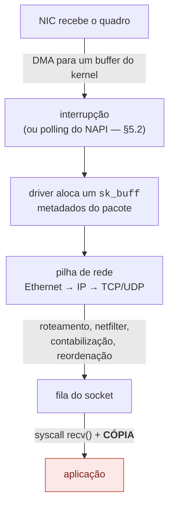
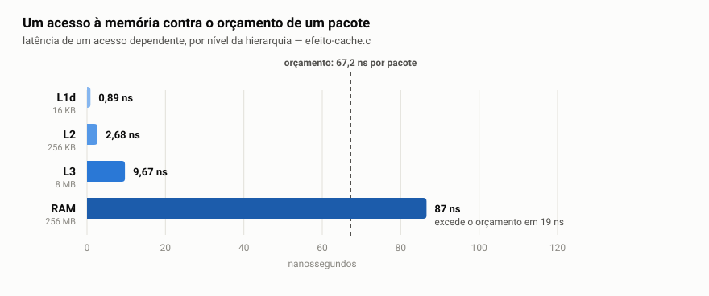
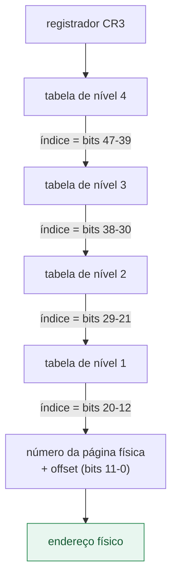
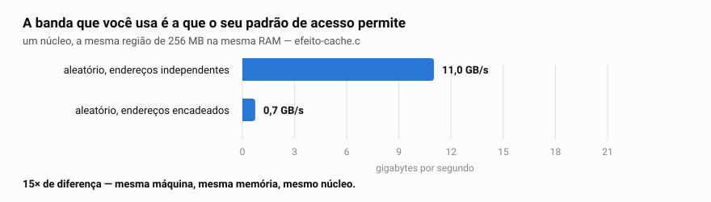
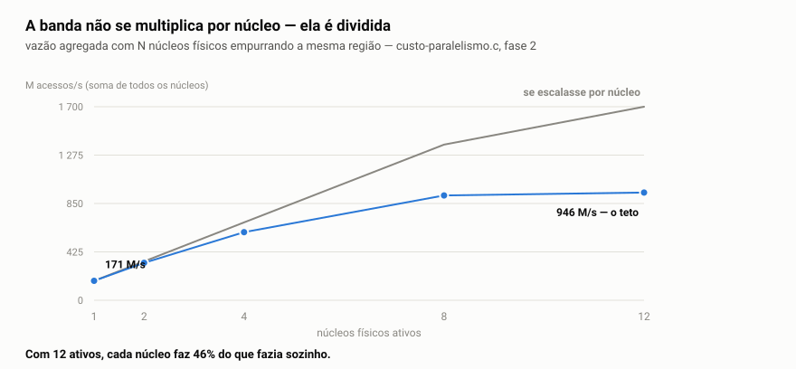
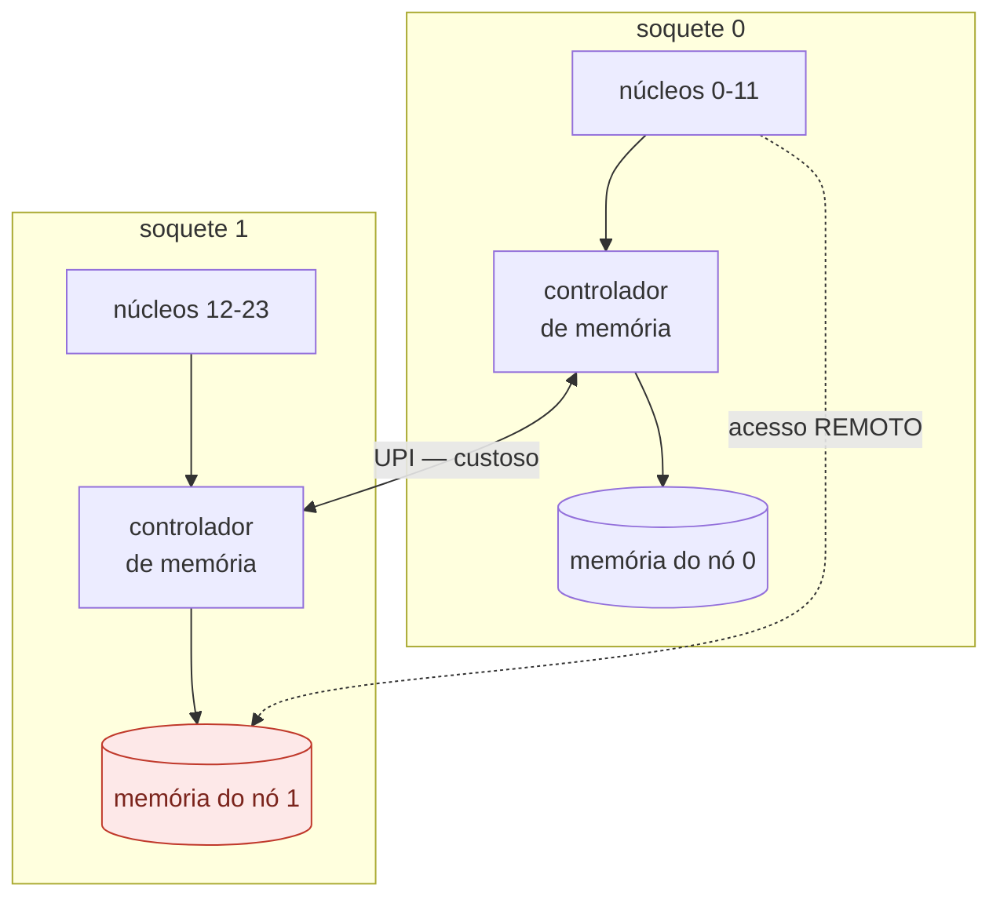
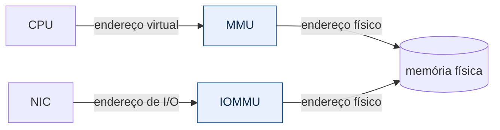

# Fundamentos — o problema, antes da ferramenta

*Read this in [English](README.en.md).*

> **Níveis 1 e 2** do [plano de estudo](../plano-estudo-dpdk.md) ·
> Sem pré-requisitos · Próximo: [Runtime do DPDK](../02-runtime-dpdk/)

Este documento não fala de DPDK. Ele estabelece **por que o DPDK precisa
existir** — e faz isso com números que você pode reproduzir na sua máquina em
menos de um minuto (seção 9).

A tese é simples: em redes de alta taxa, o tempo disponível por pacote é tão
curto que as abstrações confortáveis do sistema operacional deixam de caber
dentro dele. Entender *quanto* elas custam é o que separa engenharia de
folclore.

> **Um termo, antes de começar.** Este documento fala o tempo todo em **plano de
> dados**, tradução consagrada de *data plane*. Vale desfazer a ambiguidade: aqui
> "plano" não é *plano* no sentido de planejamento, e sim de **camada** — como em
> plano geométrico. Também se encontra "plano de encaminhamento"
> (*forwarding plane*), que é sinônimo.
>
> A distinção que o termo carrega é entre duas partes de um sistema de rede:
>
> | | O que faz | Com que frequência executa |
> |---|---|---|
> | **Plano de controle** | decide as rotas, a configuração, a política | raramente — ao mudar a topologia |
> | **Plano de dados** | trata **cada pacote**: recebe, classifica, encaminha | milhões de vezes por segundo |
>
> Tudo neste documento se refere ao segundo. É por isso que um custo de trezentos
> nanossegundos, irrelevante no plano de controle, decide o projeto inteiro no
> plano de dados: lá ele é pago uma vez; aqui, a cada pacote.
>
> O termo irmão é **caminho quente** (*hot path*): o trecho de código executado
> uma vez por pacote, onde cada ciclo e cada alocação custam vazão.

---

## Ao final deste módulo, você será capaz de

1. **calcular o orçamento de tempo por pacote** para uma taxa e um tamanho de
   quadro, e dizer o que cabe dentro dele;
2. **explicar por que atravessar a fronteira user/kernel** custa o que custa, e
   medir esse custo na sua máquina;
3. **identificar falso compartilhamento** em código próprio, e corrigi-lo;
4. **prever o efeito de localidade** — sequencial contra aleatório, página de
   4 KB contra 2 MB — antes de medir;
5. **decidir onde fixar uma thread** a partir da topologia de cache da máquina, e
   justificar a escolha com número;
6. **escolher entre um primitivo de sincronização e outro** sabendo o preço de
   cada um sem disputa e sob disputa;
7. **ler uma métrica de latência** sem se enganar: mediana contra média,
   percentil, dispersão, e por que a média mente;
8. **separar latência de vazão** ao ler qualquer medição de memória, e escolher
   entre as alavancas de ajuste sabendo qual delas melhora uma sem melhorar a
   outra — e o que cada uma cobra.

---

## 1. O orçamento: quanto tempo existe por pacote

Tudo começa aqui, e quem define os números é o **IEEE**, na norma
[802.3][ieee8023] — a especificação da Ethernet. Ela estabelece que cada quadro
carrega 20 bytes de overhead além dos dados: **7 de preâmbulo, 1 de delimitador
de início de quadro e 12 de intervalo entre quadros** (*interframe gap*), e que o
quadro mínimo tem **64 bytes**. Somando, um quadro mínimo ocupa **84 bytes na
linha**.

Em 10 Gbit/s:

```
10 000 000 000 bits/s ÷ (84 bytes × 8 bits) = 14 880 952 pacotes/s
1 s ÷ 14 880 952 = 67,2 nanossegundos por pacote
```

| Velocidade | Quadro | Taxa máxima | Tempo por pacote |
|---|---|---:|---:|
| 10 GbE | 64 B | 14,88 Mpps | **67,2 ns** |
| 10 GbE | 1500 B | 0,82 Mpps | 1216 ns |
| 25 GbE | 64 B | 37,2 Mpps | 26,9 ns |
| 100 GbE | 64 B | 148,8 Mpps | **6,7 ns** |

Duas leituras importantes:

**O tamanho do quadro muda tudo.** O mesmo enlace de 10 GbE exige 18 vezes mais
decisões por segundo com quadros pequenos. Por isso *benchmarks* sérios sempre
declaram o tamanho do quadro — "10 Gbps" sem essa informação não diz nada sobre
a carga de CPU.

**67 ns é pouco.** Numa CPU a 3 GHz, são cerca de 200 ciclos. É o orçamento
total para receber, examinar, decidir e transmitir. Guarde esse número: ele é o
critério para julgar tudo o que vem a seguir.

---

## 2. A fronteira user-space / kernel-space

O sistema operacional separa dois modos de execução: o código da aplicação
(*user-space*) e o do kernel. Toda vez que a aplicação precisa de um serviço do
kernel — ler um socket, por exemplo — ela atravessa essa fronteira por meio de
uma [chamada de sistema][syscall].

A travessia não é gratuita. Ela troca o modo do processador, salva e restaura
registradores, e polui cache e preditor de saltos. Medindo nesta máquina de
referência ([`custo-syscall.c`](medicoes/custo-syscall.c)):

```
  measurement                           median  p25-p75 (IQR)   range min-max      disp    CV
  ---------------------------------- ---------  --------------- ----------------- ----- -----
  function call (user-space)             0.726  0.719-0.727     0.718-0.828         1.1%   2.9%
  clock_gettime (vDSO, no trap)          15.52  15.51-15.52     15.51-15.67         0.1%   0.3%
  real syscall (SYS_getpid)              33.32  33.31-33.33     33.27-33.39         0.1%   0.1%

  a syscall costs 46x a function call

10 GbE budget with 64 B frames: 67.2 ns per packet
  syscalls that fit in that budget: 2.02

  The traditional kernel path spends at least one syscall per
  packet batch, plus interrupt, sk_buff allocation and a copy.
```

> **Duas correções levaram a estes números**, e as duas estão contadas na
> [metodologia](metodologia.md#1-2--as-duas-correções-do-custo-syscall): uma
> versão anterior publicou 0,115 ns porque o compilador eliminou a chamada de
> referência, e a razão syscall/chamada saiu 22% baixa por não declarar que
> fora medida a frio. O benchmark atual confere o assembly; a conclusão do
> capítulo nunca dependeu da razão.
> <!-- retratado: 0,115 0.115 -->

> **E uma terceira, de método.** Esta tabela publicava 0,924 ns para a chamada
> de função, com `disp` de 0,4% — selo limpo, e correto para aquela coleta.
> Repetindo o mesmo binário vinte vezes, dezenove execuções dão entre 0,713 e
> 0,750: o valor publicado era o modo raro. A syscall não se mexe (33,2 ns em
> todas), então o argumento do capítulo não depende disso; a razão é que passa
> de 36× para 44–46×.
>
> **Dispersão limpa dentro de uma coleta não diz nada sobre a variação entre
> coletas**, e para essa não há selo — há repetir o programa, com
> [`variacao-entre-execucoes.py`](../../ferramental/qualidade/variacao-entre-execucoes.py).
> <!-- retratado: 0.924 0,924 -->

As colunas da tabela são explicadas na [§7](#percentil-o-que-quer-dizer-p99) e
na [§9](#9-validação-reproduza-na-sua-máquina); por ora basta a mediana.

O resultado central: **cabem cerca de duas chamadas de sistema no orçamento de
um pacote.** E `getpid()` é a syscall mais barata que existe — não faz I/O, não
toca em memória do usuário, não dorme. Uma `recvmsg()` real custa muito mais.

Repare que esse resultado **não dependia** do número errado: ele sai de 33,3 ns
contra 67,2 ns de orçamento, e a chamada de função não entra na conta. O que a
correção mudou foi a razão syscall/chamada — de "294×" para a faixa de 36× a 46×
conforme o regime de medição, tratada no aviso acima —, que é uma frase de
efeito, não o argumento. O argumento é o orçamento.

O caso do [vDSO][vdso] merece atenção porque antecipa a ideia toda: o kernel
mapeia algumas funções diretamente no espaço do processo, de modo que
`clock_gettime()` executa **sem trap** — e por isso custa 16 ns em vez de 33. É
a mesma estratégia que o DPDK levará ao extremo: tirar a fronteira do caminho
quente.

---

## 3. O caminho tradicional de um pacote

Vale conhecer o caminho padrão antes de contestá-lo, porque ele é excelente para
aquilo que foi projetado: generalidade, isolamento e correção.



Cada etapa cobra:

| Etapa | Custo |
|---|---|
| Interrupção | troca de contexto; mitigada por [NAPI][napi], que alterna para *polling* sob carga (§5.2) |
| Alocação de `sk_buff` | estrutura de ~200 bytes por pacote, alocada e liberada |
| Travessia da pilha | generalidade: trata todos os protocolos e todas as opções |
| `recv()` | syscall (~33 ns no mínimo) mais **cópia** dos dados |

Nada disso é desperdício no caso geral — é o preço de uma pilha que funciona
para qualquer aplicação, com isolamento entre processos. O problema aparece
apenas quando o orçamento cai para 67 ns.

> **O que o DPDK faz:** remove todas essas etapas do caminho de dados. A NIC é
> desvinculada do driver do kernel e ligada a [`vfio-pci`][drivers]; um driver
> em *poll mode* — que pergunta em laço se chegou pacote, em vez de esperar ser
> avisado, e é definido na [§5.2](#52-polling-a-pergunta-que-o-plano-de-dados-responde-de-outro-jeito) —
> dentro do processo lê os descritores da NIC diretamente. Sem
> interrupção, sem `sk_buff`, sem pilha genérica, sem syscall, sem cópia.
> O custo dessa escolha é o assunto da seção 8.

---

## 4. Memória: onde o desempenho realmente se decide

Este é o capítulo em que o documento deixa de descrever a máquina e passa a
**armar decisões**. Cada seção termina com o que ela permite ajustar e o que
esse ajuste cobra; a [§4.4](#44-mapa-de-decisão-o-que-ajustar-e-o-que-isso-cobra)
reúne tudo num mapa. Antes dos mecanismos, porém, três grandezas — porque
confundi-las é o erro mais caro do plano de dados, e este documento já o cometeu
(ver a retratação da [§4.2](#42-cache-e-localidade)).

> **Latência** — quanto tempo **um** acesso demora, do pedido à chegada do dado.
> Vale separar duas coisas que a mesma palavra cobre: a **latência física** de um
> acesso que chega à DRAM é propriedade da máquina e você não a reduz
> escrevendo melhor; a **latência observada pelo seu programa** é outra coisa, e
> muda — porque você decide se o acesso chega à DRAM.
>
> **Vazão** (*throughput*) — quantos acessos por segundo a máquina completa.
> **Não** é o inverso da latência, e essa é a ideia central deste capítulo.
>
> **Banda** (*bandwidth*) — quantos bytes por segundo trafegam. É o teto físico
> onde a vazão para de crescer.

A relação entre elas cabe numa linha, e é conhecida como **Lei de Little**
([Little, 1961][little61]):

```
vazão = concorrência ÷ latência
```

> **Por que uma lei de teoria de filas se aplica a acessos de memória.** A
> pergunta é legítima: um acesso à DRAM não é uma fila de banco. O retrospecto
> que [Little escreveu cinquenta anos depois][little11] trata exatamente da
> generalidade da lei: ela não depende da distribuição dos tempos entre
> chegadas, dos tempos de serviço, do número de servidores nem da disciplina da
> fila. É essa generalidade que autoriza o uso aqui: não é analogia, é a lei
> dentro do domínio dela.
>
> **O que ela exige, e este material precisa declarar:** regime estacionário e
> conservação de itens — nada entra sem sair, e as médias existem. Num laço de
> acesso à memória em regime as duas condições valem; num transiente, ou com a
> fila crescendo sem limite, não valem, e a lei não se aplica.
>
> *(Parafraseado. Uma versão anterior desta nota trazia a generalidade entre
> aspas como se fosse uma frase única do artigo; ela é uma síntese de passagens
> distintas, e apresentá-la como citação literal era atribuir ao autor uma
> formulação que não é dele.)*

Fixada a latência, a única forma de aumentar a vazão é aumentar a
**concorrência** — quantos acessos estão em voo ao mesmo tempo. E a concorrência
é escolha de quem escreve o programa.

**Fixada** é a palavra que importa, e ela é uma premissa, não um fato geral. A
latência do denominador só é constante enquanto o acesso continuar chegando ao
mesmo lugar. Mudar a localidade muda o denominador — é o que a
[§4.2](#42-cache-e-localidade) mede, 0,89 ns na L1d contra 103 ns na RAM. O que
nenhuma linha de código muda é a latência física da DRAM, para o acesso que
chega até lá. As duas afirmações convivem, e confundi-las é o erro que esta
caixa existe para evitar.

<picture>
  <source media="(prefers-color-scheme: dark)" srcset="imagens/4-escada-escuro.svg">
  
</picture>

A barra da RAM é o problema inteiro deste módulo em uma imagem: **um único
acesso à memória principal custa mais que o pacote inteiro**. Não sobra
orçamento para receber o quadro, decidir o que fazer com ele e transmiti-lo —
o acesso sozinho já estourou.

E não há como tornar esse acesso mais rápido. A latência da DRAM é ditada pelo
dispositivo, pelo barramento e pela distância física; nenhuma escolha de
linguagem, compilador ou estrutura de dados a diminui. O que resta é **não
pagá-la**, e há quatro alavancas para isso, distribuídas pelas três seções
seguintes:

Ajuda decompor o que um acesso cobra, ainda que as parcelas possam se
sobrepor:

```
T_acesso  ≈  T_tradução  +  T_hierarquia de memória  +  T_fila e disputa
```

Cada alavanca ataca uma parcela diferente, e nomear qual evita a leitura de que
todas fazem a mesma coisa:

| Se você quer… | A alavanca é… | O mecanismo | E está na… |
|---|---|---|---|
| que o acesso nem chegue à RAM | localidade: caber no cache | reduz a chance de atingir os níveis lentos | [§4.2](#42-cache-e-localidade) |
| que o acesso não pague tradução por cima | hugepages | reduzem a **frequência** dos *page walks*, elevando o alcance da TLB | [§4.1](#41-memória-virtual-o-que-significa-traduzir-um-endereço) |
| que muitos acessos paguem o preço **juntos** | concorrência: lote e *prefetch* | **sobrepõe** esperas; não encurta nenhuma | [§4.2](#42-cache-e-localidade) |
| que o acesso não atravesse o nó errado | afinidade de memória | evita distância e disputa de acesso remoto | [§4.3](#43-numa-quando-a-memória-deixa-de-ser-uma-coisa-só) |

Repare na terceira linha: **ela é a única que não torna acesso nenhum mais
barato**. As outras três reduzem alguma parcela de `T_acesso`; o lote deixa
`T_acesso` intacto e faz vários acontecerem ao mesmo tempo. É por isso que ela
é a que mais confunde, e a que mais decide.

E nenhuma delas toca a latência física da DRAM. **Hugepage não torna a memória
mais rápida** — ela evita que o acesso pague tradução por cima. É uma distinção
que o resto deste capítulo mede: os ~80 ns comuns às duas linhas da
[§4.1](#41-memória-virtual-o-que-significa-traduzir-um-endereço) são a RAM, e
eles não se mexem.

### 4.1 Memória virtual: o que significa "traduzir um endereço"

**O problema, em uma frase:** traduzir um endereço não é um cálculo — é uma
**consulta a uma estrutura de dados na memória**, e o hardware a faz **a cada
acesso**. Num plano de dados com 67,2 ns por pacote, um custo cobrado por acesso
decide o projeto. Esta seção mede quanto ele custa nesta máquina e o que o
diminui — nessa ordem: o mecanismo, o que ele cobra, como o programa mede, o que
se previu e o que se mediu.

Nenhum endereço que seu programa manipula é o endereço real de um byte na
memória física. Quando você imprime um ponteiro, vê um **endereço virtual** — um
número que só faz sentido dentro do seu processo. O endereço físico
correspondente é escolhido pelo sistema operacional e pode mudar.

Essa indireção é o que permite que dois processos usem o mesmo endereço
`0x7fff...` sem colidirem, que a memória seja alocada em pedaços não contíguos
sem o programa perceber, e que um processo não consiga ler a memória de outro.
É uma das ideias mais valiosas da computação — e ela cobra por acesso.

**Traduzir** um endereço virtual significa descobrir a que endereço físico ele
corresponde. Isso não é um cálculo; é uma **consulta a uma estrutura de dados na
memória**, feita pelo hardware a cada acesso.

#### A anatomia do endereço

A memória é gerida em blocos de tamanho fixo chamados **páginas** — 4 KB por
padrão no Linux. A tradução opera sobre páginas inteiras, nunca sobre bytes
individuais. Por isso o endereço virtual se divide em duas partes:

> **Isto é arquitetura, não escolha do Linux.** A estrutura de tradução e o
> formato das entradas são definidos pela especificação x86-64. Para a máquina
> de referência, a autoridade é o [AMD64 Architecture Programmer's Manual, Vol.
> 2][amdapm]; o [Intel SDM, Vol. 3A][intelsdm] documenta o mesmo mecanismo — é o
> **§5, *Paging***, e ele enuncia a divisão que o diagrama abaixo desenha: *"de
> um endereço linear de 48 bits, os bits 47:39 identificam a primeira entrada de
> estrutura de paginação, os bits 38:30 identificam a segunda, os bits 29:21 a
> terceira, e os bits 20:12 identificam a quarta"* (tradução nossa). O diagrama é
> **representação didática derivada da especificação**, não achado experimental.

```
 endereço virtual de 48 bits, página de 4 KB

  47      39 38      30 29      21 20      12 11          0
 ┌──────────┬──────────┬──────────┬──────────┬─────────────┐
 │  nível 4 │  nível 3 │  nível 2 │  nível 1 │   offset    │
 │  9 bits  │  9 bits  │  9 bits  │  9 bits  │   12 bits   │
 └──────────┴──────────┴──────────┴──────────┴─────────────┘
  └──────────── qual página (36 bits) ───────┘ └ onde dentro ┘
```

Os 12 bits finais são o deslocamento dentro da página (2¹² = 4096 bytes, o
tamanho exato de uma página) e **não precisam de tradução alguma**: eles passam
direto para o endereço físico. Só os 36 bits superiores — o número da página —
precisam ser traduzidos.

#### A caminhada pelas tabelas de página

Traduzir 36 bits por uma tabela única exigiria 2³⁶ entradas, ou seja, 512 GB de
tabela por processo. Inviável. A solução é uma **árvore de quatro níveis**, e os
36 bits são fatiados em quatro grupos de 9.

Nove bits endereçam 512 entradas. Cada entrada tem 8 bytes. Logo cada tabela
ocupa 512 × 8 = **4096 bytes — exatamente uma página**. O projeto se fecha
sobre si mesmo com elegância.

A tradução, então, funciona assim (é isto que se chama *page walk*):



São **quatro acessos à memória** antes do acesso que você pediu — e é por isso
que a TLB existe.

O ponto que interessa: **cada seta é um acesso à memória**. Traduzir um único
endereço percorre até quatro níveis antes que o dado que você realmente queria
seja lido. Nesta máquina, `address sizes: 48 bits virtual` confirma os quatro
níveis; CPUs mais recentes com `la57` usam cinco.

> **Quatro níveis não são quatro acessos à DRAM**, e vale antecipar isso aqui
> para o diagrama não ser lido como "4 × latência da memória". As entradas dos
> níveis intermediários podem ser servidas pelas *paging-structure caches* — que
> o [Intel SDM][intelsdm] descreve no **§5.10, *Caching Translation
> Information***, ao lado da TLB — e pela hierarquia de cache comum. O custo
> efetivo é medido mais adiante, em
> [por que a diferença é ~10 ns](#por-que-a-diferença-é-10-ns-e-não-três-acessos-à-ram),
> e ele é de **um** acesso extra, não quatro.

#### A TLB: a cache que torna isso viável

Se cada acesso pagasse quatro leituras extras, nada funcionaria. Por isso o
processador mantém uma cache específica para traduções já resolvidas: a
**TLB** (*Translation Lookaside Buffer*).

- **Acerto na TLB:** o processador reutiliza uma tradução já armazenada, e o
  *page walk* não acontece.
- **Falta na TLB:** o hardware precisa obter a tradução das estruturas de
  paginação — e o custo observado depende também das *paging-structure caches*
  e da hierarquia de cache, não só da DRAM.

A TLB é pequena, e **quão** pequena é um número que a sua máquina sabe — mas que
o sistema operacional talvez não conte direito. Nesta, o `/proc/cpuinfo` publica
`TLB size: 192 4K pages`.

<!-- retratado: 21× 21x -->
> **O sub-relato é de 32×, e não dos 21× que esta seção publicou.** Os 192 do
> `/proc/cpuinfo` são a **soma** do dTLB (128) com o iTLB (64) de 4 KB, os dois
> em valor bruto. O real é `128 × 32 = 4 096` de dados mais `64 × 32 = 2 048` de
> instrução, ou 6 144 — e `6 144 / 192 = 32`, que é exatamente o multiplicador.
> Os 21× vinham de dividir só o dTLB real pela soma bruta: numerador de uma
> estrutura, denominador de duas.

A causa está documentada: a partir do Zen 5 a AMD passou a
codificar o tamanho do último nível em **múltiplos de 32**, com um bit
(`L2TlbSizeX32`) mandando o software multiplicar; o Linux [nunca aprendeu a
checar esse bit][zen5tlb], e a correção só entra no kernel 7.4.

Pergunte ao processador, não ao kernel ([`tlb-real.c`](medicoes/tlb-real.c)):

```c
/* CPUID 0x80000021 EAX bit 14 = L2TlbSizeX32; se 1, multiplique por 32 */
__get_cpuid(0x80000006, &a, &b, &c, &d);   /* L2 TLB: EBX 4 KB, EAX 2 MB */
__get_cpuid(0x80000021, &e, &f, &g, &h);   /* o bit que o kernel ignora   */
```

Nesta máquina o bit está ligado, o valor bruto é 128, e o real é 128 × 32:

```
                    L1 DTLB   L2 DTLB   alcance com este nível
  páginas de 4 KB        96     4 096                  16 MB
  hugepages de 2 MB      96     4 096                   8 GB
  páginas de 1 GB        96     1 024               1 024 GB
```

O que importa não é o número de entradas, e sim o **alcance** (*TLB reach*):
quanta memória elas cobrem juntas.

```
alcance = entradas × tamanho da página
```

O que decide o resultado não é o tamanho absoluto da TLB, e sim a **razão entre
o alcance e o conjunto de trabalho**. Num percurso disperso — sem padrão que o
processador consiga prever —, a chance de a tradução já estar na TLB é
aproximadamente essa razão:

```
P(acerto) ≈ alcance / conjunto de trabalho
```

> **Isto é um modelo, e as premissas dele importam.** A aproximação vale para
> **este** padrão: referências espalhadas com probabilidade aproximadamente
> uniforme por toda a região, sem reuso e sem ordem. Ela supõe, sem dizer, que
> a TLB é totalmente associativa, que a política de substituição não favorece
> nem prejudica nenhuma entrada, e que os dois níveis se comportam como um só
> de 4 096 entradas. Nenhuma dessas três premissas é exatamente verdadeira em
> hardware.
>
> O que a torna útil não é a precisão, e sim o fato de que ela **prevê antes de
> medir** — e é a [previsão contra a medição](#a-previsão-e-o-que-a-medição-fez-com-ela)
> adiante que a testa. Se o seu padrão tiver reuso, ou
> localidade parcial, o modelo superestima as faltas, e a previsão dele falha
> para mais.

**E não adianta pedir uma TLB maior.** Ela é consultada em *todo* acesso à
memória e precisa responder no caminho mais quente do processador — o que a
obriga a ser pequena e altamente associativa. Crescer custa latência e energia no
caminho mais quente do processador, e o retorno é linear: dobrar as entradas
leva a cobertura de 3,1% para 6,2%. Não resolve.

**Ou seja:** a TLB não falha por ser pequena — ela falha porque, com páginas de
4 KB, **cada entrada cobre pouco demais**. O alcance é o produto de dois
fatores, e o software controla apenas um deles. Aumentar o número de entradas é
problema do fabricante; aumentar o tamanho da página é decisão sua — e é o único
dos dois fatores que multiplica.

#### Por que hugepages, então

As [hugepages][hugetlb] de 2 MB atacam a fórmula pelos dois lados.

**Aumentam o alcance em 512×.** As mesmas 4 096 entradas passam a cobrir 8 GB
em vez de 16 MB.

> **A fórmula tem uma premissa que ela não declara**: que o número de entradas
> **não muda** com o tamanho da página. Para 4 KB → 2 MB isso vale nesta máquina
> — são 4 096 entradas nos dois casos, e o 512× é real. Para 1 GB a premissa
> quebra, mas menos do que parece: o segundo nível tem uma estrutura **separada**
> de 1 024 entradas, 4-way, só para páginas de 1 GB. O alcance sobe de 8 GB para
> **1 024 GB**, um fator de 128 em vez de 512. Confira na sua antes de
> generalizar; é decisão de microarquitetura, não da aritmética.
>
> **O número 1 024 depende de um multiplicador, e isso já rendeu erro.** O CPUID
> reporta 32 no campo de tamanho; o bit `L2TlbSizeX32` manda multiplicar por 32.
> O par fecha com o fabricante nos **dois** campos — o
> [*Software Optimization Guide* do Zen 5][sogzen5] descreve *"an additional
> 4-way set-associative 1G page L2 DTLB with 1024 entries"*, e o CPUID reporta
> associatividade 4. Sem o multiplicador o tamanho sairia 32 e a associatividade
> continuaria 4: só o par fecha, e só fecha com o ×32.

**Encurtam a caminhada.** Com página de 2 MB, o offset passa a ter 21 bits
(2²¹ = 2 MB), consumindo os 9 bits que seriam do nível 1. A entrada do nível 2
aponta diretamente para o quadro físico: **três acessos em vez de quatro**.

```
 endereço virtual de 48 bits, hugepage de 2 MB

  47      39 38      30 29      21 20                     0
 ┌──────────┬──────────┬──────────┬───────────────────────┐
 │  nível 4 │  nível 3 │  nível 2 │        offset         │
 │  9 bits  │  9 bits  │  9 bits  │       21 bits         │
 └──────────┴──────────┴──────────┴───────────────────────┘
                            └── aponta direto para o quadro de 2 MB
```

> **E por que 2 MB, e não 1 GB?** Os dois custos de escolher um tamanho de
> página dependem da mesma grandeza: **quantas páginas a região consome**,
> `n = S/P`. Poucas páginas e o arredondamento pesa — com `n` páginas, o
> desperdício chega a `1/n` da região. Páginas demais e a TLB deixa de cobrir,
> que é o efeito medido adiante. A faixa em que nenhum dos dois incomoda vai de
> ~100 a ~4 000 páginas.
>
> Daí sai a resposta, **para esta máquina e para estes tamanhos de região**:
> 4 KB serve regiões de 400 KB a 16 MB; 2 MB, de 200 MB a 8 GB. Um mempool de
> 512 MB dá 256 páginas de 2 MB — no meio da faixa. Para 1 GB sobra **um** dos
> dois problemas, e não os dois: a região precisaria passar de 100 GB para o
> desperdício de arredondamento sumir. **Cobertura de TLB não é argumento
> contra 1 GB nesta máquina** — 1 024 entradas cobrem 1 TB, trinta vezes a
> memória instalada.
>
> E o argumento que sobra tem contraparte: o
> [*Getting Started Guide* do DPDK][dpdkreq] recomenda 1 GB para aplicações de
> 64 bits quando a plataforma suporta. A escolha de 2 MB aqui vem do tamanho
> das regiões deste material, não de uma limitação de tradução.
>
> A heurística é derivada daqui, e os dois números que a alimentam — 4 096
> entradas de TLB e o tamanho típico de um mempool — são **desta
> microarquitetura e deste caso de uso**. Que 2 MB seja a escolha usual em
> plano de dados é consistente com a conta; esta seção **não** demonstra por
> que o resto do mundo adotou 2 MB, e a conta de um banco de dados com região
> de 200 GB daria outra resposta.
>
> Repare que as faixas **não se encostam**: a útil tem ~40× de largura e os
> tamanhos de página saltam 512×. Entre 16 MB e 200 MB nenhum tamanho é bom, e
> você escolhe o mal menor — num plano de dados, quase sempre o tempo.

> **E quando a hugepage atrapalha.** O documento até aqui só mostrou o ganho, e
> isso é meia verdade. O caso claro é o das *transparent hugepages*, que o kernel
> promove sozinho: a [documentação oficial][thp] registra que aplicações chegaram
> a perder 30% ou mais com elas ligadas, por três motivos — **picos de latência
> durante a compactação** (veneno para plano de dados), **inchaço de memória**
> pela granularidade de 2 MB, e promoção em regiões que não se beneficiam. É por
> isso que existe o modo `madvise`, que desliga por padrão e deixa a aplicação
> pedir.
>
> O DPDK não usa THP: ele pede `MAP_HUGETLB` sobre um pool reservado, e a
> promoção em segundo plano não acontece. Mas o preço da reserva continua — ver
> [a área reservada](metodologia.md#23-a-área-reservada-256-hugepages-e-por-que-a-receita-pede-512),
> mais abaixo. **Hugepage não é gratuita; ela é barata para este caso de uso.**

#### O que o programa calcula

A medição publica um número só — nanossegundos por acesso —, e ele sai de uma
aritmética deliberadamente simples. Vale abrir a conta, porque cada constante
dela foi escolhida para isolar o *page walk* de todo o resto.

**A região e a cadeia.** 512 MB divididos em linhas de cache de 64 B dão
**8 388 608 linhas**. O programa sorteia uma permutação (Fisher-Yates) e grava,
em cada linha, o índice da **próxima** — montando um **ciclo único** que passa
por todas elas exatamente uma vez. Ciclo único, e não vários curtos: é isso que
garante que o percurso cubra a região inteira, em vez de girar num pedaço que
caiba no cache.

```c
idx = p[idx];     /* o endereço do próximo acesso só existe DEPOIS deste */
```

Essa linha é o experimento inteiro. Como cada acesso depende do anterior, o
processador não consegue emitir vários em paralelo, e o *prefetcher* não tem
padrão para reconhecer. É exatamente a diferença entre o que a
[§4.2](#42-cache-e-localidade) mede (tempo **amortizado**, com vários acessos em
voo) e o que esta seção mede (**latência** de um acesso dependente).

**A conta.** O laço executa `n × 4 = 33 554 432` acessos — quatro voltas
completas no ciclo — e o relógio é lido **uma vez antes e uma vez depois**:

```
ns por acesso = (t_fim − t_início) / 33 554 432
```

Cronometrar acesso a acesso seria impossível: `clock_gettime` custa dezenas de
nanossegundos, ou seja, **mais do que aquilo que se quer medir**. Amortizar
sobre 33 milhões de acessos torna o custo dos dois carimbos irrelevante diante
de ~3,5 s de laço. O preço dessa escolha é perder a distribuição *dentro* da
amostra — que é justamente o que as sete amostras por medição recuperam.

> **O desenho do experimento está na
> [metodologia](metodologia.md#2-41--o-desenho-do-custo-traducao)**: o que fica
> fora do cronômetro e por quê, por que a região tem exatamente 512 MB, e a
> receita de reserva das hugepages — inclusive por que `sysctl` pode falhar sem
> dizer.

#### A previsão, e o que a medição fez com ela

Aplicando com as 4 096 entradas medidas acima e páginas de 4 KB:

| Conjunto de trabalho | Entradas necessárias | Fração coberta | Previsão |
|---|---|---|---|
| 4 MB | 1 024 | 100% | hugepage não compra nada |
| 16 MB | 4 096 | 100% | ainda no limite |
| 64 MB | 16 384 | 25% | o ganho deve aparecer aqui |
| 512 MB | 131 072 | 3,1% | praticamente tudo falta |

**E a tabela é uma previsão, não uma descrição.** Ela diz que o ganho das
hugepages deve ser irrelevante até ~16 MB e nascer entre 16 e 64 MB. Medindo o
o mesmo percurso com os dois tamanhos de página **e com os dois padrões de
acesso** (`custo-traducao <MB> <disperso|sequencial>`), mediana de cinco
repetições cada:

```
             percurso disperso         percurso sequencial    
    região      4 KB    2 MB   ganho      4 KB    2 MB   ganho
      8 MB     11.78   10.16    1.54      0.94    0.94    0.01
     16 MB     10.78    8.62    1.98      0.96    0.90    0.06
     32 MB     46.57   25.43   18.62      1.36    1.26    0.11
     64 MB     72.16   65.01    6.92      1.66    1.57    0.08
    512 MB     89.56   78.55   10.94      1.65    1.66   -0.00
```

**A previsão se sustenta, mas só na coluna da esquerda.** No percurso disperso,
8 e 16 MB quase sem ganho, 64 MB com o ganho nascendo, 512 MB com ganho cheio —
o modelo não só descreve o resultado, ele o **antecipou**. No percurso
sequencial o ganho inteiro desaparece: de 0,01 a 0,11 ns, uma ou duas ordens de
grandeza abaixo.

**E o desaparecimento é mais forte do que o número sugere.** O desenho pareado
publica quantos dos 21 pares tiveram o mesmo sinal, e é aí que se vê a
diferença: no disperso são 19 a 21 de 21 em todas as regiões; no sequencial a
contagem cai para 14/21 em 64 MB e **12/21 em 512 MB** — cara ou coroa. Não é
um efeito pequeno, é a ausência de efeito.

> **Hugepages não tornam a tradução mais barata; elas reduzem quantas traduções
> falham.** Se essas falhas importam depende de elas caírem no caminho crítico,
> e é o padrão de acesso que decide isso. Num percurso sequencial, uma PTE de
> 4 KB serve 64 linhas de cache consecutivas — o custo se dilui por 64 — e o
> prefetcher ainda corre à frente. Num percurso disperso sobre região muito
> maior que a cobertura da TLB, quase todo acesso cai numa página diferente:
> uma PTE por acesso, sem diluição, e serializada pela dependência.
>
> O ganho de hugepages não é propriedade do tamanho de página. É propriedade do
> par **tamanho de página × padrão de acesso**, e só existe quando o percurso
> derrota o prefetcher e a TLB ao mesmo tempo.

**A varredura também achou um ponto que o modelo não prevê.** No disperso, 32 MB
dá ganho de 18,62 ns — maior que em 512 MB — e depois *cai* para 6,92 ns em
64 MB. O modelo de cobertura de TLB é monotônico por construção e não tem como
produzir um pico no meio. Cinco de cinco repetições reproduzem, de 17,24 a
20,11 ns.

32 MB é exatamente o tamanho do L3 desta máquina ([§4.2](#42-cache-e-localidade)),
e é também onde a cobertura de TLB cruza 50%: o L2 DTLB tem 4 096 entradas e
32 MB em páginas de 4 KB pedem 8 192. Uma leitura compatível com os dados é que
na fronteira de capacidade uma perturbação pequena decide entre acertar e errar
o L3 — com hugepages o percurso ainda colhe L3 (25,43 ns, entre os 9,7 do L3 e
os 88,6 da RAM), com 4 KB já não colhe (46,57 ns) — e depois da fronteira os
dois erram, então a diferença colapsa para o custo de page walk puro.

**Isto é leitura, não resultado.** Separar capacidade de cobertura de TLB
exigiria contadores de desempenho, que este material não usa. O que está medido
é o pico, a sua reprodutibilidade, e o fato de ele **não existir no percurso
sequencial** (0,11 ns em 32 MB) — o que já basta para dizer que não é um
fenômeno de tamanho de página.

A lição de método é a mesma do resto do módulo: publicar só a coluna que
confirma teria escondido as duas coisas mais interessantes da tabela.

Fixando a região em 512 MB, o mesmo programa publica a diferença com o
desenho pareado ([`custo-traducao.c`](medicoes/custo-traducao.c)):

```
  measurement                           median  p25-p75 (IQR)   range min-max      disp    CV
  ---------------------------------- ---------  --------------- ----------------- ----- -----
  4 KB pages                             90.75  90.18-90.86     89.59-91.37         0.8%   0.5%
  2 MB hugepages                         80.07  79.84-80.17     78.95-80.72         0.4%   0.6%

  DIFFERENCE attributable to translation     10.64  IQR 10.47 to 10.80   range 9.46 to 11.73   21/21 pairs
```

Os ~80 ns comuns às duas medições são a latência da RAM, que hugepage nenhuma
elimina. **A diferença — 10,64 ns — é o custo adicional de tradução** que as
páginas de 4 KB cobram neste percurso, ou seja **15,8% do orçamento** de um
pacote de 64 B em 10 GbE, gastos antes de qualquer trabalho útil.

> **Por que o rótulo não diz "o page walk".** `t_4KB − t_2MB` não é uma medição
> direta de um *page walk*: é a diferença pareada entre **dois regimes de
> tradução**, num desenho construído para que o custo adicional de tradução
> domine a diferença. A página de 2 MB também é traduzida e também usa TLB — o
> que ela não tem é a mesma **pressão** sobre ela. O rótulo da tabela dizia "o
> page walk" e prometia mais do que o experimento entrega; hoje diz o que ele
> mede.

> **Por que esta linha é diferente das outras.** A diferença não sai da
> subtração de duas medianas: as duas condições são **intercaladas na mesma
> volta do laço**, `delta_i = t_4k,i − t_2m,i`, e a diferença tem distribuição
> própria. Colhê-las em blocos separados absorveria a deriva da máquina entre
> os blocos, e não diria nada sobre a estabilidade da própria diferença — que é
> a conclusão.
>
> Daí ela trazer **IQR em nanossegundos** e não `disp`: IQR sobre mediana
> explode quando a mediana é pequena, e uma diferença pode trocar de sinal. A
> coluna que sustenta a conclusão é a última — **21 de 21 pares** com a página
> de 4 KB mais lenta. Nenhuma subtração de medianas diz isso.
>
> O desenho pareado é recente: a tabela já publicou 18,2 ns, vindo de sete
> amostras em blocos separados. Seis medições independentes desde então ficam
> entre 10,1 e 11,7 ns.
<!-- retratado: 18.2 18,2 15.2 15,2 -->

#### Por que a diferença é ~10 ns, e não três acessos à RAM

O diagrama do *page walk* mostra quatro acessos à memória, e a RAM desta máquina
responde em ~80 ns. Se cada falta de TLB custasse mesmo quatro idas à RAM, a
diferença entre as duas linhas da tabela seria de **centenas** de nanossegundos —
e ela é de ~10. O diagrama descreve o **pior caso**; a tabela mede o **caso
real**. A distância entre os dois é o que diz quando o pior caso volta a valer.

**As tabelas de página são dados, e cabem em cache.** Elas ocupam memória como
qualquer outra estrutura, e o kernel informa quanto:

```bash
grep VmPTE /proc/self/status     # tabelas de página deste processo
```

Mapeando os mesmos 512 MB das duas formas, na máquina de referência:

| Mapeamento | Tabelas de página | De onde sai |
|---|---|---|
| 512 MB em páginas de 4 KB | **1 028 kB** | 131 072 PTEs × 8 B = 1 MB, em 256 tabelas (+1 de nível 2) |
| 512 MB em hugepages de 2 MB | **4 kB** | 256 entradas de nível 2 numa única tabela |

Daí sai uma regra que escala: **com páginas de 4 KB, a tabela custa 1/512 da
região mapeada** (8 bytes de PTE a cada 4 096 bytes de dado). Com hugepages de
2 MB, 1/262 144.

**Só um nível varia.** Para uma região de 512 MB, os níveis 4, 3 e 2 somam
pouquíssimas tabelas — no mapeamento medido acima, uma única de nível 2, os 4 kB
a mais — e ficam residentes nas *page-walk caches* do processador. O que muda de
acesso para acesso é apenas a leitura do **nível 1**, dentro daquele 1 MB de
PTEs. O custo real, portanto, é **um acesso extra, não quatro**.

**E esse acesso é servido pelo L3.** Um megabyte de PTEs não cabe no L2 (1 MB
por núcleo nesta máquina — no limite exato), mas cabe com folga no L3 (32 MB por
bloco). Medindo a latência de um acesso dependente em função do tamanho da
região — a mesma cadeia do programa, sempre em hugepages para tirar a TLB da
conta:

```
  região      ns/acesso (cadeia dependente, hugepages de 2 MB)
    8 MB        10.16     <- L3
   16 MB         8.62     <- L3
   32 MB        25.43     <- fronteira do L3
   64 MB        65.01     <- RAM
  512 MB        78.55     <- RAM
```

Um acerto de L3 custa de 9 a 10 ns nesta máquina. A diferença medida entre
4 KB e 2 MB foi **10,24 ns**:

```
  4 KB pages                             90.75  90.18-90.86     89.59-91.37         0.8%   0.5%
  2 MB hugepages                         80.07  79.84-80.17     78.95-80.72         0.4%   0.6%

  page walk cost: 10.64 ns  (11.7% of the 4 KB access)
```

Os números são **compatíveis** com a explicação: neste conjunto de trabalho o
custo diferencial dominante seria a leitura da PTE terminal, servida pela
hierarquia de cache, na faixa que o L3 desta máquina responde.

> **Compatível não é demonstrado, e a diferença vale ser dita.** Este
> experimento não observa *page walk* nenhum: ele mede tempo total e compara
> dois regimes. Que ~10 ns coincida com a latência de L3 medida ao lado, e que
> o megabyte de PTEs caiba no L3 e não no L2, torna a explicação plausível e
> aritmeticamente coerente — não a prova. **Provar exigiria contador de
> hardware** (`dtlb_load_misses.walk_*` e os eventos de origem de dados do
> *page walk*), e esse instrumento não está em uso aqui. Fica como experimento
> declarado, não como conclusão.

E repare que aqui os selos sumiram (`disp` de 1,0% e 0,7%, contra 10,2% e
9,4% da tabela publicada) — confirmando o diagnóstico da instabilidade: ela vem
da disputa com o resto da máquina, não do método.

> **Quando o pior caso volta — previsão, não medição.** Quando as tabelas
> deixarem de caber no cache. Um plano de dados que mapeie **16 GB** em páginas
> de 4 KB precisa de 32 MB só de PTEs, e a aritmética é exata:
> 16 GB ÷ 4 KB = 4 194 304 PTEs × 8 B = **32 MiB**, contra os 32 MB de L3 desta
> máquina.
>
> O que **não** é exato é o passo seguinte. Área de PTEs maior que a LLC não
> implica que cada leitura de PTE vá à DRAM: entram reuso, associatividade,
> as *paging-structure caches*, e a disputa da LLC com o resto do programa — que
> num plano de dados é justamente o tráfego. O enunciado defensável é que **a
> probabilidade de a PTE terminal precisar ser buscada além da LLC cresce
> substancialmente**, e com ela o custo médio do *page walk* caminha dos ~10 ns
> em direção à latência da RAM.
>
> A forma do argumento sobrevive inteira, e é ela que decide projeto: **o
> problema das páginas de 4 KB não é serem lentas, é piorarem conforme o
> conjunto de trabalho cresce.** É por isso que ele aparece em produção, com
> buffers de verdade, e não no laboratório. Medir o ponto de virada exige
> montar as regiões grandes — experimento que esta máquina comporta e que ainda
> não foi feito.

Daí a exigência do DPDK: os buffers de pacote vivem em hugepages não por
capricho, mas porque um plano de dados percorre grandes regiões de memória de
forma pouco previsível — o pior caso possível para a TLB.

```bash
getconf PAGE_SIZE                        # 4096
grep -E "Hugepagesize|HugePages_" /proc/meminfo
cat /proc/self/maps                      # mapeamentos virtuais deste processo
```

### 4.2 Cache e localidade

A memória não é plana. Cada nível é mais rápido e menor que o seguinte, e a
transferência entre eles acontece em blocos de **64 bytes** — a *linha de cache*.

Medindo o efeito ([`efeito-cache.c`](medicoes/efeito-cache.c)):

```
  cabe em    tamanho   sequencial    aleatorio    dependente   acessos   disp do
                       (amortizado)  (amortizado) (LATENCIA)   em voo    dependente
  L1d          16 KB     0.180 ns      0.180 ns      0.894 ns     ~5        0.2%
  L2          256 KB     0.179 ns      0.216 ns       2.68 ns    ~12        0.4%
  L3         8192 KB     0.180 ns      0.462 ns       9.66 ns    ~21        0.2%
  RAM      262144 KB     0.181 ns      3.07 ns       87.18 ns    ~28        0.6%
```

> **Amortizado não é latência, e a distinção precisa de instrumento.** A coluna
> `dependente` percorre uma cadeia de ponteiros: cada acesso só pode começar
> depois que o anterior terminou, e é isso que expõe a latência. A coluna
> `aleatorio` lê os índices de um vetor sequencial, então o processador dispara
> uma dúzia de acessos ao mesmo tempo — o que ela mede é vazão. **Enquanto o
> programa tinha só a segunda, nenhuma revisão de texto podia pegar a troca dos
> dois nomes.** A construção da cadeia mora em [`cadeia.h`](medicoes/cadeia.h),
> com a propriedade combinatória verificada em
> [`tests/test_l1_cadeia.cpp`](medicoes/tests/test_l1_cadeia.cpp).
<!-- retratado: 0.193 0,193 0.244 0,244 0.297 0.202 0,202 7.68 38.1 24.5 24,5 0.227 0,227 0.248 0,248 0.260 0,260 0.331 0,331 0.741 0,741 5.81 5,81 86.59 86,59 -->

> **Estes números substituem os de 24/09, e a causa é um defeito do
> instrumento — mas não o defeito que se esperava.** O acumulador de
> [`efeito-cache.c`](medicoes/efeito-cache.c) era `volatile`, o que obriga um
> *store* e um *load* na pilha a cada elemento. O `objdump` mostrava o laço
> medido como `mov (%rsp),… ; mov (%rdx),… ; add ; mov …,(%rsp)`.
>
> A previsão era que isso inflasse a coluna **sequencial**, tornando-a um teto
> do laço em vez de uma medida de memória. Não foi o que aconteceu: a coluna
> sequencial caiu 4 % e nada mais. Nessa coluna o *prefetcher* já entrega mais
> do que o laço consome, então acrescentar um elo à cadeia não muda o gargalo.
>
> **Quem pagava era a coluna aleatória, e por um mecanismo diferente.** Ali os
> acessos são independentes e o processador pode manter vários em voo — desde
> que nada serialize as iterações. A cadeia `store → load` pela pilha era
> exatamente esse serializador. Removê-la libera a sobreposição, e o ganho
> cresce com a profundidade do nível, porque quanto mais longe está o dado mais
> há o que sobrepor:
>
> | nível | aleatório antes | depois | variação |
> |---|---:|---:|---:|
> | L1d | 0,260 ns | 0,180 ns | −31 % |
> | L2 | 0,331 ns | 0,216 ns | −35 % |
> | L3 | 0,741 ns | 0,462 ns | −38 % |
> | RAM | 5,81 ns | 3,07 ns | **−47 %** |
>
> A coluna `dependente` não se move em nível nenhum (86,59 → 87,18 ns na RAM), e
> é a confirmação de que o mecanismo é esse: ela mede uma cadeia que já era
> serial por construção, então não havia paralelismo para o `volatile` suprimir.
>
> A consequência atinge o número derivado: **os acessos em voo na RAM passam de
> ~15 para ~28**. O que a versão anterior media não era quanto a máquina
> consegue manter em voo, e sim quanto ela conseguia manter *apesar* de uma
> dependência que o instrumento introduzia.
> <!-- cita-retratado: 0,260 0.260 0,331 0.331 0,741 0.741 5,81 5.81 86,59 86.59 -->

> **O alinhamento de laço muda as células sub-nanossegundo.** Elas dependem do
> endereço em que o compilador põe o laço, e o `meson.build` fixa
> `-falign-loops=64` para que duas compilações do mesmo fonte concordem.
>
> **A coluna `dependente` não se mexe em nível nenhum** — e é ela que sustenta
> o argumento desta seção, porque acesso que espera memória não é limitado pelo
> front-end. A flag compra **acordo entre compilações**, não estabilidade: as
> células sub-nanossegundo continuam sensíveis a mudanças que não tocam o laço
> medido, e a §9 trata dessa classe de fragilidade.


A tabela tem agora três leituras, e a terceira é nova.

**A coluna sequencial é plana, e a planura é o resultado.** Percorrer 256 MB
custa o mesmo por acesso que percorrer 16 KB. O *prefetcher* do processador
reconhece o padrão e busca a linha seguinte antes que ela seja pedida: ele
sustenta o laço em velocidade cheia mesmo com o conjunto inteiro em DRAM. A
latência da RAM continua existindo — ela é apenas escondida.

> **O que esta coluna NÃO mede, e a distinção decide o que se pode concluir
> dela.** O laço de [`efeito-cache.c`](medicoes/efeito-cache.c) acumula numa
> cadeia carregada pelo laço, com teto de cerca de **um elemento por ciclo**.
> Esse teto é do laço, não da memória — e é por isso que o valor não muda entre
> a L1d e a DRAM: nos dois casos a memória entrega mais do que o laço consome.
>
> Converter os 0,181 ns por elemento em "GB/s de banda" atribui ao subsistema
> de memória um número que é do instrumento. A planura diz que **o prefetcher
> dá conta**; ela não diz quanta banda existe.
>
> Consertar isso exigiria vetorizar o laço, e vetorizar exige `-march=native`.
> O projeto compila com `-O2` portável de propósito, para que a mesma fonte
> produza número comparável noutra máquina — a §9 trata dessa escolha. O custo
> dela está declarado aqui, e o
> [teste L2](medicoes/tests/l2_efeito_cache.sh) falha se a coluna deixar de ser
> plana, porque aí ela passa a medir outra coisa e este texto deixa de valer.
>
> **E a coluna também não responde à frequência da memória, o que é a
> confirmação mais direta de tudo isto.** Oito coletas de canal duplo, em duas
> velocidades:
>
> | MT/s | medianas observadas |
> |---|---|
> | 4800 | 0,190 · 0,184 |
> | 6000 | 0,188 · 0,188 · 0,188 · 0,181 · 0,181 · 0,196 |
>
> As faixas se sobrepõem. Uma coluna que medisse memória teria separado as duas
> velocidades — o `dependente` separa, e cai 11 % de 4800 para 6000. Esta não
> separa nada, porque o gargalo é o laço.
>
> **Uma das oito destoa, e fica registrada sem explicação.** A coleta de
> 25/09 17:20 deu amplitude de 14 % (0,182 a 0,207) onde as outras sete ficam
> em 0 a 5 %. Não é a frequência: duas outras coletas de 6000 no mesmo dia, com
> o mesmo binário e o mesmo kernel, ficam em 1 %. Foi a última campanha de um
> dia de medições seguidas, e a hipótese térmica é a primeira que ocorre — mas
> hipótese que ocorre não é hipótese testada, e nada aqui a testou.
>
> A coluna `dependente` não tem esse problema em nível nenhum: fica ordens de
> grandeza abaixo do teto do laço, e por isso mede a memória. A `aleatorio`
> mede a memória da L2 para baixo, e **na L1d bate no mesmo teto** — ver a
> ressalva adiante, na leitura daquela coluna.

**A coluna dependente é a latência real**, e é ela que cresce 97× entre a L1d e
a RAM. É a única das três que mede *um* acesso: cada passo da cadeia só descobre
o próximo endereço depois que o dado chega, e nada se sobrepõe.

**A coluna aleatória fica no meio, e o meio é o assunto.** Sem padrão
previsível, o prefetcher não ajuda — mas os endereços vêm de um vetor lido em
ordem, então o processador ainda consegue manter quase trinta acessos em voo.
Os 3,07 ns são 87,18 ns divididos por ~28.

> **Na L1d a leitura acima deixa de valer, e a tabela mostra onde.** Ali o
> `aleatorio` (0,180 ns) empata com o `sequencial` (0,180 ns): os dois bateram
> no teto de emissão do laço, de cerca de um elemento por ciclo. Quando a
> memória entrega mais rápido do que o laço consome, a coluna para de medir
> memória — e o "~5 acessos em voo" daquela linha é a razão entre a latência e
> **o teto**, não uma medida de concorrência.
>
> A fronteira é visível na própria tabela: da L2 para baixo o `aleatorio` se
> descola do `sequencial` (0,216 contra 0,179) e volta a medir o que promete.

#### A concorrência é a alavanca, e ela tem preço

Se dividir por 15 já vale 81 ns, dividir por mais vale mais? Até certo ponto —
e o ponto é mensurável. [`custo-paralelismo.c`](medicoes/custo-paralelismo.c)
percorre **K cadeias independentes** sobre a mesma região, com K crescente:

> **Concorrência de memória** (*memory-level parallelism*) — quantos acessos à
> memória o processador mantém em voo ao mesmo tempo. É o único termo da Lei de
> Little que o software controla.

<picture>
  <source media="(prefers-color-scheme: dark)" srcset="imagens/4-conflito-escuro.svg">
  
</picture>

Os dois painéis são a mesma tabela, e juntos são a decisão:

```
   K   ns/access   M accesses/s   batch of K ready in   throughput gain
  ---  ---------   -----------   ---------------------   --------------
    1      77.37        12.9                77 ns            1.0x
    2      38.18        26.2                76 ns            2.0x
    4      20.67        48.4                83 ns            3.7x
    8      10.83        92.4                87 ns            7.1x
   12       7.42       134.8                89 ns           10.4x
   16       5.67       176.3                91 ns           13.6x
   32       3.21       311.7               103 ns           24.1x
   64       2.44       409.3               156 ns           31.7x
```

**A latência não muda em nenhuma linha.** Ela fica entre 76 e 91 ns até K = 16 —
o que muda é quantos acessos acontecem ao mesmo tempo. A coluna `ns/acesso` cai
**31,7 vezes** sem que um único acesso tenha ficado mais rápido.

**Com K = 1 esta máquina não alcança 10 GbE.** São 12,9 milhões de acessos por
segundo contra os 14,9 milhões de pacotes por segundo da [§1](#1-o-orçamento-quanto-tempo-existe-por-pacote).
Um único acesso dependente por pacote — perseguir um ponteiro, consultar uma
tabela de fluxo encadeada — **já perde a taxa antes de qualquer processamento**.

**E isso tem um alcance preciso, que convém não esticar.** O que a tabela
autoriza é: *num caminho que tenha ao menos um acesso dependente à DRAM por
pacote, alguma concorrência é necessária para alcançar 14,88 Mpps, e o lote é a
forma prática de produzi-la no plano de dados.* Não autoriza dizer que todo
pipeline DPDK precisa de lote pela mesma razão — um cujo conjunto de trabalho
caiba no cache, ou que não persiga ponteiro por pacote, enfrenta outra conta.
A premissa está na primeira metade da frase, e é ela que decide se a conclusão
se aplica ao seu caso.

**E o preço está no segundo painel**, que põe as duas grandezas no mesmo eixo de
nanossegundos. Em K = 1 elas **coincidem**: sem lote, o acesso e o conjunto são a
mesma coisa. A partir daí a azul despenca e a laranja não — e é essa separação
que mostra que 3,21 ns nunca foram o tempo de resposta da memória. São 87 ns
divididos por 27 acessos sobrepostos.

**Os dois eixos desse painel são logarítmicos, e isso não é preferência de
desenho.** Como `lote = K × ns por acesso`, se a concorrência fosse de graça o
custo cairia exatamente com 1/K e a **laranja seria uma horizontal**. Ela é, até
K = 16 — 77 para 90 ns, +17%, enquanto a vazão cresce 13,6×. Onde ela deixa de ser
horizontal é, ponto a ponto, onde a concorrência passa a custar: de 16 para 64 a
vazão cresce 2× e a espera, 1,9×. **O joelho é a decisão de projeto**, e é
aqui que ele aparece nesta máquina.

> **E o `MAX_PKT_BURST` de 32 do DPDK?** É tentador ler a coincidência como
> causa, e este documento a lia. Não há evidência para isso: o experimento
> mostra um joelho por volta de 32 **nesta máquina, com este padrão de acesso**,
> e não diz nada sobre por que a constante do DPDK vale o que vale. O que
> sobrevive é mais útil que a coincidência — **o joelho é medível, e o seu pode
> não ser 32**. O exercício 6b manda você encontrar o da sua máquina.

> **A laranja é derivada da azul**, multiplicada por K — é assim que o programa a
> calcula. Ela não traz medição nova; traz a mesma medição na unidade em que a
> decisão é tomada. Publicá-la ao lado da origem é o que impede que ela pareça um
> segundo resultado independente.

> **A dispersão desta coleta é baixa em toda a faixa, e isso nem sempre foi
> assim.** Nenhuma linha sai marcada: a maior `disp` é de 0,4%, em K = 32. Numa
> configuração anterior as duas últimas linhas vinham com `~` (5,9% e 8,7%),
> porque quanto menor o valor medido maior a dispersão relativa, e aos 3 ns a
> medição disputava com o ruído da máquina. A regra continua valendo — **leia os
> selos antes de citar os números** —; o que mudou foi a máquina, não o critério.

#### O que isso significa em bytes

A mesma região, o mesmo núcleo, a mesma memória — só muda o padrão de acesso:

<picture>
  <source media="(prefers-color-scheme: dark)" srcset="imagens/4-banda-escuro.svg">
  
</picture>

Quinze vezes, sem trocar uma peça. **A banda que o fabricante vende não é a que
o seu programa usa; a que ele usa é a que o padrão de acesso permite.** É a
razão pela qual "comprar memória mais rápida" quase nunca resolve um plano de
dados que persegue ponteiros: o gargalo não é a banda, é a falta de
concorrência para ocupá-la.

> **O acesso sequencial ficou fora deste gráfico**, e por uma razão de método:
> o número dele é o teto do laço, não da memória, conforme a ressalva da
> tabela. Publicá-lo ao lado de dois valores que a memória de fato limita
> convidaria exatamente a comparação que não se sustenta.

Repare também no desperdício embutido. Cada acesso aleatório move uma linha de
**64 bytes** e usa 4 — os outros 60 atravessaram o barramento para nada. É o
mesmo argumento da localidade, dito em bytes em vez de nanossegundos.

#### E quando vários núcleos querem a mesma memória

Tudo até aqui mediu **um** núcleo contra um controlador de memória ocioso. Não é
o que um plano de dados encontra: ali vários lcores empurram a mesma memória ao
mesmo tempo. A segunda fase do
[`custo-paralelismo.c`](medicoes/custo-paralelismo.c) mede isso — N núcleos
físicos, cada um com 16 cadeias próprias sobre a mesma região, sem compartilhar
uma única linha entre threads:

```
     cores   ns/access   M accesses/s     aggregate   ideal scaling
  --------   ---------   -----------   -----------   ------------
         1        5.83       171.6         171.6          100%
         2        6.07       164.8         329.6           96%
         4        6.68       149.8         599.1           87%
         8        8.67       115.3         922.5           67%
        12       12.66        79.0         947.7           46%
```

<picture>
  <source media="(prefers-color-scheme: dark)" srcset="imagens/4-escala-escuro.svg">
  
</picture>

**Com doze núcleos ativos, cada um faz 46% do que fazia sozinho.** A vazão
agregada cresce 5,5×, não 12× — e a curva achata: de oito para doze núcleos,
**50% mais núcleos compram 2,8% de vazão**.

#### O teto é a banda, e isso foi medido duas vezes

Os 947,7 milhões de acessos por segundo da última linha, a 64 bytes por linha
de cache, são **60,6 GB/s** com doze núcleos. Um núcleo sozinho, no mesmo
programa e com o mesmo padrão de acesso, faz **10,9 GB/s**. A pergunta é o que
limita cada um.

A previsão que separa as hipóteses é direta: **se o agregado é limitado pela
banda da memória e o núcleo sozinho não, então mexer na banda move um e não
move o outro.** Duas intervenções de variável única testaram isso, com o mesmo
instrumento nos dois lados da comparação:

| Intervenção | 1 núcleo | 12 núcleos | razão |
|---|---:|---:|---:|
| 4800 → 6000 MT/s, com 1 pente | −11,6% | −28,6% | 2,5× |
| 4800 → 6000 MT/s, com 2 pentes | −11,0% | −26,3% | 2,4× |
| 1 → 2 pentes, a 4800 MT/s | **−8,4%** | **−44,6%** | **5,3×** |
| 1 → 2 pentes, a 6000 MT/s | **−7,7%** | **−42,8%** | **5,6×** |

> **A linha de dois pentes foi replicada em 25/09, e a replicação é de outro
> kernel.** As quatro células do fatorial vêm das coletas de 24/09, em
> `7.0.0-31`. Em 25/09 a máquina passou a `7.0.0-34` e o contraste de frequência
> com dois pentes foi refeito, com o mesmo binário nos dois lados:
>
> | | 24/09 · `7.0.0-31` | 25/09 · `7.0.0-34` |
> |---|---:|---:|
> | 1 núcleo | 6,560 → 5,840 = **−11,0 %** | 6,550 → 5,830 = **−11,0 %** |
> | 12 núcleos | 17,180 → 12,660 = **−26,3 %** | 17,180 → 12,670 = **−26,3 %** |
>
> As variações batem na primeira casa decimal, e o ponto de partida de doze
> núcleos é **o mesmo número** — 17,180 ns nas duas. Uma replicação que cruza
> versão de kernel vale mais que a repetição dentro da mesma coleta: ela testa
> o resultado contra uma variável que ninguém controlou de propósito.
>
> **Os dois outros contrastes não foram replicados**, e não por escolha: eles
> exigem um pente só, o que significa abrir a máquina. Ficam com a medição de
> 24/09.
>
> Fora do `custo-paralelismo`, a comparação marcou 31 rótulos, e **todos são de
> memória** — `custo-traducao` e a coluna `RAM` do `efeito-cache`. Nenhum
> rótulo de sincronização, de chamada de sistema ou de anel se moveu. É o que a
> intervenção deveria produzir, e serve de controle negativo: mexer na
> frequência da memória move o que depende de memória, e só.

**Cada fator foi medido nos dois níveis do outro**, e é isso que sustenta a
leitura: o efeito da frequência é o mesmo com um pente ou com dois, e o do
canal é o mesmo a 4800 ou a 6000. Os dois fatores são aditivos, e nenhum dos
quatro contrastes depende de onde o outro estava.

**Dobrar os canais acrescenta banda sem mexer na latência.** Trocar a
frequência mexe nas duas coisas ao mesmo tempo. Se o núcleo sozinho fosse
limitado por banda, ele responderia às duas igualmente; se fosse limitado por
latência, responderia mais à frequência. É o que se observa, embora por margem
estreita: **11,0 a 11,6 % para a frequência contra 7,7 a 8,4 % para o canal**.
O agregado faz o inverso, e aí a margem é larga — responde muito mais ao canal
(42,8 a 44,6 %) do que à frequência (26,3 a 28,6 %), que é a assinatura de quem
disputa banda.

> **Estes números substituem os de 23/09, e a razão é de desenho.** A versão
> anterior publicava −14,5 % e −31,2 % para a frequência e −5,6 % e −40,5 %
> para o canal. Ela não estava mal medida; estava **mal pareada**. O contraste
> de canal comparava uma coleta que correu com a CPU fria, partindo de
> 4,33 GHz, contra outra que correu quente e estável a 5,58 GHz — regime de
> frequência como terceira variável, dentro de um contraste que se propunha a
> isolar canais. O efeito de um núcleo só, que é o mais sensível ao relógio,
> era o mais contaminado, e por isso ele é o que mais se move: de −5,6 % para
> −8,4 %.
>
> As quatro células de 24/09 foram medidas em condição única — modo texto, sem
> sessão gráfica, todas partindo de 4,33 GHz — com a configuração da BIOS
> conferida por programa contra o nome da coleta antes de cada medição. A
> conclusão qualitativa não mudou; a margem do contraste de um núcleo encolheu
> pela metade, e é honesto dizer que ela está mais estreita do que o texto
> anterior sugeria.

<!-- retratado: 14.5 14,5 31.2 31,2 5.6 5,6 40.5 40,5 7.2 7,2 -->

> **A comparação usa `custo-paralelismo` dos dois lados de propósito.** A
> coluna `sequencial` do `efeito-cache` seria o contraste mais intuitivo, e
> **não serve**: o número dela é o teto do próprio laço, conforme a ressalva da
> §4.2, e um número que não pode se mover não testa previsão nenhuma. Aqui as
> duas linhas saem do mesmo programa, com o mesmo padrão de acesso; muda só
> quantos núcleos disputam.

> **O que isso ainda não estabelece.** Que o agregado é limitado pela banda
> está medido. **Qual** é o teto absoluto, não: 60,6 GB/s são 63% do máximo
> teórico de DDR5-6000 em canal duplo (96 GB/s), e a diferença pode ser do
> controlador, do padrão de acesso ou do próprio programa. Medir o teto exigiria
> um gerador de tráfego de memória dedicado, que é outro instrumento.

> A coleta completa está em
> [`medicoes/historico/`](medicoes/historico/), e o comparativo sai de
> `comparar-hardware.py` a partir das saídas brutas. Os quatro contrastes desta
> seção vêm das células `2026-09-24-*-texto-*`, que cobrem o fatorial de
> 4800 e 6000 MT/s por um e dois pentes. Os demais valores do módulo vêm de
> `2026-09-23-expo6000-canal-duplo`. A máquina passou pelas quatro configurações
> em 24/09 e voltou à de referência: dois pentes DDR5-6000 de 16 GB, canal
> duplo, um nó NUMA.

> **Selo perto do limiar: desconfie do número de amostras antes do fenômeno.**
> Com sete amostras o selo erra nas duas direções — medido em dez grupos
> disjuntos de um conjunto de 70, um ponto de dispersão verdadeira de 4,4%
> saiu em branco cinco vezes, `~` três e `!` duas, e um de 10,4%, que **merece**
> `!`, não marcou nenhuma. O p25 fica entre a 2ª e a 3ª amostra e o p75 entre a
> 5ª e a 6ª; a distância entre eles pula de coleta para coleta. Por isso a fase 2
> coleta 21 amostras, e a fase 1, com dispersão baixa, fica com sete. O raciocínio
> inteiro está em [`statistics.h`](medicoes/statistics.h).
<!-- retratado: 8.63 10.93 15.32 24.99 38.50 115.9 65.3 26.0 183.0 261.0 320.1 17,1 14,2 91,5 -->
<!-- O `311.7` saiu desta lista em 25/09/2026, e nao porque a retratacao
     deixou de valer: a coleta em modo texto passou a produzir 311,7 como
     M acessos/s em K=32 na tabela do `custo-paralelismo`, que e outra
     grandeza. A marca casa NUMERO NU, sem contexto, entao um valor morto
     numa secao ressuscita ao aparecer, legitimamente, noutra. Guardar o
     numero aqui faria o portao acusar uma medicao valida -- e portao que
     acusa o certo ensina a ignorar o errado. -->

> **Consequência de projeto, e esta é a mais cara de descobrir tarde:**
> dimensionar um plano de dados pela medição de **um** lcore superestima o
> sistema inteiro por um fator de quatro nesta máquina. O número que sustenta um
> projeto é a linha de baixo daquela tabela, não a de cima — e ele só aparece
> quando se mede com todos os núcleos que o produto vai usar.

> **Consequência de projeto:** "usar estruturas contíguas" não é preferência
> estética. Um vetor percorrido em ordem e uma lista encadeada com os mesmos
> dados diferem por **duas** ordens de grandeza — e a diferença sai do seu
> orçamento de 67 ns.

### 4.2.1 Falso compartilhamento: o erro mais comum de quem escreve plano de dados

A linha de cache tem 64 bytes, e o protocolo de coerência opera sobre **linhas
inteiras**, nunca sobre variáveis. Dessa combinação nasce o defeito de
desempenho mais frequente em código concorrente — e o mais difícil de enxergar,
porque o código parece correto.

> **Falso compartilhamento** (*false sharing*) — duas threads escrevem em
> **variáveis diferentes** que por acaso caem na **mesma linha de cache**. Do
> ponto de vista do programa não há compartilhamento algum; do ponto de vista do
> hardware, há. Cada escrita de uma invalida a linha na outra, e a linha passa a
> migrar entre os núcleos a cada acesso.

O nome engana de propósito: não há compartilhamento de dado. Há
compartilhamento de **endereço arredondado para 64 bytes**, que é o que o
hardware enxerga.

#### Quanto custa

A ordem de grandeza é a da travessia medida na
[§4.3](#43-numa-quando-a-memória-deixa-de-ser-uma-coisa-só) — **18 ns** dentro do
domínio, **81 ns** entre domínios —, só que paga **a cada acesso**, e sem que
nada no código sugira que algo está sendo compartilhado.

> **Ordem de grandeza, e não igualdade.** Aquela medição é um *ping-pong* entre
> duas threads que se revezam de propósito; o falso compartilhamento é a mesma
> linha migrando entre núcleos, mas com padrão de leitura e escrita próprio e
> com a linha passando por estados de coerência que o ping-pong não percorre.
> Os 18 e os 81 ns dizem **em que faixa** o problema cobra, não quanto custa
> cada invalidação.

Este documento tem uma demonstração involuntária. Durante a construção das
medições deste diretório, o falso compartilhamento apareceu três vezes. Num dos
casos, a flag de parada de uma thread auxiliar ficou 32 bytes antes do mutex
medido:

```
  0x5200  parar_ruido     <- thread auxiliar apenas LÊ esta variável, em laço
  0x5220  mtx             <- thread de medição ESCREVE aqui a cada lock/unlock
          └─ mesma linha de 64 bytes ─┘
```

O custo medido do mutex saltou de **8 ns para 53 ns** — mais de seis vezes.
Nenhuma variável era compartilhada; nenhuma linha de código sugeria disputa. Só
o endereço.

Repare que a thread auxiliar apenas **lia** sua flag. Leitura basta: enquanto um
núcleo lê a linha, ele a mantém em estado compartilhado, e o núcleo que escreve
precisa invalidá-la antes de cada escrita.

#### Como evitar

**Alinhe o que é escrito por threads diferentes.** Em C11 e C++, `_Alignas(64)`
ou `alignas(64)`; no DPDK, a macro `__rte_cache_aligned` faz o mesmo usando o
tamanho de linha da plataforma.

> **lcore** (*logical core*, núcleo lógico) — a unidade de execução do DPDK. O
> [glossário oficial][glossario] a define como *"unidade lógica de execução do
> processador, às vezes chamada de thread de hardware ou thread da EAL"*. Na
> prática é uma **thread criada pela EAL e fixada a uma CPU lógica**, escolhida
> pelo argumento `-l`. Não confunda com núcleo físico: numa CPU com **SMT**
> (*Simultaneous Multithreading*, duas CPUs lógicas por núcleo físico), dois
> lcores podem cair no mesmo núcleo e disputar as mesmas unidades de execução —
> efeito medido na [§5.1.1](#511-smt-duas-cpus-lógicas-não-são-dois-núcleos).

```c
struct statisticss_por_lcore {
    uint64_t pacotes;
    uint64_t bytes;
} __rte_cache_aligned;                 /* uma linha por lcore, sem sobreposição */

static struct statisticss_por_lcore stats[RTE_MAX_LCORE];
```

Sem o alinhamento, esse vetor é o exemplo canônico do problema: contadores de
lcores vizinhos caem na mesma linha, e cada incremento invalida o do vizinho.

**Verifique no binário quando desconfiar.** O compilador e o ligador decidem o
posicionamento, então a inspeção é objetiva:

```bash
objdump -t ./seu_binario | grep -E 'variavel_a|variavel_b'
# se a distância entre os endereços for menor que 64, estão na mesma linha
```

**Cuidado com o que parece inofensivo.** Uma flag booleana lida em laço, um
contador de depuração, um ponteiro de estado — qualquer um deles ao lado de um
dado quente basta para criar o problema.

> **Por que isso é o erro mais comum em DPDK especificamente:** o modelo do
> DPDK é um lcore por núcleo, cada um com seu estado. Estruturas indexadas por
> lcore são onipresentes — contadores, filas, caches de mempool. Se o vetor não
> for alinhado por linha de cache, todo o ganho de dedicar um núcleo a cada
> thread é devolvido em invalidações.

---

### 4.3 NUMA: quando "a memória" deixa de ser uma coisa só

Até aqui tratamos a memória como um recurso uniforme: um endereço é um endereço,
e o custo de acessá-lo depende só de qual nível de cache o contém. Em máquinas
de vários soquetes isso deixa de ser verdade, e a razão é arquitetural.

> Um **soquete** é o encaixe físico da placa-mãe onde um processador é
> instalado. Uma máquina de dois soquetes tem dois processadores distintos —
> não dois núcleos, e sim dois chips separados, cada um com seus próprios núcleos,
> seu próprio cache e, o que importa aqui, seus próprios pentes de memória ligados
> diretamente a ele. Servidores costumam ter dois ou quatro; notebooks e desktops,
> apenas um. Confira o seu com `"LC_ALL=C lscpu | grep -i socket"` — o `"LC_ALL=C"`
> evita depender do idioma do sistema, já que em português a linha aparece como
> "Soquete(s)".

É essa separação física que faz o custo de um acesso passar a depender de *onde*
o dado está, e não apenas de *quão recentemente* ele foi usado.

#### Por que NUMA existe

No modelo antigo (SMP), todos os processadores compartilhavam um barramento
único até a memória. Funciona bem com poucos núcleos, mas o barramento vira
gargalo: a banda é fixa e dividida entre todos, e a disputa cresce com o número
de núcleos.

A saída foi **dar a cada soquete seu próprio controlador de memória**. Cada
processador passa a ter memória fisicamente ligada a ele, e os soquetes se
comunicam por uma interconexão dedicada (UPI na Intel, Infinity Fabric na AMD).
A banda total agora cresce com o número de soquetes — mas ao preço de a memória
deixar de ser uniforme. Daí o nome: *Non-Uniform Memory Access*, acesso não
uniforme à memória.



Para os núcleos do soquete 0, a memória do nó 0 é **local** e a do nó 1 é
**remota** — mesma instrução, latência diferente.

Um núcleo do soquete 0 lendo memória do nó 1 atravessa a interconexão: paga mais
latência e divide uma banda menor que a local. Em máquinas típicas de dois
soquetes o acesso remoto custa algo entre 1,5 e 2,2 vezes o local — mas esse
número varia tanto por geração e configuração que **só vale medido na sua
máquina**.

#### A matriz de distâncias, e o que ela não é

O firmware informa ao sistema operacional uma matriz de distâncias relativas:

```bash
numactl --hardware
```

```
node distances:
node     0    1
   0:   10   21
   1:   21   10
```

Estes números são **relativos, não nanossegundos**. Por convenção, 10 representa
o acesso local, e os demais são proporções aproximadas em relação a ele: 21
significa "cerca de 2,1 vezes o custo local". Vêm de uma tabela do firmware (a
SLIT, do padrão ACPI) e são uma **declaração do fabricante**, não uma medição.
Trate-os como indicação de topologia, e meça se o número importar.

#### Um soquete já não significa um nó

Processadores modernos podem ser configurados para expor **vários nós NUMA
dentro do mesmo soquete** — Sub-NUMA Clustering na Intel, NPS na AMD. A
motivação é a mesma em escala menor: dividir o cache L3 e os canais de memória
em domínios menores reduz a disputa interna.

A consequência prática é que a intuição "um soquete, um nó" está errada, e a
topologia precisa ser consultada em vez de presumida.

#### Onde a memória realmente é alocada: a política de primeiro toque

Este é o ponto que mais causa surpresa, e vale enunciá-lo com clareza:

> **`malloc()` não decide em que nó a memória vai ficar.** Ela apenas reserva
> endereços virtuais. A página física só é alocada no primeiro acesso, e vai
> para o nó da thread **que tocou a página primeiro** — não o da que a alocou.

É a política de [primeiro toque][mempolicy] (*first touch*), padrão no Linux.
Daí a consequência prática: **se você se importa com o nó, diga qual.** O kernel
oferece `MPOL_BIND` (*"memory must come from the set of nodes specified by the
policy"*), `MPOL_PREFERRED` e `MPOL_INTERLEAVE`, e o [`numactl(8)`][numactlman]
os expõe na linha de comando. Depender da ordem dos toques é aceitar o padrão sem
dizer que aceitou.

Dá para inspecionar onde as páginas de um processo realmente estão:

```bash
cat /proc/self/numa_maps     # N0=242 significa 242 páginas no nó 0
numastat -p <pid>            # resumo por nó
```

Nesta máquina, uma linha de `numa_maps` é:

```
5ed775136000 default file=/usr/bin/head mapped=242 ... N0=242 kernelpagesize_kB=4
```

`default` é a política, `N0=242` diz que as 242 páginas estão no nó 0, e
`kernelpagesize_kB=4` confirma páginas normais — o mesmo arquivo mostraria 2048
para regiões em hugepages.

#### O que a literatura mede, e esta máquina não pode

A política de primeiro toque transforma a inicialização numa decisão de
arquitetura, e não num detalhe de partida. O motivo não é o custo de colocar a
memória no nó errado — é o de **corrigir depois**.

[Lepers, Quéma e Fedorova][atc15], em trabalho premiado como melhor artigo do
USENIX ATC de 2015, mediram isso em máquinas de 48 e 64 núcleos com oito nós:

> Medimos que migrar 10 GB de dados com a chamada de sistema `migrate_pages`
> padrão leva **51 segundos** em média, o que torna impraticável a migração de
> aplicações grandes.
>
> — *[Thread and Memory Placement on NUMA Systems: Asymmetry Matters][atc15]*,
> USENIX ATC '15, tópico *Fast memory migration* (tradução nossa)

Cinquenta e um segundos, num sistema cujo orçamento é de 67,2 ns por pacote. Um
plano de dados não migra memória em produção — ele nasce no lugar certo ou
convive com o erro até ser reiniciado. **É por isso que `rte_mempool_create` e
`rte_ring_create` recebem um `socket_id`**: para que a escolha seja declarada na
construção, quando ainda é barata.

O mesmo trabalho mostra que a conta não é só "local contra remoto":

> O desempenho pode variar em mais de **2×** sob a mesma distribuição de threads
> e dados entre os nós, mas com conectividade diferente entre eles.
>
> — *[idem][atc15]*, resumo (tradução nossa)

Duas configurações com a mesma repartição entre nós podem diferir em duas vezes,
conforme **como** os nós estão ligados. A regra "coloque perto" é mais grosseira
que o problema.

**E quanto custa um acesso remoto hoje?** Menos do que o folclore diz. Medição de
2025, em máquina Skylake de dois soquetes:

> Acessos de memória entre nós NUMA (remotos) podem custar até **1,4×** a
> latência dos acessos locais, afetando significativamente o desempenho de
> aplicações com altas taxas de falta de TLB e grandes áreas de memória.
>
> — Siavashi, Sanaee & Sharifi, *[Phoenix][phoenix]*, arXiv:2502.10923v2 (2025),
> resumo (tradução nossa)

Material mais antigo cita sete vezes. As interconexões modernas estreitaram a
diferença, e repetir o número velho seria publicar uma medição vencida. O efeito
continua real — o mesmo artigo mede, num servidor Apache:

> A latência de cauda no percentil 99 aumentou **19,9%**.
>
> — *[idem][phoenix]*, Figura 3 (tradução nossa)

Repare na condição que o artigo anexa: o custo remoto pesa em aplicações com
**alta taxa de falta de TLB**. Os dois efeitos se compõem, e a
[§4.1](#41-memória-virtual-o-que-significa-traduzir-um-endereço) explica por quê
— numa falta de TLB o próprio *page walk* vai buscar a tabela, e se a página está
remota, a caminhada também está. *(Esta última ligação é inferência a partir do
mecanismo descrito na §4.1, não afirmação dos autores.)*

> **Limitação declarada: nada disso é reproduzível aqui.** A máquina de
> referência tem **um nó NUMA** (`numactl --hardware` responde `available: 1
> nodes`), e com um nó o primeiro toque não tem escolha a fazer — a página nasce
> no nó 0 quem quer que a toque. Os números acima são da literatura, não desta
> máquina, e estão marcados como tais. Medi-los exige hardware de dois soquetes,
> e é o primeiro experimento que esta seção ganha quando ele existir.

#### O que muda no plano de dados

Uma NIC não flutua no sistema: ela está conectada a um barramento PCIe que
pertence a um soquete específico. Quando ela escreve um pacote por DMA, escreve
na memória de **algum** nó. Se esse não for o nó do núcleo que vai processar o
pacote, cada acesso ao cabeçalho atravessa a interconexão — e isso acontece
milhões de vezes por segundo.

A regra prática se decompõe em três alinhamentos, todos necessários:

| Elemento | Deve ficar no nó | Como se controla |
|---|---|---|
| Pool de buffers | o da NIC | `socket_id` em [`rte_pktmbuf_pool_create()`][apipoolcreate] |
| Filas de RX/TX | o da NIC | `socket_id` no *queue setup* |
| Núcleos de processamento | o da NIC | `-l` / `--lcores` da [EAL][cEAL] |
| Hugepages reservadas | distribuídas por nó | `--socket-mem 1024,1024` |

O DPDK expõe a topologia diretamente: [`rte_eth_dev_socket_id(port)`][apidevsocket]
devolve o nó da NIC, e [`rte_lcore_to_socket_id(lcore)`][lcore] o do núcleo.
Compará-los antes de alocar é rotina em aplicação séria.

#### Uma armadilha real desta máquina

Consultando o nó da NIC pelo sysfs, esta máquina responde:

```bash
cat /sys/bus/pci/devices/0000:08:00.0/numa_node
-1
```

**`-1` não é o nó menos um: significa "sem afinidade declarada".** É o que o
firmware costuma reportar em máquinas de soquete único, onde a pergunta não faz
sentido. O DPDK trata esse caso como `SOCKET_ID_ANY`.

Encadear [`rte_eth_dev_socket_id()`][apidevsocket] direto em
[`rte_pktmbuf_pool_create()`][apipoolcreate] **não é erro**, e é o que fazem os
exemplos oficiais do DPDK — `packet_ordering`, `ipv4_multicast` e
`server_node_efd`, entre outros:

```c
mp = rte_pktmbuf_pool_create(nome, n, cache, priv, tam,
                             rte_eth_dev_socket_id(porta));
```

O fonte aceita o `-1` de propósito. Em `eal_common_memzone.c` a guarda rejeita
negativo **exceto** `SOCKET_ID_ANY`:

```c
if ((socket_id != SOCKET_ID_ANY) && socket_id < 0) {
    rte_errno = EINVAL;
    return NULL;
}
```

**A armadilha é outra, e é de ambiguidade.** `rte_eth_dev_socket_id()` devolve
`-1` em três situações distintas, e duas delas são erro:

| situação | retorno | `rte_errno` |
|---|---:|---|
| dispositivo sem afinidade declarada | `-1` | **zerado de propósito** |
| `port_id` fora da faixa | `-1` | `EINVAL` |
| porta não alocada | `-1` | `EINVAL` |

O fonte zera `rte_errno` no primeiro caso justamente para separá-lo dos outros
dois:

```c
socket_id = rte_eth_devices[port_id].data->numa_node;
if (socket_id == SOCKET_ID_ANY)
        rte_errno = 0;
```

Quem trata o `-1` como "qualquer nó serve" sem olhar `rte_errno` aceita em
silêncio uma porta inexistente. O que **decide** entre os dois não é o sinal do
retorno, é o `rte_errno`:

```c
rte_errno = 0;
int no = rte_eth_dev_socket_id(porta);
if (no == SOCKET_ID_ANY && rte_errno != 0)
    return -1;                          /* porta invalida, nao "sem afinidade" */
mp = rte_pktmbuf_pool_create(nome, n, cache, priv, tam, no);
```

**Numa máquina de vários soquetes há ainda uma escolha de desempenho**, que é
diferente de correção: com `-1` a EAL aloca onde couber, e o que se quer é o nó
da NIC. Quando o dispositivo não o declara,
[`rte_socket_id()`][apisocketid] — o nó do lcore corrente — é a aproximação
razoável. Nesta máquina, de soquete único, a distinção não muda nada.

#### Inspecionando a sua máquina

```bash
numactl --hardware                              # nós, memória e distâncias
LC_ALL=C lscpu | grep -i numa                   # quais CPUs em cada nó
cat /sys/bus/pci/devices/<BDF>/numa_node        # nó da NIC (-1 = não declarado)
numastat                                        # acertos e erros de alocação por nó
cat /proc/self/numa_maps                        # onde estão as páginas do processo
```

#### E numa máquina de um soquete, dá para ver algum efeito de topologia?

Sim — mas não o de NUMA, e é importante não confundir os dois.

**O que não funciona.** O kernel oferece emulação de NUMA por parâmetro de boot
([`numa=fake=N`][kparams]), e alguns BIOS AMD oferecem expor cada CCD como nó
NUMA ("ACPI SRAT L3 Cache as NUMA Domain"). Ambos criam nós no papel, mas em
processador de soquete único **todos os núcleos compartilham o mesmo controlador
de memória**. A latência de memória continua idêntica entre os nós inventados.
Medir "acesso remoto" ali daria diferença nenhuma, e a conclusão seria falsa.
Vale a regra: *nó NUMA sem controlador de memória próprio não é nó NUMA.*

**O que funciona.** Existe uma assimetria real nessas máquinas, só que de outra
natureza: **os núcleos não são equidistantes entre si**. Processadores AMD
modernos agrupam núcleos em blocos (CCD), cada um com sua fatia de L3; a Intel
faz algo análogo com clusters. Dois núcleos do mesmo bloco conversam pelo L3
compartilhado. Núcleos de blocos diferentes precisam atravessar a interconexão
interna do chip.

Isso o kernel já expõe, sem BIOS e sem reiniciar:

```bash
cat /sys/devices/system/cpu/cpu0/cache/index3/shared_cpu_list
```

Na máquina de referência (Ryzen 9 9900X, 12 núcleos) há dois blocos:

```
    dominio 0: CPUs 0-5,12-17
    dominio 1: CPUs 6-11,18-23
```

E a diferença é enorme ([`custo-comunicacao.c`](medicoes/custo-comunicacao.c)),
medindo o tempo de uma linha de cache viajar de um núcleo para outro:

```
  measurement                           median  p25-p75 (IQR)   range min-max      disp    CV
  ---------------------------------- ---------  --------------- ----------------- ----- -----
  within domain 0 (cpu 0 <-> 2)          19.57  18.77-20.96     17.72-21.08        11.2%   5.7% !
  BETWEEN domains (cpu 0 <-> 6)          81.47  81.44-81.49     81.43-81.61         0.1%   0.1%
  RATIO between/within (paired)           4.16  3.89-4.34       3.87-4.59          10.9%   5.8% !
```

> **O bloco é uma execução; a razão é de quarenta.** A travessia local é o
> rótulo de maior dispersão do módulo, e o selo `!` na linha diz isso antes de
> qualquer prosa: dentro de **uma** coleta o `RATIO` varia de 3,87 a 4,59.
> Publicar o valor de uma execução e chamá-lo de "a razão" seria escolher um
> ponto de uma nuvem.
>
> Juntando as **oito coletas de canal duplo em modo texto**, 40 execuções:
>
> | | mediana | faixa |
> |---|---:|---|
> | dentro do domínio | 19,71 ns | 16,87–22,70 |
> | entre domínios | 81,43 ns | 81,36–81,95 |
> | razão | **4,13** | 3,59–4,83 |
>
> A amplitude da razão é de 35 % — e ela vem toda do denominador. A travessia
> **entre** domínios varia 0,7 %; a **local** varia 35 %. Faz sentido: o mesmo
> ruído absoluto pesa quatro vezes mais sobre um valor quatro vezes menor.
>
> **O bloco acima publicava 3,73**, que é o terceiro menor dos 40 — uma
> execução no pé da distribuição, apresentada como o resultado. Foi trocado pela
> execução mais próxima da mediana agregada, e o número que o texto afirma
> passou a ser o das 40.
> <!-- retratado: 3,73 3.73 -->

**Atravessar a interconexão custa cerca de 4,1 vezes mais — e são 121% do
orçamento de um pacote de 64 B em 10 GbE.** Um único repasse entre núcleos mal
posicionados já estoura o orçamento inteiro, antes de qualquer trabalho útil.

<!-- retratado: 6.3 6,3 14.4 14,4 82.99 82,99 17.50 17,50 -->

A travessia local é a de dispersão alta (`disp` de 11,2%, e o selo `!`), e isso
também é informação: um repasse entre dois núcleos do mesmo bloco de L3 varia
mais, em termos relativos, do que um que atravessa a interconexão — porque o
valor é quase quatro vezes menor e o mesmo ruído absoluto pesa quase quatro
vezes mais.

Esse resultado tem consequência direta e imediata no projeto: o
[tópico 02](../../trilha/01-fundamentos/02-mempool-ring/) passa objetos entre
produtor e consumidor por um [`rte_ring`][guiaring], e cada repasse faz exatamente essa
viagem. Escolher `-l 0,2` ou `-l 0,6` na EAL não é detalhe de configuração — é a
diferença entre 20 ns e 81 ns por travessia.

> **Respondendo à pergunta de forma direta:** não vale ativar a opção de BIOS. Ela
> anunciaria uma assimetria de *memória* que não existe nesta máquina, enquanto a
> assimetria de *comunicação*, que existe e é grande, já está visível e mensurável
> sem ela. Para DPDK o argumento é ainda mais forte: como os lcores
> são fixados explicitamente com `-l`, a ajuda que a opção daria ao escalonador do
> sistema é irrelevante — o posicionamento é feito por você.

> **Limitação honesta:** a máquina de referência tem **um único nó NUMA**
> (`available: 1 nodes (0)`, distância `10`). O custo do acesso remoto à
> memória — a afirmação central desta seção — portanto **não foi medido aqui**,
> e a faixa de 1,5 a 2,2 vezes vem da literatura, não desta máquina. O que foi
> medido é outra coisa: a assimetria entre núcleos, real e grande nesta CPU. Não
> confunda as duas. Para medir NUMA de verdade é preciso hardware com dois ou
> mais soquetes, físico ou instância de nuvem grande o bastante.

### 4.4 Mapa de decisão: o que ajustar, e o que isso cobra

As seções anteriores mediram mecanismos. Esta as põe lado a lado como
**opções**, com a coluna que costuma faltar em material de desempenho: o custo.

| Técnica | O que ataca | Ganho medido aqui | O que cobra | Quando **não** usar |
|---|---|---|---|---|
| **hugepages** | o custo adicional de tradução | **10,64 ns** na coleta vigente, e o ganho **acompanha o conjunto de trabalho sem ser monotônico**: 1,20 ns em 8 MB, 15,03 em 32 MB, 6,56 em 64 MB, 10,64 em 512 MB — o pico em 32 MB é discutido na [§4.1](#41-memória-virtual-o-que-significa-traduzir-um-endereço), e é o ponto que menos se repete: entre as cinco coletas de modo texto ele vai de 9,45 a 31,63 ns, contra menos de 10% de amplitude nos outros três | memória reservada que some do sistema; configuração de boot; sem swap | conjunto de trabalho pequeno o bastante para caber na TLB |
| **layout contíguo** | a falta de localidade | até 33× de banda ([§4.2](#42-cache-e-localidade)) | refatoração; estruturas menos naturais de escrever | acesso genuinamente disperso, em que não há ordem a explorar |
| **lote e *prefetch*** | a falta de concorrência | 77 → 5,6 ns amortizados, 13,6× de vazão ([§4.2](#42-cache-e-localidade)) | **latência**: esperar o lote encher (+17% até K = 16, +103% em K = 64) | quando a cauda de latência é o contrato, e não a vazão |
| **`__rte_cache_aligned`** | o falso compartilhamento | 53 → 8 ns ([§4.2.1](#421-falso-compartilhamento-o-erro-mais-comum-de-quem-escreve-plano-de-dados)) | até 63 bytes desperdiçados por objeto | estrutura só de leitura, ou tocada por um lcore só |
| **afinidade de memória** | a travessia entre nós | ver [§4.3](#43-numa-quando-a-memória-deixa-de-ser-uma-coisa-só) | complexidade operacional: fixar lcore, alocar no nó certo, e provar que ficou | máquina de um nó só |

Três leituras que a tabela inteira sustenta, e que valem mais que qualquer linha
isolada.

**1. Só o lote compra vazão sem tornar acesso nenhum mais barato.** Hugepages,
localidade, alinhamento e afinidade reduzem alguma parcela do custo de um
acesso. O **lote** não: ele deixa o acesso exatamente igual e faz mais deles
acontecerem juntos. Por isso é a única linha cujo custo aparece na coluna
certa — e a única que pode piorar o sistema enquanto melhora o número que você
está olhando.

**2. O orçamento decide quanto lote você pode pagar.** Os 67,2 ns por pacote da
[§1](#1-o-orçamento-quanto-tempo-existe-por-pacote) não são o tempo de um
pacote atravessar o sistema; são o intervalo entre dois pacotes. Um lote de 32
não gasta 32 orçamentos — ele os **amortiza**. O que ele consome é latência de
ponta a ponta, e o limite disso não é a taxa da interface: é o contrato do seu
serviço.

**3. Nada disso escala para sempre.** Cada alavanca tem um teto físico, e os
três tetos deste capítulo já apareceram:

| Alavanca | Teto | Onde ele foi medido |
|---|---|---|
| localidade | o tamanho do cache | [§4.2](#42-cache-e-localidade): acima de 8 MB a coluna aleatória dispara |
| hugepages | o alcance da TLB | [§4.1](#41-memória-virtual-o-que-significa-traduzir-um-endereço): 4 096 entradas de 2 MB cobrem 8 GB, contra 16 MB com páginas de 4 KB |
| concorrência (um núcleo) | a banda da memória | [§4.2](#42-cache-e-localidade): de K = 32 a K = 64 a vazão cresce só 1,33× |
| concorrência (o sistema) | a mesma banda, **dividida** | [§4.2](#42-cache-e-localidade): com 12 núcleos, cada um faz 46% do que fazia sozinho |

> **Este capítulo não fecha o assunto, e é bom que não feche.** O conflito entre
> vazão e latência reaparece em duas escalas maiores, com a mesma matemática: no
> [tópico 03](../03-mempool-ring-mbuf/README.md#13-o-lote-muda-de-sinal-entre-os-dois),
> onde o lote dilui o custo fixo de um anel em vez do de um acesso à memória; e
> na [§11](#111-a-travessia-medida) deste documento, onde a fila de entrada
> mostra o que acontece quando a vazão pedida encosta no que o sistema entrega.
> A Lei de Little vale nas três.

#### Antes de ajustar qualquer coisa

Uma ordem de trabalho, porque a ordem importa mais que as técnicas:

1. **Meça a latência, não o custo amortizado.** Se o seu número por acesso é
   muito menor que a latência da sua memória, você está medindo concorrência —
   e concorrência muda quando a carga muda.
2. **Descubra onde o conjunto de trabalho cai.** Cabe no L2? No L3? Em nenhum?
   A resposta escolhe a alavanca, e as outras quatro linhas viram ruído.
3. **Só então ajuste**, uma coisa por vez, publicando a dispersão junto com o
   valor. As tabelas deste capítulo mostram por quê: metade das conclusões
   erradas vem de comparar duas execuções que mediram regimes diferentes.

---

## 5. Execução: threads, afinidade e o dilema do polling

### 5.1 Afinidade de CPU

Por padrão o escalonador move threads entre núcleos conforme a carga. Para uma
aplicação comum isso é bom — ela dorme, acorda, e o custo de recomeçar em outro
lugar é diluído. Para plano de dados é ruim, e **"perde as caches quentes" é
impreciso demais para orientar a decisão**: o que se perde depende de *para
onde* a thread foi.

Nesta máquina, `/sys/devices/system/cpu/cpu0/cache/` responde:

```
  L1d    48 KB   compartilhada com: 0,12      <- so o irmao SMT
  L2   1 024 KB  compartilhada com: 0,12      <- so o irmao SMT
  L3  32 768 KB  compartilhada com: 0-5,12-17 <- o bloco inteiro
```

Daí três migrações com custos diferentes:

| A thread vai para… | Perde | Custo |
|---|---|---|
| o irmão SMT (cpu 0 → 12) | nada de cache | disputa as unidades de execução ([§5.1.1](#511-smt-duas-cpus-lógicas-não-são-dois-núcleos)) |
| outro núcleo do mesmo bloco (0 → 3) | L1d e L2: **1 MB de estado quente** | a L3 ainda serve — travessia de **18 ns** |
| um núcleo do outro bloco (0 → 6) | L1d, L2 **e** L3 | cada linha volta pela interconexão — **81 ns**, 4,5× |

Os dois tempos são os que a [§4.3](#43-numa-quando-a-memória-deixa-de-ser-uma-coisa-só)
já mediu. A migração cara não é qualquer uma: é a que **atravessa o bloco de L3**.

E há uma ironia no caso do plano de dados, que decorre de como o balanceamento
funciona. A [documentação de domínios de escalonamento][schedom] define que
*"a carga de um grupo é a soma da carga de cada uma das CPUs que o compõem, e
só quando a carga de um grupo fica desequilibrada é que tarefas são movidas
entre grupos"* (tradução nossa), e que o gatilho roda **periodicamente em cada
CPU**, pelo `sched_tick()`.

Ou seja: a métrica do [balanceamento][schedom] é **carga**, e a thread em espera
ativa — 100% de CPU, nunca dorme — é a maior carga que existe. O padrão que a
[§5.2](#52-polling-a-pergunta-que-o-plano-de-dados-responde-de-outro-jeito)
descreve como necessário é exatamente o que o escalonador enxerga como
desequilíbrio a corrigir.

*(Numa máquina de vários nós somaria-se a perda de proximidade NUMA. Esta tem um
nó só, então aqui o custo é de cache, não de nó — ver a §4.3.)*

A solução é fixar cada thread de processamento a um núcleo
([`sched_setaffinity`][affinity]) e, idealmente, retirar esse núcleo do
escalonador geral com [`isolcpus`][kparams]. O DPDK chama esses núcleos
dedicados de **lcores** e faz essa fixação por você.

### 5.1.1 SMT: duas CPUs lógicas não são dois núcleos

**SMT** é *Simultaneous Multithreading*: o núcleo físico expõe duas CPUs lógicas
ao sistema operacional. A AMD chama a sua implementação de SMT; a Intel, de
Hyper-Threading.

O que os dois fluxos dividem não é uma lista única: parte dos recursos é
**compartilhada** (as unidades de execução, a L1 e a L2), parte é
**particionada** entre os dois (filas de emissão), e parte é **replicada** (os
registradores arquiteturais). Para o que esta seção mede basta a primeira
categoria — um laço que satura as ALUs disputa exatamente o que é
compartilhado.

Nesta máquina: 24 CPUs lógicas, sendo **12 núcleos físicos com 2 fluxos cada**.
O sysfs diz quem é irmão de quem:

```bash
cat /sys/devices/system/cpu/cpu0/topology/thread_siblings_list
0,12
```

O escalonador do sistema apresenta os dois fluxos como CPUs independentes, e é
aí que mora a armadilha.

Um laço de polling **limitado por ALU** é um caso particularmente desfavorável
ao SMT: ele nunca bloqueia, nunca cede as unidades de execução, e portanto
disputa o recurso compartilhado o tempo todo. A qualificação importa — um laço
que passe a maior parte do tempo esperando memória deixa capacidade de emissão
sobrando, e aí o SMT ajuda em vez de atrapalhar. Medindo o
custo dessa competição com trabalho de ALU de alto paralelismo de instruções
([`custo-comunicacao.c`](medicoes/custo-comunicacao.c)):

```
  measurement                           median  p25-p75 (IQR)   range min-max      disp    CV
  ---------------------------------- ---------  --------------- ----------------- ----- -----
  loop alone on the core                 0.536  0.536-0.536     0.536-0.536         0.0%   0.0%
  neighbour on SMT sibling (cpu 12)       1.23  1.23-1.23       1.23-1.23           0.0%   0.1%
  RATIO with/without SMT sibling (paired)      2.29  2.29-2.29       2.29-2.29           0.1%   0.1%

```

**Compartilhar o núcleo custa 129% de tempo por operação** — o laço fica 2,29
vezes mais lento. Usar um núcleo físico distinto custa **3%**.

A grandeza precisa ser dita: são 129% a mais de *tempo por operação*, que é
outra coisa que 129% de *vazão*. E os 3% do núcleo físico não demonstram
equivalência — demonstram um efeito **muito menor que o do SMT**, da ordem das
variações residuais da própria coleta. Provar equivalência exigiria declarar
antes qual margem conta como "igual", e este experimento não declarou.

> **A razão é medida, não calculada.** As duas condições são **intercaladas**
> na mesma coleta, e não divididas em dois blocos separados. A diferença não é
> de estilo: a linha de base oscila entre 0,45 e 0,54 ns conforme a
> **frequência** da CPU no momento da coleta, e blocos separados deixam essa
> oscilação entrar na razão. Lendo `scaling_cur_freq` a cada amostra, os
> **ciclos por operação ficam constantes** em 2,63 a 2,69 enquanto a frequência
> vai de 4,35 a 5,62 GHz — o trabalho é idêntico, o relógio é que muda. Por
> isso o programa acomoda a frequência antes de coletar.
>
> **E não é contenção de escalonamento — vale separar os dois sentidos da
> palavra.** `nice` arbitra a contenção de **escalonador**: quem ocupa a CPU
> quando há mais threads prontas que CPUs. A do SMT é **microarquitetural** —
> os dois fluxos já estão executando ao mesmo tempo, disputando unidades de
> execução dentro do núcleo, e nenhuma prioridade do sistema operacional entra
> nessa disputa. Um irmão com `nice -20` continua dividindo as ALUs igual.
<!-- retratado: 174 0.449 0,449 0.447 0,447 -->

> **Esta razão depende de com que alinhamento o programa foi compilado.**
> Acrescentar um bloco no fim do arquivo, sem tocar no laço medido, derrubou a
> linha de base de 0,536 para 0,449 ns. A causa é o **endereço** em que o
> compilador põe o laço, e a prova está em fixá-lo:
>
> | flag de compilação | sem o bloco novo | com o bloco novo |
> |---|---:|---:|
> | (padrão) | 0,536 ns | 0,449 ns |
> | `-falign-loops=32` | 0,448 ns | **0,536 ns** |
> | `-falign-loops=64` | 0,536 ns | 0,536 ns |
>
> Na segunda linha os dois **trocam de lugar**, o que descarta explicação por
> estado da máquina; na terceira, convergem. E a linha `vizinho no irmão SMT`
> deu 1,23 ns nos seis casos: com o irmão competindo o gargalo é a disputa
> pelas unidades de execução, e o alinhamento deixa de importar. Só o
> denominador era sensível, e a razão herdava a sensibilidade inteira.
>
> Daí o `-falign-loops=64` no [`meson.build`](medicoes/meson.build), que
> registra a varredura dos nove programas. **Nenhuma quantidade de amostras,
> de condicionamento ou de intercalação revela isto — é preciso recompilar.**
> <!-- cita-retratado: 0,449 0,447 -->

#### E quanto os dois irmãos rendem JUNTOS

A tabela acima responde *quanto a thread observada sofre com o irmão ativo*.
Essa **não** é a pergunta que decide o `-l`. A pergunta do projeto é de
capacidade: **quanto um par de CPUs produz somado**, e para respondê-la é
preciso medir as duas ao mesmo tempo. Três threads idênticas, barreira de
largada, cronômetro parando na última a terminar:

```
  measurement                           median  p25-p75 (IQR)   range min-max      disp    CV
  ---------------------------------- ---------  --------------- ----------------- ----- -----
  1 thread  on 1 physical core (cpu 0)    1852.9  1852.3-1853.1   1849.2-2058.4       0.0%   2.4%
  2 threads on 2 physical cores (cpu 0,2)    3696.3  3695.1-3696.6   3656.8-3698.2       0.0%   0.3%
  2 threads on 2 SMT siblings (cpu 0,12)    1918.3  1917.6-1918.9   1914.3-1919.4       0.1%   0.1%

  two physical cores yield 1.99x one core
  two SMT siblings    yield 1.04x one core
```

**Dois núcleos físicos rendem 1,99×. Dois irmãos SMT rendem 1,04×.** O par de
irmãos entrega 4% a mais que **uma** CPU, e o par de núcleos entrega o dobro,
como se esperaria.

> **"A fica 2,3 vezes mais lento com B presente" e "A e B juntos rendem X"
> são medições diferentes**, e a segunda não se deriva da primeira: aplicar os
> 2,29× simetricamente daria 0,87×, e o medido é 1,04×.

A consequência para o DPDK é direta, e agora é medida: `-l 0,12` parece dar
dois lcores e entrega 1,04 núcleo. Ao escolher lcores, tome os **núcleos
físicos** primeiro. Nesta máquina, `-l 0-5` usa seis núcleos inteiros; `-l 0-2,12-14` usa
três núcleos com os dois fluxos de cada.

> A ressalva honesta: SMT não é sempre ruim. Ele ajuda quando as threads têm
> paralelismo de instruções *baixo* e ficam esperando memória — uma preenche as
> bolhas da outra. O caso medido acima é o oposto, e é justamente o do plano de
> dados: laços apertados que saturam as ALUs.

### 5.2 Polling: a pergunta que o plano de dados responde de outro jeito

Toda thread que reage a eventos enfrenta a mesma questão: **como ela fica sabendo
que chegou trabalho?** Existem duas respostas, e a escolha entre elas define o
modelo de execução do programa inteiro.

> **Polling (espera ativa)** — a thread **pergunta, sem parar, se o trabalho já
> chegou**. Ela não dorme, não cede a CPU e não pede nada ao sistema operacional:
> apenas relê um endereço em laço fechado até o valor mudar.
>
> ```c
> for (;;) {
>     n = rte_eth_rx_burst(porta, fila, pacotes, MAX);  /* devolve 0 se nada chegou */
>     if (n == 0)
>         continue;                                      /* pergunta de novo */
>     processa(pacotes, n);
> }
> ```
>
> O oposto é a **espera bloqueante**: a thread dorme e pede ao sistema que a
> acorde quando houver algo. Libera a CPU enquanto espera — mas alguém precisa
> acordá-la, e acordar custa.

O nome importa: os drivers do DPDK se chamam **[PMD][cPMD], de *Poll Mode Driver***.
Polling não é um detalhe de implementação; é o modelo de execução em torno do
qual tudo no DPDK é construído.

#### Quanto custa dormir — e o que exatamente é caro

Aqui é fácil errar o diagnóstico. Costuma-se atribuir o custo ao "mutex", mas a
medição mostra que a culpa é de outro fator — e o projeto do mecanismo já
anunciava isso vinte anos antes de a medição existir. O artigo original do
futex, de Franke, Russell e Kirkwood ([Ottawa Linux Symposium 2002][futex]),
abre afirmando que *"o envolvimento do kernel só é necessário quando há disputa
por uma trava, para executar as funções de enfileiramento e escalonamento"*
(resumo, tradução nossa). Se o kernel só entra na disputa, o custo nunca esteve
no primitivo: está em **bloquear**. Separando as três coisas que se
confundem ([`custo-espera.c`](medicoes/custo-espera.c)):

As medições estão em dois cenários, e **a diferença entre eles é justamente o
que se quer descobrir**. Vale fixar os dois termos antes de ler os números:

> **Sem disputa** (*uncontended*) — **ninguém mais quer o mesmo primitivo** no
> instante em que você o usa. Como não há quem esperar nem quem acordar, ele toma
> seu **caminho rápido**: umas poucas instruções atômicas em espaço de usuário,
> sem chamada de sistema. Mede o **piso** do custo.
>
> Atenção: *sem disputa* **não** quer dizer *uma thread só*. Um processo com
> dezenas de threads tem travas sem disputa o tempo todo — é assim que código
> concorrente bem feito se comporta. Quantas threads existem é um **eixo
> separado**, e por isso todas as medições abaixo fixam esse eixo no valor
> realista: há sempre outra thread no processo.
>
> **No repasse** (*handoff*) — **duas threads, em núcleos diferentes**,
> alternando: uma entrega, a outra recebe e devolve. Aqui o primitivo faz aquilo
> para que existe, que é coordenar. Somam-se três custos: o do primitivo (o piso
> acima), o da **linha de cache migrando** de um núcleo para o outro, e, se a
> thread bloquear, o de **dormir e ser acordada**.
>
> Os dois **não são opostos**. O primeiro isola o primitivo; o segundo o coloca
> para trabalhar. É comparando os dois que se descobre **qual parcela do custo
> vem de quê** — e a resposta, adiantando, é que quase tudo vem da última.

**De onde vêm estes números.** Das duas tabelas abaixo, nenhum valor vem de
fonte externa: as duas são a saída de [`custo-espera.c`](medicoes/custo-espera.c)
nesta máquina. Cada linha tem uma função própria sendo cronometrada, e a
correspondência é direta:

| Linha da tabela | Função cronometrada | Quem a chama |
|---|---|---|
| `atomica relaxed (store+load)` | [`m_atomica_relaxed`](medicoes/custo-espera.c#L178) | [`grupo_primitivo`](medicoes/custo-espera.c#L311) |
| `atomica seq_cst (store+load)` | [`m_atomica_seqcst`](medicoes/custo-espera.c#L273) | idem |
| `mutex lock+unlock` | [`m_mutex_simples`](medicoes/custo-espera.c#L189) | idem |
| `spinlock lock+unlock` | [`m_spinlock`](medicoes/custo-espera.c#L284) | idem |
| `semaforo post+wait` | [`m_semaforo_livre`](medicoes/custo-espera.c#L296) | idem |
| `atomica + espera ativa` | [`m_repasse_atomica`](medicoes/custo-espera.c#L396) | [`main`](medicoes/custo-espera.c#L486) |
| `mutex + espera ativa` | [`m_repasse_mutex_ativo`](medicoes/custo-espera.c#L415) | idem |
| `mutex + condvar (DORME)` | [`m_repasse_condvar`](medicoes/custo-espera.c#L443) | idem |
| `semaforo POSIX (DORME)` | [`m_repasse_semaforo`](medicoes/custo-espera.c#L465) | idem |

As cinco primeiras passam por [`measure_default`](medicoes/custo-espera.c#L267),
que executa a medição dentro de
[`com_outra_thread`](medicoes/custo-espera.c#L237). É aí que se cumpre a
condição declarada acima — haver sempre outra thread no processo. Não é
descrição de intenção: é a função que cria a thread.

**Quantas amostras, e por que não é o mesmo número nas duas.** O primeiro grupo
usa **25 amostras** (`DEFAULT_SAMPLES`); o segundo usa **15**
(`AMOSTRAS_REPASSE`), porque um repasse com variável de condição custa ~1,3 µs
por par, e o programa precisa terminar em tempo de alguém o reproduzir. Os dois
rodam após **400 ms** de aquecimento (`AQUECIMENTO_MS`) — sem ele, a primeira
medição mede o arranque da CPU (frequência baixa, caches frias) e não o regime
permanente. Os 400 ms não são arbitrários: o bloco logo abaixo da tabela mostra
a medição que os fixou. São publicadas a mediana, o intervalo interquartil, a amplitude
completa e o coeficiente de variação, para que a confiabilidade de cada número
fique visível em vez de precisar ser suposta.

**1. Sem disputa — ninguém mais quer o mesmo primitivo:**

```
  measurement                           median  p25-p75 (IQR)   range min-max      disp    CV
  ---------------------------------- ---------  --------------- ----------------- ----- -----
  atomic relaxed (store+load)            0.255  0.243-0.255     0.227-0.257         4.8%   3.4% ~
  atomic seq_cst (store+load)             3.76  3.72-3.78       3.69-3.81           1.5%   0.9%
  mutex lock+unlock                       8.53  8.51-8.55       8.51-8.61           0.4%   0.3%
  spinlock lock+unlock                    4.50  4.50-4.52       4.43-4.55           0.4%   0.5%
  semaphore post+wait                     8.37  8.35-8.40       8.30-8.43           0.6%   0.4%
```

<!-- cita-retratado: 0,227 0.227 -->
<!-- O `0,227` foi retratado noutro ponto do material e reaparece AQUI como
     medicao nova: ele e o MINIMO DA FAIXA do `atomic relaxed` nesta coleta,
     nao a mediana que foi derrubada. A coincidencia e de digitos, nao de
     grandeza, e a isencao vale so para este bloco. -->

As duas últimas colunas medem a confiança do número: `disp` diz se o valor
típico é reprodutível, `CV` denuncia amostras isoladas destoantes. Como lê-las
juntas está na [§9](#9-validação-reproduza-na-sua-máquina).

> **Por que o aquecimento desta seção é de 400 ms.** A `atomica relaxed` é a
> medição mais barata da tabela — 2 milhões de rodadas a ~0,2 ns são 0,4 ms
> por amostra, e 25 amostras são **10 ms**. Com 60 ms de aquecimento, a coleta
> inteira cabia **dentro da rampa de frequência**, e a linha saía 29% mais
> cara que a mesma operação medida depois. As outras quatro linhas não viam o
> efeito: o mutex, a 8,5 ns, gasta 17 ms por amostra e já começa do outro lado
> da rampa.
>
> Medindo o mesmo primitivo em duas posições do grupo, com 60 ms ele dá 0,26 e
> 0,20 ns conforme a posição; a partir de 200 ms as duas concordam. É a mesma
> rampa que a [§5.1.1](#511-smt-duas-cpus-lógicas-não-são-dois-núcleos) isola,
> e **a medição mais curta da tabela é a única que a enxerga**.
>
> **E 400 ms também não bastam, medido em 24/09.** Uma sonda dedicada
> ([`sonda-relaxed.c`](medicoes/sonda-relaxed.c)) mede o período de clock
> depois do aquecimento e de novo ao fim: 0,2182 ns logo após os 400 ms —
> 4,58 GHz — contra 0,1814 ns depois de alguns segundos de carga, 5,51 GHz. O
> aquecimento tira a coleta do arranque; ele não a põe no topo da rampa.
>
> Numa campanha isso não aparece, porque os programas correm em sequência e a
> CPU já chega quente ao quinto deles. Numa execução isolada, aparece — e é por
> isso que o valor publicado aqui, 0,255 ns, é maior que os 0,20 desta nota.
> Os dois são **1,125 ciclos**; muda a frequência, e a
> [§5.1 da metodologia](metodologia.md#51-o-0397-é-1818--f-e-o-0205-é-1125--f)
> mostra a conta.
>
> Uma ressalva de quem for reproduzir: o `CV` desta linha sobe em algumas
> execuções, com `disp` limpa. É uma amostra isolada entre as 25 — a divisão de
> trabalho entre as duas colunas.

**Nenhum desses primitivos é caro — e a forma honesta de mostrar isso é pelo
pior deles.** Pela mediana, o mutex é o mais lento dos cinco: 8,52 ns, contra
8,37 ns do semáforo, 4,50 ns do spinlock e 0,255 ns da atômica `relaxed`. E é
também o réu habitual, aquele a quem o custo de sincronizar costuma ser
atribuído. Se **o mais caro da tabela, e justamente o acusado, custa 8,5 ns**,
os outros quatro não precisam de defesa separada — o argumento os cobre. Para
dar escala a esse número: são **8,52 dos 67,2 ns do orçamento de um pacote —
12,7%**, no qual o mutex cabe quase oito vezes.

O que compra esse preço é o caminho rápido do futex: o mutex sem disputa resolve
tudo em espaço de usuário, sem chamada de sistema. Isso não é sorte da
implementação: é o requisito declarado em
[Franke et al.][futex] — *"o caso sem disputa deve ser eficiente e deve evitar
chamadas de sistema a todo custo. No caso com disputa, estamos dispostos a fazer
uma chamada de sistema para bloquear no kernel"* (§2, *Requirements*, tradução
nossa). A verificação desse requisito nesta máquina — zero chamadas `futex` em
200 000 pares sem bloqueio — está na
[§10](#por-que-o-mutex-sem-disputa-é-tão-barato-o-projeto-por-trás).
Todas as medições rodam **com outra thread presente no processo**, que
é o regime de qualquer programa concorrente real.

> **Um número menor foi medido e descartado.** A glibc tem um atalho para
> processos de thread única em que o mesmo mutex custa ~2 ns, e ele não entra na
> tabela: o valor dependia da **ordem** em que as medições rodavam dentro do
> programa. A conta está na
> [metodologia](metodologia.md#3-52--por-que-o-regime-de-thread-única-foi-descartado).

> **Por que não chamar os dois grupos de "mono-thread" e "multi-thread"?** É
> tentador, e a distinção acima mostra que a contagem de threads de fato importa
> — mas ela não é o eixo desta seção. *Sem disputa* não é sinônimo de
> *mono-thread*: um programa com dezenas de threads tem travas sem disputa o
> tempo todo, e é assim que código concorrente bem feito se comporta. E o rótulo
> "multi-thread" cobriria indistintamente **8,5 ns** (sem disputa), **81 ns**
> (repasse entre núcleos) e **1356 ns** (repasse com sono) — exatamente as três
> parcelas que esta seção existe para separar.

Dois detalhes da tabela merecem nota.

**O mutex custa 2,3 vezes uma atômica `seq_cst`** (8,52 contra 3,75 ns), e a
razão é aritmética: travar executa uma operação atômica de leitura-modificação-
escrita, destravar executa outra, mais a verificação de que ninguém espera. São
duas operações travadas contra uma. O mutex não é caro por ser mutex; é caro por
fazer mais.

**A ordenação de memória tem preço próprio.** A atômica `seq_cst`, com barreira
completa, custa **3,76 ns** contra **0,255 ns** da `relaxed`, sem que nenhuma
delas envolva outra thread. A barreira mais fraca é suficiente para muitas
garantias, e a diferença sai do orçamento por pacote.

> **A razão entre as duas era bimodal, e o que alternava era o `governor`.** A
> seção registrava isso como questão em aberto: o valor da `relaxed` pulava
> entre duas medianas, o selo `!` marcava a linha, e "fixar o fator exigiria
> descobrir o que alterna". Dez coletas em modo texto respondem.
>
> | `governor` | `relaxed` | coletas | razão `seq_cst`/`relaxed` |
> |---|---:|---:|---:|
> | `powersave` | 0,409–0,411 | 4 | **9,7×** |
> | `performance` | 0,254–0,256 | 6 | **14,8×** |
>
> Cinquenta execuções, separação completa, **nenhuma sobreposição**. Dentro de
> cada regime o valor é sólido — a amplitude de cada coleta cabe em três
> milésimos de nanossegundo. Entre regimes ele dobra.
>
> A bimodalidade não era propriedade da máquina nem ruído do instrumento: era
> uma variável de ambiente que as coletas antigas não fixavam. A campanha passou
> a fixar o `governor` em 24/09, e o `diario.txt` de cada coleta registra qual
> usou — `governor fixado: sim (era powersave)`. A divisão entre os dois grupos
> cai exatamente na primeira coleta que o fixou.
>
> **O que a tabela publica é o regime `performance`**, que é o da campanha. Em
> `powersave` a `relaxed` custa 60% a mais e a razão cai para menos de dez; as
> duas leituras são verdadeiras, sob condições diferentes, e a condição agora
> está dita.
>
> **A leitura conservadora continua valendo, e ganhou piso.** Uma atômica
> ordenada custa **uma dezena de vezes** uma relaxada em qualquer dos dois
> regimes, e as duas continuam abaixo de um décimo do orçamento por pacote. O
> que mudou é que o fator deixou de ser um número que pulava sem explicação.
> dois modos — que é medição nova, não redação.

**2. No repasse — os mesmos primitivos coordenando duas threads em núcleos
diferentes:**

```
  measurement                           median  p25-p75 (IQR)   range min-max      disp    CV
  ---------------------------------- ---------  --------------- ----------------- ----- -----
  atomic + busy wait (does not sleep)     17.91  17.67-18.09     17.65-18.26         2.4%   1.2%
  mutex + busy wait (does not sleep)     94.95  94.52-95.48     92.49-97.24         1.0%   1.2%
  mutex + condvar (SLEEPS)              1269.8  1260.8-1292.9   1221.0-1356.0       2.5%   2.2%
  POSIX semaphore (SLEEPS)              1208.4  1200.6-1220.7   1135.1-1285.1       1.7%   2.6%
```
<!-- cita-retratado: 17,50 17.50 — NAO e citacao do valor retratado. O `17.50`
     acima e o limite inferior do IQR de `atomic + busy wait`, medicao sem
     relacao com o custo entre CCDs que foi retratado. Colisao de digitos:
     o verificador casa a sequencia, nao a afirmacao. -->

**A comparação decisiva são as duas linhas do meio: é o mesmo mutex.** A única
diferença é que na segunda a thread realmente dorme, esperando ser acordada por
uma variável de condição. Isso multiplica o custo por **13**.

Ou seja: o problema nunca foi o mutex, nem o semáforo, nem a atômica. **O
problema é dormir.** Quando a thread bloqueia, entra o escalonador do sistema —
chamada de sistema, marcação de pronto, escolha da próxima thread, troca de
contexto — e é isso que custa mais de mil nanossegundos.

**No orçamento do plano de dados:**

```
    busy waiting fits 3.8 times in it
    sleeping spends 18.9 whole budgets
```

Acordar uma thread consome o equivalente a **19 pacotes de 10 GbE**. No tempo de
ser acordado, dezenove pacotes teriam chegado — e sido descartados por falta
de buffer. Não há orçamento para dormir, e é por isso, e não por gosto por
micro-otimização, que o plano de dados faz polling.

> **E em C++23?** A conta é a mesma — com uma exceção que só apareceu ao
> verificar. `std::atomic`, `std::mutex` e `std::condition_variable` do libstdc++
> se apoiam nos mesmos mecanismos medidos aqui, e os tempos batem dentro do ruído
> (`std::atomic` gera instruções idênticas às de `_Atomic`; conferido no código
> objeto). Já `std::counting_semaphore` **não** envolve `sem_t`: o libstdc++ o
> implementa sobre atômicas com espera girando antes de bloquear, o que lhe dá
> comportamento — e custo — diferentes do semáforo POSIX nos dois sentidos.
>
> Confira você mesmo com [`scripts/validar-cpp-vs-c.sh`](../../scripts/validar-cpp-vs-c.sh),
> que compara instruções geradas, implementação escolhida e tempos lado a lado.
> A lição de fundo permanece: **a escolha de linguagem não muda esta conta; a de
> dormir ou não muda tudo** — mas convém confirmar qual primitivo de fato dorme.

#### Qual primitivo usar, afinal

A tabela de custos acima responde *quanto custa*, não *quando usar* — e ler só
os números leva à conclusão errada de que a atômica, por ser a mais barata,
serve para tudo. Não serve: cada primitivo protege uma coisa diferente.

Vale lembrar em que a recomendação a seguir se apoia, porque não é opinião. Três
medições desta seção a sustentam, e cada uma isola uma variável diferente:

| Estudo | O que isolou | Resultado |
|---|---|---|
| Sem disputa × no repasse | o custo do primitivo sozinho contra o de coordenar de fato | o primitivo é barato; **dormir** é que custa 13× |
| [Espelho em C e C++23](medicoes/custo-espera-cpp.cpp) | se a linguagem altera a conta | razão ~1,00× para atômica, mutex e condvar |
| [Posicionamento entre núcleos](#43-numa-quando-a-memória-deixa-de-ser-uma-coisa-só) | o mesmo código em núcleos diferentes | 18 ns no mesmo domínio, 81 ns entre domínios |

O segundo importa especialmente aqui: como os números batem em **duas
linguagens**, a orientação abaixo não é peculiaridade da glibc nem do libstdc++ —
é propriedade dos mecanismos que ambos usam. O terceiro lembra que a escolha do
primitivo é só metade da decisão; a outra metade é **onde** as threads rodam.

| Situação | Primitivo | Por quê | Medido em |
|---|---|---|---|
| Cada núcleo tem seu próprio estado | **nenhum** | sem compartilhamento não há o que sincronizar | — |
| Um contador, uma flag, um ponteiro | atômica `relaxed` | a operação já é indivisível; a ordem não importa | [`m_atomica_relaxed`](medicoes/custo-espera.c#L178) |
| Publicar dado e depois um sinal | atômica `acquire`/`release` | garante que quem vê o sinal vê o dado | [`m_repasse_atomica`](medicoes/custo-espera.c#L396) |
| Passar objetos entre núcleos | [`rte_ring`][guiaring] | fila sem trava, feita para isso | [`pipeline_ring.c`](../../trilha/01-fundamentos/02-mempool-ring/pipeline_ring.c) |
| Invariante entre várias variáveis, seção curta | spinlock | trava de verdade, sem custo de dormir | [`m_spinlock`](medicoes/custo-espera.c#L284) |
| Seção de duração imprevisível | mutex | dormir é aceitável fora do caminho quente | [`m_mutex_simples`](medicoes/custo-espera.c#L189), [`m_repasse_mutex_ativo`](medicoes/custo-espera.c#L415) |
| Esperar evento que pode demorar | condvar / semáforo | libera a CPU; **nunca** no caminho quente | [`m_repasse_condvar`](medicoes/custo-espera.c#L443), [`m_repasse_semaforo`](medicoes/custo-espera.c#L465) |

A última coluna leva **direto à linha** da função que produziu cada número, em
[`medicoes/custo-espera.c`](medicoes/custo-espera.c): recomendação e evidência
ficam a um clique uma da outra. A linha do `rte_ring` aponta para outro lugar
porque ele não é medido aqui — seu custo aparece no
[tópico 02](../../trilha/01-fundamentos/02-mempool-ring/), onde o repasse entre
núcleos é comparado com [`scripts/bench-ccd.sh`](../../scripts/bench-ccd.sh).

> **Âncoras de linha exigem manutenção.** Números de linha mudam quando o código
> muda, e um link desatualizado aponta em silêncio para o trecho errado. Por
> isso [`ferramental/qualidade/verificar-ancoras.py`](../../ferramental/qualidade/verificar-ancoras.py)
> confere se cada âncora ainda cai sobre a função que o texto promete, e roda
> junto com os testes.

Três critérios resolvem quase todos os casos:

**A atômica não substitui trava.** Ela torna indivisível **uma** operação sobre
**uma** variável. Se o invariante envolve duas variáveis — um índice e um
tamanho, um ponteiro e um contador —, atômicas isoladas não bastam, por mais
baratas que sejam.

**Spinlock ou mutex depende de quem pode dormir.** Girar só compensa se a seção
crítica for curta *e* o detentor não puder ser desagendado. Num lcore dedicado
do DPDK, isso vale. Numa thread comum, o escalonador pode tirá-la do núcleo
segurando a trava, e todos os que giram queimam CPU esperando alguém que não
está executando — trocando 4 ns por milissegundos.

**Ordenação forte raramente é necessária.** `seq_cst` custa **uma dezena de
vezes** a `relaxed` — o fator exato não é estável entre coletas, e a §5.2
explica por quê — e é o padrão da linguagem, não a escolha certa por omissão.
Prefira `acquire`/`release`.

> **O `rte_ring` seria o exemplo óbvio aqui, e nesta máquina ele não é.** A
> biblioteca tem duas implementações do movimento de cabeça, escolhidas por
> `RTE_USE_C11_MEM_MODEL` — e o `config/meson.build` só liga esse sinalizador
> para MSVC, arm64 e riscv. **Em x86 com GCC, que é este build, o 25.11 compila
> `rte_ring_generic_pvt.h`**: `rte_smp_rmb()`/`rte_smp_wmb()`, que em x86 são
> `rte_compiler_barrier()`, mais `rte_atomic32_cmpset` na reserva MP/MC — que
> vira `lock cmpxchg`, barreira **completa**. O binário desta campanha tem 24
> delas.
>
> O 26.07 troca o genérico por `rte_ring_gcc_pvt.h` e deixa o motivo no fonte:
> *"The C11 is preferred but on x86 GCC has 10% performance drop"*.
>
> Ou seja: a recomendação de preferir `acquire`/`release` continua valendo como
> **princípio**, e o `rte_ring` em x86/GCC escolheu o contrário por medida de
> desempenho. Citá-lo como exemplo do princípio era citar o caso que o
> contradiz.

> **A melhor trava é a que não existe.** O modelo do DPDK — um lcore por núcleo,
> cada um com seu estado — não é preferência estética: é a forma de tornar a
> pergunta desta seção irrelevante na maior parte do código. Quando duas threads
> precisam mesmo se falar, o caminho preferido é a fila, não a trava. Sincronizar
> é o último recurso, não o primeiro.

#### O preço, dito com todas as letras

| | Espera bloqueante / interrupção | Polling |
|---|---|---|
| Reação a um evento | ~1356 ns (medido) | ~18 ns (medido) |
| CPU sem tráfego | livre para outras tarefas | **100% ocupada, sempre** |
| Consumo de energia | proporcional ao tráfego | constante, no máximo |
| Sob carga alta | risco de *livelock* de interrupções | eficiência máxima |
| Núcleos disponíveis ao SO | todos | os dedicados somem |

A linha decisiva é a segunda, e ela merece ser dita sem eufemismo: **um lcore em
polling consome 100% de um núcleo mesmo quando não passa um único pacote.** O
comando [`top`][mantop] vai mostrar 100% de uso permanente, e isso é o
funcionamento correto, não
um defeito. O DPDK troca eficiência de recursos por latência previsível.

Se a sua carga é intermitente — um serviço que fica ocioso a maior parte do
tempo —, essa troca é péssima: você paga um núcleo inteiro, e a energia dele,
para não fazer nada. Reconhecer isso é parte de decidir se o DPDK serve ao seu
problema.

#### O meio-termo do kernel, e o do próprio DPDK

O kernel não escolhe um lado: o [NAPI][napi] começa por interrupção e, ao receber
o primeiro pacote, desliga as interrupções daquela fila e passa a fazer polling
enquanto houver tráfego. Sob carga alta comporta-se como polling; ocioso,
consome nada.

O DPDK também oferece saída para cargas intermitentes:
[`rte_eth_dev_rx_intr_enable()`][apirxintr] permite dormir esperando interrupção
quando a fila seca.

Isso pode soar como contradição, depois de estabelecido que dormir custa o
equivalente a vinte pacotes. Não é, e a razão vale enunciar: **o orçamento de
67 ns só existe quando há pacote chegando**. Se a fila secou, não há pacote cujo
prazo estourar — os 1300 ns de acordar são pagos uma vez, na volta do tráfego,
e diluídos por todo o período ocioso. O que a regra proíbe é dormir *entre
pacotes de uma rajada*, não dormir *entre rajadas*.

#### Onde isso já apareceu neste projeto

O laço do consumidor no [tópico 02](../../trilha/01-fundamentos/02-mempool-ring/)
é um laço de polling: ele chama [`rte_ring_dequeue_burst()`][apiringdeq] repetidamente e segue
perguntando quando ela devolve zero. Foi por isso que o comparativo entre núcleos
daquele tópico pôde medir tempos de dezenas de nanossegundos — com espera
bloqueante, o custo de acordar (~1300 ns) dominaria tudo e esconderia o efeito da
topologia.

---

## 6. A NIC por dentro: DMA, descritores e filas

Uma NIC moderna não "entrega pacotes ao sistema operacional". Ela escreve
diretamente na memória, por **DMA**, coordenada por anéis de descritores:

```
  anel de RX (memória da máquina, preenchido pelo driver)
  ┌──────────┬──────────┬──────────┬──────────┐
  │ desc 0   │ desc 1   │ desc 2   │ desc 3   │  cada descritor aponta
  │ → buf A  │ → buf B  │ → buf C  │ → buf D  │  para um buffer vazio
  └──────────┴──────────┴──────────┴──────────┘
       ▲                      ▲
       │                      └── a NIC escreve aqui por DMA e avança
       └── o software consome aqui e repõe buffers vazios
```

Três consequências valem memorizar:

1. **Os buffers precisam existir antes do pacote chegar.** Se o software não
   repõe buffers no ritmo, a NIC descarta — é o contador `imissed`, e não uma
   falha de rede.
2. **O endereço usado pela NIC é físico** (ou o que a IOMMU apresenta). Por isso
   memória para DMA não pode ser qualquer `malloc()`.
3. **Uma NIC tem várias filas.** O [RSS][scaling] distribui os pacotes entre
   elas por hash dos cabeçalhos, permitindo que vários núcleos trabalhem em
   paralelo sem coordenação — cada fila pertence a exatamente um núcleo.

O ciclo de vida completo de um pacote no plano de dados é
**RX → parse → decisão → TX**, e em todas as etapas o dado ideal não é copiado:
apenas o ponteiro para ele circula.

### 6.1 IOMMU: como entregar DMA a um processo sem abrir o sistema

Há um problema de segurança escondido em tudo o que foi dito acima. Um
dispositivo que faz DMA escreve **diretamente na memória física**, sem passar
pelo processador. Se um processo comum pudesse programar os registradores de uma
NIC, ele mandaria o dispositivo escrever em qualquer endereço — inclusive na
memória do kernel ou de outro processo. Seria equivalente a dar acesso irrestrito
à máquina.

A peça que resolve isso é a **IOMMU** (AMD-Vi na AMD, VT-d na Intel): uma unidade
de tradução de endereços **para dispositivos**, análoga à MMU que traduz
endereços para a CPU.



Com a IOMMU ativa, a NIC não enxerga endereços físicos: enxerga **IOVA** (*I/O
Virtual Addresses*), e só alcança as páginas que alguém explicitamente mapeou
para ela. É isso que torna seguro o que o [`vfio-pci`][drivers] faz — entregar o
controle de um dispositivo a um processo de usuário. O processo programa a NIC,
mas a NIC só consegue tocar a memória que o VFIO autorizou.

Nesta máquina:

```bash
grep -o "amd_iommu=[^ ]*\|iommu=[^ ]*" /proc/cmdline
amd_iommu=on
iommu=pt
ls /sys/kernel/iommu_groups | wc -l      # 28
```

Dois detalhes práticos que decorrem disso:

**Grupos IOMMU.** Dispositivos que a IOMMU não consegue isolar entre si ficam no
mesmo grupo, e o VFIO exige que o grupo inteiro seja atribuído junto. **Antes de
planejar qualquer laboratório com NIC física, descubra em que grupo a sua está —
e quem mais o ocupa:**

```bash
# 1. o grupo da sua NIC (troque pelo endereço PCI dela)
basename $(readlink /sys/bus/pci/devices/0000:08:00.0/iommu_group)

# 2. quem mais está nesse grupo
ls /sys/kernel/iommu_groups/<grupo>/devices/

# 3. quantos grupos da máquina têm mais de um dispositivo
for g in /sys/kernel/iommu_groups/*/; do
    [ $(ls "$g/devices" | wc -l) -gt 1 ] && basename "$g"
done | wc -l
```

Por que o grupo, e não o dispositivo? A [documentação do VFIO][vfiodoc] define
que *"um grupo é um conjunto de dispositivos que é isolável de todos os outros
dispositivos do sistema"* e que, por isso, *"grupos são a unidade de posse usada
pelo VFIO"* (tradução nossa). Isolamento é propriedade do conjunto, não da peça.

Se a sua NIC estiver sozinha no grupo, pode entregá-la ao VFIO sem mais nada. Se
dividir o grupo, **os outros dispositivos precisam sair do driver do host**
([VFIO][vfiodoc]) — e isso pode ser inviável, se algum deles for usado pelo
sistema.

> **A exigência é mais branda do que "entregar tudo ao VFIO", e esta página
> dizia o contrário.** A mesma documentação declara que *"basta desvincular o
> dispositivo dos drivers do host se um driver VFIO não estiver disponível;
> isso tornará o grupo disponível, mas não aquele dispositivo em particular"*
> (tradução nossa). Ou seja: **desvincular basta, vincular ao VFIO não é
> obrigatório** para os companheiros de grupo. O que a
> [documentação][vfiodoc] exige é que ninguém mais esteja dirigindo o
> dispositivo — não que você passe a dirigi-lo.

Não é caso raro. Na máquina de referência deste documento, **8 dos 28 grupos têm
mais de um dispositivo**, e a NIC é um desses casos: ela divide o grupo 17 com a
ponte PCIe acima dela.

```
0000:03:07.0    # PCI bridge: AMD 600 Series Chipset PCIe Switch Downstream Port
0000:08:00.0    # Ethernet controller: Realtek RTL8125 2.5GbE
```

É a primeira coisa a verificar, e motivo frequente de frustração para quem
descobre tarde demais.

**Modo IOVA do DPDK.** Aquela linha do [tópico 01](../../trilha/01-fundamentos/01-eal-hello/),
`EAL: Selected IOVA mode 'VA'`, é exatamente esta decisão: com IOMMU disponível, a
EAL usa endereços virtuais como IOVA e deixa a tradução por conta do hardware.
Sem IOMMU, resta o modo `PA`, que usa endereços físicos — funciona, mas exige
privilégio e abre mão da proteção.

> `iommu=pt` (*pass-through*) desliga a tradução para os dispositivos que
> permanecem com o kernel, evitando o custo dela onde não há ganho de segurança;
> os dispositivos entregues ao VFIO continuam traduzidos.

#### O IOTLB: o page walk existe do lado do dispositivo também

Se a IOMMU traduz endereços, ela enfrenta o mesmo problema da MMU da §4.1 —
consultar tabelas custa acessos à memória. E resolve do mesmo jeito: com uma
cache de traduções, o **IOTLB**.

A simetria é exata, e a consequência é importante:

| | Lado da CPU | Lado do dispositivo |
|---|---|---|
| Traduz | MMU | IOMMU |
| Cache de traduções | TLB | **IOTLB** |
| Custo da falta | page walk (§4.1: ~10 ns nesta máquina, com as tabelas em cache) | page walk servido pela IOMMU, no caminho do DMA |
| Alcance | entradas × tamanho de página | entradas × tamanho de página |

Uma falta de IOTLB é pior que uma falta de TLB, porque a caminhada acontece
**no caminho do DMA**: o pacote fica esperando a tradução ser resolvida antes de
chegar à memória, e a NIC não tem como executar outra coisa enquanto isso.

Daí um argumento a mais para hugepages, que a §4.1 não menciona: **elas
aumentam o alcance do IOTLB exatamente como aumentam o da TLB**. Buffers de
pacote em páginas de 2 MB significam que uma entrada de IOTLB cobre 512 vezes
mais memória de DMA. As hugepages do DPDK, portanto, não beneficiam apenas o
software que percorre os mbufs — beneficiam o dispositivo que os escreve.

### 6.2 O barramento também tem orçamento

A NIC não fala diretamente com a memória: fala pelo **PCIe**, e esse caminho tem
limite próprio, que costuma ficar fora da conta.

Cada geração dobra a taxa por pista, e a codificação consome parte dela:

| Geração | Taxa por pista | Codificação | Útil por pista |
|---|---:|---|---:|
| Gen2 | 5,0 GT/s | 8b/10b | 0,5 GB/s |
| Gen3 | 8,0 GT/s | 128b/130b | ~0,98 GB/s |
| Gen4 | 16 GT/s | 128b/130b | ~1,97 GB/s |
| Gen5 | 32 GT/s | 128b/130b | ~3,94 GB/s |

Para 100 GbE são necessários 12,5 GB/s em cada sentido — ou seja, **Gen4 x8 ou
Gen5 x4**, no mínimo, e isso antes de qualquer sobrecarga.

E há sobrecarga. O tráfego PCIe é feito de **TLPs** (*Transaction Layer
Packets*), cada um com cabeçalho de 12 a 16 bytes, além dos pacotes de nível de
enlace que confirmam recebimento. Para quadros Ethernet de 64 bytes, o cabeçalho
do TLP sozinho já representa cerca de 20% do que trafega — o mesmo fenômeno do
*interframe gap* da §1, uma camada abaixo. Por isso NICs agrupam descritores e
escrevem vários pacotes por transação.

#### Três parâmetros que decidem se o enlace rende

A largura e a geração são o teto; o que se aproveita dele depende de ajustes que
raramente aparecem em tutoriais.

**MPS — *Max Payload Size*.** Quantos bytes de dados cabem num TLP. O padrão é
frequentemente 128 bytes, e o cabeçalho de 12 a 16 bytes representa então ~11%
de sobrecarga. Elevando para 256 ou 512 (quando todos os dispositivos do caminho
suportam), a mesma sobrecarga cai pela metade ou mais. O valor efetivo é o
**menor** entre todos os dispositivos do caminho — uma ponte antiga limita a
árvore inteira.

**MRRS — *Max Read Request Size*.** O maior bloco que o dispositivo pode pedir
numa única leitura. Importa para o caminho de TX, em que a NIC **lê** os buffers
da memória: um MRRS pequeno fragmenta a busca dos descritores e dos dados em
muitas transações.

**Relaxed Ordering.** Por padrão o PCIe preserva ordem forte entre transações,
o que serializa o que poderia ser concorrente. Com *relaxed ordering* habilitado,
escritas de dados podem ultrapassar umas às outras — mantendo a ordem apenas
onde ela é semanticamente necessária. Em enlaces de 100 GbE isso deixa de ser
otimização e vira requisito.

```bash
sudo lspci -vv -s <BDF> | grep -E "MaxPayload|MaxReadReq|RlxdOrd"
# DevCtl:  ... RlxdOrd+ ExtTag+ PhantFunc- AuxPwr- NoSnoop+
#          MaxPayload 256 bytes, MaxReadReq 512 bytes
```

> **O rótulo é `RlxdOrd`, não `RelaxOrd`.** Esta página publicou o segundo por
> um tempo, e o `grep` correspondente não casava com nada — dava saída vazia,
> que se lê como "não tenho isso" em vez de "procurei errado". O nome está no
> binário do `lspci`, e confere-se sem adivinhação:
> `strings $(command -v lspci) | grep RlxdOrd`.

O `sudo` é necessário: sem privilégio, o `lspci` omite o bloco de capacidades
do dispositivo.

Vale conferir o enlace da sua máquina, que não precisa de privilégio:

```bash
cat /sys/bus/pci/devices/<BDF>/current_link_speed   # ex.: 5.0 GT/s PCIe
cat /sys/bus/pci/devices/<BDF>/current_link_width   # ex.: 1
```

#### Um ponto de comparação: servidor de *market data*

Números soltos dizem pouco. Vale contrastar a máquina de referência com o
extremo oposto do espectro — um servidor que recebe o *feed* de uma bolsa com
ativo de alta movimentação, que é o caso canônico de latência ultrabaixa.

O tráfego tem um perfil específico: **multicast UDP com pacotes pequenos**, em
rajadas (abertura, leilão, notícia). Feeds como o ITCH da Nasdaq usam
[MoldUDP64][itch] justamente por isso — TCP acrescentaria confirmação e
retransmissão a um fluxo em que chegar tarde é o mesmo que não chegar.

| Item | Máquina de referência | Servidor de *market data* |
|---|---|---|
| NIC | Realtek 2,5 GbE integrada | 10/25 GbE com bypass de kernel (Xilinx/Solarflare, NVIDIA ConnectX) |
| Enlace PCIe | Gen2 **x1** (0,5 GB/s) | Gen4 **x8** ou **x16** |
| *Relaxed Ordering* | **já habilitado** (`RlxdOrd+`), herdado — não foi decisão | habilitado **e conferido**, junto com MaxPayload e MaxReadReq |
| ASPM (economia no enlace) | padrão | **desligado** — economia de energia custa latência |
| Estados C da CPU | ativos | `intel_idle.max_cstate=0 processor.max_cstate=1` |
| Núcleos | compartilhados com o sistema | `isolcpus` + `nohz_full`, dedicados |
| `irqbalance` | ativo | **desligado**, IRQ fixada manualmente |
| Hugepages | 1024 × 2 MB | reservadas, muitas vezes de **1 GB** |
| NUMA | um nó só | NIC, memória e núcleos **no mesmo nó**, obrigatoriamente |

Repare que quase toda a coluna da direita é assunto **deste documento**:
hugepages são a [§4.1](#41-memória-virtual-o-que-significa-traduzir-um-endereço),
o alinhamento NUMA é a [§4.3](#43-numa-quando-a-memória-deixa-de-ser-uma-coisa-só),
núcleos dedicados e o custo de compartilhá-los são a
[§5.1.1](#511-smt-duas-cpus-lógicas-não-são-dois-núcleos), e *relaxed ordering*
com o dimensionamento do enlace é esta seção. A configuração de produção não usa
conceitos diferentes; usa **os mesmos**, levados ao limite.

Três itens dessa lista merecem nota, porque contrariam a intuição:

**Desligar economia de energia custa dinheiro e é feito assim mesmo.** Estados C
e ASPM existem para poupar energia quando o sistema está ocioso, e o preço é o
tempo de acordar. Num servidor que precisa reagir em microssegundos, esse tempo
é inaceitável — trocam-se watts por previsibilidade, exatamente como o polling
da [§5.2](#52-polling-a-pergunta-que-o-plano-de-dados-responde-de-outro-jeito)
troca 100% de CPU por latência determinística.

**Turbo às vezes é desligado.** Parece contraintuitivo abrir mão de frequência,
mas o turbo é variável: a frequência sobe e desce conforme temperatura e carga,
e isso é *jitter*. Muitas operações preferem frequência fixa mais baixa a
frequência alta e instável — o que a [§7](#7-métricas-o-vocabulário-para-não-se-enganar)
explica ao tratar jitter como métrica própria.

**O gargalo raramente é a largura de banda.** Um feed de mercado dificilmente
satura 10 GbE em bytes; o que aperta é a **taxa de pacotes** e a exigência de
latência de cauda. É a distinção da [§1](#1-o-orçamento-quanto-tempo-existe-por-pacote):
"10 Gbps" não diz nada sobre carga de CPU sem o tamanho do quadro.

> Esta tabela é ilustrativa e generalista. Cada bolsa publica seus próprios
> requisitos, e cada corretora afina de forma diferente. Para configuração real,
> as fontes são o [guia de baixa latência do Red Hat][rhlat], o
> [guia de Rigtorp][rigtorp] e as recomendações de plataforma do próprio
> [DPDK][dpdkperf] — não este documento.

A NIC desta máquina de referência responde `5.0 GT/s PCIe` e largura `1` — ou
seja, **Gen2 x1, teto de 0,5 GB/s**. É uma Realtek RTL8125 de 2,5 GbE, então o
enlace está dimensionado para ela; mas deixa claro que esta máquina não chega
perto de 10 GbE por limite de barramento, antes de qualquer consideração de
software. O orçamento por pacote da §1 pressupõe que o barramento dá conta;
quando não dá, ele é o gargalo, e otimizar o código não move o resultado.

> **E o caminho pode ser mais curto do que a §4.2 sugere.** Em servidores Intel
> Xeon existe o **DDIO** (*Data Direct I/O*): a NIC escreve por DMA direto na
> L3, sem passar pela RAM. Quando funciona, o pacote chega ao núcleo com
> latência de cache e não de memória, o que muda a conta de recepção de forma
> significativa. Duas ressalvas honestas: é tecnologia **específica de Xeon de
> servidor**, ausente na máquina de referência deste documento (um Ryzen de
> desktop), e o benefício depende de o conjunto de trabalho caber na fatia de L3
> reservada — excedê-la devolve o tráfego à RAM e pode degradar o resto.

### 6.3 Quantos descritores, e o que eles não compram

A seção anterior diz que o anel de RX existe e que faltar buffer faz a NIC
descartar.
Falta a pergunta que um projeto faz antes de subir: **quantos**. E a resposta
não sai da taxa média — sai de como essa taxa se distribui no tempo.

#### A conta que responde

Três grandezas bastam. `ρ = λ/μ` compara chegada e drenagem; abaixo de 1 a fila
escoa. Durante uma rajada, se `λ_pico > μ`, ela cresce a `λ_pico − μ` por
unidade de tempo — e num surto de duração `T` o anel precisa absorver:

```
ΔQ = (λ_pico − μ) × T
```

Nada disso é teoria de fila estável: com `ρ > 1` não há estado estacionário para
calcular. É aritmética de acúmulo.

Os três números, para este experimento:

| Grandeza | Valor | De onde vem |
|---|---:|---|
| `λ_pico` | 3 881 988 pacotes/s | enlace de 10 Gb/s com datagrama de 322 B no fio |
| `μ` | 1 363 015 pacotes/s | **medido nesta máquina**: 734 ns por pacote, 25 amostras |
| `T` | 1 ms | ordem de grandeza de uma rajada de abertura |

```
ΔQ = (3 881 988 − 1 363 015) × 1 ms  =  2 519 descritores
```

> **A previsão, antes de medir.** Anéis de 256, 512 e 1 024 devem ser
> claramente insuficientes. Alguns milhares devem absorver a rajada **média**.
> E como a permanência é exponencial, **36,8% das rajadas excedem a média**
> (`P(T > μ) = 1/e`; a mediana é `ln 2 ≈ 0,693` da média), numa distribuição sem
> limite superior — então mesmo o anel dimensionado pela média deve deixar
> cauda. É essa previsão que a tabela abaixo testa.

> **De onde vêm as taxas, e o que a fonte não diz.** Os 67 Mb/s são
> **recomendação de banda do produto de software** ([relatório de banda][nasdaqbw],
> coluna *– New*, vigência 10/1/2010) — não uma média medida, e não do produto
> FPGA, para o qual a Nasdaq declara **não ter recomendação**. Os 10 Gb/s são
> **exigência de conexão** ([FAQ][nasdaqfaq]), não taxa observada. Os valores
> acima definem portanto um **cenário de modelagem**, não uma reconstrução do
> tráfego real. O detalhamento das três ressalvas está no
> [aprofundamento](6.3-aprofundamento.md#1-o-que-a-fonte-diz-e-o-que-ela-não-diz).

#### O experimento

[`rajada-nasdaq.c`](medicoes/rajada-nasdaq.c) oferece **a mesma quantidade de
pacotes** de dois jeitos: cadenciada, um a cada intervalo fixo; e em rajada,
alternando períodos de baixa atividade com surtos de duração aleatória. Mesmo
consumidor, mesma duração, mesma taxa média — muda só a **distribuição no
tempo**. A distribuição exata está no
[código](medicoes/rajada-nasdaq.c).

```bash
./build/docs/01-fundamentos/medicoes/rajada-nasdaq
```

```
  chegada       anel(n)     perda  ocup.max   p99(us)
  -----------   -------  --------  --------  --------
  cadenciada        512    0.000%         1       0.7
  rajada            512   26.585%       512     376.4
  rajada           1024   21.679%      1024     752.0
  rajada           4096    6.341%      4096    3005.7
  rajada          32768    0.000%     21262    6974.9
```

**A previsão se sustenta.** Com 512 descritores a perda é de 26,6%; o anel de
4 096 — acima dos 2 519 que a conta pedia — derruba para 6,3%, e não a zero,
porque as rajadas longas continuam existindo. E a linha cadenciada mostra que
**o mesmo tráfego, distribuído por igual, não perde nada e nunca ocupa mais que
um descritor**.

A tabela completa, com todas as profundidades e as colunas de mediana e
`ca²`, está no
[aprofundamento](6.3-aprofundamento.md#5-as-cinco-leituras-na-íntegra).

> **A utilização média não prevê nada disso.** `ρ` médio é **0,019** — a máquina
> fica ociosa 98,1% do tempo, e um painel de monitoração mostraria folga total
> enquanto 26,6% dos pacotes morrem. É a mesma tese da
> [§11](#112-três-leituras), levada ao extremo.

#### O que o buffer compra, e o que ele cobra

A última linha da tabela é a lição que fica: com 32 768 descritores a perda
chega a zero — e o p99 vai a **6,9 ms**. Num feed de market data isso é o mesmo
que descarte, porque a ordem já foi executada por outro.

> **Buffer não cria capacidade. Ele transforma parte da perda em fila.** E cobra
> na proporção direta da profundidade: com o anel saturado, todo pacote admitido
> espera o anel inteiro à frente dele.

#### E o caminho convencional de socket

O anel de descritores não é a única fila do caminho de recepção — e no caminho
**convencional** ele nem é a que decide. Depois dele vem o buffer de recepção do
socket, onde o descarte aparece como `UdpRcvbufErrors` em `netstat -su`.

Submetendo o mesmo tráfego aos dois, com profundidade equivalente:

```
  caminho                          fila    perda    drenagem
  ------------------------------  -----  -------  ----------
  anel de descritores              8192   1.089%   1 363 015 pacotes/s
  socket UDP (recv um a um)        8738   1.174%   1 191 880 pacotes/s
  socket UDP (recvmmsg em lote)    8738   1.166%   1 196 001 pacotes/s
```

**Mesma fila, mesma rajada, e o socket perde mais** — a diferença inteira é a
drenagem **12,6% menor**, porque cada datagrama paga a travessia do kernel e a
cópia além do trabalho da aplicação. O lote via `recvmmsg` devolve pouco disso
aqui — 0,08 ponto percentual de perda —, e a ressalva sobre o que essa margem
estreita sustenta está no
[aprofundamento](6.3-aprofundamento.md#2-so_rcvbuf-a-fila-que-você-pede-não-é-a-que-você-tem).

E é aqui que os dois mundos se separam: no caminho de socket as alavancas são
**indiretas** — `SO_RCVBUF` entrega bem menos fila do que aparenta e satura em
`net.core.rmem_max` sem avisar, e o lote só existe depois que o kernel já
copiou. No modelo do plano de dados são **parâmetros diretos**: profundidade do
anel em descritores, tamanho do lote na chamada de recepção, uma fila por lcore
por construção. A forense do `SO_RCVBUF` — inclusive o fator de 3,8× entre a
fila pedida e a obtida — está no
[aprofundamento](6.3-aprofundamento.md#2-so_rcvbuf-a-fila-que-você-pede-não-é-a-que-você-tem).

#### A decisão, em ordem

1. **Aumente `μ`.** É a única grandeza que move `ρ`, e portanto a única que
   muda o resultado em vez de adiá-lo.
2. **Distribua a carga** — quando o fluxo permitir. Nem sempre permite: um feed
   multicast é *um fluxo*, e mais filas de RSS não o dividem
   ([aprofundamento](6.3-aprofundamento.md#3-rss-não-divide-o-que-é-um-fluxo-só)).
3. **Só então dimensione o anel**, pelo surto transitório que ainda precisa ser
   absorvido, no menor valor que o sustente — cada descritor a mais é latência
   de cauda que alguém vai pagar.

> **E a ressalva que fecha a seção: nenhum `K` finito resolve `λ > μ`
> sustentado.** O anel absorve **surto**, nunca sobrecarga. Se a drenagem não
> acompanha a chegada, `dQ/dt = λ − μ` permanece positivo e a profundidade só
> decide quanto tempo o problema demora a aparecer.
>
> Repare que este argumento é de **estabilidade**, não a Lei de Little. Little
> relaciona concorrência, latência e vazão num sistema estável — é o que a
> [§4](#4-memória-onde-o-desempenho-realmente-se-decide) usa, e lá ela vale. Com
> `λ > μ` não há regime estacionário para ela descrever: o que governa é a
> integral de `λ − μ`.

#### Onde continuar

O programa faz mais do que o capítulo publica, e o resto está em
**[§6.3 — Aprofundamento](6.3-aprofundamento.md)**: as três ressalvas
documentais sobre a fonte, a forense do `SO_RCVBUF`, por que RSS não divide um
feed de canal único, e uma segunda âncora — a orientação de rajadas de até
2 000 **mensagens** que a Nasdaq publica, e a distinção entre mensagens,
datagramas, descritores e bits que ela obriga a fazer.

> **O que é medido e o que é modelado.** Não é medição de NIC: não há rede,
> driver nem DPDK, e reproduzir os 3,88 milhões de pacotes por segundo do pico exige a NIC e
> o gerador de tráfego previstos para o nível 6. A honestidade possível hoje é
> dizer, linha por linha, de onde vem cada número:
>
> | Grandeza | Origem |
> |---|---|
> | taxa média e taxa de pico | publicação da Nasdaq, citada acima |
> | tamanho do datagrama | **premissa declarada** (256 B), e a razão pico/média não depende dela |
> | custo por pacote do consumidor | **medido** nesta máquina, 25 amostras |
> | capacidade real do `SO_RCVBUF` | **medida** nesta máquina, inundando o socket |
> | custo de `recv` e `recvmmsg` | **medidos** nesta máquina |
> | distribuição das chegadas no tempo | **modelo** — dois estados, permanência exponencial |
> | a fila e o descarte | simulação de eventos discretos, relógio virtual |

---

## 7. Métricas: o vocabulário para não se enganar

> **Quem define estes números.** Requisito de rede não é opinião de fabricante:
> vem de organismo de normalização, e vale sempre saber de qual. As três normas
> que aparecem nesta seção são [IEEE 802.3][ieee8023] (formato do quadro Ethernet
> e intervalo entre quadros), [ITU-T G.114][g114] (atraso aceitável em telefonia)
> e [RFC 2544][rfc2544], da IETF (metodologia de medição de vazão). Ao encontrar
> um número de requisito sem a norma que o define, desconfie.

| Métrica | Definição | Armadilha comum |
|---|---|---|
| **Vazão** (*throughput*) | pacotes ou bits por segundo sustentados | citar bits/s sem o tamanho do quadro |
| **Latência** | tempo de entrada até saída | reportar média, escondendo a cauda |
| **Jitter** | variação da latência | frequentemente pior que a latência em si |
| **Perda** | fração descartada | pode estar na NIC (`imissed`), invisível na aplicação |

#### Média e mediana não são a mesma coisa

Antes de continuar, vale fixar os dois termos, porque o documento inteiro se
apoia neles — inclusive os programas de medição, que reportam mediana e não
média.

> **Média** — soma tudo e divide pela quantidade. **Cada valor entra na conta**,
> então um valor extremo puxa o resultado na direção dele.
>
> **Mediana** — ordena os valores e pega o do meio. **Só a posição importa**, não
> a magnitude, então um valor extremo não a move: ele continua sendo apenas mais
> um valor de um dos lados.

A diferença é fácil de ver com dez medições de latência, em µs:

```
   9   9   10   10   10   11   11   12   13   45
                        ↑                     ↑
                        │                     └ um pacote atrasado
                        │                       (interferência)
                        └ mediana = 10,5, entre o 5º e o 6º valor
```

| | Com o valor extremo (45) | Trocando 45 por 14 |
|---|---:|---:|
| **Média** | 14,0 µs | 10,9 µs |
| **Mediana** | 10,5 µs | 10,5 µs |

Uma única amostra ruim moveu a média em **28%**; a mediana **não se moveu**. Isso
tem duas consequências opostas, e as duas importam:

**Para descrever o comportamento típico, use mediana.** Ela responde "quanto
demora um pacote comum?" sem ser sequestrada por interferência esporádica — que
em medição de sistema é a regra, não a exceção.

**Para detectar que houve interferência, a média serve.** Justamente por ser
sensível, a distância entre média e mediana denuncia assimetria. É o mesmo
princípio da [§9](#9-validação-reproduza-na-sua-máquina): `disp` (robusta, do
miolo) julga a confiança; `CV` (sensível, derivado da média) revela outliers.

#### Percentil: o que quer dizer p99

A mediana é um caso particular de uma ideia mais geral, e é essa ideia que os
relatórios de latência usam.

> **Percentil `pN`** — o valor abaixo do qual ficam **N% das amostras**. Ordene
> tudo e ande até a posição N%. A mediana é o **p50**: metade dos valores está
> abaixo dela.

No mesmo exemplo de dez medições:

```
   9   9   10   10   10   11   11   12   13   45
            │           │          │
            p25=10      p50=10,5   p75=11,75
            └───────────┬──────────┘
              50% das amostras caem aqui — é o IQR
```

Lendo em voz alta: **p99 de 800 µs** significa *"99% dos pacotes chegaram em até
800 µs; 1% demorou mais"*. E **p99,9 de 5 ms** significa *"1 em cada 1000 esperou
mais de 5 ms"*. Não é o pior caso — é o limite que quase todos respeitam.

Percentis altos importam porque descrevem **quem sofre**, não a maioria
confortável. Um serviço com p99 de 800 µs atende mal 1 requisição em 100 — o que,
num sistema com milhões de requisições, é muita gente.

> **Quantas amostras um percentil exige.** Para que o p99 signifique algo, 1% do
> conjunto precisa ser pelo menos uma amostra — ou seja, **no mínimo 100
> medições**; para p99,9, mil. Os programas deste documento coletam **de 7 a 25
> amostras** — 25 é o teto, não a regra: o repasse do `custo-espera.c` usa 15, o
> `efeito-cache.c` usa 9 e o `custo-traducao.c` usa 7. Mesmo no caso mais
> generoso, calcular p99 seria inventar precisão: 1% de 25 é um quarto de
> amostra. É por isso que eles reportam **p25-p75** e amplitude, e não p99 — a
> faixa que essas contagens sustentam de fato.
>
> Medir cauda de verdade é outro exercício, com ordem de grandeza a mais de
> amostras. Ele pertence à Etapa 5 do [roadmap](../../ROADMAP.md), não a estes
> microbenchmarks.

> **Cuidado com a armadilha simétrica.** A mediana é robusta, e por isso mesmo
> ela *esconde* a cauda. Reportar só a mediana é tão incompleto quanto reportar
> só a média: a primeira omite que 1 em 1000 esperou 5 ms, a segunda inventa um
> pacote médio que não existe. O relatório honesto traz **mediana e percentis
> altos** — é por isso que os programas deste projeto publicam mediana, IQR e
> amplitude juntos.

#### Por que a média mente

A distribuição de latência de um sistema real não é simétrica. Ela tem um corpo
estreito e uma **cauda longa à direita**: a maioria dos pacotes é rápida, e uns
poucos demoram muito. A média cai perto do corpo e ignora a cauda — que é
justamente onde o usuário sente dor.

```
  pacotes
    │
    │   ███
    │   ███
    │  █████
    │  █████
    │ ███████
    │ ████████
    │█████████
    │██████████
    │███████████▄▄▄▄▄▄▄▄▄▄▄▄▄▄▄▄▄▄▄▄▄▄▄▄▄▄▄▄▄▄▄▄▄▄▄▄▄▄▄▄▄▄▄▄▄▄▄▄▄▄▄▄
    └────┬──┬──────────────────────────────┬─────────────────┬──────▶
         │  │                              │                 │  latência
         │  └ média 14 µs                  └ p99 800 µs      └ p99,9 5 ms
         └ mediana 10 µs
              ▲                                    ▲
              │                                    │
    "responde em 14 µs"                 1 em cada 1000 espera 5 ms —
     descreve o corpo,                  357 vezes o que a média sugere
     não o sistema
```

O relatório honesto do mesmo sistema é: **mediana 10 µs, p99 800 µs, p99,9 5 ms**.
O desonesto — e mais comum — é "latência média de 14 µs", que descreve um sistema
que não existe.

A cauda importa mais do que parece porque **operações se compõem**. Se uma
requisição depende de dez chamadas internas, basta que cada uma tenha p99 de
800 µs para que aproximadamente 1 em cada 10 requisições encoste nesse valor: a
probabilidade de escapar dele nas dez é 0,99¹⁰ ≈ 90%. **A cauda de um componente
vira o caso comum do sistema.**

Duas regras que evitam a maioria dos erros de medição:

**Latência se reporta por percentis**, não por média. Tome telefonia como régua:
a [ITU-T G.114][g114] diz que abaixo de **150 ms** de atraso num sentido a
interatividade é *"essencialmente transparente"* para a maioria das aplicações,
e que acima de **400 ms** o atraso é inaceitável para planejamento de rede.
Esse orçamento é repartido entre codec, buffer de *jitter*, propagação e **cada
elemento de rede** no caminho.

<!-- retratado: 40 ms 12% -->
> **A G.114 não fixa orçamento numérico de jitter, e esta seção já atribuiu um
> a ela.** A recomendação trata variação de atraso de forma qualitativa — ela
> precisa ser removida por um buffer de *de-jitter* antes da reprodução, e o
> ouvido é intolerante a variação de curto prazo. Números de jitter como 40 ms
> vêm de literatura secundária, não da G.114. O que a recomendação **fixa** é o
> atraso de um sentido, e é contra ele que a conta abaixo é feita.

Agora considere o sistema do gráfico acima, descrito como "média de 14 µs".
Parece consumir 0,009% do orçamento — desprezível. Mas o p99,9 dele é 5 ms, que
é **357 vezes a média**. Cinco milissegundos são **3,3% do orçamento de 150 ms**,
consumidos por 1 em cada 1000 pacotes — e, por virem como variação, precisam ser
absorvidos pelo buffer de *de-jitter*, que por sua vez **soma ao mesmo
orçamento**. Não inviabiliza a chamada sozinho; compromete a folga que todos os
outros elementos também precisam. E a média não mostra nada disso.

**Vazão só significa algo com a perda declarada.** "14 Mpps" com 3% de descarte
não é 14 Mpps. A métrica honesta da indústria é a taxa sem perda
([RFC 2544][rfc2544]).

---

## 8. Síntese: os dois caminhos lado a lado

| | Pilha do kernel | Bypass (DPDK) |
|---|---|---|
| Entrada | interrupção / NAPI | polling do descritor |
| Buffer | `sk_buff` por pacote | buffer pré-alocado, reutilizado |
| Travessia | pilha genérica completa | só o que você escrever |
| Fronteira user/kernel | uma syscall por operação | nenhuma no caminho quente |
| Cópia | sim, para o buffer do usuário | zero-copy |
| CPU ociosa | livre | 100% ocupada |
| Pilha TCP/IP | incluída e madura | **não é nativa** (ver abaixo) |
| A NIC continua visível ao SO | sim | **não** |
| Isolamento entre aplicações | garantido pelo kernel | some |

**Sobre a pilha TCP/IP:** o DPDK entrega o pacote em L2 e para por aí — não há
`connect()`, `send()` nem retransmissão. Isso **não** significa que rede em
espaço de usuário não faça TCP: significa que a pilha precisa vir de outro
projeto, integrado por cima. As opções usuais são [F-Stack][fstack] (porte da
pilha do FreeBSD sobre DPDK), [VPP][vpp] (framework de plano de dados da
Linux Foundation, com pilha própria) e [mTCP][mtcp] (pilha de usuário voltada a
alta concorrência). A diferença prática é de custo de projeto: você ganha
controle total do caminho de dados e assume a responsabilidade por camadas que o
kernel entregava prontas.

As quatro últimas linhas são o preço, e costumam ser omitidas em comparações
entusiasmadas. O DPDK não é "a pilha do kernel, porém rápida": é **outra coisa**,
que abre mão de TCP/IP pronto, de compartilhar a NIC e do isolamento do sistema
operacional, em troca de controle total do caminho de dados.

A decisão de engenharia, portanto, não é "qual é mais rápido", e sim: *o
orçamento por pacote do meu problema é apertado o bastante para justificar
perder tudo isso?* Para um servidor web, quase nunca. Para um roteador virtual a
100 GbE, quase sempre.

---

## 9. Validação: reproduza na sua máquina

Nenhum número deste documento precisa ser aceito por confiança.

Os oito programas de MEDIÇÃO usam a **mesma metodologia**, definida em
[`medicoes/statistics.h`](medicoes/statistics.h): aquecimento, várias amostras
por medição, e publicação de mediana, intervalo interquartil, amplitude completa
e dois indicadores de qualidade. A dispersão robusta (IQR sobre mediana) dispara
os selos `~` e `!`; o coeficiente de variação, sensível a uma amostra isolada, é
lido em relação a ela — muito maior denuncia interferência esporádica.

> **O que o selo diz, e o que ele não diz.** Ele descreve **a dispersão
> observada naquela coleta** — não que o valor seja verdadeiro, nem que a
> operação seja estável.

### 9.1 As quatro escalas de dispersão, e o que cada uma não alcança

Um número de desempenho pode variar em quatro escalas independentes, e o erro
mais comum é usar o instrumento de uma para responder por outra.

Esta seção nasceu com **três**. A quarta apareceu no dia seguinte, e a forma
como ela apareceu vale tanto quanto ela: nenhum dos três instrumentos a
enxergava, porque os três medem variação **entre coisas que eu controlo** — a
coleta, a execução, a compilação. A quarta varia com o **estado em que a
máquina está quando o programa começa**, e para vê-la foi preciso um protocolo
que ninguém tinha rodado: alternar ócio e medição.

| Escala | O que varia | Como se vê | Instrumento aqui |
|---|---|---|---|
| **dentro de uma coleta** | ruído da máquina durante as N amostras | `disp` e `CV` da própria tabela | os selos `~` e `!` |
| **entre execuções** | o leiaute que o processo recebe ao ser carregado, o estado térmico, a frequência | repetir o binário | [`variacao-entre-execucoes.py`](../../ferramental/qualidade/variacao-entre-execucoes.py) |
| **entre compilações** | o **endereço** em que o código cai: alinhamento de laço, ordem de link | mudar uma entrada do build e recompilar | a varredura registrada em [`medicoes/meson.build`](medicoes/meson.build) |
| **entre estados da máquina** | o que a máquina estava fazendo antes: ociosa ou já em regime | alternar ócio e medição | o teste de estado que acompanha cada coleta em [`medicoes/historico/`](medicoes/historico/) |

> **Recompilar sozinho não muda nada, e isso é metade do ponto.** Com as
> mesmas entradas — mesmo fonte, mesmo compilador, mesmas flags — a compilação
> é determinística e o binário sai idêntico. O que produz binário diferente é
> alguma entrada **mudar**: uma função acrescentada em outro ponto do arquivo,
> outra versão do compilador, outra flag, outra ordem dos objetos no link.
>
> A outra metade é que a mudança pode parecer **irrelevante**. Não é preciso
> tocar no trecho medido para movê-lo; basta empurrar o que vem antes dele.
>
> **Por que o endereço mudaria o tempo, se o cálculo é o mesmo.** Porque o
> *front-end* do processador busca instruções em **blocos alinhados**. Um laço
> quente que cabe inteiro num bloco custa uma busca por iteração; o mesmo laço
> atravessando a fronteira custa duas. Some-se a isso o cache de µops, cuja
> janela é de 32 B, e o preditor de saltos, que indexa as tabelas por bits do
> endereço — mover o código muda quais saltos colidem entre si.
>
> O compilador não promete onde o código cai. Acrescentar uma função em
> qualquer ponto do arquivo, mudar a ordem dos objetos no link ou trocar a
> versão do compilador desloca tudo o que vem depois.
>
> A [§5.1.1](#511-smt-duas-cpus-lógicas-não-são-dois-núcleos) mede isto nesta
> máquina: um bloco acrescentado **no fim do arquivo**, sem tocar no laço
> medido, derrubou a linha de base de 0,536 para 0,449 ns. E o controle que
> fecha o caso é a linha do `-falign-loops=32`, em que os dois valores **trocam
> de lugar** — se fosse estado da máquina, não trocariam.
> <!-- cita-retratado: 0,449 0.449 -->

**Nenhum instrumento de uma escala enxerga a seguinte**, e é isso que torna a
distinção útil em vez de acadêmica. Aumentar `n` caracteriza melhor a primeira
e não toca nas outras três. Este documento aprendeu as quatro na ordem errada,
e os quatro casos estão publicados: a `atomica relaxed` (dentro da coleta, a
§5.2), a chamada de função do `custo-syscall` (entre execuções, a §2), a razão
de SMT (entre compilações, a §5.1.1) e a travessia entre núcleos (entre estados
da máquina, abaixo).

> **O primeiro exemplo perdeu força, e a razão é ela própria uma lição.** A
> `atomica relaxed` foi escolhida como caso de dispersão dentro da coleta
> quando publicava 27,5% e selo `!`. Na coleta de 24/09, em modo texto e com
> governor fixo, a mesma medição publica **4,8% e selo `~`** — continua sendo
> dispersão dentro da coleta, mas deixou de ser a mais indisciplinada da
> tabela.
>
> O que mudou não foi a medição; foi a condição. A
> [§5.1 da metodologia](metodologia.md#51-o-0397-é-1818--f-e-o-0205-é-1125--f)
> mostra que aquele número vale 1,125 ciclos em qualquer ambiente, e que os
> 27,5% eram o relógio variando durante a coleta — não o primitivo variando.
>
> <!-- cita-retratado: 27,5 27.5 -->
>
> **A escala continua existindo**; o que se perdeu foi o exemplo extremo dela.
> Quem quiser um hoje encontra 20,6% em `2 MB hugepages` na região de 32 MB,
> e ali a causa é outra: a competição por TLB de segundo nível, que a §4.1
> descreve.

#### A quarta, e por que ela é a mais fácil de confundir com as outras

O `custo-comunicacao` varia de 16,9 a 22,7 ns entre execuções — faixa medida
nas 50 execuções das dez coletas que o projeto arquiva. O comentário do fonte
atribuía isso à rampa de frequência e declarava o problema resolvido por uma
acomodação de clock — **e a acomodação não pegou**. O protocolo que descobriu
por quê alterna 30 s de ócio com medição:

```
  apos 30 s de ociosidade   23,12  25,17  25,42  25,23
  execucao imediata depois  18,95  19,21  18,05  17,69
```

Quatro ciclos, faixas **disjuntas**. E na mesma coleta o `laco sozinho no
nucleo` — ALU pura, que depende diretamente do clock do core — não se move
(0,2%). Se fosse rampa de frequência, ele se moveria junto.

O que variava era o tráfego **entre núcleos**, e o reparo teve de condicionar
com o próprio tráfego que se ia medir, por segundos — não com trabalho de ALU,
que é o que já se fazia. Depois dele, as faixas passam a se sobrepor, e a
travessia entre domínios fica em **81,43 ns** de mediana, com amplitude de
0,035 ns **dentro** de uma execução. Entre as 50 execuções ela vai de 81,36 a
82,67 ns — 1,6% —, e as duas pontas são as coletas de canal único e de
4800 MT/s: a grandeza que sobrou depende da memória, e quase nada.

**Um comentário de código que declara um problema resolvido é mais perigoso que
a ausência dele**, porque desliga a desconfiança de quem vem depois. Este ficou
dois meses no arquivo.

#### Isto não é novidade, e saber disso muda o que se pode concluir

O fenômeno tem nome e tem literatura. Mytkowicz, Diwan, Hauswirth e Sweeney o
batizaram para a computação em [ASPLOS 2009][bias], tomando o termo emprestado
das ciências naturais:

> Este artigo apresenta um resultado surpreendente: mudar um aspecto
> aparentemente inócuo de um arranjo experimental pode levar um pesquisador de
> sistemas a tirar conclusões erradas de um experimento. (…) Esse fenômeno é
> chamado de **viés de medição** nas ciências naturais e sociais.
>
> — *[Producing Wrong Data Without Doing Anything Obviously Wrong!][bias]*,
> resumo (tradução nossa)

As duas fontes de viés que eles isolam são **o tamanho do ambiente UNIX** — que
desloca a pilha e portanto o alinhamento das variáveis locais — e **a ordem dos
arquivos `.o` entregues ao ligador**, que muda o leiaute de código. Mudar o
tamanho de uma variável de ambiente **não usada** alterou o tempo de execução
*"frequentemente em cerca de 33% e uma vez em quase 300%"*.

É a mesma família dos dois achados deste documento: o alinhamento de laço muda
a linha de base do `custo-comunicacao` em 19%, e o leiaute por processo torna a
chamada de função do `custo-syscall` bimodal em 28%. O artigo até antecipa o
`setarch -R` que a [§2](#2-a-fronteira-user-space--kernel-space) usa —
*"alguns kernels Linux aleatorizam o endereço inicial da pilha (por segurança).
Esse recurso pode tornar os experimentos difíceis de repetir, e por isso o
desabilitamos"*.

E há o dado que dói: numa revisão de **133 artigos** de ASPLOS, PACT, PLDI e
CGO, *"nenhum dos artigos com resultados experimentais considera adequadamente
o viés de medição"*.

#### O que a correção deste repositório compra, e o que ela não compra

O `meson.build` fixa `-falign-loops=64` em todos os programas. Vale ser exato
sobre o que isso resolve: ele faz **duas compilações do mesmo fonte
concordarem**. Não elimina o viés — escolhe um ponto do espaço de leiautes e o
torna reprodutível. Curtsinger e Berger dizem isso na primeira página do
[STABILIZER][stabilizer]:

> Um único binário constitui apenas **uma amostra** do espaço de leiautes de
> programa, independentemente do número de execuções.
>
> — *[STABILIZER: Statistically Sound Performance Evaluation][stabilizer]*,
> resumo (tradução nossa)

A resposta deles é o oposto de fixar: **re-aleatorizar** o leiaute de código,
pilha e heap em tempo de execução, para amostrar o espaço em vez de escolher um
ponto dele. Com esse instrumento, a conclusão que eles tiram do SPEC CPU2006 é
severa — o ganho de `-O3` sobre `-O2` fica *"indistinguível de ruído
aleatório"*.

**Consequência para ler este documento**, e ela é a razão de a seção existir:

- Onde a conclusão é de **ordem de grandeza**, o viés de leiaute não a ameaça.
  Cabem duas syscalls no orçamento de 67 ns — isso sobrevive a 33 ou a 46 ns,
  e sobreviveria a qualquer leiaute.
- Onde a conclusão é uma **razão grande e pareada**, ela também sobrevive: o
  2,29× do SMT e o 4× da travessia entre domínios são maiores que qualquer
  efeito de leiaute medido aqui.
- Onde a conclusão é uma **diferença pequena**, ela **não** está estabelecida
  por esta metodologia. Os 3% do vizinho em núcleo físico são dessa ordem, e o
  documento diz isso ao lado do número.

> **A régua, dita de uma vez.** Um número deste repositório é *uma amostra do
> espaço de leiautes*, medida numa máquina, com dispersão declarada em três
> escalas quando ela foi medida. Isso é mais do que a maioria do material de
> desempenho oferece, e é **menos** do que a avaliação estatisticamente sólida
> que a literatura acima descreve. A diferença entre as duas está nomeada
> aqui de propósito.

#### E o que fazer quando a conclusão é "não há diferença relevante"

Georges, Buytaert e Eeckhout mostraram em [OOPSLA 2007][rigor] que as
metodologias correntes *"podem ser enganosas, e podem até levar a conclusões
incorretas"*, com um exemplo que este documento reproduziu sem saber: relatar
**a melhor execução** em vez da distribuição.

> O método do "melhor" relata a execução realmente boa, ao passo que uma
> abordagem estatisticamente rigorosa relata de forma confiável que os escores
> médios (…) são muito próximos entre si.
>
> — *[Statistically Rigorous Java Performance Evaluation][rigor]*, §1
> (tradução nossa)

Foi exatamente o que aconteceu com os 0,924 ns da [§2](#2-a-fronteira-user-space--kernel-space):
a coleta publicada era a boa, e dezenove de vinte execuções discordavam dela.
<!-- cita-retratado: 0,924 -->

A lição que fica é assimétrica e vale enunciar: **afirmar que dois números
diferem é mais fácil do que afirmar que eles são iguais.** Para a primeira
basta um efeito maior que a dispersão; para a segunda é preciso declarar
**antes da coleta** qual diferença contaria como relevante. Onde este documento
diz "3%, da ordem das variações residuais", ele está sendo honesto sobre não
ter feito isso.

---

> Daí a regra que vale para o documento inteiro: **desenho da coleta decide
> antes do número de amostras.** Quando a conclusão é uma diferença ou uma razão
> entre duas medições, colhê-las em blocos separados deixa frequência,
> temperatura e carga se confundirem com o efeito. Aumentar `n` melhora a
> caracterização da distribuição; não conserta um desenho que compara condições
> em momentos diferentes.

> **`tlb-real` é o nono programa, e fica fora dessa régua de propósito.** Ele não
> mede tempo: lê do CPUID uma propriedade declarada do hardware. Não há amostra,
> não há dispersão e não há selo — há um fato. Publicá-lo com a estatística dos
> outros sugeriria uma incerteza que não existe.

Em detalhe, as duas colunas respondem perguntas diferentes:

| Coluna | Pergunta | Dispara selo? |
|---|---|---|
| `disp` = IQR/mediana | o valor típico é reprodutível? | sim, `~` e `!` |
| `CV` | houve amostra isolada destoante? | não |

Lidas juntas: **CV parecido com `disp`** indica distribuição bem comportada;
**CV muito maior que `disp`** indica miolo firme com amostras isoladas fora —
interferência esporádica, não instabilidade do valor.

Não há marcador binário para outlier, e a ausência é deliberada. Um limiar do
tipo "máximo acima de 1,25× a mediana" produz um penhasco arbitrário: duas
linhas com excursão praticamente igual — 1,246× e 1,264× — receberiam selos
opostos por uma diferença de 1,4%. **Exibir os dois números e ensinar a lê-los
juntos é mais honesto que esconder a continuidade atrás de um limiar.**

```bash
./scripts/build-all.sh
./build/docs/01-fundamentos/medicoes/tlb-real          # TLB real, via CPUID
./build/docs/01-fundamentos/medicoes/custo-syscall
./build/docs/01-fundamentos/medicoes/efeito-cache
./build/docs/01-fundamentos/medicoes/custo-traducao        # requer hugepages; 512 MB
./build/docs/01-fundamentos/medicoes/custo-traducao 32     # outra regiao, em MB
./build/docs/01-fundamentos/medicoes/custo-traducao 32 sequencial   # outro percurso
./build/docs/01-fundamentos/medicoes/custo-paralelismo  # requer hugepages
./build/docs/01-fundamentos/medicoes/custo-comunicacao
./build/docs/01-fundamentos/medicoes/custo-espera
./build/docs/01-fundamentos/medicoes/custo-espera-cpp   # espelho em C++23
./build/docs/01-fundamentos/medicoes/custo-mckenney
```

**E há dois programas que não são medição, e por isso ficam fora da lista
acima.** Eles simulam uma fila finita com relógio virtual, e o único número que
tiram desta máquina é o custo por pacote do consumidor — o resto é modelo. A
distinção não é formalidade: os oito acima medem a máquina, e estes dois
respondem "o que aconteceria se", que é outra pergunta.

```bash
./build/docs/01-fundamentos/medicoes/orcamento-estourado  # §11, chegada cadenciada
./build/docs/01-fundamentos/medicoes/rajada-nasdaq        # §6.3, chegada em rajada
```

Inspecione também o seu próprio hardware:

```bash
LC_ALL=C lscpu | grep -E "Model name|^CPU\(s\)|NUMA|Cache"
getconf PAGE_SIZE ; getconf LEVEL1_DCACHE_LINESIZE
grep -E "HugePages_Total|Hugepagesize" /proc/meminfo
```

### 9.2 Por que estes estimadores, e o que eles não são

Toda tabela deste módulo reporta o mesmo conjunto: mediana, mínimo, intervalo
interquartil, amplitude e coeficiente de variação. A escolha não é
convencional — a convenção em relatório de desempenho é média e desvio padrão —
e cada elemento responde a uma propriedade do fenômeno medido.

#### O ruído de um microbenchmark é unilateral

A propriedade que governa a escolha é esta: em uma operação determinística, a
interferência externa só pode fazer a medição **demorar mais**. Uma interrupção,
uma migração de núcleo, uma queda de frequência, um despejo de cache causado por
outro processo — nenhum desses eventos faz a operação custar menos do que custa.
Não há mecanismo simétrico.

Disso decorrem duas leituras distintas, e é por isso que as duas são publicadas:

| Estimador | O que estima | Fundamento |
|---|---|---|
| mínimo | o custo **real** da operação | a amostra menos contaminada, já que a contaminação é unilateral |
| mediana | o custo **observado na prática** | tendência central robusta, não arrastada por uma amostra ruim |

Quando os dois quase coincidem, a coleta está limpa: a interferência foi rara o
bastante para não alcançar o miolo da distribuição. Quando divergem, a diferença
é a magnitude da interferência, e é informação, não defeito da medição.

A média não aparece em nenhuma das duas colunas porque não estima nem uma coisa
nem outra sob ruído unilateral: ela é arrastada pela cauda superior, e a cauda
superior é exatamente o que não pertence ao custo da operação.

#### A amplitude é publicada apesar de ser frágil

O par mínimo-máximo é sensível a uma única amostra, e essa é uma objeção
legítima. Ele é publicado mesmo assim, por uma razão que não é estatística:
omitir a extensão do que se observou é menos honesto do que exibi-la. Quando a
amplitude é muito maior que o intervalo interquartil, houve interferência
esporádica, e o leitor precisa saber disso para decidir se aceita o número.

#### O coeficiente de variação é detector, não medida de confiança

O CV é reportado e **não** decide o selo. Ele é sensível a uma amostra isolada:
uma única excursão entre vinte e cinco pode levá-lo de 2 % a 27 % sem que a
mediana se mova. Como medida de confiança isso o tornaria enganoso; como
detector de excursão é exatamente o instrumento certo. O selo sai de `disp`, que
é interquartil e portanto robusto contra cauda. A §9.1 trata de como ler os dois
em conjunto.

#### Não há marcador binário de excursão, deliberadamente

Um limiar do tipo *"máximo acima de 1,25 vez a mediana"* produz um penhasco
arbitrário: duas linhas com excursão praticamente igual receberiam selos opostos
por uma diferença de pouco mais de um por cento. Exibir os dois números e
ensinar a lê-los em conjunto preserva a continuidade que o limiar esconderia.

#### O que isto não é

Não é análise estatística rigorosa, e a distinção importa para o que se pode
concluir das tabelas. **Não há intervalo de confiança formal nem teste de
hipótese**, e a omissão é deliberada: as amostras de um microbenchmark não
satisfazem as premissas que dariam sentido a esses instrumentos. Elas não são
independentes — há autocorrelação por estado de cache e por frequência da CPU,
de modo que a amostra `i` informa sobre a `i+1` — nem são normalmente
distribuídas, já que o ruído unilateral produz assimetria à direita por
construção.

Calcular um intervalo de confiança sobre amostras autocorrelacionadas produz um
intervalo **mais estreito** que o correto, porque o cálculo supõe mais
informação independente do que existe. O resultado teria aparência de rigor e
conteúdo de otimismo.

O objetivo declarado é honestidade sobre a dispersão, não inferência. Onde a
comparação entre duas condições precisa de mais do que isso, o que decide é o
**desenho** da coleta — intercalar em vez de coletar em blocos —, e não o
instrumento aplicado ao resultado. A §9.1 desenvolve esse ponto.

> **O que transfere para fora deste módulo.** A escolha de estimador segue da
> estrutura do ruído, não do costume da área. Onde o ruído é unilateral —
> latência sob contenção, tempo de resposta com repetição, qualquer grandeza com
> piso físico e sem teto — mínimo e mediana dizem coisas diferentes e ambas são
> úteis, e a média não diz nenhuma das duas. Onde o ruído é simétrico, o
> raciocínio se inverte e a média volta a ser o estimador natural.

### Exercícios

1. Rode `custo-syscall` três vezes. Quanto os resultados variam? O que isso diz
   sobre confiar em uma única execução?
2. Em `efeito-cache`, a coluna sequencial é plana na máquina de referência. É
   plana na sua? Se não, o que mudou?
3. Calcule o orçamento por pacote para 40 GbE com quadros de 64 B, e diga
   quantas syscalls cabem nele com o número que você mediu.
4. Sua máquina tem mais de um nó NUMA? Se tiver, `numactl --hardware` mostra as
   distâncias entre eles. O que uma distância de 21 contra 10 significa?
5. Rode `custo-traducao` cinco vezes. A diferença entre 4 KB e 2 MB é estável?
   Se você não tem hugepages, reserve com `sudo sysctl -w vm.nr_hugepages=512` e
   compare antes e depois.
6. Reduza a região de 512 MB para 4 MB em `custo-traducao.c` e recompile. A
   vantagem das hugepages some? Por quê? (Dica: alcance da TLB.)
6a. Rode `custo-paralelismo` e compare a linha `K = 12` com a coluna
   `aleatorio` de `efeito-cache` na linha da RAM. Por que os dois números são
   parecidos, se um programa embaralha índices e o outro percorre cadeias?
6b. No mesmo programa, divida `ns/acesso` de `K = 1` por `ns/acesso` de `K = 64`.
   Esse número é o quanto a sua máquina paraleliza a memória. Agora multiplique
   `ns/acesso` por `K` em cada linha: a partir de qual K a espera pelo lote
   passa a crescer mais rápido que a vazão? Esse é o lote que a sua máquina
   pede.
7. Rode `custo-comunicacao`. Quantos domínios de L3 sua CPU tem? Se tiver mais
   de um, qual a penalidade de atravessá-los?
8. No [tópico 02](../../trilha/01-fundamentos/02-mempool-ring/), rode o pipeline
   com `-l 0,2` e depois com dois núcleos de domínios diferentes. Antes de medir,
   preveja o efeito com o número que você obteve no exercício 7.
9. Rode `custo-espera` e, em outro terminal, observe o comando [`top`][mantop]
   durante a execução.
   Qual das duas fases mantém a CPU em 100%? Isso é defeito ou funcionamento
   esperado?
10. **Provoque o falso compartilhamento.** Em `custo-espera.c`, remova o
    `_Alignas(64)` da declaração de `mtx` e recompile. Antes de rodar, use
    `objdump -t` para prever se o mutex passou a dividir linha com
    `parar_ruido`. Depois meça: de quanto foi a degradação? Restaure o
    alinhamento e confirme que o custo volta.
11. **Provoque a falta de cache.** Escreva um programa que percorra um vetor
    maior que a L3 (`LC_ALL=C lscpu | grep "L3 cache"` diz o tamanho) saltando
    exatamente 64 bytes a cada acesso, e compare com um percurso de passo 4.
    Por que o passo 64 é tão pior, se lê menos dados no total?

---

## 10. Confronto com a literatura

Números medidos numa máquina só carregam os vícios daquela máquina. A única
forma de separar **o que é propriedade da arquitetura** do **que é acidente
deste hardware** é comparar com quem mediu o mesmo em outros equipamentos. Esta
seção faz isso — e o exercício foi produtivo: explicou duas discrepâncias e
revelou um viés que nenhuma estatística interna detectaria.

| Medição | Aqui | Literatura | Veredito |
|---|---:|---:|---|
| Latência entre núcleos, mesmo CCD | ~18 ns | < 25 ns ([Tom's Hardware][th]) | **concorda** |
| Latência entre núcleos, CCDs distintos | 81,4 ns (mediana de 50 execuções) | 180–200 ns antes; 75–95 ns depois do AGESA 1.2.0.2 ([Tom's][th], [TechSpot][ts]) | **intermediário — ver abaixo** |
| Falta de TLB / *page walk* | 10,64 ns (512 MB, pareado) | 8,80 ns em Core Duo T2600; 18,17 ns em Athlon 64 ([Gorman][lwntlb]) | **entre os dois — concorda** |
| Custo de uma syscall | ~33 ns | centenas de ns; < 100 ns nos melhores casos ([Gregg][gregg], [Stoll][syscalls]) | **abaixo — explicado** |
| Latência de memória (acesso disperso) | ~89 ns | ~70 ns em 9950X ([ChipsAndCheese][cc]); 139,5 ns em Opteron 844 ([McKenney][perfbook]) | **entre os dois — explicado** |
| Acordar thread bloqueada | ~1300 ns | ordem de µs; caminho lento por projeto ([futex][futex]) | concorda |

### Sincronização: confronto com a referência canônica

Para os números de thread e sincronização, a referência técnica aceita na área é
o livro de **Paul E. McKenney**, criador e mantenedor do RCU no kernel Linux —
*[Is Parallel Programming Hard, And, If So, What Can You Do About It?][perfbook]*,
publicado pelo kernel.org e no arXiv. Sua Tabela 3.1 mede exatamente as
operações que este documento mede, num **AMD Opteron 844 de 1,8 GHz com quatro
soquetes**:

Reproduzi a tabela dele nesta máquina, seguindo a mesma taxonomia — que é
organizada pelo **estado da linha de cache**, e não por "com ou sem disputa".
Essa é uma classificação melhor que a minha original porque é propriedade do
hardware: independe de quantas threads existem ou de qual primitivo se usa, e é
por isso que a tabela dele atravessa vinte anos e continua comparável
([`custo-mckenney.c`](medicoes/custo-mckenney.c)).

**Em nanossegundos:**

| Operação | McKenney (Opteron 844, 4 soq., 1,8 GHz) | Aqui (Zen 5, 1 soq., ~5,6 GHz) |
|---|---:|---:|
| Período de clock | 0,6 ns | 0,180 ns |
| CAS em melhor caso | 37,9 ns | 7,13 ns |
| Trava em melhor caso | 65,6 ns | 2,06 ns |
| Falta de cache | 139,5 ns | 20,86 ns (mesmo CCD) · 81,68 ns (outro) |
| CAS com falta de cache | 306,0 ns | 20,08 ns (mesmo) · 81,50 ns (outro) |

**Em ciclos de clock** — que é onde a comparação fica honesta, porque neutraliza
a diferença de frequência entre as duas máquinas:

| Operação | McKenney | Aqui, mesmo CCD | Aqui, outro CCD |
|---|---:|---:|---:|
| CAS em melhor caso | 63 | 40 | — |
| Trava em melhor caso | 109 | **11** | — |
| Falta de cache | 232 | 116 | **454** |
| CAS com falta de cache | 510 | 112 | **453** |

Duas leituras, e a segunda é o achado que justifica todo o exercício.

**A sincronização barateou muito.** A trava em melhor caso caiu de 109 para 11
ciclos — dez vezes, e não por clock, já que a comparação está em ciclos. É o
efeito acumulado do caminho rápido do futex (§ abaixo) e de vinte anos de
microarquitetura.

**A travessia de fronteira de coerência quase não barateou.** Um CAS sobre linha
detida por núcleo de outro domínio custa **453 ciclos aqui, contra 510 no
Opteron de quatro soquetes de 2004** — 11% em vinte anos, contra o fator de dez
da trava local. A distância física e o protocolo de coerência não seguiram a lei
de Moore.

É essa assimetria que explica por que o gargalo se deslocou: quando a
sincronização local fica dez vezes mais barata e atravessar um limite de
coerência continua custando os mesmos quinhentos ciclos, **onde você coloca as
threads passa a importar mais do que qual primitivo você escolhe** — exatamente
o que a §4.3 mede e o que o SOSP 2013 conclui.

### A tese central, e quem já a demonstrou

A conclusão de David, Guerraoui e Trigonakis no [SOSP 2013][sosp] — o principal
congresso de sistemas operacionais, da ACM — depois do que descrevem como o
estudo mais exaustivo de sincronização até então, foi:

> *"scalability of synchronization is mainly a property of the hardware"*
> — a escalabilidade da sincronização é, sobretudo, uma propriedade do hardware.

É exatamente o que as medições da [§4.3](#43-numa-quando-a-memória-deixa-de-ser-uma-coisa-só)
mostram nesta máquina: **o mesmo código**, mudando apenas em quais núcleos as
threads rodam, custa 18 ns ou 81 ns. Não há alteração de algoritmo, de
primitivo ou de linguagem — só de posicionamento.

### Por que o mutex sem disputa é tão barato: o projeto por trás

A descoberta de que um mutex sem disputa custa 2–8 ns, contra 1300 ns quando
dorme, não é acidente da glibc: é o objetivo declarado do mecanismo. O artigo
original do futex, de **Franke, Russell e Kirkwood** ([Ottawa Linux Symposium
2002][futex], publicado pelo kernel.org), fixa dois objetivos, nesta ordem
(§2, *Requirements*, tradução nossa):

> *"evitar chamadas de sistema se possível, pois chamadas de sistema costumam
> consumir várias centenas de instruções"*
>
> *"evitar trocas de contexto desnecessárias: trocas de contexto trazem o custo
> associado a invalidações de TLB etc."*

Minha contagem de chamadas de sistema confirma o projeto na prática: **zero
futex** em 200 000 pares `sem_post`/`sem_wait` sem bloqueio. O caminho rápido
existe e funciona como especificado há mais de vinte anos — e o que custa não é
o primitivo, mas sair dele para o kernel.

### Por que a syscall aqui é tão barata

Este é o achado mais instrutivo, e é viés de máquina — mas dizer *qual* viés
exige separar três coisas com níveis de evidência diferentes: o mecanismo, o
estado desta máquina, e o tamanho do efeito.

**O mecanismo está documentado.** O [PTI][pti] (*Page Table Isolation*, antes
chamado KAISER) é descrito pelo próprio kernel como

> *"uma contramedida contra ataques ao espaço de endereçamento compartilhado
> entre usuário e kernel, como a abordagem 'Meltdown'"*, que funciona criando
> *"um conjunto independente de tabelas de página para uso apenas quando
> aplicações de espaço de usuário estão executando"*. E: *"quando o kernel é
> acessado por syscalls, interrupções ou exceções, as tabelas de página são
> trocadas para a cópia completa do 'kernel'. Quando o sistema volta ao modo
> usuário, a cópia de usuário é usada de novo."*
> — [documentação do PTI no kernel][pti], seção *Overview* (tradução nossa)

Ou seja: com PTI ativo, **cada entrada e saída do kernel inclui uma troca de
tabelas de página**. É custo que se soma a toda syscall.

**O estado desta máquina foi verificado, não inferido.** Ser AMD não implica
PTI desligado — a mitigação é configurável por parâmetro de boot, e "CPU não
vulnerável" não é o mesmo que "impossível ter PTI ativo". As duas conferências
não exigem privilégio:

```bash
cat /sys/devices/system/cpu/vulnerabilities/meltdown   # Not affected
grep -o '\bpti\b' /proc/cpuinfo                        # (vazio: flag ausente)
```

Nesta máquina o kernel reporta `Not affected` para Meltdown **e** a flag `pti`
não aparece em `/proc/cpuinfo` — PTI não está ativo. A saída literal das duas,
mais a linha de comando do kernel que mostra que nada foi forçado por
parâmetro, está na
[metodologia](metodologia.md#4-10--o-estado-de-pti-desta-máquina).

**O tamanho do efeito é onde convém não generalizar.** Medições publicadas
mostram que o custo do PTI é particularmente significativo em **syscalls
mínimas**, justamente aquelas em que entrar e sair do kernel é quase todo o
tempo gasto; em syscalls que fazem trabalho de verdade, ele é amortizado e a
razão cai. Quanto exatamente depende de CPU, geração, PCID, versão de kernel e
de quais mitigações estão ativas — este documento não mede nada disso, e não
afirma o que não mediu.

**Consequência prática, e é ela que importa:** os **33,3 ns** medidos aqui não
são "o custo de uma syscall". São o custo *nesta CPU, neste kernel, com as
mitigações efetivamente ativas nesta máquina*. Um leitor em outra configuração
medirá outra coisa, e estará igualmente certo. O que **não** muda é a conclusão
do argumento: mesmo a 33 ns, cabem apenas duas syscalls no orçamento de 67 ns.
A tese sobrevive ao caso mais favorável a mim.

### Por que a latência de memória aqui é mais alta

A comparação parece desfavorável até se olhar a metodologia. O número da
ChipsAndCheese isola a latência de memória; o meu é um percurso disperso por
512 MB que **inclui as faltas de TLB**. E esse custo eu medi separadamente na
[§4.1](#41-memória-virtual-o-que-significa-traduzir-um-endereço): ~10 ns de
*page walk*, que somem com hugepages. Descontando os ~10 ns de page walk, restam ~79 ns, ainda acima dos ~70
— diferença compatível com configuração de memória diferente (velocidade e
timings do DDR5 não são os mesmos).

Ou seja: os dois números medem coisas diferentes, e é a comparação que revela
isso. Sem ela, eu poderia ter apresentado ~98 ns como "a latência da RAM".

### O caso não resolvido: cross-CCD

Aqui a comparação com medições externas levanta uma questão que este
experimento **não consegue fechar**, e vale separar com cuidado o que foi medido
por quem.

Os Ryzen 9000 de dois CCDs foram medidos inicialmente com latências entre CCDs
em torno de **180–200 ns**; depois de atualizações contendo o AGESA 1.2.0.2,
medições independentes encontraram algo entre **75 e 95 ns** ([Tom's
Hardware][th], [TechSpot][ts]). São resultados de *benchmarks* em configurações
específicas — **não valores especificados pela AMD**, e não uma caracterização
oficial do defeito.

Nesta máquina o resultado cai **dentro** da faixa posterior ao AGESA 1.2.0.2, e
é estável: a mediana é de **81,43 ns**, e as 50 execuções arquivadas em dez
coletas ficam entre 81,36 e 82,67 ns, com dispersão interna de 0,0% a 0,1%. As
duas coletas que mais se afastam são as de um pente só e as de 4800 MT/s, e o
afastamento é de 1,6% — coerente com a [§4.2](#42-cache-e-localidade),
onde a travessia entre domínios é justamente a grandeza menos sensível à
memória.

<!-- retratado: 102 123 -->

Concordar com a faixa externa não fecha a questão. Restam três variáveis não
controladas, e elas limitam o que a concordância autoriza a dizer:

**1. Metodologia.** O ping-pong mede uma ida e volta e divide por dois. Esse
número inclui não só a transferência e a coerência da linha de cache, mas também
o tempo até a thread parceira **observar** a mudança e responder. Não é
necessariamente a mesma grandeza que as ferramentas de latência entre núcleos
usadas nas referências externas medem.

**2. Firmware.** A CPU reporta `microcode: 0xb404035`, e esse identificador de
revisão de microcódigo **não determina** a versão de AGESA do firmware da placa.
São coisas diferentes, e derivar uma da outra não é possível — o caminho é
consultar BIOS/UEFI e o fabricante da placa. Sem identificar a versão de AGESA
desta coleta, não dá para posicionar a máquina em relação às medições anteriores
e posteriores ao 1.2.0.2.

**3. Topologia.** "Cross-CCD" não é uma latência única. A comparação exige
controlar exatamente quais núcleos físicos e quais CCDs participam de cada
amostra, e excluir migração de thread e pares SMT como variáveis.

> **A frequência foi controlada, e não move esta grandeza.** A coleta em modo
> texto com o governor em `performance` dá **81,43 ns** — o mesmo valor das
> coletas em `powersave`. O escalonamento dinâmico move o tempo por operação em
> outros laços, e [a §9](#9-validação-reproduza-na-sua-máquina) documenta 29%
> num deles; neste, não move. É o tipo de variável que só sai da lista quando
> alguém a mede, e não quando alguém argumenta que ela não deveria importar.

> **Portanto, 81,4 ns não é apresentado aqui como a latência entre CCDs do Zen
> 5.** É o valor observado por **este** experimento, nesta máquina e sob essas
> condições. E convém a precisão de vocabulário: o ping-pong mede uma
> **latência de comunicação entre duas threads**, da qual a transferência da
> linha de cache é um componente. Chamar os 81,4 ns de "o tempo de a linha
> viajar" torna misteriosa uma divergência que, assim enunciada, deixa de ser.

Fechar a questão exigiria identificar a versão de BIOS/AGESA, repetir exatamente
os mesmos pares de núcleos e comparar com uma ferramenta de referência. Esse grau de caracterização pertence à Etapa 5 do
[roadmap](../../ROADMAP.md); para Fundamentos basta **registrar a discrepância
sem atribuir a ela uma causa que o experimento não isolou**.

### O que esse exercício ensina

Três coisas que valem mais que qualquer número desta página:

1. **Estatística interna não detecta viés de máquina.** Durante a coleta, uma
   execução inteira saiu 38% acima das demais — e o CV daquela execução foi de
   **0,9%**, ou seja, internamente consistente e externamente errada. Só a
   comparação externa pega isso.
2. **Discrepância não é erro; é informação.** Cada uma das três diferenças acima
   apontou para algo real: uma mitigação ausente, uma metodologia distinta, um
   defeito de hardware documentado.
3. **Número sem procedência não é evidência.** Ao citar qualquer medição —
   inclusive as deste repositório — vale exigir: qual máquina, qual
   metodologia, quantas amostras, com que dispersão.

## 11. Quando dá errado

> **A pergunta deste módulo:** o que acontece quando o orçamento por pacote
> estoura — quando o trabalho por pacote passa do tempo entre pacotes?

A [§1](#1-o-orçamento-quanto-tempo-existe-por-pacote) estabeleceu o orçamento:
**67,2 ns** por pacote de 64 B em 10 GbE. Todo o resto do módulo trata de como
caber nele. Esta seção trata do outro lado da linha, e a resposta não é a que a
intuição sugere.

O programa é
[`medicoes/orcamento-estourado.c`](medicoes/orcamento-estourado.c), sem DPDK
como o resto deste módulo: o que se mede é comportamento de fila finita na
máquina, não do framework.

```bash
./build/docs/01-fundamentos/medicoes/orcamento-estourado
```

### 11.1 A travessia, medida

Chegada periódica de um pacote a cada 67,2 ns, fila de 512 posições, 120 ms por
nível. `ρ = serviço / orçamento`, com o serviço medido **em saturação** — isto
é, incluindo tudo que o laço paga por pacote, não só o trabalho sintético:

| Trabalho | Serviço | ρ | Perdidos | Latência mediana | Latência p99 |
|---:|---:|---:|---:|---:|---:|
| 8 | 32,3 ns | 0,48 | 0,0 % | 30 ns | 381 ns |
| 16 | 35,3 ns | 0,53 | 0,0 % | 34 ns | 50 ns |
| 24 | 41,0 ns | 0,61 | 0,0 % | 36 ns | 58 ns |
| 32 | 46,9 ns | 0,70 | 0,0 % | 38 ns | 60 ns |
| 40 | 52,5 ns | 0,78 | 0,0 % | 52 ns | 188 ns |
| 64 | 69,7 ns | **1,04** | **1,2 %** | **38 253 ns** | 39 650 ns |
| 96 | 92,6 ns | 1,38 | 19,2 % | 50 648 ns | 52 067 ns |

### 11.2 Três leituras

**1. A perda é um degrau, não uma rampa.** Fica em 0,0 % até ρ = 0,78 e só
aparece depois de 1. Não existe regime estável de "levemente sobrecarregado":
passando de 1, o excesso é cumulativo, e a fila não se recupera enquanto a
chegada não parar.

**2. A latência mediana muda de grandeza na travessia.** De 52 ns para
38 253 ns — cerca de 736 vezes — entre ρ = 0,78 e ρ = 1,04. Não é a mesma
variável ficando maior: antes da travessia a latência **é** o tempo de serviço;
depois, é a profundidade da fila. Um gráfico de latência que atravesse esse
ponto está mostrando duas coisas diferentes com o mesmo eixo.

**3. A cauda NÃO avisa antes — e é isso que delimita o achado.** Na travessia
os dois saltam **juntos** — 38 253 ns de mediana contra 39 650 de p99, razão
1,0×. Quem esperasse o percentil alto como alarme antecipado não teria aviso
nenhum neste experimento.

> **E abaixo de ρ = 1 a razão p99/mediana não é um múltiplo pequeno estável.**
> A própria tabela dá 1,5× em ρ = 0,53, 1,6× em ρ = 0,61 e 0,70 — e então
> **3,6× em ρ = 0,78** e **12,7× em ρ = 0,48**. Uma versão anterior deste
> parágrafo lia a linha errada e publicava "1,4× em ρ = 0,78", que é a razão da
> linha de ρ = 0,53.
>
> As duas razões altas **não são fila**: ρ = 0,48 é o ponto mais folgado da
> tabela, e a nota da §11.1 mostra que aquele p99 varia de 340 a 29 935 ns
> entre execuções enquanto a mediana não se move. O que elas dizem é que a
> razão entre percentis, nesta escala, é governada por evento raro e não por
> ocupação — e por isso ela não serve como alarme antecipado em nenhuma
> direção, nem alta nem baixa.
> <!-- retratado: interpretacao -->

E isso não é surpresa, é a teoria da subseção seguinte aplicada a este
programa: `orcamento-estourado.c` simula chegada **por prazo fixo**, e chegada
determinística tem `ca² ≈ 0`. Por Kingman a espera abaixo de ρ = 1 é
praticamente zero — não há fila se formando para aparecer primeiro na cauda.

> **Esta leitura publicava o contrário, e a coleta limpa a derrubou.** O texto
> afirmava que em ρ = 0,78 o p99 já estava em 7 443 ns, **149 vezes a mediana**,
> e tirava dali um "achado operacional". Esse valor não aparece em nenhuma das
> dez repetições das duas coletas em modo texto: o p99 daquela linha fica entre
> 70 e 213 ns. A coluna inteira estava contaminada — as linhas de 8 e 32 passos
> publicavam 2 426 e 1 822 ns, e na coleta limpa dão 381 e 60.
>
> O que se media era **ruído do ambiente**, não formação de fila, e a afirmação
> contradizia a teoria que o próprio documento enuncia quatro parágrafos abaixo.
> Um percentil alto num sistema com chegada regular mede a interferência da
> máquina; foi preciso tirar a sessão gráfica do caminho para ver isso.
>
> A tese da [§7](#7-métricas-o-vocabulário-para-não-se-enganar) — desempenho não
> é previsibilidade — continua de pé, e ganha uma condição: **a cauda avisa
> antes quando a chegada é irregular**, que é o caso da
> [§6.3](#63-quantos-descritores-e-o-que-eles-não-compram), onde a mesma carga
> em rajada perde 26,6 % enquanto cadenciada não perde nada. Com chegada regular
> ela não avisa, e monitorar p99 esperando aviso seria esperar de um instrumento
> o que a distribuição não oferece.

> **Uma exceção na tabela, e ela não é fila.** A linha de 8 passos dá p99 de
> 381 ns contra mediana de 30 — 12,7×, a maior razão da tabela. Não pode ser
> fila: ρ = 0,48 é o ponto mais folgado. É um custo fixo ocasional — uma
> interrupção, uma falta de cache — que pesa **relativamente** mais justamente
> onde a mediana é menor. Razão entre percentis exige olhar a escala absoluta
> antes de virar conclusão.
>
> **E esse p99 não é estável, o que reforça a leitura.** Nas 50 execuções
> arquivadas desta medição, a mediana da latência fica entre 30 e 33 ns, mas o
> p99 desta linha vai de **340 ns a 29 935 ns** — quartis em 376 e 427, mediana
> em 388. Uma cauda que varia oitenta vezes entre execuções enquanto a mediana
> não se move é a assinatura de evento raro, não de acúmulo: fila deixaria
> rastro na mediana. O valor publicado acima é de uma execução, e está perto da
> mediana entre elas; uma única execução não mede esta cauda.

#### O que a teoria diz, e onde ela diverge desta medição

O joelho medido não é acidente desta máquina. A aproximação de
[Kingman][kingman61] para uma fila G/G/1 decompõe a espera em três fatores:

```
espera  ≈   ρ/(1−ρ)   ×   (ca² + cs²)/2   ×   tempo de serviço
            ↑ utilização   ↑ variabilidade
```

O primeiro fator é o joelho: quando ρ→1 o denominador vai a zero e a espera
dispara. O segundo explica a observação da §11.3 sobre tráfego irregular — `ca²`
é exatamente a irregularidade da chegada, e ela **multiplica** o efeito da
utilização. A observação do documento estava certa e sem nome.

> **E aqui teoria e medição divergem — por escopo, não por contradição.** O
> `orcamento-estourado.c` simula a chegada **por prazo fixo**, um pacote a cada
> 67,2 ns. Chegada determinística tem `ca² ≈ 0`, e por Kingman isso zera a espera
> abaixo de ρ = 1 — que é o degrau medido.
>
> Já a teoria clássica de fila **finita** com chegada aleatória prevê outra
> coisa. Para a M/M/1/N, a probabilidade de a fila estar cheia é `πN = ρᴺπ₀`, com
> `π₀ = (1−ρ)/(1−ρ^(N+1))` ([Zukerman][zukerman], §12.3) — valor **maior que zero
> para qualquer ρ > 0**. Com chegada de Poisson, perda nunca é exatamente zero;
> é só pequena.
>
> As duas estão certas, e a diferença delimita o que este experimento mede: o
> degrau em ρ = 1 é propriedade da **chegada regular**. Tráfego real é irregular,
> e nele a perda começa antes — que é precisamente o que a §11.3 adverte.
>
> **E isso deixou de ser advertência.** A
> [§6.3](#63-quantos-descritores-e-o-que-eles-não-compram) mede o mesmo tráfego
> nas duas distribuições: cadenciado, perda zero; em rajada, **26,6 % de perda
> com ρ médio de 0,019**. O `ca²` sai de 0,00 para 2,99.

> **Correção: esta seção atribuía essa perda ao termo de Kingman, e a
> atribuição estava errada.** O texto dizia que o `ca²` medido era "o termo de
> Kingman, medido em vez de suposto", o que sugere que a aproximação explica os
> 26,6 %. Ela não explica, e a §6.3 sempre disse o contrário — *"com `ρ > 1` não
> há estado estacionário para calcular; é aritmética de acúmulo"*. O documento
> contradizia a si mesmo, e o lado errado era este.
>
> Kingman é aproximação de **tráfego pesado para fila estável e infinita**, e
> pressupõe chegada de **renovação** — intervalos independentes e identicamente
> distribuídos. Nenhuma das três premissas vale aqui: durante a rajada `ρ` passa
> de 1 e não há estado estacionário; o anel de descritores é finito; e um
> processo de dois estados tem intervalos **correlacionados**, porque o estado
> modulador persiste. A própria aritmética denuncia o problema — uma
> aproximação avaliada em `ρ = 0,019` prevê espera desprezível, não 26,6 % de
> perda.
>
> O que governa é o acúmulo, `dQ/dt = λ_rajada − μ`, integrado sobre a duração
> da rajada. O `ca²` continua valendo como **evidência** da diferença de
> variabilidade entre os dois cenários; não como **fundamento** da perda.
>
> A distinção transfere: `ca²` resume a variabilidade dos intervalos em um
> escalar e descarta a ordem em que eles chegam. Dois processos com o mesmo
> `ca²` e concentração temporal diferente enchem uma fila finita de modos
> diferentes. Um número que resume uma distribuição não carrega a dependência
> temporal dela.
> <!-- retratado: interpretacao -->

> **Consequência de projeto.** Dimensionar para a carga média é insuficiente. O
> que decide a sobrevivência é a margem sobre o **pico**, e o indicador que
> avisa a tempo é o percentil alto, nunca a média.

### 11.3 O que esta medição não autoriza

A chegada aqui é **periódica**, um pacote a cada 67,2 ns exatos. Tráfego real
chega em rajada, e rajada antecipa a perda: com a mesma taxa média, chegada
irregular enche a fila num ρ **menor** que o desta tabela. Os números acima são,
portanto, o caso otimista — o piso do problema, não o retrato dele.

A frequência do processador também não está fixada (*governor* `powersave`, ver
[§5 da visão geral](../00-visao-geral/README.md#5-o-ambiente-de-medição)), o que
explica parte da dispersão do p99 nas linhas de ρ baixo.

E não há rede: a fila aqui é um vetor, não um anel de descritores. O que ela
reproduz é a **aritmética** da sobrecarga, que é a mesma; o que ela não reproduz
é onde a perda acontece num sistema real — assunto do
[tópico de batching e contrapressão](../../trilha/02-pipeline/02-batching-backpressure/).

## 12. Limitações deste documento

- **Os números vêm de uma máquina só**, com frequência variável e sem núcleos
  isolados. Servem para ordem de grandeza e para mostrar a *forma* dos efeitos,
  não como referência absoluta.
- **Nenhum pacote real foi processado.** Tudo aqui mede propriedades da máquina;
  o comportamento com tráfego entra nos tópicos de RX/TX.
- **NUMA não foi exercitado**, por a máquina de referência ter um único nó.
- **A saturação multi-núcleo foi medida em um controlador de memória só.** A
  segunda fase do `custo-paralelismo` mostra a banda sendo dividida entre até 12
  núcleos, mas todos no mesmo nó NUMA e no mesmo controlador. Em máquina de dois
  soquetes o desenho muda: cada nó tem o seu, e a resposta passa a depender de
  onde a memória foi tocada primeiro. Medir isso exige hardware que a máquina de
  referência não tem.
- **A fase 2 mede acesso disperso, não tráfego.** Doze núcleos perseguindo
  ponteiros é o pior caso para a banda, escolhido de propósito. Um plano de dados
  real mistura padrões, e o teto que ele encontra fica entre os 20 GB/s desta
  tabela e a banda nominal do módulo de memória.
- **A comparação da seção 8 é qualitativa.** A comparação medida entre pilha do
  kernel e bypass exige NIC e gerador de tráfego, e está prevista para o nível 6.

---

## 13. Referências externas

| Assunto | Referência |
|---|---|
| Chamadas de sistema | [syscall(2)][syscall] · [vdso(7)][vdso] |
| Recepção no kernel | [NAPI][napi] · [Scaling / RSS][scaling] |
| Hugepages | [HugeTLB no kernel][hugetlb] · [Requisitos do DPDK][dpdkreq] · [Transparent Hugepages][thp] |
| **Paginação x86-64 (arquitetura)** | AMD, *[AMD64 Architecture Programmer's Manual, Vol. 2: System Programming][amdapm]* — doc. 24593, rev. 2026-07-29 · Intel, *[SDM Vol. 3A: System Programming Guide][intelsdm]* — 325384-092US, §5 *Paging* e §5.10 *Caching Translation Information* |
| **Superpages (artigo canônico)** | Navarro, Iyer, Druschel & Cox, *[Practical, Transparent OS Support for Superpages][superpages]* — OSDI 2002 |
| **TLB e custo do page walk** | Gorman, *[Huge pages part 5][lwntlb]* (LWN) — mantenedor de memória do kernel |
| TLB do Zen 5 (e o que o kernel reporta errado) | [Hardware Busters][zen5tlb] · [Chips and Cheese][zen5cc] · [Hot Chips 2024, AMD][zen5hc] |
| NUMA | [Visão geral no kernel][kernelnuma] · [numa(7)][numa] · [Política de memória][mempolicy] · [numactl(8)][numactlman] · [numa_maps][numamaps] |
| **Colocação em NUMA (melhor artigo)** | Lepers, Quéma & Fedorova, *[Thread and Memory Placement on NUMA Systems][atc15]* — USENIX ATC '15 |
| **Custo de acesso remoto (medição recente)** | Siavashi, Sanaee & Sharifi, *[Phoenix][phoenix]* — arXiv:2502.10923v2, 2025 |
| Afinidade de CPU | [sched_setaffinity(2)][affinity] · [isolcpus][kparams] |
| Topologia no DPDK | [rte_ethdev.h][ethdev] · [rte_lcore.h][lcore] |
| Drivers em user-space | [Linux Drivers do DPDK][drivers] |
| Visão geral do DPDK | [Overview][dpdkoverview] |
| Metodologia de medição | [RFC 2544][rfc2544] |
| **Teoria de filas (lei fundamental)** | Little, *[A Proof for the Queuing Formula: L = λW][little61]* — Operations Research 9(3), 1961 · *[50th Anniversary][little11]*, 59(3), 2011 |
| **Fila em carga alta (o joelho)** | Kingman, *[The single server queue in heavy traffic][kingman61]* — Math. Proc. Camb. Phil. Soc. 57(4), 1961 |
| **Fila finita e perda** | Zukerman, *[Introduction to Queueing Theory and Stochastic Teletraffic Models][zukerman]* — City University of Hong Kong |
| **Volumetria de *market data*** | Nasdaq, *[relatório de banda dos feeds][nasdaqbw]* · *[TotalView-ITCH 5.0][nasdaqitch]* — nasdaqtrader.com |
| **Viés de medição (o artigo que nomeou)** | Mytkowicz, Diwan, Hauswirth & Sweeney, *[Producing Wrong Data Without Doing Anything Obviously Wrong!][bias]* — ASPLOS 2009 |
| **Leiaute como variável experimental** | Curtsinger & Berger, *[STABILIZER: Statistically Sound Performance Evaluation][stabilizer]* — ASPLOS 2013 |
| **Rigor estatístico em benchmark** | Georges, Buytaert & Eeckhout, *[Statistically Rigorous Java Performance Evaluation][rigor]* — OOPSLA 2007 |
| **Sincronização (referência canônica)** | McKenney, *[Is Parallel Programming Hard][perfbook]* — mantenedor do RCU no kernel |
| **Sincronização (artigo acadêmico)** | David, Guerraoui & Trigonakis, *[SOSP 2013][sosp]* (ACM) |
| **Futex (artigo original)** | Franke, Russell & Kirkwood, *[Fuss, Futexes and Furwocks: Fast Userlevel Locking in Linux][futex]* — Ottawa Linux Symposium 2002, p. 479–495 |
| Latência entre núcleos, Zen 5 | [Tom's Hardware][th] · [TechSpot][ts] — imprensa técnica, não fonte primária |
| Subsistema de memória, Zen 5 | [ChipsAndCheese][cc] |
| Custo de syscall e KPTI | [Page Table Isolation, kernel.org][pti] · [Brendan Gregg][gregg] · [Stoll][syscalls] |
| Ethernet (formato do quadro, *interframe gap*) | [IEEE 802.3][ieee8023] |

## 14. Navegação

- Anterior: [Visão geral](../00-visao-geral/) · [Ferramental](../00-visao-geral/ferramental.md)
- Próximo: [Runtime do DPDK](../02-runtime-dpdk/) — onde a EAL materializa estes conceitos
- Prática correspondente: [Tópico 01 — EAL](../../trilha/01-fundamentos/01-eal-hello/)

[bias]: https://dl.acm.org/doi/10.1145/1508244.1508275
[stabilizer]: https://dl.acm.org/doi/10.1145/2451116.2451141
[rigor]: https://dl.acm.org/doi/10.1145/1297027.1297033
[syscall]: https://man7.org/linux/man-pages/man2/syscall.2.html
[vdso]: https://man7.org/linux/man-pages/man7/vdso.7.html
[napi]: https://www.kernel.org/doc/html/latest/networking/napi.html
[scaling]: https://www.kernel.org/doc/html/latest/networking/scaling.html
[hugetlb]: https://www.kernel.org/doc/html/latest/admin-guide/mm/hugetlbpage.html
[sogzen5]: https://www.amd.com/content/dam/amd/en/documents/processor-tech-docs/software-optimization-guides/58455_amd-zen5-software-optimization-guide.pdf
[thp]: https://docs.kernel.org/admin-guide/mm/transhuge.html
[superpages]: https://www.usenix.org/legacy/event/osdi02/tech/full_papers/navarro/navarro.pdf
[lwntlb]: https://lwn.net/Articles/379748/
[zen5tlb]: https://hwbusters.com/news/linux-has-under-reported-zen-5-tlb-sizes-by-32x-since-2024-and-the-fix-misses-kernel-7-3/
[zen5cc]: https://chipsandcheese.com/p/zen-5s-leaked-slides
[zen5hc]: https://hc2024.hotchips.org/assets/program/conference/day2/24_HC2024.AMD.Cohen.Subramony.final.pdf
[kparams]: https://www.kernel.org/doc/html/latest/admin-guide/kernel-parameters.html
[numa]: https://man7.org/linux/man-pages/man7/numa.7.html
[mempolicy]: https://www.kernel.org/doc/html/latest/admin-guide/mm/numa_memory_policy.html
[numactlman]: https://man7.org/linux/man-pages/man8/numactl.8.html
[atc15]: https://www.usenix.org/system/files/conference/atc15/atc15-paper-lepers.pdf
[phoenix]: https://arxiv.org/pdf/2502.10923
[numamaps]: https://man7.org/linux/man-pages/man5/proc_pid_numa_maps.5.html
[kernelnuma]: https://www.kernel.org/doc/html/latest/mm/numa.html
[ethdev]: https://doc.dpdk.org/api/rte__ethdev_8h.html
[lcore]: https://doc.dpdk.org/api/rte__lcore_8h.html
[apiringdeq]: https://doc.dpdk.org/api/rte__ring_8h.html#a9dd35643c4cdc6fa00ece3cafbcd94d2
[apipoolcreate]: https://doc.dpdk.org/api/rte__mbuf_8h.html#a8f4abb0d54753d2fde515f35c1ba402a
[apidevsocket]: https://doc.dpdk.org/api/rte__ethdev_8h.html#ad032e25f712e6ffeb0c19eab1ec1fd2e
[apirxintr]: https://doc.dpdk.org/api/rte__ethdev_8h.html#a88371c8cf4b2ec9e3e2e7c9adae2fe9a
[apisocketid]: https://doc.dpdk.org/api/rte__lcore_8h.html#a7c8da4664df26a64cf05dc508a4f26df
[affinity]: https://man7.org/linux/man-pages/man2/sched_setaffinity.2.html
[schedom]: https://docs.kernel.org/scheduler/sched-domains.html
[drivers]: https://doc.dpdk.org/guides/linux_gsg/linux_drivers.html
[vfiodoc]: https://docs.kernel.org/driver-api/vfio.html
[dpdkreq]: https://doc.dpdk.org/guides/linux_gsg/sys_reqs.html
[dpdkoverview]: https://doc.dpdk.org/guides/prog_guide/overview.html
[rfc2544]: https://www.rfc-editor.org/rfc/rfc2544
[ieee8023]: https://www.ieee802.org/3/

[th]: https://www.tomshardware.com/pc-components/cpus/amd-microcode-improves-cross-ccd-latency-on-ryzen-9000-cpus-ryzen-9-9900x-and-ryzen-9-9950x-cross-ccd-latency-cut-in-half-to-match-previous-gen-models
[ts]: https://www.techspot.com/news/104757-amd-microcode-update-improves-ccd-latency-ryzen-9000.html
[gregg]: https://www.brendangregg.com/blog/2018-02-09/kpti-kaiser-meltdown-performance.html
[syscalls]: https://gms.tf/on-the-costs-of-syscalls.html
[cc]: https://chipsandcheese.com/p/amds-ryzen-9950x-zen-5-on-desktop
[perfbook]: https://arxiv.org/abs/1701.00854
[amdapm]: https://docs.amd.com/v/u/en-US/24593_3.45_APM_Vol2_PUB
[intelsdm]: https://cdrdv2.intel.com/v1/dl/getContent/671447
[pti]: https://www.kernel.org/doc/html/latest/arch/x86/pti.html
[little61]: https://pubsonline.informs.org/doi/10.1287/opre.9.3.383
[nasdaqbw]: https://www.nasdaqtrader.com/content/technicalsupport/specifications/dataproducts/bandwidthreport.pdf
[nasdaqitch]: https://www.nasdaqtrader.com/content/technicalsupport/specifications/dataproducts/NQTVITCHSpecification.pdf
[nasdaqfaq]: https://web.archive.org/web/20210410200043/https://www.nasdaqtrader.com/content/ProductsServices/DataProducts/TotalView/FPGAITCHFAQ.pdf
[little11]: https://pubsonline.informs.org/doi/10.1287/opre.1110.0940
[kingman61]: https://doi.org/10.1017/S0305004100036094
[zukerman]: https://arxiv.org/pdf/1307.2968
[sosp]: https://dblp.org/rec/conf/sosp/DavidGT13.html
[futex]: https://www.kernel.org/doc/ols/2002/ols2002-pages-479-495.pdf
[fstack]: https://www.f-stack.org/
[vpp]: https://fd.io/
[mtcp]: https://github.com/mtcp-stack/mtcp

[guiaring]: https://doc.dpdk.org/guides/prog_guide/ring_lib.html

[cEAL]: https://doc.dpdk.org/guides/prog_guide/env_abstraction_layer.html
[cPMD]: https://doc.dpdk.org/guides/prog_guide/ethdev/ethdev.html
[glossario]: https://doc.dpdk.org/guides/prog_guide/glossary.html
[mantop]: https://man7.org/linux/man-pages/man1/top.1.html
[itch]: https://databento.com/microstructure/itch
[g114]: https://www.itu.int/rec/T-REC-G.114
[rhlat]: https://access.redhat.com/sites/default/files/attachments/201501-perf-brief-low-latency-tuning-rhel7-v1.1.pdf
[rigtorp]: https://rigtorp.se/low-latency-guide/
[dpdkperf]: https://doc.dpdk.org/guides/linux_gsg/nic_perf_intel_platform.html
