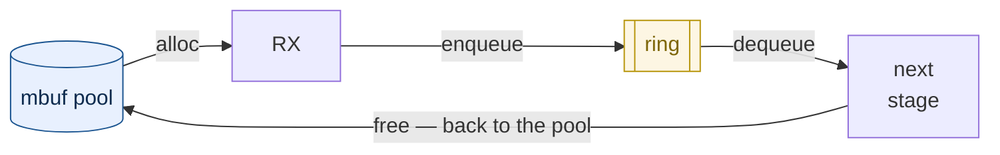

# Mempool, ring and mbuf — DPDK's data model

*Leia em [português](README.md).*

> **Level 4** of the [study plan](../plano-estudo-dpdk.md) ·
> Prerequisites: [02 — DPDK runtime](../02-runtime-dpdk/README.md) and the practical
> topic [02 — Mempool, ring and batch](../../trilha/01-fundamentos/02-mempool-ring/)

The [runtime module](../02-runtime-dpdk/README.md) showed the EAL reserving memory
and naming regions. This one deals with what you put inside it: the three structures
every DPDK program is built on, which answer three different questions.

| Structure | The question it answers |
|---|---|
| [`rte_mempool`][guiamempool] | where an object comes from, without allocating on the hot path |
| [`rte_mbuf`][guiambuf] | how a packet is represented |
| [`rte_ring`][guiaring] | how an object passes from one stage to the next |

The [practical topic](../../trilha/01-fundamentos/02-mempool-ring/) already exercises
all three and measures the effect of batching. This module does what the topic does
not: it **opens the structures up**, measures the cost of each operation, and covers
`rte_mbuf`, which so far has only been promised.

## By the end of this module you will be able to

1. **justify the mempool with numbers**, not with the folklore that `malloc()` costs
   tens of nanoseconds;
2. **size the per-lcore cache** knowing that without it the mempool loses to the
   standard library;
3. **predict the effect of batching** on each structure — and that it changes sign
   between mempool and `malloc`;
4. **manipulate an `rte_mbuf` without corrupting the packet**, distinguishing
   `buf_len`, `data_off`, `data_len` and `pkt_len`;
5. **write code that handles segmented packets**, and explain why testing with 64-byte
   frames never reveals the defect;
6. **choose between `_bulk` and `_burst`** by the contract, not by performance, and
   handle the partial return;
7. **decide between SP/SC and MP/MC** knowing that the cost exists even without
   contention, and that batching dilutes it.

## Contents

1. [Why not use `malloc()` — the measured answer](#1-why-not-use-malloc--the-measured-answer)
2. [The mbuf: four numbers that look redundant](#2-the-mbuf-four-numbers-that-look-redundant)
3. [The ring: the price of generality](#3-the-ring-the-price-of-generality)
4. [The three together: a packet's life cycle](#4-the-three-together-a-packets-life-cycle)
5. [Validation: reproduce it on your machine](#5-validation-reproduce-it-on-your-machine)
6. [When it goes wrong](#6-when-it-goes-wrong)
7. [Limitations of this document](#7-limitations-of-this-document)
8. [External references](#8-external-references)
9. [Navigation](#9-navigation)

---

## 1. Why not use `malloc()` — the measured answer

The practical topic opens with the claim that `malloc()` "can take tens of
nanoseconds". It is the mempool's reason for existing, and it circulates in almost
every DPDK text. It is worth measuring, because the result **is not what the claim
suggests**.

The program [`medicoes/custo-alocacao.c`](medicoes/custo-alocacao.c) compares the two
on the same machine, with the same methodology as the project's other programs.

```
  --- um objeto por vez, em NANOSSEGUNDOS POR OBJETO ---

  medicao                              mediana  p25-p75 (IQR)   amplitude min-max  disp    CV
  ---------------------------------- ---------  --------------- ----------------- ----- -----
  malloc/free                             2.18  2.16-2.18       2.14-2.23           0.9%   1.0%  
  mempool get/put, com cache             0.981  0.977-0.983     0.973-0.991         0.6%   0.5%  
  mempool get/put, SEM cache             10.45  10.44-10.50     10.43-10.63         0.5%   0.5%  
```

```
  frequencia do nucleo 0 durante a medicao: 5.56 -> 5.56 GHz
  razoes, que NAO dependem da frequencia:
    mempool com cache e 2.23x mais rapido que malloc
    o cache por lcore vale 10.7x (com cache contra sem cache)
    sem o cache, o mempool fica 4.8x mais LENTO que o malloc
```

> **Why the program publishes ratios, and not only nanoseconds.** Without pinning the
> processor's frequency — and this project does not pin it, as its
> [limitations](../00-visao-geral/README.md#5-o-ambiente-de-medição) declare — the
> absolute values change between runs: the same binary gave 2.19 ns and 2.77 ns for
> `malloc`, depending on whether turbo engaged. The **ratios** were identical (2.23×
> in both). That is why this module claims "twice as fast" and not "0.98
> nanoseconds": the ratio is the claim; the nanosecond is circumstance.

**`malloc()` costs 2.18 ns, not tens.** Repeatedly allocating and freeing an object
of the same size is the case where glibc is good: the allocator has a per-thread
cache, and the pair falls into it. The current claim overestimates the adversary —
and a justification that overestimates the adversary is fragile, because it collapses
when someone measures.

The mempool wins, but by **2.2 times**, not by an order of magnitude. And the third
line explains where the gain comes from.

### 1.1 The per-lcore cache is nearly the whole gain

A mempool has two layers: a common, shared ring, and a **per-lcore cache** acting as
a buffer. Creating the same pool with `cache_size = 0`, the operation goes from
**0.98 ns to 10.45 ns** — ten times more expensive, and five times more expensive
than `malloc()`.

The reading matters more than the number: **without the per-lcore cache, the mempool
loses to the standard library.** What it offers is not a magical data structure; it
is the same idea as glibc's — a per-thread cache — sized for the data plane and free
of synchronisation because no thread migrates between lcores. Anyone creating a
mempool with a zero cache "to keep it simple" is switching off exactly what they
chose the mempool for.

### 1.2 Four sizing rules, three of them silent

Creating a mempool requires choosing `n` (how many objects) and `cache_size`.
`rte_mempool_create`'s documentation declares four constraints on that pair, and
**three fail silently** — the pool is created, works, and wastes:

| Rule, as the documentation states it | What happens if violated |
|---|---|
| *"the optimum size (in terms of memory usage) is when n is a power of two minus one"* | wasted memory |
| `cache_size` ≤ `RTE_MEMPOOL_CACHE_MAX_SIZE` (512 in 25.11) | **creation fails** |
| `cache_size` ≤ `n / 1.5` | **creation fails** |
| *"choose cache_size to have n modulo cache_size == 0"* | *"some elements will always stay in the pool and will never be used"* |

The fourth is the easiest to violate without noticing — and this very module's
measurement program violated it. It used `n = 4095` with `cache_size = 256`: both
limits pass, `n` is in the optimal form, and nonetheless **255 objects were
unreachable**, because 4095 % 256 = 255.

The fix was not to swap 256 for another number chosen by eye. The rules became pure
code in [`medicoes/sizing.c`](medicoes/sizing.c), tested without an EAL, and the
program came to **derive** the cache:

```
  cache por lcore ........ 455 objetos (derivado, nao escolhido a olho)
    escolhido ............ sem ressalvas
    o obvio (256) seria .. n nao e multiplo do cache (objetos presos) -> 255 objetos presos
```

> Note that 455 is not a number anyone would think of. It is the largest divisor of
> 4095 that fits under the 512 ceiling — and it is that arithmetic, not intuition,
> that satisfies all four rules at once.

### 1.3 Batching changes sign between the two

This is the section's main result, and it appears in no published comparison:

```
  --- em LOTE, ns por objeto: os dois lados variam em sentidos opostos ---

  lote          malloc/free   mempool bulk      razao
  -----         -----------   ------------      -----
  1                 2.39 ns       1.837 ns       1.3x
  8                 2.55 ns       0.629 ns       4.1x
  32               12.39 ns       0.450 ns      27.6x
  128              19.64 ns       0.523 ns      37.5x
```

Asking for more objects at once **cheapens** each object in the mempool
(1.84 → 0.45 ns) and **makes it more expensive** in `malloc` (2.39 → 19.64 ns). The
ratio between the two goes from 1.3× to 37.5×.

That is decisive because the data plane **is** batch processing.
[§3 of the practical topic](../../trilha/01-fundamentos/02-mempool-ring/README.md)
measured that the batch is what amortises the cost of crossing cores; here you see
that it is also what separates the two approaches. Comparing mempool and `malloc`
object by object — which is how the comparison is usually made — measures precisely
the regime where the difference is smallest.

> **Why `malloc` gets worse with batching.** The mechanism is inside glibc's
> allocator, and this document **does not investigate it**: claiming without
> verifying is what it is correcting. What holds up is the observation — the step
> appears between 16 and 32 simultaneously live objects — and the engineering
> consequence.

> **A measurement trap that changes the result.** glibc has a fast path while the
> process has only one thread (`__libc_single_threaded`). Measuring `malloc` in a
> single-threaded program produces a number that exists on no server. The program
> keeps a noise thread alive, **pinned to a distinct physical core**, for the same
> reason the fundamentals came to do so after discarding an invalid measurement.
> Without pinning it, the measurement came out bimodal: p25 of 10.5 ns against p75 of
> 25.4 ns in the same measurement.

---

## 2. The mbuf: four numbers that look redundant

The [`rte_mbuf`][guiambuf] is the structure that carries a packet. It was promised by
the practical topic and deferred; it appears here.

The difficulty is not in the API, it is in four fields that seem to say the same
thing: `buf_len`, `data_off`, `data_len` and `pkt_len`. Confusing them produces
**silent corruption** — the packet goes out with extra bytes, missing bytes, or
garbage at the start, and nothing flags an error.

The program [`medicoes/anatomia-mbuf.c`](medicoes/anatomia-mbuf.c) does not describe
the layout: it prints the installed version's.

```
  sizeof(struct rte_mbuf) ..... 128 bytes (2 linhas de cache de 64 B)
  RTE_PKTMBUF_HEADROOM ........ 128 bytes reservados ANTES dos dados
  RTE_MBUF_DEFAULT_DATAROOM ... 2048 bytes para o pacote
  RTE_MBUF_DEFAULT_BUF_SIZE ... 2176 bytes (dataroom + headroom)
  elemento (mbuf + buffer) .... 2304 bytes
  + cabecalho do mempool ...... 64 bytes
  = objeto no pool ............ 2368 bytes

  Um pool de 8192 mbufs ocupa cerca de 18.5 MiB so em objetos.
```

**The descriptor costs 128 bytes per packet; the whole object in the pool, 2368.**
The decomposition matters: 2304 belong to the mbuf and its buffer, and **64 belong to
the mempool itself** — a per-object header that vanishes in a back-of-the-envelope
calculation. A pool of 8192 mbufs takes up 18.5 MiB in objects alone, a number that
decides sizing and rarely appears before memory runs out.

### 2.1 Two cache lines, and the reason there are two

```
    campo          offset  linha de cache
    -----          ------  --------------
    buf_addr            0  0
    data_off           16  0
    refcnt             18  0
    nb_segs            20  0
    port               22  0
    pkt_len            36  0
    data_len           40  0
    buf_len            54  0
    pool               56  0
    next               64  1
```

All the fields but one fit in the first line. What was left over for the second was
`next` — which only has value in a segmented packet, the less common case. DPDK's own
header refers to it as *"next pointer in the second cache line"*.

The consequence connects directly to
[§4.2 of the fundamentals](../01-fundamentos/README.md#42-cache-e-localidade): a
single-segment packet touches **one** cache line per mbuf. At 14.88 million packets
per second, one extra line per packet is cache bandwidth that is not left for the
packet itself.

### 2.2 The headroom, and why it exists

The four numbers in motion, in a 60-byte packet encapsulated and then
de-encapsulated:

```
  momento                     buf_len  headroom  data_len   pkt_len  tailroom nb_segs
  --------------------------  -------  --------  --------   -------  --------  ------
  recem-alocado                  2176       128         0         0      2048       1
  append(60) = payload           2176       128        60        60      1988       1
  prepend(14) = ethernet         2176       114        74        74      1988       1
  prepend(20) = tunel            2176        94        94        94      1988       1
  adj(20) = tira o tunel         2176       114        74        74      1988       1
  trim(4) = tira do fim          2176       114        70        70      1992       1
```

Reading the table:

- **`buf_len` never changes.** It is the *buffer*'s size, not the packet's. Anyone
  using it as the packet size transmits 2176 bytes of garbage.
- **`headroom` shrinks with each [`rte_pktmbuf_prepend()`][apiprepend]** and grows
  with each `adj()`. It is the space reserved **before** the data, and it exists
  exactly so that encapsulating means writing into already-reserved space — not
  copying the whole packet to make room. A tunnel, a VLAN header, an MPLS label: all
  live off the headroom.
- **`tailroom` does the opposite**, at the end of the buffer.
- **`data_len` and `pkt_len` move together** — as long as there is only one segment.

### 2.3 Segmentation: where the two numbers part ways

```
  momento                     buf_len  headroom  data_len   pkt_len  tailroom nb_segs
  --------------------------  -------  --------  --------   -------  --------  ------
  cabeca da cadeia               2176       114        70       170      1992       2
  segundo segmento               2176         -       100         -         -       -
```

With a second mbuf chained via [`rte_pktmbuf_chain()`][apichain], `pkt_len` (170)
becomes the sum of all the segments, and `data_len` (70) remains only what fits in
**this** mbuf.

**This is where most code breaks.** Anyone reading `data_len` thinking it is the
packet's size processes only the first piece — silently, with no error, and only with
large packets. Testing with 64-byte frames never reveals the defect, because a small
packet fits in a single segment.

### 2.4 Ownership: who frees

```
  refcnt do cabeca ............ 1
  objetos livres no pool ...... 1021 de 1023

  apos rte_pktmbuf_free(cabeca):
  objetos livres no pool ...... 1023 de 1023
```

One call to [`rte_pktmbuf_free()`][apimbuffree] returned **both** mbufs: it walks the
chain. Freeing the second segment as well, on your own, would return the same object
to the pool twice — and the pool **does not complain**. It starts handing the same
object to two owners, and the defect appears much later, far from the cause.

That completes the ownership rule the practical topic began:

| Operation | Who keeps the object |
|---|---|
| `rte_ring_enqueue_burst`, what did **not** fit | you — return it to the pool |
| `rte_eth_tx_burst`, what **was** accepted | the driver — do not free it |
| `rte_pktmbuf_free` on a chain | the whole chain comes back, with one call |

---

## 3. The ring: the price of generality

The practical topic claims that MP/MC mode (several producers, several consumers) has
"a higher cost because it requires contended atomic operations". True — and the word
*contended* hides the interesting part.

The program [`medicoes/custo-anel.c`](medicoes/custo-anel.c) measures both modes **on
a single lcore, with no contention at all**:

```
  lote       SP/SC (ns/obj)   MP/MC (ns/obj) custo MP/MC
  -----      --------------   -------------- -----------
  1                1.539 ns         8.229 ns       435%
  8                0.518 ns         1.259 ns       143%
  32               0.332 ns         0.473 ns        42%
  128              0.288 ns         0.301 ns         5%
```

**The cost does not depend on contention existing.** With a single producer, MP/MC
mode still costs 435% more at batch 1 — because the atomic instruction is executed
anyway. What you pay for is not the contention; it is the *possibility* of it.

And batching solves it: at 128 objects per call, the difference falls to 5%. It is
the same pattern that has now appeared twice in this project — the batch diluting a
fixed cost, whether that of crossing cores or that of an atomic instruction.

The engineering decision that follows:

- **If you know there is one producer and one consumer, say so.** `RING_F_SP_ENQ` and
  `RING_F_SC_DEQ` are not premature optimisation: they are information you have and
  the ring does not.
- **If you do not know, batching is the antidote.** MP/MC with a large batch costs
  almost the same as SP/SC.

### 3.1 `_bulk` and `_burst` are not synonyms

The two function families differ in their **contract**, not in performance, and the
wrong choice does not show up as slowness:

```
  anel pedido com 16 posicoes; capacidade real: 15
  (uma posicao fica reservada para distinguir cheio de vazio)

  enfileirados 12 em anel vazio ......... burst aceitou 12, livre=3
  pedindo mais 12 com apenas 3 livres:
    _bulk  aceitou 0  <- tudo ou nada: NADA entrou
    _burst aceitou 3  <- parcial: 3 entraram, 9 ficaram de fora
```

[`rte_ring_enqueue_bulk()`][apienqbulk] returns, in the API's words, *"the number of
objects enqueued, either 0 or n"*. `_burst` accepts a partial result and returns how
many fitted.

Neither is right in the abstract:

| Situation | Family |
|---|---|
| the batch is an indivisible unit (fragments of one packet) | `_bulk` |
| each object stands on its own, and whatever is left can wait | `_burst` |

The danger of `_burst` is the return value: the 9 objects that did not get in **are
still yours**. Ignoring that number is the classic leak the
[practical topic](../../trilha/01-fundamentos/02-mempool-ring/README.md) already
documents — and which, with a pool of 4095 objects, brings the pipeline to a silent
stop.

> Note the first line too: a ring requested with 16 slots holds **15**. One slot is
> reserved to distinguish full from empty. It is the same reason a mempool's optimal
> size is `2^q - 1`, and not `2^q`.

---

## 4. The three together: a packet's life cycle

The three structures are not independent: each solves one stretch of the same route.



Three invariants that run through the route, which this module measured or
demonstrated:

1. **Every object taken out has one destination: back to the pool.** There is no
   automatic collection. The most common escape point is `_burst`'s partial return.
2. **Batch size is a performance knob, never a semantic one.** It changes the cost per
   object by up to 37× against `malloc`, by 4× within the mempool, and by 87
   percentage points in the MP/MC ring — without altering the result.
3. **`data_len` is the segment's; `pkt_len` is the packet's.** Confusing them only
   fails with large packets.

### Where this appeared in the market data example

The [runtime module](../02-runtime-dpdk/README.md#4-processos-primário-e-secundário)
built a ring by hand, in shared memory, to pass ticks between two processes — with
indices, a mask and `_Alignas(64)` written out in the code. The
[`rte_ring`][guiaring] is that same structure, ready-made, with the SP/SC and MP/MC
modes section 3 measured, and usable between processes through the same memzone
naming mechanism.

The difference is that that ring carried `struct tick` — application data. This module
deals with the case where what circulates is a **packet**, and there the structure is
no longer free: it is the `rte_mbuf`, with the layout the NIC and the drivers expect.

---

## 5. Validation: reproduce it on your machine

```bash
./scripts/build-all.sh

./build/docs/03-mempool-ring-mbuf/medicoes/custo-alocacao -l 0 --no-huge --file-prefix=alocacao
./build/docs/03-mempool-ring-mbuf/medicoes/anatomia-mbuf  -l 0 --no-huge --file-prefix=mbuf
./build/docs/03-mempool-ring-mbuf/medicoes/custo-anel     -l 0 --no-huge --file-prefix=anel
```

All three enter the L2 suite, and the sizing rules have an L1 test:

```bash
./scripts/test-all.sh l1     # regras de dimensionamento, sem EAL
./scripts/test-all.sh l2     # runtime real
```

The L1 ([`medicoes/tests/test_l1_sizing.cpp`](medicoes/tests/test_l1_sizing.cpp))
exists because of the defect in
[§1.2](#12-four-sizing-rules-three-of-them-silent): one of the cases is literally the
pair (4095, 256) this module used, and it fails if anyone reintroduces it. It also
pins the value of `RTE_MEMPOOL_CACHE_MAX_SIZE` that the material assumes — if DPDK
changes from 512, the test flags it instead of the document ageing silently.

### Exercises

1. Run `custo-alocacao` and compare the "SEM cache" line with the "com cache" one. By
   how much does the per-lcore cache change the result on your machine?
2. Run the same program twice in a row and compare the **nanoseconds** and the
   **ratios**. Which changed? Check the frequency it reports.
3. Does your machine's `malloc` also get worse with batching? Where is the step?
4. In `anatomia-mbuf`, add up `headroom + data_len + tailroom`. Is the result
   `buf_len`? Should it be?
5. Still in `anatomia-mbuf`: why does `prepend(20)` work after `prepend(14)`, but
   would fail if the headroom were 16?
6. In `custo-anel`, which batch makes the difference between SP/SC and MP/MC fall
   below 10% on your machine? Compare with the optimal batch measured in the
   [practical topic](../../trilha/01-fundamentos/02-mempool-ring/README.md).
7. Modify `custo-anel` to use `_burst` instead of `_bulk` and ignore the return
   value. How many iterations until the program misbehaves?

---

## 6. When it goes wrong

> **This module's question:** what happens when the pool runs out mid-batch, and when
> the consumer does not keep up?

The program is [`medicoes/pool-esgotado.c`](medicoes/pool-esgotado.c). It does not
measure time: it measures **behaviour at the boundary**, and a count does not need a
median.

```bash
./build/docs/03-mempool-ring-mbuf/medicoes/pool-esgotado -l 0 --no-huge --file-prefix=pool
```

### 6.1 The step: `get_bulk` does not deliver a partial batch

With 10 free objects in a pool of 1023:

| Requested | Result | Delivered | Free afterwards |
|---:|---|---:|---:|
| 8 | ok | 8 | 2 |
| 9 | ok | 9 | 1 |
| 10 | ok | 10 | 0 |
| 11 | `-ENOBUFS` | **0** | 10 |
| 12 | `-ENOBUFS` | **0** | 10 |

Requesting 11 with 10 available returns **zero**, not ten. There is no middle ground:
[`rte_mempool_get_bulk()`][apigetbulk] is all or nothing.

The consequence is a programming error that is hard to see in code review:

```c
if (rte_mempool_get_bulk(pool, lote, n) != 0)
    continue;          /* parece "tenta de novo"; é uma parada total */
```

With the pool below `n`, that condition is true **on every turn**. The loop spins
without producing anything, with no error, no log, consuming 100% of the core. It is
not slowness: it is *livelock*, and the only symptom is throughput going to zero while
the process looks extremely busy.

To accept whatever there is, you have to ask for less, or use
[`rte_mempool_get()`][apiget] one object at a time — which costs more per object,
which is precisely what §1 measured.

### 6.2 Rule 4, confronted — and corrected

[§4 of the sizing rules](medicoes/sizing.h) states, from DPDK's documentation, that
with `n % cache_size != 0` some objects *"will always stay in the pool and will never
be used"*. Until now that was **arithmetic tested at L1**, never observed in a real
pool.

Observed, it does not hold:

| n | cache | Predicted stuck | Actually obtained | Does it match? |
|---:|---:|---:|---:|---|
| 1023 | 0 | 0 | 1023 | yes |
| 1024 | 256 | 0 | 1024 | yes |
| 4095 | 256 | **255** | **4095** | **no** |
| 1023 | 32 | **31** | **1023** | **no** |

A single consumer draining the pool obtains **all** the objects, including those the
rule gave up as lost. The mechanism is in DPDK's own header: in
`rte_mempool_do_generic_get()`, when the cache refill fails because there are not
enough objects for a whole batch, the code does `goto driver_dequeue` and fetches the
missing ones **straight from the backing ring**, bypassing the cache.

So is rule 4 wrong? No — it is badly stated. It is not a condition of
**reachability**; it is one of **steady-state efficiency**, with several lcores: each
cache retains objects the other cores cannot see, and divisibility decides whether
replenishment happens in full batches. It is worth following the rule, just not for
the reason the original sentence suggests.

> **This is the second piece of folklore this module brings down by measuring.** The
> first was the cost of `malloc()` in
> [§1](#1-why-not-use-malloc--the-measured-answer), repeated by the track itself until
> someone measured 2.18 ns. The difference is that that one came from the field's oral
> culture, and this one came from the **official documentation** — which is more
> uncomfortable and more instructive: a primary source also has to be confronted with
> behaviour.

### 6.3 What has not yet been measured

The several-lcore case — the regime where rule 4 actually acts — is **not** covered by
this experiment, which uses a single consumer. Measuring it requires the same
apparatus as [`custo-contencao.c`](medicoes/custo-contencao.c), and it is recorded
here as pending, not as a result.

Nor is the slow consumer with a full ring covered: the partial return of
`rte_ring_enqueue_burst()` and the leak it causes when ignored are measured in the
[practical topic](../../trilha/01-fundamentos/02-mempool-ring/README.md#6-quando-dá-errado),
which is where there is a real pipeline to fill it.

## 7. Limitations of this document

- **The measurements are from a single lcore, with no contention.** That is
  deliberate — the goal was to isolate the structures' cost, not that of cache
  coherence between cores, which the
  [fundamentals](../01-fundamentos/README.md#43-numa-quando-a-memória-deixa-de-ser-uma-coisa-só)
  already measured. With producer and consumer on distinct cores, the ring's numbers
  are different and larger.
- **The measurements published here are cost per operation, not latency.** That is why
  they appear as a median with dispersion, and not as percentiles. It is a choice, not
  an oversight: what matters in an operation executed millions of times is the typical
  cost and its stability. The **tail** question — what happens to the operation that
  finds the cache empty, or the pool exhausted — is of another nature and was not
  measured in this module. See the distinction between performance and predictability
  in [§4 of the overview](../00-visao-geral/README.md#4-como-ler-os-números).
- **The pool is warm in every measurement.** No number includes a page fault or a
  first pass through memory, which in production is more expensive.
- **The mechanism of `malloc`'s step was not investigated**, only observed. Explaining
  glibc's allocator is outside this project's scope.
- **There is no NIC.** This module's mbufs are allocated and manipulated by hand; none
  came in by DMA. The `rte_mbuf` filled in by hardware, with the *offload* fields, is
  the subject of the [RX/TX topic](../../trilha/02-pipeline/01-rx-tx-burst/).
- **`rte_mempool` has alternative handlers** (*mempool handlers*: `stack`, `bucket`,
  and the hardware ones) that this module does not compare. The default was used.

---

## 8. External references

**DPDK's official documentation**

- [Mempool Library][guiamempool] — structure, per-lcore cache and alignment
- [Mbuf Library][guiambuf] — layout, segmentation, headroom and metadata
- [Ring Library][guiaring] — the ring's algorithm, SP/SC and MP/MC

**From this project**

- [01 — Fundamentals](../01-fundamentos/README.md) — cache, false sharing and the
  per-packet budget
- [02 — DPDK runtime](../02-runtime-dpdk/README.md) — the memory these objects come
  from
- [Practical topic 02](../../trilha/01-fundamentos/02-mempool-ring/) — the complete
  cycle in code, with L1 and L2 tests
- [C++23 alternative](../../trilha/01-fundamentos/02-mempool-ring/alternativas/cpp23/) —
  the same problem without DPDK

---

## 9. Navigation

| | |
|---|---|
| **Previous** | [02 — DPDK runtime](../02-runtime-dpdk/README.md) |
| **Practical** | [Topic 02 — Mempool, ring and batch](../../trilha/01-fundamentos/02-mempool-ring/) |
| **Next** | [Pipeline and backpressure](../../trilha/02-pipeline/) |
| **Plan** | [Study plan](../plano-estudo-dpdk.md) |

[guiamempool]: https://doc.dpdk.org/guides/prog_guide/mempool_lib.html
[guiaring]: https://doc.dpdk.org/guides/prog_guide/ring_lib.html
[guiambuf]: https://doc.dpdk.org/guides/prog_guide/mbuf_lib.html

[apiprepend]: https://doc.dpdk.org/api/rte__mbuf_8h.html#a37b34f8b32723db17b2df80391bfa42d
[apichain]: https://doc.dpdk.org/api/rte__mbuf_8h.html#af52dbeb3951f5b90259d3760128ee139
[apimbuffree]: https://doc.dpdk.org/api/rte__mbuf_8h.html#a1215458932900b7cd5192326fa4a6902
[apienqbulk]: https://doc.dpdk.org/api/rte__ring_8h.html#ab8debfb458e927d559e7ce750048502d
[apiget]: https://doc.dpdk.org/api/rte__mempool_8h.html#a6150c041e889498a08d0e0d0769292cb
[apigetbulk]: https://doc.dpdk.org/api/rte__mempool_8h.html#a0d326354d53ef5068d86a8b7d9ec2d61
