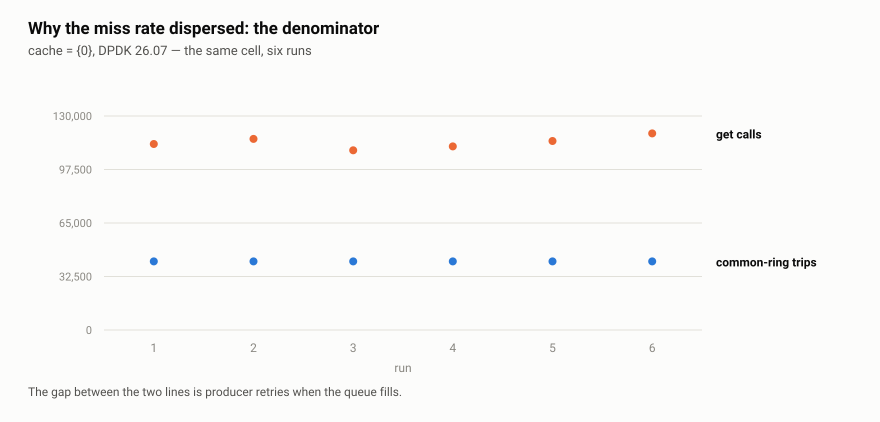
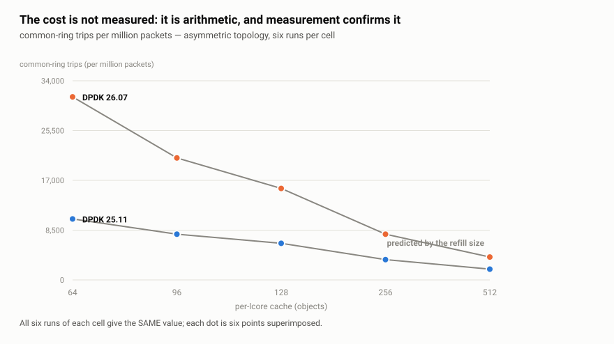
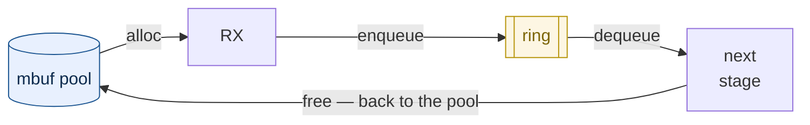

# Mempool, ring and mbuf — DPDK's data model

*Leia em [português](README.md).*

> **Level 4** of the [study plan](../plano-estudo-dpdk.en.md) ·
> Prerequisites: [02 — DPDK runtime](../02-runtime-dpdk/README.en.md) and the practical
> topic [02 — Mempool, ring and batch](../../trilha/01-fundamentos/02-mempool-ring/)

The [runtime module](../02-runtime-dpdk/README.en.md) showed the EAL reserving memory
and naming regions. This one deals with what you put inside it: the three structures
every DPDK program is built on, which answer three different questions.

| Structure | The question it answers |
|---|---|
| [`rte_mempool`][guiamempool] | where an object comes from, without allocating on the hot path |
| [`rte_mbuf`][guiambuf] | how a packet is represented |
| [`rte_ring`][guiaring] | how an object passes from one stage to the next |

The [practical topic](../../trilha/01-fundamentos/02-mempool-ring/) already exercises
all three and measures the effect of batching. This module does what the topic does
not: it **opens the structures up**, measures the cost of each operation, and covers
`rte_mbuf`, which so far has only been promised.

## By the end of this module you will be able to

1. **justify the mempool with numbers**, not with the folklore that `malloc()` costs
   tens of nanoseconds;
2. **size the per-lcore cache** knowing that without it the mempool loses to the
   standard library;
3. **predict the effect of batching** on each structure — and that it changes sign
   between mempool and `malloc`;
4. **manipulate an `rte_mbuf` without corrupting the packet**, distinguishing
   `buf_len`, `data_off`, `data_len` and `pkt_len`;
5. **write code that handles segmented packets**, and explain why testing with 64-byte
   frames never reveals the defect;
6. **choose between `_bulk` and `_burst`** by the contract, not by performance, and
   handle the partial return;
7. **decide between SP/SC and MP/MC** knowing that the cost exists even without
   contention, and that batching amortises it.

## Contents

1. [Why not use `malloc()` — the measured answer](#1-why-not-use-malloc--the-measured-answer)
2. [The mbuf: four numbers that look redundant](#2-the-mbuf-four-numbers-that-look-redundant)
3. [The ring: the price of generality](#3-the-ring-the-price-of-generality)
4. [The three together: a packet's life cycle](#4-the-three-together-a-packets-life-cycle)
5. [Validation: reproduce it on your machine](#5-validation-reproduce-it-on-your-machine)
6. [When it goes wrong](#6-when-it-goes-wrong)
7. [Limitations of this document](#7-limitations-of-this-document)
8. [External references](#8-external-references)
9. [Navigation](#9-navigation)

---

## 1. Why not use `malloc()` — the measured answer

The practical topic opens with the claim that `malloc()` "can take tens of
nanoseconds". It is the mempool's reason for existing, and it circulates in almost
every DPDK text. It is worth measuring, because the result **is not what the claim
suggests**.

The program [`medicoes/custo-alocacao.c`](medicoes/custo-alocacao.c) compares the two
on the same machine, with the same methodology as the project's other programs.

```
  --- one object at a time, in NANOSECONDS PER OBJECT ---

  measurement                           median  p25-p75 (IQR)   range min-max      disp    CV
  ---------------------------------- ---------  --------------- ----------------- ----- -----
  malloc/free                             2.78  2.77-2.78       2.77-2.79           0.2%   0.1%  
  mempool get/put, with cache             1.25  1.25-1.62       1.23-1.62          29.7%  12.6% !
  mempool get/put, NO cache              13.27  10.53-13.42     10.36-13.44        21.8%  11.1% !
```

```
  frequency of core 0 during the measurement: 4.33 -> 5.57 GHz
  ratios, which do NOT depend on frequency:
    mempool with cache is 2.23x faster than malloc
    the per-lcore cache is worth 10.6x (with cache against without)
    without the cache, the mempool is 4.8x SLOWER than malloc
```

> **Why the program publishes ratios, and not only nanoseconds.** Without pinning the
> processor's frequency — and this project does not pin it, as its
> [limitations](../00-visao-geral/README.en.md#5-the-measurement-environment) declare — the
> absolute values change between runs: the same binary gave 2.19 ns and 2.77 ns for
> `malloc`, depending on whether turbo engaged. The **ratios** were identical (2.23×
> in both). That is why this module claims "twice as fast" and not "0.98
> nanoseconds": the ratio is the claim; the nanosecond is circumstance.

**`malloc()` costs 2.18 ns, not tens.** Repeatedly allocating and freeing an object
of the same size is the case where glibc is good: the allocator has a per-thread
cache — the [tcache][tcache] —, and the pair falls into it. The current claim overestimates the adversary —
and a justification that overestimates the adversary is fragile, because it collapses
when someone measures.

The mempool wins, but by **2.2 times**, not by an order of magnitude. And the third
line explains where the gain comes from.

### 1.1 The per-lcore cache is nearly the whole gain

A mempool has two layers ([mempool guide][guiamempool]): a common, shared ring, and a **per-lcore cache** acting as
a buffer. Creating the same pool with `cache_size = 0`, the operation goes from
**0.98 ns to 10.45 ns** — ten times more expensive, and five times more expensive
than `malloc()`.

The reading matters more than the number: **without the per-lcore cache, the mempool
loses to the standard library.** What it offers is not a magical data structure; it
is the same idea as glibc's — a per-thread cache — sized for the data plane and free
of synchronisation because no thread migrates between lcores. Anyone creating a
mempool with a zero cache "to keep it simple" is switching off exactly what they
chose the mempool for.

### 1.2 Four sizing rules, three of them silent

Creating a mempool requires choosing `n` (how many objects) and `cache_size`.
`rte_mempool_create`'s documentation declares four constraints on that pair, and
**three fail silently** — the pool is created, works, and wastes:

| Rule, as the documentation states it | What happens if violated |
|---|---|
| *"the optimum size (in terms of memory usage) is when n is a power of two minus one"* | wasted memory |
| `cache_size` ≤ `RTE_MEMPOOL_CACHE_MAX_SIZE` (512 in 25.11) | **creation fails** |
| `cache_size` ≤ `n / 1.5` | **creation fails** |
| *"choose cache_size to have n modulo cache_size == 0"* | *"some elements will always stay in the pool and will never be used"* |

The fourth is the easiest to violate without noticing — and this very module's
measurement program violated it. It used `n = 4095` with `cache_size = 256`: both
limits pass, `n` is in the optimal form, and nonetheless **255 objects were
unreachable**, because 4095 % 256 = 255.

The fix was not to swap 256 for another number chosen by eye. The rules became pure
code in [`medicoes/sizing.c`](medicoes/sizing.c), tested without an EAL, and the
program came to **derive** the cache:

```
  cache per lcore ........ 455 objects (derived, not eyeballed)
    chosen ............... no caveats
    the obvious (256) .... n is not a multiple of the cache (objects pinned) -> 255 objects pinned
```

> Note that 455 is not a number anyone would think of. It is the largest divisor of
> 4095 that fits under the 512 ceiling — and it is that arithmetic, not intuition,
> that satisfies all four rules at once.

### 1.3 Batching changes sign between the two

This is the section's main result, and it appears in no published comparison:

```
  --- in BATCH, ns per object: the two sides move in opposite directions ---

  batch         malloc/free   mempool bulk      ratio
  -----         -----------   ------------      -----
  1                 2.74 ns       1.853 ns       1.5x
  8                 2.28 ns       0.632 ns       3.6x
  32               12.42 ns       0.465 ns      26.7x
  128              19.61 ns       0.436 ns      45.0x
```

Asking for more objects at once **cheapens** each object in the mempool
(1.84 → 0.45 ns) and **makes it more expensive** in `malloc` (2.39 → 19.64 ns). The
ratio between the two goes from 1.3× to 37.5×.

That is decisive because the data plane **is** batch processing.
[§3 of the practical topic](../../trilha/01-fundamentos/02-mempool-ring/README.en.md)
measured that the batch is what amortises the cost of crossing cores; here you see
that it is also what separates the two approaches. Comparing mempool and `malloc`
object by object — which is how the comparison is usually made — measures precisely
the regime where the difference is smallest.

> **Why `malloc` gets worse with batching.** The mechanism is inside glibc's
> allocator, and this document **does not investigate it**: claiming without
> verifying is what it is correcting. What holds up is the observation — the step
> appears between 16 and 32 simultaneously live objects — and the engineering
> consequence.

> **A measurement trap that changes the result.** glibc has a fast path while the
> process has only one thread (`__libc_single_threaded`). Measuring `malloc` in a
> single-threaded program produces a number that exists on no server. The program
> keeps a noise thread alive, **pinned to a distinct physical core**, for the same
> reason the fundamentals came to do so after discarding an invalid measurement.
> Without pinning it, the measurement came out bimodal: p25 of 10.5 ns against p75 of
> 25.4 ns in the same measurement.

---

### 1.4 When the execution model changes the sizing

DPDK 26.07 changed the mempool cache's refill and flush algorithm. The release
note states two things: the `flushthresh` field became obsolete, and the
**effective** cache size now matches the requested one — it used to be about 50%
larger. The guidance accompanying the change is that, in applications where one
lcore only gets and another only puts, it is worth **doubling** the configured
cache.

The question this experiment asks is not "did 26.07 get faster". It is:

> Does the change alter the relationship between `cache_size` and performance
> **differently** depending on the execution model?

#### The design

[`pipeline_ring`](../../trilha/01-fundamentos/02-mempool-ring/pipeline_ring.c)
already implements both topologies unchanged: with `-l 0`, producer and consumer
alternate on the same lcore and both operations hit the same cache; with
`-l 0,2`, one lcore only does `get` and the other only `put`.

| Element | Value |
|---|---|
| factorial | 2 versions × 2 topologies |
| inner sweep | `cache_size` ∈ {16, 24, 32, 48, 64, 96, 128, 256, 512} |
| control | `cache_size` = 0, which **disables** the cache rather than sizing it |
| repetitions | 6 per cell, 240 runs |
| metric | cache miss rate, a library counter |

**The collection is interleaved**, and that is a validity condition, not style:
the two versions of a given cell run adjacent to each other, and the cell order
is permuted on every repetition. Arms in blocks confound the effect with machine
state drift — that is how, in an earlier campaign of this same study, a
difference of 0.70 ns per packet became 0.15 ns when reproduced interleaved.

**The metric is a library counter**, not a hardware event: it does not depend on
the PMU, which is blocked on this machine. It counts the times the per-lcore
cache had no objects and the common ring had to be used.

#### The metric: why it is not "miss rate"

The natural quantity would be the fraction of `get` calls that went to the
common ring. It is unstable, and the instability **does not come from the
cache**.

When the queue fills, the producer returns the objects that did not fit and
**tries again** — each retry is one more `get` call. At `cache_size` = 96, of
the 111,523 calls in one run, **49,023 are retries** (the producer's `put`
counter marks exactly that number). The denominator therefore measures the race
between the two lcores.

<picture>
  <source media="(prefers-color-scheme: dark)" srcset="imagens/1-contaminacao-escuro.en.svg">
  
</picture>

The numerator does not vary. The quantity published here is therefore
**common-ring trips per million packets delivered** — which is what the cache
decides, and nothing else.

#### Symmetric topology: the cache serves everything, or nothing

With `-l 0` the same lcore gets and puts, and the `put`s replenish the cache the
`get`s drain. The result has no middle ground:

| `cache_size` | 25.11 | 26.07 |
|---:|---:|---:|
| 0 and 16 | 31,314 | 31,314 |
| **24** | **0.5** | **31,314** |
| 32 to 512 | 0.5 | 0.5 |

The value 0.5 per million means **one** common-ring trip in the whole run: the
initial fill. The 31,314 means every operation went to the ring.

The batch is 32 objects. On 26.07 the cache must **hold the batch** for the
`put` to deposit it there — with 24, `len + 32 > 24` and the objects go straight
to the ring, so the next `get` finds the cache empty. On 25.11 the `put` limit
is not the size but `flushthresh`, which is **1.5 × size**: with 24 configured,
36 usable, and the batch of 32 fits.

It is the same 50% difference the release note states, now located at the point
where it changes the outcome.

> **The boundary is bracketed, not pinned.** The sweep has 16 and 24, and
> 25.11's turning point falls between them — `32 / 1.5 ≈ 21.3`. Pinning it would
> take a finer step, which this experiment does not have.

#### Asymmetric topology: the cost is arithmetic

With `-l 0,2` the producer only gets and the consumer only puts; the producer's
cache is not replenished by its own `put`s. Here the count obeys the refill
size, and nothing else:

| `cache_size` | 25.11 | 26.07 | measured ratio | predicted ratio |
|---:|---:|---:|---:|---:|
| 64 | 10,417 | 31,250 | 3.000 | 3.000 |
| 96 | 7,813 | 20,834 | 2.667 | 2.667 |
| 128 | 6,250 | 15,625 | 2.500 | 2.500 |
| 256 | 3,472 | 7,813 | 2.250 | 2.250 |
| 512 | 1,838 | 3,906 | 2.125 | 2.125 |

<picture>
  <source media="(prefers-color-scheme: dark)" srcset="imagens/1-lei-escuro.en.svg">
  
</picture>

**All six runs of each cell give the same value** — the dots on the chart are
six superimposed measurements. That is not precise measurement; it is
measurement of something deterministic.

And the prediction is not a fit: it comes from the source. Each ring trip brings
one refill, and the refill size differs between versions:

```
25.11:  refill = cache_size + batch   ->  trips = packets / (cache_size + 32)
26.07:  refill = cache_size / 2       ->  trips = packets / (cache_size / 2)

ratio 26.07 / 25.11 = 2 x (cache_size + 32) / cache_size
```

Measured against predicted, the five ratios agree to the third decimal.

#### The three hypotheses, and what became of each

The hypotheses were recorded **before** the collection. Reporting only the
confirmed ones would defeat the purpose of recording them.

| Hypothesis | Statement | Outcome |
|---|---|---|
| 1 | in an asymmetric workload, `cache_size = N` costs more on 26.07 than on 25.11 | **confirmed**, and the ratio is computable |
| 2 | `cache_size = 2N` on 26.07 recovers 25.11's behaviour | **refuted**, and the residue is computable |
| 3 | in a symmetric workload the effect will be smaller or absent | **refuted by the detail** |

**The second is the one that contradicts the upstream guidance**, and now
without resorting to measurement: doubling the cache takes 26.07's refill from
`N/2` to `N`, against 25.11's `N + 32` at the original value. The remaining
ratio is `(N + 32) / N` — **never 1**. For `N = 32`, exactly twice the ring
trips. The guidance is not false; it is insufficient, and by how much can be
stated.

**The third was refuted in a more interesting way than confirmation would have
been.** The effect in the symmetric case is not "smaller": it is **absent across
the range and total at one point**. A conclusion that "nothing changes in the
symmetric case" would be true in nine measurements out of ten and would lead the
reader to pick `cache_size` = 24 without knowing a boundary had been crossed.

#### Where the count varies, and why

Three cells escape the law: `26.07` at `cache_size` = 24, and `25.11` at 32 and
48. In those the ring-trip count changes between runs. The cause is identifiable
without new measurement, and it is **not noise**.

**The condition.** The producer returns to the pool what did not fit in the
queue. If its cache absorbs that return, none of it reaches the common ring. If
it does not, the return becomes traffic. The source says when each version
absorbs:

| | `put` rule | absorbs the return if |
|---|---|---|
| 25.11 | `len + n ≤ flushthresh`, with `flushthresh = 1.5 × size` and `len = size` after the refill | `size + n ≤ 1.5 size`, that is **`size ≥ 2n`** |
| 26.07 | `len + n ≤ size` | **`size ≥ n`** |

With the batch at 32, the prediction is that 25.11 absorbs from 64 up and 26.07
from 32 up. **It holds in all sixteen cells**, including those the previous
section's law describes: where the prediction says "absorbs", the ring-return
counter is literally constant across the six runs; where it says it does not, it
varies.

**What varies is churn volume, not work.** Each retry pushes objects out to the
ring and pulls the same amount back. The two counters rise together, under a
linear constraint whose coefficients are the refill and flush sizes read from
the source:

```
refill_size x trips_out  -  flush_size x trips_back  =  constant
```

| cell | refill | flush | net objects, six runs |
|---|---:|---:|---|
| `25.11`, `c=48` | 80 | 40 | **2,336,200** in all six |
| `26.07`, `c=24` | 32 | 32 | **700,872** in all six |
| `25.11`, `c=32` | 64 | 32 | 1,869,024, with one run at 1,868,992 |

The variation of the net is **zero** in two cells and **32 objects out of 1.87
million** — a single operation — in the third. The trips vary by up to 50%; what
they carry does not.

> **What this licenses.** In those cells the cache does not stop working: it
> stops **isolating**. The common ring starts to see the churn between producer
> and consumer, which is a property of the race between the two lcores and not
> of the mempool. The quantity the cache governs — net objects drawn from the
> ring — stays invariant.

#### Why the retry count varies so much

It varies a lot — from 25 thousand to 139 thousand in the same cell — and the
reason is structural, not accidental.

**The system has no middle ground.** The ring fills when the producer outruns
the consumer. If it is marginally faster, the ring saturates and **every**
enqueue becomes partial; if it is marginally slower, the ring drains and there
are no retries at all. A small speed difference between the two lcores produces
a large difference in the count, and that is what is observed.

Increasing the ring depth does not fix it: with a faster producer, any depth
saturates — it just takes longer.

**What turns that race into mempool traffic is the application's pattern.** On a
partial enqueue the producer returns to the pool what did not fit, and on the
next pass of the loop it asks for all of it again. Without that, the race would
still exist and would not touch the pool.

> **This is a design choice, not a defect — and probably the right one.** A data
> plane that cannot transmit normally frees the buffer back to the pool; holding
> it would require state across iterations and a policy for the object that
> never fits. The program here does what §6 teaches: give ownership back when
> you cannot publish.
>
> Changing the pattern would make the count deterministic and would measure a
> **different program**, one less like what gets written in production. So it
> stays as it is, declared rather than corrected.

**What the pattern costs, measured.** Each retry redoes `packet_fill` for the
whole batch. In the run with 139,044 retries, that is **4.45 million** fills on
top of the 2 million real ones — more than three times the useful work. Whoever
sizes a pipeline this way pays it in CPU without it showing up in any miss rate.

**What could not be decided.** Frequency was the obvious environmental
candidate, and the available instrument does not settle it: the program reports
**one** sample, from **one** lcore, at the end of the run, when what matters is
the relative speed of the two throughout it. In the cell with the widest spread
the direction matches expectation — faster producer, more retries — but in the
others there is no order, and a final sample does not represent a run in which
the governor moves.

#### The replication on other hardware, and the boundary it reveals

The campaign was repeated on 2026-09-23 with a single difference: the machine
went from one memory stick to two, from single to dual channel. Same kernel,
same binaries, same 240-run protocol.

Nothing about that change has anything to do with the mempool. That is why it
works as a test.

**In the symmetric topology the twenty cells come out identical** — the same
31,314 and the same 0.5 per million, including the `cache_size` = 24 boundary
that separates the two versions.

In the asymmetric one the result splits, and it does not split just anywhere:

| | identical across the two machines | varying across the two machines |
|---|---|---|
| **25.11** | `cache_size` ≥ **64** | `cache_size` < 64 |
| **26.07** | `cache_size` ≥ **32** | `cache_size` < 32 |

Those two numbers were not chosen for the table. They are **exactly** the
absorption thresholds the previous subsection derives from the source:
`size ≥ 2n` for 25.11 and `size ≥ n` for 26.07, with the batch `n` = 32.

**The prediction this tested.** If the law is right, a cell that absorbs the
producer's return does not let the back-and-forth reach the common ring — and
then its count depends only on the arithmetic of the refill, which is a property
of the code. A cell that does not absorb exposes the race between the two
lcores, and the race is a property of the **machine**. Therefore: changing the
machine should move the cells below and leave the ones above untouched.

That is what was measured. Above the threshold the counts are equal **digit for
digit** on both machines; below it, they move by 2% to 4%.

**The replication also corrected one cell.** In the single-channel collection,
`25.11` with `cache_size` = 24 came out constant across the six runs, and the
law predicts that it should **vary** — 24 is below 64. In the dual-channel
collection it does vary, by a single count out of 62,500. The first campaign was
not wrong; it did not have enough runs to see a rare event. What the law
predicted and the first collection did not show, the second showed.

> **Why this is a better test than repeating the campaign.** Repeating on the
> same machine distinguishes a stable measurement from a noisy one, and nothing
> more. Changing the hardware separates two things the first campaign could only
> **argue** were distinct: what the code determines and what the race between
> lcores determines. The boundary between them appears on its own, in the
> predicted place, out of a variable nobody chose for convenience.

The second collection is in
[`medicoes/historico/2026-09-23-mempool-cache-canal-duplo/`](medicoes/historico/2026-09-23-mempool-cache-canal-duplo/),
with all 240 raw outputs.

#### What this experiment does not authorize

- **There is no timing measurement**, and the blocker was twofold. The first
  reason belongs to the build: both DPDKs were built with
  `RTE_LIBRTE_MEMPOOL_STATS`, whose counter is updated on the hot path, so the
  program measured is not the one in production. **This one still stands.**

  The second belonged to the instrument — `pipeline_ring` printed the time with
  `%.1f`, which over ~5 ns per packet quantizes at 2%, the same order as the
  differences there would be to detect. **This one has fallen:** with the
  `DPDK_ACADEMY_BRUTO` environment variable the program emits the three
  integers the mean comes from, with no rounding at all.

  ```
  raw timing: cycles=1590116 tsc_hz=4391800000 packets=200000
  ```

  The published line still carries **one** decimal place, deliberately: over
  ~5 ns, more digits would assert a precision one run does not sustain. Emitting
  the ingredients instead of more digits settles both sides — whoever analyses
  derives the precision the data sustains, and the program asserts none. Without
  the variable the output does not change by a byte, and the published blocks
  that reproduce it remain valid.

  What is still missing to measure the link is therefore **only** the pair of
  prefixes without `RTE_LIBRTE_MEMPOOL_STATS`. The upstream claim is about miss
  rate, and that is what this experiment answers — no more, no less.
- **The workload is a two-stage pipeline with one ring.** Real applications have
  more stages and more rings, and the upstream guidance may well be sufficient
  in topologies this program does not represent.
- **Both arms are local builds**, with drivers restricted to the study's
  minimum (`bus_pci`, `bus_vdev`, `mempool_ring`), not the distribution package
  used in the earlier history. This is a new campaign, not a continuation.
  [`scripts/preparar-dpdk.sh`](../../scripts/preparar-dpdk.sh) reproduces that
  configuration with `--minimo`; without the option it builds the full driver
  set, which serves other studies and is **not** the prefix that produced this
  table.

> **Equivalence between the two arms was checked, not assumed.**
> `RTE_MEMPOOL_CACHE_MAX_SIZE` (512) and `RTE_MBUF_DEFAULT_MEMPOOL_OPS`
> (`ring_mp_mc`) are the same in both; the driver set is identical; and
> `pipeline_ring` was compiled with the same flags (`-O2 -march=native`) against
> both prefixes.
>
> There is a stronger argument than the check: the miss counter is incremented
> in `rte_mempool_ops_dequeue_bulk`, which is `static inline` in the header — it
> has no symbol in `librte_mempool.so` and is compiled **inside the program**,
> with the project's flags. **The library's build type cannot affect the
> count.** It would affect the cost of the miss path, that is, time — one more
> reason the timing column is out.

The collection is in
[`medicoes/historico/2026-09-21-mempool-cache-intercalada/`](medicoes/historico/2026-09-21-mempool-cache-intercalada/),
with the raw output of each of the 240 runs and the provenance the program
prints — DPDK version, commit, host, compiler and date.

---

## 2. The mbuf: four numbers that look redundant

The [`rte_mbuf`][guiambuf] is the structure that carries a packet. It was promised by
the practical topic and deferred; it appears here.

The difficulty is not in the API, it is in four fields that seem to say the same
thing: `buf_len`, `data_off`, `data_len` and `pkt_len`. Confusing them produces
**silent corruption** — the packet goes out with extra bytes, missing bytes, or
garbage at the start, and nothing flags an error.

The program [`medicoes/anatomia-mbuf.c`](medicoes/anatomia-mbuf.c) does not describe
the layout: it prints the installed version's.

```
  sizeof(struct rte_mbuf) ..... 128 bytes (2 cache lines of 64 B)
  RTE_PKTMBUF_HEADROOM ........ 128 bytes reserved BEFORE the data
  RTE_MBUF_DEFAULT_DATAROOM ... 2048 bytes for the packet
  RTE_MBUF_DEFAULT_BUF_SIZE ... 2176 bytes (dataroom + headroom)
  element (mbuf + buffer) ..... 2304 bytes
  + mempool header ............ 64 bytes
  = object in the pool ........ 2368 bytes

  A pool of 8192 mbufs takes about 18.5 MiB in objects alone.
```

**The descriptor costs 128 bytes per packet; the whole object in the pool, 2368.**
The decomposition matters: 2304 belong to the mbuf and its buffer, and **64 belong to
the mempool itself** — a per-object header that vanishes in a back-of-the-envelope
calculation. A pool of 8192 mbufs takes up 18.5 MiB in objects alone, a number that
decides sizing and rarely appears before memory runs out.

### 2.1 Two cache lines, and the reason there are two

```
    field          offset  cache line
    -----          ------  --------------
    buf_addr            0  0
    data_off           16  0
    refcnt             18  0
    nb_segs            20  0
    port               22  0
    pkt_len            36  0
    data_len           40  0
    buf_len            54  0
    pool               56  0
    next               64  1
    tx_offload         72  1
    shinfo             80  1
    priv_size          88  1
    timesync           90  1
    dynfield1          92  1
```

The first line holds what the hot path reads on **every** packet: buffer, offsets,
lengths, refcount and pool. The second holds **six** fields — `next`, `tx_offload`,
`shinfo`, `priv_size`, `timesync` and `dynfield1`.

`next` is the one DPDK's header names explicitly, *"next pointer in the second cache
line"*, because it is the one whose **absence** from the first line was a design choice:
it only has value in a segmented packet, the less common case.

> **And a single-segment packet still touches the second line.** The generic free path
> reads it:
>
> ```c
> /* rte_mbuf.h, rte_pktmbuf_prefree_seg() */
> if (m->next != NULL)
>         m->next = NULL;
> ```
>
> That runs on **every** segment released, segmented or not. The split's saving is on
> the RX/TX hot path, **not** over the mbuf's whole life: allocation and release reach
> the second line regardless.

The consequence connects directly to
[§4.2 of the fundamentals](../01-fundamentos/README.en.md#42-cache-and-locality): at
14.88 million packets per second, one extra line **on the hot path** is cache bandwidth
that is not left for the packet itself.

### 2.2 The headroom, and why it exists

The four numbers in motion, in a 60-byte packet encapsulated and then
de-encapsulated:

```
  moment                      buf_len  headroom  data_len   pkt_len  tailroom nb_segs
  --------------------------  -------  --------  --------   -------  --------  ------
  freshly allocated              2176       128         0         0      2048       1
  append(60) = payload           2176       128        60        60      1988       1
  prepend(14) = ethernet         2176       114        74        74      1988       1
  prepend(20) = tunnel           2176        94        94        94      1988       1
  adj(20) = strip the tunnel     2176       114        74        74      1988       1
  trim(4) = cut from the end     2176       114        70        70      1992       1
```

Reading the table:

- **`buf_len` never changes.** It is the *buffer*'s size, not the packet's. Anyone
  using it as the packet size transmits 2176 bytes of garbage.
- **`headroom` shrinks with each [`rte_pktmbuf_prepend()`][apiprepend]** and grows
  with each `adj()`. It is the space reserved **before** the data, and it exists
  exactly so that encapsulating means writing into already-reserved space — not
  copying the whole packet to make room. A tunnel, a VLAN header, an MPLS label: all
  live off the headroom.
- **`tailroom` does the opposite**, at the end of the buffer.
- **`data_len` and `pkt_len` move together** — as long as there is only one segment.

### 2.3 Segmentation: where the two numbers part ways

```
  moment                      buf_len  headroom  data_len   pkt_len  tailroom nb_segs
  --------------------------  -------  --------  --------   -------  --------  ------
  head of the chain              2176       114        70       170      1992       2
  second segment                 2176         -       100         -         -       -
```

With a second mbuf chained via [`rte_pktmbuf_chain()`][apichain], `pkt_len` (170)
becomes the sum of all the segments, and `data_len` (70) remains only what fits in
**this** mbuf.

**This is where most code breaks.** Anyone reading `data_len` thinking it is the
packet's size processes only the first piece — silently, with no error, and only with
large packets. Testing with 64-byte frames never reveals the defect, because a small
packet fits in a single segment.

### 2.4 Ownership: who frees

```
  refcnt of the head .......... 1
  free objects in the pool .... 1021 of 1023

  after rte_pktmbuf_free(head):
  free objects in the pool .... 1023 of 1023
```

One call to [`rte_pktmbuf_free()`][apimbuffree] returned **both** mbufs: it walks the
chain. Freeing the second segment as well, on your own, would return the same object
to the pool twice — and the pool **does not complain**. It starts handing the same
object to two owners, and the defect appears much later, far from the cause.

That completes the ownership rule the practical topic began:

| Operation | Who keeps the object |
|---|---|
| `rte_ring_enqueue_burst`, what did **not** fit | you — return it to the pool |
| `rte_eth_tx_burst`, what **was** accepted | the driver — do not free it |
| `rte_pktmbuf_free` on a chain | the whole chain comes back, with one call |

---

## 3. The ring: the price of generality

The practical topic claims that MP/MC mode (several producers, several consumers) has
"a higher cost because it requires contended atomic operations". True — and the word
*contended* hides the interesting part.

The program [`medicoes/custo-anel.c`](medicoes/custo-anel.c) measures both modes **on
a single lcore, with no contention at all**:

```
  batch      SP/SC (ns/obj)   MP/MC (ns/obj) MP/MC cost
  -----      --------------   -------------- -----------
  1                1.626 ns         8.233 ns       406%
  8                0.530 ns         1.283 ns       142%
  32               0.397 ns         0.484 ns        22%
  128              0.375 ns         0.303 ns       -19%
```

**The cost does not depend on contention existing.** With a single producer, MP/MC
mode still costs 406% more at batch 1 — because the atomic instruction is executed
anyway. What you pay for is not the contention; it is the *possibility* of it.

And batching solves it — more than solves it. At 128 objects per call the difference
does not merely vanish: on this machine MP/MC measures **faster** than SP/SC, −19%.
The archived campaign reproduces the inversion in **all five** repetitions, between
−17% and −19%, with the machine idle. It is not the noise of a single collection,
and the files are in [`medicoes/historico/`](medicoes/historico/) for anyone who
wants to check. Up to batch 32 the pattern is the expected one — the batch diluting
a fixed cost, as has now appeared twice in this project, whether that of crossing
cores or that of an atomic instruction. At batch 128 that cost has already been
diluted below the difference between the two `rte_ring` code paths, and what is left
is no longer the price of generality.

> **This table once published "5%" at batch 128, and the prose concluded that "MP/MC
> with a large batch costs almost the same as SP/SC".** This release's campaign, on
> hardware at 6000 MT/s, measures −19% in five of five repetitions: the sign
> inverted. The old conclusion does not hold as written.
>
> **This project does not explain the inversion.** Explaining it would require
> instrumenting the two paths of `rte_ring_enqueue_bulk` and `rte_ring_dequeue_bulk`
> separately, which is outside this module's scope. What is measured is the
> inversion; the cause is declared as a limitation, not as a result.

### 3.1 Where the cycles go: reserve and publish

The table above says *how much*. This section says *what* — and what answers is
the compiled code, not the documentation.

The ring is a bounded circular buffer with **two head/tail pairs**, one per
side. An operation happens in three steps:

    1. RESERVE    advance your side's head, claiming a range of slots
    2. write      the elements, with no coordination — the range is already yours
    3. PUBLISH    advance the tail, making what was written visible

Separating reserve from publish is what lets two producers write **at the same
time** into distinct ranges. And it is where the difference between SP and MP
comes from.

> **Which implementation this material describes.** `rte_ring_elem_pvt.h`
> chooses between two via `#ifdef RTE_USE_C11_MEM_MODEL`. In this build the
> macro is **not** defined, so the measured binary uses
> `rte_ring_generic_pvt.h` — explicit barriers — and not the C11 path, which
> expresses the same algorithm with `memory_order`. Both exist and are
> equivalent in guarantee; what follows describes what **this** machine ran.

The reservation is literally an `if` ([`rte_ring_generic_pvt.h`][ringgen]):

```c
if (is_st) {
    d->head = *new_head;                    /* SP: plain store */
    success = 1;
} else
    success = rte_atomic32_cmpset(          /* MP: 32-bit CAS */
            (uint32_t *)(uintptr_t)&d->head, ... );
} while (unlikely(success == 0));           /* ...in a loop */
```

With one producer, advancing the head is **a plain store**. With several, it is
a *compare-and-swap* in a loop: if another producer moved the head between the
read and the write, the CAS fails and the iteration restarts — re-reading the
other side's tail and recomputing how many slots still fit.

Publication brings the second difference:

```c
if (enqueue) rte_smp_wmb(); else rte_smp_rmb();
if (!single)
    rte_wait_until_equal_32(&ht->tail, old_val, rte_memory_order_relaxed);
ht->tail = new_val;
```

**The tail advances in order.** If producer B reserved after A, it cannot
publish first: the tail is a single number, and publishing out of order would
expose a range still being written. So B **waits** for the tail to reach the
point where its own reservation begins. The SP path does not run that wait.

Note that `ht->tail = new_val` is a plain store in both modes. The ordering
comes from the preceding barrier, not from the store — and that is what lets
the consumer read the **elements** with no atomic on them at all. The cost
concentrates on the indices, not on the data.

#### Two vocabularies for the same algorithm

The generic path uses **explicit barriers**; the C11 path uses the C++ memory
model and names its synchronising edges. The correspondence is what matters to
anyone writing C or C++ outside DPDK:

| generic (this build) | C11 / [`std::memory_order`][cppmemord] | what it guarantees |
|---|---|---|
| `rte_smp_wmb()` before `ht->tail = v` | `store_explicit(&tail, v, release)` | the elements become visible **before** the tail that announces them |
| `rte_smp_rmb()` before reading the tail | `load_explicit(&tail, acquire)` | whoever sees the new tail also sees the elements |
| `rte_atomic32_cmpset` in a loop | `compare_exchange_*(..., release, acquire)` | reserves and synchronises in one indivisible step |

They are two ways of expressing the same memory ordering: one by processor
barrier, the other by the language contract. Knowing both is what lets you read
concurrent-queue code from any era.

#### What the measured binary actually emits

The claim that "MP mode runs an atomic instruction" does not have to stay a
word. Disassembling the binary that produced the §3 table:

```bash
objdump -d custo-anel | grep 'lock cmpxchg'
```

Two of the instructions land exactly on the ring's fields:

```
lock cmpxchg %r10d,0x80(%rdx)     <- producer head
lock cmpxchg %ecx,0x100(%rdx)     <- consumer head
```

They are **32-bit** operands (`%r10d`, `%ecx`), consistent with
`rte_atomic32_cmpset`, and the offsets match the `prod` and `cons` unions that
`struct rte_ring` declares **cache-line aligned** and separated by
`RTE_CACHE_GUARD` — the same defence against false sharing that
[§4.2.1 of the fundamentals](../01-fundamentos/README.en.md#421-false-sharing-the-most-common-mistake-of-data-plane-programmers)
measures.

#### Why the atomic costs with nobody contending

The 406% at batch 1 were measured **on a single lcore**. There is no second
producer, the CAS never fails, and the loop runs once.

What remains is the cost of the instruction. The `f0` prefix that `objdump`
shows is the `lock`: it makes the operation indivisible over the cache line and
orders accesses around it, whether or not anyone contends. A plain store does
none of that.

That is what the phrase *"what you pay for is not the contention; it is the
possibility of it"* means, now with a mechanism under it: MP mode's code is the
same with one producer or with twelve.

> **What this material cannot claim.** Attributing the cycles to specific
> events — coherence traffic, barrier cost, branch misprediction — would
> require performance counters. On this machine `perf_event_paranoid = 4`
> refuses even `cycles,instructions`. The mechanism above **explains the
> observed cost compatibly**; it was not measured as the cause.

---

### 3.2 Four strategies for the same ring

SP/SC and MP/MC are not the whole space. The API offers two more modes, and
walking through them holds constant everything that a comparison with another
project would change at once: same structure, same queue contract, same
implementation.

| mode | head reservation | tail advance | what it trades |
|---|---|---|---|
| **SP/SC** | plain store | plain store | no coordination — requires the 1P/1C invariant |
| **MP/MC** | 32-bit CAS in a loop | each thread advances its own | **waits** on the tail until its turn arrives |
| **RTS** | 64-bit CAS (value + counter) | only the **last** thread advances | trades the wait for a **second CAS** |
| **HTS** | 64-bit CAS with head and tail **together** | together with the head | **serialises**: advances only if `head == tail` |

The headers state the trade. [`rte_ring_rts.h`][ringrts] describes the
mechanism with an update counter on each side: the tail advances only when
`tail.cnt + 1 == head.cnt`, that is, when the thread finishing is the last in
line. That **eliminates the spinning** at the price of two 64-bit CAS per
operation, against one 32-bit CAS plus waiting in classic MP/MC.

[`rte_ring_hts.h`][ringhts] goes to the opposite extreme: head and tail become
a single 64-bit value updated by one CAS, and a thread may touch the head only
when `head.value == tail.value`. The queue becomes **fully serialised** — at
most one operation in flight per side.

The engineering reading is that there is no "best mode", there is **which
pathology you want to avoid**:

- classic MP/MC suffers when a thread is **preempted between reserving and
  publishing** — those that came after are stuck waiting on the tail;
- RTS removes that wait, and pays with more atomic traffic on every operation,
  including the ones that would never have suffered;
- HTS trades parallelism for predictability, and is the mode that supports the
  *peek* API, precisely because at most one operation is in flight.

`rte_ring.h` warns that **the implementation is not preemptible** and points to
the Programmer's Guide. RTS and HTS exist because of that: they answer
scenarios where a thread can lose the CPU mid-operation — the case of running
with more threads than cores.

#### The same problem outside DPDK

It is worth separating API from principle:

| specific to DPDK | transferable to C/C++ |
|---|---|
| `rte_ring`, `RING_F_SP_ENQ`, `_bulk`/`_burst` | bounded circular buffer; reserve→publish |
| `rte_atomic32_cmpset`, `rte_smp_wmb` | `std::atomic`, release/acquire, RMW, barriers |
| RTS, HTS | trading waiting for atomic traffic; serialising to gain predictability |
| `RTE_CACHE_GUARD` between `prod` and `cons` | separating by cache line what different threads write |

The [Disruptor][disruptor] solves the same problem by another route: distinct
sequencers for one or many producers, coordination by **sequence barriers**
between consumers instead of exclusive ownership, and wait strategies chosen by
the application. The interesting comparison is not one of speed — it is
noticing that it exposes as a choice what `rte_ring` fixes in the mode, and
fixes what `rte_ring` leaves open.

> **This is design counterpoint, not competition.** Structures with different
> contracts do not compare by number: what one guarantees, another does not
> offer. Comparing measurements would only be legitimate under equivalent
> conditions, and demonstrating the equivalence is work that comes **before**
> the measurement.

---

### 3.3 The counterfactual: what adopting SP/SC costs

Measuring that SP/SC is cheaper does not authorise using it. The next question
is architectural:

    I want SP/SC
         ↓
    what invariant must I guarantee?
         ↓
    exactly one producer and one consumer, per ring
         ↓
    how does the architecture change to guarantee it?
         ↓
    one ring per pair of participants, instead of a shared ring
         ↓
    what complexity does that introduce?
         ↓
    N×M rings, explicit routing, manual balancing,
    and an invariant the compiler does not check
         ↓
    does the measured gain justify it?

The last question has no general answer, and the §3 table shows why: 406% at
batch 1, 22% at batch 32. **If the application already works in large batches,
the invariant costs a lot and yields little.** If it processes object by
object, the account inverts.

And it is worth recalling what batching does and does not do. It dilutes a
**fixed** cost over more objects — it does not make the operation faster. It is
the same effect that
[§4.2 of the fundamentals](../01-fundamentos/README.en.md#42-cache-and-locality)
measures in access concurrency: the per-unit cost falls many times over without
a single unit becoming faster.

There is also a cost that does not show up in nanoseconds: `RING_F_SP_ENQ` is a
promise the ring does not verify. Breaking it produces no error — it produces
silent corruption, of the same kind §3.4 documents in `_burst`'s return value.

---

The engineering decision that follows:

- **If you know there is one producer and one consumer, say so.** `RING_F_SP_ENQ` and
  `RING_F_SC_DEQ` are not premature optimisation: they are information you have and
  the ring does not.
- **If you do not know, batching is the antidote.** MP/MC with a large batch costs
  the same as or less than SP/SC on this machine — the SP/SC advantage only exists
  at small batch sizes.

### 3.4 `_bulk` and `_burst` are not synonyms

The two function families differ in their **contract**, not in performance, and the
wrong choice does not show up as slowness:

```
  ring asked for 16 slots; real capacity: 15
  (one slot is reserved to tell full apart from empty)

  enqueued 12 into an empty ring ........ burst accepted 12, free=3
  asking for 12 more with only 3 free:
    _bulk  accepted 0 <- all or nothing: NOTHING went in
    _burst accepted 3 <- partial: 3 went in, 9 stayed out
```

[`rte_ring_enqueue_bulk()`][apienqbulk] returns, in the API's words, *"the number of
objects enqueued, either 0 or n"*. `_burst` accepts a partial result and returns how
many fitted.

Neither is right in the abstract:

| Situation | Family |
|---|---|
| the batch is an indivisible unit (fragments of one packet) | `_bulk` |
| each object stands on its own, and whatever is left can wait | `_burst` |

The danger of `_burst` is the return value: the 9 objects that did not get in **are
still yours**. Ignoring that number is the classic leak the
[practical topic](../../trilha/01-fundamentos/02-mempool-ring/README.en.md) already
documents — and which, with a pool of 4095 objects, brings the pipeline to a silent
stop.

> Note the first line too: a ring requested with 16 slots holds **15**. One slot is
> reserved to distinguish full from empty. It is the same reason a mempool's optimal
> size is `2^q - 1`, and not `2^q`.

### 3.5 When output order matters: `rte_soring`

The four strategies of §3.2 answer *who may enter at the same time*. None
answers the question that appears as soon as processing becomes a pipeline with
parallel stages: **stages finish out of order — how do you publish in order?**

This is not fussiness. Market data delivered out of order forces the consumer to
reorder; a TCP stream reassembled out of order is not the stream; a sequence of
transactions applied out of order is a different database. In all of them,
parallelism is desirable **inside** the stage and unacceptable **at the output**.

[`rte_soring`][apisoring] — *Staged Ordered Ring* — is DPDK's structure for
this. It is an `rte_ring` with **stages**: besides `enqueue` and `dequeue`, each
stage has an `acquire`/`release` pair.

```c
uint32_t ftoken;
n = rte_soring_acquire_bulk(r, objs, stage, num, &ftoken, NULL);
/* exclusive possession of the n objects; process in parallel with other lcores */
rte_soring_release(r, objs, stage, n, ftoken);
```

#### The `ftoken` is the mechanism, and it is worth seeing why

`acquire` returns an **opaque token** that the caller keeps and gives back to
`release`. That token is what separates *finishing* from *publishing*: it
records the reserved position, so two lcores can complete their work in any
order and the next stage still sees the elements in the original one.

It is the same **reserve and publish** protocol §3.1 showed inside the ring —
`head` moves, work happens, `tail` moves — now **exposed in the API** instead of
hidden in the implementation. There the gap between reserve and publish was a
few cycles; here it is the whole stage.

Two obligations the documentation states, and they change the caller's design:

| Obligation | Consequence |
|---|---|
| `acquire` returns **exactly** what was asked, or zero | there is no partial acquisition to handle, unlike `_burst` |
| `release` must return **the same number** acquired | a stage cannot drop elements midway; dropping becomes element state, not disappearance |

The second is the one that usually surprises. A stage that decides to throw a
packet away cannot simply fail to return it: it must return it marked. That is
what `meta_size` in `rte_soring_param` is for — a parallel metadata array,
written on `release` and read on `dequeue`, which the header suggests precisely
for a per-element "return code".

#### The cost: head-of-line blocking

Guaranteeing output order has a price, and it is structural rather than an
implementation detail: **one slow element blocks the publication of every
element behind it**, even those already finished. It is the same phenomenon that
makes a single bank queue slower than several when one customer takes long.

The choice, then, is not between "ordered" and "unordered", but among:

| Alternative | What you gain | What you pay |
|---|---|---|
| `rte_ring` + reorder in the consumer | stages never block | a reorder buffer and its complexity in the consumer |
| `rte_soring` | guaranteed order at the output | head-of-line blocking inside the pipeline |
| partition by key | order **per key**, no blocking across keys | only valid when the required order is per key, not global |

The third is the one most often right and least often raised: if the real
requirement is *order per instrument* rather than *global order*, partitioning
dissolves the problem instead of solving it.

#### What 26.07 adds

The `rte_ring` peek API, which §3.2 identified as sustained by the HTS mode —
because at most one operation is in flight — now has an equivalent over
`soring`:

```
rte_soring_enqueue_bulk_start / rte_soring_enqueue_finish
rte_soring_dequeue_burst_start / rte_soring_dequeue_finish
```

The `start`/`finish` pair makes explicit in the interface the same separation
the `ftoken` makes between stages: look at what is available, decide, and only
then commit. The `enqueux`/`dequeux` variants are the ones that also move the
metadata array.

> **Not measured.** This section describes mechanism from the header and the
> documentation, with no measurement of its own. `rte_soring` is declared
> `__rte_experimental` by DPDK itself, and measuring an experimental API as
> though it were stable would give the number a stability the interface does not
> have. What is asserted here is verifiable in the installed header; what it
> costs is not.

> **What transfers.** This is a **reorder buffer**, and the pattern is old: a
> superscalar processor executes out of order and *retires* in order, for the
> same reason and with the same structure — a circular queue where the slot is
> reserved on entry and confirmed on exit. TCP does it in reassembly; databases
> do it in group commit. Recognizing the shape avoids reinventing it badly:
> people who write their own reorderer tend to discover late that they need the
> token, the cap on elements in flight, and a policy for the element that never
> arrives.

---

## 4. The three together: a packet's life cycle

The three structures are not independent: each solves one stretch of the same route.



Three invariants that run through the route, which this module measured or
demonstrated:

1. **Every object taken out has one destination: back to the pool.** There is no
   automatic collection. The most common escape point is `_burst`'s partial return.
2. **Batch size is a performance knob, never a semantic one.** It changes the cost per
   object by up to 37× against `malloc`, by 4× within the mempool, and by 87
   percentage points in the MP/MC ring — without altering the result.
3. **`data_len` is the segment's; `pkt_len` is the packet's.** Confusing them only
   fails with large packets.

### Where this appeared in the market data example

The [runtime module](../02-runtime-dpdk/README.en.md#4-primary-and-secondary-processes)
built a ring by hand, in shared memory, to pass ticks between two processes — with
indices, a mask and `_Alignas(64)` written out in the code. The
[`rte_ring`][guiaring] is that same structure, ready-made, with the SP/SC and MP/MC
modes section 3 measured, and usable between processes through the same memzone
naming mechanism.

The difference is that that ring carried `struct tick` — application data. This module
deals with the case where what circulates is a **packet**, and there the structure is
no longer free: it is the `rte_mbuf`, with the layout the NIC and the drivers expect.

---

## 5. Validation: reproduce it on your machine

```bash
./scripts/build-all.sh

./build/docs/03-mempool-ring-mbuf/medicoes/custo-alocacao -l 0 --no-huge --file-prefix=alocacao
./build/docs/03-mempool-ring-mbuf/medicoes/anatomia-mbuf  -l 0 --no-huge --file-prefix=mbuf
./build/docs/03-mempool-ring-mbuf/medicoes/custo-anel     -l 0 --no-huge --file-prefix=anel
```

The module builds two more programs, and they need their own command line — the
contention one because it requires several lcores, the exhaustion one because it
does not measure time:

```bash
./build/docs/03-mempool-ring-mbuf/medicoes/custo-contencao \
    -l 0-7 --no-huge --file-prefix=contencao --no-pci 64
./build/docs/03-mempool-ring-mbuf/medicoes/pool-esgotado -l 0 --no-huge --file-prefix=esgotado
```

> **The contention program's workers are launched with
> `rte_eal_remote_launch`, and that is a validity condition, not style.** The
> per-lcore cache is indexed by `rte_lcore_id()`. An ordinary thread created
> with `pthread_create` without registering with the EAL gets `LCORE_ID_ANY` and
> **skips the cache**, falling straight through to the common ring — the
> measurement would come out bad for the wrong reason, with no warning at all.
> The `malloc` side uses pthreads because that is what an ordinary program would
> do. The `LCORE_ID_ANY` mechanism is in
> [§5.1 of module 02](../02-runtime-dpdk/README.en.md#51-an-lcore-is-not-a-cpu).

All five enter the L2 suite, and the sizing rules have an L1 test:

```bash
./scripts/test-all.sh l1     # sizing rules, without the EAL
./scripts/test-all.sh l2     # runtime real
```

The L1 ([`medicoes/tests/test_l1_sizing.cpp`](medicoes/tests/test_l1_sizing.cpp))
exists because of the defect in
[§1.2](#12-four-sizing-rules-three-of-them-silent): one of the cases is literally the
pair (4095, 256) this module used, and it fails if anyone reintroduces it. It also
pins the value of `RTE_MEMPOOL_CACHE_MAX_SIZE` that the material assumes — if DPDK
changes from 512, the test flags it instead of the document ageing silently.

### 5.1 Not every program in this module is a measurement

Four of the five programs publish time, and their tables carry median,
dispersion and a seal. [`pool-esgotado`](medicoes/pool-esgotado.c) does not, and
the absence is deliberate.

What it observes is **behaviour at a boundary**: what happens once the pool's
last object has been lent out. The answer is a count, and a count is exact and
reproducible — there is no dispersion to report, because there is no random
variable. That is why the program does not include `statistics.h` and does not
accept `DPDK_ACADEMY_AMOSTRAS`.

| Question the program asks | Instrument | Example in this module |
|---|---|---|
| how much does it cost? | time, with median and dispersion | `custo-alocacao`, `custo-anel`, `custo-contencao` |
| what happens when? | exact count | `pool-esgotado` |

> **The distinction decides what may be demanded of a result.** Requiring an
> error bar on a count is ceremonial noise; accepting a time without dispersion
> is publishing a number whose reliability nobody can assess.
> [Module 01](../01-fundamentos/README.en.md#92-why-these-estimators-and-what-they-are-not)
> covers the second case; this paragraph exists so the first is not read as an
> oversight.

### Exercises

1. Run `custo-alocacao` and compare the "SEM cache" line with the "com cache" one. By
   how much does the per-lcore cache change the result on your machine?
2. Run the same program twice in a row and compare the **nanoseconds** and the
   **ratios**. Which changed? Check the frequency it reports.
3. Does your machine's `malloc` also get worse with batching? Where is the step?
4. In `anatomia-mbuf`, add up `headroom + data_len + tailroom`. Is the result
   `buf_len`? Should it be?
5. Still in `anatomia-mbuf`: why does `prepend(20)` work after `prepend(14)`, but
   would fail if the headroom were 16?
6. In `custo-anel`, which batch makes the difference between SP/SC and MP/MC fall
   below 10% on your machine? Compare with the optimal batch measured in the
   [practical topic](../../trilha/01-fundamentos/02-mempool-ring/README.en.md).
7. Modify `custo-anel` to use `_burst` instead of `_bulk` and ignore the return
   value. How many iterations until the program misbehaves?

---

## 6. When it goes wrong

> **This module's question:** what happens when the pool runs out mid-batch, and when
> the consumer does not keep up?

The program is [`medicoes/pool-esgotado.c`](medicoes/pool-esgotado.c). It does not
measure time: it measures **behaviour at the boundary**, and a count does not need a
median.

```bash
./build/docs/03-mempool-ring-mbuf/medicoes/pool-esgotado -l 0 --no-huge --file-prefix=pool
```

### 6.1 The step: `get_bulk` does not deliver a partial batch

With 10 free objects in a pool of 1023:

| Requested | Result | Delivered | Free afterwards |
|---:|---|---:|---:|
| 8 | ok | 8 | 2 |
| 9 | ok | 9 | 1 |
| 10 | ok | 10 | 0 |
| 11 | `-ENOBUFS` | **0** | 10 |
| 12 | `-ENOBUFS` | **0** | 10 |

Requesting 11 with 10 available returns **zero**, not ten. There is no middle ground:
[`rte_mempool_get_bulk()`][apigetbulk] is all or nothing.

The consequence is a programming error that is hard to see in code review:

```c
if (rte_mempool_get_bulk(pool, lote, n) != 0)
    continue;          /* looks like "retry"; it is a full stop */
```

With the pool below `n`, that condition is true **on every turn**. The loop spins
without producing anything, with no error, no log, consuming 100% of the core. It is
not slowness: it is *livelock*, and the only symptom is throughput going to zero while
the process looks extremely busy.

To accept whatever there is, you have to ask for less, or use
[`rte_mempool_get()`][apiget] one object at a time — which costs more per object,
which is precisely what §1 measured.

### 6.2 Rule 4, confronted — and corrected

[§4 of the sizing rules](medicoes/sizing.h) states, from DPDK's documentation, that
with `n % cache_size != 0` some objects *"will always stay in the pool and will never
be used"*. Until now that was **arithmetic tested at L1**, never observed in a real
pool.

Observed, it does not hold:

| n | cache | Predicted stuck | Actually obtained | Does it match? |
|---:|---:|---:|---:|---|
| 1023 | 0 | 0 | 1023 | yes |
| 1024 | 256 | 0 | 1024 | yes |
| 4095 | 256 | **255** | **4095** | **no** |
| 1023 | 32 | **31** | **1023** | **no** |

A single consumer draining the pool obtains **all** the objects, including those the
rule gave up as lost. The mechanism is in DPDK's own header: in
`rte_mempool_do_generic_get()`, when the cache refill fails because there are not
enough objects for a whole batch, the code does `goto driver_dequeue` and fetches the
missing ones **straight from the backing ring**, bypassing the cache.

So is rule 4 wrong? No — it is badly stated. It is not a condition of
**reachability**; it is one of **steady-state efficiency**, with several lcores: each
cache retains objects the other cores cannot see, and divisibility decides whether
replenishment happens in full batches. It is worth following the rule, just not for
the reason the original sentence suggests.

> **This is the second piece of folklore this module brings down by measuring.** The
> first was the cost of `malloc()` in
> [§1](#1-why-not-use-malloc--the-measured-answer), repeated by the track itself until
> someone measured 2.18 ns. The difference is that that one came from the field's oral
> culture, and this one came from the **official documentation** — which is more
> uncomfortable and more instructive: a primary source also has to be confronted with
> behaviour.

### 6.3 What has not yet been measured

The several-lcore case — the regime where rule 4 actually acts — is **not** covered by
this experiment, which uses a single consumer. Measuring it requires the same
apparatus as [`custo-contencao.c`](medicoes/custo-contencao.c), and it is recorded
here as pending, not as a result.

Nor is the slow consumer with a full ring covered: the partial return of
`rte_ring_enqueue_burst()` and the leak it causes when ignored are measured in the
[practical topic](../../trilha/01-fundamentos/02-mempool-ring/README.en.md#6-when-it-goes-wrong),
which is where there is a real pipeline to fill it.

## 7. Limitations of this document

- **The measurements are from a single lcore, with no contention.** That is
  deliberate — the goal was to isolate the structures' cost, not that of cache
  coherence between cores, which the
  [fundamentals](../01-fundamentos/README.en.md#43-numa-when-memory-stops-being-one-thing)
  already measured. With producer and consumer on distinct cores, the ring's numbers
  are different and larger.
- **The measurements published here are cost per operation, not latency.** That is why
  they appear as a median with dispersion, and not as percentiles. It is a choice, not
  an oversight: what matters in an operation executed millions of times is the typical
  cost and its stability. The **tail** question — what happens to the operation that
  finds the cache empty, or the pool exhausted — is of another nature and was not
  measured in this module. See the distinction between performance and predictability
  in [§4 of the overview](../00-visao-geral/README.en.md#4-how-to-read-the-numbers).
- **The pool is warm in every measurement.** No number includes a page fault or a
  first pass through memory, which in production is more expensive.
- **The mechanism of `malloc`'s step was not investigated**, only observed. Explaining
  glibc's allocator is outside this project's scope.
- **There is no NIC.** This module's mbufs are allocated and manipulated by hand; none
  came in by DMA. The `rte_mbuf` filled in by hardware, with the *offload* fields, is
  the subject of the [RX/TX topic](../../trilha/02-pipeline/01-rx-tx-burst/).
- **`rte_mempool` has alternative handlers** (*mempool handlers*: `stack`, `bucket`,
  and the hardware ones) that this module does not compare. The default was used.

---

## 8. External references

**DPDK's official documentation**

- [Mempool Library][guiamempool] — structure, per-lcore cache and alignment
- [Mbuf Library][guiambuf] — layout, segmentation, headroom and metadata
- [Ring Library][guiaring] — the ring's algorithm, SP/SC and MP/MC

**From this project**

- [01 — Fundamentals](../01-fundamentos/README.en.md) — cache, false sharing and the
  per-packet budget
- [02 — DPDK runtime](../02-runtime-dpdk/README.en.md) — the memory these objects come
  from
- [Practical topic 02](../../trilha/01-fundamentos/02-mempool-ring/) — the complete
  cycle in code, with L1 and L2 tests
- [C++23 alternative](../../trilha/01-fundamentos/02-mempool-ring/alternativas/cpp23/) —
  the same problem without DPDK

---

## 9. Navigation

| | |
|---|---|
| **Previous** | [02 — DPDK runtime](../02-runtime-dpdk/README.en.md) |
| **Practical** | [Topic 02 — Mempool, ring and batch](../../trilha/01-fundamentos/02-mempool-ring/) |
| **Next** | [Pipeline and backpressure](../../trilha/02-pipeline/) |
| **Plan** | [Study plan](../plano-estudo-dpdk.en.md) |

[tcache]: https://www.gnu.org/software/libc/manual/html_node/Memory-Allocation-Tunables.html
[guiamempool]: https://doc.dpdk.org/guides/prog_guide/mempool_lib.html
[guiaring]: https://doc.dpdk.org/guides/prog_guide/ring_lib.html
[ringgen]: https://github.com/DPDK/dpdk/blob/main/lib/ring/rte_ring_generic_pvt.h
[ringrts]: https://github.com/DPDK/dpdk/blob/main/lib/ring/rte_ring_rts.h
[ringhts]: https://github.com/DPDK/dpdk/blob/main/lib/ring/rte_ring_hts.h
[cppmemord]: https://en.cppreference.com/w/cpp/atomic/memory_order
[disruptor]: https://lmax-exchange.github.io/disruptor/disruptor.html
[guiambuf]: https://doc.dpdk.org/guides/prog_guide/mbuf_lib.html

[apiprepend]: https://doc.dpdk.org/api/rte__mbuf_8h.html#a37b34f8b32723db17b2df80391bfa42d
[apichain]: https://doc.dpdk.org/api/rte__mbuf_8h.html#af52dbeb3951f5b90259d3760128ee139
[apimbuffree]: https://doc.dpdk.org/api/rte__mbuf_8h.html#a1215458932900b7cd5192326fa4a6902
[apienqbulk]: https://doc.dpdk.org/api/rte__ring_8h.html#ab8debfb458e927d559e7ce750048502d
[apiget]: https://doc.dpdk.org/api/rte__mempool_8h.html#a6150c041e889498a08d0e0d0769292cb
[apigetbulk]: https://doc.dpdk.org/api/rte__mempool_8h.html#a0d326354d53ef5068d86a8b7d9ec2d61
[apisoring]: https://doc.dpdk.org/api/rte__soring_8h.html
