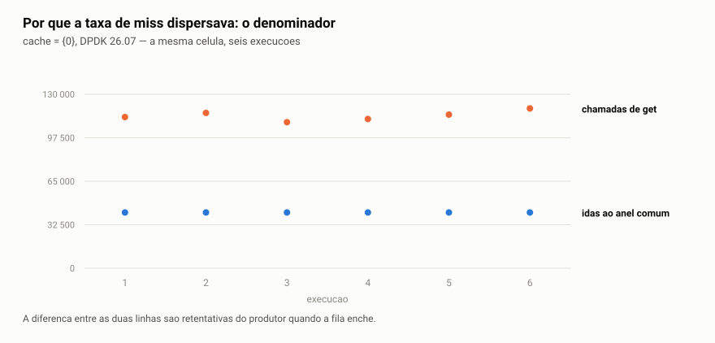
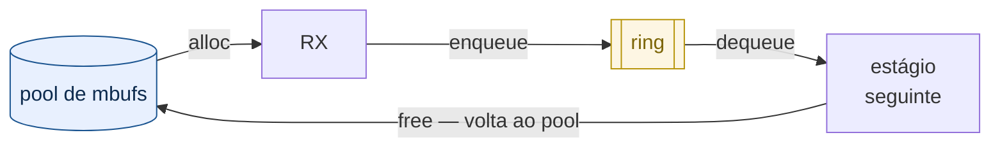

# Mempool, ring e mbuf — o modelo de dados do DPDK

<!-- cita-retratado: 0,227 0.227 14,2 14.2 0,437 0.437 -->
<!-- Estes valores foram retratados noutros pontos do material e
     reaparecem aqui como MEDICAO NOVA da coleta de modo texto. A
     coincidencia e numerica, nao de grandeza: `0,227` e o minimo da
     faixa do `atomic relaxed`, `14,2` e a resolucao do instrumento do
     custo-anel e `0,437` e o mempool bulk no lote 128. -->


*Read this in [English](README.en.md).*

> **Nível 4** do [plano de estudo](../plano-estudo-dpdk.md) ·
> Pré-requisitos: [02 — Runtime do DPDK](../02-runtime-dpdk/README.md) e o tópico
> prático [02 — Mempool, ring e lote](../../trilha/01-fundamentos/02-mempool-ring/)

O [módulo de runtime](../02-runtime-dpdk/README.md) mostrou a EAL reservando
memória e nomeando regiões. Este trata do que se coloca dentro dela: as três
estruturas sobre as quais todo programa DPDK é construído, e que respondem a três
perguntas diferentes.

| Estrutura | Pergunta que responde |
|---|---|
| [`rte_mempool`][guiamempool] | de onde vem um objeto, sem alocar no caminho quente |
| [`rte_mbuf`][guiambuf] | como um pacote é representado |
| [`rte_ring`][guiaring] | como um objeto passa de um estágio para outro |

O [tópico prático](../../trilha/01-fundamentos/02-mempool-ring/) já exercita as
três e mede o efeito do lote. Este módulo faz o que o tópico não faz: **abre as
estruturas**, mede o custo de cada operação, e trata o `rte_mbuf`, que até aqui
só foi prometido.

## Ao final deste módulo, você será capaz de

1. **justificar o mempool com números**, e não com o folclore de que `malloc()`
   custa dezenas de nanossegundos;
2. **dimensionar o cache por lcore** sabendo que sem ele o mempool perde para a
   biblioteca padrão;
3. **prever o efeito do lote** em cada estrutura — e que ele muda de sinal entre
   mempool e `malloc`;
4. **manipular um `rte_mbuf` sem corromper o pacote**, distinguindo `buf_len`,
   `data_off`, `data_len` e `pkt_len`;
5. **escrever código que trata pacote segmentado**, e explicar por que testar com
   quadro de 64 bytes nunca revela o defeito;
6. **escolher entre `_bulk` e `_burst`** pelo contrato, não pelo desempenho, e
   tratar o retorno parcial;
7. **decidir entre SP/SC e MP/MC** sabendo que o custo existe mesmo sem disputa,
   e que o lote o dilui.

## Índice

1. [Por que não usar `malloc()` — a resposta medida](#1-por-que-não-usar-malloc--a-resposta-medida)
2. [O mbuf: quatro números que parecem redundantes](#2-o-mbuf-quatro-números-que-parecem-redundantes)
3. [O anel: o preço da generalidade](#3-o-anel-o-preço-da-generalidade)
4. [As três juntas: o ciclo de vida de um pacote](#4-as-três-juntas-o-ciclo-de-vida-de-um-pacote)
5. [Validação: reproduza na sua máquina](#5-validação-reproduza-na-sua-máquina)
6. [Quando dá errado](#6-quando-dá-errado)
7. [Limitações deste documento](#7-limitações-deste-documento)
8. [Referências externas](#8-referências-externas)
9. [Navegação](#9-navegação)

---

## 1. Por que não usar `malloc()` — a resposta medida

O tópico prático abre com a afirmação de que `malloc()` "pode tomar dezenas de
nanossegundos". É a justificativa de existir do mempool, e circula em quase todo
material de DPDK. Vale medir, porque o resultado **não é o que a afirmação
sugere**.

O programa [`medicoes/custo-alocacao.c`](medicoes/custo-alocacao.c) compara os
dois na mesma máquina, com a mesma metodologia dos demais programas do projeto.

```
  --- one object at a time, in NANOSECONDS PER OBJECT ---

  measurement                           median  p25-p75 (IQR)   range min-max      disp    CV
  ---------------------------------- ---------  --------------- ----------------- ----- -----
  malloc/free                             2.18  2.17-2.19       2.15-2.19           0.7%   0.6%
  mempool get/put, with cache             1.28  1.28-1.28       1.27-1.28           0.1%   0.2%
  mempool get/put, NO cache              10.45  10.45-10.48     10.44-10.55         0.3%   0.3%
```

```
  frequency of core 0 during the measurement: 5.59 -> 5.56 GHz
  ratios, which do NOT depend on frequency:
    mempool with cache is 2.11x faster than malloc
    the per-lcore cache is worth 10.1x (with cache against without)
    without the cache, the mempool is 4.8x SLOWER than malloc
```

> **Por que o programa publica razões, e não só nanossegundos.** Sem fixar a
> frequência do processador — e este projeto não a fixa, como suas
> [limitações](../00-visao-geral/README.md#5-o-ambiente-de-medição) declaram —,
> os valores absolutos mudam entre execuções: o mesmo binário deu 2,19 ns e
> 2,77 ns para o `malloc`, conforme o turbo engatasse. As **razões** ficaram
> idênticas (2,23× nas duas). É por isso que este módulo afirma "duas vezes mais
> rápido" e não "1,25 nanossegundos": a razão é a afirmação; o nanossegundo é
> circunstância.

**`malloc()` custa 2,18 ns, não dezenas.** Alocar e liberar repetidamente um
objeto do mesmo tamanho é o caso em que a glibc é boa: o alocador tem um cache
por thread — o [tcache][tcache] —, e o par cai nele. A afirmação corrente superestima o adversário — e
uma justificativa que superestima o adversário é frágil, porque desmorona quando
alguém mede.

O mempool ganha, mas por **2,2 vezes**, não por ordem de grandeza. E a terceira
linha explica de onde vem o ganho.

### 1.1 O cache por lcore é quase todo o ganho

Um mempool tem duas camadas ([guia do mempool][guiamempool]): um anel comum,
compartilhado, e um **cache por lcore** que serve de amortecedor. Criando o mesmo pool com `cache_size = 0`, a
operação passa de **1,28 ns para 10,45 ns** — oito vezes mais cara, e quase cinco
vezes mais cara que o `malloc()`.

A leitura importa mais que o número: **sem o cache por lcore, o mempool perde
para a biblioteca padrão.** O que ele oferece não é uma estrutura de dados
mágica; é a mesma ideia da glibc — um cache por thread — dimensionada para o
plano de dados e livre de sincronização por não haver thread migrando entre
lcores. Quem cria mempool com cache zero "para simplificar" está desligando
justamente aquilo pelo qual escolheu o mempool.

### 1.2 Quatro regras de dimensionamento, três delas silenciosas

Criar um mempool exige escolher `n` (quantos objetos) e `cache_size`. A
documentação de `rte_mempool_create` declara quatro restrições sobre esse par, e
**três falham em silêncio** — o pool é criado, funciona, e desperdiça:

| Regra, como a documentação a enuncia | O que acontece se violada |
|---|---|
| *"the optimum size (in terms of memory usage) is when n is a power of two minus one"* | desperdício de memória |
| `cache_size` ≤ `RTE_MEMPOOL_CACHE_MAX_SIZE` (512 no 25.11) | **criação falha** |
| `cache_size` ≤ `n / 1.5` | **criação falha** |
| *"choose cache_size to have n modulo cache_size == 0"* | *"some elements will always stay in the pool and will never be used"* |

A quarta é a mais fácil de violar sem perceber — e o programa de medição deste
próprio módulo a violava. Ele usava `n = 4095` com `cache_size = 256`: os dois
limites passam, `n` está na forma ótima, e ainda assim **255 objetos ficavam
inalcançáveis**, porque 4095 % 256 = 255.

A correção não foi trocar 256 por outro número escolhido a olho. As regras viraram
código puro em [`medicoes/sizing.c`](medicoes/sizing.c), testado
sem EAL, e o programa passou a **derivar** o cache:

```
  cache per lcore ........ 455 objects (derived, not eyeballed)
    chosen ............... no caveats
    the obvious (256) .... n is not a multiple of the cache (objects pinned) -> 255 objects pinned
```

> Repare que 455 não é um número que ocorreria a ninguém. Ele é o maior divisor
> de 4095 que cabe no teto de 512 — e é essa aritmética, não a intuição, que
> satisfaz as quatro regras ao mesmo tempo.

### 1.3 O lote muda de sinal entre os dois

Este é o resultado principal da seção, e não aparece em nenhuma comparação
publicada:

```
  --- in BATCH, ns per object: the two sides move in opposite directions ---

  batch         malloc/free   mempool bulk      ratio
  -----         -----------   ------------      -----
  1                 2.75 ns       1.839 ns       1.5x
  8                 2.28 ns       0.634 ns       3.6x
  32               12.53 ns       0.467 ns      26.8x
  128              19.67 ns       0.437 ns      45.0x
```

Pedir mais objetos de uma vez **barateia** cada objeto no mempool (1,84 → 0,44 ns)
e **encarece** no `malloc` (2,75 → 19,67 ns). A razão entre os dois vai de 1,5×
para 45,0×.

Isso é decisivo porque o plano de dados **é** processamento em lote. A
[§3 do tópico prático](../../trilha/01-fundamentos/02-mempool-ring/README.md)
mediu que o lote é o que amortiza o custo de atravessar núcleos; aqui se vê que
ele também é o que separa as duas abordagens. Comparar mempool e `malloc` objeto
a objeto — que é como a comparação costuma ser feita — mede justamente o regime
em que a diferença é menor.

> **Por que o `malloc` piora com o lote.** O mecanismo está dentro do alocador da
> glibc, e este documento **não o investiga**: afirmar sem verificar é o que ele
> está corrigindo. O que se sustenta é a observação — o degrau aparece entre 16 e
> 32 objetos vivos simultâneos — e a consequência de engenharia.

> **Uma armadilha de medição que muda o resultado.** A glibc tem um caminho
> rápido enquanto o processo tem uma thread só (`__libc_single_threaded`). Medir
> `malloc` num programa mono-thread produz um número que não existe em servidor
> algum. O programa mantém uma thread de ruído viva, **fixada num núcleo físico
> distinto**, pelo mesmo motivo que os fundamentos passaram a fazê-lo depois de
> descartar uma medição inválida. Sem fixá-la, a medição saiu bimodal: p25 de
> 10,5 ns contra p75 de 25,4 ns na mesma medição.

---

### 1.4 Quando o modelo de execução muda o dimensionamento

O DPDK 26.07 alterou o algoritmo de recarga e descarga do cache do mempool. A
nota de versão declara duas coisas: o campo `flushthresh` ficou obsoleto, e o
tamanho **efetivo** do cache passou a corresponder ao solicitado — antes era
cerca de 50% maior. A orientação que acompanha a mudança é que, em aplicações
onde um lcore só obtém e outro só devolve, convém **dobrar** o cache
configurado.

A pergunta que este experimento faz não é "o 26.07 ficou mais rápido". É:

> A mudança altera a relação entre `cache_size` e desempenho de forma
> **diferente** conforme o modelo de execução?

#### O desenho

O [`pipeline_ring`](../../trilha/01-fundamentos/02-mempool-ring/pipeline_ring.c)
já implementa as duas topologias sem alteração: com `-l 0`, produtor e consumidor
se alternam no mesmo lcore e as duas operações incidem sobre o mesmo cache; com
`-l 0,2`, um lcore só faz `get` e o outro só faz `put`.

| Elemento | Valor |
|---|---|
| fatorial | 2 versões × 2 topologias |
| varredura interna | `cache_size` ∈ {16, 24, 32, 48, 64, 96, 128, 256, 512} |
| controle | `cache_size` = 0, que **desliga** o cache em vez de dimensioná-lo |
| repetições | 6 por célula, 240 execuções |
| métrica | taxa de miss do cache, contador da biblioteca |

**A coleta é intercalada**, e isso é condição de validade, não estilo: as duas
versões de uma mesma célula correm adjacentes e a ordem das células é permutada
a cada repetição. Braços em blocos confundem o efeito com deriva de estado da
máquina — foi assim que, numa campanha anterior deste mesmo estudo, uma
diferença de 0,70 ns por pacote virou 0,15 ns ao ser reproduzida intercalada.

**A métrica é contador da biblioteca**, não evento de hardware: não depende do
PMU, que nesta máquina está bloqueado. Ela conta as vezes em que o cache por
lcore não tinha objetos e foi preciso ir ao anel comum.

#### A métrica: por que não é "taxa de miss"

A grandeza natural seria a fração de chamadas de `get` que foram ao anel comum.
Ela é instável, e a instabilidade **não vem do cache**.

O produtor, quando a fila enche, devolve ao pool os objetos que não couberam e
**tenta de novo** — cada retentativa é mais uma chamada de `get`. Em
`cache_size` = 96, das 111 523 chamadas de uma execução, **49 023 são
retentativas** (o contador de `put` do produtor marca exatamente esse número).
O denominador, portanto, mede a corrida entre os dois lcores.

<picture>
  <source media="(prefers-color-scheme: dark)" srcset="imagens/1-contaminacao-escuro.svg">
  
</picture>

O numerador não varia. A grandeza publicada aqui é, por isso, **idas ao anel
comum por milhão de pacotes entregues** — que é o que o cache decide, e nada
mais.

#### Topologia simétrica: o cache serve tudo, ou não serve nada

Com `-l 0` o mesmo lcore obtém e devolve, e os `put` reabastecem o cache que os
`get` drenam. O resultado não tem meio-termo:

| `cache_size` | 25.11 | 26.07 |
|---:|---:|---:|
| 0 e 16 | 31 314 | 31 314 |
| **24** | **0,5** | **31 314** |
| 32 a 512 | 0,5 | 0,5 |

O valor 0,5 por milhão significa **uma** ida ao anel comum em toda a execução: a
do preenchimento inicial. O 31 314 significa que toda operação foi ao anel.

O lote é de 32 objetos. No 26.07 o cache precisa **caber o lote** para que o
`put` o deposite ali — com 24, `len + 32 > 24` e os objetos vão direto ao anel,
e o `get` seguinte encontra o cache vazio. No 25.11 o limite do `put` não é o
tamanho, é o `flushthresh`, que vale **1,5 × tamanho**: com 24 configurados, 36
utilizáveis, e o lote de 32 cabe.

É a mesma diferença de 50% que a nota de versão declara, agora localizada no
ponto em que ela muda o desfecho.

> **A fronteira está delimitada, não fixada.** A varredura tem 16 e 24, e o
> ponto de virada do 25.11 cai entre eles — `32 / 1,5 ≈ 21,3`. Fixá-lo exigiria
> passo mais fino, que este experimento não tem.

#### Topologia assimétrica: o custo é aritmética

Com `-l 0,2` o produtor só obtém e o consumidor só devolve; o cache do produtor
não é reabastecido pelos `put` dele. Aqui a contagem obedece ao tamanho da
recarga, e nada mais:

| `cache_size` | 25.11 | 26.07 | razão medida | razão prevista |
|---:|---:|---:|---:|---:|
| 64 | 10 417 | 31 250 | 3,000 | 3,000 |
| 96 | 7 813 | 20 834 | 2,667 | 2,667 |
| 128 | 6 250 | 15 625 | 2,500 | 2,500 |
| 256 | 3 472 | 7 813 | 2,250 | 2,250 |
| 512 | 1 838 | 3 906 | 2,125 | 2,125 |

<picture>
  <source media="(prefers-color-scheme: dark)" srcset="imagens/1-lei-escuro.svg">
  
</picture>

**As seis execuções de cada célula dão o mesmo valor** — os pontos do gráfico
são seis medições sobrepostas. Isso não é medição precisa; é medição de algo
determinístico.

E a previsão não vem de ajuste: vem do fonte. Cada ida ao anel traz uma recarga,
e o tamanho dela difere entre as versões:

```
25.11:  recarga = cache_size + lote     ->  idas = pacotes / (cache_size + 32)
26.07:  recarga = cache_size / 2        ->  idas = pacotes / (cache_size / 2)

razao 26.07 / 25.11 = 2 x (cache_size + 32) / cache_size
```

Medido contra previsto, as cinco razões batem na terceira casa decimal.

#### As três hipóteses, e o que aconteceu com cada uma

As hipóteses foram registradas **antes** da coleta. Reportar apenas as
confirmadas anularia a razão de registrá-las.

| Hipótese | Enunciado | Desfecho |
|---|---|---|
| 1 | em workload assimétrico, `cache_size = N` no 26.07 custará mais que no 25.11 | **confirmada**, e a razão é calculável |
| 2 | `cache_size = 2N` no 26.07 recupera o comportamento do 25.11 | **refutada**, e o resíduo é calculável |
| 3 | em workload simétrico o efeito será menor ou ausente | **refutada pelo detalhe** |

**A segunda é a que contraria a orientação do upstream**, e agora sem recorrer a
medição: dobrar o cache leva a recarga do 26.07 de `N/2` para `N`, contra
`N + 32` do 25.11 no valor original. A razão remanescente é `(N + 32) / N` —
**nunca 1**. Para `N = 32`, exatamente o dobro de idas ao anel. A orientação não
é falsa; ela é insuficiente, e dá para dizer por quanto.

**A terceira foi refutada de um jeito mais interessante do que se confirmada
fosse.** O efeito no caso simétrico não é "menor": é **ausente em toda a faixa e
total num ponto**. Uma conclusão de que "no simétrico não muda nada" seria
verdadeira em nove medições de dez e faria o leitor escolher `cache_size` = 24
sem saber que atravessou uma fronteira.

#### Onde a contagem varia, e por quê

Três células fogem da lei: `26.07` com `cache_size` = 24, e `25.11` com 32 e 48.
Nelas a contagem de idas ao anel muda entre execuções. A causa é identificável
sem medição nova, e ela **não é ruído**.

**A condição.** O produtor devolve ao pool o que não coube na fila. Se o cache
dele absorver essa devolução, nada disso chega ao anel comum. Se não absorver, a
devolução vira tráfego. O fonte diz quando cada versão absorve:

| | regra do `put` | absorve a devolução se |
|---|---|---|
| 25.11 | `len + n ≤ flushthresh`, com `flushthresh = 1,5 × size` e `len = size` após a recarga | `size + n ≤ 1,5 size`, ou seja **`size ≥ 2n`** |
| 26.07 | `len + n ≤ size` | **`size ≥ n`** |

Com o lote em 32, a previsão é que o 25.11 absorva a partir de 64 e o 26.07 a
partir de 32. **Confere nas dezesseis células**, incluindo as que a lei da seção
anterior descreve: onde a previsão diz "absorve", o contador de devoluções ao
anel é literalmente constante nas seis execuções; onde diz que não, ele varia.

**O que varia é volume de vaivém, não trabalho.** Cada retentativa empurra
objetos ao anel e puxa a mesma quantidade de volta. Os dois contadores sobem
juntos, sob uma restrição linear cujos coeficientes são os tamanhos de recarga e
de descarga lidos do fonte:

```
tamanho_recarga x idas  -  tamanho_descarga x voltas  =  constante
```

| célula | recarga | descarga | objetos líquidos, seis execuções |
|---|---:|---:|---|
| `25.11`, `c=48` | 80 | 40 | **2 336 200** nas seis |
| `26.07`, `c=24` | 32 | 32 | **700 872** nas seis |
| `25.11`, `c=32` | 64 | 32 | 1 869 024, com uma execução em 1 868 992 |

A variação do líquido é **zero** em duas células e **32 objetos em 1,87 milhão**
— uma única operação — na terceira. As idas variam em até 50%; o que elas
carregam, não.

> **A leitura que isso permite.** Nessas células o cache não deixa de funcionar:
> ele deixa de **isolar**. O anel comum passa a ver o vaivém entre produtor e
> consumidor, que é uma propriedade da corrida entre os dois lcores e não do
> mempool. A grandeza que o cache governa — objetos líquidos retirados do anel —
> permanece invariante.

#### Por que a contagem de retentativas varia tanto

Ela varia muito — de 25 mil a 139 mil na mesma célula — e a razão é estrutural,
não acidental.

**O sistema não tem meio-termo.** O anel enche quando o produtor supera o
consumidor. Se ele for marginalmente mais rápido, o anel satura e **todo**
enfileiramento passa a ser parcial; se for marginalmente mais lento, o anel
drena e não há retentativa alguma. Uma diferença pequena de velocidade entre os
dois lcores produz uma diferença enorme na contagem, e é isso que se observa.

Aumentar a profundidade do anel não resolve: com o produtor mais rápido,
qualquer profundidade satura — só demora mais.

**O que converte essa corrida em tráfego de mempool é o padrão da aplicação.**
No enfileiramento parcial o produtor devolve ao pool o que não coube, e na volta
do laço pede tudo de novo. Sem isso, a corrida continuaria existindo e não
tocaria o pool.

> **Isso é escolha de projeto, não defeito — e provavelmente a escolha certa.**
> Um plano de dados que não consegue transmitir normalmente libera o buffer de
> volta ao pool; segurar exigiria estado entre iterações e uma política para o
> objeto que nunca couber. O programa aqui faz o que a §6 ensina: devolver a
> posse quando não se pode publicar.
>
> Trocar o padrão deixaria a contagem determinística e mediria **outro
> programa**, com menos semelhança com o que se escreve em produção. Por isso
> fica como está, declarado em vez de corrigido.

**O que o padrão custa, medido.** Cada retentativa refaz o `packet_fill` do lote
inteiro. Na execução de 139 044 retentativas, isso são **4,45 milhões** de
preenchimentos além dos 2 milhões verdadeiros — mais que o triplo do trabalho
útil. Quem dimensiona um pipeline assim paga isso em CPU sem que apareça em
nenhuma taxa de miss.

**O que não foi possível decidir.** Frequência era o candidato ambiental óbvio,
e o instrumento disponível não a decide: o programa reporta **uma** amostra, de
**um** lcore, ao final da execução, quando o que importa é a velocidade relativa
dos dois ao longo dela. Na célula de maior espalhamento a direção bate com a
expectativa — produtor mais rápido, mais retentativas —, mas nas outras não há
ordem, e uma amostra final não representa uma execução em que o governor se
move.

#### A réplica em outro hardware, e a fronteira que ela revela

A campanha foi repetida em 23/09/2026 com uma única diferença: a máquina passou
de um pente de memória para dois, de canal único para canal duplo. Mesmo
kernel, mesmos binários, mesmo protocolo de 240 execuções.

Nada nessa troca tem relação com o mempool. É por isso que ela serve de teste.

**Na topologia simétrica, as vinte células saem idênticas** — os mesmos 31 314
e os mesmos 0,5 por milhão, inclusive a fronteira do `cache_size` = 24 que
separa as duas versões.

Na assimétrica, o resultado se divide, e não se divide em qualquer lugar:

| | idênticas entre as duas máquinas | variam entre as duas máquinas |
|---|---|---|
| **25.11** | `cache_size` ≥ **64** | `cache_size` < 64 |
| **26.07** | `cache_size` ≥ **32** | `cache_size` < 32 |

Esses dois números não foram escolhidos para a tabela. São **exatamente** os
limiares de absorção que a subseção anterior deriva do fonte: `size ≥ 2n` para
o 25.11 e `size ≥ n` para o 26.07, com o lote `n` = 32.

**A previsão que isso testou.** Se a lei está certa, uma célula que absorve a
devolução do produtor não deixa o vaivém chegar ao anel comum — e então sua
contagem depende só da aritmética da recarga, que é propriedade do código.
Célula que não absorve expõe a corrida entre os dois lcores, e a corrida é
propriedade da **máquina**. Logo: trocar a máquina deve mover as células de
baixo e não tocar nas de cima.

É o que se mediu. Acima do limiar as contagens são iguais **dígito a dígito**
nas duas máquinas; abaixo dele, movem-se de 2% a 4%.

**A réplica ainda corrigiu uma célula.** Na coleta de canal único, `25.11` com
`cache_size` = 24 saiu constante nas seis execuções, e a lei prevê que ela
**varie** — 24 está abaixo de 64. Na coleta de canal duplo ela varia, por uma
única contagem em 62 500. A primeira campanha não errou; ela não tinha execuções
suficientes para ver um evento raro. O que a lei previa e a primeira coleta não
mostrou, a segunda mostrou.

> **Por que este é um teste melhor do que repetir a campanha.** Repetir na mesma
> máquina distingue medição estável de medição ruidosa, e nada mais. Mudar o
> hardware separa duas coisas que a primeira campanha só podia **argumentar**
> que eram distintas: o que o código determina e o que a corrida entre lcores
> determina. A fronteira entre as duas aparece sozinha, no lugar previsto, a
> partir de uma variável que ninguém escolheu por conveniência.

A coleta está em
[`../../trilha/03-performance/03-isolamento-cpu/historico/2026-09-24-1917-expo6000-canal-duplo/mempool-cache/`](../../trilha/03-performance/03-isolamento-cpu/historico/2026-09-24-1917-expo6000-canal-duplo/mempool-cache/),
com as saídas brutas. Ela vem da campanha de 24/09 em modo texto: as coletas
anteriores, feitas com sessão gráfica ativa, foram retiradas do projeto.

#### O elo entre a contagem e o tempo, medido

A subseção anterior mede **idas ao anel comum**, e a afirmação do upstream é
sobre taxa de miss. Nenhuma das duas é tempo. A ligação entre elas — se mais
idas custam mais, e quanto — exigia um par de prefixos construído **sem**
`RTE_LIBRTE_MEMPOOL_STATS`, porque o contador daquela macro é atualizado no
caminho quente e o binário instrumentado não é o de produção.

Os prefixos sem o contador foram construídos, e a coleta correu em **modo
texto**, sem sessão gráfica, pela razão documentada no
[tópico de isolamento de CPU](../../trilha/03-performance/03-isolamento-cpu/README.md#666-intervenção-coleta-sem-sessão-gráfica):
a grandeza de interesse aqui é da ordem de décimos de nanossegundo por pacote, e
o ruído da sessão gráfica é maior que ela.

| Elemento | Valor |
|---|---|
| prefixos | 25.11 e 26.07 **sem** `RTE_LIBRTE_MEMPOOL_STATS` |
| repetições | 21 por célula |
| métrica | nanossegundos por pacote, dos três inteiros de `DPDK_ACADEMY_BRUTO` |
| ambiente | `multi-user.target`, sem gerenciador de display |

##### O controle: mesmas viagens, versões diferentes

A topologia simétrica com `cache_size` ≥ 32 é um controle exato, e não por
construção deste experimento: as duas versões fazem ali **a mesma** viagem
única de preenchimento inicial — 0,5 por milhão de pacotes, o valor da tabela
anterior. Se o tempo diferir, a diferença não pode ser das viagens.

```
  cache   25.11    26.07    delta
  -----  ------   ------   ------
     32   2.350    2.527   +0.177
     48   2.350    2.526   +0.176
     64   2.349    2.525   +0.176
     96   2.352    2.527   +0.175
    128   2.349    2.525   +0.176
    256   2.349    2.528   +0.179
    512   2.349    2.527   +0.178

  mediana do delta: +0.176 ns/pacote   amplitude: 0.004 ns
```

O 26.07 custa **0,176 ns a mais por pacote** que o 25.11 com o mesmo número de
viagens. As sete células concordam dentro de quatro picossegundos — amplitude
menor que a última casa que o programa publica. É diferença de versão, medida
com as viagens mantidas constantes.

##### O custo de uma viagem

Na topologia assimétrica as viagens variam por duas ordens de grandeza, e o
tempo acompanha. Ajustando tempo contra viagens por pacote, com cada versão
restrita às células **acima do seu próprio limiar de absorção** — 64 para o
25.11, 32 para o 26.07, os limiares que a subseção anterior deriva do fonte:

```
  25.11:  ns/pacote = 3.723 + 82.9 x viagens/pacote    R2 = 0.869   n = 5
  26.07:  ns/pacote = 3.920 + 37.4 x viagens/pacote    R2 = 0.710   n = 7
```

O coeficiente angular tem unidade de **nanossegundos por viagem**: cada ida ao
anel comum custa cerca de 83 ns no 25.11 e 37 ns no 26.07.

A restrição às células acima do limiar não é conveniência. Abaixo dele o
produtor não absorve a própria devolução, e a contagem passa a medir a corrida
entre os dois lcores em vez do que o cache governa — a subseção anterior mostra
que é exatamente ali que as contagens variam entre execuções e entre máquinas.
Ajustar sobre elas mediria a corrida.

##### A leitura: mais viagens não é proporcionalmente pior

As duas retas juntas respondem a pergunta que a contagem sozinha não responde.
O 26.07 faz **duas a três vezes mais** viagens que o 25.11 no mesmo
`cache_size` — é a lei da subseção anterior, e ela não mudou. Mas cada viagem
dele custa **menos da metade**.

A razão entre os coeficientes é 2,2. A razão entre os tamanhos de recarga que o
fonte prevê para as células ajustadas vai de 2,1 a 3,0, conforme o
`cache_size`. As duas são compatíveis, e a leitura que isso sugere é que o
custo de uma viagem é dominado por **quantos objetos ela move**, não pelo fato
de ela acontecer. O ajuste não isola essa relação — o tamanho da recarga varia
dentro de cada reta —, de modo que ela fica como leitura compatível, não como
medição.

##### O que este ajuste não sustenta

O `R²` do 26.07 é 0,710, e a causa está nos dados: três células com
`cache_size` 32, 48 e 64 fazem **exatamente** 31 250 viagens e medem 4,888,
4,891 e 5,160 ns por pacote. O espalhamento a viagens idênticas é de 0,27 ns —
maior que o efeito de versão que o controle isola.

Existe, portanto, uma segunda fonte de variação na topologia assimétrica que as
viagens não explicam. O controle simétrico não a vê, porque ali as viagens são
uma só e o sistema não tem corrida. A hipótese natural é a mesma corrida entre
lcores que governa as retentativas, cuja contagem a subseção anterior mostra
variar de 25 mil a 139 mil na mesma célula; confirmá-la exigiria instrumentar
a velocidade relativa dos dois lcores ao longo da execução, o que o programa
atual não faz.

#### O que este experimento não autoriza

- **A medida de tempo existe, e cobre menos que a contagem.** O bloqueio era
  duplo e os dois caíram. O primeiro era do build: os dois DPDK foram
  construídos com `RTE_LIBRTE_MEMPOOL_STATS`, cujo contador é atualizado no
  caminho quente, então o programa medido não era o de produção. **Os prefixos
  sem o contador foram construídos**, e a seção anterior traz o resultado. O
  que ele cobre é a topologia assimétrica acima dos limiares de absorção e o
  controle simétrico; abaixo dos limiares o tempo mede a corrida entre lcores,
  e nessa faixa não há afirmação.

  O segundo era do instrumento — o `pipeline_ring` imprimia o tempo com `%.1f`,
  o que sobre ~5 ns por pacote quantiza em 2%, ordem de grandeza das diferenças
  que haveria para detectar. **Este já caiu:** com a variável de ambiente
  `DPDK_ACADEMY_BRUTO` o programa emite os três inteiros de onde a média sai,
  sem arredondamento nenhum.

  ```
  raw timing: cycles=1590116 tsc_hz=4391800000 packets=200000
  ```

  A casa decimal continua sendo **uma** na linha publicada, e de propósito:
  sobre ~5 ns, mais casas afirmariam uma precisão que uma execução não sustenta.
  Emitir os ingredientes em vez de mais dígitos resolve os dois lados — quem
  analisa deriva a precisão que os dados sustentarem, e nenhuma é afirmada pelo
  programa. Sem a variável a saída não muda um byte, e os blocos publicados que
  a reproduzem continuam valendo.

  O que falta para medir o elo é, portanto, **só** o par de prefixos sem
  `RTE_LIBRTE_MEMPOOL_STATS`. A afirmação do upstream é sobre taxa de miss, e é
  a ela que este experimento responde — nem mais, nem menos.
- **O workload é um pipeline de dois estágios com um anel.** Aplicações reais
  têm mais estágios e mais anéis, e a orientação do upstream pode ser suficiente
  em topologias que este programa não representa.
- **Os dois braços são builds próprios**, com os drivers restritos ao mínimo
  do estudo (`bus_pci`, `bus_vdev`, `mempool_ring`), e não o pacote da
  distribuição usado no histórico anterior. Esta é campanha nova, não
  continuação. O [`scripts/preparar-dpdk.sh`](../../scripts/preparar-dpdk.sh)
  reproduz essa configuração com `--minimo`; sem a opção ele constrói o
  conjunto completo de drivers, que serve para outros estudos e **não** é o
  prefixo que gerou esta tabela.

> **A equivalência entre os dois braços foi conferida, não presumida.**
> `RTE_MEMPOOL_CACHE_MAX_SIZE` (512) e `RTE_MBUF_DEFAULT_MEMPOOL_OPS`
> (`ring_mp_mc`) são iguais nos dois; o conjunto de drivers é idêntico; e o
> `pipeline_ring` foi compilado com as mesmas flags (`-O2 -march=native`) contra
> os dois prefixos.
>
> Há um argumento mais forte que a conferência: o contador do miss é
> incrementado em `rte_mempool_ops_dequeue_bulk`, que é `static inline` no
> cabeçalho — ele não tem símbolo na `librte_mempool.so` e é compilado **dentro
> do programa**, com as flags do projeto. **O tipo de build da biblioteca não
> pode afetar a contagem.** Ele afetaria o custo do caminho de falta, ou seja
> tempo — que é mais uma razão para a coluna de tempo estar fora.

A coleta está em
[`../../trilha/03-performance/03-isolamento-cpu/historico/2026-09-24-1917-expo6000-canal-duplo/mempool-cache/`](../../trilha/03-performance/03-isolamento-cpu/historico/2026-09-24-1917-expo6000-canal-duplo/mempool-cache/),
com a saída bruta de cada execução e a procedência que o programa imprime —
versão do DPDK, commit, host, compilador e data.

---

## 2. O mbuf: quatro números que parecem redundantes

O [`rte_mbuf`][guiambuf] é a estrutura que carrega um pacote. Ela foi prometida
pelo tópico prático e adiada; é aqui que aparece.

A dificuldade não está na API, está em quatro campos que parecem dizer a mesma
coisa: `buf_len`, `data_off`, `data_len` e `pkt_len`. Confundi-los produz
**corrupção silenciosa** — o pacote sai com bytes a mais, a menos, ou com lixo no
começo, e nada acusa erro.

O programa [`medicoes/anatomia-mbuf.c`](medicoes/anatomia-mbuf.c) não descreve o
layout: imprime o da versão instalada.

```
  sizeof(struct rte_mbuf) ..... 128 bytes (2 cache lines of 64 B)
  RTE_PKTMBUF_HEADROOM ........ 128 bytes reserved BEFORE the data
  RTE_MBUF_DEFAULT_DATAROOM ... 2048 bytes for the packet
  RTE_MBUF_DEFAULT_BUF_SIZE ... 2176 bytes (dataroom + headroom)
  element (mbuf + buffer) ..... 2304 bytes
  + mempool header ............ 64 bytes
  = object in the pool ........ 2368 bytes

  A pool of 8192 mbufs takes about 18.5 MiB in objects alone.
```

**O descritor custa 128 bytes por pacote; o objeto inteiro no pool, 2368.** A
decomposição importa: 2304 são do mbuf e do seu buffer, e **64 são do próprio
mempool** — cabeçalho por objeto, que some numa conta feita a olho. Um pool de
8192 mbufs ocupa 18,5 MiB só em objetos, número que decide dimensionamento e que
raramente aparece antes de a memória acabar.

### 2.1 Duas linhas de cache, e a razão de serem duas

```
    campo          offset  linha de cache
    -----          ------  --------------
    buf_addr            0  0
    data_off           16  0
    refcnt             18  0
    nb_segs            20  0
    port               22  0
    pkt_len            36  0
    data_len           40  0
    buf_len            54  0
    pool               56  0
    next               64  1
    tx_offload         72  1
    shinfo             80  1
    priv_size          88  1
    timesync           90  1
    dynfield1          92  1
```

A primeira linha guarda o que o caminho quente lê em **todo** pacote: buffer,
deslocamentos, comprimentos, contador de referência e pool. A segunda guarda
**seis** campos — `next`, `tx_offload`, `shinfo`, `priv_size`, `timesync` e
`dynfield1`.

O `next` é o que o cabeçalho do DPDK nomeia explicitamente, *"next pointer in the
second cache line"*, porque é aquele cuja **ausência** da primeira linha foi
escolha de projeto: ele só tem valor em pacote segmentado, o caso menos comum.

> **E um pacote de um segmento ainda assim toca a segunda linha.** O caminho
> genérico de liberação a lê:
>
> ```c
> /* rte_mbuf.h, rte_pktmbuf_prefree_seg() */
> if (m->next != NULL)
>         m->next = NULL;
> ```
>
> Isso roda em **todo** segmento liberado, segmentado ou não. A economia da
> divisão é no caminho quente de RX/TX, **não** ao longo da vida inteira do
> mbuf: alocação e liberação alcançam a segunda linha de qualquer forma.

A consequência liga direto à [§4.2 dos fundamentos](../01-fundamentos/README.md#42-cache-e-localidade):
a 14,88 milhões de pacotes por segundo, uma linha a mais **no caminho quente** é
largura de banda de cache que não sobra para o pacote em si.

### 2.2 O headroom, e por que ele existe

Os quatro números em movimento, num pacote de 60 bytes encapsulado e depois
desencapsulado:

```
  momento                     buf_len  headroom  data_len   pkt_len  tailroom nb_segs
  --------------------------  -------  --------  --------   -------  --------  ------
  recem-alocado                  2176       128         0         0      2048       1
  append(60) = payload           2176       128        60        60      1988       1
  prepend(14) = ethernet         2176       114        74        74      1988       1
  prepend(20) = tunel            2176        94        94        94      1988       1
  adj(20) = tira o tunel         2176       114        74        74      1988       1
  trim(4) = tira do fim          2176       114        70        70      1992       1
```

Lendo a tabela:

- **`buf_len` nunca muda.** É o tamanho do *buffer*, não do pacote. Quem o usa
  como tamanho do pacote transmite 2176 bytes de lixo.
- **`headroom` encolhe a cada [`rte_pktmbuf_prepend()`][apiprepend]** e cresce a
  cada `adj()`. É o espaço reservado **antes** dos dados, e existe exatamente
  para que encapsular seja escrever num espaço já reservado — não copiar o pacote
  inteiro para abrir lugar. Um túnel, um cabeçalho VLAN, uma etiqueta MPLS: todos
  vivem do headroom.
- **`tailroom` faz o oposto**, no fim do buffer.
- **`data_len` e `pkt_len` andam juntos** — enquanto houver um segmento só.

### 2.3 Segmentação: onde os dois números se separam

```
  momento                     buf_len  headroom  data_len   pkt_len  tailroom nb_segs
  --------------------------  -------  --------  --------   -------  --------  ------
  cabeca da cadeia               2176       114        70       170      1992       2
  segundo segmento               2176         -       100         -         -       -
```

Encadeado um segundo mbuf com [`rte_pktmbuf_chain()`][apichain], `pkt_len` (170)
passa a ser a soma de todos os segmentos, e `data_len` (70) continua sendo só o
que cabe **neste** mbuf.

**É aqui que mais código quebra.** Quem lê `data_len` achando que é o tamanho do
pacote processa apenas o primeiro pedaço — em silêncio, sem erro, e só com
pacotes grandes. Testar com quadros de 64 bytes nunca revela o defeito, porque
pacote pequeno cabe num segmento só.

### 2.4 Posse: quem libera

```
  refcnt do cabeca ............ 1
  objetos livres no pool ...... 1021 de 1023

  apos rte_pktmbuf_free(cabeca):
  objetos livres no pool ...... 1023 de 1023
```

Uma chamada a [`rte_pktmbuf_free()`][apimbuffree] devolveu **os dois** mbufs: ela
percorre a cadeia. Liberar o segundo segmento também, por conta própria,
devolveria o mesmo objeto duas vezes ao pool — e o pool **não reclama**. Ele passa
a entregar o mesmo objeto a dois donos, e o defeito aparece muito depois, longe
da causa.

Isso completa a regra de posse que o tópico prático começou:

| Operação | Quem fica com o objeto |
|---|---|
| `rte_ring_enqueue_burst`, o que **não** coube | você — devolva ao pool |
| `rte_eth_tx_burst`, o que **foi** aceito | o driver — não libere |
| `rte_pktmbuf_free` numa cadeia | a cadeia inteira volta, com uma chamada |

---

## 3. O anel: o preço da generalidade

O tópico prático afirma que o modo MP/MC (vários produtores, vários consumidores)
tem "custo maior por exigir operações atômicas de disputa". Verdadeiro — e a
palavra *disputa* esconde a parte interessante.

O programa [`medicoes/custo-anel.c`](medicoes/custo-anel.c) mede os dois modos
**num lcore só, sem disputa nenhuma**:

```
  batch      SP/SC (ns/obj)   MP/MC (ns/obj) MP/MC cost
  -----      --------------   -------------- -----------
  1                1.636 ns         8.237 ns       404%
  8                0.539 ns         1.283 ns       138%
  32               0.405 ns         0.485 ns        20%
  128              0.372 ns         0.302 ns       -19%
```

**O custo não depende de haver disputa.** Com um produtor só, o modo MP/MC ainda
custa 404% a mais no lote 1 — porque a instrução atômica é executada de qualquer
forma. O que se paga não é a contenção; é a *possibilidade* dela.

E o lote resolve — mais do que resolve. A 128 objetos por chamada a diferença não
apenas desaparece: nesta máquina o MP/MC mede **mais rápido** que o SP/SC, −19%.
A campanha arquivada reproduz a inversão nas **cinco** repetições, entre −17% e
−19%, com a máquina ociosa. Não é ruído de uma coleta só, e os arquivos estão em
[`medicoes/historico/`](medicoes/historico/) para quem quiser conferir. Até o lote 32 o padrão é o esperado — o
lote diluindo um custo fixo, como já apareceu duas vezes neste projeto, seja o de
atravessar núcleos, seja o de uma instrução atômica. No lote 128 esse custo já foi
diluído abaixo da diferença entre os dois caminhos de código do `rte_ring`, e o
que sobra não é mais o preço da generalidade.

> **Esta tabela já publicou "5%" no lote 128, e a prosa concluía que "MP/MC com
> lote grande custa quase o mesmo que SP/SC".** A campanha desta release, em
> hardware a 6000 MT/s, mede −19% em cinco de cinco repetições: o sinal
> inverteu. A conclusão antiga não se sustenta como estava escrita.
>
> **Este projeto não explica a inversão.** Explicá-la exigiria instrumentar
> separadamente os dois caminhos de `rte_ring_enqueue_bulk` e
> `rte_ring_dequeue_bulk`, o que está fora do escopo deste módulo. O que está
> medido é a inversão; a causa fica declarada como limitação, não como
> resultado.

### 3.1 Onde os ciclos são gastos: reservar e publicar

A tabela acima diz *quanto*. Esta seção diz *o quê* — e quem responde é o
código compilado, não a documentação.

O anel é um buffer circular limitado com **dois pares head/tail**, um por lado.
Uma operação acontece em três tempos:

    1. RESERVAR   avança a head do próprio lado, ganhando um intervalo de posições
    2. escrever   os elementos, sem coordenação — o intervalo já é seu
    3. PUBLICAR   avança a tail, tornando visível o que foi escrito

A separação entre reservar e publicar é o que permite a dois produtores
escreverem **ao mesmo tempo** em intervalos distintos. E é dela que nasce a
diferença entre SP e MP.

> **Qual implementação este material descreve.** O `rte_ring_elem_pvt.h`
> escolhe entre duas por `#ifdef RTE_USE_C11_MEM_MODEL`. Neste build o macro
> **não** está definido, então o binário medido usa `rte_ring_generic_pvt.h` —
> barreiras explícitas — e não o caminho C11, que expressa o mesmo algoritmo
> com `memory_order`. Os dois existem e são equivalentes em garantia; o que
> segue descreve o que **esta** máquina executou.

A reserva é literalmente um `if` ([`rte_ring_generic_pvt.h`][ringgen]):

```c
if (is_st) {
    d->head = *new_head;                    /* SP: store comum */
    success = 1;
} else
    success = rte_atomic32_cmpset(          /* MP: CAS de 32 bits */
            (uint32_t *)(uintptr_t)&d->head, ... );
} while (unlikely(success == 0));           /* ...em laço */
```

Com um produtor, avançar a head é **um store comum**. Com vários, é um
*compare-and-swap* num laço: se outro produtor mudou a head entre a leitura e a
escrita, o CAS falha e a volta recomeça — relendo a tail do outro lado e
recalculando quantas posições ainda cabem.

A publicação traz a segunda diferença:

```c
if (enqueue) rte_smp_wmb(); else rte_smp_rmb();
if (!single)
    rte_wait_until_equal_32(&ht->tail, old_val, rte_memory_order_relaxed);
ht->tail = new_val;
```

**A tail avança em ordem.** Se o produtor B reservou depois do A, não pode
publicar antes: a tail é um número só, e publicar fora de ordem tornaria
visível um intervalo ainda em escrita. Então B **espera** a tail alcançar o
ponto onde a reserva dele começa. O caminho SP não executa essa espera.

Repare que `ht->tail = new_val` é um store comum nos dois modos. A ordenação
vem da barreira anterior, não do store — e é isso que permite ao consumidor ler
os **elementos** sem nenhum atômico sobre eles. O custo se concentra nos
índices, não nos dados.

#### Dois vocabulários para o mesmo algoritmo

O caminho genérico usa **barreiras explícitas**; o caminho C11 usa o modelo de
memória do C++ e anota as arestas de sincronização com nome. A correspondência
é o que interessa a quem escreve C ou C++ fora do DPDK:

| genérico (este build) | C11 / [`std::memory_order`][cppmemord] | o que garante |
|---|---|---|
| `rte_smp_wmb()` antes de `ht->tail = v` | `store_explicit(&tail, v, release)` | os elementos ficam visíveis **antes** da tail que os anuncia |
| `rte_smp_rmb()` antes de ler a tail | `load_explicit(&tail, acquire)` | quem vê a tail nova vê também os elementos |
| `rte_atomic32_cmpset` em laço | `compare_exchange_*(..., release, acquire)` | reserva e sincroniza num passo indivisível |

São duas formas de exprimir a mesma ordem de memória: uma por barreira de
processador, outra pelo contrato da linguagem. Conhecer as duas é o que permite
ler código de fila concorrente escrito em qualquer época.

#### O que o binário medido realmente emite

A afirmação de que "o modo MP executa uma instrução atômica" não precisa ficar
em palavra. Desmontando o binário que produziu a tabela da §3:

```bash
objdump -d custo-anel | grep 'lock cmpxchg'
```

Duas das instruções caem exatamente sobre os campos do anel:

```
lock cmpxchg %r10d,0x80(%rdx)     <- head do produtor
lock cmpxchg %ecx,0x100(%rdx)     <- head do consumidor
```

São operandos de **32 bits** (`%r10d`, `%ecx`), coerentes com
`rte_atomic32_cmpset`, e os deslocamentos correspondem às uniões `prod` e
`cons` que a `struct rte_ring` declara **alinhadas a linha de cache** e
separadas por `RTE_CACHE_GUARD` — a mesma defesa contra falso compartilhamento
que a [§4.2.1 dos fundamentos](../01-fundamentos/README.md#421-falso-compartilhamento-o-erro-mais-comum-de-quem-escreve-plano-de-dados)
mede.

#### Por que o atômico custa sem ninguém disputando

Os 404% do lote 1 foram medidos **num lcore só**. Não há segundo produtor, o
CAS nunca falha e o laço roda uma vez.

O que resta é o custo da instrução. O prefixo `f0` que o `objdump` mostra é o
`lock`: ele torna a operação indivisível sobre a linha de cache e ordena
acessos à volta dela, haja ou não concorrente. Um store comum não faz nada
disso.

É o que a frase *"o que se paga não é a contenção; é a possibilidade dela"*
significa, agora com mecanismo embaixo: o código do modo MP é o mesmo com um
produtor ou com doze.

> **O que este material não pode afirmar.** Atribuir os ciclos a eventos
> específicos — tráfego de coerência, custo de barreira, previsão de desvio —
> exigiria contadores de desempenho. Nesta máquina `perf_event_paranoid = 4`
> recusa até `cycles,instructions`. O mecanismo acima **explica de forma
> compatível** o custo observado; não foi medido como causa.

---

### 3.2 Quatro estratégias para o mesmo anel

SP/SC e MP/MC não são o espaço inteiro. A API oferece mais dois modos, e
percorrê-los mantém constante tudo o que um confronto com outro projeto mudaria
de uma vez: mesma estrutura, mesmo contrato de fila, mesma implementação.

| modo | reserva da head | avanço da tail | o que troca |
|---|---|---|---|
| **SP/SC** | store comum | store comum | nenhuma coordenação — exige a invariante 1P/1C |
| **MP/MC** | CAS de 32 bits em laço | cada thread avança a sua | **espera** na tail até a vez chegar |
| **RTS** | CAS de 64 bits (valor + contador) | só a **última** thread avança | troca a espera por um **segundo CAS** |
| **HTS** | CAS de 64 bits com head e tail **juntas** | junto com a head | **serializa**: só avança se `head == tail` |

Os cabeçalhos declaram a troca. O [`rte_ring_rts.h`][ringrts] descreve o
mecanismo com um contador de atualizações em cada lado: a tail só avança quando
`tail.cnt + 1 == head.cnt`, isto é, quando quem termina é o último da fila.
Isso **elimina o spinning** ao preço de dois CAS de 64 bits por operação,
contra um CAS de 32 bits mais espera no MP/MC clássico.

O [`rte_ring_hts.h`][ringhts] vai ao extremo oposto: head e tail viram um único
valor de 64 bits, atualizado por um CAS só, e uma thread só pode mexer na head
quando `head.value == tail.value`. A fila fica **totalmente serializada** — no
máximo uma operação em andamento por lado.

A leitura de engenharia é que não existe "o melhor modo", existe **qual
patologia se quer evitar**:

- o MP/MC clássico sofre quando uma thread é **preemptada entre reservar e
  publicar** — as que vieram depois ficam presas na espera da tail;
- o RTS remove essa espera, e paga com mais tráfego atômico em todas as
  operações, inclusive nas que nunca sofreriam;
- o HTS troca paralelismo por previsibilidade, e é o modo que sustenta a API de
  *peek*, justamente por haver no máximo uma operação em curso.

O `rte_ring.h` avisa que **a implementação não é preemptível** e remete ao
Programmer's Guide. RTS e HTS existem por causa disso: são respostas a cenários
em que a thread pode perder a CPU no meio da operação — o caso de quem roda com
mais threads que núcleos.

#### O mesmo problema fora do DPDK

Vale separar o que é API do que é princípio:

| específico do DPDK | transferível para C/C++ |
|---|---|
| `rte_ring`, `RING_F_SP_ENQ`, `_bulk`/`_burst` | buffer circular limitado; reservar→publicar |
| `rte_atomic32_cmpset`, `rte_smp_wmb` | `std::atomic`, release/acquire, RMW, barreiras |
| RTS, HTS | trocar espera por tráfego atômico; serializar para ganhar previsibilidade |
| `RTE_CACHE_GUARD` entre `prod` e `cons` | separar por linha de cache o que threads diferentes escrevem |

O [Disruptor][disruptor] resolve o mesmo problema por outro caminho:
sequenciadores distintos para um ou vários produtores, coordenação por
**barreiras de sequência** entre consumidores em vez de posse exclusiva, e
estratégias de espera escolhidas pela aplicação. A comparação interessante não
é de velocidade — é notar que ele expõe como escolha o que o `rte_ring` fixa no
modo, e fixa o que o `rte_ring` deixa aberto.

> **Isto é contraponto de design, não competição.** Estruturas com contratos
> diferentes não se comparam por número: o que uma garante, outra não oferece.
> Comparar medições só seria legítimo sob condições equivalentes, e demonstrar
> a equivalência é trabalho **anterior** à medição.

---

### 3.3 O contrafactual: o que custa adotar SP/SC

Medir que SP/SC é mais barato não autoriza usá-lo. A pergunta seguinte é
arquitetural:

    quero SP/SC
         ↓
    que invariante preciso garantir?
         ↓
    exatamente um produtor e um consumidor, por anel
         ↓
    como a arquitetura muda para garantir isso?
         ↓
    um anel por par de participantes, em vez de um anel compartilhado
         ↓
    que complexidade isso introduz?
         ↓
    N×M anéis, roteamento explícito, balanceamento manual,
    e uma invariante que o compilador não verifica
         ↓
    o ganho medido justifica?

A última pergunta não tem resposta geral, e a tabela da §3 mostra por quê: 404%
no lote 1, 22% no lote 32. **Se a aplicação já trabalha em lotes grandes, a
invariante custa caro e rende pouco.** Se processa objeto a objeto, a conta
inverte.

E vale lembrar o que o lote faz e o que não faz. Ele dilui um custo **fixo**
sobre mais objetos — não torna a operação mais rápida. É o mesmo efeito que a
[§4.2 dos fundamentos](../01-fundamentos/README.md#42-cache-e-localidade) mede
na concorrência de acessos: o custo por unidade cai muitas vezes sem que uma
única unidade fique mais rápida.

Há ainda um custo que não aparece em nanossegundo: `RING_F_SP_ENQ` é uma
promessa que o anel não verifica. Quebrá-la não produz erro — produz corrupção
silenciosa, do mesmo tipo que a §3.4 documenta no retorno do `_burst`.

---

A decisão de engenharia que sai daí:

- **Se você sabe que há um produtor e um consumidor, diga.** `RING_F_SP_ENQ` e
  `RING_F_SC_DEQ` não são otimização prematura: são informação que você tem e o
  anel não.
- **Se não sabe, o lote é o antídoto.** MP/MC com lote grande custa o mesmo ou
  menos que SP/SC nesta máquina — a vantagem do SP/SC só existe em lote pequeno.

### 3.4 `_bulk` e `_burst` não são sinônimos

As duas famílias de função diferem no **contrato**, não no desempenho, e a
escolha errada não aparece como lentidão:

```
  anel pedido com 16 posicoes; capacidade real: 15
  (uma posicao fica reservada para distinguir cheio de vazio)

  enfileirados 12 em anel vazio ......... burst aceitou 12, livre=3
  pedindo mais 12 com apenas 3 livres:
    _bulk  aceitou 0  <- tudo ou nada: NADA entrou
    _burst aceitou 3  <- parcial: 3 entraram, 9 ficaram de fora
```

[`rte_ring_enqueue_bulk()`][apienqbulk] devolve, nas palavras da API, *"the number
of objects enqueued, either 0 or n"*. `_burst` aceita parcial e devolve quantos
couberam.

Nenhum dos dois é o certo em abstrato:

| Situação | Família |
|---|---|
| o lote é uma unidade indivisível (fragmentos de um pacote) | `_bulk` |
| cada objeto vale por si, e o que sobrar pode esperar | `_burst` |

O perigo do `_burst` é o retorno: os 9 objetos que não entraram **continuam
sendo seus**. Ignorar esse número é o vazamento clássico que o
[tópico prático](../../trilha/01-fundamentos/02-mempool-ring/README.md) já
documenta — e que, com um pool de 4095 objetos, leva o pipeline a parar em
silêncio.

> Repare também na primeira linha: um anel pedido com 16 posições guarda **15**.
> Uma posição fica reservada para distinguir cheio de vazio. É a mesma razão pela
> qual o tamanho ótimo de um mempool é `2^q - 1`, e não `2^q`.

### 3.5 Quando a ordem de saída importa: `rte_soring`

As quatro estratégias da §3.2 respondem *quem pode entrar ao mesmo tempo*.
Nenhuma responde a pergunta que aparece assim que o processamento vira pipeline
com estágios paralelos: **os estágios terminam fora de ordem — como publicar em
ordem?**

Não é preciosismo. Um feed de *market data* entregue fora de ordem obriga o
consumidor a reordenar; um fluxo TCP remontado fora de ordem não é o fluxo; uma
sequência de transações aplicada fora de ordem é outro banco de dados. Em todos,
o paralelismo é desejável **dentro** do estágio e inaceitável **na saída**.

O [`rte_soring`][apisoring] — *Staged Ordered Ring* — é a estrutura do DPDK para
isso. Ele é um `rte_ring` com **estágios**: além de `enqueue` e `dequeue`, cada
estágio tem um par `acquire`/`release`.

```c
uint32_t ftoken;
n = rte_soring_acquire_bulk(r, objs, stage, num, &ftoken, NULL);
/* posse exclusiva dos n objetos; processar em paralelo com outros lcores */
rte_soring_release(r, objs, stage, n, ftoken);
```

#### O `ftoken` é o mecanismo, e vale entender por quê

`acquire` devolve um **token opaco** que o chamador guarda e devolve em
`release`. Esse token é o que separa *terminar* de *publicar*: ele registra a
posição reservada, de modo que dois lcores possam concluir o trabalho em
qualquer ordem e mesmo assim o estágio seguinte veja os elementos na ordem
original.

É o mesmo protocolo de **reservar e publicar** que a §3.1 mostrou dentro do
anel — `head` move, trabalha-se, `tail` move —, agora **exposto na API** em vez
de escondido na implementação. Lá o intervalo entre reserva e publicação era de
alguns ciclos; aqui é o tempo do estágio inteiro.

Duas obrigações que a documentação declara e que mudam o desenho de quem usa:

| Obrigação | Consequência |
|---|---|
| `acquire` devolve **exatamente** o pedido, ou zero | não há aquisição parcial para tratar, ao contrário de `_burst` |
| `release` precisa devolver **o mesmo número** adquirido | o estágio não pode descartar elementos no meio; descarte vira estado do elemento, não sumiço |

A segunda é a que costuma surpreender. Um estágio que decide jogar um pacote
fora não pode simplesmente não devolvê-lo: ele precisa devolvê-lo marcado. É
para isso que serve o `meta_size` do `rte_soring_param` — um vetor paralelo de
metadados, escrito no `release` e lido no `dequeue`, que o cabeçalho sugere
justamente para o caso de "código de retorno" por elemento.

#### O custo: *head-of-line blocking*

Garantir ordem de saída tem um preço, e ele é estrutural, não de implementação:
**um elemento lento bloqueia a publicação de todos os que vierem depois dele**,
mesmo que já estejam prontos. É o mesmo fenômeno que faz uma fila única de banco
ser mais lenta que várias quando um cliente demora.

A escolha, então, não é entre "com ordem" e "sem ordem", e sim entre:

| Alternativa | O que se ganha | O que se paga |
|---|---|---|
| `rte_ring` + reordenar no consumidor | estágios nunca bloqueiam | buffer de reordenação e sua complexidade no consumidor |
| `rte_soring` | ordem garantida na saída | *head-of-line blocking* dentro do pipeline |
| particionar por chave | ordem **por chave**, sem bloqueio entre chaves | só vale quando a ordem exigida é por chave, não global |

A terceira é a que mais frequentemente é a resposta certa e a que menos aparece
na discussão: se o requisito real é *ordem por instrumento*, e não *ordem
global*, particionar dissolve o problema em vez de resolvê-lo.

#### O que o 26.07 acrescenta

A API de *peek* do `rte_ring`, que a §3.2 apontou como sustentada pelo modo HTS
— por haver no máximo uma operação em curso —, ganhou equivalente sobre o
`soring`:

```
rte_soring_enqueue_bulk_start / rte_soring_enqueue_finish
rte_soring_dequeue_burst_start / rte_soring_dequeue_finish
```

O par `start`/`finish` explicita na interface a mesma separação que o `ftoken`
faz entre estágios: olhar o que está disponível, decidir, e só então confirmar.
As variantes `enqueux`/`dequeux` são as que também movem o vetor de metadados.

> **Não medido.** Esta seção descreve mecanismo a partir do cabeçalho e da
> documentação, sem medição própria. O `rte_soring` é declarado
> `__rte_experimental` pelo próprio DPDK, e medir uma API experimental como se
> fosse estável daria ao número uma estabilidade que a interface não tem. O que
> está afirmado aqui é verificável no cabeçalho instalado; o que custa, não.

> **O que transfere.** Isto é um **buffer de reordenação**, e o padrão é antigo:
> um processador superescalar executa fora de ordem e *retira* em ordem, pelo
> mesmo motivo e com a mesma estrutura — uma fila circular onde a posição é
> reservada na entrada e confirmada na saída. TCP faz o mesmo na remontagem;
> bancos de dados fazem no *group commit*. Reconhecer a forma evita reinventá-la
> mal: quem escreve o próprio reordenador costuma descobrir tarde que precisa do
> token, do limite de elementos em voo e da política para o elemento que nunca
> chega.

---

## 4. As três juntas: o ciclo de vida de um pacote

As três estruturas não são independentes: cada uma resolve um trecho do mesmo
percurso.



Três invariantes que atravessam o percurso, e que este módulo mediu ou
demonstrou:

1. **Todo objeto retirado tem um destino: voltar ao pool.** Não há coleta
   automática. O ponto de fuga mais comum é o retorno parcial do `_burst`.
2. **O tamanho do lote é botão de desempenho, nunca de semântica.** Ele muda o
   custo por objeto em até 37× contra o `malloc`, em 4× dentro do mempool, e em
   87 pontos percentuais no anel MP/MC — sem alterar o resultado.
3. **`data_len` é do segmento; `pkt_len` é do pacote.** Confundi-los só falha com
   pacote grande.

### Onde isso apareceu no exemplo de market data

O [módulo de runtime](../02-runtime-dpdk/README.md#4-processos-primário-e-secundário)
construiu um anel à mão, em memória compartilhada, para passar ticks entre dois
processos — com índices, máscara e `_Alignas(64)` escritos no código. O
[`rte_ring`][guiaring] é essa mesma estrutura, pronta, com os modos SP/SC e MP/MC
que a seção 3 mediu, e utilizável entre processos pelo mesmo mecanismo de nome da
memzone.

A diferença é que aquele anel carregava `struct tick` — dado de aplicação. Este
módulo trata do caso em que o que circula é **pacote**, e aí a estrutura já não é
livre: é o `rte_mbuf`, com o layout que a NIC e os drivers esperam.

---

## 5. Validação: reproduza na sua máquina

```bash
./scripts/build-all.sh

./build/docs/03-mempool-ring-mbuf/medicoes/custo-alocacao -l 0 --no-huge --file-prefix=alocacao
./build/docs/03-mempool-ring-mbuf/medicoes/anatomia-mbuf  -l 0 --no-huge --file-prefix=mbuf
./build/docs/03-mempool-ring-mbuf/medicoes/custo-anel     -l 0 --no-huge --file-prefix=anel
```

O módulo constrói mais dois programas, e eles exigem linha de comando própria —
o de contenção porque precisa de vários lcores, e o de esgotamento porque não
mede tempo:

```bash
./build/docs/03-mempool-ring-mbuf/medicoes/custo-contencao \
    -l 0-7 --no-huge --file-prefix=contencao --no-pci 64
./build/docs/03-mempool-ring-mbuf/medicoes/pool-esgotado -l 0 --no-huge --file-prefix=esgotado
```

> **Os trabalhadores do programa de contenção são lançados com
> `rte_eal_remote_launch`, e isso é condição de validade, não estilo.** O cache
> por lcore é indexado por `rte_lcore_id()`. Uma thread comum, criada com
> `pthread_create` sem registro na EAL, recebe `LCORE_ID_ANY` e **pula o
> cache**, caindo direto no anel comum — a medição sairia ruim pelo motivo
> errado, e sem aviso nenhum. O lado do `malloc` usa *pthreads* porque é o que
> um programa comum faria. O mecanismo do `LCORE_ID_ANY` está na
> [§5.1 do módulo 02](../02-runtime-dpdk/README.md#51-lcore-não-é-cpu).

Os cinco entram na suíte L2, e as regras de dimensionamento têm teste L1:

```bash
./scripts/test-all.sh l1     # regras de dimensionamento, sem EAL
./scripts/test-all.sh l2     # runtime real
```

O L1 ([`medicoes/tests/test_l1_sizing.cpp`](medicoes/tests/test_l1_sizing.cpp))
existe por causa do defeito da [§1.2](#12-quatro-regras-de-dimensionamento-três-delas-silenciosas):
um dos casos é literalmente o par (4095, 256) que este módulo usava, e falha se
alguém o reintroduzir. Ele também trava o valor de `RTE_MEMPOOL_CACHE_MAX_SIZE`
que o material assume — se o DPDK mudar de 512, o teste acusa em vez de o
documento envelhecer calado.

### 5.1 Nem todo programa deste módulo é medição

Quatro dos cinco programas publicam tempo, e as suas tabelas trazem mediana,
dispersão e selo. O [`pool-esgotado`](medicoes/pool-esgotado.c) não traz, e a
ausência é deliberada.

O que ele observa é **comportamento na fronteira**: o que acontece quando o
último objeto do pool já foi emprestado. A resposta é uma contagem, e contagem é
exata e reprodutível — não há dispersão a relatar, porque não há variável
aleatória. Por isso o programa não inclui `statistics.h` e não aceita
`DPDK_ACADEMY_AMOSTRAS`.

| Pergunta que o programa faz | Instrumento | Exemplo neste módulo |
|---|---|---|
| quanto custa? | tempo, com mediana e dispersão | `custo-alocacao`, `custo-anel`, `custo-contencao` |
| o que acontece quando? | contagem exata | `pool-esgotado` |

> **A distinção decide o que se pode exigir de um resultado.** Cobrar barra de
> erro de uma contagem é ruído cerimonial; aceitar um tempo sem dispersão é
> publicar um número cuja confiabilidade ninguém pode avaliar. O
> [módulo 01](../01-fundamentos/README.md#92-por-que-estes-estimadores-e-o-que-eles-não-são)
> trata do segundo caso; este parágrafo existe para que o primeiro não seja lido
> como descuido.

### Exercícios

1. Rode `custo-alocacao` e compare a linha "SEM cache" com a "com cache". Em
   quanto o cache por lcore muda o resultado na sua máquina?
2. Rode o mesmo programa duas vezes seguidas e compare os **nanossegundos** e as
   **razões**. Quais mudaram? Confira a frequência que ele reporta.
3. O `malloc` da sua máquina também piora com o lote? Onde fica o degrau?
4. Em `anatomia-mbuf`, some `headroom + data_len + tailroom`. O resultado é
   `buf_len`? Deveria ser?
5. Ainda em `anatomia-mbuf`: por que `prepend(20)` funciona depois de
   `prepend(14)`, mas falharia se o headroom fosse 16?
6. Em `custo-anel`, qual lote faz a diferença entre SP/SC e MP/MC cair abaixo de
   10% na sua máquina? Compare com o lote ótimo medido no
   [tópico prático](../../trilha/01-fundamentos/02-mempool-ring/README.md).
7. Modifique `custo-anel` para usar `_burst` no lugar de `_bulk` e ignore o
   retorno. Quantas iterações até o programa se comportar errado?

---

## 6. Quando dá errado

> **A pergunta deste módulo:** o que acontece quando o pool esgota no meio de um
> lote, e quando o consumidor não acompanha?

O programa é
[`medicoes/pool-esgotado.c`](medicoes/pool-esgotado.c). Ele não mede tempo:
mede **comportamento na fronteira**, e contagem não precisa de mediana.

```bash
./build/docs/03-mempool-ring-mbuf/medicoes/pool-esgotado -l 0 --no-huge --file-prefix=pool
```

### 6.1 O degrau: `get_bulk` não entrega lote parcial

Com 10 objetos livres num pool de 1023:

| Pedido | Resultado | Entregues | Livres depois |
|---:|---|---:|---:|
| 8 | ok | 8 | 2 |
| 9 | ok | 9 | 1 |
| 10 | ok | 10 | 0 |
| 11 | `-ENOBUFS` | **0** | 10 |
| 12 | `-ENOBUFS` | **0** | 10 |

Pedir 11 com 10 disponíveis devolve **zero**, não dez. Não existe meio-termo:
[`rte_mempool_get_bulk()`][apigetbulk] é tudo ou nada.

A consequência é um erro de programação difícil de ver em revisão de código:

```c
if (rte_mempool_get_bulk(pool, lote, n) != 0)
    continue;          /* parece "tenta de novo"; é uma parada total */
```

Com o pool abaixo de `n`, essa condição é verdadeira **em toda volta**. O laço
gira sem produzir nada, sem erro, sem log, consumindo 100% do núcleo. Não é
lentidão: é *livelock*, e o único sintoma é a vazão indo a zero enquanto o
processo aparenta estar ocupadíssimo.

Para aceitar o que houver é preciso pedir menos, ou usar
[`rte_mempool_get()`][apiget] um objeto por vez — que custa mais por objeto,
justamente o que a §1 mediu.

### 6.2 A regra 4, confrontada — e corrigida

A [§4 do dimensionamento](medicoes/sizing.h) enuncia, a partir da
documentação do DPDK, que com `n % cache_size != 0` alguns objetos *"will
always stay in the pool and will never be used"*. Até aqui isso era **aritmética
testada em L1**, nunca observada num pool de verdade.

Observada, ela não se confirma:

| n | cache | Previsto preso | Obtidos de fato | Confere? |
|---:|---:|---:|---:|---|
| 1023 | 0 | 0 | 1023 | sim |
| 1024 | 256 | 0 | 1024 | sim |
| 4095 | 256 | **255** | **4095** | **não** |
| 1023 | 32 | **31** | **1023** | **não** |

Um consumidor único drenando o pool obtém **todos** os objetos, inclusive os que
a regra dava como perdidos. O mecanismo está no cabeçalho do próprio DPDK: em
`rte_mempool_do_generic_get()`, quando o reabastecimento do cache falha por não
haver objetos para um lote inteiro, o código faz `goto driver_dequeue` e busca
os que faltam **direto do anel de trás**, ignorando o cache.

Então a regra 4 está errada? Não — está mal enunciada. Ela não é uma condição de
**alcançabilidade**; é de **eficiência em regime**, com vários lcores: cada cache
retém objetos que os outros núcleos não enxergam, e a divisibilidade decide se a
reposição acontece em lotes cheios. Vale seguir a regra, só não pelo motivo que
a frase original sugere.

> **Este é o segundo folclore que este módulo derruba medindo.** O primeiro foi
> o custo do `malloc()` na [§1](#1-por-que-não-usar-malloc--a-resposta-medida),
> repetido pela própria trilha até alguém medir 2,18 ns. A diferença é que
> aquele veio da cultura oral da área, e este veio da **documentação oficial** —
> o que é mais desconfortável e mais instrutivo: fonte primária também precisa
> ser confrontada com o comportamento.

### 6.3 O que ainda não foi medido

O caso dos vários lcores — o regime em que a regra 4 realmente atua — **não** é
coberto por este experimento, que usa um consumidor só. Medi-lo exige o mesmo
aparato de [`custo-contencao.c`](medicoes/custo-contencao.c), e fica registrado
aqui como pendência, não como resultado.

Também não é coberto o consumidor lento com o anel cheio: o retorno parcial de
`rte_ring_enqueue_burst()` e o vazamento que ele provoca quando ignorado estão
medidos no [tópico prático](../../trilha/01-fundamentos/02-mempool-ring/README.md#6-quando-dá-errado),
que é onde há um pipeline de verdade para enchê-lo.

## 7. Limitações deste documento

- **As medições são de um lcore só, sem disputa.** É deliberado — o objetivo foi
  isolar o custo das estruturas, não o da coerência de cache entre núcleos, que
  os [fundamentos](../01-fundamentos/README.md#43-numa-quando-a-memória-deixa-de-ser-uma-coisa-só)
  já mediram. Com produtor e consumidor em núcleos distintos, os números do anel
  são outros e maiores.
- **As medições publicadas aqui são custo por operação, não latência.** Por isso
  aparecem como mediana com dispersão, e não por percentis. É uma escolha, não
  esquecimento: o que interessa numa operação executada milhões de vezes é o
  custo típico e sua estabilidade. A pergunta de **cauda** — o que acontece com a
  operação que encontra o cache vazio, ou o pool esgotado — é de outra natureza e
  não foi medida neste módulo. Ver a distinção entre desempenho e previsibilidade
  na [§4 da visão geral](../00-visao-geral/README.md#4-como-ler-os-números).
- **O pool está quente em todas as medições.** Nenhum número inclui falta de
  página ou primeira passagem pela memória, que em produção é mais cara.
- **O mecanismo do degrau do `malloc` não foi investigado**, apenas observado.
  Explicar o alocador da glibc está fora do escopo deste projeto.
- **Não há NIC.** Os mbufs deste módulo são alocados e manipulados à mão; nenhum
  veio por DMA. O `rte_mbuf` preenchido por hardware, com os campos de *offload*,
  é assunto do [tópico de RX/TX](../../trilha/02-pipeline/01-rx-tx-burst/).
- **`rte_mempool` tem gestores alternativos** (*mempool handlers*: `stack`,
  `bucket`, e os de hardware) que este módulo não compara. Foi usado o padrão.

---

## 8. Referências externas

**Documentação oficial do DPDK**

- [Mempool Library][guiamempool] — estrutura, cache por lcore e alinhamento
- [Mbuf Library][guiambuf] — layout, segmentação, headroom e metadados
- [Ring Library][guiaring] — o algoritmo do anel, SP/SC e MP/MC

**Deste projeto**

- [01 — Fundamentos](../01-fundamentos/README.md) — cache, falso compartilhamento
  e o orçamento por pacote
- [02 — Runtime do DPDK](../02-runtime-dpdk/README.md) — a memória de onde estes
  objetos saem
- [Tópico prático 02](../../trilha/01-fundamentos/02-mempool-ring/) — o ciclo
  completo em código, com testes L1 e L2
- [Alternativa em C++23](../../trilha/01-fundamentos/02-mempool-ring/alternativas/cpp23/) —
  o mesmo problema sem DPDK

---

## 9. Navegação

| | |
|---|---|
| **Anterior** | [02 — Runtime do DPDK](../02-runtime-dpdk/README.md) |
| **Prático** | [Tópico 02 — Mempool, ring e lote](../../trilha/01-fundamentos/02-mempool-ring/) |
| **Próximo** | [Pipeline e backpressure](../../trilha/02-pipeline/) |
| **Plano** | [Plano de estudo](../plano-estudo-dpdk.md) |

[tcache]: https://www.gnu.org/software/libc/manual/html_node/Memory-Allocation-Tunables.html
[guiamempool]: https://doc.dpdk.org/guides/prog_guide/mempool_lib.html
[guiaring]: https://doc.dpdk.org/guides/prog_guide/ring_lib.html
[ringgen]: https://github.com/DPDK/dpdk/blob/main/lib/ring/rte_ring_generic_pvt.h
[ringrts]: https://github.com/DPDK/dpdk/blob/main/lib/ring/rte_ring_rts.h
[ringhts]: https://github.com/DPDK/dpdk/blob/main/lib/ring/rte_ring_hts.h
[cppmemord]: https://en.cppreference.com/w/cpp/atomic/memory_order
[disruptor]: https://lmax-exchange.github.io/disruptor/disruptor.html

[guiambuf]: https://doc.dpdk.org/guides/prog_guide/mbuf_lib.html

[apiprepend]: https://doc.dpdk.org/api/rte__mbuf_8h.html#a37b34f8b32723db17b2df80391bfa42d
[apichain]: https://doc.dpdk.org/api/rte__mbuf_8h.html#af52dbeb3951f5b90259d3760128ee139
[apimbuffree]: https://doc.dpdk.org/api/rte__mbuf_8h.html#a1215458932900b7cd5192326fa4a6902
[apienqbulk]: https://doc.dpdk.org/api/rte__ring_8h.html#ab8debfb458e927d559e7ce750048502d
[apiget]: https://doc.dpdk.org/api/rte__mempool_8h.html#a6150c041e889498a08d0e0d0769292cb
[apigetbulk]: https://doc.dpdk.org/api/rte__mempool_8h.html#a0d326354d53ef5068d86a8b7d9ec2d61
[apisoring]: https://doc.dpdk.org/api/rte__soring_8h.html
