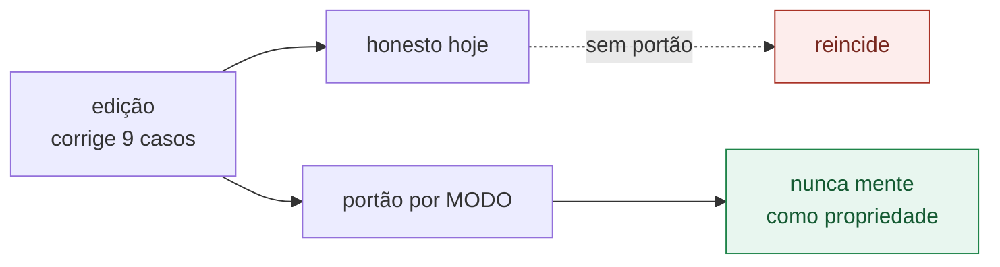

# Estudo: de "quase nunca mente" para "nunca mente"

> **Inventário histórico da auditoria.** As ocorrências abaixo descrevem a
> revisão examinada então, não uma lista de defeitos ainda presentes. O estado
> atual de execução e as pendências ficam na
> [matriz de requisitos](matriz-requisitos.md). As projeções deste estudo não
> foram convertidas em notas da avaliação em dez critérios.

<!-- cita-retratado: 2,078 0,687 0,437 0,368 1.539 0.288 -->
<!-- cita-defeito -->
> Data: 15/09/2026 · Base: auditoria adversarial de 12 dimensões (50 agentes,
> auditor → dois céticos → relator → calibração), nota global **77**.
>
> Cada afirmação deste documento foi conferida no disco no dia em que foi
> escrita. Onde há número, há o comando que o produz.

## 1. O que este estudo assume, e o que ele recusa assumir

A auditoria resumiu o material como *"confiável para estudar, e **quase nunca**
mente sobre o que mediu"*. Este estudo adota **"nunca"** como critério de
aceitação — não como frase a ser escrita no lugar da anterior.

A distinção é a mesma que o projeto já aplica aos seus números: trocar o texto
sem trocar o fato é o defeito, não a correção. "Nunca mente" só é verdade quando
**nenhuma afirmação publicada contradiz o disco ou a medição** — e quando existe
um mecanismo que impede a próxima de nascer.

### O que conta como mentira aqui

Não é má-fé; é afirmação publicada que não se sustenta. Três modos, e os três
foram observados:

| Modo | Definição | Por que é grave neste projeto |
|---|---|---|
| **A — aritmética interna** | o número não decorre dos operandos que o próprio texto imprime | o leitor confere e descobre sozinho |
| **B — artefato defasado** | o documento retrata, o programa que produz o número não | quem **roda** recebe o texto retratado |
| **C — autodescrição** | o material afirma sobre si algo que o disco desmente | corrói a regra editorial que o projeto mais preza |

---

## 2. Inventário verificado

Nove casos, todos confirmados por leitura no dia. A coluna *prova* é o comando
que decide.

### Modo A — aritmética interna

| # | Onde | Afirmação | Disco | Prova |
|---|---|---|---|---|
| A1 | `docs/02-runtime-dpdk/README.md:178` | "100 dos 123 ms, **83%**" | 100/123 = **81,3%**; 83% sai de 100/120,0, denominador de outra tabela | `python3 -c "print(100/123*100)"` |
| A2 | `docs/01-fundamentos/README.md:754` | "a diferença entre **22 ns e 117 ns** por travessia" | tabela em :735-736 mede **17,50** e **82,99** | `sed -n '735,736p;754p'` |

### Modo B — artefato defasado

| # | Onde | Afirmação | Disco | Prova |
|---|---|---|---|---|
| B1 | `docs/01-fundamentos/medicoes/efeito-cache.c:95` | imprime "**Latencia** media por acesso" | `README.md:383` retrata: "são tempo amortizado por acesso, **não latência**" | rodar o programa |
| B2 | `docs/03-mempool-ring-mbuf/README.md:302,305` | SP/SC = **1.539** e **0.288** ns | `cpp23/README.md:131,134` publica **2,078** e **0,368** para o mesmo `custo-anel.c` | `grep -n '1.539\|2,078'` |

### Modo C — autodescrição

| # | Onde | Afirmação | Disco | Prova |
|---|---|---|---|---|
| C1 | `README.md:104` | "Linux x86_64 **ou arm64**" | `__builtin_ia32_pause()` em 4 arquivos, 12 pontos, **zero** guardas de arquitetura | `grep -rl __builtin_ia32_pause` |
| C2 | `trilha/02-pipeline/01-rx-tx-burst/README.md:6` | "**Esqueleto.** O conteúdo ainda não foi escrito" | 268 linhas, com restrições verificadas contra a máquina | `wc -l` |
| C3 | `docs/02-runtime-dpdk/README.md:146` | "Usar **quatro lcores** em vez de um não muda nada" | tabela em :141-143 tem três linhas, nenhuma com quatro lcores | `sed -n '141,146p'` |
| C4 | `scripts/pre-commit.sh:99` | anuncia "nenhuma invocação combina `--in-memory` com `--no-huge`" | varre só `*.sh` e `meson.build`; duas sobrevivem em `docs/02-runtime-dpdk/README.md:113,141` | rodar o gancho |
| C5 | `meson.build:70-103` | três verificadores de documentação registrados | vivem em `if python3.found()` **sem `else`**: sem o interpretador somem e a suíte fica verde | `meson setup --wrap-mode=nofallback` |

**C5 é o mais sério do conjunto**, e não por tamanho: é a única entrada em que o
mecanismo de verificação da verdade pode desaparecer em silêncio. Enquanto ele
existir, "nunca mente" não é verificável — é esperança.

---

## 3. Por que nove edições não produzem "nunca"

A auditoria isolou a razão, e ela já tem nome no próprio repositório:

> *"Cada controle automático foi escrito contra a INSTÂNCIA que causou o
> incidente, não contra a CLASSE do defeito — e por isso reporta verde sobre o
> defeito presente."*

C4 é a demonstração viva: o gancho nasceu de um incidente com `--in-memory
--no-huge`, foi escrito para varrer os arquivos onde aquele incidente ocorreu, e
hoje **afirma ausência** de um defeito que sobrevive dois diretórios adiante.

Corrigir os nove casos deixa o material honesto **hoje** e reabre a porta
amanhã. Para "nunca" ser propriedade e não estado, cada modo precisa de portão.

---

## 4. Os três portões

Cada um é um verificador novo em `scripts/`, registrado como teste `l1+docs`,
seguindo o padrão dos três que já existem.

### Portão A — aritmética publicada

Extrai dos documentos os padrões `X de Y` seguidos de `Z%` e as razões `N×`, e
recalcula. Falha quando o resultado diverge do texto além do arredondamento
declarado.

Pega A1 hoje. Pegaria qualquer percentual futuro cujo denominador venha de outra
tabela.

### Portão B — número com dono único

Um registro (`docs/avaliacoes/numeros.json`) mapeia **programa → grandeza →
valor publicado → documentos que o citam**. O verificador falha quando a mesma
grandeza do mesmo programa aparece com dois valores.

Pega B2 hoje. É também o que teria pego, meses atrás, o `0,115` retratado que
sobreviveu num documento de síntese.

> **Este portão tem custo real e precisa ser dito:** exige que todo número
> publicado seja declarado no registro. Sem isso ele vira mais um controle que
> aprova o que não cobriu — o defeito que ele existe para impedir. A adoção
> honesta é incremental **com contagem visível**: o verificador imprime quantos
> números estão sob registro e quantos não estão, e o segundo número aparecendo
> na saída é o que impede a falsa sensação de cobertura.

### Portão C — autodescrição

Três regras, todas mecânicas:

1. documento com banner `Esqueleto.` e mais de 80 linhas de conteúdo → falha (C2);
2. plataforma prometida no `README.md` sem guarda correspondente no código →
   falha (C1);
3. verificador que **anuncia ausência** declara no próprio texto o escopo que
   varreu, e o teste confere que o escopo declarado é o escopo real (C4).

### E o portão que falta ter portão

C5 se corrige com o antídoto que o projeto **já escreveu** para o GTest:
`scripts/pular-sem-gtest.sh` transforma "dependência ausente" em PULADO em vez
de desaparecimento. A mesma técnica aplicada ao `else` de `meson.build:103`
fecha a última porta pela qual a verificação some sem avisar.

Nada a inventar: há exemplar correto no repositório para copiar.

---

## 5. Plano, em ordem de razão ganho/esforço

| Ordem | Ação | Esforço | Fecha |
|---:|---|---|---|
| 1 | `else` com PULADO nos verificadores de docs | trivial | C5 |
| 2 | Corrigir os 9 casos do inventário | baixo | A1-A2, B1-B2, C1-C4 |
| 3 | Commitar `docs/avaliacoes/` (hoje `??`, zero commits) e resolver o link morto `execucao-qualidade.md` | trivial | a suíte volta a 0 falhas |
| 4 | Portão C (três regras mecânicas) | baixo | classe C |
| 5 | Portão A (aritmética) | baixo | classe A |
| 6 | Travas 1 e 2 de `preparar-nic.sh` portadas para `diagnostico-nic.sh` | baixo | risco ao host |
| 7 | `collection_is_valid` nos 7 programas restantes | baixo | classe fundadora |
| 8 | Portão B (registro de números) | médio | classe B |

Os itens 1 e 3 são pré-requisitos dos demais: enquanto a suíte puder ficar verde
sem ter verificado, nenhuma nota de honestidade é sustentável.

## 6. Projeção de nota

Pesos do calibrador, ganhos no **limite inferior** de cada faixa estimada:

| Dimensão | Peso | Hoje | Projetada |
|---|---:|---:|---:|
| Rigor de medição | 0,16 | 74 | **79** |
| Contribuição acadêmica | 0,14 | 79 | **85** |
| Clareza | 0,12 | 74 | **77** |
| Contribuição prática | 0,11 | 81 | **83** |
| Cobertura | 0,09 | 80 | **82** |
| Boas práticas C/C++23 | 0,09 | 74 | **75** |
| Testabilidade | 0,07 | 82 | **85** |
| Níveis de teste | 0,06 | 84 | **87** |
| Segurança | 0,06 | 71 | **76** |
| Estrutura | 0,05 | 73 | **76** |
| Ferramental | 0,03 | 71 | **75** |
| Manutenibilidade | 0,02 | 72 | **74** |

**Global: 77 → 80.**

## 7. O que a honestidade não compra

Ser rigoroso sobre isto é parte de ser rigoroso sobre o resto: **fechar os nove
casos não leva a 85.** O teto seguinte não é de disciplina, é de escopo:

- **não há uma única chamada `rte_eth_*`** no repositório — toda a metade de
  entrada e saída de pacote do DPDK está ausente, e depende de NIC;
- quatro documentos da trilha continuam esqueleto de fato;
- a portabilidade arm64, depois de C1, passa a exigir **decisão**: implementar
  a guarda e o caminho alternativo, ou deixar de prometer.

Este estudo compra uma coisa só, e ela é a que estava em questão: que nenhuma
frase publicada esteja errada, e que a próxima errada seja barrada por um teste
em vez de por uma auditoria.
