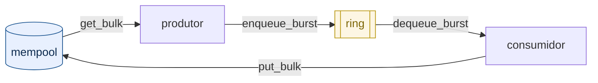

# Tópico 02 — Mempool, ring e processamento em lote

> **Nível 4** do [plano de estudo](../../../docs/plano-estudo-dpdk.md) ·
> Requer o [tópico 01](../01-eal-hello/) · Tem [alternativa sem DPDK](alternativas/cpp23/)

> **In English.** A producer/consumer pipeline over `rte_mempool` and
> `rte_ring`, with batching measured (1.8 ns/packet at burst 32, regressing at
> 128) and core placement measured separately — crossing cache domains costs
> **4–5×**, more than any other decision in the topic. Failure axis: the partial
> return of `rte_ring_enqueue_burst()`. The objects that did not fit are still
> yours; not returning them leaks, and the defect **suppresses its own symptom**.
> A deliberately leaky build is compiled from the same source and the test suite
> *requires it to fail*.

## 1. Fundamento: por que não usar `malloc()`

Com um orçamento de 67 ns por pacote em 10 GbE, alocar dinamicamente no caminho
de dados é arriscado: `malloc()` tem variância alta e fragmenta a memória com o
tempo. Mas o programa precisa de objetos por pacote.

> **Cuidado com a versão folclórica deste argumento.** Costuma-se dizer que
> `malloc()` "custa dezenas de nanossegundos", e isso foi medido neste projeto:
> alocar e liberar um objeto por vez custa **2,18 ns**, porque a glibc tem um
> cache por thread e o par cai nele. A justificativa real do mempool é outra, e
> aparece quando se trabalha em **lote** — o regime do plano de dados. Os números
> estão na [§1 do módulo de teoria](../../../docs/03-mempool-ring-mbuf/README.md#1-por-que-não-usar-malloc--a-resposta-medida).

A solução do DPDK inverte o problema: **aloque tudo uma vez, no início, e depois
apenas empreste e devolva**. É o padrão *object pool*, com duas peças:

- **[`rte_mempool`][guiamempool]** — conjunto de objetos de tamanho fixo, alocado na
  inicialização. Emprestar (`get`) e devolver (`put`) custam poucos
  nanossegundos, com um cache por **lcore** — a thread que a EAL cria e fixa a
  uma CPU lógica ([glossário][glossario]) — que evita contenção entre núcleos.
- **[`rte_ring`][guiaring]** — fila circular de ponteiros, de tamanho fixo, usada para passar
  objetos entre estágios sem lock quando há um produtor e um consumidor.

O terceiro conceito é **processamento em lote (burst)**: mover *n* objetos por
chamada em vez de um. O custo fixo de cada operação — verificação de índices,
barreiras de memória — é amortizado sobre o lote inteiro.

## 2. Mecanismo: o ciclo de vida do objeto

Este é o conceito central do tópico, e o que mais gera erro:



**Todo objeto retirado tem exatamente um destino: voltar ao pool.** Não há coleta
automática. Se um caminho de código esquecer a devolução, o pool esvazia, o
produtor deixa de obter objetos e o pipeline para — em silêncio, sem erro.

O ponto mais fácil de errar é o retorno parcial. [`rte_ring_enqueue_burst`][apienqburst]
devolve **quantos objetos realmente couberam**, que pode ser menos que o pedido:

```c
unsigned enq = rte_ring_enqueue_burst(fila, (void *const *)lote, n, NULL);
if (enq < n) {
    /* os que NÃO couberam continuam sendo seus: devolva-os */
    rte_mempool_put_bulk(pool, (void *const *)&lote[enq], n - enq);
}
```

Ignorar esse retorno é o vazamento clássico deste tema.

> **Antecipando RX/TX:** [`rte_eth_tx_burst`][apitxburst] tem a semântica **oposta** — ela
> *assume a posse* dos pacotes que aceitou, e o driver os devolve ao pool após
> transmitir. Liberar um mbuf aceito pelo TX é *double free*. Você libera apenas
> os **não** aceitos. Guarde a diferença: no ring, o que não coube é seu; no TX,
> o que foi aceito não é mais seu.

## 3. Trade-offs

**Tamanho do lote.** Lotes maiores amortizam melhor o custo fixo, mas aumentam a
latência do primeiro pacote e o uso de cache. Medição neste projeto, com 5
milhões de pacotes:

| Lote | ns/pacote (DPDK) |
|---:|---:|
| 1 | 5,3 |
| 8 | 2,3 |
| 32 | **1,8** |
| 128 | 2,2 |

O ganho é grande até 8, marginal até 32, e **regride** em 128 — o lote deixa de
caber confortavelmente no cache. Não existe "quanto maior melhor"; existe um
ponto ótimo que se mede.

> **Como estes números foram obtidos.** `-n 5000000` por ponto, com o
> aquecimento que o programa faz antes de cronometrar. Três execuções seguidas
> deram valores idênticos em cada lote (1,8/1,8/1,8 no lote 32), o que não
> acontecia antes do aquecimento existir.
>
> O que ainda **não** é controlado é a frequência do processador: o governor
> desta máquina é `powersave` com turbo ligado, e o programa passou a imprimir a
> frequência junto do tempo exatamente por isso. Compare a *forma* da curva com
> a sua máquina; os valores absolutos vão diferir. Medição com ambiente fixado
> entra na Etapa 5.

**Onde ficam os lcores.** Este é o trade-off que só aparece quando o ring
realmente atravessa núcleos, e ele é maior que o do tamanho do lote.

> O consumidor deste tópico é despachado com `rte_eal_remote_launch()` e
> recolhido com `rte_eal_wait_lcore()` (veja
> [`pipeline_ring.c`](pipeline_ring.c)). O que essas duas funções fazem com o
> estado do lcore, e por que a segunda continua obrigatória mesmo depois de o
> trabalhador terminar, está na
> [§5.2 do módulo 02](../../../docs/02-runtime-dpdk/README.md#52-a-máquina-de-estados-tem-dois-estados-não-três).

Com dois ou mais lcores (`-l 0,2`), o consumidor ganha núcleo próprio e cada lote
viaja de um cache para o outro. Quanto custa essa viagem depende de **quais**
núcleos você escolheu: CPUs modernas agrupam núcleos em blocos que compartilham
L3, e atravessar de um bloco para outro passa pela interconexão interna do chip.

Nesta máquina (Ryzen 9 9900X) os blocos são `0-5,12-17` e `6-11,18-23`. Medindo
com [`scripts/bench-ccd.sh`](../../../scripts/bench-ccd.sh), 3 milhões de pacotes:

| Lote | 1 lcore | 2 lcores, mesmo bloco | 2 lcores, blocos diferentes | Razão |
|---:|---:|---:|---:|---:|
| 1 | 5,3 ns | 16,0 ns | 64,3 ns | 4,0× |
| 8 | 2,3 ns | 5,1 ns | 24,3 ns | 4,8× |
| 32 | 1,8 ns | 3,6 ns | 16,1 ns | 4,5× |
| 128 | 2,2 ns | 2,6 ns | 12,0 ns | 4,6× |
| 256 | 2,4 ns | 2,3 ns | 9,3 ns | 4,0× |

> **Por que a coluna "1 lcore" não bate com a tabela anterior** (5,3 contra ~5,9
> no lote 1): são medições diferentes. A primeira tabela vem de execução única do
> binário; esta vem do `bench-ccd.sh`, que toma a **melhor de várias repetições**
> para reduzir ruído. A diferença entre as duas é a própria margem de erro deste
> tipo de medição, e vê-la é mais útil do que escondê-la publicando só uma.

Três leituras, e nenhuma delas é óbvia:

**A escolha do núcleo pesa mais que qualquer outra decisão aqui.** Passar o
consumidor do bloco vizinho para o bloco distante custa de 4,0 a 4,8 vezes, sem
mudar uma linha de código. Com lote 1, os 64,3 ns consomem **96%** do orçamento
de 67,2 ns de um pacote de 64 B em 10 GbE — quase tudo, só para entregar o pacote
ao outro núcleo.

**O lote é o antídoto para o custo de travessia.** Cada lote atravessa a
interconexão uma vez, independentemente de quantos objetos carrega. Por isso o
ganho do batching é muito maior quando há travessia: entre blocos distintos,
ir de lote 1 para 256 economiza 55 ns por pacote; num lcore só, economiza 2,9 ns.
Batching não serve apenas para amortizar chamadas — serve para amortizar
**distância**.

**Paralelizar pode piorar.** Repare que um lcore só vence os dois lcores em quase
toda a tabela. O trabalho por pacote aqui é um XOR; não paga o custo de entregá-lo
a outro núcleo. Só com lote 256 e mesmo bloco os dois núcleos finalmente ganham
(2,3 contra 2,4 ns). A lição transfere para qualquer pipeline: **um estágio a
mais só compensa se o trabalho que ele faz superar o custo do repasse** — e esse
custo você acabou de medir.

> Reproduza na sua máquina com `./scripts/bench-ccd.sh`. O script descobre os
> blocos pelo sysfs e se adapta; em CPU de bloco único ele avisa e mede o que dá.

**E como se escolhe o núcleo, na prática?** Esta tabela mede o custo da escolha;
quem dá o controle sobre ela é a EAL. Com `-l 0,2` você pede lcores e aceita o
mapeamento padrão; com `--lcores '0@6,1@7'` você declara em qual CPU cada lcore
roda. A diferença entre as duas formas — e uma armadilha de API no caminho, a
função `rte_lcore_to_cpu_id()`, que apesar do nome não devolve o número da CPU —
está na [§5.1 do módulo 02](../../../docs/02-runtime-dpdk/README.md#51-lcore-não-é-cpu).

**Tamanho do pool.** O pool aqui tem 4095 objetos para processar até milhões de
pacotes. Isso é proposital: só termina se a devolução estiver correta a cada
ciclo. Um pool superdimensionado esconderia vazamentos.

**Ring de tamanho fixo.** Quando enche, o produtor recebe recusa em vez de
bloquear. Isso é *backpressure* explícito — assunto do
[tópico de pipeline](../../02-pipeline/).

## 4. Implementação

| Arquivo | Papel |
|---|---|
| [`packet.h`](packet.h) / [`packet.c`](packet.c) | lógica pura, **sem DPDK** |
| [`pipeline_ring.c`](pipeline_ring.c) | runtime: EAL, mempool, ring |

Essa separação é deliberada. A lógica de pacote não precisa do DPDK para existir,
então não deve depender dele para ser testada. É o que torna possível o teste L1.

> **Repare que mempool e ring são criados por NOME.** Isso não é rótulo de
> depuração: o nome é o mecanismo de identificação da memória da EAL, o mesmo das
> memzones. É por ele que um segundo processo encontraria este pool sem receber
> ponteiro nenhum — o modelo da
> [§3.1 do módulo 02](../../../docs/02-runtime-dpdk/README.md#31-memzone-memória-com-nome).
> Aqui há um processo só, então o nome parece decorativo; ele deixa de parecer no
> dia em que a estratégia vira processo separado.

```bash
./scripts/build-all.sh
./build/trilha/01-fundamentos/02-mempool-ring/pipeline_ring \
    -l 0 --no-huge --file-prefix=topico02 -- -n 10
```

Saída esperada (omitindo as linhas `EAL:`):

```
Pacotes processados: 10
Total de bytes: 695
Lote (burst): 32 | objetos que nao couberam na fila: 0
Modo: 1 lcore (0), produtor e consumidor alternados
Objetos livres no pool ao final: 4095 de 4095
Tempo medio: 52.1 ns/pacote  <- NAO E MEDICAO
  10 pacotes sao poucos demais: o custo de ler o relogio e da mesma
  ordem do trabalho medido. Use -n 10000 ou mais para um numero defensavel.
```

A linha decisiva é a **quinta**: `4095 de 4095` significa que todo objeto voltou.
Qualquer número menor é vazamento.

As cinco primeiras linhas são **determinísticas** — repita quantas vezes quiser e
elas não mudam.

**E repare no que o programa faz com a sexta.** Ele se recusa a apresentá-la como
medição, e o motivo não é falta de aquecimento — o programa aquece com 4096
pacotes antes de ligar o cronômetro. É que 10 pacotes representam cerca de 20 ns
de trabalho real, medidos com um relógio cuja leitura custa a mesma ordem de
grandeza: **o instrumento domina o fenômeno**. Nesta máquina, três execuções
seguidas do mesmo comando dão:

| `-n` | três execuções | veredito |
|---:|---|---|
| 10 | 40 / 55 / 134 ns | inutilizável |
| 100 | 10 / 15 / 16 ns | ainda ±50% |
| 10 000 | 2,2 / 2,4 / 2,4 ns | estável |

Publicar o primeiro caso com uma casa decimal seria precisão inventada. Um
programa que imprime um número que não sustenta ensina o leitor a confiar em
números que não se sustentam — por isso o limiar está no código, e não só no
texto. O número com significado está na seção 3, e exige `-n` grande.

### Exercícios

1. Rode com `-n 5000000 -b 1` e depois `-n 5000000 -b 128`, e compare com a
   tabela da seção 3. Em seguida repita os dois com `-n 10`: por que nenhum dos
   dois números se parece com a tabela? (A medição começa **depois** da EAL, em
   [`pipeline_ring.c`](pipeline_ring.c) — então o que distorce não é o custo de
   inicializar.)
2. Aumente para `-n 1000000`. O pool continua íntegro?
3. **Provoque o bug:** comente o [`rte_mempool_put_bulk`][apiputbulk] do caminho de retorno
   parcial e rode com `-b 256`. O que acontece com a contagem final do pool?
4. Por que o total é 695 bytes e não 690? (Dica: veja `pacote_processar`.)

## 5. Validação

Este tópico tem os dois níveis, e a divisão mostra o que cada um alcança.

```bash
./scripts/test-all.sh l1     # 13 casos, sem EAL, milissegundos
./scripts/test-all.sh l2     # runtime real
```

**L1** ([`tests/test_l1.cpp`](tests/test_l1.cpp)) — GoogleTest sobre `packet.c`,
via `extern "C"`. Além das asserções de comportamento, expressa um invariante do
tópico com teste parametrizado: processar 10 pacotes em lotes de 1, 2, 3, 4, 8,
10 ou 32 **sempre** dá 695 bytes. O tamanho do lote é um botão de desempenho,
nunca de semântica.

**L2** ([`tests/l2_run.sh`](tests/l2_run.sh)) — exercita o binário sob a [EAL][cEAL]. A
asserção central é a integridade do pool após ~25 ciclos de reuso completo
(100 000 pacotes com 4095 objetos). Nenhum teste L1 poderia detectar isso: o
vazamento só existe no runtime.

## 6. Quando dá errado

> **A pergunta deste tópico:** o que o retorno **parcial** de
> [`rte_ring_enqueue_burst()`][apienqburst] obriga a fazer, e o que acontece com
> os objetos se não for feito?

### 6.1 O mecanismo

`rte_ring_enqueue_burst(fila, objs, n, NULL)` devolve **quantos** objetos coube
enfileirar, e esse número pode ser menor que `n`. Não é erro: é o anel dizendo
que encheu. Os `n - enq` que sobraram continuam **seus** — foram tirados do pool
e ainda não foram entregues a ninguém.

O pool não tem coletor de lixo. Se você não devolver esses objetos, eles não
voltam sozinhos: saem de circulação para sempre. É uma linha de código:

```c
if (enq < n)
    rte_mempool_put_bulk(pool, (void *const *)&lote_prod[enq], n - enq);
```

### 6.2 O experimento

O tópico compila o **mesmo fonte** duas vezes. `pipeline_ring_vazado` é
`pipeline_ring.c` com essa devolução removida por `#ifdef` — nada mais muda.

```bash
./build/trilha/01-fundamentos/02-mempool-ring/pipeline_ring_vazado \
    -l 0,2 --no-huge --file-prefix=topico02 -- -n 2000000 -b 256
```

```
INVARIANTE VIOLADO: 1403 de 4095 objetos no pool ao final. 2692 objeto(s)
vazaram: algum caminho de retorno nao devolveu ao pool.
Pacotes processados: 2000000
Total de bytes: 161000000
Lote (burst): 256 | objetos que nao couberam na fila: 2692
Objetos livres no pool ao final: 1403 de 4095
```

### 6.3 O que a medição mostra

Nesta máquina, com 2 000 000 de pacotes e o consumidor em outro núcleo:

| Lote | Não couberam | Vazaram | Pool ao final | Pacotes |
|---:|---:|---:|---:|---:|
| 32 | 2979 | 2979 | 1116 de 4095 | 2 000 000 |
| 64 | 2946 | 2946 | 1149 de 4095 | 2 000 000 |
| 128 | 2945 | 2945 | 1150 de 4095 | 2 000 000 |
| 256 | 2692 | 2692 | 1403 de 4095 | 2 000 000 |

Três leituras, e a terceira é a que importa:

**1. Vazam exatamente os que não couberam.** A razão é 1,00 nos quatro tamanhos
de lote, e não por coincidência: são a mesma grandeza. O contador publica
`n - enq`, que é precisamente o conjunto que a linha removida devolveria.

**2. O programa termina bem.** Mesmos 2 000 000 de pacotes, mesmos
161 000 000 de bytes, saída idêntica à do binário correto em tudo que o usuário
olharia. Sem travar, sem `SIGSEGV`, sem mensagem do DPDK. **A única evidência é o
invariante conferido na saída** — e é por isso que ele existe.

**3. O defeito esconde o próprio sintoma.** Compare com a mesma invocação no
binário correto:

```
Lote (burst): 256 | objetos que nao couberam na fila: 905604
Objetos livres no pool ao final: 4095 de 4095
```

O programa **certo** teve 905 604 objetos sem lugar na fila; o **defeituoso**,
2 692 — cerca de 336 vezes menos. A intuição diz o contrário, e a intuição erra
porque [`rte_mempool_get_bulk()`][apigetbulk] é **tudo ou nada**: com o pool
drenado, ele não devolve um lote menor, devolve `-ENOBUFS` e o produtor não
produz nada naquela volta. Menos objetos em circulação significa menos pressão
sobre o anel, que enche menos, que transborda menos.

Ou seja: o vazamento consome a capacidade que causava o transbordo, e com isso
apaga o rastro que denunciaria o vazamento. Um sistema assim não degrada com
alarme — degrada em silêncio, perdendo margem até parar.

### 6.4 Como isso é capturado

O [teste L2](tests/l2_run.sh) exige que o binário defeituoso **falhe**, e essa
inversão é deliberada: uma verificação que nunca falhou é indistinguível de uma
que nunca dispara.

O teste também confere a **pré-condição** antes de acusar, e isso custou uma
versão anterior: o vazamento só existe no caminho de retorno parcial, que só
executa quando o anel enche. Se o consumidor acompanhar o produtor, o anel não
enche, o caminho não roda e nada vaza — o teste falhava em uma execução a cada
quatro, acusando defeito onde não havia. Hoje ele só afirma o vazamento depois
de confirmar, pela saída do programa, que houve objetos sem lugar na fila.

> **Fora deste tópico.** Devolver ao pool resolve a **posse** do objeto, não a
> **política**: o pacote que não coube continua sem ser enviado. Escolher entre
> descartar, bloquear ou empurrar a pressão para trás é assunto do
> [tópico de batching e contrapressão](../../02-pipeline/02-batching-backpressure/).

## 7. Limitações

- Não há rede. Os "pacotes" são estruturas sintéticas; não há mbuf, NIC nem DMA.
  [`rte_mbuf`][guiambuf] chega no tópico de RX/TX.
- O ring está em modo SP/SC (um produtor, um consumidor), o que basta para os
  dois modos deste tópico. Com vários produtores ou vários consumidores seria
  preciso MP/MC, cujo custo é maior por exigir operações atômicas de disputa.
- No modo de dois lcores o produtor nunca dorme: se a fila enche, ele tenta de
  novo em laço fechado. Backpressure de verdade é assunto do
  [tópico de pipeline](../../02-pipeline/).
- Com `--no-huge`, a memória do pool não vem de [hugepages][cHuge], o que altera o
  comportamento de TLB frente a produção — e também impede que um segundo
  processo se anexe a este pool, porque memória anônima não é mapeável de fora.
  Mempool e ring **são** compartilháveis entre processos quando a memória vem de
  hugepages; é o modelo da
  [§4 do módulo 02](../../../docs/02-runtime-dpdk/README.md#4-processos-primário-e-secundário).

## 8. Comparação e próximo passo

A [alternativa em C++23 puro](alternativas/cpp23/) resolve **o mesmo problema**
sem DPDK, com o mesmo contrato verificado (10 pacotes, 695 bytes) — é onde os
ganhos e as perdas de cada abordagem ficam explícitos.

Depois: [pipeline e backpressure](../../02-pipeline/).

[guiamempool]: https://doc.dpdk.org/guides/prog_guide/mempool_lib.html
[guiaring]: https://doc.dpdk.org/guides/prog_guide/ring_lib.html
[apienqburst]: https://doc.dpdk.org/api/rte__ring_8h.html#a85ad08ed07e2e485c94466e03bf252c4
[apitxburst]: https://doc.dpdk.org/api/rte__ethdev_8h.html#a83e56cabbd31637efd648e3fc010392b
[apiputbulk]: https://doc.dpdk.org/api/rte__mempool_8h.html#a5e46fc827d764e516e8ff0c3f00e33fc
[apigetbulk]: https://doc.dpdk.org/api/rte__mempool_8h.html#a0d326354d53ef5068d86a8b7d9ec2d61
[guiambuf]: https://doc.dpdk.org/guides/prog_guide/mbuf_lib.html

[cEAL]: https://doc.dpdk.org/guides/prog_guide/env_abstraction_layer.html
[cHuge]: https://doc.dpdk.org/guides/linux_gsg/sys_reqs.html

[glossario]: https://doc.dpdk.org/guides/prog_guide/glossary.html
