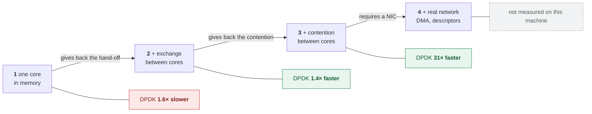
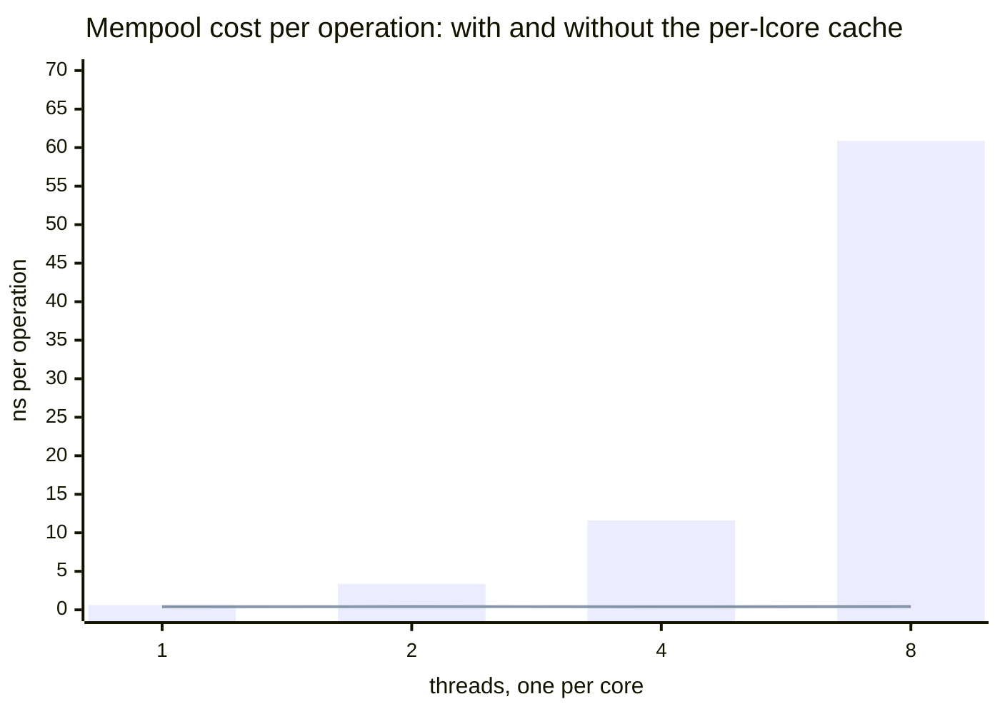

# Alternative — the same problem in pure C++23

*Leia em [português](README.md).*

> Alternative to [topic 02](../../) · Goal: make the **gains and losses** of each
> approach explicit, with the same contract verified on both sides.

## 1. Foundation: what "pure C++23" means here

A common confusion needs to be cleared up before any comparison:

> **"DPDK versus C++" is a false opposition.** DPDK programs *are* written in C and
> C++. DPDK's API is C, callable from C++23 with no intermediary.

> **Note on the blocks in this English edition.** The measurement programs print in
> Portuguese; this document translates their **labels and captions** so the tables
> and outputs can be read here. Numbers, seals and column positions are exactly what
> the program emitted. When a command in this page greps that output, the pattern
> stays in Portuguese — it has to match what the program really prints.
What is really being compared is not language against library, but **two
architectures of memory and flow management**:

| | DPDK version | This alternative |
|---|---|---|
| Objects | pre-allocated [`rte_mempool`][guiamempool] | `std::vector` with `reserve()` |
| Queue | [`rte_ring`][guiaring] (circular, fixed) | the `std::vector` itself |
| Batch | [`rte_ring_dequeue_burst`][apiringdeq] | `std::views::chunk` |
| Error | return code | `std::expected` |
| Release | explicit `put_bulk` | destructor (RAII) |

Both avoid allocation on the hot path. The difference is in **who guarantees it**:
in DPDK, the programmer; here, the type system and RAII.

## 2. Mechanism: C++23 features in use

```cpp
// std::expected — failure without exceptions on the critical path, visible in the signature
[[nodiscard]] std::expected<void, Error> enqueue(Packet p);

// std::views::chunk — declarative batching
for (auto bloco : std::span{pacotes_} | std::views::chunk(lote))
    processar_lote(std::span<Pacote>{bloco.data(), bloco.size()}, r);

// constexpr — the contract is checkable at compile time
static_assert(checksum(7, 100) == (7u ^ 100u));
```

`std::expected` deserves highlighting: exceptions are inadequate on a hot path
(unpredictable cost when unwinding the stack), but numeric return codes are easy to
ignore. `std::expected` gives the best of both — without the cost of exceptions, and
`[[nodiscard]]` makes the compiler complain if the error is ignored.

## 3. Measurement — and why it does **not** mean what it seems

Same machine, 5 million packets, best of three runs, **with both programs warmed up
the same way**:

| Batch | DPDK (ns/packet) | Pure C++23 (ns/packet) | Ratio |
|---:|---:|---:|---:|
| 1 | 5.3 | 2.4 | 2.2× |
| 8 | 2.3 | 1.3 | 1.7× |
| 32 | 1.8 | 1.1 | 1.6× |
| 128 | 2.2 | 1.1 | 2.0× |

> **Symmetry of method is not a detail.** Both programs discard a pass of 4096
> packets before timing, both refuse to publish a time below 10 000 packets, and
> both print the core's frequency. While only one side warmed up, the table was also
> measuring the difference in warm-up — and a comparison that does not control the
> method measures the method, not the object.

**The version without DPDK is 1.6 to 2.2 times faster.** If you stop reading here,
you will draw the wrong conclusion.

### Why DPDK loses in this test

Because **this test removes everything DPDK charges for**:

- **There is no network.** No NIC, no DMA, no descriptors. The `rte_mempool`
  guarantees memory suitable for DMA — here, nobody does DMA.
- **There is no exchange between cores.** The `rte_ring` is lock-free with memory
  barriers so producer and consumer can run on different lcores. Here, both run on
  the same core. The barriers cost cycles and buy nothing.
- **There is no memory pressure.** The mempool's per-lcore cache exists to avoid
  contention between cores. With one core, it is pure indirection.

That is: we measured the **cost of DPDK's abstractions in a scenario where they
render no service**. It is like measuring the weight of a seatbelt in a parked car.

### What the measurement legitimately shows

1. **Abstractions are not free.** Mempool and ring cost about 1 ns per packet. That
   is real, and it is the entry price.
2. **The shape of the curve is the same on both.** Batching helps a lot up to 8,
   marginally up to 32, and regresses at 128. That is cache behaviour, not a DPDK
   property.
3. **Adopting DPDK without network traffic is a loss.** If the problem is in-memory
   processing on one core, `std::vector` wins.

### When the account flips

DPDK starts winning — decisively, not marginally — when the factors this test lacks
come in: packets arriving from a NIC by DMA without copying, distribution across
multiple lcores by RSS, and the elimination of syscalls and of copies from the
kernel stack. Then the relevant comparison stops being against `std::vector` and
becomes against kernel sockets, whose typical order of magnitude is 1 to 2 Mpps per
core, against tens of Mpps for DPDK.

### Two of the three factors come back with no hardware at all

The previous section lists three things this test removes. They do not cost the same
to give back, and that difference is the point:

| Factor removed | Cost of giving it back | State |
|---|---|---|
| exchange between cores | running producer and consumer on distinct lcores | **measured** |
| pressure on memory | several cores contending for the same object source | **measured** |
| the network | a NIC with DMA and descriptors | impossible on this machine |

Giving the first two back, the conclusion **flips**. At each level the test gives
back a factor the previous one removed:

| level | what the test **gives back** | measured (ns/operation) | verdict |
|---:|---|---|---|
| 1 | nothing — one core, in memory | DPDK 1.8 · C++ 1.1 | DPDK **1.6× slower** |
| 2 | + exchange between cores | ring: DPDK 0.372 · C++ 0.506 (batch 128, both in bulk) | DPDK **1.4× faster** |
| 3 | + contention between cores | DPDK 0.42 · `malloc` 12.9 | DPDK **31× faster** |
| 4 | + real network (DMA, descriptors) | — not measured — | hardware missing |




**Each row measures a different operation** — the complete pipeline, the hand-off
between cores, and getting/returning one object. Compare the verdicts between
levels, never the nanoseconds: they are not the same quantity. Level 4 is not zero;
it is the absence of a measurement.

What each level shows:

**Level 1 — DPDK loses by 1.6×.** It is this page's test, and the conclusion is
legitimate *for this regime*: one core, everything in memory.

**Level 2 — DPDK wins, and that was not what used to be written here.**

The ring in C++23 now exists: [`SpscRing`](packet.hpp) — atomic indices with
`acquire`/`release`, on separate cache lines, a power-of-two capacity. Measured with
**the same protocol** as
[`custo-anel.c`](../../../../../docs/03-mempool-ring-mbuf/medicoes/custo-anel.c) by
[`custo-anel-cpp.cpp`](custo-anel-cpp.cpp): one thread, no contention, an
enqueue+dequeue cycle, 200 000 operations, the same statistics.

| batch | `rte_ring` SP/SC, bulk | `SpscRing`, **single-element** | `SpscRing`, **bulk** | C++ bulk ÷ `rte_ring` | C++ single ÷ `rte_ring` |
|---:|---:|---:|---:|---:|---:|
| 1 | 1.637 ns | 3.261 ns | 2.704 ns | 1.7× | 2.0× |
| 8 | 0.532 ns | 1.073 ns | 0.635 ns | 1.2× | 2.0× |
| 32 | 0.404 ns | 1.035 ns | 0.567 ns | 1.4× | 2.6× |
| 128 | **0.373 ns** | 1.142 ns | **0.508 ns** | **1.4×** | 3.1× |

Collected in **text mode**, with no graphical session. Medians between runs:
`rte_ring` over five (the campaign's, warm-up discarded), `SpscRing` over ten.
Amplitudes: `rte_ring` 1.634–1.642 at batch 1 and 0.371–0.374 at batch 128;
`SpscRing` in bulk 2.687–2.827 and 0.508–0.605.

**The bulk column falls with the batch, and that is exactly what the earlier
version of this text said could not happen.** From 2.704 ns at batch 1 to
0.508 ns at batch 128: the amortisation exists in the C++ ring because the bulk
API exists. What did not exist was a program exercising it.

**The distance between the two libraries in the same regime is 1.2× to 1.7×**,
not the 2.8× published before. Those 2.8× were `rte_ring` in bulk against
`SpscRing` single-element — the `single ÷ bulk` column above reproduces the old
values almost exactly (2.0×, 2.0×, 2.6×, 3.1×), which confirms the diagnosis.

<!-- cita-retratado: 1,628 1.628 0,527 0.527 0,393 0.393 3,117 3.117 1,062 1.062 1,026 1.026 1,037 1.037 -->

> **This column used to publish 2,078 and 0,368 ns, and the values do not
> reproduce.** Ten runs of `custo-anel.c` return 1.628 (amplitude 1.626–2.085) and
> 0.371 (0.367–0.473). The column was never produced by `custo-anel-cpp.cpp`, which
> measures **only** the ring in C++ — it was copied by hand from a run of
> `custo-anel.c`, and a copy has nobody to check it.
>
> **And there is an instrument effect that must be stated, because it was
> measured.** On consolidating the clock reading into a single header, the batch 32
> and 128 numbers rose 17% and 28% against the previous version — 10 runs of each.
> It is not the cost of the timestamp: it is taken twice per measurement, around
> 200 000 operations, and would be invisible. Trying to take the error handling off
> the hot path with `cold`/`noinline` did **not** undo the effect, which rules out
> the checking as the cause and points to code layout — a known sensitivity in
> sub-nanosecond measurement.
>
> The practical consequence, and it is worth more than the numbers: **absolute
> values below 1 ns in this project are fragile to changes that do not touch the
> measured loop.** Ratios between columns, measured in the same run, hold up
> better: the single ÷ bulk ratio at batch 128 gave 2.9×, then 2.8× and now
> 3.1× — a ±5 % band across three collections, against absolutes that moved
> more. "Holds up better" is not "is stable", and the number this document
> publishes as its conclusion is the ratio, not the absolute.
>
> <!-- retratado: 2,078 0,687 0,437 0,368 -->

**The difference grows with the batch, and the reason is interface, not
language.** At batch 1 all three sit in the same order of magnitude — it is
indeed the same algorithm. What separates the columns from batch 8 on is **how
many atomic publications** each one pays per object:

| path | `release` publications per batch of *n* |
|---|---|
| `rte_ring_enqueue_bulk` | 1 |
| `SpscRing::enqueue_burst` | 1 |
| `SpscRing::enqueue` in a loop | *n* |

The middle column is the third row of this table. That is why it flattens around
1 ns from batch 8 on: on that path there is nothing to amortise. The two bulk
columns fall together — `rte_ring` to 0.373 ns, `SpscRing` to 0.508 ns.

> **What remains between the two, measured in the same regime, is 1.2× to 1.7×.**
> That is not zero, and it is worth asking where it comes from. Three candidates,
> none of them measured here: `SpscRing` copies `Packet` by value — 16 bytes —
> while `rte_ring` moves 8-byte pointers; `rte_ring` keeps the other side's index
> in a local copy and only re-reads when it must; and `SpscRing`'s copy loop is
> scalar, with no vectorised `memcpy`. **Separating the three needs a design of
> its own**, and until then the attribution of the difference stays open.
>
> What does **not** explain the difference is the language. Both implementations
> use the same atomic instructions, and the one structural asymmetry the text
> asserted — the absence of a bulk API in C++ — did not exist.

> **What remains valid, and is the transferable finding.** `rte_ring` delivers
> the bulk operation **by default**. Whoever uses the library gets the
> amortisation without asking; whoever writes the ring has to decide to expose
> it. The middle column measures the cost of **not** using the interface you
> already have, and that cost — 2× to 3× — is larger than the difference between
> the two libraries.
>
> The methodological lesson is the same one that brought down the "tie" just
> below, and it recurs because it is easy: **before comparing two numbers, check
> whether the two programs make the same call.** Equal unit and different
> magnitude had already fooled us once here; the second time the unit and the
> magnitude were right, and what differed was the API being exercised.

> **This block used to publish "a tie", with two wrong numbers.**
>
> The first, "C++ 15,9 ns", **had no program**: there was no SPSC ring in C++23 in
> the repository. It is the most direct possible violation of this project's
> editorial rule — the same one that brought down the `malloc()` folklore.
>
> The second, "rte_ring costs 16,0 ns per hand-off", measures something else: it
> comes from [`bench-ccd.sh`](../../../../../scripts/bench-ccd.sh), which times the
> **entire pipeline** with two lcores — `mempool get`/`put` per packet, plus the
> ring, plus the cache-line migration. Attributing that to the ring gives the ring
> the cost of the whole. The ring in isolation costs 2,078 ns, eight times less.
>
> The methodological lesson: **before comparing two numbers, check whether they
> measure the same thing.** The two had the same unit and a different quantity, and
> that is what produced a "tie" that did not exist.

<!-- cita-retratado: 15,9 15.9 16,0 16.0 2,078 2.078 -->

**Level 3 — DPDK wins by almost a hundred times.** Eight cores contending for the
same object source, measured by
[`custo-contencao.c`](../../../../../docs/03-mempool-ring-mbuf/medicoes/custo-contencao.c)
with 9 repetitions per point:

| threads | mempool | `malloc` | ratio |
|---:|---:|---:|---:|
| 1 | 0.41 ns | 12.0 ns | 29× |
| 2 | 0.42 ns | 12.2 ns | 29× |
| 4 | 0.41 ns | 12.6 ns | 31× |
| 8 | **0.42 ns** | **12.9 ns** | **31×** |

**The ratio is flat.** Neither degrades with the number of cores, because each
thread has its own: there is no contention for CPU, and the contention that remains
— for the object source — is solved by the per-lcore cache on one side and by
glibc's per-thread *arena* on the other.

So where does the roughly 30× advantage come from? From the cache, and you can turn it off.
Creating the **same** pool with `cache_size = 0`:

| threads | mempool without cache | `malloc` | ratio | boundary |
|---:|---:|---:|---:|---|
| 1 | 0.62 ns | 12.27 ns | 20× | — |
| 2 | 3.18 ns | 12.40 ns | 3.9× | — |
| 4 | 11.76 ns | 12.41 ns | 1.1× | — |
| 8 | **58.70 ns** | 12.58 ns | **0.2×** — the mempool **loses** | crosses CCD |
| 16 | **149.93 ns** | 15.36 ns | **0.1×** | crosses CCD and SMT |

> **The last column is not decoration, and the table does not read without it.**
> This machine has twelve physical cores across **two** L3 domains, six in each.
> From eight threads on, the contention stops being only for the mempool and
> starts crossing the interconnect — which [§4.2 of the
> fundamentals](../../../../../docs/01-fundamentos/README.en.md#42-cache-and-locality)
> measures at ~81 ns against ~22 ns inside the domain. At sixteen, four threads
> begin sharing a core's execution units with their SMT sibling.
>
> **Rows separated by a mark are not comparable**: more than one thing changes
> between them. The jump from 11.8 to 58.7 ns is not "four times the threads
> costs five times"; it is four times the threads **plus** the crossing.
>
> It cannot be fixed by picking better lcores — with eight threads across six
> cores per CCD, crossing is unavoidable. What can be fixed is the silence, and
> the program now declares the boundary per row.

> **The 8 and 16 rows did not exist, and the reason is instructive.** The
> campaign ran `custo-contencao` with `-l 0-5`, and the program doubles the
> thread count up to `rte_lcore_count()`: with six lcores it stopped at four.
> The 8 row was published anyway, with a value **no archived run contained** — a
> number with no program, which is what this project's editorial rule forbids.
>
> In text mode there is nobody to contend with, so the campaign moved to all 24
> lcores. The previously published value (60.87 ns) was in the neighbourhood of
> what is measured now (58.70), and that does not make it acceptable: what was
> missing was not accuracy, it was provenance.
> <!-- cita-retratado: 60,87 60.87 11,61 11.61 3,37 3.37 -->



*The line for the pool **with** cache sits glued to the axis: 0.4 ns on a 70 ns
scale is indistinguishable from zero. That is the point of the chart.*

Without the cache, the mempool **degrades 106×** from 1 to 8 cores and starts losing
to `malloc`. With the cache, it stays flat. All of the mempool's advantage under
contention is in that structure — not in the ring, not in bulk allocation, not in
DPDK in the abstract.

> **This block once published "91×", and the number was an artefact.** The previous
> version created the `malloc` threads with `pthread_create` without touching
> affinity — and `pthread_create` **inherits** the mask of whoever creates it. Since
> `rte_eal_init()` pins the main thread to a single core, the eight `malloc` threads
> were contending for **one** CPU while the mempool used eight. The probe that
> closes the diagnosis:
>
> ```
> main after rte_eal_init  allowed CPUs: 0
> thread pthread_create    allowed CPUs: 0
> ```
>
> `malloc` was not degrading 350% from allocator contention: it was degrading from
> being squeezed onto a single core. With mirrored placement — each thread on the
> corresponding lcore's CPU — it stays flat at ~13 ns, and the ratio falls from 91×
> to about 30×.
>
> **The conclusion survives, the magnitude does not.** And the methodological lesson
> is this document's most expensive: in a comparison, *equalising placement is as
> mandatory as equalising the load* — otherwise you measure the scheduler.

> **It is the per-lcore cache, and it is invisible at level 1.** The previous
> section says that with one core that cache "is pure indirection". True — and that
> is exactly why level 1 cannot be the last word. The mechanism the test calls
> superfluous indirection is what sustains the entire scale.

**Level 4 — the network remains out of reach.** It is the only one of the three
factors that requires hardware: this machine's NIC is a Realtek RTL8125 on PCIe
Gen2 x1. That test arrives in the [RX/TX topic](../../../../02-pipeline/01-rx-tx-burst/),
and only there does the comparison close.

> Methodological caveat: best of three per point, with warm-up on both sides, but
> **without pinning the CPU frequency** and without isolating cores — that is why
> the programs print the frequency alongside the time. It serves for order of
> magnitude and for the ratio between the approaches, which is what this section
> claims. Measurement with a pinned environment enters at Stage 5, with
> google-benchmark.

## 4. Other axes of comparison

| Criterion | DPDK | Pure C++23 |
|---|---|---|
| Lines of code | 190 | 114 |
| Binary size | 388 KB | 1,1 MB |
| `librte_*` libraries linked | 7 | 0 |
| `librte_*` libraries loaded at runtime | **191** | 0 |
| Runs on any machine | no (needs DPDK) | yes |
| Release safety | manual, explicit `put_bulk` | automatic, RAII |
| Path to a real network | direct | non-existent |

> How these numbers were obtained, so they can be redone: lines of code counted the
> same way on both sides (no blank lines and no whole-line comments), summing the
> program and the pure logic — `pipeline_ring.c` + `packet.c` + `packet.h` on one
> side, `packet_pipeline.cpp` + `packet.hpp` on the other. Binary size via
> `stat -c %s` on the project's default `debugoptimized` build. Libraries linked via
> `ldd`; loaded at runtime, counting distinct `librte_*.so` in `/proc/<pid>/maps`
> with the program running.

Two rows of that table deserve careful reading, because intuition is wrong on both.

**The C++ binary is almost three times bigger, despite having less code.**
`std::print` and `<format>` bring a lot of template instantiation into the
executable. The DPDK binary is smaller because almost everything it uses lives in a
shared library — and that is exactly why it does not run on a machine without DPDK
installed. File size does not measure complexity; it measures where the code ended
up.

**Seven libraries linked, one hundred and ninety-one loaded.** The difference is the
EAL: at initialisation it scans and `dlopen`s every available driver, even the ones
this program will never use (NIC, crypto and bus drivers). It is real work, and it
is one of the things the number in
[§2 of module 02](../../../../../docs/02-runtime-dpdk/README.en.md#2-the-cost-of-existing-how-long-the-eal-takes-to-be-born)
accounts for. `--no-pci` and `-d` reduce that scan when you know in advance what you
need.

The most important axis in the table is the last one. This alternative is elegant
and fast, and **has no path to handling a real network packet**. All the machinery
that makes the other look expensive exists to cross that bridge.

## 5. Implementation and validation

| File | Role |
|---|---|
| [`packet.hpp`](packet.hpp) | pure logic, `constexpr`, testable |
| [`packet_pipeline.cpp`](packet_pipeline.cpp) | assembly of the pipeline |
| [`custo-anel-cpp.cpp`](custo-anel-cpp.cpp) | the ring in C++23, for the level-2 row |
| [`controle-anel.cpp`](controle-anel.cpp) | the **control** for the level-2 comparison — see §5.1 |

```bash
./build/trilha/01-fundamentos/02-mempool-ring/alternativas/cpp23/packet_pipeline -n 10
```

```
Packets processed: 10
Total bytes: 695
Batch (burst): 32 | batches interrupted by a full queue: 0
Mean time: 43.1 ns/packet  <- NOT A MEASUREMENT
  10 packets are far too few: the cost of reading the clock is of the same
  order as the work measured. Use -n 10000 or more for a defensible number.
```

**The first two values are identical to the DPDK version's.** That is no accident:
[`tests/test_l1.cpp`](tests/test_l1.cpp) is a deliberate mirror of the DPDK side's
test — the same case names, the same expected values, including the same
parameterised test over batch sizes.

```bash
./scripts/test-all.sh l1     # 16 cases on this side, 13 on the DPDK side
```

When both suites pass with the same assertions, it is demonstrated that the
difference between the approaches is one of **architecture and cost**, not of
behaviour. Without that, the comparison would be rhetorical.

### 5.1 The control, and what it prevents concluding

The level-2 row of the table in §3 compares DPDK's ring with the C++23 ring and
concludes in favour of DPDK. The conclusion only holds if the two measurements
differ in **one** thing — the ring implementation — and not in two.

They differed in two. The DPDK side publishes in **batches**, with
`rte_ring_enqueue_burst`; the C++ side published **per object**. A performance
difference between them would be attributable either to the library or to the
publication strategy, with the numbers unable to say which.

[`controle-anel.cpp`](controle-anel.cpp) separates the two effects. It holds the
ring (`academy::SpscRing`), the payload and the integrity check fixed, and
varies only two factors, crossed:

| Factor | Values | Position on the command line |
|---|---|---|
| publication | per object / per batch | 1st argument, 0 or 1 |
| placement | one core / two cores | 3rd and 4th arguments |

The five positional arguments are, in order: batch publication, batch size,
producer CPU, consumer CPU and sample count. One run of the "batched, two
cores" arm:

```bash
./build/trilha/01-fundamentos/02-mempool-ring/alternativas/cpp23/controle-anel 1 128 2 4 25
```

The output is CSV, one line per sample, with the first pass discarded as warm-up.
Two decisions in the program deserve note, because both exist to prevent a
pretty result from being published by mistake:

- **Integrity is checked on every object.** The consumer verifies `id` and
  `checksum` against the expected value, and any divergence aborts the sample. A
  ring that loses or duplicates objects is faster than a correct one.
- **There is a five-second deadline.** A combination of factors that makes no
  progress exits non-zero, rather than producing a late CSV line that would
  enter the table as though it were a measurement.

> **What the control transfers.** Every comparison between two implementations
> carries the risk of varying more than one factor at a time. The instrument
> that fixes it is not more samples — it is a **crossed** design, in which each
> factor is varied with the other held fixed. Without it, the result is real and
> the explanation is arbitrary. It is the same distinction between a statistical
> problem and an experimental one that
> [module 01](../../../../../docs/01-fundamentos/README.en.md#91-the-four-scales-of-dispersion-and-what-each-one-cannot-reach)
> records: more samples do not fix a design that confounds two effects.

### 5.2 The source the gate could not see

Until 2026-09-15 this program sat in the tree **with no entry in any
`meson.build`** — and did not compile: it called `enqueue_burst` and
`dequeue_burst`, which no longer existed in `packet.hpp`.

The cause has a name: a `git filter-branch` performs a checkout when it
finishes, and the batch API had never been committed. The `git log` for
`packet.hpp` had a single commit. The code was recovered from
[`scripts/tests/fixtures/controle-anel/`](../../../../../scripts/tests/fixtures/controle-anel/),
which freezes the campaign's sources with the SHA256 of each in its manifest —
and after the recovery the tree's `packet.hpp` matched the declared hash byte
for byte, making the published measurement reproducible from the **tree** rather
than only from the fixture.

> **A source that no `meson.build` references does not enter the "clean build,
> zero warnings" gate.** The gate announces that it checked, and it did not.
> That is the quietest way for a quality control to fail: it is not a missed
> alarm, it is an alarm that was never armed. Compiling is cheap; finding out
> late is not.

## 6. Limitations

- It has no network, and cannot have one without leaving "pure C++" (the next step
  would be `AF_PACKET` or `AF_XDP`, which are already kernel interfaces).
- Producer and consumer are sequential on the same core; there is no real
  concurrency, so nothing here exercises contention.
- `std::vector` guarantees neither memory suitable for DMA nor page alignment.

## 7. References

- [Topic 02 — the DPDK version](../../) · [Study plan](../../../../../docs/plano-estudo-dpdk.en.md)
- `std::expected` (P0323R12), `std::views::chunk` (P2442R1) — <https://en.cppreference.com/w/cpp/23>

[guiamempool]: https://doc.dpdk.org/guides/prog_guide/mempool_lib.html
[guiaring]: https://doc.dpdk.org/guides/prog_guide/ring_lib.html
[apiringdeq]: https://doc.dpdk.org/api/rte__ring_8h.html#a9dd35643c4cdc6fa00ece3cafbcd94d2
