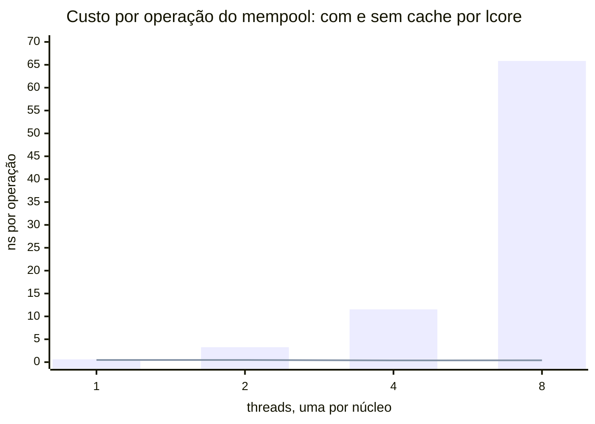

# Alternativa — o mesmo problema em C++23 puro

> Alternativa ao [tópico 02](../../) · Objetivo: tornar explícitos os **ganhos e
> as perdas** de cada abordagem, com o mesmo contrato verificado nas duas.

> **In English.** The same problem solved without DPDK — same verified contract
> (10 packets, 695 bytes), different architecture. The comparison runs at four
> levels, each restoring one factor the previous one removed, and **the verdict
> flips**: in memory on one core the C++23 version is 1.6× faster; ring against
> ring the DPDK one wins by up to 2.9× (bulk operations amortize the atomic);
> under contention across 8 cores, by 32×. Turning the per-lcore cache off makes
> the mempool *lose*. The point is not who wins — it is that a benchmark
> measures the regime you gave it.

## 1. Fundamento: o que "C++23 puro" significa aqui

Uma confusão comum precisa ser desfeita antes de qualquer comparação:

> **"DPDK versus C++" é uma falsa oposição.** Programas DPDK *são* escritos em C
> e C++. A API do DPDK é C, chamável de C++23 sem intermediário.

O que realmente se compara não é linguagem contra biblioteca, e sim **duas
arquiteturas de gestão de memória e fluxo**:

| | Versão DPDK | Esta alternativa |
|---|---|---|
| Objetos | [`rte_mempool`][guiamempool] pré-alocado | `std::vector` com `reserve()` |
| Fila | [`rte_ring`][guiaring] (circular, fixa) | o próprio `std::vector` |
| Lote | [`rte_ring_dequeue_burst`][apiringdeq] | `std::views::chunk` |
| Erro | código de retorno | `std::expected` |
| Liberação | `put_bulk` explícito | destrutor (RAII) |

Ambas evitam alocação no caminho quente. A diferença está em **quem garante
isso**: no DPDK, o programador; aqui, o sistema de tipos e o RAII.

## 2. Mecanismo: recursos de C++23 em uso

```cpp
// std::expected — erro sem exceção no caminho crítico, visível na assinatura
[[nodiscard]] std::expected<void, Error> enqueue(Packet p);

// std::views::chunk — batching declarativo
for (auto bloco : std::span{pacotes_} | std::views::chunk(lote))
    processar_lote(std::span<Pacote>{bloco.data(), bloco.size()}, r);

// constexpr — o contrato é verificável em tempo de compilação
static_assert(checksum(7, 100) == (7u ^ 100u));
```

`std::expected` merece destaque: exceções são inadequadas em caminho quente
(custo imprevisível ao desenrolar a pilha), mas códigos de retorno numéricos são
fáceis de ignorar. `std::expected` dá o melhor dos dois — sem custo de exceção,
e `[[nodiscard]]` faz o compilador reclamar se o erro for ignorado.

## 3. Medição — e por que ela **não** significa o que parece

Mesma máquina, 5 milhões de pacotes, melhor de três execuções, **com os dois
programas aquecidos do mesmo jeito**:

| Lote | DPDK (ns/pacote) | C++23 puro (ns/pacote) | Razão |
|---:|---:|---:|---:|
| 1 | 5,3 | 2,4 | 2,2× |
| 8 | 2,3 | 1,3 | 1,7× |
| 32 | 1,8 | 1,1 | 1,6× |
| 128 | 2,2 | 1,1 | 2,0× |

> **A simetria de método não é detalhe.** Os dois programas descartam uma
> passagem de 4096 pacotes antes de cronometrar, os dois se recusam a publicar
> tempo abaixo de 10 000 pacotes, e os dois imprimem a frequência do núcleo.
> Enquanto só um lado aquecia, a tabela media também a diferença de aquecimento —
> e uma comparação que não controla o método mede o método, não o objeto.

**A versão sem DPDK é de 1,6 a 2,2 vezes mais rápida.** Se você parar de ler
aqui, tirará a conclusão errada.

### Por que o DPDK perde neste teste

Porque **este teste remove tudo aquilo pelo qual o DPDK cobra**:

- **Não há rede.** Sem NIC, sem DMA, sem descritores. O `rte_mempool` garante
  memória adequada para DMA — aqui, ninguém faz DMA.
- **Não há troca entre núcleos.** O `rte_ring` é lock-free com barreiras de
  memória para permitir que produtor e consumidor rodem em lcores diferentes.
  Aqui, ambos rodam no mesmo núcleo. As barreiras custam ciclos e não compram
  nada.
- **Não há pressão de memória.** O cache por lcore do mempool existe para evitar
  contenção entre núcleos. Com um núcleo, é indireção pura.

Ou seja: medimos o **custo das abstrações do DPDK em um cenário onde elas não
prestam serviço**. É como medir o peso de um cinto de segurança num carro parado.

### O que a medição legitimamente mostra

1. **Abstrações não são gratuitas.** Mempool e ring custam cerca de 1 ns por
   pacote. Isso é real, e é o preço de entrada.
2. **A forma da curva é a mesma nos dois.** O batching ajuda muito até 8,
   marginalmente até 32, e regride em 128. Isso é comportamento de cache, não
   propriedade do DPDK.
3. **Adotar DPDK sem tráfego de rede é prejuízo.** Se o problema é
   processamento em memória num núcleo, `std::vector` ganha.

### Quando a conta inverte

O DPDK passa a ganhar — de forma decisiva, não marginal — quando entram os
fatores que este teste não tem: pacotes vindos de NIC por DMA sem cópia,
distribuição entre múltiplos lcores por RSS, e a eliminação de syscalls e de
cópias da pilha do kernel. Aí a comparação relevante deixa de ser contra
`std::vector` e passa a ser contra sockets do kernel, cuja ordem de grandeza
típica é de 1 a 2 Mpps por núcleo, contra dezenas de Mpps do DPDK.

### Dois dos três fatores voltam sem hardware nenhum

A seção anterior lista três coisas que este teste remove. Elas não custam o
mesmo para devolver, e essa diferença é o ponto:

| Fator removido | Custo de devolver | Estado |
|---|---|---|
| troca entre núcleos | rodar produtor e consumidor em lcores distintos | **medido** |
| pressão sobre a memória | vários núcleos disputando a mesma fonte de objetos | **medido** |
| a rede | NIC com DMA e descritores | impossível nesta máquina |

Devolvendo os dois primeiros, a conclusão **se inverte**. A cada nível o teste
devolve um fator que o anterior removia:

| nível | o que o teste **devolve** | medido (ns/operação) | veredito |
|---:|---|---|---|
| 1 | nada — um núcleo, em memória | DPDK 1,8 · C++ 1,1 | DPDK **1,6× mais lento** |
| 2 | + troca entre núcleos | anel: DPDK 0,37 · C++ 1,05 (lote 128) | DPDK **2,9× mais rápido** |
| 3 | + disputa entre núcleos | DPDK 0,41 · `malloc` 13,0 | DPDK **32× mais rápido** |
| 4 | + rede real (DMA, descritores) | — não medido — | falta hardware |


**Cada linha mede uma operação diferente** — pipeline completo, repasse entre
núcleos, e obter/devolver um objeto. Compare os vereditos entre níveis, nunca os
nanossegundos: eles não são a mesma grandeza. O nível 4 não é zero; é ausência
de medição.

O que cada nível mostra:

**Nível 1 — o DPDK perde por 1,6×.** É o teste desta página, e a conclusão é
legítima *para este regime*: um núcleo, tudo em memória.

**Nível 2 — o DPDK ganha, e não era o que estava escrito aqui.**

O anel em C++23 agora existe: [`SpscRing`](packet.hpp) — índices atômicos com
`acquire`/`release`, em linhas de cache separadas, capacidade potência de dois.
Medido com **o mesmo protocolo** de
[`custo-anel.c`](../../../../../docs/03-mempool-ring-mbuf/medicoes/custo-anel.c)
por [`custo-anel-cpp.cpp`](custo-anel-cpp.cpp): um thread, sem disputa, ciclo
enfileirar+desenfileirar, 200 000 operações, mesma estatística.

| lote | `rte_ring` SP/SC | `SpscRing` C++23 | razão |
|---:|---:|---:|---:|
| 1 | 2,078 ns | 3,184 ns | 1,5× |
| 8 | 0,687 ns | 1,070 ns | 1,6× |
| 32 | 0,437 ns | 1,030 ns | 2,4× |
| 128 | 0,368 ns | 1,050 ns | **2,9×** |

**A diferença cresce com o lote, e é aí que está a explicação.** Em lote 1 os
dois estão na mesma ordem de grandeza — é de fato o mesmo algoritmo. Mas o
`rte_ring` tem operações **em bloco**: `rte_ring_enqueue_bulk` move *n* ponteiros
com **um** par de operações atômicas. O `SpscRing` como está escrito não tem API
de bloco: enfileirar 128 pacotes custa 128 publicações atômicas.

Por isso o C++ fica plano em ~1,05 ns a partir do lote 8 — ele não tem o que
amortizar — enquanto o `rte_ring` continua caindo até 0,368 ns.

> **Isto não é uma vantagem da linguagem.** Um anel em C++ com API de bloco
> teria o mesmo comportamento; o que falta é a API, não o compilador. O que o
> DPDK entrega aqui é **desenho de interface** — a decisão de expor
> `enqueue_bulk` em vez de só `enqueue`. É uma vantagem real e transferível, e
> é diferente de "o DPDK é mais rápido".

> **Este bloco publicava "empate", com dois números errados.**
>
> O primeiro, "C++ 15,9 ns", **não tinha programa**: não havia anel SPSC em
> C++23 no repositório. É a violação mais direta possível da regra editorial
> deste projeto — a mesma que derrubou o folclore do `malloc()`.
>
> O segundo, "rte_ring custa 16,0 ns por repasse", mede outra coisa: vem do
> [`bench-ccd.sh`](../../../../../scripts/bench-ccd.sh), que cronometra o
> **pipeline inteiro** com dois lcores — `mempool get`/`put` por pacote, mais o
> anel, mais a migração de linha de cache. Atribuir isso ao anel dá ao anel o
> custo do conjunto. O anel isolado custa 2,078 ns, oito vezes menos.
>
> A lição de método: **antes de comparar dois números, confira se medem a mesma
> coisa.** Os dois tinham unidade igual e grandeza diferente, e foi isso que
> produziu um "empate" que não existia.

**Nível 3 — o DPDK ganha por quase cem vezes.** Oito núcleos disputando a mesma
fonte de objetos, medido por
[`custo-contencao.c`](../../../../../docs/03-mempool-ring-mbuf/medicoes/custo-contencao.c)
com 9 repetições por ponto:

| threads | mempool | `malloc` | razão |
|---:|---:|---:|---:|
| 1 | 0,48 ns | 15,5 ns | 32× |
| 2 | 0,48 ns | 14,8 ns | 31× |
| 4 | 0,38 ns | 12,4 ns | 33× |
| 8 | **0,41 ns** | **13,0 ns** | **32×** |

**A razão é plana.** Nenhum dos dois degrada com o número de núcleos, porque
cada thread tem o seu: não há disputa por CPU, e a disputa que resta — pela
fonte de objetos — o cache por lcore resolve de um lado e o *arena* por thread
da glibc resolve do outro.

Então de onde vem a vantagem de 32×? Do cache, e dá para desligá-lo. Criando o
**mesmo** pool com `cache_size = 0`:

| threads | mempool sem cache | `malloc` | razão |
|---:|---:|---:|---:|
| 1 | 0,62 ns | 12,2 ns | 20× |
| 2 | 3,27 ns | 12,3 ns | 4× |
| 4 | 11,54 ns | 13,1 ns | 1× |
| 8 | **65,84 ns** | **12,9 ns** | **0,2×** — o mempool **perde** |



*A linha do pool **com** cache fica colada no eixo: 0,4 ns numa escala de 70 ns
é indistinguível de zero. É esse o ponto do gráfico.*

Sem o cache, o mempool **degrada 106×** de 1 para 8 núcleos e passa a perder para
o `malloc`. Com o cache, fica plano. Toda a vantagem do mempool sob contenção
está nessa estrutura — não no anel, não na alocação em bloco, não no DPDK em
abstrato.

> **Este bloco já publicou "91×", e o número era artefato.** A versão anterior
> criava as threads do `malloc` com `pthread_create` sem tocar em afinidade — e
> `pthread_create` **herda** a máscara de quem cria. Como `rte_eal_init()` fixa a
> thread principal num único núcleo, as oito threads do `malloc` disputavam
> **uma** CPU enquanto o mempool usava oito. A sonda que fecha o diagnóstico:
>
> ```
> main apos rte_eal_init   CPUs permitidas: 0
> thread pthread_create    CPUs permitidas: 0
> ```
>
> O `malloc` não degradava 350% por contenção de alocador: degradava por estar
> espremido num núcleo só. Com a colocação espelhada — cada thread na CPU do
> lcore correspondente — ele fica plano em ~13 ns, e a razão cai de 91× para 32×.
>
> **A conclusão sobrevive, a magnitude não.** E a lição de método é a mais cara
> deste documento: num comparativo, *igualar a colocação é tão obrigatório
> quanto igualar a carga* — senão você mede o escalonador.

> **É o cache por lcore, e ele é invisível no nível 1.** A seção anterior diz que
> com um núcleo esse cache "é indireção pura". É verdade — e é exatamente por
> isso que o nível 1 não pode ser a última palavra. O mecanismo que o teste
> chama de indireção supérflua é o que sustenta a escala inteira.

**Nível 4 — a rede continua fora de alcance.** É o único dos três fatores que
exige hardware: a NIC desta máquina é uma Realtek RTL8125 em PCIe Gen2 x1. Esse
teste chega no [tópico de RX/TX](../../../../02-pipeline/01-rx-tx-burst/), e só
lá a comparação fecha.

> Ressalva metodológica: melhor de três por ponto, com aquecimento nos dois
> lados, mas **sem fixar a frequência da CPU** e sem isolar núcleos — por isso os
> programas imprimem a frequência junto do tempo. Serve para ordem de grandeza e
> para a razão entre as abordagens, que é o que esta seção afirma. Medição com
> ambiente fixado entra na Etapa 5, com google-benchmark.

## 4. Outros eixos de comparação

| Critério | DPDK | C++23 puro |
|---|---|---|
| Linhas de código | 190 | 114 |
| Tamanho do binário | 388 KB | 1,1 MB |
| Bibliotecas `librte_*` ligadas | 7 | 0 |
| Bibliotecas `librte_*` carregadas em execução | **191** | 0 |
| Roda em qualquer máquina | não (precisa de DPDK) | sim |
| Segurança de liberação | manual, `put_bulk` explícito | automática, RAII |
| Caminho para rede real | direto | inexistente |

> Como estes números foram obtidos, para que possam ser refeitos: linhas de
> código contadas do mesmo jeito nos dois lados (sem linhas em branco e sem
> comentários de linha inteira), somando o programa e a lógica pura —
> `pipeline_ring.c` + `packet.c` + `packet.h` de um lado, `packet_pipeline.cpp` +
> `packet.hpp` do outro. Tamanho do binário via `stat -c %s` no build
> `debugoptimized` padrão do projeto. Bibliotecas ligadas via `ldd`; carregadas
> em execução, contando `librte_*.so` distintas em `/proc/<pid>/maps` com o
> programa rodando.

Duas linhas dessa tabela merecem leitura cuidadosa, porque a intuição erra nas
duas.

**O binário C++ é quase três vezes maior, apesar de ter menos código.**
`std::print` e `<format>` trazem bastante instanciação de template para dentro do
executável. O binário DPDK é menor porque quase tudo que ele usa mora em
biblioteca compartilhada — e é exatamente por isso que ele não roda em máquina
sem DPDK instalado. Tamanho de arquivo não mede complexidade; mede onde o código
foi parar.

**Sete bibliotecas ligadas, cento e noventa e uma carregadas.** A diferença é a
EAL: na inicialização ela varre e carrega por `dlopen` todos os drivers
disponíveis, mesmo os que este programa jamais usará (drivers de NIC, de
criptografia, de barramento). É trabalho real, e é uma das coisas que o número da
[§2 do módulo 02](../../../../../docs/02-runtime-dpdk/README.md#2-o-custo-de-existir-quanto-a-eal-leva-para-nascer)
contabiliza. `--no-pci` e `-d` reduzem essa varredura quando se sabe de antemão o
que é preciso.

O eixo mais importante da tabela é o último. Esta alternativa é elegante e
rápida, e **não tem caminho para tratar um pacote de rede real**. Toda a
maquinaria que a faz parecer cara existe para atravessar essa ponte.

## 5. Implementação e validação

| Arquivo | Papel |
|---|---|
| [`packet.hpp`](packet.hpp) | lógica pura, `constexpr`, testável |
| [`packet_pipeline.cpp`](packet_pipeline.cpp) | montagem do pipeline |

```bash
./build/trilha/01-fundamentos/02-mempool-ring/alternativas/cpp23/packet_pipeline -n 10
```

```
Pacotes processados: 10
Total de bytes: 695
Lote (burst): 32 | lotes interrompidos por fila cheia: 0
Tempo medio: 23.1 ns/pacote
```

**Os dois primeiros valores são idênticos aos da versão DPDK.** Isso não é
coincidência: [`tests/test_l1.cpp`](tests/test_l1.cpp) é um espelho deliberado do
teste do lado DPDK — mesmos nomes de caso, mesmos valores esperados, incluindo o
mesmo teste parametrizado sobre tamanhos de lote.

```bash
./scripts/test-all.sh l1     # 16 casos deste lado, 13 do lado DPDK
```

Quando as duas suítes passam com as mesmas asserções, fica demonstrado que a
diferença entre as abordagens é de **arquitetura e custo**, não de
comportamento. Sem isso, a comparação seria retórica.

## 6. Limitações

- Não tem rede, e não tem como ter sem sair do "C++ puro" (o passo seguinte
  seria `AF_PACKET` ou `AF_XDP`, que já são interfaces do kernel).
- Produtor e consumidor são sequenciais no mesmo núcleo; não há concorrência
  real, então nada aqui exercita contenção.
- `std::vector` não garante memória adequada para DMA nem alinhamento de página.

## 7. Referências

- [Tópico 02 — versão DPDK](../../) · [Plano de estudo](../../../../../docs/plano-estudo-dpdk.md)
- `std::expected` (P0323R12), `std::views::chunk` (P2442R1) — <https://en.cppreference.com/w/cpp/23>

[guiamempool]: https://doc.dpdk.org/guides/prog_guide/mempool_lib.html
[guiaring]: https://doc.dpdk.org/guides/prog_guide/ring_lib.html
[apiringdeq]: https://doc.dpdk.org/api/rte__ring_8h.html#a9dd35643c4cdc6fa00ece3cafbcd94d2
