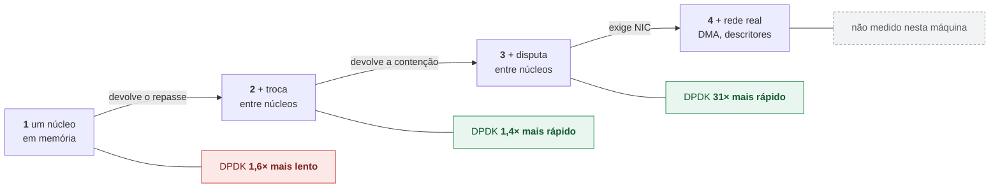
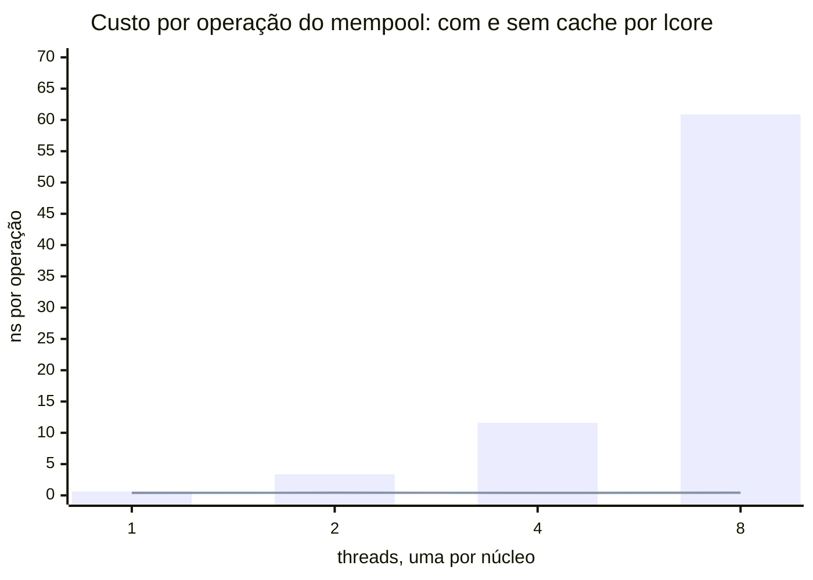

# Alternativa — o mesmo problema em C++23 puro

*Read this in [English](README.en.md).*

> Alternativa ao [tópico 02](../../) · Objetivo: tornar explícitos os **ganhos e
> as perdas** de cada abordagem, com o mesmo contrato verificado nas duas.

## 1. Fundamento: o que "C++23 puro" significa aqui

Uma confusão comum precisa ser desfeita antes de qualquer comparação:

> **"DPDK versus C++" é uma falsa oposição.** Programas DPDK *são* escritos em C
> e C++. A API do DPDK é C, chamável de C++23 sem intermediário.

O que realmente se compara não é linguagem contra biblioteca, e sim **duas
arquiteturas de gestão de memória e fluxo**:

| | Versão DPDK | Esta alternativa |
|---|---|---|
| Objetos | [`rte_mempool`][guiamempool] pré-alocado | `std::vector` com `reserve()` |
| Fila | [`rte_ring`][guiaring] (circular, fixa) | o próprio `std::vector` |
| Lote | [`rte_ring_dequeue_burst`][apiringdeq] | `std::views::chunk` |
| Erro | código de retorno | `std::expected` |
| Liberação | `put_bulk` explícito | destrutor (RAII) |

Ambas evitam alocação no caminho quente. A diferença está em **quem garante
isso**: no DPDK, o programador; aqui, o sistema de tipos e o RAII.

## 2. Mecanismo: recursos de C++23 em uso

```cpp
// std::expected — erro sem exceção no caminho crítico, visível na assinatura
[[nodiscard]] std::expected<void, Error> enqueue(Packet p);

// std::views::chunk — batching declarativo
for (auto bloco : std::span{pacotes_} | std::views::chunk(lote))
    processar_lote(std::span<Pacote>{bloco.data(), bloco.size()}, r);

// constexpr — o contrato é verificável em tempo de compilação
static_assert(checksum(7, 100) == (7u ^ 100u));
```

`std::expected` merece destaque: exceções são inadequadas em caminho quente
(custo imprevisível ao desenrolar a pilha), mas códigos de retorno numéricos são
fáceis de ignorar. `std::expected` dá o melhor dos dois — sem custo de exceção,
e `[[nodiscard]]` faz o compilador reclamar se o erro for ignorado.

## 3. Medição — e por que ela **não** significa o que parece

Mesma máquina, 5 milhões de pacotes, melhor de três execuções, **com os dois
programas aquecidos do mesmo jeito**:

| Lote | DPDK (ns/pacote) | C++23 puro (ns/pacote) | Razão |
|---:|---:|---:|---:|
| 1 | 5,3 | 2,4 | 2,2× |
| 8 | 2,3 | 1,3 | 1,7× |
| 32 | 1,8 | 1,1 | 1,6× |
| 128 | 2,2 | 1,1 | 2,0× |

> **A simetria de método não é detalhe.** Os dois programas descartam uma
> passagem de 4096 pacotes antes de cronometrar, os dois se recusam a publicar
> tempo abaixo de 10 000 pacotes, e os dois imprimem a frequência do núcleo.
> Enquanto só um lado aquecia, a tabela media também a diferença de aquecimento —
> e uma comparação que não controla o método mede o método, não o objeto.

**A versão sem DPDK é de 1,6 a 2,2 vezes mais rápida.** Se você parar de ler
aqui, tirará a conclusão errada.

### Por que o DPDK perde neste teste

Porque **este teste remove tudo aquilo pelo qual o DPDK cobra**:

- **Não há rede.** Sem NIC, sem DMA, sem descritores. O `rte_mempool` garante
  memória adequada para DMA — aqui, ninguém faz DMA.
- **Não há troca entre núcleos.** O `rte_ring` é lock-free com barreiras de
  memória para permitir que produtor e consumidor rodem em lcores diferentes.
  Aqui, ambos rodam no mesmo núcleo. As barreiras custam ciclos e não compram
  nada.
- **Não há pressão de memória.** O cache por lcore do mempool existe para evitar
  contenção entre núcleos. Com um núcleo, é indireção pura.

Ou seja: medimos o **custo das abstrações do DPDK em um cenário onde elas não
prestam serviço**. É como medir o peso de um cinto de segurança num carro parado.

### O que a medição legitimamente mostra

1. **Abstrações não são gratuitas.** Mempool e ring custam cerca de 1 ns por
   pacote. Isso é real, e é o preço de entrada.
2. **A forma da curva é a mesma nos dois.** O batching ajuda muito até 8,
   marginalmente até 32, e regride em 128. Isso é comportamento de cache, não
   propriedade do DPDK.
3. **Adotar DPDK sem tráfego de rede é prejuízo.** Se o problema é
   processamento em memória num núcleo, `std::vector` ganha.

### Quando a conta inverte

O DPDK passa a ganhar — de forma decisiva, não marginal — quando entram os
fatores que este teste não tem: pacotes vindos de NIC por DMA sem cópia,
distribuição entre múltiplos lcores por RSS, e a eliminação de syscalls e de
cópias da pilha do kernel. Aí a comparação relevante deixa de ser contra
`std::vector` e passa a ser contra sockets do kernel, cuja ordem de grandeza
típica é de 1 a 2 Mpps por núcleo, contra dezenas de Mpps do DPDK.

### Dois dos três fatores voltam sem hardware nenhum

A seção anterior lista três coisas que este teste remove. Elas não custam o
mesmo para devolver, e essa diferença é o ponto:

| Fator removido | Custo de devolver | Estado |
|---|---|---|
| troca entre núcleos | rodar produtor e consumidor em lcores distintos | **medido** |
| pressão sobre a memória | vários núcleos disputando a mesma fonte de objetos | **medido** |
| a rede | NIC com DMA e descritores | impossível nesta máquina |

Devolvendo os dois primeiros, a conclusão **se inverte**. A cada nível o teste
devolve um fator que o anterior removia:

| nível | o que o teste **devolve** | medido (ns/operação) | veredito |
|---:|---|---|---|
| 1 | nada — um núcleo, em memória | DPDK 1,8 · C++ 1,1 | DPDK **1,6× mais lento** |
| 2 | + troca entre núcleos | anel: DPDK 0,372 · C++ 0,506 (lote 128, ambos em bloco) | DPDK **1,4× mais rápido** |
| 3 | + disputa entre núcleos | DPDK 0,42 · `malloc` 12,9 | DPDK **31× mais rápido** |
| 4 | + rede real (DMA, descritores) | — não medido — | falta hardware |




**Cada linha mede uma operação diferente** — pipeline completo, repasse entre
núcleos, e obter/devolver um objeto. Compare os vereditos entre níveis, nunca os
nanossegundos: eles não são a mesma grandeza. O nível 4 não é zero; é ausência
de medição.

O que cada nível mostra:

**Nível 1 — o DPDK perde por 1,6×.** É o teste desta página, e a conclusão é
legítima *para este regime*: um núcleo, tudo em memória.

**Nível 2 — o DPDK ganha, e não era o que estava escrito aqui.**

O anel em C++23 agora existe: [`SpscRing`](packet.hpp) — índices atômicos com
`acquire`/`release`, em linhas de cache separadas, capacidade potência de dois.
Medido com **o mesmo protocolo** de
[`custo-anel.c`](../../../../../docs/03-mempool-ring-mbuf/medicoes/custo-anel.c)
por [`custo-anel-cpp.cpp`](custo-anel-cpp.cpp): um thread, sem disputa, ciclo
enfileirar+desenfileirar, 200 000 operações, mesma estatística.

| lote | `rte_ring` SP/SC, em bloco | `SpscRing`, **unitário** | `SpscRing`, **em bloco** | C++ bloco ÷ `rte_ring` | C++ unitário ÷ `rte_ring` |
|---:|---:|---:|---:|---:|---:|
| 1 | 1,637 ns | 3,261 ns | 2,704 ns | 1,7× | 2,0× |
| 8 | 0,532 ns | 1,073 ns | 0,635 ns | 1,2× | 2,0× |
| 32 | 0,404 ns | 1,035 ns | 0,567 ns | 1,4× | 2,6× |
| 128 | **0,373 ns** | 1,142 ns | **0,508 ns** | **1,4×** | 3,1× |

Coleta em **modo texto**, sem sessão gráfica. Medianas entre execuções:
`rte_ring` com cinco (campanha, descartada a de aquecimento), `SpscRing` com
dez. Amplitudes: `rte_ring` 1,634–1,642 no lote 1 e 0,371–0,374 no lote 128;
`SpscRing` em bloco 2,687–2,827 e 0,508–0,605.

**A coluna em bloco cai com o lote, e era exatamente isso que a versão anterior
deste texto dizia não acontecer.** De 2,704 ns no lote 1 para 0,508 ns no lote
128: a amortização existe no anel em C++ porque a API de bloco existe. O que
não existia era um programa que a exercitasse.

**A distância entre as duas bibliotecas no mesmo regime é de 1,2× a 1,7×**, e
não os 2,8× publicados antes. Aqueles 2,8× eram `rte_ring` em bloco contra
`SpscRing` unitário — a coluna `unitário ÷ bloco` acima reproduz os valores
antigos quase exatamente (2,0×, 2,0×, 2,6×, 3,1×), o que confirma o diagnóstico.

<!-- cita-retratado: 1,628 1.628 0,527 0.527 0,393 0.393 3,117 3.117 1,062 1.062 1,026 1.026 1,037 1.037 -->
<!-- retratado: 1,628 1.628 0,527 0.527 0,393 0.393 3,117 3.117 1,062 1.062 1,026 1.026 1,037 1.037 -->

> **Esta coluna publicava 2,078 e 0,368 ns, e os valores não reproduzem.** Dez
> execuções de `custo-anel.c` devolvem 1,628 (amplitude 1,626–2,085) e 0,371
> (0,367–0,473). A coluna nunca foi produzida por `custo-anel-cpp.cpp`, que mede
> **só** o anel em C++ — ela foi copiada à mão de uma execução de `custo-anel.c`,
> e cópia não tem quem a confira.
>
> **E há um efeito de instrumento que precisa ser dito, porque foi medido.** Ao
> consolidar a leitura de relógio num cabeçalho único, os números de lote 32 e
> 128 subiram 17% e 28% contra a versão anterior — 10 execuções de cada. Não é o
> custo do carimbo: ele é tomado duas vezes por medição, em volta de 200 000
> operações, e seria invisível. Tentar tirar o tratamento de erro do caminho
> quente com `cold`/`noinline` **não** desfez o efeito, o que descarta a
> verificação como causa e aponta para layout de código — sensibilidade conhecida
> em medição de sub-nanossegundo.
>
> A consequência prática, e ela vale mais que os números: **valores absolutos
> abaixo de 1 ns neste projeto são frágeis a mudanças que não tocam o laço
> medido.** As razões entre colunas, medidas na mesma execução, resistem melhor:
> a razão unitário ÷ bloco no lote 128 deu 2,9×, depois 2,8× e agora 3,1× — uma
> faixa de ±5 % ao longo de três coletas, contra absolutos que se moveram mais.
> "Resiste melhor" não é "é estável", e o número que este documento publica como
> conclusão é a razão, não o absoluto.
>
> <!-- retratado: 2,078 0,687 0,437 0,368 -->

**A diferença cresce com o lote, e a razão é de interface, não de linguagem.**
Em lote 1 os três estão na mesma ordem de grandeza — é de fato o mesmo
algoritmo. O que separa as colunas a partir do lote 8 é **quantas publicações
atômicas** cada uma paga por objeto:

| caminho | publicações `release` por lote de *n* |
|---|---|
| `rte_ring_enqueue_bulk` | 1 |
| `SpscRing::enqueue_burst` | 1 |
| `SpscRing::enqueue` em laço | *n* |

A coluna do meio é a terceira linha desta tabela. É por isso que ela fica plana
em torno de 1 ns a partir do lote 8: naquele caminho não há o que amortizar. As
duas colunas em bloco caem juntas — o `rte_ring` até 0,373 ns, o `SpscRing` até
0,508 ns.

> **O que resta entre as duas, medido no mesmo regime, é de 1,2× a 1,7×.** Não é
> zero, e vale perguntar de onde vem. Três candidatos, nenhum medido aqui: o
> `SpscRing` copia `Packet` por valor — 16 bytes — enquanto o `rte_ring` move
> ponteiros de 8; o `rte_ring` mantém o índice do outro lado em cópia local e só
> relê quando precisa; e o laço de cópia do `SpscRing` é escalar, sem
> `memcpy` vetorizado. **Separar os três exige um desenho próprio**, e até lá a
> atribuição da diferença permanece em aberto.
>
> O que **não** explica a diferença é a linguagem. As duas implementações usam
> as mesmas instruções atômicas, e a única assimetria estrutural que o texto
> afirmava — a ausência de API de bloco em C++ — não existia.

> **O que continua válido, e é o achado transferível.** O `rte_ring` entrega a
> operação em bloco **por padrão**. Quem usa a biblioteca recebe a amortização
> sem pedir; quem escreve o anel precisa decidir expô-la. A coluna do meio mede
> o custo de **não** usar a interface que se tem, e esse custo — 2× a 3× —
> é maior que a diferença entre as duas bibliotecas.
>
> A lição de método é a mesma que derrubou o "empate" logo abaixo, e ela se
> repete porque é fácil: **antes de comparar dois números, confira se os dois
> programas fazem a mesma chamada.** Unidade igual e grandeza diferente já tinha
> enganado uma vez aqui; da segunda vez a unidade e a grandeza estavam certas, e
> o que diferia era a API exercitada.

> **Este bloco publicava "empate", com dois números errados.**
>
> O primeiro, "C++ 15,9 ns", **não tinha programa**: não havia anel SPSC em
> C++23 no repositório. É a violação mais direta possível da regra editorial
> deste projeto — a mesma que derrubou o folclore do `malloc()`.
>
> O segundo, "rte_ring custa 16,0 ns por repasse", mede outra coisa: vem do
> [`bench-ccd.sh`](../../../../../scripts/bench-ccd.sh), que cronometra o
> **pipeline inteiro** com dois lcores — `mempool get`/`put` por pacote, mais o
> anel, mais a migração de linha de cache. Atribuir isso ao anel dá ao anel o
> custo do conjunto. O anel isolado custa 2,078 ns, oito vezes menos.
>
> A lição de método: **antes de comparar dois números, confira se medem a mesma
> coisa.** Os dois tinham unidade igual e grandeza diferente, e foi isso que
> produziu um "empate" que não existia.

**Nível 3 — o DPDK ganha por quase cem vezes.** Oito núcleos disputando a mesma
fonte de objetos, medido por
[`custo-contencao.c`](../../../../../docs/03-mempool-ring-mbuf/medicoes/custo-contencao.c)
com 9 repetições internas por ponto e 5 execuções arquivadas em
[`historico/`](../../../../../docs/03-mempool-ring-mbuf/medicoes/historico/) (mediana das medianas):

| threads | mempool | `malloc` | razão |
|---:|---:|---:|---:|
| 1 | 0,41 ns | 12,0 ns | 29× |
| 2 | 0,42 ns | 12,2 ns | 29× |
| 4 | 0,41 ns | 12,6 ns | 31× |
| 8 | **0,42 ns** | **12,9 ns** | **31×** |

**A razão é plana.** Nenhum dos dois degrada com o número de núcleos, porque
cada thread tem o seu: não há disputa por CPU, e a disputa que resta — pela
fonte de objetos — o cache por lcore resolve de um lado e o *arena* por thread
da glibc resolve do outro.

Então de onde vem a vantagem de cerca de 30×? Do cache, e dá para desligá-lo. Criando o
**mesmo** pool com `cache_size = 0`:

| threads | mempool sem cache | `malloc` | razão | fronteira |
|---:|---:|---:|---:|---|
| 1 | 0,62 ns | 12,27 ns | 20× | — |
| 2 | 3,18 ns | 12,40 ns | 3,9× | — |
| 4 | 11,76 ns | 12,41 ns | 1,1× | — |
| 8 | **58,70 ns** | 12,58 ns | **0,2×** — o mempool **perde** | cruza CCD |
| 16 | **149,93 ns** | 15,36 ns | **0,1×** | cruza CCD e SMT |

> **A última coluna não é decoração, e a tabela não se lê sem ela.** Esta
> máquina tem doze núcleos físicos em **dois** domínios de L3, seis em cada. A
> partir de oito threads a disputa deixa de ser só pelo mempool e passa a
> atravessar a interconexão — que a [§4.2 dos
> fundamentos](../../../../../docs/01-fundamentos/README.md#42-cache-e-localidade)
> mede em ~81 ns contra ~22 ns dentro do domínio. Em dezesseis, quatro threads
> passam a dividir as unidades de execução de um núcleo com a sua irmã SMT.
>
> **Linhas separadas por uma marca não são comparáveis**: entre elas muda mais
> de uma coisa. O salto de 11,8 para 58,7 ns não é "o quádruplo de threads
> custa cinco vezes"; é o quádruplo de threads **mais** a travessia.
>
> Não dá para consertar escolhendo lcores melhores — com oito threads em seis
> núcleos por CCD, atravessar é inevitável. O que dá para consertar é o
> silêncio, e o programa agora declara a fronteira por linha.

> **As linhas de 8 e 16 não existiam, e a razão é instrutiva.** A campanha
> rodava `custo-contencao` com `-l 0-5`, e o programa dobra o número de threads
> até `rte_lcore_count()`: com seis lcores ele parava em quatro. A linha de 8
> era publicada assim mesmo, com um valor que **nenhuma execução arquivada
> continha** — número sem programa, que é o que a regra editorial deste projeto
> proíbe.
>
> Em modo texto não há com quem disputar a máquina, então a campanha passou a
> usar os 24 lcores. O valor publicado antes (60,87 ns) estava na vizinhança do
> medido agora (58,70), e isso não o torna aceitável: o que faltava não era
> exatidão, era procedência.
> <!-- cita-retratado: 60,87 60.87 11,61 11.61 3,37 3.37 -->
> <!-- retratado: 60,87 11,61 -->



*A linha do pool **com** cache fica colada no eixo: 0,4 ns numa escala de 70 ns
é indistinguível de zero. É esse o ponto do gráfico.*

Sem o cache, o mempool **degrada 106×** de 1 para 8 núcleos e passa a perder para
o `malloc`. Com o cache, fica plano. Toda a vantagem do mempool sob contenção
está nessa estrutura — não no anel, não na alocação em bloco, não no DPDK em
abstrato.

> **Este bloco já publicou "91×", e o número era artefato.** A versão anterior
> criava as threads do `malloc` com `pthread_create` sem tocar em afinidade — e
> `pthread_create` **herda** a máscara de quem cria. Como `rte_eal_init()` fixa a
> thread principal num único núcleo, as oito threads do `malloc` disputavam
> **uma** CPU enquanto o mempool usava oito. A sonda que fecha o diagnóstico:
>
> ```
> main apos rte_eal_init   CPUs permitidas: 0
> thread pthread_create    CPUs permitidas: 0
> ```
>
> O `malloc` não degradava 350% por contenção de alocador: degradava por estar
> espremido num núcleo só. Com a colocação espelhada — cada thread na CPU do
> lcore correspondente — ele fica plano em ~13 ns, e a razão cai de 91× para cerca de 30×.
>
> **A conclusão sobrevive, a magnitude não.** E a lição de método é a mais cara
> deste documento: num comparativo, *igualar a colocação é tão obrigatório
> quanto igualar a carga* — senão você mede o escalonador.

> **É o cache por lcore, e ele é invisível no nível 1.** A seção anterior diz que
> com um núcleo esse cache "é indireção pura". É verdade — e é exatamente por
> isso que o nível 1 não pode ser a última palavra. O mecanismo que o teste
> chama de indireção supérflua é o que sustenta a escala inteira.

**Nível 4 — a rede continua fora de alcance.** É o único dos três fatores que
exige hardware: a NIC desta máquina é uma Realtek RTL8125 em PCIe Gen2 x1. Esse
teste chega no [tópico de RX/TX](../../../../02-pipeline/01-rx-tx-burst/), e só
lá a comparação fecha.

> Ressalva metodológica: melhor de três por ponto, com aquecimento nos dois
> lados, mas **sem fixar a frequência da CPU** e sem isolar núcleos — por isso os
> programas imprimem a frequência junto do tempo. Serve para ordem de grandeza e
> para a razão entre as abordagens, que é o que esta seção afirma. Medição com
> ambiente fixado entra na Etapa 5, com google-benchmark.

## 4. Outros eixos de comparação

| Critério | DPDK | C++23 puro |
|---|---|---|
| Linhas de código | 190 | 114 |
| Tamanho do binário | 388 KB | 1,1 MB |
| Bibliotecas `librte_*` ligadas | 7 | 0 |
| Bibliotecas `librte_*` carregadas em execução | **191** | 0 |
| Roda em qualquer máquina | não (precisa de DPDK) | sim |
| Segurança de liberação | manual, `put_bulk` explícito | automática, RAII |
| Caminho para rede real | direto | inexistente |

> Como estes números foram obtidos, para que possam ser refeitos: linhas de
> código contadas do mesmo jeito nos dois lados (sem linhas em branco e sem
> comentários de linha inteira), somando o programa e a lógica pura —
> `pipeline_ring.c` + `packet.c` + `packet.h` de um lado, `packet_pipeline.cpp` +
> `packet.hpp` do outro. Tamanho do binário via `stat -c %s` no build
> `debugoptimized` padrão do projeto. Bibliotecas ligadas via `ldd`; carregadas
> em execução, contando `librte_*.so` distintas em `/proc/<pid>/maps` com o
> programa rodando.

Duas linhas dessa tabela merecem leitura cuidadosa, porque a intuição erra nas
duas.

**O binário C++ é quase três vezes maior, apesar de ter menos código.**
`std::print` e `<format>` trazem bastante instanciação de template para dentro do
executável. O binário DPDK é menor porque quase tudo que ele usa mora em
biblioteca compartilhada — e é exatamente por isso que ele não roda em máquina
sem DPDK instalado. Tamanho de arquivo não mede complexidade; mede onde o código
foi parar.

**Sete bibliotecas ligadas, cento e noventa e uma carregadas.** A diferença é a
EAL: na inicialização ela varre e carrega por `dlopen` todos os drivers
disponíveis, mesmo os que este programa jamais usará (drivers de NIC, de
criptografia, de barramento). É trabalho real, e é uma das coisas que o número da
[§2 do módulo 02](../../../../../docs/02-runtime-dpdk/README.md#2-o-custo-de-existir-quanto-a-eal-leva-para-nascer)
contabiliza. `--no-pci` e `-d` reduzem essa varredura quando se sabe de antemão o
que é preciso.

O eixo mais importante da tabela é o último. Esta alternativa é elegante e
rápida, e **não tem caminho para tratar um pacote de rede real**. Toda a
maquinaria que a faz parecer cara existe para atravessar essa ponte.

## 5. Implementação e validação

| Arquivo | Papel |
|---|---|
| [`packet.hpp`](packet.hpp) | lógica pura, `constexpr`, testável |
| [`packet_pipeline.cpp`](packet_pipeline.cpp) | montagem do pipeline |
| [`custo-anel-cpp.cpp`](custo-anel-cpp.cpp) | o anel em C++23, para a linha do nível 2 |
| [`controle-anel.cpp`](controle-anel.cpp) | o **controle** da comparação de nível 2 — ver §5.1 |

```bash
./build/trilha/01-fundamentos/02-mempool-ring/alternativas/cpp23/packet_pipeline -n 10
```

```
Packets processed: 10
Total bytes: 695
Batch (burst): 32 | batches interrupted by a full queue: 0
Mean time: 43.1 ns/packet  <- NOT A MEASUREMENT
  10 packets are far too few: the cost of reading the clock is of the same
  order as the work measured. Use -n 10000 or more for a defensible number.
```

**Os dois primeiros valores são idênticos aos da versão DPDK.** Isso não é
coincidência: [`tests/test_l1.cpp`](tests/test_l1.cpp) é um espelho deliberado do
teste do lado DPDK — mesmos nomes de caso, mesmos valores esperados, incluindo o
mesmo teste parametrizado sobre tamanhos de lote.

```bash
./scripts/test-all.sh l1     # 16 casos deste lado, 13 do lado DPDK
```

Quando as duas suítes passam com as mesmas asserções, fica demonstrado que a
diferença entre as abordagens é de **arquitetura e custo**, não de
comportamento. Sem isso, a comparação seria retórica.

### 5.1 O controle, e o que ele impede de concluir

A linha de nível 2 da tabela da §3 compara o anel do DPDK com o anel em C++23 e
conclui a favor do DPDK. A conclusão só se sustenta se as duas medições
diferirem em **uma** coisa — a implementação do anel — e não em duas.

Elas diferiam em duas. O lado DPDK publica em **lote**, com
`rte_ring_enqueue_burst`; o lado C++ publicava **por objeto**. Uma diferença de
desempenho entre os dois seria atribuível à biblioteca ou à estratégia de
publicação, sem que os números dissessem qual.

[`controle-anel.cpp`](controle-anel.cpp) separa os dois efeitos. Ele mantém
fixos o anel (`academy::SpscRing`), o *payload* e a verificação de integridade,
e varia apenas dois fatores, de forma cruzada:

| Fator | Valores | Posição na linha de comando |
|---|---|---|
| publicação | por objeto / por lote | 1º argumento, 0 ou 1 |
| colocação | um núcleo / dois núcleos | 3º e 4º argumentos |

Os cinco argumentos posicionais são, em ordem: publicação em lote, tamanho do
lote, CPU do produtor, CPU do consumidor e número de amostras. Uma execução do
braço "em lote, dois núcleos":

```bash
./build/trilha/01-fundamentos/02-mempool-ring/alternativas/cpp23/controle-anel 1 128 2 4 25
```

A saída é CSV, uma linha por amostra, com a primeira passagem descartada como
aquecimento. Duas decisões do programa merecem nota, porque ambas existem para
impedir que um resultado bonito seja publicado por engano:

- **A integridade é verificada a cada objeto.** O consumidor confere `id` e
  `checksum` contra o valor esperado, e qualquer divergência aborta a amostra.
  Um anel que perde ou duplica objetos é mais rápido que um anel correto.
- **Há prazo de cinco segundos.** Uma combinação de fatores que não progride
  encerra com código diferente de zero, em vez de produzir uma linha de CSV
  tardia que entraria na tabela como se fosse medição.

> **O que o controle transfere.** Toda comparação entre duas implementações
> carrega o risco de variar mais de um fator ao mesmo tempo. O instrumento que
> resolve não é mais amostras — é um desenho **cruzado**, em que cada fator é
> variado com o outro fixo. Sem ele, o resultado é real e a explicação é
> arbitrária. É a mesma distinção entre problema estatístico e problema
> experimental que o
> [módulo 01](../../../../../docs/01-fundamentos/README.md#91-as-quatro-escalas-de-dispersão-e-o-que-cada-uma-não-alcança)
> registra: mais amostras não corrigem um desenho que confunde dois efeitos.

### 5.2 O fonte que o portão não via

Este programa esteve na árvore, até 15/09/2026, **sem registro em nenhum
`meson.build`** — e não compilava: chamava `enqueue_burst` e `dequeue_burst`,
que já não existiam em `packet.hpp`.

A causa tem nome: um `git filter-branch` faz *checkout* ao terminar, e a API de
lote nunca chegara a ser commitada. O `git log` de `packet.hpp` tinha um commit
apenas. O código foi recuperado de
[`scripts/tests/fixtures/controle-anel/`](../../../../../scripts/tests/fixtures/controle-anel/),
que congela as fontes da campanha com o SHA256 de cada uma no manifesto — e,
depois da recuperação, o `packet.hpp` da árvore voltou a bater byte a byte com o
declarado, tornando a medição publicada reproduzível a partir da **árvore**, e
não apenas do *fixture*.

> **Um fonte que nenhum `meson.build` referencia não entra no portão de "build
> limpo, zero avisos".** O portão anuncia que conferiu, e não conferiu. Essa é
> a forma mais silenciosa de um controle de qualidade falhar: não é um alarme
> perdido, é um alarme que nunca foi armado. Compilar é barato; descobrir tarde
> não é.

## 6. Limitações

- Não tem rede, e não tem como ter sem sair do "C++ puro" (o passo seguinte
  seria `AF_PACKET` ou `AF_XDP`, que já são interfaces do kernel).
- Produtor e consumidor são sequenciais no mesmo núcleo; não há concorrência
  real, então nada aqui exercita contenção.
- `std::vector` não garante memória adequada para DMA nem alinhamento de página.

## 7. Referências

- [Tópico 02 — versão DPDK](../../) · [Plano de estudo](../../../../../docs/plano-estudo-dpdk.md)
- `std::expected` (P0323R12), `std::views::chunk` (P2442R1) — <https://en.cppreference.com/w/cpp/23>

[guiamempool]: https://doc.dpdk.org/guides/prog_guide/mempool_lib.html
[guiaring]: https://doc.dpdk.org/guides/prog_guide/ring_lib.html
[apiringdeq]: https://doc.dpdk.org/api/rte__ring_8h.html#a9dd35643c4cdc6fa00ece3cafbcd94d2
